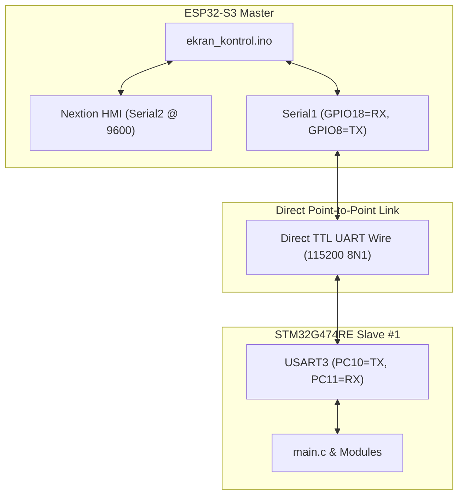

> [!WARNING]
> SUPERSEDED BY PHASE 4.6 DESIGN BASELINE

# EAGLEULTRASONİK — Mevcut Prototip vs Nihai Üretim Mimarisi (Current vs Production Architecture)

> **Doküman Statüsü:** Lead Embedded Systems Architect Output  
> **Tarih:** 10 Ağustos 2026  
> **Revizyon:** Rev.2 Design Freeze Challenge

---

## 1. Mimarilerin Karşılaştırılması ve Ayrımı

Bu projede **Mevcut Masaüstü Prototipi (Current Prototype)** ile **Tasarlanan Nihai Üretim Mimarisi (Intended Production Architecture)** kesin çizgilerle birbirinden ayrılmıştır.

```
CURRENT PROTOTYPE (Masaüstü Prototip):
- 1 Adet ESP32-S3 Master
- 1 Adet STM32G474RE Slave (DIP SW = ID 1 / BENCH_DEV_MODE_ID = 1)
- Doğrudan Noktadan Noktaya (Point-to-Point) UART TTL Bağlantısı (115200 8N1)
- RS485 Dönüştürücü Donanımı HENÜZ MEVCUT DEĞİLDİR.

INTENDED PRODUCTION SYSTEM (Nihai Üretim Sistemi):
- 1 Adet ESP32-S3 Master
- N Adet STM32G474RE Slave (1..10 Havuz/Tank)
- UART -> RS485 Transceiver -> Ortak Paylaşımlı RS485 Veriyolu (Multi-Drop Bus) -> RS485 Transceiver -> STM32
```

---

## 2. Mevcut Prototip Mimarisi (Current Prototype)

Masaüstü prototipinde donanımsal RS485 transceiver çipleri lehimli veya bağlı değildir. ESP32'nin `Serial1` (GPIO18=RX, GPIO8=TX) portu, tek bir STM32G474RE kartının `USART3` (PC11=RX, PC10=TX) portuna doğrudan jumper kablolarla bağlıdır.



---

## 3. Nihai Üretim Mimarisi (Intended Production System)

Nihai üretim sisteminde, ESP32 Master ve N adet (1..10) STM32 Slave kartı endüstriyel ortamlarda gürültü bağışıklığı sağlamak amacıyla diferansiyel **RS485 veriyolu (bus)** üzerinden haberleşecektir.

```mermaid
graph TD
    subgraph Master Unit [ESP32-S3 Master Unit]
        ESP["ESP32-S3 Controller"]
        ESP_UART["Serial1 (115200 8N1)"]
        ESP_TRX["Master RS485 Transceiver\n(Tx/Rx Differential)"]
        ESP <--> ESP_UART <--> ESP_TRX
    end

    subgraph Industrial Interconnect
        RS485_BUS["Shared Industrial RS485 Multi-Drop Bus\n(Twisted Pair A/B Differential Lines)"]
        ESP_TRX <--> RS485_BUS
    end

    subgraph Slave Tank 1 [STM32G4 Tank #1]
        TRX_1["RS485 Transceiver #1"]
        STM_1["STM32G474RE (MY_TANK_ID=1)"]
        TRX_1 <--> STM_1
    end

    subgraph Slave Tank 2 [STM32G4 Tank #2]
        TRX_2["RS485 Transceiver #2"]
        STM_2["STM32G474RE (MY_TANK_ID=2)"]
        TRX_2 <--> STM_2
    end

    subgraph Slave Tank N [STM32G4 Tank #N (N ≤ 10)]
        TRX_N["RS485 Transceiver #N"]
        STM_N["STM32G474RE (MY_TANK_ID=N)"]
        TRX_N <--> STM_N
    end

    RS485_BUS <--> TRX_1
    RS485_BUS <--> TRX_2
    RS485_BUS <--> TRX_N
```

---

## 4. Donanımsal Bilinmeyenler (Hardware UNKNOWN Matrix)

RS485 katmanına ait elektriksel ve donanımsal detaylar STM32 ve ESP32 kaynak kodlarında yer almamaktadır. Koddan doğrulanamayan aşağıdaki parametreler **UNKNOWN (Bilinmiyor / Donanım Tasarımına Bağlı)** olarak işaretlenmiştir:

| Parameter / Hardware Feature | Status | Source Evidence | Note |
| --- | --- | --- | --- |
| **RS485 Transceiver Modeli** | `UNKNOWN` | Kodda tanımlı değil | Örn: MAX485, SN65HVD72 vb. |
| **Yön Kontrolü (DE/RE Pin Management)** | `UNKNOWN` | Kodda DE/RE GPIO toggling yok | Donanımsal Otomatik Yön Kontrollü (Auto-Direction) transceiver varsayılmaktadır. |
| **Hat Sonlandırma Direnci (Termination)** | `UNKNOWN` | Donanım şeması gerekli | Otobüs uçlarında 120 Ω direnç olup olmadığı. |
| **Fail-Safe Bias Dirençleri** | `UNKNOWN` | Donanım şeması gerekli | Hat boştayken A/B diferansiyel voltaj koruması. |
| **Maksimum Kablo Uzunluğu & Topoloji** | `UNKNOWN` | Donanım spesifikasyonu | Yıldız (Star) vs Papatya Dizimi (Daisy-Chain) hattı. |
