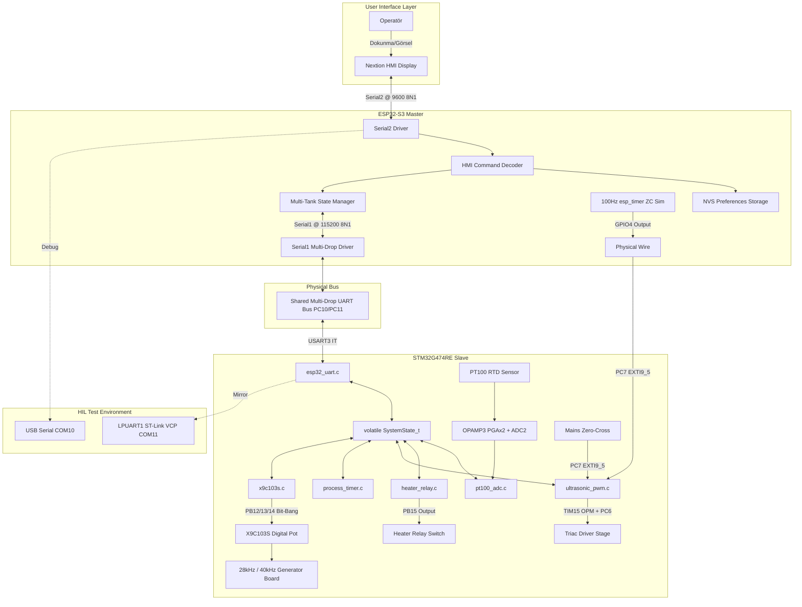
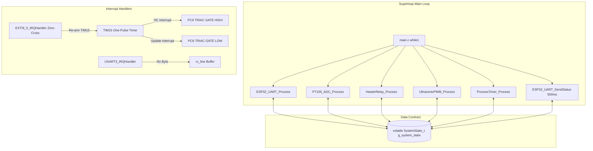

> [!WARNING]
> SUPERSEDED BY PHASE 4.6 DESIGN BASELINE

# EAGLEULTRASONİK — System Master Document & Technical Specification

> **Doküman Statüsü:** Lead Embedded Systems Architect Master Reference  
> > [!WARNING]
> > **NOTE:** ARCHITECTURAL ASSUMPTIONS IN THIS DOCUMENT ARE SUPERSEDED BY [design-baseline-v2.md](file:///C:/Users/ern0e/EAGLEULTRASONiK/.agent/reports/design-baseline-v2.md) (Phase 4.6). Refer to v2 Baseline for production design.  
> **Tarih:** 10 Ağustos 2026  
> **Repository:** `C:\Users\ern0e\EAGLEULTRASONiK`

---

## 1. Repository Inventory Table

| Component | File | Purpose | Depends On | Used By |
| --- | --- | --- | --- | --- |
| **System State** | [system_state.h](file:///C:/Users/ern0e/EAGLEULTRASONiK/STM32/Ultrasonik_G4_Master/Core/Inc/system_state.h), [system_state.c](file:///C:/Users/ern0e/EAGLEULTRASONiK/STM32/Ultrasonik_G4_Master/Core/Src/system_state.c) | Modüller arası ortak volatile durum sözleşmesi | None | `main.c`, `esp32_uart.c`, `pt100_adc.c`, `heater_relay.c`, `ultrasonic_pwm.c`, `process_timer.c` |
| **STM32 Core** | [main.c](file:///C:/Users/ern0e/EAGLEULTRASONiK/STM32/Ultrasonik_G4_Master/Core/Src/main.c), [main.h](file:///C:/Users/ern0e/EAGLEULTRASONiK/STM32/Ultrasonik_G4_Master/Core/Inc/main.h) | Süper-döngü, sistem başlangıcı, DIP SW / Flash ID yönetimi | HAL Drivers, All STM32 Modules | MCU System |
| **STM32 UART** | [esp32_uart.c](file:///C:/Users/ern0e/EAGLEULTRASONiK/STM32/Ultrasonik_G4_Master/Core/Src/esp32_uart.c), [esp32_uart.h](file:///C:/Users/ern0e/EAGLEULTRASONiK/STM32/Ultrasonik_G4_Master/Core/Inc/esp32_uart.h) | USART3 ASCII Multi-Drop bus alım/gönderim & LPUART1 HIL echo | `system_state.h`, `x9c103s.h`, HAL UART | `main.c` loop, ESP32 Master |
| **PT100 ADC** | [pt100_adc.c](file:///C:/Users/ern0e/EAGLEULTRASONiK/STM32/Ultrasonik_G4_Master/Core/Src/pt100_adc.c), [pt100_adc.h](file:///C:/Users/ern0e/EAGLEULTRASONiK/STM32/Ultrasonik_G4_Master/Core/Inc/pt100_adc.h) | OPAMP3 (PGAx2) + ADC2 sıcaklık okuma ve doğrulama | `system_state.h`, HAL ADC/OPAMP | `main.c` loop |
| **Heater Relay** | [heater_relay.c](file:///C:/Users/ern0e/EAGLEULTRASONiK/STM32/Ultrasonik_G4_Master/Core/Src/heater_relay.c), [heater_relay.h](file:///C:/Users/ern0e/EAGLEULTRASONiK/STM32/Ultrasonik_G4_Master/Core/Inc/heater_relay.h) | PB15 ±1.0°C histerezisli ısıtıcı röle anahtarlama | `system_state.h`, HAL GPIO | `main.c` loop |
| **Ultrasonic PWM**| [ultrasonic_pwm.c](file:///C:/Users/ern0e/EAGLEULTRASONiK/STM32/Ultrasonik_G4_Master/Core/Src/ultrasonic_pwm.c), [ultrasonic_pwm.h](file:///C:/Users/ern0e/EAGLEULTRASONiK/STM32/Ultrasonik_G4_Master/Core/Inc/ultrasonic_pwm.h) | EXTI9_5 Zero-cross & TIM15 OPM triyak güç sürüşü & soft-start | `system_state.h`, HAL TIM/EXTI | `main.c` loop, Donanım Kesmeleri |
| **Process Timer** | [process_timer.c](file:///C:/Users/ern0e/EAGLEULTRASONiK/STM32/Ultrasonik_G4_Master/Core/Src/process_timer.c), [process_timer.h](file:///C:/Users/ern0e/EAGLEULTRASONiK/STM32/Ultrasonik_G4_Master/Core/Inc/process_timer.h) | 1Hz kaymasız geri sayım süreç zamanlayıcısı | `system_state.h`, `main.h` | `main.c` loop |
| **X9C103S Pot** | [x9c103s.c](file:///C:/Users/ern0e/EAGLEULTRASONiK/STM32/Ultrasonik_G4_Master/Core/Src/x9c103s.c), [x9c103s.h](file:///C:/Users/ern0e/EAGLEULTRASONiK/STM32/Ultrasonik_G4_Master/Core/Inc/x9c103s.h) | 28kHz/40kHz çift frekans adımlama sürücüsü | `main.h`, HAL GPIO | `main.c` init, `esp32_uart.c` |
| **ESP32 Master** | [ekran_kontrol.ino](file:///C:/Users/ern0e/EAGLEULTRASONiK/esp32/ekran_kontrol/ekran_kontrol.ino) | Nextion HMI, NVS reçeteleri, tank yönetimi, ZC simülatör | Arduino, Preferences, esp_timer | Nextion HMI, STM32 Slaves |
| **HMI Interface** | `EKRAN/arayuz.tft`, `arayuz.HMI` | Dokunmatik ekran grafik arayüzü | Nextion Display | ESP32 Serial2 |
| **HIL Test Suite**| [test_hil_uart.py](file:///C:/Users/ern0e/EAGLEULTRASONiK/test_hil_uart.py) | Hardware-in-the-Loop otomatik regresyon testi | `pyserial`, `unittest` | Host PC (COM10/COM11) |
| **Legacy Code** | `STM32/.../Eski_PIC_Kodlari/500W_Display.mbas` | Eski MikroBasic PIC referans kodu | None (Aktif değil) | None |

---

## 2. System Purpose

### 2.1. Teknik Olmayan Özeti (Non-Technical Summary)
Bu makine, endüstriyel parçaların (tıbbi aletler, otomotiv parçaları, hassas kalıplar) sıcak su ve yüksek frekanslı ses dalgaları (ultrasonik kavitasyon) kullanılarak otomatik olarak yıkanmasını sağlar. Operatör dokunmatik ekrandan kaç dakika ve kaç derece sıcaklıkta yıkama yapacağını seçer. Sistem suyu ayarlanan sıcaklıkta tutar, ultrasonik kavitasyonu başlatır ve süre bittiğinde otomatik olarak durur.

### 2.2. Teknik Firmware Özeti (Technical Firmware Purpose)
Firmware; çoklu tank (1-10 havuz) desteğine sahip, tek bir ESP32-S3 Master ve n adet STM32G474RE Slave mikrodenetleyiciden oluşan asimetrik dağıtık bir gerçek zamanlı kontrol sistemidir.

### 2.3. Veri İletim Hattı Pipeline
$$\text{USER} \xrightarrow{\text{Dokunma}} \text{HMI} \xrightarrow{\text{Serial2 9600}} \text{ESP32} \xrightarrow{\text{Multi-Drop 115200}} \text{STM32} \xrightarrow{\text{Control Loop}} \text{HARDWARE} \xrightarrow{\text{Kavitasyon/Isı}} \text{PROCESS}$$

---

## 3. Complete System Architecture

---

## 4. ESP32 Deep Analysis

### 4.1. Fonksiyon Analiz Tablosu

| Function | Purpose | Input | Output | Side Effect | Timing | Called By | Calls |
| --- | --- | --- | --- | --- | --- | --- | --- |
| `setup()` | Sistem donanımlarını ve NVS'i ilklendirir | None | None | Serial portlar ve ZC timer başlar | Once at boot | Core 1 Main | `Serial.begin`, `zcSimBaslat`, `nvsYukle`, `stmSetpointleriGonder` |
| `loop()` | Ana olay döngüsü, UART okuma ve HMI tazeleme | None | None | Ekran ve otobüs verileri sürekli işlenir | Continuous | Core 1 Main | `hatOku`, `komutIsle`, `stmTelemetryIsle`, `nextionGonder` |
| `isKartBagli()` | Seçili tankın canlılık durumunu sorgular | `goz_id` | `bool` | None | Instant | `baslatmaEngelliMi`, `loop` | `millis()` |
| `baslatmaEngelliMi()` | Çevrimdışı kart için çalıştırmayı engeller | None | `bool` | HMI'ya "Kart Yok!" basar | Instant | `komutIsle` | `isKartBagli`, `nextionGonder` |
| `zcSimBaslat()` | 100Hz kare dalga ZC simülatörünü başlatır | None | None | GPIO4 periyodik toggle edilir | 5000µs ISR | `setup` | `esp_timer_create`, `esp_timer_start_periodic` |
| `nvsYukle()` | Reçeteleri NVS Flash'tan okur | None | None | `p_sure`, `p_sicaklik` dizilerini günceller | Boot time | `setup` | `Preferences.getInt` |
| `nvsKaydet()` | Reçeteleri NVS Flash'a yazar | None | None | NVS hafızası güncellenir | On SAVE | `komutIsle` | `Preferences.putInt` |
| `stmGonder()` | Otobüse adresli komut basar | `komut` | None | Serial1 TX hattına yazar | Instant | `stmSetTime`, `stmStart` vb. | `Serial1.print` |
| `stmTelemetryIsle()` | STM32 telemetrisini parse eder | `satir` | None | Tank durum dizilerini günceller | On RX | `loop` | `nextionGonder`, `stmSetpointleriGonder` |

---

## 5. STM32 Deep Analysis

### 5.1. Modül İşlev Haritası
- **`main.c`**: İşlemci saatini 170 MHz'e kurar. Flash/DIP switch okumasıyla `MY_TANK_ID` atar. Modül `Init` fonksiyonlarını sırayla çağırır ve süper-döngüde turlatır.
- **`system_state.c`**: Global `volatile SystemState_t g_system_state` struct yapısını `0` ve varsayılan mod değerleriyle ilklendirir.
- **`esp32_uart.c`**: `USART3` üzerinden ASCII komutlarını `T<ID>:` filtresiyle alır (`HAL_UART_Receive_IT`). 500ms'de bir `STAT,...` telemetrisini hem USART3'e hem LPUART1'e basar.
- **`pt100_adc.c`**: OPAMP3 çıkışını ADC2 ile 12-bit okur. Sıcaklık doğruluğunu aralık penceresinde (-10°C..110°C) denetler.
- **`heater_relay.c`**: `PB15` ısıtıcı rölesini `setpoint_temp_c` etrafında ±1.0°C histerezis ile açıp kapatır.
- **`ultrasonic_pwm.c`**: `PC7` zero-cross EXTI yükselen kenarında `TIM15` One-Pulse sayıcısını tetikler. Firing delay dolduğunda `PC6` gate pinini HIGH yapar, darbe bittiğinde LOW yapar.
- **`process_timer.c`**: `HAL_GetTick()` tabanlı 1Hz driftsiz sayım yapar, süre bittiğinde modu `SYS_MODE_IDLE`'a çeker.
- **`x9c103s.c`**: `PB12` (CS), `PB13` (UD), `PB14` (INC) pinlerini bit-bang ile sürerek potansiyometreyi 28kHz (Step 40) veya 40kHz (Step 90) frekansına ayarlar.

---

## 6. Master System Diagrams

### 6.1. STM32 Yazılım Mimarisi Ve Modül İlişkileri

---

## 7. Senior Engineer Training Explanation (18 Soruda Sistem Rehberi)

1. **Bu Makine Nedir?** Yüksek frekanslı ses dalgaları ve ısıtılmış kimyasal sıvı kullanarak hassas metal/plastik parçaları temizleyen otomasyonlu yıkama banyosudur.
2. **Neden ESP32?** Zengin HMI (Nextion) haberleşmesi, kalıcı NVS hafızası, hızlı grafik yönetimi ve Wi-Fi/Bluetooth genişleme potansiyeli için.
3. **Neden STM32?** Donanımsal EXTI ve esnek zamanlayıcılarıyla şebeke zero-cross senkronlu hassas triyak sürüşü, OPAMP+ADC sıcaklık ölçümü ve endüstriyel determinizm için.
4. **Neden Dağıtık Mimari?** Tek bir ESP32'nin 10 tankın hassas donanım zamanlamalarını kaçırmasını engellemek için. Her tank kendi STM32'si ile bağımsız otonom çalışır.
5. **Tek Bir Tank Nasıl Çalışır?** STM32 sıcaklığı okur, röleyi sürer, zero-cross geldikçe triyağı tetikler ve süreyi geri sayar.
6. **Çoklu Tank Nasıl Çalışır?** 10 adet STM32 kartı aynı TX/RX UART hattına paralel bağlanır. Komutlar `T<ID>:` önekiyle adreslenir.
7. **Sıcaklık Kontrolü Nasıl Çalışır?** PT100 OPAMP3 ile yükseltilip ADC2 ile okunan sıcaklık, setpoint etrafında ±1.0°C histerezis bandı ile bang-bang röle anahtarlar.
8. **Ultrasonik Güç Kontrolü Nasıl Çalışır?** Şebeke zero-cross sinyalinden sonra `TIM15` zamanlayıcısı geciktirilir. Gecikme ne kadar azsa faz açısı o kadar genişler ve güç artar.
9. **Frekans Kontrolü Nasıl Çalışır?** X9C103S dijital potansiyometresi adımlanarak kavitasyon jeneratör kartının rezonans frekansı 28 kHz veya 40 kHz yapılır.
10. **UART Nasıl Çalışır?** ASCII satır tabanlı 115200 baud haberleşme. ESP32 komut yollar, STM32 her 500ms'de `STAT,...` telemetrisi yayınlar.
11. **HMI Nasıl Çalışır?** Nextion dokunmatik ekran `Serial2` üzerinden `\xFF\xFF\xFF` sonlandırıcı mesajlar gönderir ve alır.
12. **Reçete Nasıl Çalışır?** P1, P2, P3 süre ve sıcaklık değerleri ESP32 NVS belleğinde kalıcı tutulur, seçilince STM32'ye aktarılır.
13. **START Basılınca Ne Olur?** ESP32 setpoint'leri iletir, `T<ID>:START` yollar; STM32 modu `RUNNING` yapar, triyak soft-start başlatır ve geri sayım başlar.
14. **STOP Basılınca Ne Olur?** ESP32 `T<ID>:STOP` yollar; STM32 modu `IDLE` yapar, triyağı ve röleyi anında keser.
15. **Bir Arıza Oluşunca Ne Olur?** PT100 koparsa veya ZC kaybolursa STM32 `SYS_MODE_FAULT` moduna geçer, yükleri kapatır ve telemetride hata kodunu bildirir.
16. **En Tehlikeli Kısımlar Nelerdir?** IWDG eksikliği (MCU donarsa yangın riski) ve `BENCH_DEV_MODE_ID = 1` kalması (tüm kartların tek ID ile otobüsü çökertmesi).
17. **Mevcut Sınırlamalar Nelerdir?** ASCII haberleşmede CRC/ACK olmaması, ESP32 String heap bölünmesi riski.
18. **Nihai Üretim Mimarisi Nasıl Olmalıdır?** IWDG aktif, dairesel UART ring buffer'lı, CRC8 kontrol kodlu, non-blocking ve modüler donanım yapısı.
