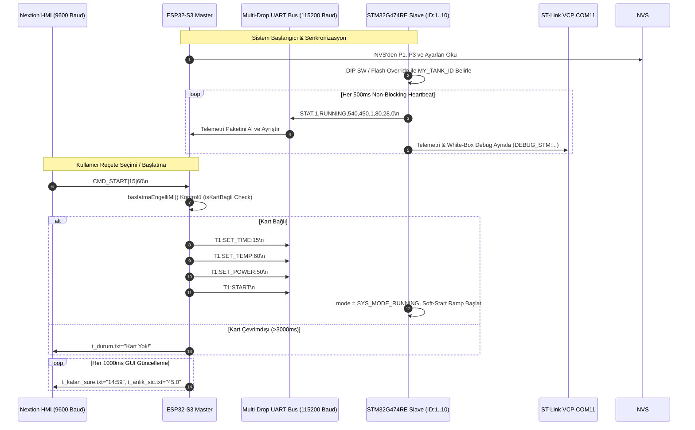

> [!WARNING]
> SUPERSEDED BY PHASE 4.6 DESIGN BASELINE

# ULTRASONİK YIKAMA MAKİNESİ — Sistem Mimari ve Tasarım Raporu

> **Doküman Statüsü:** Lead Embedded Systems Engineer Architecture Audit Output  
> **Tarih:** 10 Ağustos 2026  
> **Kapsam:** Çift Çekirdekli (ESP32-S3 + STM32G474RE) Çok Noktalı (Multi-Drop) Mimari Yapısı

---

## 1. Sistem Genel Mimarisi ve Düğüm Rolleri

Sistem, merkezi bir kullanıcı arayüzü ve reçete yöneticisi (**Master**) ile bu merkeze bağlı n sayıda bağımsız, otonom yıkama tankı kontrolcüsünden (**Slave**) oluşan asimetrik dağıtık bir sistemdir.

```mermaid
graph TD
    subgraph Master Tier [Master - ESP32-S3]
        HMI_IF["Nextion HMI Sürücü\n(Serial2 - 9600 Baud)"]
        NVS_MGR["NVS Reçete Saklama\n(P1, P2, P3, Ayarlar)"]
        BUS_MGR["Multi-Drop Bus Yöneticisi\n(Serial1 - 115200 Baud)"]
        WDT_MGR["3000ms Çevrimdışı Watchdog\n(isKartBagli / baslatmaEngelliMi)"]
        ZC_SIM["100Hz Donanım Zamanlayıcı\n(esp_timer - GPIO4 Simülatör)"]
    end

    subgraph Physical Interconnect
        UART_BUS["Fiziksel Ortak UART Hattı\n(115200 8N1 Multi-Drop)"]
        ZC_LINE["Zero-Cross Simülasyon Hattı\n(GPIO4 -> PC7)"]
    end

    subgraph Slave Tier [Slave - STM32G474RE Node 1..10]
        S_STATE["System State Engine\n(IDLE / RUNNING / FAULT)"]
        S_PWM["Triyak Faz Açısı PWM\n(EXTI9_5 + TIM15 OPM + Soft-Start)"]
        S_ADC["PT100 Sıcaklık Okuma\n(OPAMP3 PGAx2 + ADC2 12-Bit)"]
        S_RELAY["Isıtıcı Röle Histerezisi\n(PB15 - ±1.0°C Deadband)"]
        S_TIMER["1Hz Süreç Zamanlayıcısı\n(Driftsiz Geri Sayım)"]
        S_X9C["X9C103S Dijital Pot\n(28kHz / 40kHz Silecek Kontrolü)"]
        S_FLASH["Dahili Flash Override\n(Bank 2 Page 127 - MY_TANK_ID)"]
    end

    HMI_IF <--> Master Tier
    BUS_MGR <--> UART_BUS
    ZC_SIM --> ZC_LINE
    UART_BUS <--> S_STATE
    ZC_LINE --> S_PWM

    S_STATE --> S_PWM
    S_STATE --> S_ADC
    S_STATE --> S_RELAY
    S_STATE --> S_TIMER
    S_STATE --> S_X9C
    S_FLASH --> S_STATE
```

---

## 2. Düğüm Sorumluluk Dağılımı (Responsibility Matrix)

| Görev / İşlev | Sorumlu İşlemci | Modül / Dosya | Açıklama / Mekanizma |
|---|---|---|---|
| **Kullanıcı Arayüzü (GUI)** | ESP32-S3 | `ekran_kontrol.ino` | Nextion HMI dokunmatik komutlarını işler, ekrana anlık değerleri basar. |
| **Reçete Yönetimi** | ESP32-S3 | `Preferences` (NVS) | P1, P2, P3 süre/sıcaklık şablonlarını ve servis parametrelerini saklar. |
| **Bağlantı Watchdog'u** | ESP32-S3 | `isKartBagli()` | 3000ms boyunca telemetrisi gelmeyen tankı pasife çeker, başlatmayı engeller. |
| **Zero-Cross Simülatörü** | ESP32-S3 | `zcSimBaslat()` | `esp_timer` ile GPIO4'ten 100Hz kare dalga üreterek bench ortamını besler. |
| **Sıcaklık Ölçümü** | STM32G474RE | `pt100_adc.c` | OPAMP3 (PGA=2) ve ADC2 ile PT100 voltajını okur, -10°C..110°C pencereler. |
| **Isıtıcı Kontrolü** | STM32G474RE | `heater_relay.c` | Setpoint etrafında ±1.0°C histerezis ile bang-bang röle sürer. |
| **Ultrasonik Güç Kontrolü**| STM32G474RE | `ultrasonic_pwm.c` | 50Hz zero-cross EXTI + TIM15 One-Pulse modunda triyak faz açısı ateşler. |
| **Frekans Seçimi** | STM32G474RE | `x9c103s.c` | X9C103S potansiyometresini adımlayarak 28kHz (Step 40) / 40kHz (Step 90) ayarlar. |
| **Süreç Zamanlayıcı** | STM32G474RE | `process_timer.c` | 1Hz kaymasız geri sayım yapar; süre bitince sistemi IDLE'a çeker. |
| **Kimlik / Adres Saklama** | STM32G474RE | `main.c` / Flash | Flash Bank 2 Page 127 (`0x0807F800`) ve DIP Switch ile `MY_TANK_ID` belirler. |

---

## 3. Haberleşme Mimarisi ve Veri Akış Şeması

Sistemdeki veri akışı ASCII satır tabanlı protokoller üzerinden gerçekleştirilir:



---

## 4. Durum Makinesi (State Machine) ve Emniyet Kilitleri

STM32 firmware'i 3 ana mod içeren deterministic bir durum makinesiyle işletilir:

```mermaid
stateDiagram-v8
    [*] --> SYS_MODE_IDLE: Boot / Power-On

    SYS_MODE_IDLE --> SYS_MODE_RUNNING: RX 'T<ID>:START' (Eğer FAULT yoksa)
    SYS_MODE_RUNNING --> SYS_MODE_IDLE: Kalan Süre == 0 (ProcessTimer)
    SYS_MODE_RUNNING --> SYS_MODE_IDLE: RX 'T<ID>:STOP'

    SYS_MODE_RUNNING --> SYS_MODE_FAULT: PT100 Kopuk/Kısa (0x01 / 0x02)
    SYS_MODE_RUNNING --> SYS_MODE_FAULT: Zero-Cross Kaybı > 500ms (0x04)
    SYS_MODE_IDLE --> SYS_MODE_FAULT: PT100 Kopuk/Kısa

    SYS_MODE_FAULT --> SYS_MODE_IDLE: RX 'T<ID>:STOP' (Fault Reset / Ack)

    note right of SYS_MODE_FAULT
        Triyak zorla kapatılır (TriacForceOff)
        Isıtıcı rölesi kapatılır (RelaySet 0)
        Telemetride fault_flags basılır
        ESP32 ekranında "--.-" ve HATA gösterilir
    end note
```

---

## 5. Başlangıç Dizilimi (Startup Sequence)

1. **STM32 Boot Sequence:**
   - `HAL_Init()` -> `SystemClock_Config()` (170 MHz SYSCLK).
   - GPIO, ADC2, OPAMP3, TIM1, USART3, LPUART1 donanım ilklendirmeleri.
   - `BENCH_DEV_MODE_ID` kontrolü: Değer `>0` ise ID sabitlenir. `0` ise Flash `0x0807F800` okunur, geçerli magic (`0xA5A5A5A5`) yoksa DIP Switch okunur (`ReadDipSwitchId()`).
   - `SystemState_Init()`, `ESP32_UART_Init()` (IT RX kurulur), `PT100_ADC_Init()` (OPAMP3 başlatılır), `HeaterRelay_Init()`, `UltrasonicPWM_Init()` (TIM15 OPM kurulur), `ProcessTimer_Init()`, `X9C103S_Init()` (Wiper zeroing & 28kHz set).
   - Superloop döngüsüne girilir.

2. **ESP32 Boot Sequence:**
   - `Serial.begin(115200)` (USB Debug), `Serial2.begin(9600)` (HMI), `Serial1.begin(115200)` (STM32 Bus).
   - `zcSimBaslat()`: GPIO4 üzerinde `esp_timer` ile 100Hz kare dalga başlatılır.
   - Global dizi belleği sıfırlanır (`MAX_GOZ = 11`).
   - `nvsYukle()`: Flash'tan P1, P2, P3 şablonları okuma.
   - `stmSetpointleriGonder()`: Varsayılan setpoint'ler otobüse yayınlanır.
   - `loop()` döngüsüne girilir.
