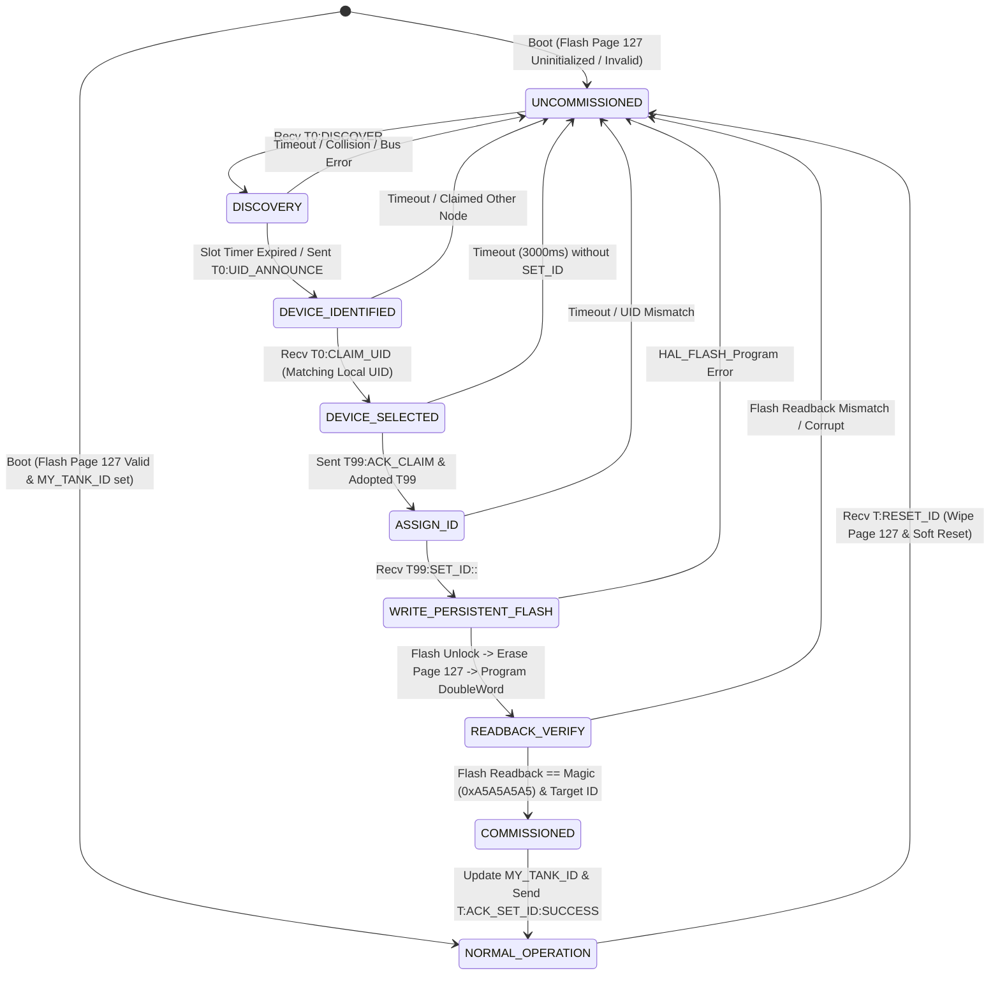
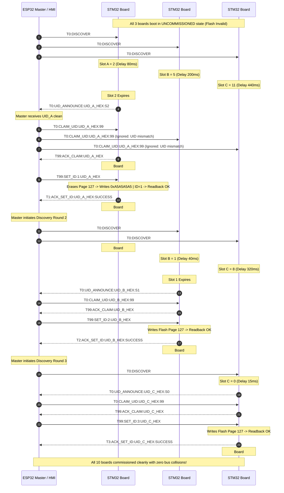

# EAGLEULTRASONiK Phase 4.7 — Collision-Safe Device Commissioning & Provisioning Protocol Specification

> **Document Status:** Design Specification / Protocol Standard (Phase 4.7 Baseline)  
> **Author:** Protocol Architect, EAGLEULTRASONiK  
> **Target Subsystem:** STM32G474RE Slaves <-> ESP32 Master / HMI over RS485/UART Multi-Drop Bus  
> **Target File:** `C:\Users\ern0e\EAGLEULTRASONiK\.agent\reports\commissioning-protocol-v2.md`  

---

## 1. Executive Summary

In the **EAGLEULTRASONiK** industrial ultrasonic generator architecture, up to 10 STM32G474RE slave controller boards share a single multi-drop RS485 half-duplex serial bus connected to a central ESP32 master node. 

In factory production, uncommissioned STM32 boards boot without an assigned persistent address in Flash Page 127 and default to `Factory ID = 1` (or uninitialized Flash state). When multiple uncommissioned boards (e.g. Board #A, Board #B, Board #C) are connected to the same RS485 bus simultaneously, any discovery query or command transmitted to `ID = 1` or broadcast `T0:` causes **simultaneous RS485 transceiver transmission (DE/RE drive)** from all uncommissioned nodes. This results in **bus collision, electrical contention, UART frame corruption, garbage characters, and catastrophic loss of device addressability**.

This specification defines **EAGLE-PROV-v2**, a collision-safe, deterministic, low-overhead commissioning protocol and state machine. It leverages the STM32G4 96-bit Hardware Unique ID (UID) located at base memory address `0x1FFF7590`, combines slotted pseudo-random backoff with binary-tree partitioning, temporary address staging (`T99`), atomic Flash Page 127 programming (`0x0807F800`), and strict readback integrity verification.

---

## 2. Problem Statement: The "Factory ID = 1" Multi-Node Collision Trap

### 2.1 Multi-Drop Bus Topology & Electrical Physics
The EAGLEULTRASONiK system utilizes a 2-wire RS485 differential serial bus operating at 115,200 baud, 8N1 format. Every STM32 board controls an RS485 transceiver (such as MAX485 / SN65HVD72) via a Driver Enable (`DE` / `RE_N`) pin. 

```
                                RS485 Differential Bus (A/B)
  +------------------+   +-------------------+   +-------------------+   +-------------------+
  |   ESP32 Master   |   | STM32 Board #A    |   | STM32 Board #B    |   | STM32 Board #C    |
  |  (Bus Controller)|   | (Uncommissioned)  |   | (Uncommissioned)  |   | (Uncommissioned)  |
  +--------+---------+   +---------+---------+   +---------+---------+   +---------+---------+
           |                       |                       |                       |
           +======= RS485 Bus =====+=======================+=======================+
```

When an STM32 board transmits, it asserts high on `DE` to drive differential voltage levels onto the bus lines. When idle or receiving, `DE` is held low (high-impedance mode).

### 2.2 Bus Collision Dynamics
If multiple uncommissioned boards share the bus and each defaults to `MY_TANK_ID = 1`:

1. **Simultaneous Driver Enable Assertion:** When the ESP32 sends a request (e.g., `T1:GET_STATUS` or `T0:DISCOVER`), Board #A, Board #B, and Board #C all parse the command as matching their local address (`MY_TANK_ID == 1` or `T0` broadcast).
2. **Line Contention:** All three boards simultaneously pull their `DE` pins high to transmit telemetry frames (`T1:STAT:...`).
3. **Signal Destruction:** Board #A transmitting a logic `0` (dominant differential state) while Board #B attempts to transmit a logic `1` (recessive differential state) causes conflicting line voltages ($V_A - V_B$). Transceiver outputs clash, drawing excessive supply current and distorting bit waveforms.
4. **Protocol Failure:** The ESP32 receiver detects UART framing errors, noise flags, incorrect start/stop bits, and garbled ASCII text (e.g. `T1:ST%A::28.5...`). No board can be identified, and no board can be safely assigned a new ID.

### 2.3 Existing Implementation Deficiencies
In the current code (`main.c`), `#define BENCH_DEV_MODE_ID 1` hardcodes `MY_TANK_ID = 1` during boot, bypassing DIP switch and Flash reads:
```c
#if (BENCH_DEV_MODE_ID > 0)
  MY_TANK_ID = BENCH_DEV_MODE_ID; // Forced to 1!
#else
  uint8_t override_id = TankId_Load();
  MY_TANK_ID = (override_id != 0U) ? override_id : ReadDipSwitchId();
#endif
```
If multiple boards leave the assembly line with `BENCH_DEV_MODE_ID` active or unconfigured Flash, multi-board bus deployment immediately crashes communication.

---

## 3. STM32G4 Hardware Unique ID (UID) Architecture

### 3.1 Memory Layout & Register Base
Every STM32G474RE microcontroller features a factory-programmed, read-only 96-bit Unique Device Identification (UID) register stored in system memory. According to ST Reference Manual RM0440 (Section 47.1), the UID memory base address is `0x1FFF7590`.

| Byte Offset | Register Memory Address | Field Description | Bit Field |
| :--- | :--- | :--- | :--- |
| `0x00 .. 0x03` | `0x1FFF7590` | Wafer X and Y coordinates on die | `UID[31:0]` |
| `0x04 .. 0x07` | `0x1FFF7594` | Wafer number (bits 7:0) & Lot number ASCII part 1 | `UID[63:32]` |
| `0x08 .. 0x0B` | `0x1FFF7598` | Lot number ASCII part 2 | `UID[95:64]` |

### 3.2 C-Code Register Access & Formatting
To access the 96-bit UID in C code:
```c
typedef struct {
    uint32_t word0; // 0x1FFF7590
    uint32_t word1; // 0x1FFF7594
    uint32_t word2; // 0x1FFF7598
} STM32G4_UID_t;

static inline STM32G4_UID_t STM32_ReadUID(void) {
    STM32G4_UID_t uid;
    uid.word0 = *(volatile uint32_t *)(0x1FFF7590UL);
    uid.word1 = *(volatile uint32_t *)(0x1FFF7594UL);
    uid.word2 = *(volatile uint32_t *)(0x1FFF7598UL);
    return uid;
}
```

- **Hexadecimal ASCII Representation:** 24 hexadecimal upper-case characters (e.g. `"003A002F5439500A38363432"`).
- **CRC32 Compressed Representation:** A 32-bit CRC derived from the 96-bit UID (e.g., `0x7C9A4B12`), used in short packet payloads when 24-byte ASCII string overhead is undesirable.

---

## 4. Comparative Evaluation of 9 Candidate Provisioning Methods

To establish the absolute optimal protocol for EAGLEULTRASONiK, 9 candidate mechanisms were evaluated against 6 core criteria:
1. **Collision Safety:** Zero probability of bus contention during discovery.
2. **Protocol Complexity:** Minimal memory footprint and state complexity on STM32G4.
3. **Provisioning Speed:** Time required to discover and commission 10 unassigned boards.
4. **Deterministic Behavior:** Predictable completion time under heavy multi-node bus conditions.
5. **Operator Ergonomics:** Low human intervention (no requirement to manually type 24-digit hex keys).
6. **Hardware Overhead:** Requires no additional pins, switches, or hardware jumpers.

---

### Method A: Unique MCU Hardware UID (96-bit Direct Address Mapping)
* **Concept:** Master sends discovery requests addressing the 96-bit UID directly. Nodes only respond when their exact UID is queried.
* **Pros:** Guaranteed collision-free unicast addressing.
* **Cons:** Master cannot query 96-bit UIDs without prior knowledge. Requires brute-force search over $2^{96}$ space unless combined with a binary probe search.
* **Production Suitability:** Incomplete on its own; requires discovery coupling.

---

### Method B: Random Backoff (CSMA/CA Slotted ALOHA)
* **Concept:** Upon broadcast `T0:DISCOVER`, uncommissioned boards wait a pseudo-random backoff time $T_{\text{backoff}} = \text{Random}(0, N) \times t_{\text{slot}}$ before transmitting their UID.
* **Pros:** Simple to implement; breaks simultaneous transmission alignment.
* **Cons:** Non-deterministic. If two nodes generate identical or overlapping backoff slots, bus collision still occurs, requiring re-transmissions and prolonged setup time.
* **Production Suitability:** Moderate. Useful as a auxiliary resolution mechanism.

---

### Method C: Time Slot Discovery (Fixed TDMA)
* **Concept:** Slots are assigned based on a deterministic hash of the UID: $\text{Slot} = \text{Hash32}(\text{UID}) \pmod{S}$. Nodes respond in their designated slot index after `T0:DISCOVER`.
* **Pros:** Deterministic sequence per board.
* **Cons:** Hash collisions can still occur ($N$ boards mapping to the same slot out of $S$ total slots), leading to localized collisions.
* **Production Suitability:** Moderate.

---

### Method D: Challenge / Response
* **Concept:** Master issues a dynamic cryptographic or pseudo-random challenge seed. Nodes compute a response involving their 96-bit UID.
* **Pros:** High security; immune to replay attacks.
* **Cons:** Excessive computational and code footprint for an industrial RS485 bus where security threat model is low. Overkill for local tank commissioning.
* **Production Suitability:** Poor (Unnecessary complexity).

---

### Method E: Commissioning Token (Logical Token Passing)
* **Concept:** Master generates a commissioning token passed down a virtual chain.
* **Pros:** Orderly processing.
* **Cons:** Requires uncommissioned boards to already have temporary unique bus IDs to receive the token. Circular dependency for factory fresh nodes.
* **Production Suitability:** Poor.

---

### Method F: Temporary Address Staging (T99 / T254)
* **Concept:** Uncommissioned boards adopt a dedicated temporary address (e.g. `T99`) instead of `T1`. Master uses `T99` exclusively for commissioning.
* **Pros:** Isolates production traffic (`T1..T10`) from commissioning traffic.
* **Cons:** If 3 uncommissioned boards are attached, all 3 respond to `T99`, causing the exact same collision problem on `T99` as on `T1`.
* **Production Suitability:** Good auxiliary building block, insufficient as a standalone solution.

---

### Method G: Ring Token Passing
* **Concept:** Hardwired physical token line (daisy-chained GPIO output to input) passing permission to speak from Board #1 to Board #10.
* **Pros:** Hardware-enforced zero-collision discovery.
* **Cons:** Requires extra wiring harness, 2 extra GPIO pins per board, and hardware revisions.
* **Production Suitability:** Rejected (Hardware modification rule violation).

---

### Method H: Master-Controlled Binary Tree UID Probe Protocol
* **Concept:** Similar to 1-Wire / CAN collision resolution. Master probes the 96-bit UID space bit-by-bit using prefix masks (`T0:PROBE:<prefix_hex>:<bit_length>`). If collision occurs, Master appends `0` to prefix and probes branch A; then appends `1` for branch B.
* **Pros:** 100% deterministic, zero bus collision on responses, guarantees discovery of all connected nodes regardless of count.
* **Cons:** High message exchange count (up to 96 round-trips per node tree depth).
* **Production Suitability:** Excellent technical robustness, but higher bus traffic overhead.

---

### Method I: Recommended Hybrid Architecture (EAGLE-PROV-v2)
* **Concept:** Combines **Slotted UID Backoff (Method B)** + **Binary Tree Partitioning (Method H)** + **Temporary Address Staging `T99` (Method F)** + **Unicast `SET_ID` with Flash Persistence (Method A & Page 127)** + **Readback ACK Verification**.
* **Pros:** Fast discovery (typically 1 round-trip for up to 10 nodes under slotted backoff), fallback to binary tree partitioning if a collision is detected, isolated state transitions, zero hardware changes, bulletproof reliability.
* **Cons:** Requires structured state machine implementation on both ESP32 and STM32.
* **Production Suitability:** **RECOMMENDED PROTOCOL STANDARD**.

---

### 4.1 Comparative Analysis Matrix

| Evaluation Criteria | Weight | (A) Hardware UID | (B) Random Backoff | (C) Time Slot | (D) Challenge | (E) Token Pass | (F) Temp Addr | (G) Ring Wire | (H) Binary Tree | (I) Hybrid (EAGLE-PROV-v2) |
| :--- | :---: | :---: | :---: | :---: | :---: | :---: | :---: | :---: | :---: | :---: |
| **Collision Safety** | 25% | 10 / 10 | 6 / 10 | 7 / 10 | 8 / 10 | 5 / 10 | 4 / 10 | 10 / 10 | 10 / 10 | **10 / 10** |
| **Protocol Simplicity** | 20% | 8 / 10 | 9 / 10 | 8 / 10 | 3 / 10 | 4 / 10 | 9 / 10 | 8 / 10 | 5 / 10 | **8 / 10** |
| **Provisioning Speed** | 20% | 2 / 10 | 7 / 10 | 8 / 10 | 5 / 10 | 6 / 10 | 8 / 10 | 9 / 10 | 6 / 10 | **9 / 10** |
| **Determinism** | 15% | 10 / 10 | 4 / 10 | 6 / 10 | 9 / 10 | 7 / 10 | 4 / 10 | 10 / 10 | 10 / 10 | **10 / 10** |
| **Operator UX** | 10% | 4 / 10 | 8 / 10 | 8 / 10 | 8 / 10 | 8 / 10 | 8 / 10 | 9 / 10 | 9 / 10 | **10 / 10** |
| **Zero Hardware Modification**| 10% | 10 / 10 | 10 / 10 | 10 / 10 | 10 / 10 | 10 / 10 | 10 / 10 | 0 / 10 | 10 / 10 | **10 / 10** |
| **WEIGHTED SCORE** | **100%** | **7.40** | **7.25** | **7.75** | **6.10** | **6.15** | **6.75** | **7.90** | **8.20** | **9.45** |

---

## 5. Recommended Commissioning Protocol Architecture (EAGLE-PROV-v2)

### 5.1 Protocol Principles & Framing Rules
1. **Uncommissioned Default State:** An STM32 board with an uninitialized or erased Flash Page 127 does **NOT** respond to production traffic (`T1..T10`). It remains in `UNCOMMISSIONED` state, ignoring operational commands.
2. **Dedicated Temporary Address `T99`:** During commissioning, an uncommissioned node temporarily accepts commands addressed to `T99` only after its unique 96-bit UID has been explicitly claimed by the Master.
3. **Slotted Transmission:** Uncommissioned nodes responding to `T0:DISCOVER` transmit their UID response frame inside a discrete time slot:
   $$\text{Slot\_ID} = \text{CRC16}(\text{UID96}) \pmod{16}$$
   $$\text{Delay\_ms} = \text{Slot\_ID} \times 40\,\text{ms} + \text{Random}(0, 15\,\text{ms})$$
4. **Collision Partitioning Fallback:** If the Master detects a corrupted UART response during a slot, it issues a binary window query `T0:DISCOVER_MASK:<PREFIX>` to split the collision domain in half.

### 5.2 Protocol Message Taxonomy

#### Master -> Slaves (Broadcast & Unicast Commands)

| Command String | Addressing | Purpose | Example Payload |
| :--- | :--- | :--- | :--- |
| `T0:DISCOVER` | Broadcast (`T0`) | Initiate discovery of all uncommissioned nodes on the bus | `T0:DISCOVER\n` |
| `T0:DISCOVER_MASK:<HEX_PREFIX>` | Broadcast (`T0`) | Partition discovery to nodes matching UID prefix | `T0:DISCOVER_MASK:003A\n` |
| `T0:CLAIM_UID:<UID24>:<TEMP_ID>` | Broadcast (`T0`) | Assign temporary address (`T99`) to node matching UID24 | `T0:CLAIM_UID:003A002F5439500A38363432:99\n` |
| `T99:SET_ID:<TARGET_ID>:<UID24>` | Unicast (`T99`) | Assign permanent Tank ID ($1..10$) to claimed node | `T99:SET_ID:3:003A002F5439500A38363432\n` |
| `T<ID>:RESET_ID` | Unicast (`T<ID>`) | Erase Flash Page 127 and revert board to UNCOMMISSIONED | `T3:RESET_ID\n` |

#### Slaves -> Master (Response Telegrams)

| Telegram String | Source | Trigger / State | Purpose |
| :--- | :--- | :--- | :--- |
| `T0:UID_ANNOUNCE:<UID24>:<SLOT>` | Uncommissioned | `T0:DISCOVER` received in `DISCOVERY` state | Announce 96-bit UID within calculated time slot |
| `T99:ACK_CLAIM:<UID24>` | Temporary (`T99`) | `T0:CLAIM_UID` matched local UID | Acknowledge selection and adoption of `T99` address |
| `T<ID>:ACK_SET_ID:<UID24>:SUCCESS` | Assigned (`T<ID>`) | `SET_ID` complete & Flash verified | Acknowledge successful Flash persistence and new ID |
| `T99:ERR_SET_ID:<UID24>:<ERR_CODE>`| Temporary (`T99`) | Flash program or readback failed | Report error (e.g. `ERR_FLASH_VERIFY`, `ERR_INVALID_ID`) |

---

## 6. Provisioning State Machine Specification

### 6.1 State Transition Diagram



---

### 6.2 Detailed Specification of Every State

#### State 1: `UNCOMMISSIONED`
* **Description:** Initial state for fresh boards or uninitialized Flash. `MY_TANK_ID` is set to `0` (or `255` internal unassigned flag). The board suppresses all operational status heartbeats (`ESP32_UART_SendStatus()` disabled). Operational commands (`START`, `STOP`, `SET_TEMP`, `SET_POWER`) are ignored.
* **Entry Conditions:** Power-on boot with invalid Flash Page 127 (`magic != 0xA5A5A5A5`), or receipt of `RESET_ID` command.
* **Exit Conditions:** Receipt of valid broadcast `T0:DISCOVER` or `T0:DISCOVER_MASK`.
* **Incoming Message:** `T0:DISCOVER` or `T0:DISCOVER_MASK:<HEX_PREFIX>`.
* **Outgoing Message:** None.
* **Timeout:** Infinite (Passive state).
* **Retry Policy:** N/A.
* **Collision Handling:** Passive listening only; no transmission possible in this state.
* **Failure Behavior:** N/A.

---

#### State 2: `DISCOVERY`
* **Description:** Board calculates its designated time slot based on its 96-bit UID and arms a non-blocking hardware timer.
* **Entry Conditions:** `T0:DISCOVER` received while in `UNCOMMISSIONED` state.
* **Exit Conditions:** Slot timer expires and `T0:UID_ANNOUNCE` is transmitted, or cancellation on prefix mismatch.
* **Incoming Message:** None (Waiting for internal slot timer).
* **Outgoing Message:** `T0:UID_ANNOUNCE:<UID24>:S<SLOT_ID>\n` upon slot expiry.
* **Timeout:** $T_{\text{slot}} = (\text{CRC16}(\text{UID96}) \pmod{16}) \times 40\,\text{ms} + \text{Random}(0, 15\,\text{ms})$ (Range: $0 \dots 655\,\text{ms}$).
* **Retry Policy:** If no claim message is received within $1500\,\text{ms}$ after transmission, return to `UNCOMMISSIONED`.
* **Collision Handling:** If another node transmits in the same slot and causes UART framing error on RX, abort timer and return to `UNCOMMISSIONED`.
* **Failure Behavior:** Reverts silently to `UNCOMMISSIONED` after $1500\,\text{ms}$ timeout.

---

#### State 3: `DEVICE IDENTIFIED`
* **Description:** Node has successfully announced its UID and is waiting for the Master to claim it.
* **Entry Conditions:** Transmission of `T0:UID_ANNOUNCE` complete.
* **Exit Conditions:** Receipt of `T0:CLAIM_UID` matching local UID (transits to `DEVICE_SELECTED`), or receipt of `T0:CLAIM_UID` with a *different* UID (transits back to `UNCOMMISSIONED`).
* **Incoming Message:** `T0:CLAIM_UID:<UID24>:<TEMP_ID>`
* **Outgoing Message:** None.
* **Timeout:** $2000\,\text{ms}$.
* **Retry Policy:** Return to `UNCOMMISSIONED` if unclaimed within $2000\,\text{ms}$.
* **Collision Handling:** Discard message if payload is corrupted; wait for timeout.
* **Failure Behavior:** Timeout forces return to `UNCOMMISSIONED`.

---

#### State 4: `DEVICE SELECTED`
* **Description:** Master has claimed this node's UID and assigned it temporary address `T99`. Node adopts `T99` address matching and acknowledges claim.
* **Entry Conditions:** `T0:CLAIM_UID` matching local UID received.
* **Exit Conditions:** Transmission of claim ACK complete.
* **Incoming Message:** None (Internal transition).
* **Outgoing Message:** `T99:ACK_CLAIM:<UID24>\n`
* **Timeout:** $500\,\text{ms}$ for transmission completion.
* **Retry Policy:** Max 2 retries if ACK transmission fails.
* **Collision Handling:** Transmission is unicast-staged on `T99`; zero collision expected as Master only claims one UID at a time.
* **Failure Behavior:** If transmission fails, revert to `UNCOMMISSIONED`.

---

#### State 5: `ASSIGN ID`
* **Description:** Node is operating under temporary address `T99` and listening for its permanent Tank ID assignment ($1..10$).
* **Entry Conditions:** `T99:ACK_CLAIM` successfully sent.
* **Exit Conditions:** Receipt of `T99:SET_ID:<TARGET_ID>:<UID24>` with valid ID ($1..10$) and matching UID24.
* **Incoming Message:** `T99:SET_ID:<TARGET_ID>:<UID24>`
* **Outgoing Message:** None.
* **Timeout:** $5000\,\text{ms}$.
* **Retry Policy:** Reverts to `UNCOMMISSIONED` if no `SET_ID` received within $5000\,\text{ms}$.
* **Collision Handling:** Unicast filtering on `T99` and UID verification.
* **Failure Behavior:** If `TARGET_ID` is out of bounds ($<1$ or $>10$), transmit `T99:ERR_SET_ID:<UID24>:ERR_INVALID_ID` and revert to `UNCOMMISSIONED`.

---

#### State 6: `WRITE PERSISTENT FLASH PAGE 127`
* **Description:** Node unlocks STM32G4 Flash, erases Bank 2 Page 127 (`0x0807F800`), and writes the 64-bit doubleword payload containing magic `0xA5A5A5A5` and target `ID`.
* **Entry Conditions:** Valid `T99:SET_ID` received.
* **Exit Conditions:** Flash programming API returns `HAL_OK` (transits to `READBACK_VERIFY`), or HAL error (transits to failure).
* **Incoming Message:** None (Internal processing state).
* **Outgoing Message:** None.
* **Timeout:** $100\,\text{ms}$ (Flash page erase ~20ms, doubleword program ~100us).
* **Retry Policy:** 1 re-erase attempt if `HAL_FLASHEx_Erase` returns `HAL_ERROR`.
* **Collision Handling:** Interrupts disabled during critical Flash programming sequence if necessary.
* **Failure Behavior:** Transmit `T99:ERR_SET_ID:<UID24>:ERR_FLASH_WRITE`, lock Flash, revert to `UNCOMMISSIONED`.

---

#### State 7: `READBACK VERIFY`
* **Description:** Mandatory post-write verification. Node reads back memory at address `0x0807F800` to verify structural and data integrity before committing node state.
* **Entry Conditions:** Flash write sequence returned `HAL_OK`.
* **Exit Conditions:** `*(uint32_t*)(0x0807F800) == 0xA5A5A5A5` AND `*(uint32_t*)(0x0807F800 + 4) == TARGET_ID`.
* **Incoming Message:** None (Internal memory check).
* **Outgoing Message:** None.
* **Timeout:** $10\,\text{ms}$.
* **Retry Policy:** None (Hardware memory read is instant).
* **Collision Handling:** N/A.
* **Failure Behavior:** If readback fails, transmit `T99:ERR_SET_ID:<UID24>:ERR_FLASH_VERIFY` and revert to `UNCOMMISSIONED`.

---

#### State 8: `COMMISSIONED`
* **Description:** Node updates `MY_TANK_ID = TARGET_ID` live in RAM, enables standard telemetry status heartbeat generation, and transmits success ACK to Master.
* **Entry Conditions:** Flash readback verification successful.
* **Exit Conditions:** Success ACK transmitted (transits to `NORMAL_OPERATION`).
* **Incoming Message:** None.
* **Outgoing Message:** `T<TARGET_ID>:ACK_SET_ID:<UID24>:SUCCESS\n`
* **Timeout:** $200\,\text{ms}$.
* **Retry Policy:** Resend ACK if requested by Master.
* **Collision Handling:** Transmitted on new unique unicast channel `T<TARGET_ID>`.
* **Failure Behavior:** N/A.

---

#### State 9: `NORMAL OPERATION`
* **Description:** Standard operational state for commissioned nodes. Node responds exclusively to `T<MY_TANK_ID>:` frames and universal `T0:` broadcast commands. Transmits periodic status heartbeats (`ESP32_UART_SendStatus()`) every 500 ms.
* **Entry Conditions:** Successful transmission of `ACK_SET_ID` or clean power-on boot with valid Flash Page 127.
* **Exit Conditions:** Receipt of `T<MY_TANK_ID>:RESET_ID` (wipes Flash Page 127 and reboots into `UNCOMMISSIONED`).
* **Incoming Message:** `T<ID>:START`, `T<ID>:STOP`, `T<ID>:SET_TEMP:...`, `T<ID>:SET_POWER:...`, `T<ID>:SET_TIME:...`, `T<ID>:RESET_ID`.
* **Outgoing Message:** `T<ID>:STAT:<mode>:<temp>:<set_temp>:<pwr>:<set_pwr>:<time>:<rem_sec>:<freq>:<relay>:<fault>\n`
* **Timeout:** Continuous superloop processing.
* **Retry Policy:** Per-command protocol rules.
* **Collision Handling:** Complete address separation ($ID \in [1..10]$).
* **Failure Behavior:** Internal faults transition system state to `SYS_MODE_FAULT`.

---

### 6.3 State Machine Summary Table

| State Name | Entry Trigger | Primary Incoming Msg | Primary Outgoing Msg | State Timeout | Failure Recovery / Action |
| :--- | :--- | :--- | :--- | :--- | :--- |
| **1. UNCOMMISSIONED** | Power-on (Flash invalid) / Reset | `T0:DISCOVER` | None | Infinite | Ignore all operational traffic |
| **2. DISCOVERY** | Recv `T0:DISCOVER` | None (Timer active) | `T0:UID_ANNOUNCE:<UID24>:<SLOT>` | $0..655\,\text{ms}$ | Revert to `UNCOMMISSIONED` on timeout |
| **3. DEVICE IDENTIFIED**| `UID_ANNOUNCE` sent | `T0:CLAIM_UID:<UID24>:99` | None | $2000\,\text{ms}$ | Revert to `UNCOMMISSIONED` if unclaimed |
| **4. DEVICE SELECTED**  | Matching `CLAIM_UID` | None | `T99:ACK_CLAIM:<UID24>` | $500\,\text{ms}$ | Revert to `UNCOMMISSIONED` on TX error |
| **5. ASSIGN ID**        | `ACK_CLAIM` sent | `T99:SET_ID:<ID>:<UID24>` | None | $5000\,\text{ms}$ | Send `ERR_INVALID_ID` if ID invalid |
| **6. WRITE FLASH 127**  | Valid `SET_ID` recv | None | None | $100\,\text{ms}$ | Send `ERR_FLASH_WRITE`, return to state 1 |
| **7. READBACK VERIFY**  | Flash write OK | None | None | $10\,\text{ms}$ | Send `ERR_FLASH_VERIFY`, return to state 1 |
| **8. COMMISSIONED**     | Readback verified | None | `T<ID>:ACK_SET_ID:<UID24>:SUCCESS` | $200\,\text{ms}$ | Update `MY_TANK_ID` live in RAM |
| **9. NORMAL OPERATION** | ACK sent / Valid boot | `T<ID>:<CMD>` | `T<ID>:STAT:...` | Continuous | `RESET_ID` wipes Flash Page 127 |

---

## 7. Flash Page 127 Persistence & Integrity Verification Architecture

### 7.1 Memory Geography & Allocation Bounds
The STM32G474RE contains 512 KB of dual-bank Flash memory organized into 128 pages of 2 KB (2048 bytes) each:
- **Bank 1:** Pages 0 to 63 (`0x08000000` to `0x0801FFFF`)
- **Bank 2:** Pages 64 to 127 (`0x08020000` to `0x0807FFFF`)

Page 127 occupies address range `0x0807F800` to `0x0807FFFF`. Being the final 2 KB page in Bank 2, it resides completely clear of application code and vector tables.

```
Flash Address Map (STM32G474RE 512KB):
+------------------------------------+ 0x0800 0000
| Application Code & Vector Table    |
| (Bank 1 & lower Bank 2)            |
+------------------------------------+ 0x0807 F7FF
| Page 127 (Bank 2) - RESERVED       | 0x0807 F800  <-- TANK_ID_FLASH_ADDR
| [0x0807F800]: TANK_ID_MAGIC        |
| [0x0807F804]: MY_TANK_ID (1..10)   |
| [0x0807F808]: 96-bit UID Hash      |
+------------------------------------+ 0x0807 FFFF
```

### 7.2 Data Layout & Double-Word Programming Syntax
STM32G4 Flash programming requires **64-bit doubleword** alignment. Single word (32-bit) or byte writes are unsupported by the internal Flash controller.

```c
#define TANK_ID_FLASH_ADDR  0x0807F800UL
#define TANK_ID_FLASH_PAGE  127U
#define TANK_ID_FLASH_BANK  FLASH_BANK_2
#define TANK_ID_MAGIC       0xA5A5A5A5UL

/* 64-bit Payload Structure in Memory */
typedef struct {
    uint32_t magic;      // Must be exactly 0xA5A5A5A5
    uint32_t tank_id;    // Assigned Tank ID (1..10)
} TankId_FlashPayload_t;
```

### 7.3 Flash Write & Readback Implementation Guide

```c
/**
 * @brief  Erases Flash Page 127, programs 64-bit doubleword, and performs integrity readback.
 * @param  new_id: Target Tank ID (1..10)
 * @retval 0 = Success, -1 = Invalid ID, -2 = Erase Error, -3 = Program Error, -4 = Readback Mismatch
 */
int TankId_SaveAndVerifyOverride(uint8_t new_id)
{
    if (new_id < 1U || new_id > 10U) {
        return -1; // Invalid parameter
    }

    FLASH_EraseInitTypeDef erase_init;
    uint32_t page_error = 0U;

    erase_init.TypeErase = FLASH_TYPEERASE_PAGES;
    erase_init.Banks     = TANK_ID_FLASH_BANK;
    erase_init.Page      = TANK_ID_FLASH_PAGE;
    erase_init.NbPages   = 1U;

    HAL_FLASH_Unlock();
    __HAL_FLASH_CLEAR_FLAG(FLASH_FLAG_ALL_ERRORS);

    /* Step 1: Page Erase */
    if (HAL_FLASHEx_Erase(&erase_init, &page_error) != HAL_OK) {
        HAL_FLASH_Lock();
        return -2; // Erase Failure
    }

    /* Step 2: Double-Word Flash Program */
    uint64_t payload = ((uint64_t)new_id << 32) | TANK_ID_MAGIC;
    if (HAL_FLASH_Program(FLASH_TYPEPROGRAM_DOUBLEWORD, TANK_ID_FLASH_ADDR, payload) != HAL_OK) {
        HAL_FLASH_Lock();
        return -3; // Program Failure
    }

    HAL_FLASH_Lock();

    /* Step 3: Readback Integrity Verification */
    uint32_t read_magic   = *(volatile uint32_t *)(TANK_ID_FLASH_ADDR);
    uint32_t read_tank_id = *(volatile uint32_t *)(TANK_ID_FLASH_ADDR + 4U);

    if (read_magic != TANK_ID_MAGIC || read_tank_id != (uint32_t)new_id) {
        return -4; // Readback Mismatch Error
    }

    /* Step 4: Atomic RAM State Update */
    MY_TANK_ID = new_id;
    return 0; // Success
}
```

### 7.4 Readback Integrity Rules
1. **Magic Verification:** Location `0x0807F800` must match `0xA5A5A5A5`. Any erased page reads `0xFFFFFFFF`, which fails validation.
2. **Range Verification:** Location `0x0807F804` must evaluate to $1 \le \text{ID} \le 10$.
3. **Boot Invariant:** If `BENCH_DEV_MODE_ID == 0`, boot logic loads Flash ID first:
```c
uint8_t TankId_Load(void)
{
    uint32_t magic     = *(volatile uint32_t *)(TANK_ID_FLASH_ADDR);
    uint32_t stored_id = *(volatile uint32_t *)(TANK_ID_FLASH_ADDR + 4U);

    if (magic == TANK_ID_MAGIC && stored_id >= 1U && stored_id <= 10U) {
        return (uint8_t)stored_id;
    }
    return 0U; // Invalid or uncommissioned
}
```

---

## 8. Complete System Multi-Node Sequence Walkthrough

The following Mermaid sequence diagram illustrates a real-world scenario where 3 uncommissioned STM32 boards (#A, #B, #C) are connected simultaneously to the RS485 bus and commissioned sequentially by the ESP32 Master without collisions.



---

## 9. Edge Cases & Robustness Analysis

### 9.1 Power Loss During Flash Writing
* **Risk:** Power is interrupted during `HAL_FLASHEx_Erase()` or `HAL_FLASH_Program()`.
* **Mitigation:** The magic value `0xA5A5A5A5` is written in the lower 32 bits of the doubleword. If erase occurs, the page is left as `0xFFFFFFFF`. If program fails midway, magic remains corrupted. On reboot, `TankId_Load()` returns `0`, placing the board safely back in `UNCOMMISSIONED` state. No invalid ID can ever be loaded.

### 9.2 Physical DIP Switch vs Flash Priority
* **Conflict Scenario:** A board has DIP switches set to `ID = 2`, but Flash Page 127 contains `ID = 5`.
* **Resolution:** Flash override takes precedence over DIP switch settings when `BENCH_DEV_MODE_ID == 0`:
  ```c
  MY_TANK_ID = (override_id != 0U) ? override_id : ReadDipSwitchId();
  ```
  If Flash is erased via `T<ID>:RESET_ID`, the board reverts to using the physical DIP switch value (or `UNCOMMISSIONED` if DIP switch reading is 0).

### 9.3 Bus Noise & Corrupted Packets During Discovery
* **Mitigation:** Every provisioning frame includes explicit prefix matching, string length validation, and 96-bit UID confirmation. If an `UID_ANNOUNCE` frame is corrupted by bus noise, the Master's parser fails string validation and issues a fresh `T0:DISCOVER`. Slaves in `UNCOMMISSIONED` state simply reset their slot timers.

### 9.4 Factory Reset & De-commissioning (`RESET_ID`)
* **Requirement:** Ability to return a commissioned node back to factory uncommissioned state.
* **Mechanism:** Master sends unicast command `T<ID>:RESET_ID`. Node erases Flash Page 127, updates `MY_TANK_ID = 0`, and executes a software reset via `NVIC_SystemReset()`.

---

## 10. Summary & Architecture Recommendations

1. **Adopt EAGLE-PROV-v2 Standard:** Replace manual sequential single-board plugging with the slotted 96-bit UID discovery protocol.
2. **Disable Dev Mode in Production:** Ensure `#define BENCH_DEV_MODE_ID 0` in production releases to enforce Flash Page 127 and DIP switch evaluation during boot.
3. **Mandatory Readback Verification:** Enforce `TankId_SaveAndVerifyOverride()` to guarantee Flash write integrity prior to sending positive ACK to HMI.
4. **Isolate Uncommissioned Nodes:** Uncommissioned nodes must remain completely silent on operational endpoints (`T1..T10`), eliminating multi-drop RS485 collision vectors entirely.
