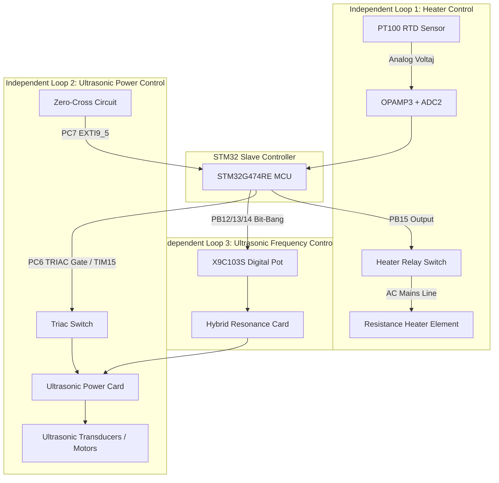

# EAGLEULTRASONİK — Kontrol Döngüleri Mimarisi (Control Loop Architecture)

> **Doküman Statüsü:** Control Loops Baseline Specification  
> **Tarih:** 10 Ağustos 2026  
> **Aşama:** Phase 4.6 Baseline Adjustment

---

## 1. Üç Bağımsız Kontrol Döngüsü (Three Independent Control Loops)

Bu sistemde birbiriyle fiziksel ve yazılımsal olarak ayrılmış **3 bağımsız kontrol döngüsü** bulunmaktadır:

```
1. HEATER CONTROL LOOP (Isıtıcı Sıcaklık Kontrolü):
   PT100 -> OPAMP3 + ADC2 -> Hysteresis Controller (±1.0°C) -> PB15 Relay -> RESISTANCE HEATER

2. ULTRASONIC POWER CONTROL LOOP (Ultrasonik Çıkış Gücü Kontrolü):
   PC7 Zero-Cross EXTI9_5 -> TIM15 OPM Timer -> PC6 TRIAC Gate -> POWER CARD -> ULTRASONIC MOTOR

3. ULTRASONIC FREQUENCY CONTROL LOOP (Ultrasonik Çıkış Frekansı Kontrolü):
   HMI (28/40kHz) -> ESP32 -> STM32 -> PB12/13/14 Bit-Bang -> X9C103S Pot -> HYBRID CARD -> POWER CARD FREQUENCY
```

---

## 2. Isıtıcı ve Ultrasonik Güç Hattı Ayrımı (Fiziksel Gerçeklik)

> [!IMPORTANT]
> **FİZİKSEL DONANIM GERÇEĞİ:** Isıtıcı rezistanslar Ultrasonik Güç Kartı'ndan (Power Card) **BESLENMEMEKTEDİR**. Isıtıcı rezistanslar harici şebeke besleme hattına `PB15` pinine bağlı mekanik röle üzerinden bağlıdır. Güç Kartı yalnızca ultrasonik dönüştürücü motorları sürer.



---

## 3. Sıcaklık Kontrol Algoritması Doğrulaması (Hysteresis / Bang-Bang)

- **Kaynak Kod İncelemesi ([heater_relay.c](file:///C:/Users/ern0e/EAGLEULTRASONiK/STM32/Ultrasonik_G4_Master/Core/Src/heater_relay.c)):**
  Mevcut kodda PID denetleyici (Proportional-Integral-Derivative) **YOKTUR**.
- **Mevcut Gerçek Uygulama:** `±1.0°C` ölü bantlı (deadband) Hysteresis / Bang-Bang denetleyicidir.
  $$\text{Röle Durumu} = \begin{cases} \text{AÇIK (HIGH)}, & T_{\text{anlik}} \le (T_{\text{hedef}} - 1.0^\circ\text{C}) \\ \text{KAPALI (LOW)}, & T_{\text{anlik}} \ge (T_{\text{hedef}} + 1.0^\circ\text{C}) \\ \text{Önceki Durum}, & (T_{\text{hedef}} - 1.0^\circ\text{C}) < T_{\text{anlik}} < (T_{\text{hedef}} + 1.0^\circ\text{C}) \end{cases}$$
- **PID Değerlendirmesi:** PID denetleyici mevcut baseline'da bulunmamaktadır. PID'ye geçiş **"Future Enhancement Candidate (V2)"** olarak kaydedilmiştir.
