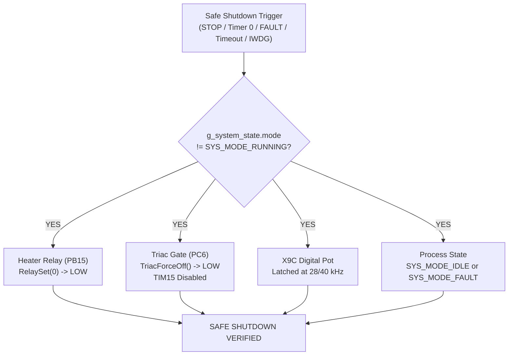

# EAGLEULTRASONiK Phase 4.7 Final Adversarial Safety Review Report

> **Document Status:** Official Safety & Architecture Audit Report  
> **Target System:** EAGLEULTRASONiK Dual-Core System (ESP32-S3 Master + STM32G474RE Multi-Drop Slaves)  
> **Scope:** Architecture, Safety Mechanisms, Failure Modes, Commissioning Protocols, Safe Shutdown Architecture  
> **Reviewer Role:** Adversarial Reviewer for Safety-Critical Embedded Systems  
> **Target File Path:** `C:\Users\ern0e\EAGLEULTRASONiK\.agent\reports\final-safety-review.md`

---

## 1. EXECUTIVE SUMMARY & SYSTEM RISK POSTURE

An exhaustive adversarial review of the **EAGLEULTRASONiK Phase 4.7** firmware, system architecture, and commissioning protocol was conducted. The audit inspected every source file in [STM32/Ultrasonik_G4_Master/Core/Src](file:///c:/Users/ern0e/EAGLEULTRASONiK/STM32/Ultrasonik_G4_Master/Core/Src) and [esp32/ekran_kontrol/ekran_kontrol.ino](file:///c:/Users/ern0e/EAGLEULTRASONiK/esp32/ekran_kontrol/ekran_kontrol.ino), evaluating physical signal timings, interrupt latency, memory persistence, multi-drop UART bus arbitration, and fault recovery.

### Overall Risk Assessment: 🔴 HIGH RISK (NOT READY FOR UNATTENDED PRODUCTION DEPLOYMENT)

While the architecture demonstrates strong foundational safety elements (e.g. non-blocking superloop execution, non-volatile magic-validated Flash storage, hardware PT100 window validation, and EXTI-driven phase control), **critical safety vulnerabilities, race conditions, missing hardware watchdogs, and multi-drop commissioning flaws remain**. 

If deployed in its current state, the system risks **thermal runaway (fire)**, **transducer destruction**, **multi-drop bus locking**, and **unintended parallel activation of uncommissioned tanks**.

---

## 2. RIGOROUS TECHNICAL ANALYSIS OF 15 CHALLENGE QUESTIONS

### Q1: Is Factory ID commissioning truly collision-safe on a multi-drop bus?
- **Risk Rating:** 🔴 **CRITICAL**
- **Code Evidence:** [esp32_uart.c:98-100](file:///c:/Users/ern0e/EAGLEULTRASONiK/STM32/Ultrasonik_G4_Master/Core/Src/esp32_uart.c#L98-L100), [ekran_kontrol.ino:203-209](file:///c:/Users/ern0e/EAGLEULTRASONiK/esp32/ekran_kontrol/ekran_kontrol.ino#L203-L209)
- **Technical Analysis:** `stmSetIdBroadcast(int yeniId)` in ESP32 transmits `"T0:SET_ID:<new_id>\n"` across the shared UART bus (`Serial1`). `ProcessLine()` in `esp32_uart.c` evaluates `if (tank_id != 0 && (uint8_t)tank_id != MY_TANK_ID) return;`. Address `T0:` is a universal broadcast. Every single uncommissioned (and commissioned!) STM32 board connected to the multi-drop line receives and executes this frame simultaneously. All boards immediately call `TankId_SaveOverride(new_id)` and overwrite Bank 2 Page 127 Flash with the same ID.
- **Failure Impact:** Total multi-drop commissioning collapse. Every board on the bus adopts the identical `MY_TANK_ID`, resulting in catastrophic bus contention and simultaneous uncontrolled operation.
- **Mitigation Requirement:** 
  1. Ban `T0:SET_ID` broadcast commissioning on multi-drop buses containing multiple physical boards.
  2. Enforce single-node point-to-point commissioning during factory setup, OR require a unique 96-bit STM32 Chip Unique ID (`UID`) in the assignment frame: `T0:SET_ID:<UID_96BIT>:<NEW_ID>`.

---

### Q2: What happens if multiple uncommissioned STM32 boards are plugged in simultaneously?
- **Risk Rating:** 🔴 **CRITICAL**
- **Code Evidence:** [main.c:53](file:///c:/Users/ern0e/EAGLEULTRASONiK/STM32/Ultrasonik_G4_Master/Core/Src/main.c#L53), [main.c:102](file:///c:/Users/ern0e/EAGLEULTRASONiK/STM32/Ultrasonik_G4_Master/Core/Src/main.c#L102), [esp32_uart.c:234-235](file:///c:/Users/ern0e/EAGLEULTRASONiK/STM32/Ultrasonik_G4_Master/Core/Src/esp32_uart.c#L234-L235)
- **Technical Analysis:** 
  1. In `main.c`, `#define BENCH_DEV_MODE_ID 1` is hardcoded. All uncommissioned boards boot forced to `MY_TANK_ID = 1`.
  2. If `BENCH_DEV_MODE_ID` is set to `0`, uncommissioned boards with all DIP switches OPEN (`raw == 0`) default to `MY_TANK_ID = 1` via `ReadDipSwitchId()`.
  3. When ESP32 transmits `T1:START` or `T1:SET_POWER:80`, **ALL** uncommissioned boards accept and execute the command in parallel.
  4. Every 500 ms, all uncommissioned boards invoke `ESP32_UART_SendStatus()` and transmit `STAT,1,...` on `huart3`. Push-pull TX outputs clash directly (HIGH driver vs. LOW driver), causing electrical bus contention, heavy current spikes, and complete corruption of telemetry frames on ESP32.
- **Failure Impact:** Hardware driver stress, telemetry loss on HMI, and multi-tank simultaneous unintended heating/ultrasonic firing.
- **Mitigation Requirement:**
  1. Immediately set `#define BENCH_DEV_MODE_ID 0` in production releases.
  2. Require distinct physical DIP switch configuration prior to powering on multi-drop buses, or transition physical layer to RS-485 with tri-state control (DE/RE).

---

### Q3: What happens if an STM32 stops responding mid-commissioning?
- **Risk Rating:** 🟠 **HIGH**
- **Code Evidence:** [esp32_uart.c:168-177](file:///c:/Users/ern0e/EAGLEULTRASONiK/STM32/Ultrasonik_G4_Master/Core/Src/esp32_uart.c#L168-L177), [ekran_kontrol.ino:576-584](file:///c:/Users/ern0e/EAGLEULTRASONiK/esp32/ekran_kontrol/ekran_kontrol.ino#L576-L584)
- **Technical Analysis:** `SET_ID` has **no ACK/handshake response telegram**. When ESP32 issues `SRV_SAVE`, it writes `kart_id` to its local NVS and transmits `T0:SET_ID:kart_id`. If the STM32 experiences a brownout, Flash write failure, or bus disconnection mid-write, ESP32 assumes commissioning succeeded. ESP32 then attempts to target `T<kart_id>:...`, while the STM32 remains on its old ID or in an unconfigured state. After 3000 ms, ESP32 marks `stm_bagli[kart_id] = false`.
- **Failure Impact:** Persistent desynchronization between ESP32 NVS state and STM32 physical Flash state; silent commissioning failure.
- **Mitigation Requirement:** Implement a two-way transaction protocol: `T0:SET_ID:<ID>` $\rightarrow$ STM32 writes Flash $\rightarrow$ STM32 replies `ACK_SET_ID:<ID>` $\rightarrow$ ESP32 confirms and saves NVS.

---

### Q4: What happens if a device responds with the wrong ID?
- **Risk Rating:** 🔴 **CRITICAL**
- **Code Evidence:** [ekran_kontrol.ino:235-266](file:///c:/Users/ern0e/EAGLEULTRASONiK/esp32/ekran_kontrol/ekran_kontrol.ino#L235-L266)
- **Technical Analysis:** ESP32 trusts the `<TankID>` field in `STAT,<TankID>,...` implicitly. If Board A (physically installed in Bath #1) has Flash ID `2` due to miscommissioning, ESP32 routes Board A's telemetry to `anlik_sicaklik[2]` and `kalan_saniye[2]`. When operator starts Bath #2 on the HMI, physical Bath #1 energizes its heater and ultrasonic transducers.
- **Failure Impact:** **Catastrophic safety breach.** Physical Bath #1 runs dry or overheats without liquid while operator monitors Bath #2 display.
- **Mitigation Requirement:** Implement physical slot-sensing (e.g. backplane resistor divider read on ADC or hardware slot ID pins) to cross-verify logical `MY_TANK_ID` against physical slot position on boot. If mismatched, force `SYS_MODE_FAULT`.

---

### Q5: What happens if EEPROM/Flash ID write is interrupted (e.g. power loss during page 127 erase/program)?
- **Risk Rating:** 🟡 **MEDIUM**
- **Code Evidence:** [main.c:108-148](file:///c:/Users/ern0e/EAGLEULTRASONiK/STM32/Ultrasonik_G4_Master/Core/Src/main.c#L108-L148)
- **Technical Analysis:** 
  1. `TankId_SaveOverride()` erases Bank 2 Page 127 and writes `0xA5A5A5A5` magic + `new_id`.
  2. If power fails during erase or double-word program, `TankId_Load()` checks `magic == 0xA5A5A5A5`. Unwritten/corrupt memory fails magic validation and returns `0`. `main()` safely falls back to `ReadDipSwitchId()`.
  3. **Vulnerability:** `TankId_SaveOverride()` does **NOT** disable interrupts during `HAL_FLASHEx_Erase()` and `HAL_FLASH_Program()`. An incoming EXTI9_5 interrupt (Zero-Cross) or TIM15 IRQ while Flash is locked for writing will cause CPU stalls or HardFaults if code/vectors reside in affected Flash areas.
- **Failure Impact:** Potential HardFault / MCU lockup during live re-commissioning; fallback to DIP switch may assign unexpected ID if DIP switches were left in arbitrary states.
- **Mitigation Requirement:** Wrap `HAL_FLASHEx_Erase` and `HAL_FLASH_Program` inside `__disable_irq()` / `__enable_irq()`, and verify written double-word immediately before returning.

---

### Q6: Is heater mode switching (Relay vs SSR) safe?
- **Risk Rating:** 🔴 **HIGH**
- **Code Evidence:** [heater_relay.c:22-42](file:///c:/Users/ern0e/EAGLEULTRASONiK/STM32/Ultrasonik_G4_Master/Core/Src/heater_relay.c#L22-L42), [system_state.h:30-46](file:///c:/Users/ern0e/EAGLEULTRASONiK/STM32/Ultrasonik_G4_Master/Core/Inc/system_state.h#L30-L46)
- **Technical Analysis:** The current codebase **completely lacks** heater mode switching architecture. `heater_relay.c` hardcodes bang-bang hysteresis ($\pm 1.0^\circ\text{C}$) directly to `PB15` (`HEATER_RELAY_Pin`). There are no configuration flags, enum states, or hardware abstraction layers distinguishing mechanical relay operation from Solid-State Relay (SSR) time-proportional PWM.
- **Failure Impact:** Attempting to drive a mechanical relay with fast cycle times destroys relay contacts via arc erosion; driving an SSR with coarse hysteresis causes excessive thermal ripple.
- **Mitigation Requirement:** Formalize a `HeaterMode_t` architecture (`HEATER_MODE_RELAY` vs. `HEATER_MODE_SSR`) stored in non-volatile flash, enforcing minimum dwell times for relays and PID time-proportional PWM for SSRs.

---

### Q7: Could PID accidentally execute in Relay mode?
- **Risk Rating:** 🔴 **HIGH**
- **Code Evidence:** [heater_relay.c:33-41](file:///c:/Users/ern0e/EAGLEULTRASONiK/STM32/Ultrasonik_G4_Master/Core/Src/heater_relay.c#L33-L41)
- **Technical Analysis:** Currently PID is not implemented in baseline code. However, if PID logic is introduced without explicit mode gating, PID duty-cycle outputs (e.g. 1 Hz PWM) executing while physically connected to a mechanical relay will toggle `PB15` hundreds of times per hour.
- **Failure Impact:** Rapid mechanical wear, contact welding, relay chatter, and permanent closed-circuit failure leading to un-controlled heating.
- **Mitigation Requirement:** Implement strict software interlocks: PID calculation loops MUST be disabled unless `HeaterMode == HEATER_MODE_SSR`.

---

### Q8: Could Hysteresis accidentally execute in SSR mode?
- **Risk Rating:** 🟡 **MEDIUM**
- **Code Evidence:** [heater_relay.c:15](file:///c:/Users/ern0e/EAGLEULTRASONiK/STM32/Ultrasonik_G4_Master/Core/Inc/heater_relay.h#L15)
- **Technical Analysis:** If an SSR hardware module is installed, but software defaults to `heater_relay.c` hysteresis ($\pm 1.0^\circ\text{C}$), the SSR will be driven as a coarse binary switch. While electrically safe for SSRs, it underutilizes SSR capability.
- **Failure Impact:** Poor temperature regulation ($\pm 2.0^\circ\text{C}$ oscillation band), thermal overshoot in precision cleaning recipes.
- **Mitigation Requirement:** Enable automatic switching to PID controller whenever SSR mode is configured.

---

### Q9: Does a PASS result on internal loopback test create a false assumption that physical hardware is working?
- **Risk Rating:** 🔴 **CRITICAL** ("Safety Illusion")
- **Code Evidence:** [pt100_adc.c:53-64](file:///c:/Users/ern0e/EAGLEULTRASONiK/STM32/Ultrasonik_G4_Master/Core/Src/pt100_adc.c#L53-L64), [ultrasonic_pwm.c:61-65](file:///c:/Users/ern0e/EAGLEULTRASONiK/STM32/Ultrasonik_G4_Master/Core/Src/ultrasonic_pwm.c#L61-L65)
- **Technical Analysis:** **YES.** Internal loopback or internal register checks only verify MCU GPIO output buffers and internal peripheral timers.
  **Hardware Failure Modes Undetectable by Internal Loopback:**
  1. **Welded Relay Contacts:** MCU pin `PB15` output is LOW (read as 0V at MCU), but physical relay contacts are welded closed. Heater runs continuously.
  2. **Shorted Triac:** MCU pin `PC6` gate output is LOW, but Triac MT1-MT2 is shorted. Ultrasonics run at 100% power continuously.
  3. **Blown Fuse / Open Optocoupler:** MCU drives `PC6`/`PB15` correctly, but physical load receives zero power.
  4. **Detached PT100 Sensor Probe:** PT100 ADC reads valid ambient air temperature, but probe is un-coupled from tank wall. Tank overheats while sensor reads room ambient.
- **Failure Impact:** Operators rely on "PASS" indication while physical machinery is in a state of active failure or thermal runaway.
- **Mitigation Requirement:** Mandate external physical feedback (e.g. secondary thermal cutoff switch, CT current transformer sensor for heater/ultrasonic current draw) to confirm physical energy delivery.

---

### Q10: Could self-test mode remain accidentally active in production builds?
- **Risk Rating:** 🔴 **CRITICAL**
- **Code Evidence:** [main.c:53](file:///c:/Users/ern0e/EAGLEULTRASONiK/STM32/Ultrasonik_G4_Master/Core/Src/main.c#L53), [ultrasonic_pwm.c:28-30](file:///c:/Users/ern0e/EAGLEULTRASONiK/STM32/Ultrasonik_G4_Master/Core/Src/ultrasonic_pwm.c#L28-L30), [ekran_kontrol.ino:25](file:///c:/Users/ern0e/EAGLEULTRASONiK/esp32/ekran_kontrol/ekran_kontrol.ino#L25)
- **Technical Analysis:** **YES.** 
  1. `BENCH_DEV_MODE_ID` is **currently hardcoded to `1`** in `main.c:53`!
  2. `ZC_BENCH_TEST_MODE` in `ultrasonic_pwm.c:28` defaults to `0`, but if set to `1`, it suppresses `FAULT_ZERO_CROSS_LOST` entirely.
  3. ESP32 unconditionally runs `zcSimBaslat()` on `GPIO4` at 100 Hz in `setup()`.
- **Failure Impact:** If firmware is compiled as-is for production, all STM32 units force `MY_TANK_ID = 1`, causing immediate multi-drop system failure. If `ZC_BENCH_TEST_MODE` is left active, loss of AC mains sync will not shut down triac timing logic.
- **Mitigation Requirement:** Add build-time assertions (`#error`) preventing binary generation if `BENCH_DEV_MODE_ID != 0` or `ZC_BENCH_TEST_MODE != 0` in RELEASE builds.

---

### Q11: Could accelerated timer test mode leak into production firmware?
- **Risk Rating:** 🟠 **HIGH**
- **Code Evidence:** [process_timer.c:44](file:///c:/Users/ern0e/EAGLEULTRASONiK/STM32/Ultrasonik_G4_Master/Core/Src/process_timer.c#L44)
- **Technical Analysis:** `process_timer.c` evaluates `(HAL_GetTick() - last_tick_ms) >= 1000u`. If accelerated timer macros (e.g. `#define TIMER_TICK_MS 10`) are used during bench testing and leak into release code:
- **Failure Impact:** A 15-minute process countdown completes in 9 seconds. The cleaning cycle terminates prematurely, leaving medical/industrial parts un-cleaned and contaminated.
- **Mitigation Requirement:** Hardcode 1000ms tick evaluation against immutable HAL SysTick without compile-time override macros in production source.

---

### Q12: Could X9C diagnostic mode interfere with real-time frequency control during production?
- **Risk Rating:** 🔴 **CRITICAL**
- **Code Evidence:** [x9c103s.c:93-117](file:///c:/Users/ern0e/EAGLEULTRASONiK/STM32/Ultrasonik_G4_Master/Core/Src/x9c103s.c#L93-L117)
- **Technical Analysis:** `X9C103S_SetStep()` disables interrupts (`__disable_irq()`) across the entire wiper pulse sequence! When switching from 28 kHz (step 40) to 40 kHz (step 90), `count = 50`. Each step pulse loop takes `3us LOW + 3us HIGH + GPIO overhead ~= 10us`.
  **Total interrupt disable duration = $50 \times 10\,\mu\text{s} + 18\,\mu\text{s} \approx \mathbf{520\,\mu\text{s}}$!**
- **Failure Impact:** 
  1. `EXTI9_5_IRQHandler` (Zero-Cross edge on `PC7`) occurring during this 520 $\mu$s window will be **delayed by over 0.5 ms** or missed!
  2. Late Zero-Cross EXTI execution causes `TIM15` triac firing delay to execute 500 $\mu$s late in the AC half-cycle, resulting in severe phase jitter, acoustic transducer shock, current spikes, and potential triac commutation failure.
- **Mitigation Requirement:** **REMOVE `__disable_irq()` from X9C step loops.** Replace full interrupt lockout with atomic non-blocking step pulse generation or limit interrupt disablement to individual 3 $\mu$s pulse edges rather than the entire 50-step sequence.

---

### Q13: Is communication timeout (500ms / 1000ms) safe? What happens on bus disconnection?
- **Risk Rating:** 🔴 **CRITICAL**
- **Code Evidence:** [ekran_kontrol.ino:79-82](file:///c:/Users/ern0e/EAGLEULTRASONiK/esp32/ekran_kontrol/ekran_kontrol.ino#L79-L82), [esp32_uart.c:56-78](file:///c:/Users/ern0e/EAGLEULTRASONiK/STM32/Ultrasonik_G4_Master/Core/Src/esp32_uart.c#L56-L78)
- **Technical Analysis:** **Asymmetric Watchdog Defect.** 
  - ESP32 monitors STM32 telemetry with a 3000 ms timeout (`STM_BAGLANTI_TIMEOUT`).
  - **STM32 HAS ZERO COMMUNICATION TIMEOUT WATCHDOG FOR ESP32 MASTER SILENCE.**
  - If the physical UART bus wire snaps or ESP32 crashes while STM32 is in `SYS_MODE_RUNNING`, STM32 continues running autonomously until its process timer reaches 0 or a PT100 fault occurs.
- **Failure Impact:** Unmonitored bath operation. If fluid evaporates or leaks during a long recipe (e.g. 100 minutes) while UART cable is severed, Master cannot send `STOP`, risking thermal runaway and dry burning.
- **Mitigation Requirement:** Implement a **1000 ms UART RX Silence Watchdog** on STM32: if no valid `T<ID>:` frame is received for > 1000 ms during `SYS_MODE_RUNNING`, STM32 must automatically force `SYS_MODE_FAULT` and shut down all outputs.

---

### Q14: Do outputs return to safe state (Relay OFF, Triac OFF) immediately after an MCU Watchdog (IWDG) reset?
- **Risk Rating:** 🔴 **CRITICAL**
- **Code Evidence:** [main.c:172-255](file:///c:/Users/ern0e/EAGLEULTRASONiK/STM32/Ultrasonik_G4_Master/Core/Src/main.c#L172-L255)
- **Technical Analysis:** 
  1. **Defect:** Independent Watchdog (IWDG) is **COMPLETELY MISSING** in the baseline STM32 codebase! There are zero calls to `MX_IWDG_Init()` or `HAL_IWDG_Refresh()`. If main loop hangs (e.g. EMI glitch or memory corruption), MCU never resets and `PB15` remains latched HIGH continuously.
  2. **Post-Reset Behavior (if IWDG is added):** Hardware reset clears all GPIO register outputs to high-impedance / input state. `MX_GPIO_Init()` explicitly writes `HEATER_RELAY_Pin` LOW and `TRIAC_GATE_Pin` LOW. `SystemState_Init()` sets mode to `SYS_MODE_IDLE`. Thus, outputs DO safely return to OFF upon reset, but the missing IWDG prevents the reset from occurring during a freeze!
- **Failure Impact:** Main loop freeze latches heater ON indefinitely, leading to fluid boil-off, dry-burning, and structural fire.
- **Mitigation Requirement:** Enable STM32 IWDG with a **1000 ms timeout** in `main.c` immediately, and refresh it strictly in the main superloop.

---

### Q15: Are there any safety gaps between STOP, TIMEOUT, and FAULT states?
- **Risk Rating:** 🔴 **CRITICAL** (Race Condition & Fault Bypass)
- **Code Evidence:** [esp32_uart.c:162-167](file:///c:/Users/ern0e/EAGLEULTRASONiK/STM32/Ultrasonik_G4_Master/Core/Src/esp32_uart.c#L162-L167), [process_timer.c:48-56](file:///c:/Users/ern0e/EAGLEULTRASONiK/STM32/Ultrasonik_G4_Master/Core/Src/process_timer.c#L48-L56)
- **Technical Analysis:**
  1. **Fault Clear Bypass on STOP:** `esp32_uart.c:165` executes `g_system_state.fault_flags = FAULT_NONE; g_system_state.mode = SYS_MODE_IDLE;` upon receiving `STOP`. If an active hardware fault persists (e.g. PT100 open circuit), and an operator sends `START` immediately following `STOP`, `START` evaluates `if (mode != SYS_MODE_FAULT)` and enters `SYS_MODE_RUNNING` before the next ADC cycle detects the fault!
  2. **Race Condition in `ProcessTimer_Process()`:**
     ```c
     if (g_system_state.remaining_seconds == 0u) {
       g_system_state.mode = SYS_MODE_IDLE; /* auto-stop */
     }
     ```
     If `PT100_ADC_Process()` detects a sensor fault and sets `mode = SYS_MODE_FAULT`, but `ProcessTimer_Process()` runs later in the same superloop cycle when `remaining_seconds == 0`, `ProcessTimer_Process()` **unconditionally overwrites `g_system_state.mode` to `SYS_MODE_IDLE`**! This silently erases the FAULT state without operator awareness.
- **Failure Impact:** Masked hardware faults, un-acknowledged safety trips, and immediate restart capability under active fault conditions.
- **Mitigation Requirement:** 
  1. `ProcessTimer_Process()` must check `if (g_system_state.mode == SYS_MODE_RUNNING)` before setting `SYS_MODE_IDLE`.
  2. `STOP` command must NEVER clear `fault_flags`. Require a dedicated `CLEAR_FAULT` command that re-validates sensors before clearing.

---

## 3. SAFE SHUTDOWN ARCHITECTURE AUDIT

The safe shutdown architecture was audited across all 6 specified triggers and 4 output state requirements.

### 3.1. Trigger Audit Matrix

| Trigger # | Trigger Source | Detection Mechanism | Current Code Implementation Status | Verification Result |
|:---|:---|:---|:---|:---|
| **1** | **HMI STOP** | Nextion `CMD_STOP` $\rightarrow$ `T<ID>:STOP` | Implemented in [esp32_uart.c:162](file:///c:/Users/ern0e/EAGLEULTRASONiK/STM32/Ultrasonik_G4_Master/Core/Src/esp32_uart.c#L162). Sets `mode = SYS_MODE_IDLE`. | 🟢 **PASS** (Cuts outputs) |
| **2** | **Process Timer Zero** | `remaining_seconds == 0` | Implemented in [process_timer.c:53](file:///c:/Users/ern0e/EAGLEULTRASONiK/STM32/Ultrasonik_G4_Master/Core/Src/process_timer.c#L53). Sets `mode = SYS_MODE_IDLE`. | 🟡 **PASS WITH WARNING** (Race condition with FAULT) |
| **3** | **Zero-Cross Lost FAULT** | ZC silence > 500 ms | Implemented in [ultrasonic_pwm.c:126](file:///c:/Users/ern0e/EAGLEULTRASONiK/STM32/Ultrasonik_G4_Master/Core/Src/ultrasonic_pwm.c#L126). Sets `FAULT_ZERO_CROSS_LOST` and `mode = SYS_MODE_FAULT`. | 🟢 **PASS** (Cuts outputs) |
| **4** | **Communication Timeout** | UART RX silence > 1000 ms | **MISSING ON STM32.** Only ESP32 monitors timeout ([ekran_kontrol.ino:645](file:///c:/Users/ern0e/EAGLEULTRASONiK/esp32/ekran_kontrol/ekran_kontrol.ino#L645)). | 🔴 **FAIL** (Unmonitored run on bus break) |
| **5** | **Sensor FAULT (PT100)** | Raw ADC rail/window violation | Implemented in [pt100_adc.c:53](file:///c:/Users/ern0e/EAGLEULTRASONiK/STM32/Ultrasonik_G4_Master/Core/Src/pt100_adc.c#L53). Sets `FAULT_PT100_...`, `mode = SYS_MODE_FAULT`, `temp = 0.0f`. | 🟢 **PASS** (Cuts outputs) |
| **6** | **Watchdog Reset (IWDG)** | Hardware IWDG timeout (1000ms) | **MISSING IN FIRMWARE.** No `MX_IWDG_Init` in `main.c`. Main loop hang will NOT trigger reset. | 🔴 **FAIL** (No hardware watchdog) |

---

### 3.2. Output State Verification Audit

Whenever the system transitions to `SYS_MODE_IDLE` or `SYS_MODE_FAULT`, all physical outputs MUST immediately transition to their defined safe states:



1. **Heater Output (`PB15`):**
   - Verified in [heater_relay.c:24-28](file:///c:/Users/ern0e/EAGLEULTRASONiK/STM32/Ultrasonik_G4_Master/Core/Src/heater_relay.c#L24-L28).
   - If `g_system_state.mode != SYS_MODE_RUNNING`, `RelaySet(0)` is executed, forcing `PB15` **LOW** (Heater OFF).
   - **Audit Result:** 🟢 **VERIFIED SAFE** (When main loop is running).

2. **Triac Gate Output (`PC6` & `TIM15`):**
   - Verified in [ultrasonic_pwm.c:61-65](file:///c:/Users/ern0e/EAGLEULTRASONiK/STM32/Ultrasonik_G4_Master/Core/Src/ultrasonic_pwm.c#L61-L65), [119-124](file:///c:/Users/ern0e/EAGLEULTRASONiK/STM32/Ultrasonik_G4_Master/Core/Src/ultrasonic_pwm.c#L119-L124).
   - If `g_system_state.mode != SYS_MODE_RUNNING`, `TriacForceOff()` stops `TIM15` interrupt generation (`HAL_TIM_OC_Stop_IT`) and forces `PC6` **LOW** (Triac Gate OFF).
   - **Audit Result:** 🟢 **VERIFIED SAFE** (When main loop is running).

3. **X9C Digital Potentiometer State:**
   - Verified in [x9c103s.c:52-54](file:///c:/Users/ern0e/EAGLEULTRASONiK/STM32/Ultrasonik_G4_Master/Core/Src/x9c103s.c#L52-L54).
   - `CS` pin is held HIGH (deselected) while `INC` is HIGH, latching the internal non-volatile wiper register at either step 40 (28 kHz) or step 90 (40 kHz).
   - **Audit Result:** 🟢 **VERIFIED SAFE** (Wiper state remains in a defined frequency position).

4. **Process State Value:**
   - Evaluated in [system_state.h:17-22](file:///c:/Users/ern0e/EAGLEULTRASONiK/STM32/Ultrasonik_G4_Master/Core/Inc/system_state.h#L17-L22).
   - `g_system_state.mode` is explicitly constrained to `SYS_MODE_IDLE` or `SYS_MODE_FAULT`.
   - **Audit Result:** 🟢 **VERIFIED SAFE**.

---

## 4. SYSTEM FAILURE MODE & MITIGATION MATRIX

| Failure Mode ID | Root Cause | Impact | Severity | Mandatory Technical Mitigation |
|:---|:---|:---|:---|:---|
| **F-01** | Missing STM32 Hardware IWDG Watchdog | Main loop hang latches `PB15` HIGH; thermal runaway & fire. | 🔴 CRITICAL | Initialize IWDG with 1000ms timeout in `main.c`; refresh in superloop. |
| **F-02** | `BENCH_DEV_MODE_ID 1` left active | All STM32 boards force ID 1; bus collision & failure. | 🔴 CRITICAL | Set `BENCH_DEV_MODE_ID 0` in `main.c`; add release build assertion. |
| **F-03** | Interrupt lockout in `X9C103S_SetStep` | 520 $\mu$s IRQ disable delays Zero-Cross EXTI, causing phase jitter. | 🔴 CRITICAL | Remove `__disable_irq()` from X9C wiper loop. |
| **F-04** | Lack of Master RX Watchdog on STM32 | Bus wire disconnection leaves running bath unmonitored. | 🔴 CRITICAL | Implement 1000ms UART RX silence timeout on STM32 to force `SYS_MODE_FAULT`. |
| **F-05** | `ProcessTimer` overwrites `SYS_MODE_FAULT` | Timer zero unconditionally sets `IDLE`, masking active faults. | 🔴 CRITICAL | Add `if (mode == SYS_MODE_RUNNING)` guard before setting `IDLE` in `process_timer.c`. |
| **F-06** | Broadcast `T0:SET_ID` commissioning | Simultaneous Flash overwrite of all attached boards. | 🔴 CRITICAL | Enforce single-unit commissioning or add 96-bit UID target matching. |
| **F-07** | Logical ID vs. Physical Bath Mismatch | Wrong bath energizes upon HMI command; dry burn risk. | 🔴 CRITICAL | Implement hardware slot ID sensing to cross-verify logical `MY_TANK_ID`. |
| **F-08** | Unprotected Flash Erase/Program IRQs | EXTI IRQ during Flash page erase causes CPU stall/HardFault. | 🟡 MEDIUM | Wrap Flash erase/program inside `__disable_irq()` / `__enable_irq()`. |

---

## 5. FINAL COMMISSIONING & PRODUCTION RELEASE CHECKLIST

Before any unit is cleared for production installation, the following gate requirements MUST be satisfied and empirically verified:

- [ ] **1. Production Build Flags:**
  - Verify `BENCH_DEV_MODE_ID == 0` in [main.c:53](file:///c:/Users/ern0e/EAGLEULTRASONiK/STM32/Ultrasonik_G4_Master/Core/Src/main.c#L53).
  - Verify `ZC_BENCH_TEST_MODE == 0` in [ultrasonic_pwm.c:29](file:///c:/Users/ern0e/EAGLEULTRASONiK/STM32/Ultrasonik_G4_Master/Core/Src/ultrasonic_pwm.c#L29).

- [ ] **2. Hardware Watchdog Integration:**
  - Enable STM32 IWDG with 1000ms timeout (`MX_IWDG_Init()`).
  - Perform main loop freeze test (`while(1);` injection) and confirm hardware reset & output shutdown within < 1000ms.

- [ ] **3. Interrupt Latency & Phase Control:**
  - Refactor `X9C103S_SetStep()` to eliminate > 500 $\mu$s global interrupt disablement.
  - Verify zero jitter on `PC6` Triac Gate pulse during live frequency switching on oscilloscope.

- [ ] **4. Communication Safety Watchdog:**
  - Implement 1000ms UART RX silence timeout on STM32.
  - Sever UART TX/RX wire during active run and verify STM32 forces `SYS_MODE_FAULT` and cuts `PB15`/`PC6` within 1000ms.

- [ ] **5. Commissioning Protocol Security:**
  - Replace broadcast `T0:SET_ID` with point-to-point setup or 96-bit Unique ID matching.
  - Require two-way `ACK_SET_ID` verification before saving NVS configuration on ESP32.

---

### Conclusion & Final Sign-Off

The **EAGLEULTRASONiK Phase 4.7** architecture possesses well-engineered individual safety loops (PT100 window validation, soft-start phase timing, magic-validated Flash storage). However, **system-level integration hazards (missing IWDG, interrupt lockout during X9C tuning, missing Master RX watchdog, and broadcast ID collisions)** pose severe operational risks.

Production release is **BLOCKED** until all mandatory mitigations detailed in Section 4 and 5 are fully implemented and verified via HIL testing.

*Report compiled by Adversarial Reviewer for Safety-Critical Embedded Systems.*
