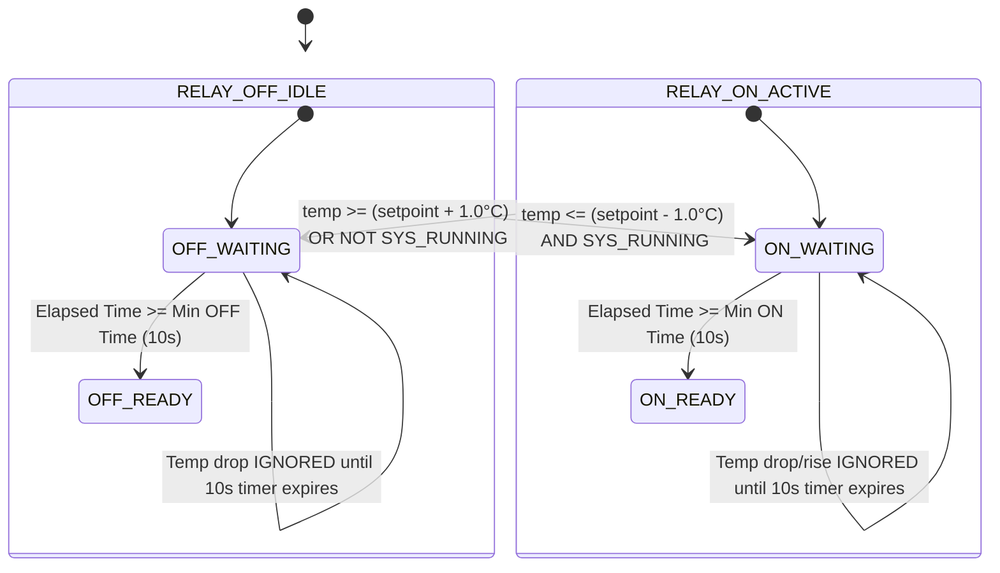

# EAGLEULTRASONİK — Isıtıcı Kontrol Final Mimarisi (Heater Control Architecture V1 vs V2)

> **Doküman Statüsü:** Final Engineering Architecture & Design Specification  
> **Tarih:** 10 Ağustos 2026  
> **Sistem Sürümü:** Phase 4.7 Baseline  
> **Yazar:** Senior Embedded Systems Architect  

---

## 1. Yönetici Özeti ve Sistem Genel Bakışı (Executive Summary)

EAGLEULTRASONİK endüstriyel ultrasonik yıkama tankında sıvı sıcaklığının hassas ve güvenli bir şekilde kontrol edilmesi, yıkama verimliliği ve deterjan kimyasallarının kavitasyon etkinliği için kritik bir parametredir. 

Sistemde iki farklı ısıtıcı sürüş konfigürasyonu tanımlanmıştır:
1. **V1 Mimari (Mekanik Röle + Histerezis + Koruma Zamanlayıcıları):** Seri üretim ve düşük maliyetli donanım varyantı. Mekanik röle (`PB15 HEATER_RELAY_Pin`) üzerinden şebeke (AC Mains) beslemeli rezistans sürülür.
2. **V2 Mimari (SSR + PID + Zaman Orantılı PWM):** Hassas proses gerektiren uygulamalar ve yüksek dayanıklılık için opsiyonel donanım yükseltme varyantı. Katı hal rölesi (Solid-State Relay - SSR) ve PID kontrolcü ile sıcaklık dalgalanması minimuma indirilir.

Bu raporda, V1 ve V2 mimarilerinin teknik karşılaştırması, mevcut firmware kod analizi, koruma zamanlayıcısı eksiklikleri, mekanik/termal aşınma analizleri, PID matrisleri ve servis yapılandırma arayüzü detaylandırılmıştır.

---

## 2. Mevcut Yazılım Durumu ve Kod Analizi (`heater_relay.c`)

Mevcut firmware deposundaki [`heater_relay.c`](file:///c:/Users/ern0e/EAGLEULTRASONiK/STM32/Ultrasonik_G4_Master/Core/Src/heater_relay.c) ve [`heater_relay.h`](file:///c:/Users/ern0e/EAGLEULTRASONiK/STM32/Ultrasonik_G4_Master/Core/Inc/heater_relay.h) dosyaları incelenmiştir.

### 2.1. Mevcut Kod İncelemesi

```c
/* heater_relay.c - Mevcut Kod Kesiti */
void HeaterRelay_Process(void)
{
  if (g_system_state.mode != SYS_MODE_RUNNING)
  {
    RelaySet(0); /* RUNNING mod dışındakilerde (FAULT dahil) röleyi kapat */
    return;
  }

  float temp_c     = g_system_state.current_temp_c;
  float setpoint_c = g_system_state.setpoint_temp_c;

  if (temp_c <= (setpoint_c - HEATER_HYSTERESIS_C))
  {
    RelaySet(1);
  }
  else if (temp_c >= (setpoint_c + HEATER_HYSTERESIS_C))
  {
    RelaySet(0);
  }
  /* deadband içinde önceki durum korunur */
}
```

### 2.2. Tespit Edilen Kritik Eksiklik: Minimum AÇIK / KAPALI Sürelerinin Yokluğu

> [!CAUTION]
> **HARDWARE VALIDATION REQUIRED / PROPOSED ARCHITECTURE**  
> Mevcut `heater_relay.c` kodunda **Minimum ON Time** (Minimum AÇIK Kalma Süresi) ve **Minimum OFF Time** (Minimum KAPALI Kalma Süresi) koruma mantığı **BULUNMAMAKTADIR**.
>
> PT100 okumasındaki anlık analog gürültüler veya sıcaklığın ölü bant sınırında ($T_{\text{set}} \pm 1.0^\circ\text{C}$) salınım yapması durumunda mekanik röle saniyede birkaç kez açılıp kapanabilir (relay chatter). Bu durum:
> 1. Kontak arklanmasına ve kontakların yapışmasına (contact welding) yol açar.
> 2. Rölenin mekanik ömrünü (tahmini 100.000 anahtarlama) birkaç gün içinde tüketir.
> 3. Şebekede yüksek genlikli EMI parazitleri ve voltaj çökmeleri oluşturur.

---

## 3. V1 Mimari: Mekanik Röle + Gelişmiş Histerezis Kontrolü

Mekanik röleli sistemlerde fiziksel kısıtlar nedeniyle anahtarlama frekansı sınırlandırılmalıdır.

### 3.1. Kontak Aşınması, Şatır (Chatter) ve Termal Atalet Analizi

1. **Elektriksel Aşınma ve Arklanma (Arcing):**
   Mekanik röle AC şebeke yükünü açıp kapatırken, anahtarlama anı sinus dalgasının tepe noktasına denk gelebilir. Endüktif veya yüksek rezistif yüklerde ark oluşur. Sık anahtarlama kontak yüzeyinde erimeye, erozyona ve kontak direncinin artmasına (ısınmaya) neden olur.
2. **Şatır Önleme (Anti-Chatter Guarding):**
   Rölenin bir kez durumu değiştikten sonra (örneğin AÇIK konuma geçtikten sonra), sıcaklık ne olursa olsun en az $T_{\text{ON,min}} = 10\text{ s}$ boyunca AÇIK kalması; KAPALI konuma geçtikten sonra ise en az $T_{\text{OFF,min}} = 10\text{ s}$ boyunca KAPALI kalması zorunlu kılınmalıdır.
3. **Termal Atalet (Thermal Inertia) ve Salınım (Overshoot):**
   Su tankındaki termal kütle ($Q = m \cdot c \cdot \Delta T$) nedeniyle ısıtıcı rezistans kapatılsa bile rezistans elemanının kendi sıcaklığı suya aktarılmaya devam eder. $\pm 1.0^\circ\text{C}$ histerezis bandına ek olarak termal atalet nedeniyle gerçek sıcaklık hedef değerin $+2.5^\circ\text{C}$ ila $+3.5^\circ\text{C}$ üstüne çıkabilir.

### 3.2. V1 Histerezis ve Koruma Zamanlayıcısı Durum Makinesi



### 3.3. Önerilen V1 C Kod Mimarisi (`heater_relay_v1_proposed.c`)

```c
#include "heater_relay.h"
#include "system_state.h"
#include "main.h"

#define HEATER_MIN_ON_TIME_MS   (10000U) /* Minimum 10 saniye AÇIK kalma */
#define HEATER_MIN_OFF_TIME_MS  (10000U) /* Minimum 10 saniye KAPALI kalma */

static uint32_t s_last_switch_tick = 0U;

static void RelaySet(uint8_t on)
{
  HAL_GPIO_WritePin(HEATER_RELAY_GPIO_Port, HEATER_RELAY_Pin, on ? GPIO_PIN_SET : GPIO_PIN_RESET);
  g_system_state.relay_state = on ? 1u : 0u;
  s_last_switch_tick = HAL_GetTick();
}

void HeaterRelay_Init(void)
{
  RelaySet(0);
  s_last_switch_tick = HAL_GetTick() - HEATER_MIN_OFF_TIME_MS; /* İlk kalkışta hemen devreye girebilsin */
}

void HeaterRelay_Process(void)
{
  if (g_system_state.mode != SYS_MODE_RUNNING)
  {
    if (g_system_state.relay_state != 0u)
    {
      RelaySet(0); /* Güvenlik nedeniyle acil kapatmada min OFF beklemez */
    }
    return;
  }

  uint32_t now = HAL_GetTick();
  uint32_t elapsed = now - s_last_switch_tick;

  float temp_c     = g_system_state.current_temp_c;
  float setpoint_c = g_system_state.setpoint_temp_c;

  if (g_system_state.relay_state == 0u)
  {
    /* Şu an KAPALI: Açmak için hem temp <= (setpoint - 1.0) hem de min OFF süresi dolmuş olmalı */
    if ((temp_c <= (setpoint_c - HEATER_HYSTERESIS_C)) && (elapsed >= HEATER_MIN_OFF_TIME_MS))
    {
      RelaySet(1);
    }
  }
  else
  {
    /* Şu an AÇIK: Kapatmak için hem temp >= (setpoint + 1.0) hem de min ON süresi dolmuş olmalı */
    if ((temp_c >= (setpoint_c + HEATER_HYSTERESIS_C)) && (elapsed >= HEATER_MIN_ON_TIME_MS))
    {
      RelaySet(0);
    }
  }
}
```

---

## 4. V2 Mimari: SSR + PID + Zaman Orantılı PWM Kontrolü

Hassas proseslerde (örneğin medikal ultrasonik temizleme veya optik mercek yıkama) sıcaklık dalgalanması $\pm 0.5^\circ\text{C}$ altında tutulmalıdır. Bu durumda mekanik röle yerine Katı Hal Rölesi (SSR - Sıfır Geçişli Opto-Triyak Sürücülü) kullanılır.

### 4.1. SSR ve Sürüş Prensipleri

- **Yarı İletken Anahtarlama:** Sıfır geçiş (Zero-Crossing) özelliğine sahip SSR, AC voltajın tam sıfır olduğu anda iletime geçer. Bu sayede dI/dt ve dV/dt paraziti ve ark sıfıra iner.
- **Sınırsız Ömür:** Mekanik kontak bulunmadığından milyarlarca kez anahtarlanabilir. Min ON/OFF koruma süresine ihtiyaç duymaz.

### 4.2. PID Kontrol Algoritması Mimarisi

Ayrık PID (Discrete PID) kontrolcü ayrık zaman aralıklarında ($T_s = 1000\text{ ms}$) çalışır:

$$e(k) = T_{\text{setpoint}} - T_{\text{current}}$$

$$u_P(k) = K_p \cdot e(k)$$

$$u_I(k) = u_I(k-1) + K_i \cdot T_s \cdot e(k)$$

$$u_D(k) = K_d \cdot \frac{e(k) - e(k-1)}{T_s}$$

$$u(k) = u_P(k) + u_I(k) + u_D(k)$$

#### Anti-Windup ve Doyum Clamping:
İntegral birikmesini (Windup) önlemek için $u(k)$ çıkışı $\%0$ ile $\%100$ arasında sınırlandırılır. Çıkış doyuma ulaştığında integral teriminin büyümesi durdurulur:

$$\text{Eğer } u(k) > 100\% \implies u_I(k) = u_I(k-1)$$
$$\text{Eğer } u(k) < 0\% \implies u_I(k) = u_I(k-1)$$

### 4.3. Zaman Orantılı PWM (Time-Proportioning Control)

SSR sinyalini modüle etmek için $T_{\text{window}} = 1000\text{ ms}$ (1 saniye) süreli sabit pencere PWM algoritması kullanılır.
- Örneğin PID çıkışı $u(k) = \%35$ ise:
  - 1000 ms'lik periyodun ilk $350\text{ ms}$'sinde SSR `HIGH` (AÇIK).
  - Kalan $650\text{ ms}$'sinde SSR `LOW` (KAPALI).

```mermaid
gantt
    title V2 Time-Proportioning PWM (1000ms Window, Output = 35%)
    dateFormat  SS
    axisFormat  %S s
    
    section SSR Output Signal
    SSR HIGH (ON 350ms)  :active, ss1, 00, 1s
    SSR LOW (OFF 650ms)  :crit, ss2, after ss1, 1s
```



### 4.4. Önerilen V2 C Kod Mimarisi (`heater_ssr_v2_proposed.c`)

```c
#include "system_state.h"
#include "main.h"

typedef struct {
  float Kp;
  float Ki;
  float Kd;
  float integrator;
  float prev_error;
  float out_min;
  float out_max;
} PID_Controller_t;

static PID_Controller_t s_heater_pid = {
  .Kp = 12.0f,
  .Ki = 0.05f,
  .Kd = 25.0f,
  .integrator = 0.0f,
  .prev_error = 0.0f,
  .out_min = 0.0f,
  .out_max = 100.0f
};

#define PWM_WINDOW_MS 1000U
static uint32_t s_window_start_tick = 0U;
static float    s_pid_duty_pct       = 0.0f;

float HeaterPID_Compute(PID_Controller_t *pid, float setpoint, float current, float dt_s)
{
  float error = setpoint - current;
  
  /* Proportional */
  float p_term = pid->Kp * error;
  
  /* Integral with Anti-Windup Clamping */
  pid->integrator += pid->Ki * error * dt_s;
  if (pid->integrator > pid->out_max) pid->integrator = pid->out_max;
  if (pid->integrator < pid->out_min) pid->integrator = pid->out_min;
  
  /* Derivative */
  float d_term = pid->Kd * (error - pid->prev_error) / dt_s;
  pid->prev_error = error;
  
  /* Total Output */
  float output = p_term + pid->integrator + d_term;
  if (output > pid->out_max) output = pid->out_max;
  if (output < pid->out_min) output = pid->out_min;
  
  return output;
}

void HeaterSSR_Process(void)
{
  if (g_system_state.mode != SYS_MODE_RUNNING)
  {
    HAL_GPIO_WritePin(HEATER_RELAY_GPIO_Port, HEATER_RELAY_Pin, GPIO_PIN_RESET);
    g_system_state.relay_state = 0u;
    s_heater_pid.integrator = 0.0f;
    return;
  }

  uint32_t now = HAL_GetTick();

  /* 1 Saniyelik Periyot Başında PID Yeniden Hesaplanır */
  if ((now - s_window_start_tick) >= PWM_WINDOW_MS)
  {
    s_window_start_tick = now;
    s_pid_duty_pct = HeaterPID_Compute(&s_heater_pid, 
                                        g_system_state.setpoint_temp_c, 
                                        g_system_state.current_temp_c, 
                                        1.0f);
  }

  /* Orantılı PWM Zaman Dilimi Anahtarlaması */
  uint32_t on_time_ms = (uint32_t)((s_pid_duty_pct / 100.0f) * (float)PWM_WINDOW_MS);
  uint32_t elapsed_in_window = now - s_window_start_tick;

  if (elapsed_in_window < on_time_ms && on_time_ms > 0U)
  {
    HAL_GPIO_WritePin(HEATER_RELAY_GPIO_Port, HEATER_RELAY_Pin, GPIO_PIN_SET);
    g_system_state.relay_state = 1u;
  }
  else
  {
    HAL_GPIO_WritePin(HEATER_RELAY_GPIO_Port, HEATER_RELAY_Pin, GPIO_PIN_RESET);
    g_system_state.relay_state = 0u;
  }
}
```

---

## 5. V1 vs V2 Mimarileri Karşılaştırma Analizi (Comparison Matrix)

| Değerlendirme Parametresi | V1: Mekanik Röle + Histerezis | V2: SSR + PID Time-Proportioning | Mühendislik Değerlendirmesi |
| --- | --- | --- | --- |
| **Sıcaklık Hassasiyeti** | $\pm 2.0^\circ\text{C} \dots \pm 3.5^\circ\text{C}$ dalgalanma | $\pm 0.2^\circ\text{C} \dots \pm 0.5^\circ\text{C}$ dalgalanma | V2 hassas yıkama prosesleri için şarttır. |
| **Mekanik Ömür** | $\approx 100.000 \dots 500.000$ anahtarlama | Sınırsız (Yarı iletken) | V1'de 10s koruma zamanlayıcısı zorunludur. |
| **Anahtarlama Frekansı** | Max 0.05 Hz (20 saniyede bir) | 1.0 Hz (Her saniye PWM modülasyonu) | SSR yüksek frekansta kontak aşınması yaşamaz. |
| **Termal Overshoot** | Yüksek (Rezistans ısısı gecikmeli aktarılır) | İhmal Edilebilir (Güç orantılı azaltılır) | PID derivative terimi overshoot'u bastırır. |
| **Akustik Gürültü** | "Tık-tık" mekanik kontak sesi | Tamamen sessiz | Laboratuvar/Medikal ortam için SSR tercih edilir. |
| **Görünür Parazit (EMI)** | Kontak açma/kapama anında yüksek EMI | Sıfır Geçişli (Zero-Cross) - Çok düşük EMI | SSR şebekede voltaj çökmesi yapmaz. |
| **Isı Dağılımı (Heatsink)** | Yok (Kontak direnci $\approx 10\text{ m}\Omega$) | Gerekli (SSR üzerinde $\approx 1.2\text{V}$ düşüm, 10A'da 12W ısı) | V2 için panoda soğutucu alüminyum blok şarttır. |
| **Donanım Maliyeti** | Düşük ($\approx \$1.50$) | Orta-Yüksek ($\approx \$12.00 - \$18.00$) | V1 standart model, V2 opsiyonel model. |

---

## 6. Servis Yapılandırma Mantığı (Service Mode Flash Parameter)

Firmware kodunun hem V1 hem de V2 donanımlarını aynı mikrodenetleyici yazılımı ile destekleyebilmesi için Flash Bellek / EEPROM üzerinde `heater_control_mode` parametresi tanımlanmıştır.

```c
typedef enum {
  HEATER_MODE_V1_RELAY_HYSTERESIS = 0x00,
  HEATER_MODE_V2_SSR_PID           = 0x01
} HeaterControlMode_t;
```

- **Saha Yapılandırması:** HMI Servis Menüsü üzerinden yetkili teknik servis personeli ekran üzerinden sürüş modunu seçer.
- **Çalışma Zamanı Yürütme (Runtime Execution):** `main.c` superloop döngüsünde:

```c
void Heater_Process_Dispatcher(void)
{
  if (g_config.heater_mode == HEATER_MODE_V2_SSR_PID)
  {
    HeaterSSR_Process();
  }
  else
  {
    HeaterRelay_Process(); /* V1 Guarded Hysteresis */
  }
}
```

---

## 7. Donanım Güvenlik Kilitleri ve Termal Koruma (Hardware Safety Interlocks)

1. **PT100 Sensör Arıza Kilidi (Open/Short Circuit):**
   PT100 ADC okuması kopukluk (`FAULT_PT100_OPEN`) veya kısa devre (`FAULT_PT100_SHORT`) tespit ettiği anda, PID veya Histerezis durumuna bakılmaksızın `HEATER_RELAY_Pin` derhal `LOW` konuma çekilir.
2. **Yazılımsal Watchdog ve Mod Kilidi:**
   `g_system_state.mode != SYS_MODE_RUNNING` durumunda ısıtıcı çıkışı fiziksel olarak sıfırlanır.
3. **Harici Bimetal Termostat (Hardware Thermal Cutout):**
   Yazılımdan tamamen bağımsız olarak rezistans üzerine seri bağlı $90^\circ\text{C}$ bimetal koruma anahtarı bulunur. Termal kontrolden çıkma (SSR kısa devre arızası gibi) durumunda faz hattını fiziksel olarak keser.
