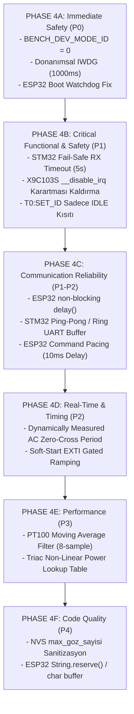

> [!WARNING]
> SUPERSEDED BY PHASE 4.6 DESIGN BASELINE

# EAGLEULTRASONİK — Düzeltme Uygulama Sırası (Implementation Order Roadmap)

> **Doküman Statüsü:** Lead Embedded Systems Architect Output  
> **Tarih:** 10 Ağustos 2026  
> **Yaklaşım:** Risk Tabanlı Aşamalı Düzeltme (Phase 4A -> Phase 4F)

---

## Düzeltme Fazları ve Öncelik Sıralaması

---

## Faz Detayları ve Hedef Dosyalar

### 🚨 PHASE 4A: Immediate Safety (Acil Emniyet - P0)
1. **`BENCH_DEV_MODE_ID` Sıfırlama:** `main.c:53` -> `#define BENCH_DEV_MODE_ID 0`.
2. **IWDG Aktifleştirme:** `main.c` -> `MX_IWDG_Init()` + `HAL_IWDG_Refresh()`.
3. **ESP32 Boot Watchdog Düzeltmesi:** `ekran_kontrol.ino` -> `isKartBagli()` içine `stm_bagli[goz_id]` kontrolü ekleme.

### 🛡️ PHASE 4B: Critical Functional & Safety (Kritik İşlevsel Emniyet - P1)
1. **STM32 Fail-Safe İletişim Zaman Aşımı:** `esp32_uart.c` -> 5 saniye veri gelmezse `SYS_MODE_IDLE`'a çekme.
2. **X9C103S Kesme Karartması Kaldırma:** `x9c103s.c` -> `__disable_irq()` bloklarını daraltma/kaldırma.
3. **`T0:SET_ID` Yayın Kısıtlaması:** `esp32_uart.c` -> Sadece `SYS_MODE_IDLE` modunda Flash silmeye izin verme.

### 📡 PHASE 4C: Communication Reliability (Haberleşme Kararlılığı)
1. **ESP32 `delay()` Kaldırma:** `ekran_kontrol.ino` -> `millis()` durum makinesi.
2. **STM32 UART Tamponu Güçlendirme:** `esp32_uart.c` -> Ping-pong satır tamponu.
3. **ESP32 Komut Pacing:** `ekran_kontrol.ino` -> Ardışık komutlar arasına 10ms bekleme koyma.

### ⏱️ PHASE 4D: Real-Time & Timing (Gerçek Zamanlı Zamanlama)
1. **Şebeke Frekansı Adaptasyonu:** `ultrasonic_pwm.c` -> EXTI periyot ölçümü.
2. **Soft-Start ZC Senkronizasyonu:** `ultrasonic_pwm.c` -> Rampa düşüşünü EXTI kesmesine bağlama.

### 📊 PHASE 4E: Performance (Performans & Filtreleme)
1. **PT100 Filtresi:** `pt100_adc.c` -> 8 numunelik Moving Average.
2. **Triyak Güç Haritası:** `ultrasonic_pwm.c` -> RMS güç eğrisi LUT.

### 🧹 PHASE 4F: Code Quality (Kod Kalitesi)
1. **NVS Sanitizasyonu:** `ekran_kontrol.ino` -> `max_goz_sayisi` sınır kontrolü.
2. **String Fragmantasyon Önlemi:** `ekran_kontrol.ino` -> C char dizileri veya `reserve()`.
