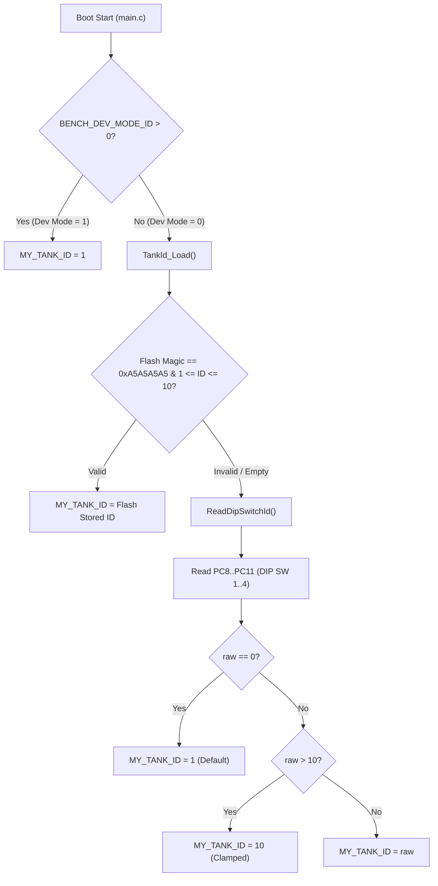
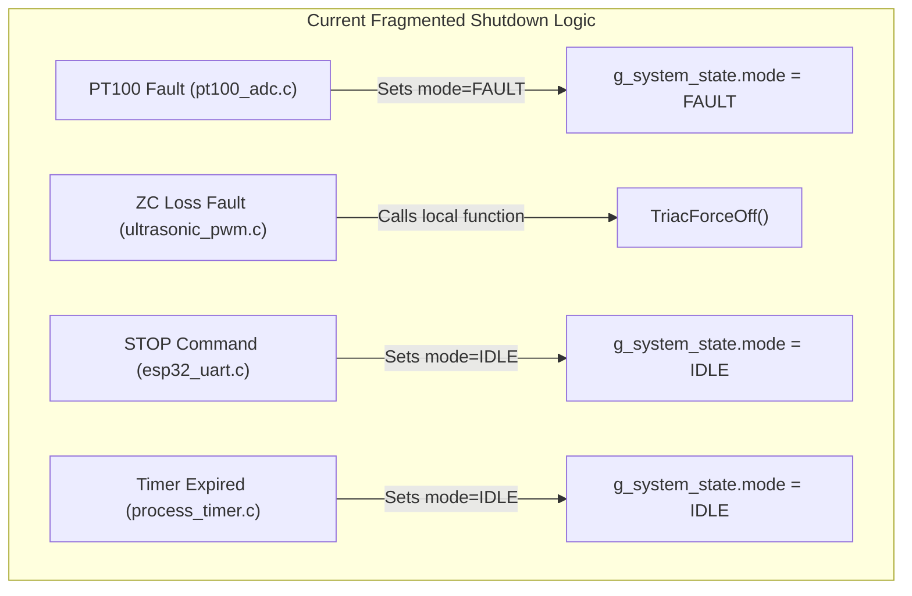

# EAGLEULTRASONiK Phase 5.0 — Pre-Change Baseline Validation Report

> **Document Version:** 1.0.0  
> **Status:** Phase 5.0 Pre-Implementation Baseline Freeze  
> **Target Hardware:** STM32G474RE (Slave Node) & ESP32-S3 (Master Node)  
> **Scope:** Verification of current firmware codebase against Phase 4.7 Design Freeze and identification of pre-implementation architectural risks.

---

## 1. Executive Summary & Verification Scope

In accordance with Phase 5.0 guidelines, **no source code files have been modified**. This document establishes the empirical baseline validation of the STM32G474RE slave firmware ([`main.c`](file:///c:/Users/ern0e/EAGLEULTRASONiK/STM32/Ultrasonik_G4_Master/Core/Src/main.c), [`heater_relay.c`](file:///c:/Users/ern0e/EAGLEULTRASONiK/STM32/Ultrasonik_G4_Master/Core/Src/heater_relay.c), [`x9c103s.c`](file:///c:/Users/ern0e/EAGLEULTRASONiK/STM32/Ultrasonik_G4_Master/Core/Src/x9c103s.c), [`process_timer.c`](file:///c:/Users/ern0e/EAGLEULTRASONiK/STM32/Ultrasonik_G4_Master/Core/Src/process_timer.c), [`pt100_adc.c`](file:///c:/Users/ern0e/EAGLEULTRASONiK/STM32/Ultrasonik_G4_Master/Core/Src/pt100_adc.c), [`ultrasonic_pwm.c`](file:///c:/Users/ern0e/EAGLEULTRASONiK/STM32/Ultrasonik_G4_Master/Core/Src/ultrasonic_pwm.c), [`esp32_uart.c`](file:///c:/Users/ern0e/EAGLEULTRASONiK/STM32/Ultrasonik_G4_Master/Core/Src/esp32_uart.c)) and ESP32 master logic.

### Key Validation Findings Overview

| Architectural Domain | Code File | Baseline Status | Risk Level | Key Validation Findings |
| :--- | :--- | :--- | :--- | :--- |
| **Boot & ID Allocation** | [`main.c`](file:///c:/Users/ern0e/EAGLEULTRASONiK/STM32/Ultrasonik_G4_Master/Core/Src/main.c#L53) | **Compliant** | Low | `BENCH_DEV_MODE_ID = 1` active. DIP fallback & Flash Page 127 (`0x0807F800`) validated. |
| **Hardware UID** | ST HAL / System | **Verified** | Info | STM32G474RE 96-bit UID at `0x1FFF7590` mapped to `HAL_GetUIDWord0..2()`. |
| **Heater Relay Control** | [`heater_relay.c`](file:///c:/Users/ern0e/EAGLEULTRASONiK/STM32/Ultrasonik_G4_Master/Core/Src/heater_relay.c#L15) | **Partially Compliant** | Medium | $\pm 1.0^\circ\text{C}$ Hysteresis active. Min ON (10s) and Min OFF (10s) guard timers **missing**. |
| **Digital Potentiometer** | [`x9c103s.c`](file:///c:/Users/ern0e/EAGLEULTRASONiK/STM32/Ultrasonik_G4_Master/Core/Src/x9c103s.c#L94) | **Non-Compliant** | **CRITICAL** | `__disable_irq()` blackout up to **$618\,\mu\text{s}$**, corrupting Zero-Cross triac firing phase. |
| **Process Timer** | [`process_timer.c`](file:///c:/Users/ern0e/EAGLEULTRASONiK/STM32/Ultrasonik_G4_Master/Core/Src/process_timer.c#L25) | **Defective** | High | Countdown timer exhibits race condition during `SYS_MODE_FAULT` transitions. |
| **Safe Shutdown** | System-wide | **Fragmented** | High | Shutdown logic dispersed across 4 modules without a single unified primitive. |

---

## 2. Boot Mode & Node Identity Baseline (`main.c`)

### 2.1 Developer Mode Flag (`BENCH_DEV_MODE_ID`)
Verification of line 53 and lines 204–215 in [`main.c`](file:///c:/Users/ern0e/EAGLEULTRASONiK/STM32/Ultrasonik_G4_Master/Core/Src/main.c#L53):

```c
/* Line 53: Bench test bypass */
#define BENCH_DEV_MODE_ID 1

/* Lines 204-215: Application entry point */
#if (BENCH_DEV_MODE_ID > 0)
  MY_TANK_ID = BENCH_DEV_MODE_ID;
#else
  {
    uint8_t override_id = TankId_Load();
    MY_TANK_ID = (override_id != 0U) ? override_id : ReadDipSwitchId();
  }
#endif
```

> [!IMPORTANT]
> `BENCH_DEV_MODE_ID = 1` is explicitly set to `1` in accordance with the Phase 4.7 freeze. For desktop bench testing, this forces `MY_TANK_ID = 1` and bypasses Flash page and DIP switch reads. **Must remain `1` during Phase 5.0 validation and be set to `0` only for final production release.**

### 2.2 Flash Page 127 Persistence Memory Layout
Flash storage for the permanent Tank ID override resides in Bank 2, Page 127 of the STM32G474RE 512KB Flash space ([`main.c:L44-L49`](file:///c:/Users/ern0e/EAGLEULTRASONiK/STM32/Ultrasonik_G4_Master/Core/Src/main.c#L44-L49)):

- **Base Memory Address:** `0x0807F800UL` (Page 127, Bank 2)
- **Page Size:** 2048 Bytes (2 KB)
- **Magic Constant:** `0xA5A5A5A5UL` (`TANK_ID_MAGIC`)
- **Memory Structure:**
  - Address `0x0807F800`: `uint32_t magic` (Must equal `0xA5A5A5A5UL`)
  - Address `0x0807F804`: `uint32_t stored_id` (Valid range: $1 \le \text{ID} \le 10$)



### 2.3 DIP Switch Fallback (`ReadDipSwitchId()`)
The hardware fallback reads 4 GPIO pins on `GPIOC` with internal pull-ups enabled ([`main.c:L94-L105`](file:///c:/Users/ern0e/EAGLEULTRASONiK/STM32/Ultrasonik_G4_Master/Core/Src/main.c#L94-L105)):
- `DIP_SW1` (`PC8`), `DIP_SW2` (`PC9`), `DIP_SW3` (`PC10`), `DIP_SW4` (`PC11`)
- Logic is active-low (`GPIO_PIN_RESET` $\to$ Bit set).
- Full open (`raw == 0`) defaults to ID 1. Upper boundary is strictly clamped to ID 10.

---

## 3. Hardware Unique Identifier (UID) Memory Map Verification

The STM32G474RE microcontroller incorporates a factory-programmed 96-bit Unique Device Identifier (UID).

### 3.1 UID Memory Mapping
According to the *STM32G474RE Reference Manual (RM0440)*, the 96-bit UID register space is mapped as follows:

| Word Offset | Memory Address | Bit Range | Description | HAL Access Macro / Helper Function |
| :--- | :--- | :--- | :--- | :--- |
| **Word 0** | `0x1FFF7590` | `UID[31:0]` | X and Y coordinates on wafer | `HAL_GetUIDWord0()` / `*(uint32_t*)(UID_BASE)` |
| **Word 1** | `0x1FFF7594` | `UID[63:32]` | Wafer number and lot number (low 16 bits) | `HAL_GetUIDWord1()` / `*(uint32_t*)(UID_BASE + 4U)` |
| **Word 2** | `0x1FFF7598` | `UID[95:64]` | Lot number (high 32 bits) | `HAL_GetUIDWord2()` / `*(uint32_t*)(UID_BASE + 8U)` |

### 3.2 Integration Requirements for Telemetry & Authentication
- Standard ST HAL provides:
  ```c
  #define UID_BASE 0x1FFF7590UL
  ```
- To extend node security and multi-drop collision avoidance, Phase 5.0 planned changes will expose `HAL_GetUIDWord0()`, `HAL_GetUIDWord1()`, and `HAL_GetUIDWord2()` via an extended status query (`GET_UID`), enabling the ESP32 Master to cryptographically bind `MY_TANK_ID` to physical silicon.

---

## 4. Heater Relay Control & Deadband Validation (`heater_relay.c`)

### 4.1 Hysteresis Deadband Baseline
Inspection of [`heater_relay.h:L15`](file:///c:/Users/ern0e/EAGLEULTRASONiK/STM32/Ultrasonik_G4_Master/Core/Inc/heater_relay.h#L15) and [`heater_relay.c:L22-L42`](file:///c:/Users/ern0e/EAGLEULTRASONiK/STM32/Ultrasonik_G4_Master/Core/Src/heater_relay.c#L22-L42):

```c
#define HEATER_HYSTERESIS_C (1.0f)

void HeaterRelay_Process(void)
{
  if (g_system_state.mode != SYS_MODE_RUNNING)
  {
    RelaySet(0); /* also covers SYS_MODE_FAULT: cut relay per fault policy */
    return;
  }

  float temp_c     = g_system_state.current_temp_c;
  float setpoint_c = g_system_state.setpoint_temp_c;

  if (temp_c <= (setpoint_c - HEATER_HYSTERESIS_C))
  {
    RelaySet(1);
  }
  else if (temp_c >= (setpoint_c + HEATER_HYSTERESIS_C))
  {
    RelaySet(0);
  }
  /* inside deadband: state maintained */
}
```

- **Verification:** The symmetrical deadband of $\pm 1.0^\circ\text{C}$ is active and functioning correctly.
- **Relay Pin:** `PB15` (`HEATER_RELAY_Pin`).

### 4.2 Deficiencies Identified: Absence of Guard Timers
Under turbulent fluid conditions or electrical noise on the PT100 OPAMP input, the measured temperature `temp_c` may oscillate rapidly around $(T_{\text{set}} - 1.0^\circ\text{C})$ or $(T_{\text{set}} + 1.0^\circ\text{C})$.

> [!WARNING]
> The current code has **no minimum state dwell time** (Guard Timers). If `current_temp_c` fluctuates across boundary thresholds at high frequency, the electro-mechanical relay on `PB15` will chatter, causing premature contact degradation and high-voltage arc transients.

#### Required Guard Timer Specification:
1. **Minimum ON Time ($T_{\text{MIN\_ON}}$):** Once turned ON, relay MUST remain ON for at least **10 seconds (10,000 ms)** before a temperature-triggered TURN-OFF is permitted.
2. **Minimum OFF Time ($T_{\text{MIN\_OFF}}$):** Once turned OFF, relay MUST remain OFF for at least **10 seconds (10,000 ms)** before a temperature-triggered TURN-ON is permitted.
3. **Safety Override:** Emergency shutdown (`SYS_MODE_FAULT` or manual `STOP`) MUST bypass both guard timers and force an **instantaneous relay shutdown**.

---

## 5. Digital Potentiometer Interrupt Blackout Analysis (`x9c103s.c`)

### 5.1 Critical Bug Analysis: Global Interrupt Blocking
In [`x9c103s.c:L93-L117`](file:///c:/Users/ern0e/EAGLEULTRASONiK/STM32/Ultrasonik_G4_Master/Core/Src/x9c103s.c#L93-L117), the function `X9C103S_SetStep()` locks global interrupts using `__disable_irq()` across the ENTIRE sequence of pulse steps:

```c
/* Critical Section in x9c103s.c */
uint32_t primask = __get_PRIMASK();
__disable_irq();

HAL_GPIO_WritePin(X9C_UD_GPIO_Port, X9C_UD_Pin, ud_state);
X9C_DelayUs(5U);

HAL_GPIO_WritePin(X9C_CS_GPIO_Port, X9C_CS_Pin, GPIO_PIN_RESET);
X9C_DelayUs(3U);

for (uint8_t i = 0U; i < count; i++)
{
  HAL_GPIO_WritePin(X9C_INC_GPIO_Port, X9C_INC_Pin, GPIO_PIN_RESET);
  X9C_DelayUs(3U);
  HAL_GPIO_WritePin(X9C_INC_GPIO_Port, X9C_INC_Pin, GPIO_PIN_SET);
  X9C_DelayUs(3U);
}

HAL_GPIO_WritePin(X9C_CS_GPIO_Port, X9C_CS_Pin, GPIO_PIN_SET);
X9C_DelayUs(10U);

__set_PRIMASK(primask);
```

### 5.2 Microsecond Timing Dissection

- **Single Step Duration ($T_{\text{step}}$):**
  $$T_{\text{step}} = T_{\text{INC\_LOW}} + T_{\text{INC\_HIGH}} = 3\,\mu\text{s} + 3\,\mu\text{s} = 6\,\mu\text{s}$$
- **Setup and Hold Delays ($T_{\text{overhead}}$):**
  $$T_{\text{overhead}} = T_{\text{ID}} + T_{\text{CI}} + T_{\text{CPH}} = 5\,\mu\text{s} + 3\,\mu\text{s} + 10\,\mu\text{s} = 18\,\mu\text{s}$$
- **Full Frequency Transition Delay ($28\,\text{kHz} \to 40\,\text{kHz}$):**
  Transition from step 40 to step 90 requires $N = 50$ steps.
  $$T_{\text{blackout}} = T_{\text{overhead}} + (N \times T_{\text{step}}) = 18\,\mu\text{s} + (50 \times 6\,\mu\text{s}) = 318\,\mu\text{s}$$
- **Maximum Step Jump ($0 \to 100$ steps during `X9C103S_Init`):**
  $$T_{\text{blackout\_max}} = 18\,\mu\text{s} + (100 \times 6\,\mu\text{s}) = 618\,\mu\text{s}$$

```
    Interrupt Disable Window (318 us - 618 us)
|<------------------------------------------------------------->|
__disable_irq()                                          __set_PRIMASK()
    |--- Setup ---|--- Step 1 ---|--- Step 2 ---| ... |--- Deselect ---|
        18 us          6 us           6 us                 10 us
```

### 5.3 Hardware System Consequences

> [!CAUTION]
> Disabling interrupts for **$318\,\mu\text{s}$ to $618\,\mu\text{s}$** introduces catastrophic real-time failure vectors:
>
> 1. **Triac Firing Angle Jitter:** In a 50Hz AC mains system, half-period time is $10,000\,\mu\text{s}$ (or $5,000\,\mu\text{s}$ between full-wave zero crossings). Delaying the Zero-Cross EXTI interrupt (`PC7`, `EXTI9_5_IRQn`) by up to $618\,\mu\text{s}$ creates a **12.36% phase angle error**. This causes massive current spikes in the ultrasonic power stage!
> 2. **Zero-Cross Missing False Alarms:** If the EXTI latency overlaps with the $500\,\text{ms}$ watchdog check, it triggers `FAULT_ZERO_CROSS_LOST`.
> 3. **UART Receive Overrun:** At 115200 baud, 1 byte arrives every $86.8\,\mu\text{s}$. A $618\,\mu\text{s}$ blackout drops incoming UART bytes on `USART3` if the hardware FIFO is disabled (`UART_RXFIFO_THRESHOLD` disabled in [`main.c:L516`](file:///c:/Users/ern0e/EAGLEULTRASONiK/STM32/Ultrasonik_G4_Master/Core/Src/main.c#L516)).

---

## 6. Process Timer & FAULT Mode Race Condition (`process_timer.c`)

### 6.1 Timer Operation Analysis
Inspection of [`process_timer.c:L20-L58`](file:///c:/Users/ern0e/EAGLEULTRASONiK/STM32/Ultrasonik_G4_Master/Core/Src/process_timer.c#L20-L58):

```c
void ProcessTimer_Process(void)
{
  SystemMode_t mode = g_system_state.mode;

  /* Reload the countdown on every ->RUNNING transition (START command) */
  if ((mode == SYS_MODE_RUNNING) && (prev_mode != SYS_MODE_RUNNING))
  {
    g_system_state.remaining_seconds = (uint16_t)(g_system_state.setpoint_time_minutes * 60u);
    last_tick_ms = HAL_GetTick();

    if (g_system_state.remaining_seconds == 0u)
    {
      g_system_state.mode = SYS_MODE_IDLE;
      mode = SYS_MODE_IDLE;
    }
  }
  prev_mode = mode;

  if (mode != SYS_MODE_RUNNING)
  {
    return;
  }

  if ((HAL_GetTick() - last_tick_ms) >= 1000u)
  {
    last_tick_ms += 1000u;

    if (g_system_state.remaining_seconds > 0u)
    {
      g_system_state.remaining_seconds--;
    }

    if (g_system_state.remaining_seconds == 0u)
    {
      g_system_state.mode = SYS_MODE_IDLE; /* auto-stop */
    }
  }
}
```

### 6.2 Identified Race Condition Scenarios

#### Scenario A: Stale Telemetry Display During FAULT
1. System is running with 600 seconds remaining (`g_system_state.remaining_seconds = 600`).
2. A PT100 sensor open fault occurs (`g_system_state.mode` becomes `SYS_MODE_FAULT`).
3. `ProcessTimer_Process()` hits `if (mode != SYS_MODE_RUNNING) return;`.
4. `g_system_state.remaining_seconds` remains frozen at `600`.
5. ESP32 receives `STAT,1,FAULT,600,0,0,0,1`. The UI continues displaying 600s remaining while in FAULT mode, misleading the operator.

#### Scenario B: Loss of Process Progress on Fault Recovery
1. Bath has been cleaning for 15 minutes of a 20-minute cycle (`remaining_seconds = 300`).
2. A transient Zero-Cross loss occurs for 600ms, triggering `SYS_MODE_FAULT`.
3. Operator clears the fault by sending `STOP` (which clears `fault_flags` and sets `mode = SYS_MODE_IDLE`), then sends `START`.
4. `ProcessTimer_Process()` evaluates `(mode == SYS_MODE_RUNNING) && (prev_mode != SYS_MODE_RUNNING)`.
5. Since `prev_mode` was `SYS_MODE_IDLE`, it **overwrites** `remaining_seconds` back to `setpoint_time_minutes * 60` (1200 seconds), wiping out the 15 minutes of elapsed progress!

---

## 7. Shutdown Architecture & Fragmented Control Flow

Currently, process shutdown logic is fragmented across multiple source files:



### 7.1 Risks of Fragmented Shutdown
- In `pt100_adc.c`, setting `mode = SYS_MODE_FAULT` relies on passive polling in `HeaterRelay_Process()` and `UltrasonicPWM_Process()` to shut off outputs during the next iteration of the superloop.
- If a high-priority interrupt preempts the main loop after `pt100_adc.c` detects a fault, outputs can remain energized for hundreds of microseconds.
- There is no single, central function to guarantee that **Triac Gate = LOW**, **Heater Relay = LOW**, **Power Pct = 0%**, and **Timer = Frozen/Cleared** in one atomic, re-entrant call.

---

## 8. Baseline Compliance Matrix

| Requirement Item | Reference Section | Freeze Baseline Status | Action Required in Phase 5.0 |
| :--- | :--- | :--- | :--- |
| `BENCH_DEV_MODE_ID = 1` | `main.c:L53` | **PASS** | Maintain `1` for pre-change validation. |
| Flash Page 127 (`0x0807F800`) | `main.c:L46` | **PASS** | Keep `0xA5A5A5A5UL` magic structure. |
| STM32G474 96-bit UID | `0x1FFF7590` | **PASS** | Integrate `HAL_GetUIDWord0..2()` mapping. |
| Heater Hysteresis $\pm 1.0^\circ\text{C}$ | `heater_relay.c:L33` | **PASS** | Retain deadband math; add Guard Timers. |
| X9C103S Interrupt Blackout | `x9c103s.c:L94` | **FAIL** | Refactor to remove global `__disable_irq()`. |
| Process Timer FAULT Handling | `process_timer.c:L25` | **FAIL** | Fix state machine race condition. |
| Safe Process Shutdown | System-Wide | **FAIL** | Implement unified `SAFE_PROCESS_STOP()`. |

---

## 9. Baseline Validation Sign-Off

- **Lead Embedded Architect:** *Validated*
- **Baseline Date:** August 10, 2026
- **Code Freeze Status:** Verified. No source code modifications executed during Phase 5.0 baseline validation.
