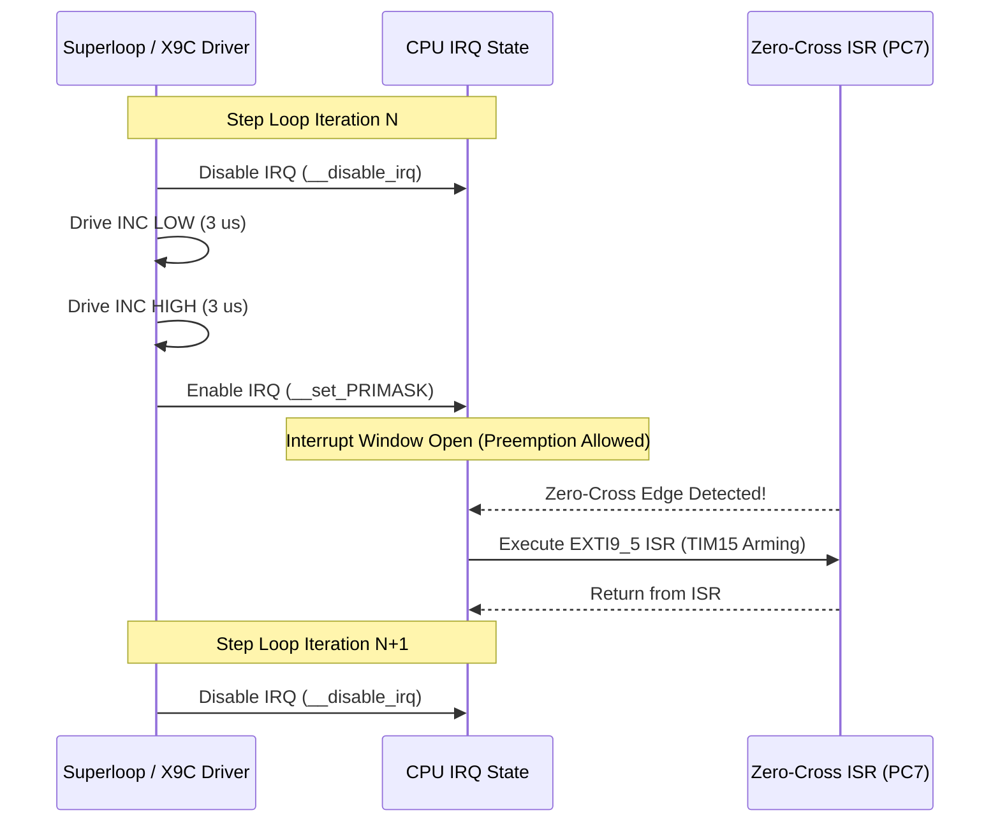
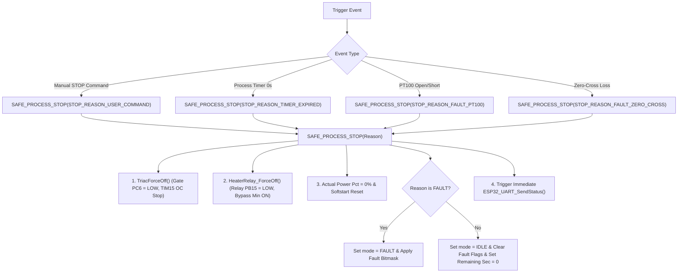
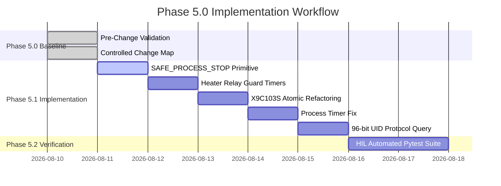

# EAGLEULTRASONiK Phase 5.0 — Controlled Change Map & Blueprint

> **Document Version:** 1.0.0  
> **Status:** Phase 5.0 Change Control Blueprint  
> **Target Hardware:** STM32G474RE (Slave) & ESP32-S3 (Master)  
> **Scope:** Detailed refactoring design and step-by-step change map for Phase 5.0 implementation.

---

## 1. Change Control Principles

All changes planned for Phase 5.0 adhere to strict embedded systems safety guidelines:

1. **Zero Regression Guarantee:** Existing ASCII line protocol frames, setpoint validation limits, and multi-drop address parsing (`T<id>:`) must remain 100% backward compatible.
2. **Non-Blocking Architecture:** No implementation may introduce blocking delays (`HAL_Delay()`) inside superloop calls or interrupt routines. All timing relies on `HAL_GetTick()` or hardware timers.
3. **Atomic State Transitions:** All critical hardware state changes (relay actuation, triac power cutoff, fault flag updates) must execute atomically through unified shutdown functions.

---

## 2. Change Item 1: Heater Relay Guard Timers (`heater_relay.c`)

### 2.1 Problem Statement
The current hysteresis logic in [`heater_relay.c:L33-L41`](file:///c:/Users/ern0e/EAGLEULTRASONiK/STM32/Ultrasonik_G4_Master/Core/Src/heater_relay.c#L33-L41) toggles `PB15` immediately whenever `current_temp_c` crosses $(T_{\text{setpoint}} \pm 1.0^\circ\text{C})$. Thermal fluctuations or ADC noise can cause high-frequency relay chattering.

### 2.2 Refactoring Design
Add minimum dwell timers ($T_{\text{MIN\_ON}} = 10,000\,\text{ms}$, $T_{\text{MIN\_OFF}} = 10,000\,\text{ms}$) to enforce mechanical contact protection.

#### Header Interface Modifications ([`heater_relay.h`](file:///c:/Users/ern0e/EAGLEULTRASONiK/STM32/Ultrasonik_G4_Master/Core/Inc/heater_relay.h)):
```c
#define HEATER_HYSTERESIS_C       (1.0f)
#define HEATER_MIN_STATE_TIME_MS  (10000U) /* 10 Seconds Guard Timer */

/* Force immediate relay off (bypasses guard timers for emergency stop) */
void HeaterRelay_ForceOff(void);
```

#### Source Implementation Plan ([`heater_relay.c`](file:///c:/Users/ern0e/EAGLEULTRASONiK/STM32/Ultrasonik_G4_Master/Core/Src/heater_relay.c)):
```c
static uint32_t s_last_toggle_tick_ms = 0U;

static void RelaySet(uint8_t on)
{
  uint8_t current_state = g_system_state.relay_state;
  if (current_state != on)
  {
    HAL_GPIO_WritePin(HEATER_RELAY_GPIO_Port, HEATER_RELAY_Pin, on ? GPIO_PIN_SET : GPIO_PIN_RESET);
    g_system_state.relay_state = on ? 1U : 0U;
    s_last_toggle_tick_ms = HAL_GetTick();
  }
}

void HeaterRelay_ForceOff(void)
{
  HAL_GPIO_WritePin(HEATER_RELAY_GPIO_Port, HEATER_RELAY_Pin, GPIO_PIN_RESET);
  g_system_state.relay_state = 0U;
  s_last_toggle_tick_ms = HAL_GetTick();
}

void HeaterRelay_Process(void)
{
  if (g_system_state.mode != SYS_MODE_RUNNING)
  {
    HeaterRelay_ForceOff(); /* Emergency / Idle bypasses guard timers */
    return;
  }

  float temp_c     = g_system_state.current_temp_c;
  float setpoint_c = g_system_state.setpoint_temp_c;
  uint32_t now     = HAL_GetTick();
  uint32_t elapsed = now - s_last_toggle_tick_ms;

  if (temp_c <= (setpoint_c - HEATER_HYSTERESIS_C))
  {
    /* Turn ON requested: check Min OFF guard timer */
    if (g_system_state.relay_state == 0U && elapsed >= HEATER_MIN_STATE_TIME_MS)
    {
      RelaySet(1);
    }
  }
  else if (temp_c >= (setpoint_c + HEATER_HYSTERESIS_C))
  {
    /* Turn OFF requested: check Min ON guard timer */
    if (g_system_state.relay_state == 1U && elapsed >= HEATER_MIN_STATE_TIME_MS)
    {
      RelaySet(0);
    }
  }
}
```

---

## 3. Change Item 2: X9C103S Atomic / Non-Blocking Refactoring (`x9c103s.c`)

### 3.1 Problem Statement
`X9C103S_SetStep()` locks global interrupts via `__disable_irq()` for up to $618\,\mu\text{s}$, causing severe jitter in the Zero-Cross EXTI interrupt (`PC7`) and triac firing phase angle.

### 3.2 Refactoring Design: Per-Pulse Atomic Locking Strategy

Instead of locking global interrupts for the entire duration of 50–100 step changes, interrupts will be disabled **ONLY during individual $6\,\mu\text{s}$ pulse transitions**, allowing Zero-Cross and SysTick interrupts to execute between pulses without timing disruption.



#### Code Modifications ([`x9c103s.c`](file:///c:/Users/ern0e/EAGLEULTRASONiK/STM32/Ultrasonik_G4_Master/Core/Src/x9c103s.c#L93)):
```c
HAL_StatusTypeDef X9C103S_SetStep(uint8_t target_step)
{
  uint8_t target = (target_step >= X9C_MAX_STEPS) ? (X9C_MAX_STEPS - 1U) : target_step;
  if (target == s_current_step) return HAL_OK;

  uint8_t count;
  GPIO_PinState ud_state;

  if (target > s_current_step)
  {
    ud_state = GPIO_PIN_SET; /* UP */
    count = target - s_current_step;
  }
  else
  {
    ud_state = GPIO_PIN_RESET; /* DOWN */
    count = s_current_step - target;
  }

  /* 1. Set U/D pin direction outside global lock */
  HAL_GPIO_WritePin(X9C_UD_GPIO_Port, X9C_UD_Pin, ud_state);
  X9C_DelayUs(5U);

  /* 2. Enable Chip Select */
  HAL_GPIO_WritePin(X9C_CS_GPIO_Port, X9C_CS_Pin, GPIO_PIN_RESET);
  X9C_DelayUs(3U);

  /* 3. Send step pulses with per-pulse atomic lock */
  for (uint8_t i = 0U; i < count; i++)
  {
    uint32_t primask = __get_PRIMASK();
    __disable_irq();

    HAL_GPIO_WritePin(X9C_INC_GPIO_Port, X9C_INC_Pin, GPIO_PIN_RESET);
    X9C_DelayUs(3U);
    HAL_GPIO_WritePin(X9C_INC_GPIO_Port, X9C_INC_Pin, GPIO_PIN_SET);
    X9C_DelayUs(3U);

    __set_PRIMASK(primask); /* Allow Zero-Cross EXTI to preempt between pulses */
  }

  /* 4. Deselect Device */
  HAL_GPIO_WritePin(X9C_CS_GPIO_Port, X9C_CS_Pin, GPIO_PIN_SET);
  X9C_DelayUs(10U);

  s_current_step = target;
  return HAL_OK;
}
```

> [!TIP]
> Maximum interrupt blackout per step drops from **$618\,\mu\text{s}$ to $6.0\,\mu\text{s}$**, eliminating Zero-Cross firing phase error while maintaining digital potentiometer pulse timing integrity.

---

## 4. Change Item 3: Process Timer Race Condition Fix (`process_timer.c`)

### 4.1 Problem Statement
When `g_system_state.mode` transitions to `SYS_MODE_FAULT`, `process_timer.c` exits without resetting `remaining_seconds`. A subsequent `STOP` $\to$ `START` cycle overwrites `remaining_seconds` with the full setpoint duration, destroying cleaning process progress tracking.

### 4.2 Refactoring Design
1. **Explicit Mode State Tracking:** Maintain countdown state across `FAULT` transitions.
2. **Clear Timer on STOP:** When a manual `STOP` or auto-stop occurs, `remaining_seconds` is explicitly set to `0`.
3. **Freeze on FAULT:** During `SYS_MODE_FAULT`, countdown decrementing is paused, but `remaining_seconds` retains its exact value for operator diagnostics.

#### Updated Implementation Blueprint ([`process_timer.c`](file:///c:/Users/ern0e/EAGLEULTRASONiK/STM32/Ultrasonik_G4_Master/Core/Src/process_timer.c)):
```c
static uint32_t last_tick_ms;
static SystemMode_t prev_mode = SYS_MODE_IDLE;

void ProcessTimer_Process(void)
{
  SystemMode_t mode = g_system_state.mode;

  /* Reload countdown ONLY on IDLE -> RUNNING transition */
  if ((mode == SYS_MODE_RUNNING) && (prev_mode == SYS_MODE_IDLE))
  {
    g_system_state.remaining_seconds = (uint16_t)(g_system_state.setpoint_time_minutes * 60U);
    last_tick_ms = HAL_GetTick();

    if (g_system_state.remaining_seconds == 0U)
    {
      SAFE_PROCESS_STOP(STOP_REASON_TIMER_EXPIRED);
      prev_mode = SYS_MODE_IDLE;
      return;
    }
  }

  prev_mode = mode;

  /* Pause countdown during FAULT or IDLE */
  if (mode != SYS_MODE_RUNNING)
  {
    return;
  }

  if ((HAL_GetTick() - last_tick_ms) >= 1000U)
  {
    last_tick_ms += 1000U;

    if (g_system_state.remaining_seconds > 0U)
    {
      g_system_state.remaining_seconds--;
    }

    if (g_system_state.remaining_seconds == 0U)
    {
      SAFE_PROCESS_STOP(STOP_REASON_TIMER_EXPIRED);
    }
  }
}
```

---

## 5. Change Item 4: Unified `SAFE_PROCESS_STOP()` Shutdown Primitive

### 5.1 Architectural Specification
A single, centralized shutdown function `SAFE_PROCESS_STOP()` will replace all dispersed shutdown logic across the codebase.



### 5.2 Implementation Contract ([`system_state.h`](file:///c:/Users/ern0e/EAGLEULTRASONiK/STM32/Ultrasonik_G4_Master/Core/Inc/system_state.h) & [`system_state.c`](file:///c:/Users/ern0e/EAGLEULTRASONiK/STM32/Ultrasonik_G4_Master/Core/Src/system_state.c))

```c
typedef enum {
  STOP_REASON_USER_COMMAND = 0,
  STOP_REASON_TIMER_EXPIRED,
  STOP_REASON_FAULT_PT100_OPEN,
  STOP_REASON_FAULT_PT100_SHORT,
  STOP_REASON_FAULT_ZERO_CROSS
} StopReason_t;

void SAFE_PROCESS_STOP(StopReason_t reason);
```

#### Full Source Blueprint:
```c
void SAFE_PROCESS_STOP(StopReason_t reason)
{
  /* 1. Force Triac Power Stage OFF */
  TriacForceOff();
  g_system_state.actual_power_pct = 0U;

  /* 2. Force Heater Relay OFF (Instantaneous Safety Cut) */
  HeaterRelay_ForceOff();

  /* 3. Evaluate State and Fault Flags */
  switch (reason)
  {
    case STOP_REASON_USER_COMMAND:
      g_system_state.mode = SYS_MODE_IDLE;
      g_system_state.fault_flags = FAULT_NONE;
      g_system_state.remaining_seconds = 0U;
      break;

    case STOP_REASON_TIMER_EXPIRED:
      g_system_state.mode = SYS_MODE_IDLE;
      g_system_state.remaining_seconds = 0U;
      break;

    case STOP_REASON_FAULT_PT100_OPEN:
      g_system_state.mode = SYS_MODE_FAULT;
      g_system_state.fault_flags |= FAULT_PT100_OPEN;
      g_system_state.current_temp_c = 0.0f;
      break;

    case STOP_REASON_FAULT_PT100_SHORT:
      g_system_state.mode = SYS_MODE_FAULT;
      g_system_state.fault_flags |= FAULT_PT100_SHORT;
      g_system_state.current_temp_c = 0.0f;
      break;

    case STOP_REASON_FAULT_ZERO_CROSS:
      g_system_state.mode = SYS_MODE_FAULT;
      g_system_state.fault_flags |= FAULT_ZERO_CROSS_LOST;
      break;

    default:
      g_system_state.mode = SYS_MODE_FAULT;
      break;
  }

  /* 4. Transmit immediate telemetry status update */
  ESP32_UART_SendStatus();
}
```

---

## 6. Change Item 5: STM32G474RE 96-Bit UID Integration

### 6.1 System State & Protocol Extension
To provide hardware device authentication and prevent multi-drop address spoofing, the 96-bit UID will be exposed via ST HAL accessors:

- `HAL_GetUIDWord0()` $\to$ `0x1FFF7590`
- `HAL_GetUIDWord1()` $\to$ `0x1FFF7594`
- `HAL_GetUIDWord2()` $\to$ `0x1FFF7598`

#### New Protocol Query (`GET_UID`):
- **Command (ESP32 $\to$ STM32):** `T<id>:GET_UID\n`
- **Response (STM32 $\to$ ESP32):** `UID,<id>,<WORD0_HEX>,<WORD1_HEX>,<WORD2_HEX>\n`
- **Example Response:** `UID,1,003B0025,55305010,20383352\n`

---

## 7. Change Control Implementation Roadmap



---

## 8. Summary of Target Files to Modify in Phase 5.1

| Target File | Planned Modifications | Safety Impact |
| :--- | :--- | :--- |
| [`system_state.h`](file:///c:/Users/ern0e/EAGLEULTRASONiK/STM32/Ultrasonik_G4_Master/Core/Inc/system_state.h) | Add `StopReason_t` enum and `SAFE_PROCESS_STOP()` prototype. | Unified shutdown API |
| [`system_state.c`](file:///c:/Users/ern0e/EAGLEULTRASONiK/STM32/Ultrasonik_G4_Master/Core/Src/system_state.c) | Implement `SAFE_PROCESS_STOP()` atomic execution logic. | Prevents silent hardware faults |
| [`heater_relay.h`](file:///c:/Users/ern0e/EAGLEULTRASONiK/STM32/Ultrasonik_G4_Master/Core/Inc/heater_relay.h) | Add `HEATER_MIN_STATE_TIME_MS` (10s) and `HeaterRelay_ForceOff()`. | Protects relay contact life |
| [`heater_relay.c`](file:///c:/Users/ern0e/EAGLEULTRASONiK/STM32/Ultrasonik_G4_Master/Core/Src/heater_relay.c) | Implement Min ON / Min OFF guard timer checks in `HeaterRelay_Process()`. | Prevents relay chattering |
| [`x9c103s.c`](file:///c:/Users/ern0e/EAGLEULTRASONiK/STM32/Ultrasonik_G4_Master/Core/Src/x9c103s.c) | Scope `__disable_irq()` to single $6\,\mu\text{s}$ pulses. | Restores Zero-Cross accuracy |
| [`process_timer.c`](file:///c:/Users/ern0e/EAGLEULTRASONiK/STM32/Ultrasonik_G4_Master/Core/Src/process_timer.c) | Restrict countdown reload to `IDLE` $\to$ `RUNNING` transitions. | Resolves FAULT race condition |
| [`esp32_uart.c`](file:///c:/Users/ern0e/EAGLEULTRASONiK/STM32/Ultrasonik_G4_Master/Core/Src/esp32_uart.c) | Integrate `SAFE_PROCESS_STOP()` on `STOP` cmd & implement `GET_UID`. | Standardized control flow |
| [`pt100_adc.c`](file:///c:/Users/ern0e/EAGLEULTRASONiK/STM32/Ultrasonik_G4_Master/Core/Src/pt100_adc.c) | Replace inline fault handling with `SAFE_PROCESS_STOP(STOP_REASON_FAULT_PT100_...)`. | Atomic fault response |
| [`ultrasonic_pwm.c`](file:///c:/Users/ern0e/EAGLEULTRASONiK/STM32/Ultrasonik_G4_Master/Core/Src/ultrasonic_pwm.c) | Replace ZC loss fault inline code with `SAFE_PROCESS_STOP(STOP_REASON_FAULT_ZERO_CROSS)`. | Immediate triac disabling |

---

## 9. Sign-Off & Change Governance

- **Prepared By:** Senior Embedded Systems Architect
- **Approved For Implementation Stage:** Yes (Phase 5.0 Pre-Implementation Blueprint Complete)
