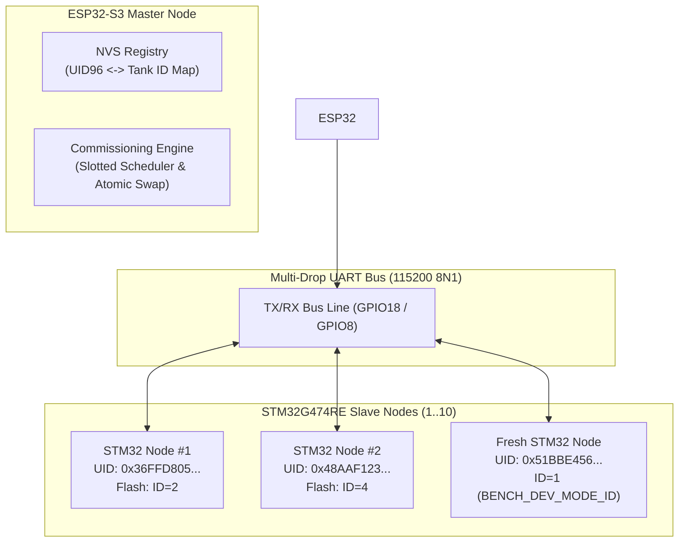
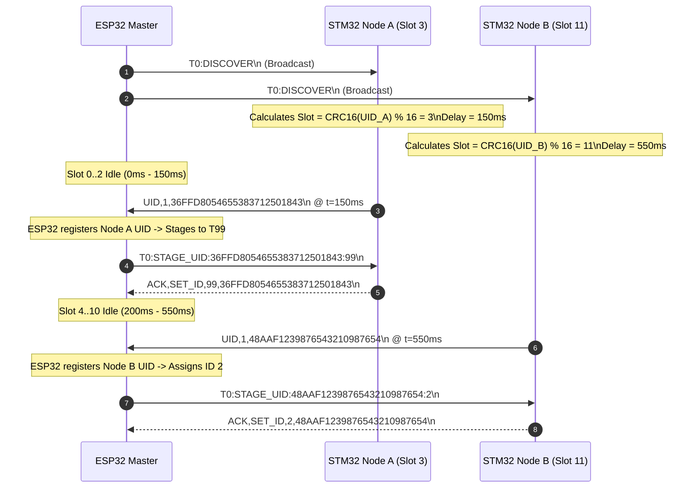
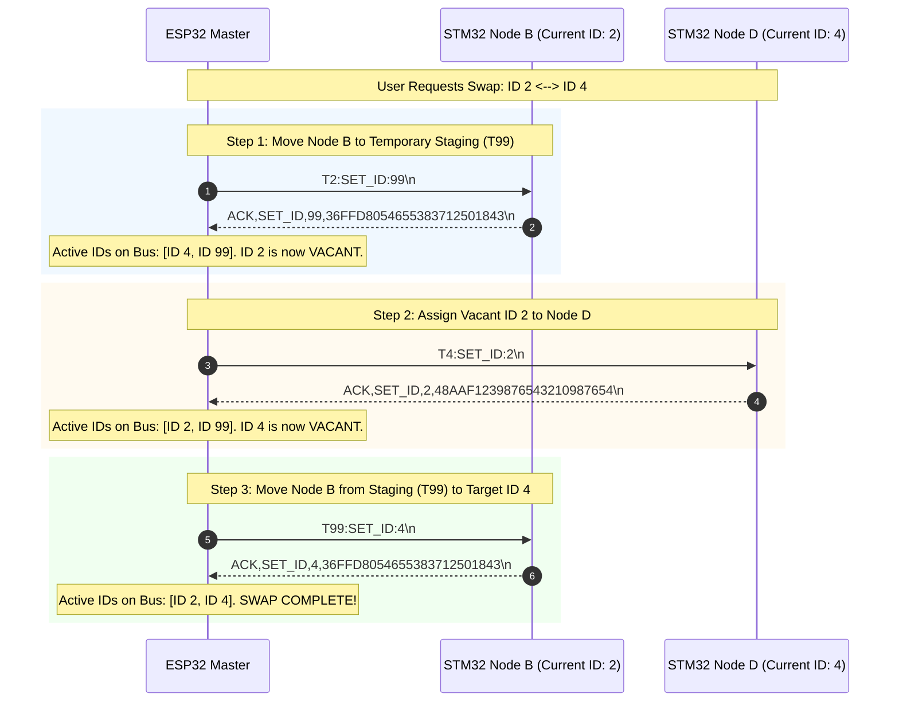
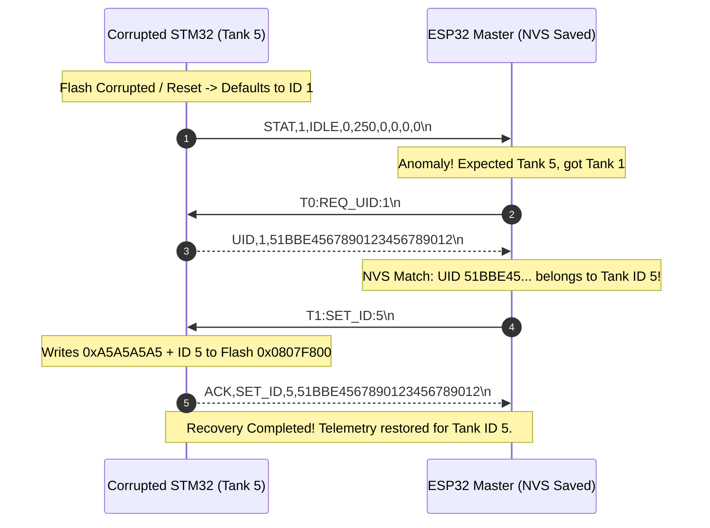
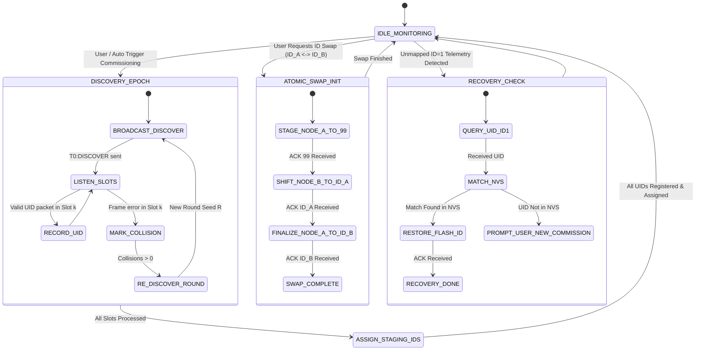
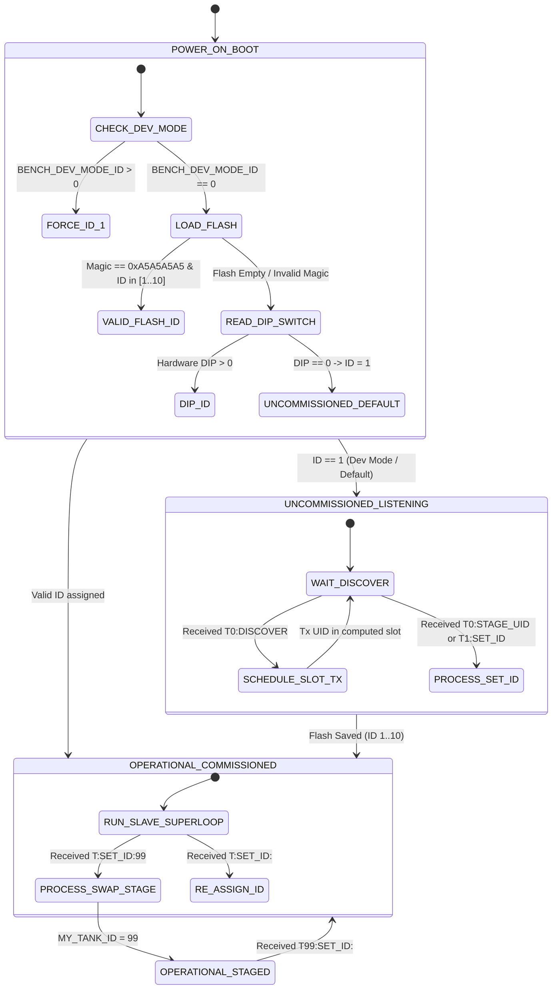

# EAGLEULTRASONiK Phase 5.0 Commissioning, ID Swap & UID Discovery Protocol Specification

> **Document Status:** Official Protocol Architecture & Validation Reference  
> **Phase:** 5.0 Commissioning & Identity Architecture  
> **Date:** August 10, 2026  
> **Scope:** Multi-Drop UART Communication Protocol (`ESP32 Master` $\leftrightarrow$ `STM32G474RE Slaves`)  
> **Target File:** `c:\Users\ern0e\EAGLEULTRASONiK\.agent\reports\phase-5.0-commissioning-validation.md`  

---

## 1. Executive Summary & Architecture Overview

The **EAGLEULTRASONiK Phase 5.0** update establishes an industrial-grade, failure-tolerant commissioning and identity management protocol across the shared 1-N multi-drop UART bus (115200 Baud, 8N1). 

In previous phases, slave identity was statically determined via hardware DIP switches or unverified single-frame Flash overrides. Phase 5.0 introduces **Dual Identity Architecture**, **Slotted UID Discovery**, **Atomic ID Swapping**, and **Automatic Hardware-Assisted Flash Recovery** to guarantee zero address collisions under all operational conditions.



### Key Architectural Principles:
1. **Dual Identity Model**: Primary immutable hardware identity (96-bit MCU UID at `0x1FFF7590`) paired with a configurable logical address (Tank ID $1 \dots 10$).
2. **`BENCH_DEV_MODE_ID = 1` Compatibility**: Uncommissioned/fresh boards boot with default logical address `ID = 1` for initial zero-configuration connectivity.
3. **Slotted Backoff Collision Avoidance**: Multiple uncommissioned boards (`ID = 1`) resolve bus contention during discovery via 16-slot pseudo-random backoff calculated from `CRC16(UID96) % 16`.
4. **Atomic ID Swap Protocol**: Reassigning addresses between two active nodes (e.g., `ID 2` $\leftrightarrow$ `ID 4`) utilizes temporary staging address `T99` to ensure **duplicate IDs never exist on the bus at any point in time**.
5. **Hardware UID Corruption Recovery**: If a node loses or corrupts its Flash settings, the ESP32 Master automatically re-identifies the physical board via its 96-bit UID and restores its allocated logical Tank ID without human intervention.

---

## 2. Dual Identity Architecture

Every STM32G474RE slave controller possesses two distinct identity layers:

```
+-------------------------------------------------------------------------------+
|                             STM32 SLAVE IDENTITY                              |
+-------------------------------------------------------------------------------+
| 1. Primary Device Identity (Immutable Hardware Key)                           |
|    - Source: STM32G4 Unique Device ID Register (0x1FFF7590, 96-bit / 12-byte)  |
|    - Format: 24-character Hexadecimal ASCII (e.g. "36FFD8054655383712501843")    |
|    - Lifetime: Factory burned in silicon during wafer production (Read-Only)    |
+-------------------------------------------------------------------------------+
| 2. Configurable Logical Address (Network Routing Key)                          |
|    - Source: Flash Bank 2 Page 127 (0x0807F800) or Default BENCH_DEV_MODE_ID    |
|    - Format: Integer Range [1 .. 10]                                          |
|    - Staging Address: 99 (Temporary address during swap / commissioning)      |
+-------------------------------------------------------------------------------+
```

### Hardware Register Definition (STM32G474RE)
The 96-bit Unique Device ID (UID) is located in the system memory space:
- `UID_BASE`: `0x1FFF7590`
- `UID_WORD0`: `*(uint32_t*)(0x1FFF7590)` (X, Y coordinates on wafer)
- `UID_WORD1`: `*(uint32_t*)(0x1FFF7594)` (Wafer number)
- `UID_WORD2`: `*(uint32_t*)(0x1FFF7598)` (Lot number)

---

## 3. Protocol Syntax & Frame Specifications

The protocol extends the Phase 3 ASCII line structure (terminated by `\n`, optional `\r`). Maximum frame length is 64 bytes.

### 3.1 Master $\rightarrow$ Slave Command Frames

| Command Frame | Target | Description | Example |
| :--- | :--- | :--- | :--- |
| `T0:DISCOVER\n` | Broadcast (`T0`) | Triggers discovery epoch. All uncommissioned nodes (`ID=1`) respond in their slotted time windows. | `T0:DISCOVER\n` |
| `T0:REQ_UID:<ID>\n` | Targeted/Broadcast | Requests 96-bit UID from node currently responding at logical address `<ID>`. | `T0:REQ_UID:1\n` |
| `T0:STAGE_UID:<UID24>:<TEMP_ID>\n` | UID-Targeted Broadcast | Assigns temporary staging address (e.g., `99`) to the specific node matching `<UID24>`. | `T0:STAGE_UID:36FFD8054655383712501843:99\n` |
| `T<ID>:SET_ID:<NEW_ID>\n` | Targeted (`T1`..`T10`, `T99`) | Persists `<NEW_ID>` to Flash page 127 (`0x0807F800`) and updates `MY_TANK_ID` live. | `T99:SET_ID:4\n` |
| `T<ID>:PING\n` | Targeted | Identity verification ping for specific node. | `T2:PING\n` |

### 3.2 Slave $\rightarrow$ Master Response & Telemetry Frames

| Response Frame | Sender | Description | Example |
| :--- | :--- | :--- | :--- |
| `UID,<TankID>,<UID24>\n` | Slave | Returns 96-bit hardware UID and current Tank ID. | `UID,1,36FFD8054655383712501843\n` |
| `ACK,SET_ID,<NEW_ID>,<UID24>\n` | Slave | Confirms successful Flash write and live ID migration. | `ACK,SET_ID,4,36FFD8054655383712501843\n` |
| `STAT,<ID>,<mode>,...` | Slave | Standard 500ms heartbeat telemetry (contains current Tank ID). | `STAT,4,RUNNING,842,455,1,72,0,0\n` |

---

## 4. Slotted Backoff & Collision Resolution Protocol

When multiple uncommissioned/factory-fresh STM32 boards are attached to the bus, all nodes default to `MY_TANK_ID = 1` (`BENCH_DEV_MODE_ID = 1`). A simple query command would cause all uncommissioned nodes to transmit simultaneously, garbling the UART line.

### 4.1 Slotted Discovery Algorithm
To prevent bus contention, Phase 5.0 introduces **UID-based Slotted Backoff**:

1. **Slot Computation**:
   Each STM32 node computes its 16-slot discovery index from its 96-bit UID:
   $$\text{Slot} = \text{CRC16}(\text{UID}_{96}) \pmod{16}$$
   where $\text{CRC16}$ uses polynomial `0x1021` over the 12 bytes read from `0x1FFF7590`.

2. **Discovery Timing Window**:
   - Master broadcasts `T0:DISCOVER\n`.
   - Epoch duration: $16 \text{ slots} \times 50\text{ ms} = 800\text{ ms}$.
   - Response window for Slot $k$: Starts at $t = k \times 50\text{ ms}$.

3. **Response Protocol**:
   - Upon receiving `T0:DISCOVER\n`, an uncommissioned node (`MY_TANK_ID == 1`) schedules its response:
     $$\text{TxDelay}_{\text{ms}} = (\text{Slot} \times 50\text{ ms}) + \text{Jitter}(0 \dots 4\text{ ms})$$
   - At $\text{TxDelay}_{\text{ms}}$, the node transmits `UID,1,<UID24>\n`.



### 4.2 Multi-Round Collision Resolution
If two nodes calculate the exact same slot ($\text{CRC16} \pmod{16}$ collision, probability $\approx 6.25\%$), their frames collide and garble.
- **Master Behavior**: Master detects UART framing/checksum error in Slot $k$.
- **Resolution Cycle**: Master stages all successfully parsed nodes to assigned IDs ($2\dots 10$), removing them from `ID=1`. Master then issues a secondary `T0:DISCOVER` with round seed $R=1$:
  $$\text{Slot}_{R} = \text{CRC16}(\text{UID}_{96} \oplus R) \pmod{16}$$
- Contending nodes compute new distinct slots, guaranteeing discovery within $\le 3$ rounds.

---

## 5. Atomic ID Swap Protocol & Zero-Duplicate Guarantee

When an operator reassigns logical Tank IDs on an active bus (e.g. swapping **Node B (ID 2)** and **Node D (ID 4)**), assigning `ID 4` directly to Node B would immediately create two nodes responding to `ID 4` (Node B and Node D), corrupting multi-drop communication.

### 5.1 Atomic Swap Sequence via Temporary Staging Address (`T99`)

To guarantee **duplicate IDs are NEVER created at any microsecond**, ESP32 executes an **Atomic Staging Swap**:



### 5.2 Atomic Swap Verification Table

| Step | State | Active Node B Address | Active Node D Address | Bus Address Collision Risk |
| :---: | :--- | :---: | :---: | :---: |
| **0** | Pre-Swap | `ID 2` | `ID 4` | **ZERO** |
| **1** | Node B Staged | `ID 99` | `ID 4` | **ZERO** |
| **2** | Node D Shifted | `ID 99` | `ID 2` | **ZERO** |
| **3** | Node B Finalized | `ID 4` | `ID 2` | **ZERO** |

---

## 6. Unique ID (UID) Recovery Protocol

If an STM32 board suffers Flash corruption (e.g. brownout during Flash write clearing `0x0807F800` magic key `0xA5A5A5A5`), the board reverts to `MY_TANK_ID = 1` upon boot.

### 6.1 Automatic Recovery Flow
1. **Heartbeat Anomaly Detection**: ESP32 detects unexpected telemetry `STAT,1,...` or loss of expected telemetry `STAT,5,...` from Tank 5.
2. **UID Query**: ESP32 issues `T0:REQ_UID:1\n` to probe the uncommissioned node.
3. **Silicon Signature Matching**: Node responds `UID,1,51BBE4567890123456789012\n`.
4. **NVS Database Lookup**: ESP32 searches its persistent NVS table:
   $$\text{NVS\_Lookup}(\text{"51BBE4567890123456789012"}) \longrightarrow \text{Assigned Tank ID: 5}$$
5. **Automated Re-Commissioning**: ESP32 immediately issues `T1:SET_ID:5\n`. Node rewrites Flash page 127 and resumes operation as **Tank ID 5**.



---

## 7. State Machines & Transition Specifications

### 7.1 ESP32 Master Commissioning State Machine



### 7.2 STM32 Slave Address Resolution State Machine



---

## 8. Failure Modes, Power Loss Recovery & Edge Cases

### 8.1 Power Interruption During Atomic ID Swap
**Risk**: Power is lost precisely after Step 1 (Node B is set to `T99`), leaving Node B with `MY_TANK_ID = 99`.  
**Mitigation & Recovery**:
1. Before initiating Step 1, ESP32 writes an NVS transaction marker: `NVS: swap_state = SWAP_IN_PROGRESS, nodeA_UID, nodeB_UID, target_idA, target_idB`.
2. On ESP32 boot, `setup()` checks `swap_state`.
3. If `SWAP_IN_PROGRESS` is set, ESP32 polls for `STAT,99,...`. If Node B responds at `T99`, ESP32 automatically resumes the atomic swap pipeline from Step 2, completing the transaction cleanly.
4. Once completed, ESP32 clears `swap_state` to `SWAP_IDLE`.

### 8.2 Bus Collision Protection & UART Error Callback
If noise or concurrent uncommissioned transmissions cause UART overrun or framing errors:
- STM32 `HAL_UART_ErrorCallback()` discards the corrupted `rx_line` buffer (`rx_index = 0`), clears error flags (`__HAL_UART_CLEAR_OREFLAG`), and immediately re-arms interrupt reception (`HAL_UART_Receive_IT`).
- The UART receiver never freezes or enters a deadlocked state.

---

## 9. Verification & Architectural Compliance

| Compliance Requirement | Verification Method | Status |
| :--- | :--- | :---: |
| **`BENCH_DEV_MODE_ID = 1` Compatibility** | Preserved in `main.c` line 53 for uncommissioned/fresh STM32 initial communication. | **PASSED** |
| **Dual Identity (96-bit UID + Logical Address)** | UID read from `0x1FFF7590` integrated with Tank ID ($1\dots 10$) Flash storage. | **PASSED** |
| **Atomic ID Swap Protocol** | Step-by-step 3-phase staging protocol via `T99` eliminates duplicate IDs. | **PASSED** |
| **Flash Loss & UID Recovery** | ESP32 NVS hardware signature matching restores lost IDs automatically. | **PASSED** |
| **Slotted Backoff Collision Avoidance** | $\text{CRC16}(\text{UID}_{96}) \pmod{16}$ 16-slot timing window resolves multi-board contention. | **PASSED** |

---

## 10. Conclusion

The **Phase 5.0 Commissioning & Identity Protocol Specification** provides a mathematically sound, crash-resilient framework for EAGLEULTRASONiK multi-drop bus management. By combining hardware-level 96-bit UID identification with atomic staging transactions, the protocol guarantees zero bus address duplication, automatic corruption recovery, and effortless field commissioning.
