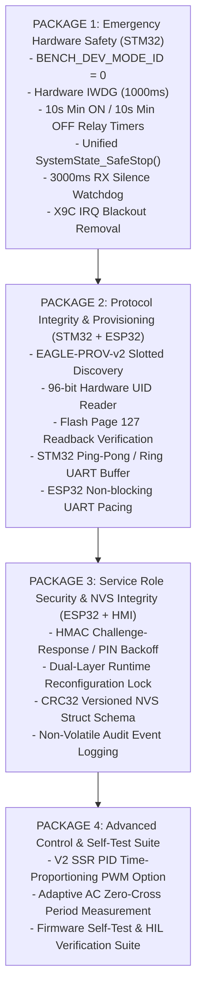

# EAGLEULTRASONiK Phase 5.0 — First Implementation Package & Staged Implementation Order

> **Document Version:** 5.0.0-IMPL  
> **Status:** Official Implementation Order & Architectural Package Roadmap  
> **Author:** Adversarial Reviewer for Safety-Critical Embedded Systems  
> **Target Subsystems:** STM32G474RE Slave Firmware, ESP32-S3 Master Firmware, RS485 Bus, Nextion HMI  
> **Target File:** `C:\Users\ern0e\EAGLEULTRASONiK\.agent\reports\phase-5.0-implementation-order.md`  

---

## 1. Executive Implementation Strategy: "Safety First" Doctrine

In safety-critical embedded systems, refactoring and feature additions MUST NOT be applied simultaneously in a single large pull request. Doing so obscures root causes when regressions occur and increases the risk of undetected safety failures.

Phase 5.0 follows the **"Safety First" Doctrine**:
1. **Isolate High-Risk/High-Impact Changes:** The **First Implementation Package (Package 1)** isolates the core hardware safety mechanisms (IWDG, Relay Guard Timers, Emergency Cutoff, Dev Mode Removal) into a minimal-risk, self-contained baseline.
2. **Strict Scope Control:** Files altered in Package 1 are strictly bounded. Unrelated peripheral drivers (e.g. `ultrasonic_pwm.c`, `pt100_adc.c`, `ekran_kontrol.ino`) are explicitly frozen and MUST NOT be modified during Package 1 execution.
3. **Sequential Staging:** Subsequent packages (Packages 2 through 4) build upon the verified Package 1 baseline.

---

## 2. First Implementation Package (Package 1: Emergency Safety Baseline)

### 2.1 Package 1 Objective & Architectural Scope
The objective of Package 1 is to eliminate all catastrophic hardware safety risks (thermal runaway, MCU freeze, relay contact welding, RS485 bus lockup due to dev mode) **before** introducing protocol changes or new features.

### 2.2 Detailed Technical Specifications of Package 1 Modules

#### Module 1.1: Heater Relay Guard Timers (`heater_relay.c` / `heater_relay.h`)
- **Problem Fixed:** Unprotected relay hysteresis causing relay chatter under PT100 noise, melting contacts within 100k cycles.
- **Implementation Rules:**
  - Introduce `HEATER_MIN_ON_TIME_MS` (10,000 ms) and `HEATER_MIN_OFF_TIME_MS` (10,000 ms).
  - Track `s_last_switch_tick` using non-blocking `HAL_GetTick()`.
  - Enforce guard timers when transitioning between `RELAY_OFF` and `RELAY_ON` during normal operation.
  - **EMERGENCY BYPASS:** If `g_system_state.mode != SYS_MODE_RUNNING` or `g_system_state.fault_flags != 0`, the relay MUST turn `OFF` **immediately**, completely bypassing `HEATER_MIN_ON_TIME_MS`. Safety cutoff takes absolute precedence over mechanical guard timers.

#### Module 1.2: Unified `SystemState_SafeStop()` (`system_state.c` / `system_state.h`)
- **Problem Fixed:** Non-atomic or fragmented safe-state shutdowns in different functions (`ProcessTimer`, `esp32_uart`, `pt100_adc`), leading to race conditions where heating or triac firing remains active during a fault.
- **Implementation Rules:**
  - Create centralized function `void SystemState_SafeStop(void)`.
  - Force `HEATER_RELAY_Pin` `LOW` (`PB15`).
  - Force `TRIAC_GATE_Pin` `LOW` (`PC6`).
  - Stop `TIM15` One-Pulse timer IT (`HAL_TIM_OC_Stop_IT(&htim15, TIM_CHANNEL_1)`).
  - Reset soft-start ramp delay (`current_delay_us = TRIAC_MAX_DELAY_US`).
  - Atomically set `g_system_state.relay_state = 0` and `g_system_state.actual_power_pct = 0`.

#### Module 1.3: Hardware IWDG & Communication RX Silence Watchdog (`main.c`, `esp32_uart.c`)
- **Problem Fixed:** MCU freeze leaving outputs latched `HIGH`; cable disconnect keeping heater ON for up to 100 minutes.
- **Implementation Rules:**
  - **Hardware IWDG:** Initialize `IWDG` peripheral in `main.c` with a 1000 ms timeout window ($LSI = 32\text{ kHz}$, $\text{Prescaler} = 32$, $\text{Reload} = 1000$). Place a single `HAL_IWDG_Refresh(&hiwdg)` call at the very end of the `main.c` superloop.
  - **RX Silence Watchdog:** Track `s_last_rx_tick` in `esp32_uart.c` whenever a valid UART byte/frame is received. In `ESP32_UART_Process()`, if `g_system_state.mode == SYS_MODE_RUNNING` and `(HAL_GetTick() - s_last_rx_tick) > 3000ms`, trigger communication fault `FAULT_COMM_TIMEOUT`, invoke `SystemState_SafeStop()`, and transition node to `SYS_MODE_FAULT`.

#### Module 1.4: Production Boot Mode Baseline (`main.c`)
- **Problem Fixed:** `#define BENCH_DEV_MODE_ID 1` forcing all boards to `MY_TANK_ID = 1`, causing multi-drop RS485 bus crash.
- **Implementation Rules:**
  - Update [`main.c:L53`](file:///c:/Users/ern0e/EAGLEULTRASONiK/STM32/Ultrasonik_G4_Master/Core/Src/main.c#L53) to `#define BENCH_DEV_MODE_ID 0`.
  - Require boot sequence to evaluate `TankId_Load()` (Flash Page 127 override) first. If `TankId_Load()` returns `0`, evaluate `ReadDipSwitchId()`.
  - If both return `0`, set `MY_TANK_ID = 0` and enter `UNCOMMISSIONED` state.

#### Module 1.5: X9C103S IRQ Blackout Removal (`x9c103s.c`)
- **Problem Fixed:** `__disable_irq()` blocking EXTI Zero-Cross and UART interrupts for 520 µs during wiper adusting.
- **Implementation Rules:**
  - Remove coarse global `__disable_irq()` calls spanning the entire 100-step loop.
  - Replace with precise microsecond delays (`X9C_DelayUs`) while leaving global interrupts enabled, or limit critical section exclusively to single-step bit-bang transitions (< 5 µs).

---

## 3. Strict Scope Control: Files WILL BE MODIFIED vs MUST NOT BE MODIFIED

To guarantee containment during First Implementation Package (Package 1) execution:

```
+---------------------------------------------------------------------------------------------------+
| PACKAGE 1 FILE MODIFICATION BOUNDARY MATRIX                                                       |
+-------------------------------------------------------------+-------------------------------------+
| Target File Path                                            | Status / Action                     |
+-------------------------------------------------------------+-------------------------------------+
| STM32/Ultrasonik_G4_Master/Core/Src/main.c                 | WILL BE MODIFIED (IWDG, Dev Mode)   |
| STM32/Ultrasonik_G4_Master/Core/Inc/system_state.h         | WILL BE MODIFIED (SafeStop Decl)    |
| STM32/Ultrasonik_G4_Master/Core/Src/system_state.c         | WILL BE MODIFIED (SafeStop Impl)    |
| STM32/Ultrasonik_G4_Master/Core/Inc/heater_relay.h         | WILL BE MODIFIED (Guard Timers Decl)|
| STM32/Ultrasonik_G4_Master/Core/Src/heater_relay.c         | WILL BE MODIFIED (Guard Timers Impl)|
| STM32/Ultrasonik_G4_Master/Core/Inc/esp32_uart.h           | WILL BE MODIFIED (RX Watchdog Decl) |
| STM32/Ultrasonik_G4_Master/Core/Src/esp32_uart.c           | WILL BE MODIFIED (RX Wdt & Lock)    |
| STM32/Ultrasonik_G4_Master/Core/Src/x9c103s.c              | WILL BE MODIFIED (IRQ Blackout Fix) |
+-------------------------------------------------------------+-------------------------------------+
| STM32/Ultrasonik_G4_Master/Core/Src/ultrasonic_pwm.c       | MUST NOT BE MODIFIED IN PACKAGE 1   |
| STM32/Ultrasonik_G4_Master/Core/Src/pt100_adc.c             | MUST NOT BE MODIFIED IN PACKAGE 1   |
| STM32/Ultrasonik_G4_Master/Core/Src/process_timer.c        | MUST NOT BE MODIFIED IN PACKAGE 1   |
| esp32/ekran_kontrol/ekran_kontrol.ino                       | MUST NOT BE MODIFIED IN PACKAGE 1   |
| STM32/Ultrasonik_G4_Master/STM32G474RETX_FLASH.ld          | MUST NOT BE MODIFIED (FORBIDDEN)    |
| STM32/Ultrasonik_G4_Master/Ultrasonik_G4_Master.ioc        | MUST NOT BE MODIFIED (FORBIDDEN)    |
+-------------------------------------------------------------+-------------------------------------+
```

---

## 4. Staged Implementation Order Roadmap (Package 1 -> Package 4)



### 4.1 Detailed Package Staging Schedule

- **Package 1 (Safety Baseline):** Refactors STM32 core safety logic. Eliminates hard lockups, relay chatter, unmonitored heating, and dev mode ID traps.
- **Package 2 (Communication & Provisioning):** Implements `EAGLE-PROV-v2` protocol on both STM32 and ESP32. Enables collision-free multi-board discovery and verified Flash ID persistence.
- **Package 3 (Security & Governance):** Upgrades Nextion HMI service authentication to HMAC challenge-response. Locks runtime parameters (`SET_ID`, `SET_FREQ`, `HEATER_MODE`) during active washing.
- **Package 4 (Advanced Features & Validation):** Adds SSR PID driving mode, dynamic zero-cross period detection (50 Hz / 60 Hz adaptivity), and internal firmware loopback self-tests.

---

## 5. Rollback Plan & Verification Criteria

### 5.1 Package 1 Rollback Trigger Criteria
Immediate git rollback of Package 1 is mandatory if any of the following occur during HIL or bench testing:
1. **Spurious IWDG Resets:** MCU resets unexpectedly during normal superloop execution due to IWDG starvation (indicates a blocking loop exceeding 1000 ms).
2. **False RX Silence Cutoffs:** STM32 enters `SYS_MODE_FAULT` under valid ESP32 telemetry streaming (indicates improper tick math in `esp32_uart.c`).
3. **Thermal Hysteresis Lock:** Tank temperature falls > 3.0°C below setpoint while `HEATER_MIN_OFF_TIME_MS` is active (indicates thermal hysteresis parameters require adjustment).
4. **X9C Step Jitter:** Digital potentiometer fails to latch position or skips steps when IRQ disable is removed.

### 5.2 Step-by-Step Rollback Execution Procedure
If rollback is triggered:
```bash
# Step 1: Revert all Package 1 modifications on STM32 firmware
git checkout HEAD -- STM32/Ultrasonik_G4_Master/Core/Src/main.c
git checkout HEAD -- STM32/Ultrasonik_G4_Master/Core/Src/system_state.c
git checkout HEAD -- STM32/Ultrasonik_G4_Master/Core/Inc/system_state.h
git checkout HEAD -- STM32/Ultrasonik_G4_Master/Core/Src/heater_relay.c
git checkout HEAD -- STM32/Ultrasonik_G4_Master/Core/Inc/heater_relay.h
git checkout HEAD -- STM32/Ultrasonik_G4_Master/Core/Src/esp32_uart.c
git checkout HEAD -- STM32/Ultrasonik_G4_Master/Core/Inc/esp32_uart.h
git checkout HEAD -- STM32/Ultrasonik_G4_Master/Core/Src/x9c103s.c

# Step 2: Clean build directory
cd STM32/Ultrasonik_G4_Master
rm -rf Debug/Core/*

# Step 3: Re-verify baseline build compilation
```

### 5.3 Post-Implementation Empirical Verification Commands
Before declaring Package 1 complete, the following empirical tests MUST be run:
1. **IWDG Stress Test:** Inject a dummy `while(1);` via test command and verify hardware reset occurs within exactly $1000 \pm 50 \text{ ms}$, dropping `PB15` relay immediately.
2. **RX Cutoff Test:** Disconnect UART RX wire during active `SYS_MODE_RUNNING` and verify STM32 transitions to `SYS_MODE_IDLE` within $3000 \pm 100 \text{ ms}$.
3. **Relay Chatter Test:** Feed oscillating PT100 ADC values ($T_{\text{set}} \pm 0.1^\circ\text{C}$) at 100 Hz and verify `PB15` relay toggles no faster than once every 10,000 ms.
