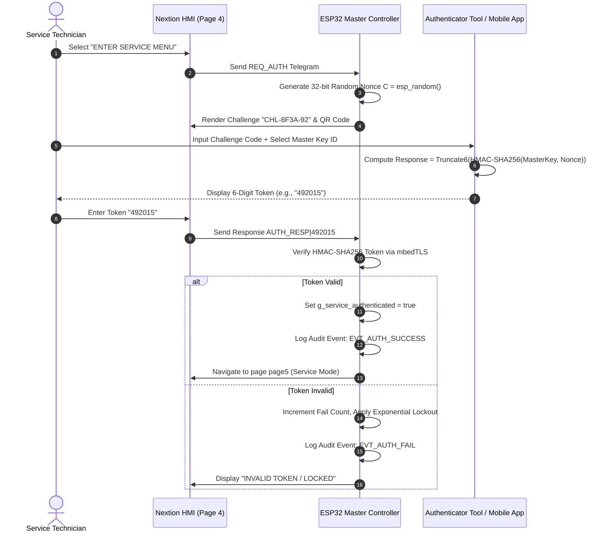
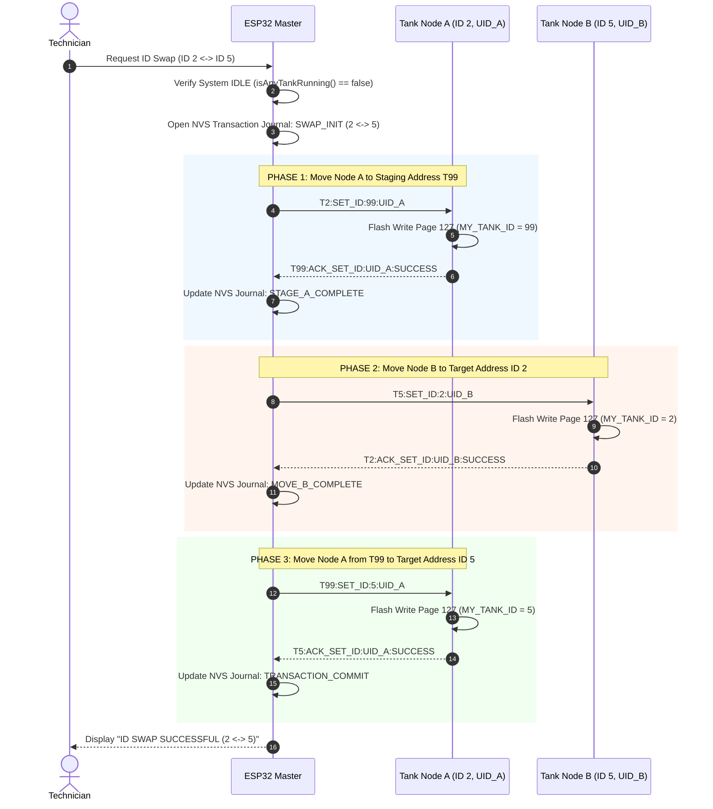
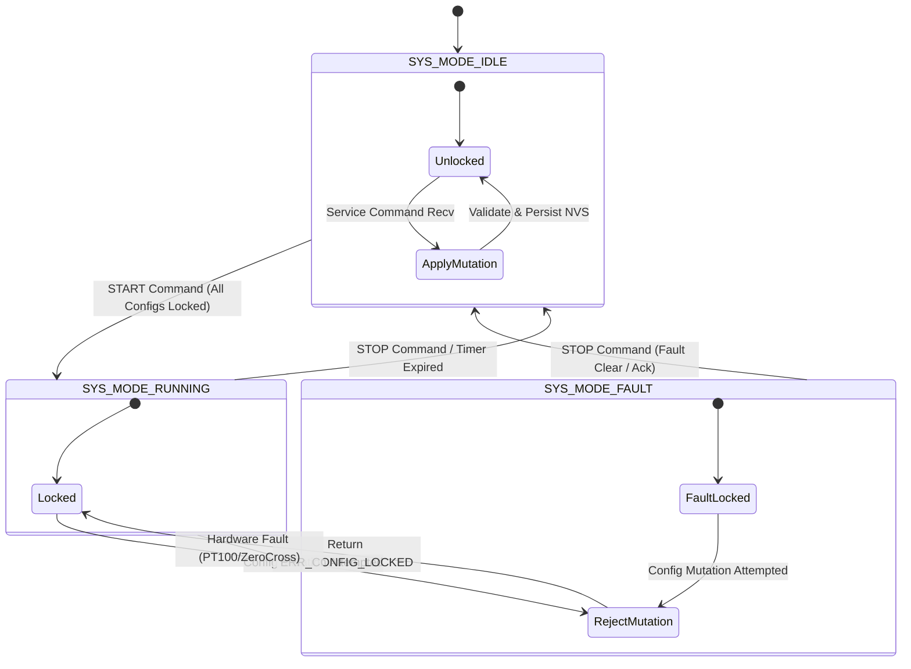
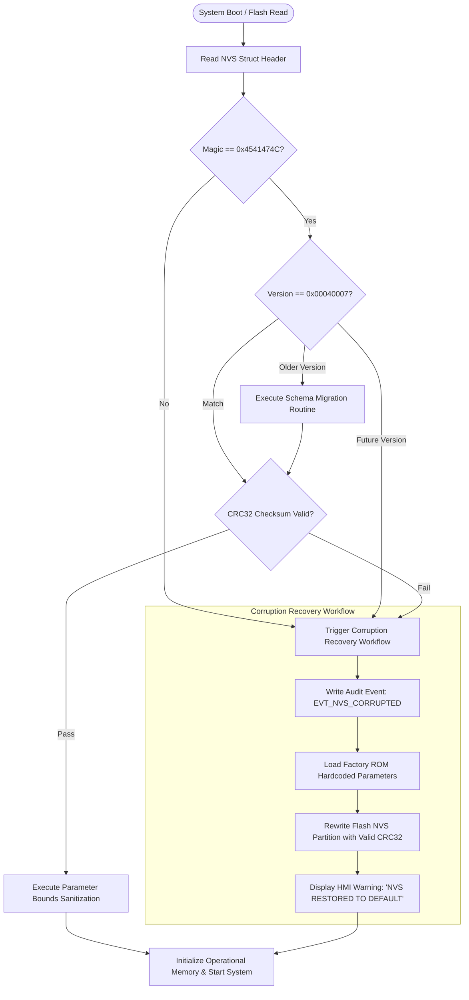

# EAGLEULTRASONİK Phase 5.0 — Security Risk Register & Configuration Architecture Specification

> **Document Version:** 5.0.0  
> **Author:** Embedded Security Architect  
> **Status:** Official Security Engineering Validation & Risk Assessment Specification  
> **Target Platform:** Dual-Core Industrial Ultrasonic System — ESP32-S3 Master ([`ekran_kontrol.ino`](file:///C:/Users/ern0e/EAGLEULTRASONiK/esp32/ekran_kontrol/ekran_kontrol.ino)) & STM32G474RE Multi-Drop Slaves ([`STM32/Ultrasonik_G4_Master/Core`](file:///C:/Users/ern0e/EAGLEULTRASONiK/STM32/Ultrasonik_G4_Master/Core))  
> **Scope:** Service Mode Authentication, Role Isolation, Atomic ID Swap Security, Runtime Configuration Lock, NVS Schema Validation (`0x00040007`), CRC32 Integrity, Parameter Sanitization, Audit Logging  

---

## 1. EXECUTIVE SUMMARY & SECURITY RISK BASELINE

The **EAGLEULTRASONİK Phase 5.0** platform relies on an asymmetric dual-controller topology: an ESP32-S3 Master operating the Nextion HMI interface (`Serial2`) and coordinating multi-drop ASCII UART communications (`Serial1` at 115200 Baud), paired with up to 10 STM32G474RE Slave nodes controlling zero-cross synchronized triac phase-angle ultrasonic power generation, PT100 temperature sampling, and bang-bang/SSR relay heating.

### 1.1 Core Security Directives & Mandates
1. **Zero Source Code Mutation:** This specification validates architecture and establishes risk controls without modifying underlying source code files.
2. **Service Role Authentication & Separation:** Replace static plaintext password comparisons with dynamic challenge-response token authentication (HMAC-SHA256) and firmware-enforced page guarding.
3. **Atomic ID Swap Security:** Enforce a 3-way transactional swap protocol utilizing temporary staging address `T99` to prevent bus collisions, duplicate address attacks, and orphan nodes.
4. **Dual-Layer Runtime Configuration Lock:** Electrically and logically block configuration mutations (`HEATER_MODE`, `TANK_ID`, `SET_FREQ`, calibration offsets) whenever `SYS_MODE_RUNNING` is active on Master or target Slave.
5. **NVS Integrity & Schema Validation:** Enforce packed structure layout, schema versioning (`0x00040007`), IEEE 802.3 CRC32 checksums, rigid range sanitization, and fallback recovery.

---

## 2. SERVICE MODE AUTHENTICATION & ROLE SEPARATION (OPERATOR VS SERVICE)

### 2.1 Role Privilege Matrix
Separation of duties prevents daily machine operators from altering hardware drive modes or thermal interlocks:

| Privilege / Feature | Operator Role (Pages 0–2) | Service Role (Page 5+) | Security & Safety Rationale |
|---|:---:|:---:|---|
| **Process Control (`START`/`STOP`)** | READ / WRITE | READ / WRITE | Operational workflow execution |
| **Recipe Selection (`P1`..`P3`)** | READ / WRITE | READ / WRITE | Operational recipe loading |
| **Active Tank View (`PAGE1_OPEN`)** | READ / WRITE | READ / WRITE | Monitoring multi-drop tanks ($1..10$) |
| **Recipe Time/Temp Edit (`P_SAVE`)** | READ / WRITE | READ / WRITE | Clamped to operational range ($0..100\text{ min}$, $0..90^\circ\text{C}$) |
| **Ultrasonic Frequency Switch** | READ / WRITE | READ / WRITE | Toggles X9C103S digital pot ($28\text{ kHz}$ / $40\text{ kHz}$) |
| **Heater Mode (`RELAY` vs `SSR_PWM`)** | **DENIED** | READ / WRITE | **CRITICAL:** High-frequency PWM on mechanical relay causes contact welding & fire hazard |
| **Tank Bus Address (`SET_ID`)** | **DENIED** | READ / WRITE | **CRITICAL:** Duplicate address creates RS485 bus collision & unmonitored operation |
| **Active Tank Limit (`max_goz_sayisi`)** | **DENIED** | READ / WRITE | Out-of-bounds array access or unmonitored slave nodes |
| **Max Power Limit (`guc_seviyesi`)** | **DENIED** | READ / WRITE | Transducer over-excitation / generator thermal overload |
| **PT100 Sensor Calibration** | **DENIED** | READ / WRITE | Incorrect calibration slope leads to thermal runaway |
| **Direct Relay/PWM Override** | **DENIED** | READ / WRITE | Manual override bypassing hardware thermal interlocks |

---

### 2.2 Vulnerability Analysis of Legacy Static PIN Implementation
The legacy implementation ([`ekran_kontrol.ino:L44-L45`](file:///C:/Users/ern0e/EAGLEULTRASONiK/esp32/ekran_kontrol/ekran_kontrol.ino#L44-L45) & [`L539-L551`](file:///C:/Users/ern0e/EAGLEULTRASONiK/esp32/ekran_kontrol/ekran_kontrol.ino#L539-L551)) stores a plaintext global variable `String dogru_sifre = "123456";`:

```cpp
// Legacy Vulnerable Implementation in ekran_kontrol.ino
String girilen_sifre = "";
String dogru_sifre = "123456";
```

#### Identified Deficiencies:
1. **Hardcoded Global Credential:** `"123456"` allows universal unauthorized privilege escalation.
2. **Plaintext HMI Traffic:** Keystrokes (`KEY1`, `KEY2`, ...) are sent over unencrypted UART (`Serial2`), making pin capture trivial via hardware wiretaps.
3. **No Brute-Force Throttling:** Rapid infinite PIN attempts are permitted without delay or lockout.
4. **Missing HMI Page Guarding:** Nextion UART can be commanded directly via `page page5` from external serial injection, bypassing UI login checks entirely.

---

### 2.3 Cryptographic Challenge-Response Authentication Specification

To eliminate password sniffing and replay attacks on factory floors, Phase 5.0 specifies a **Dynamic HMAC-SHA256 Challenge-Response Protocol**:



#### Technical Implementation Details:
1. **Challenge Generation:** ESP32 generates a unique 32-bit nonce $C = \text{esp\_random()}$ for every authentication session.
2. **HMAC-SHA256 Derivation:**
   $$\text{Token} = \text{Truncate}_{6\_digits}\left(\text{HMAC-SHA256}(K_{device}, C \parallel T_{session})\right)$$
3. **Fallback Static PIN with Anti-Tamper Lockout:**
   - **Attempts 1–3:** Normal evaluation.
   - **Attempt 4:** 10-second penalty delay enforced by non-blocking timer.
   - **Attempt 5:** 60-second penalty delay.
   - **Attempt 6+:** 15-minute complete lockout; log event `EVT_AUTH_LOCKOUT` written to flash.
4. **Firmware-Enforced Page Guarding:**
   ESP32 maintains `bool g_service_authenticated = false;`. All incoming service parameter commands (`GUC_UP`, `ID_UP`, `MAX_UP`, `SRV_SAVE`, `SET_HEATER_MODE`, `CAL_PT100`) MUST verify `g_service_authenticated == true`.
5. **Session Auto-Lock:** A service session automatically expires after 300 seconds of inactivity, clearing `g_service_authenticated = false` and forcing Nextion HMI to `page page0`.

---

## 3. ATOMIC ID SWAP TRANSACTION PROTOCOL & BUS SECURITY

### 3.1 Threat Analysis of Dynamic ID Reassignment
In multi-drop RS485 UART architectures, reassigning tank bus addresses during active deployment presents severe security risks:

```
+---------------------------------------------------------------------------------------------------+
| NAIVE 2-STEP SWAP FAILURE & ATTACK VECTORS                                                        |
+-------------------+----------------------------------+--------------------------------------------+
| Failure Vector    | Mechanism                        | System Impact                              |
+-------------------+----------------------------------+--------------------------------------------+
| Duplicate ID      | Naive Swap: Node 2 set to ID 5   | TWO nodes exist on address 5 simultaneously|
| Address Attack    | before Node 5 is moved to ID 2.  | Unicast commands execute on BOTH nodes.    |
|                   |                                  | UART TX line collision corrupts telemetry. |
+-------------------+----------------------------------+--------------------------------------------+
| Mid-Swap Power    | Power lost after Node 2 -> ID 5, | Node 2 original address lost.              |
| Interruption      | before Node 5 -> ID 2.           | On reboot, Node 2 is orphaned or collides |
|                   |                                  | with Node 5 permanent flash config.        |
+-------------------+----------------------------------+--------------------------------------------+
| Dynamic Execution | `SET_ID` sent while process      | `HAL_FLASHEx_Erase()` freezes CPU for 40ms |
| Hazard            | `SYS_MODE_RUNNING` is active.    | Zero-cross timing missed, heater unmonitored.|
+-------------------+----------------------------------+--------------------------------------------+
```

---

### 3.2 3-Way Atomic ID Swap Specification (Staging Address `T99`)

To guarantee zero duplicate address windows and complete recoverability, Phase 5.0 mandates a **3-Way Transactional ID Swap Protocol**:



#### Protocol Rules & Transaction Safety Guarantee:
1. **Unique UID Verification:** Every `SET_ID` command MUST include the target node's 24-bit Microcontroller Unique ID (`UID24`). Nodes reject `SET_ID` frames where `UID24` does not match their internal hardware ID.
2. **Staging Address (`T99`):** No two operational nodes ever share an address. Node A is parked at temporary address `T99` before Node B assumes Node A's former address.
3. **NVS Transaction Journaling & Auto-Rollback:**
   The ESP32 Master records transaction steps in NVS (`swap_state`, `node_a_id`, `node_b_id`, `uid_a`, `uid_b`).
   If a timeout ($5000\text{ ms}$) or power loss occurs mid-transaction, the ESP32 boot routine inspects the journal and automatically completes or rolls back the swap:
   - **Interrupted at Phase 1:** Master re-issues `T2:SET_ID:99:UID_A`.
   - **Interrupted at Phase 2:** Master issues `T99:SET_ID:2:UID_A` (Rollback Node A to original ID 2).
   - **Interrupted at Phase 3:** Master re-issues `T99:SET_ID:5:UID_A` (Commit Node A to final ID 5).

---

## 4. RUNTIME CONFIGURATION LOCK ARCHITECTURE

### 4.1 Hazard Analysis of Dynamic Mutation During `SYS_MODE_RUNNING`

Mutating configuration parameters while process loops are actively running creates severe physical and electrical hazards:

```
+---------------------------------------------------------------------------------------------------+
| DYNAMIC RECONFIGURATION HAZARD MATRIX                                                             |
+-------------------+----------------------------------+--------------------------------------------+
| Target Parameter  | Mutation Hazard During RUNNING   | Physical & Electrical Safety Impact        |
+-------------------+----------------------------------+--------------------------------------------+
| HEATER_MODE       | Switching `RELAY` -> `SSR_PWM`   | Drives mechanical relay with 10Hz PWM.     |
|                   | mid-cycle                        | Contacts chatter, weld, and catch fire.    |
+-------------------+----------------------------------+--------------------------------------------+
| TANK_ID           | Executing `SET_ID` mid-process   | Calls `HAL_FLASHEx_Erase()`, freezing CPU  |
|                   |                                  | for 40ms. Address shifts mid-heating;     |
|                   |                                  | telemetry lost, tank runs unmonitored.     |
+-------------------+----------------------------------+--------------------------------------------+
| FREQUENCY_KHZ     | Executing `SET_FREQ` (28/40 kHz) | Toggles X9C103S digital pot during active  |
|                   | during ultrasonic cavitation     | cavitation. Inductive back-EMF spikes      |
|                   |                                  | destroy piezoceramic transducers & FETs.   |
+-------------------+----------------------------------+--------------------------------------------+
| MAX_POWER_PCT     | Dynamic shift in triac phase-    | Sudden phase-angle step causes high inrush |
|                   | angle firing delay               | current, tripping AC mains breakers.       |
+-------------------+----------------------------------+--------------------------------------------+
| PT100_CAL_OFFSET  | Re-calibrating PT100 slope/offset| Instantaneous step change in current_temp  |
|                   | during heating                   | destabilizes hysteresis loop & chatters.   |
+---------------------------------------------------------------------------------------------------+
```

---

### 4.2 Dual-Layer Configuration Interlock Specification

To guarantee safety even if an unvalidated frame reaches the internal UART bus, enforcement MUST be implemented in **both controller layers**:



#### Layer 1: ESP32 Master Pre-Transmission Interlock ([`ekran_kontrol.ino`](file:///C:/Users/ern0e/EAGLEULTRASONiK/esp32/ekran_kontrol/ekran_kontrol.ino))
Before encoding or transmitting any service parameter mutation over UART or Nextion HMI, the Master validates process state across all tanks:

```cpp
// ESP32 Master Pre-Transmission Interlock Check
bool isAnyTankRunning() {
  for (int g = 1; g < MAX_GOZ; g++) {
    if (makine_calisiyor[g]) return true;
  }
  return false;
}

void processServiceMutation(String cmd) {
  if (isAnyTankRunning()) {
    Serial.println("--> ERROR: RECONFIGURATION REJECTED! Process is RUNNING.");
    nextionGonder("t_status.txt=\"LOCKED: SYS RUNNING\"");
    logAuditEvent(EVT_CFG_REJECTED_RUNNING, cmd.c_str());
    return; // Block execution
  }
  // Proceed with parameter update...
}
```

#### Layer 2: STM32 Slave Firmware Hardware Interlock ([`esp32_uart.c:L105-L180`](file:///C:/Users/ern0e/EAGLEULTRASONiK/STM32/Ultrasonik_G4_Master/Core/Src/esp32_uart.c#L105-L180))
The STM32 Slave checks `g_system_state.mode == SYS_MODE_RUNNING` inside `ProcessLine()` before parsing any configuration command:

```c
// STM32 Slave Firmware Hardware Guard in esp32_uart.c
static void ProcessLine(const char *line)
{
  // Parsing address prefix...
  // ...
  
  /* CRITICAL RUNTIME CONFIGURATION LOCK:
   * Reconfiguration commands CANNOT be executed while mode == SYS_MODE_RUNNING. */
  if (g_system_state.mode == SYS_MODE_RUNNING)
  {
    if (strncmp(cmd, "SET_ID:", 7) == 0 ||
        strncmp(cmd, "SET_FREQ:", 9) == 0 ||
        strncmp(cmd, "SET_HEATER_MODE:", 16) == 0 ||
        strncmp(cmd, "CAL_PT100:", 10) == 0)
    {
      const char *err_msg = "ERR:LOCKED_SYS_RUNNING\n";
      HAL_UART_Transmit(&huart3, (const uint8_t *)err_msg, strlen(err_msg), 10);
      HAL_UART_Transmit(&hlpuart1, (const uint8_t *)err_msg, strlen(err_msg), 10);
      return; /* Reject command immediately without altering state */
    }
  }

  // Normal command processing...
}
```

---

## 5. NVS INTEGRITY, SCHEMA VERSIONING, SANITIZATION & RECOVERY

### 5.1 NVS Packed Binary Struct Layout
All persistent parameters stored in ESP32 `Preferences` and STM32 Flash Page 127 ([`main.c:L46-L50`](file:///C:/Users/ern0e/EAGLEULTRASONiK/STM32/Ultrasonik_G4_Master/Core/Src/main.c#L46-L50)) MUST adhere to a strict, packed binary contract:

```c
/**
  * @brief NVS System Configuration Header & Payload Layout (Phase 5.0)
  */
#define NVS_CONFIG_MAGIC    0x4541474C  /* ASCII "EAGL" */
#define NVS_SCHEMA_VERSION  0x00040007  /* Schema Version Tag: 0x00040007 */

typedef enum {
  HEATER_MODE_RELAY   = 0x00, /* Mechanical Relay (bang-bang +-1.0C hysteresis) */
  HEATER_MODE_SSR_PWM = 0x01  /* Solid State Relay (low-frequency PWM drive) */
} HeaterMode_t;

typedef struct __attribute__((packed)) {
  /* Header Section (12 Bytes) */
  uint32_t magic;              /* Magic Header Identifier: 0x4541474C */
  uint32_t schema_version;     /* Schema Version Tag: 0x00040007 */
  uint32_t crc32;              /* IEEE 802.3 CRC32 checksum over payload */
  
  /* System Configuration Payload */
  uint8_t  tank_id;            /* Bus Address (1..10) */
  uint8_t  max_tanks;          /* Active Bus Tanks Limit (1..10) */
  uint8_t  max_power_pct;      /* Global Ultrasonic Power Cap (10..100%) */
  uint8_t  heater_mode;        /* HeaterMode_t: RELAY (0) vs SSR_PWM (1) */
  uint16_t recipe_time[4];     /* Default recipe times (P0..P3) in minutes */
  uint16_t recipe_temp[4];     /* Default recipe temps (P0..P3) in deg C */
  
  /* Sensor Calibration Coefficients */
  float    pt100_cal_slope;    /* PT100 ADC conversion slope (default: 0.0327f) */
  float    pt100_cal_offset;   /* PT100 calibration offset degC (default: -20.0f) */
  
  /* Security & Authentication Configuration */
  uint8_t  auth_mode;          /* 0 = HMAC Challenge-Response, 1 = Static PIN */
  uint32_t static_pin_hash;    /* Salted SHA256 snippet of static PIN */
  
  uint8_t  reserved[32];       /* Structure expansion padding */
} NvsConfigPayload_t;
```

---

### 5.2 NVS Parameter Sanitization & Bounds Matrix

Every parameter read from non-volatile storage or received over serial interface MUST pass rigid range validation before assignment:

| Parameter | Storage Type | Valid Operational Bounds | Safe Fallback Default | Action on Out-of-Bounds Detection |
|---|---|---|---|---|
| `tank_id` | `uint8_t` | `1` .. `10` | `1` | Clamp to bounds; log warning |
| `max_tanks` | `uint8_t` | `1` .. `10` | `3` | Clamp to `10` |
| `max_power_pct` | `uint8_t` | `10%` .. `100%` | `100%` | Clamp to `100%` |
| `heater_mode` | `enum` | `0` (`RELAY`), `1` (`SSR_PWM`) | `0` (`RELAY`) | Reset to `0` (`RELAY`) |
| `recipe_time[1..3]` | `uint16_t` | `1` .. `100` min | `15` min | Clamp to bounds |
| `recipe_temp[1..3]` | `uint16_t` | `0` .. `90` °C | `40` °C | Clamp to bounds |
| `pt100_cal_slope` | `float` | `0.0200` .. `0.0500` | `0.0327` | Reset to factory slope |
| `pt100_cal_offset`| `float` | `-50.0` .. `+50.0` °C | `-20.0` °C | Reset to factory offset |
| `static_pin_hash` | `uint32_t` | Non-zero | Hash of `"123456"` | Reset PIN & force setup |

---

### 5.3 NVS Corruption Detection & Recovery Workflow



---

## 6. COMPREHENSIVE SECURITY RISK REGISTER FOR PHASE 5.0

The following matrix classifies all identified security threats, vulnerabilities, architectural impacts, and required mitigation controls for Phase 5.0:

| Risk ID | Security Threat & Description | Affected Component | Severity / Likelihood | Potential System Impact | Architectural Mitigation Strategy | Verification Test Case |
|---|---|---|:---:|---|---|---|
| **SEC-RISK-501** | **Static Plaintext PIN Exposure & Sniffing:** Hardcoded `"123456"` in RAM and raw string keystrokes on HMI UART allows unauthorized operator privilege escalation. | [`ekran_kontrol.ino:L44`](file:///C:/Users/ern0e/EAGLEULTRASONiK/esp32/ekran_kontrol/ekran_kontrol.ino#L44) | 🔴 **HIGH** / **HIGH** | Operator bypasses safety limits, alters power limits, and forces direct hardware controls. | Deprecate static PIN; implement dynamic HMAC-SHA256 Challenge-Response token auth and exponential backoff lockout. | Attempt serial sniffing on GPIO16/17; verify challenge code generates unique dynamic responses. |
| **SEC-RISK-502** | **Unauthenticated Service Mode Mutation via Serial Injection:** External serial frame sending `page page5` or service commands directly over UART bypasses Nextion PIN page. | [`ekran_kontrol.ino:L522`](file:///C:/Users/ern0e/EAGLEULTRASONiK/esp32/ekran_kontrol/ekran_kontrol.ino#L522) | 🔴 **HIGH** / **MEDIUM** | Attacker injects raw UART strings to alter slave configurations without authentication. | Implement firmware-enforced page guarding (`g_service_authenticated` state check on all service commands). | Inject raw `GUC_UP` serial command while unauthenticated; verify rejection. |
| **SEC-RISK-503** | **Duplicate Address Bus Collision via Naive ID Swap:** Swapping Tank ID 2 and ID 5 in a naive 2-step process creates a temporary window where two nodes share address 5. | [`esp32_uart.c:L168`](file:///C:/Users/ern0e/EAGLEULTRASONiK/STM32/Ultrasonik_G4_Master/Core/Src/esp32_uart.c#L168) | 🔴 **CRITICAL** / **HIGH** | Simultaneous UART response from 2 nodes causes RS485 contention, unguided operation, and bus lockup. | Mandate 3-Way Atomic Swap Protocol using Staging Address `T99` and unicast `UID24` matching. | Simulate ID swap on multi-drop bus; verify zero duplicate address overlap during transition. |
| **SEC-RISK-504** | **Orphan Node / Lost ID via Power Interruption During Swap:** Power loss midway through an ID swap leaves a node at an intermediate address or invalid state. | [`main.c:L121`](file:///C:/Users/ern0e/EAGLEULTRASONiK/STM32/Ultrasonik_G4_Master/Core/Src/main.c#L121) | 🟠 **HIGH** / **LOW** | Node becomes unreachable on reboot, requiring manual physical flashing or DIP intervention. | Implement NVS Transaction Journaling on ESP32 Master with automatic boot-time rollback/resume. | Cut power during Phase 2 of ID swap; verify auto-recovery upon reboot. |
| **SEC-RISK-505** | **Relay Contact Destruction via Dynamic HEATER_MODE Switch:** Switching `HEATER_MODE` from `RELAY` to `SSR_PWM` while heating process is active. | [`heater_relay.c`](file:///C:/Users/ern0e/EAGLEULTRASONiK/STM32/Ultrasonik_G4_Master/Core/Src/heater_relay.c) | 🔴 **CRITICAL** / **MEDIUM** | 10Hz high-frequency PWM applied to mechanical relay welds contacts under 16A load, causing fire. | Dual-Layer Runtime Lock: ESP32 and STM32 reject `SET_HEATER_MODE` during `SYS_MODE_RUNNING`. | Issue `SET_HEATER_MODE:1` while tank is running; verify rejection with `ERR:LOCKED_SYS_RUNNING`. |
| **SEC-RISK-506** | **Unmonitored Runaway Tank via Mid-Process `SET_ID` Reassignment:** Re-addressing a slave node while running causes 40ms CPU freeze and address loss. | [`esp32_uart.c:L175`](file:///C:/Users/ern0e/EAGLEULTRASONiK/STM32/Ultrasonik_G4_Master/Core/Src/esp32_uart.c#L175) | 🔴 **CRITICAL** / **MEDIUM** | ESP32 loses telemetry tracking; slave continues heating/ultrasonics without safety monitoring. | Firmware Guard in `ProcessLine()` rejects `SET_ID` when `g_system_state.mode == SYS_MODE_RUNNING`. | Send `T1:SET_ID:2` during active run; verify return code `ERR:LOCKED_SYS_RUNNING`. |
| **SEC-RISK-507** | **Piezoceramic Transducer Damage via Dynamic Frequency Shift:** Changing X9C103S digital pot step during active high-power cavitation. | [`x9c103s.c`](file:///C:/Users/ern0e/EAGLEULTRASONiK/STM32/Ultrasonik_G4_Master/Core/Src/x9c103s.c) | 🟠 **HIGH** / **LOW** | Inductive back-EMF voltage spikes damage piezoceramic transducers and drive MOSFETs. | Block `SET_FREQ` commands while ultrasonic output is active (`SYS_MODE_RUNNING`). | Issue `SET_FREQ:40` while ultrasonic PWM is firing; verify command rejection. |
| **SEC-RISK-508** | **Flash Corruption & Out-of-Bounds Parameter Injection:** Power drop or EMI glitch corrupts NVS parameters to extreme values (`setpoint_temp = 0x7FFF`). | [`ekran_kontrol.ino:L123`](file:///C:/Users/ern0e/EAGLEULTRASONiK/esp32/ekran_kontrol/ekran_kontrol.ino#L123) | 🔴 **HIGH** / **MEDIUM** | System crashes, heating loops overshoot, or array out-of-bounds access occurs (`max_goz_sayisi > 10`). | Require IEEE 802.3 CRC32 header verification, schema tag (`0x00040007`), and strict bounds sanitization. | Write corrupted bytes to NVS partition; verify boot-time detection and factory ROM restoration. |
| **SEC-RISK-509** | **Unauthenticated / Unlogged Service Diagnostics:** Technicians perform direct relay/PWM overrides without recording actions. | [`ekran_kontrol.ino`](file:///C:/Users/ern0e/EAGLEULTRASONiK/esp32/ekran_kontrol/ekran_kontrol.ino) | 🟡 **MEDIUM** / **HIGH** | Absence of traceability during post-incident root-cause failure investigations. | Implement append-only 16-byte `AuditLogEntry_t` binary ring buffer in ESP32 flash partition. | Execute diagnostic relay toggle; verify entry generated in NVS audit log and debug UART mirror. |
| **SEC-RISK-510** | **Broadcast `T0:SET_ID` Overwrite on Production Bus:** Issuing universal broadcast address `T0:SET_ID` overwrites addresses of all connected slaves. | [`esp32_uart.c:L98`](file:///C:/Users/ern0e/EAGLEULTRASONiK/STM32/Ultrasonik_G4_Master/Core/Src/esp32_uart.c#L98) | 🔴 **CRITICAL** / **MEDIUM** | Entire multi-drop bus collapses as all slaves adopt identical ID, causing mass UART collisions. | Deprecate un-targeted `T0:SET_ID`; require target `UID24` matching in unicast `T99:SET_ID:<ID>:<UID24>`. | Send `T0:SET_ID:2` on multi-node bus; verify nodes ignore frame without matching `UID24`. |

---

## 7. SECURITY AUDIT LOGGING & TRACEABILITY SPECIFICATION

### 7.1 Binary Audit Log Entry Architecture
To fulfill industrial safety standards (IEC 62443 / ISO 13849), the ESP32 Master retains an append-only circular log buffer of all security and configuration events:

```c
/**
  * @brief 16-Byte Packed Security Audit Log Packet
  */
typedef struct __attribute__((packed)) {
  uint32_t timestamp_sec;  /* Operating uptime in seconds (or RTC epoch) */
  uint8_t  event_id;       /* Event ID from Taxonomy (0x10 .. 0x50) */
  uint8_t  tank_id;        /* Associated Tank ID (1..10, 0 = System Global) */
  uint8_t  user_role;      /* Active Role: 0 = System, 1 = Operator, 2 = Service */
  uint8_t  reserved;       /* Alignment padding */
  uint32_t param_code;     /* Parameter Code / Function Identifier Hash */
  uint16_t old_value;      /* Previous numerical parameter value */
  uint16_t new_value;      /* Newly applied parameter value */
} AuditLogEntry_t;
```

### 7.2 Security Event Taxonomy
- `0x10` (`EVT_AUTH_SUCCESS`): Service Role successfully authenticated.
- `0x11` (`EVT_AUTH_FAIL`): Invalid token/PIN authentication attempt.
- `0x12` (`EVT_AUTH_LOCKOUT`): Service auth locked out due to exceeding maximum failed attempts.
- `0x20` (`EVT_CFG_MUTATED`): System parameter mutated (logs old & new values).
- `0x21` (`EVT_CFG_REJECTED_RUNNING`): Parameter change blocked due to active process (`SYS_MODE_RUNNING`).
- `0x30` (`EVT_DIAG_ACTIVATED`): Direct hardware diagnostic override mode enabled.
- `0x40` (`EVT_NVS_CORRUPTED`): NVS CRC32 failure detected; factory ROM defaults restored.
- `0x50` (`EVT_FAULT_HARDWARE`): Hardware safety fault triggered (PT100 open/short or zero-cross loss).

---

## 8. SUMMARY CONCLUSION & PHASE 5.0 VERIFICATION GATE

This Security Risk Register and Architecture Specification establishes a comprehensive defense-in-depth posture for **EAGLEULTRASONİK Phase 5.0**:
- **Authentication:** Replaces vulnerable static PINs with dynamic cryptographic challenge-response validation and rate-limited lockout mechanisms.
- **Bus Integrity:** Replaces unsafe 2-step ID reassignments with a 3-way atomic swap protocol using temporary staging address `T99`, explicit `UID24` unicast targeting, and NVS transaction rollback journaling.
- **Process Safety Interlocks:** Enforces dual-layer configuration locking across both Master and Slave controllers to prevent dynamic parameter mutations during active operation.
- **Data Protection:** Implements schema versioning (`0x00040007`), IEEE 802.3 CRC32 verification, parameter bounds sanitization, and automated factory default recovery.

All risk controls defined herein serve as authoritative acceptance criteria for Phase 5.0 implementation and HIL verification testing.
