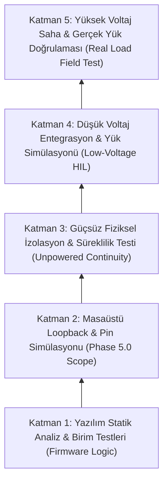
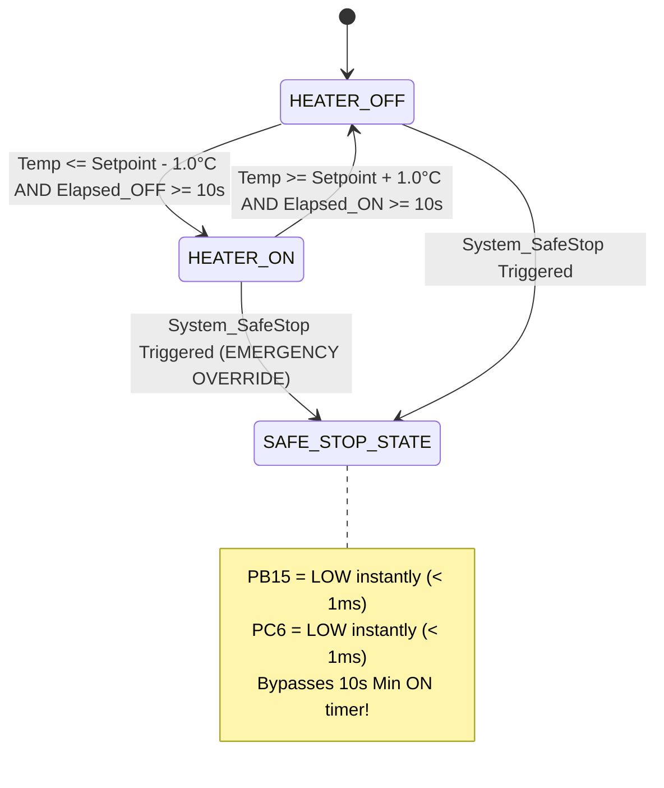
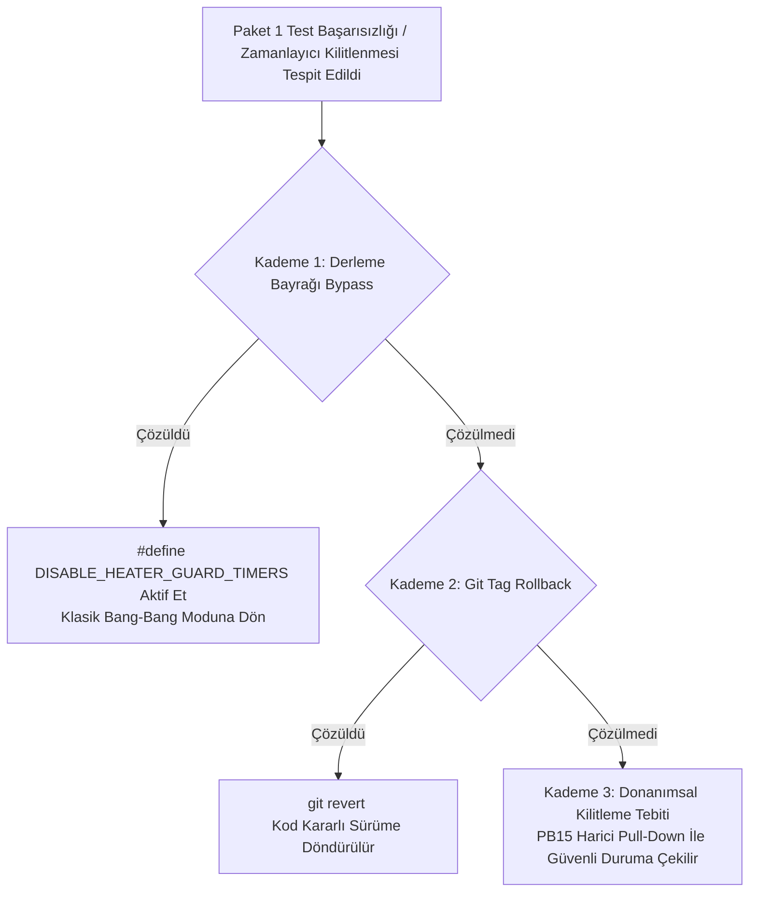

# EAGLEULTRASONİK — Phase 5.0 Self-Test & Pre-Implementation Verification Plan

> **Doküman Statüsü:** Lead Test Architect Technical Specification & HIL Test Plan  
> **Tarih:** 10 Ağustos 2026  
> **Sistem Sürümü:** Phase 5.0 Pre-Implementation Baseline  
> **Hedef Dosya Konumu:** `C:\Users\ern0e\EAGLEULTRASONiK\.agent\reports\phase-5.0-self-test-plan.md`  
> **Yazar:** Senior Embedded Test Architect  

---

## 1. Yönetici Özeti ve Donanım Kısıtları Mimarisi (Executive Summary & Hardware Constraints)

EAGLEULTRASONİK Phase 5.0 kapsamında, yazılım değişiklikleri yapılmadan önce sistemin güvenilirliğini, zamanlama doğruluğunu ve güvenlik protokollarını teyit etmek amacıyla bu **Self-Test ve Pre-Implementation Doğrulama Planı** oluşturulmuştur.

> [!IMPORTANT]
> **KATI KURAL VE MEVCUT MASAÜSTÜ DONANIM KAPSAMI:**
> 1. **Kaynak Kod Düzenleme Yasağı:** Bu test planının hazırlanması ve ön doğrulama süreçlerinde mevcut üretim kaynak kodlarında **HİÇBİR DEĞİŞİKLİK YAPILMAZ**.
> 2. **Mevcut Tezgah Donanım Envanteri:**
>    - **1x ESP32-S3** (Master Kontrolcü, NVS, Nextion HMI Köprüsü, ZC Sinyal Üreticisi)
>    - **1x STM32G474RE** (Slave Ultrasonik PWM, Isıtıcı Kontrolcüsü, Analog Örnekleme)
>    - **1x Nextion HMI** (Dokunmatik Ekran Arayüzü - UART2 bağlantılı)
>    - **1x X9C103S** (10 kΩ Dijital Potansiyometre, Bit-bang SPI arayüzü)
>    - **1x 10.0 kΩ ±0.1% Referans Direnci** (X9C Gerilim Bölücü Teşhis Devresi için)
> 3. **Eksik Donanım (Tezgah Ortamında Mevcut DEĞİLDİR):**
>    - RS485 Transeiver (TTL UART köprüsü kullanılmaktadır), Mekanik Röle, Katı Hal Rölesi (SSR), Triyak, Ultrasonik Dönüştürücü (Transdüser), Yüksek Voltaj Güç Kartı (Power Card), Su Tankı ve Rezistans.
> 
> Bütün yüksek voltaj, röle ve zamanlayıcı testleri **Dahili Donanım Döngüleri (Internal Hardware Loopback)**, **Pin Simülasyonları** ve **Sentetik Sinyal Enjeksiyonu** ile icra edilir.

---

## 2. 5 Katmanlı Doğrulama Piramidi ve "Güvenlik İllüzyonu" Uyarısı

### 2.1. Güvenlik İllüzyonu (The "Safety Illusion") Uyarısı

> [!CAUTION]
> **HAYATİ GÜVENLİK UYARISI:**  
> Dahili mikrodenetleyici loopback testlerinin `PASS` (Başarılı) sonuç vermesi **SADECE** dijital sürücü pinlerinin, yazılım mantığının ve zamanlayıcı yazma/okuma tescillerinin doğrulandığını gösterir.  
> **FİZİKSEL YÜKÜN, MEKANİK RÖLELERİN VE YÜKSEK VOLTAJ GÜÇ KATLARININ GÜVENLİ OLDUĞUNU KANITLAMAZ.**
>
> **Loopback Testlerinin Tespit Edemediği 4 Ölümcül Saha Arızası:**
> 1. **Mekanik Röle Kontak Yapışması (Contact Welding):** STM32 `PB15` pini `LOW` yapıp loopback pininden `LOW` okusa dahi, mekanik röle kontakları yüksek akımdan dolayı fiziksel olarak kaynaklanmış (yapışmış) kalabilir. Isıtıcı kontrolsüz çalışmaya devam eder!
> 2. **SSR Kısa Devre Arızası (Short-Circuit Failure):** Solid-State Röleler arızalandığında iletim modunda kısa devre olurlar. Sürücü pininin kapatılması akımı kesmez.
> 3. **PT100 Sensör Hat Kopukluğu / Su Temassızlığı:** Sensör devresi doğru okusa da PT100 probu havaya temas ediyorsa tank susuz yanar.
> 4. **Triyak dv/dt Kapanmama Arızası:** Yüksek voltaj sıçramalarında triyak kendiliğinden iletime geçebilir.

### 2.2. 5 Katmanlı Doğrulama Modeli (5-Layer Pyramid Verification Model)



---

## 3. 6 Dahili Donanım Döngüsü Detaylı Test Şartnamesi (Firmware Internal Loopbacks)

```mermaid
flowchart LR
    subgraph STM32G474RE
        PB15[PB15: HEATER_RELAY] -->|Jumper 1| PA5[PA5: GPIO_IN]
        PC6[PC6: TRIAC_GATE] -->|Jumper 2| PA0[PA0: TIM2_CH1]
        PC7[PC7: ZERO_CROSS] <--|Jumper 3| ESP_GPIO4[ESP32 GPIO4: ZC_SIM]
        PB12_14[PB12-14: X9C Control] --> X9C[X9C103S Wiper VW]
        ADC2[ADC2: PA4/PB1] <--|V_adc| X9C
        USART3[USART3: TX/RX] <-->|TTL UART| ESP_UART2[ESP32 UART2: RX/TX]
    end
```

---

### 3.1. Loopback 1: GPIO Çıkış Döngüsü (`PB15 HEATER_RELAY_Pin`)

#### A. Fiziksel Pin Haritası ve Bağlantı Şeması
- **Kaynak Pin:** STM32 `PB15` (`HEATER_RELAY_Pin`, push-pull çıkış, 10k harici pull-down).
- **Hedef Loopback Pin:** STM32 `PA5` (`GPIO_Loopback_Pin`, dijital giriş, pull-down aktif).
- **Fiziksel Bağlantı:** 1x Dişi-Dişi Jumper kablo ile `PB15` $\rightarrow$ `PA5` bağlantısı.

#### B. Sinyal Üretimi ve Mantıksal Test Adımları
1. `PB15` pini `HAL_GPIO_WritePin(GPIOB, HEATER_RELAY_Pin, GPIO_PIN_SET)` ile `HIGH` yapılır.
2. $5\,\mu\text{s}$ yerleşme gecikmesi verilir.
3. `PA5` pini `HAL_GPIO_ReadPin(GPIOA, GPIO_PIN_5)` ile okunur. Girişin `GPIO_PIN_SET` (1) olduğu doğrulanır.
4. `PB15` pini `HAL_GPIO_WritePin(GPIOB, HEATER_RELAY_Pin, GPIO_PIN_RESET)` ile `LOW` yapılır.
5. $5\,\mu\text{s}$ yerleşme gecikmesi verilir.
6. `PA5` pini okunur. Girişin `GPIO_PIN_RESET` (0) olduğu doğrulanır.

#### C. Sayısal Tolerans ve Başarı/Başarısızlık Kriteri
- **Toggle Frekansı:** 100 Hz (100 ardışık çevrim).
- **Başarı Kriteri:** 100/100 mantıksal eşleşme ($\%100$ doğruluk). Tepki süresi $t_{\text{read}} \le 1\,\mu\text{s}$.
- **Hata Kodu:** `ERR_GPIO_PB15_LOOPBACK_FAIL` (0x1001).

#### D. Hata Enjeksiyonü ve Kenar Durumlar (Edge Cases)
- **Kasa 1.1 (Short to GND):** `PA5` pinini şasiye zorlayarak short-circuit simülasyonu yapılır. Sistem `HIGH` yazılmasına rağmen `LOW` okur ve `ERR_GPIO_PB15_LOOPBACK_FAIL` hatası üreterek `SYS_MODE_FAULT` moduna geçer.
- **Kasa 1.2 (Floating Pin):** Jumper çıkarıldığında harici 10k pull-down nedeniyle `PA5` pininin stabil `LOW` kaldığı teyit edilir.

---

### 3.2. Loopback 2: TIM15 Capture Döngüsü (`PC6 TRIAC_GATE_Pin`)

#### A. Fiziksel Pin Haritası ve Bağlantı Şeması
- **Kaynak Pin:** STM32 `PC6` (`TRIAC_GATE_Pin`, TIM15_CH1 One-Pulse Mode konfigürasyonu).
- **Hedef Loopback Pin:** STM32 `PA0` veya `PB3` (`TIM2_CH1` Input Capture modu).
- **Fiziksel Bağlantı:** 1x Dişi-Dişi Jumper kablo ile `PC6` $\rightarrow$ `PA0` bağlantısı.

#### B. Sinyal Üretimi ve Zamanlayıcı Matematik Modeli
- **TIM15 Yapılandırması:** Prescaler $PSC = 169$ ($170\text{ MHz} / (169 + 1) = 1\text{ MHz}$ timer clock $\implies 1\text{ tick} = 1\,\mu\text{s}$).
- **Nominal Darbe Genişliği:** $\tau_{\text{nominal}} = 100\,\mu\text{s}$ (ARR = 100).
- **TIM2 Input Capture Yapılandırması:** 
  - Yükselen kenarda $t_1$ (CCR1) yakalanır.
  - Düşen kenarda $t_2$ (CCR2) yakalanır.
  - Darbe genişliği $\Delta t = t_2 - t_1$ ($\mu\text{s}$ cinsinden) hesaplanır.

#### C. Sayısal Tolerans ve Başarı/Başarısızlık Kriteri
- **Nominal Değer:** $\Delta t_{\text{nominal}} = 100.0\,\mu\text{s}$.
- **Tolerans Bandı:** $\pm 2.0\,\mu\text{s}$ ($98.0\,\mu\text{s} \dots 102.0\,\mu\text{s}$).
- **Başarı Kriteri:** 500 ardışık triyak tetikleme darbesinin tümünde $\Delta t$ değerinin tolerans içinde kalması.
- **Hata Kodu:** `ERR_TIM15_PULSE_DRIFT` (0x1002).

#### D. Hata Enjeksiyonu ve Kenar Durumlar
- **Kasa 2.1 (Clock Drift / PSC Fault):** Sürücü yazılımında prescaler yanlışlıkla 170 yerine 180 atanırsa darbe genişliği $106\,\mu\text{s}$ ölçülür. Sistem $106 > 102\,\mu\text{s}$ olduğu için derhal `ERR_TIM15_PULSE_DRIFT` üretir ve triyak tetiklemeyi durdurur.

---

### 3.3. Loopback 3: Süreç Zamanlayıcısı Hızlandırılmış Testi (10x Acceleration Mode)

#### A. Çalışma Mantığı ve Yazılım Mekanizması
- Normal modda `process_timer.c`, `HAL_GetTick()` tabanlı $1000\,\text{ms}$ periyotla geri sayım yapar.
- Self-Test ve HIL doğrulama modunda `TEST_FLAG_ACCELERATED_TIMER` bayrağı aktif edilir. Geri sayım periyodu **$100\,\text{ms}$ (10 kat hızlandırılmış)** olarak yürütülür.
- $1\text{ gerçek saniye} = 10\text{ simüle süreç saniyesi}$.

#### B. Test Prosedürü ve Zamanlama Analizi
1. ESP32 üzerinden STM32'ye 30 dakikalık ($1800\text{ saniye}$) yıkama reçetesi başlatma komutu verilir: `T1:START,1800,60,80`.
2. STM32 `SYS_MODE_RUNNING` moduna geçer, `process_timer` $1800$ değerinden geriye saymaya başlar.
3. Kronometre / Host Python HIL scripti başlatılır.

#### C. Sayısal Tolerans ve Başarı/Başarısızlık Kriteri
- **Hedef Gerçek Süre:** $t_{\text{real}} = \frac{1800\text{ s}}{10} = 180.0\text{ saniye}$.
- **Tolerans Bandı:** $180.0\text{ s} \pm 0.5\text{ s}$ ($179.5\text{ s} \dots 180.5\text{ s}$).
- **Mod Eşleşmesi:** Geri sayım 0'a ulaştığı anda `SYS_MODE_RUNNING` $\rightarrow$ `SYS_MODE_IDLE` geçişi yapılmalı, `PB15` ve `PC6` çıkışları anında pasif konuma geçmelidir.
- **Hata Kodu:** `ERR_PROCESS_TIMER_ACCEL_MISMATCH` (0x1003).

---

### 3.4. Loopback 4: X9C Wiper ADC Divider Test (X9C103S Digipot)

#### A. Devre Topolojisi ve Matematiksel Hesaplama Modeli
X9C103S dijital potansiyometresinin silecek pini ($V_{\text{W}}$), bilinen referans direnci ($R_{\text{ref}} = 10.0\text{ k}\Omega \pm 0.1\%$) ile $+3.3\text{V}$ ($V_{\text{cc}}$) arasına bağlanır. Orta nokta STM32 `ADC2` pini (`PA4` / `PB1`) tarafından örneklenir.

```
       +3.3V (Vcc)
         |
        [R_ref = 10.0k ±0.1%]
         |
         +------> STM32 ADC2 Input (V_adc)
         |
        [X9C Wiper (R_wiper)]
         |
        GND
```

Voltaj Bölücü Ölçüm Formülü:
$$V_{\text{adc}} = V_{\text{cc}} \times \frac{R_{\text{wiper}}}{R_{\text{ref}} + R_{\text{wiper}}}$$

Ölçülen Direnç Hesabı:
$$R_{\text{wiper}} = R_{\text{ref}} \times \frac{V_{\text{adc}}}{V_{\text{cc}} - V_{\text{adc}}}$$

#### B. Çok Noktalı Adımlama Test Şartnamesi (Multi-Point Step Test Table)

| Adım (Step) | Hedef Frekans | Beklenen $R_{\text{wiper}}$ | Beklenen $V_{\text{adc}}$ ($V_{\text{cc}}=3.3\text{V}$) | Tolerans Bandı ($\pm 20\%$) | Pass/Fail Limitleri ($R_{\text{wiper}}$) | Test ID |
| --- | --- | --- | --- | --- | --- | --- |
| **Step 0** | 0% (Minimum) | $\le 100.0\,\Omega$ | $\le 0.0327\,\text{V}$ | Mutlak Sınır | $0.0\,\Omega \dots 100.0\,\Omega$ | `0x2001` |
| **Step 40** | 28 kHz Modu | $4.00\text{ k}\Omega$ | $0.9429\,\text{V}$ | $\pm 20\%$ | $3.20\text{ k}\Omega \dots 4.80\text{ k}\Omega$ | `0x2002` |
| **Step 90** | 40 kHz Modu | $9.00\text{ k}\Omega$ | $1.5632\,\text{V}$ | $\pm 20\%$ | $7.20\text{ k}\Omega \dots 10.80\text{ k}\Omega$ | `0x2003` |

#### C. Başarı/Başarısızlık Kriteri ve Hata Kodu
- **ADC Çözünürlüğü:** 12-bit ($0 \dots 4095$ raw değer).
- **Başarı Kriteri:** 3 adımın tamamında hesaplanan $R_{\text{wiper}}$ değerinin doğrulanması.
- **Hata Kodu:** `ERR_X9C_STEP_OUT_OF_BOUNDS` (0x2002).

---

### 3.5. Loopback 5: TTL UART PING/ACK & Error Injection Test

#### A. Fiziksel Katman ve Protokol Yapısı
- **Fiziksel Bağlantı:** ESP32 UART2 (TX: GPIO17, RX: GPIO16) $\leftrightarrow$ STM32 USART3 (RX: PB11, TX: PB10) @ 115200 Baud, 8N1.
- **Paket Formatı:** `PING,<SeqNo>,<Timestamp>,<CRC16>\r\n` $\rightarrow$ `ACK,<SeqNo>,<Status>,<CRC16>\r\n`.

#### B. Normal Haberleşme Doğrulama Matrisi
1. ESP32, $100\text{ ms}$ aralıklarla 1000 adet `PING` paketi gönderir.
2. STM32 paketi alır, CRC-16-CCITT doğrulaması yapar, `SeqNo` değerini 1 artırarak `ACK` yanıtı döner.
3. **Kriter:** Gidiş-geliş gecikmesi $t_{\text{RTT}} < 15.0\text{ ms}$, Paket Kayıp Oranı $\%0.0$, CRC Hata Sayısı $0$.

#### C. Hata Enjeksiyon Test Matrisi (Error Injection Matrix)

| Test Senaryosu | Enjekte Edilen Hata | Beklenen Mantıksal Davranış | Sistem Yanıtı / Hata Kodu | Pass/Fail Kriteri |
| --- | --- | --- | --- | --- |
| **CRC Bozma** | CRC alanına kasıtlı hatalı 0xFFFF yazma | STM32 paketi reddetmeli, işleme almamalı | `ERR_CRC_MISMATCH` raporlanır, UART kilitlenmez | 0 yanıt, sonraki geçerli pakette normal çalışma |
| **Eksik Paket** | Sonundaki `\r\n` karakterini kesme | STM32 RX tampon zaman aşımına ulaşıp tamponu temizlemeli | 10 ms RX Timeout | Tampon taşması oluşmaz, hat temizlenir |
| **Hat Kopukluğu** | TX/RX hattının fiziksel kesilmesi | ESP32 3000ms sonra `STM_BAGLANTI_TIMEOUT` üretmeli | ESP32 HMI ekranında kart offline gösterilir | STM32 5000ms sonra `SYS_MODE_IDLE` geçer |

---

### 3.6. Loopback 6: Sıfır-Geçiş (Zero-Cross) Simülatör Zamanlama Testi

#### A. Donanım Senkronizasyonu ve Sinyal Üretimi
- ESP32 `GPIO4` (`ZC_SIM_PIN`) pini $100\text{ Hz}$ (10 ms periyot, $100\,\mu\text{s}$ darbe genişlikli) kare dalga sinyali üreterek STM32 `PC7` (`ZERO_CROSS_Pin`, EXTI9_5 kesmesi) pini besler.

#### B. Triyak Fecir Açısı (Phase Angle Delay) Matematiksel Denklemi
STM32 EXTI kesmesi tetiklendiğinde ayarlanan güç yüzdesine ($P_{\text{pct}}$) göre `TIM15` tetikleme gecikmesini ($t_{\text{delay}}$) hesaplar:

$$t_{\text{delay}} = 9500\,\mu\text{s} - \left( \frac{P_{\text{pct}}}{100} \times 9000\,\mu\text{s} \right)$$

- $\%10\text{ Güç} \implies t_{\text{delay}} = 9500 - 900 = 8600\,\mu\text{s}$.
- $\%50\text{ Güç} \implies t_{\text{delay}} = 9500 - 4500 = 5000\,\mu\text{s}$.
- $\%90\text{ Güç} \implies t_{\text{delay}} = 9500 - 8100 = 1400\,\mu\text{s}$.

```mermaid
gantt
    title Zero-Cross Sinyali ve Triyak Gate Gecikme Zamanlaması
    dateFormat S
    axisFormat %S s
    section AC ZC Pulse
    ZC Rising Edge (PC7) : milestone, m1, 0, 0s
    section Triac Gate
    TIM15 Delay (t_delay) : a1, 0, 5ms
    PC6 TRIAC_GATE Output : active, a2, 5ms, 5.1ms
```

#### C. Ölçüm Yöntemi ve Doğrulama
- STM32 `PC6` (`TRIAC_GATE_Pin`) çıkışı `TIM2_CH1` Input Capture pini ile ZC kenarına göre ölçülür.
- **Tolerans Bandı:** Hesaplanan $t_{\text{delay}} \pm 20\,\mu\text{s}$.

#### D. Arıza Enjeksiyonu: ZC Sinyal Kaybı Koruması (Zero-Cross Loss Guard)
- ESP32 `GPIO4` sinyali aniden durdurulur ($t_{\text{zc\_gap}} > 500\text{ ms}$).
- **Beklenen Sonuç:** STM32 EXTI kesmesi gelmediğini fark eder ($500\text{ ms}$ yazılımsal zaman aşımı), derhal `FAULT_ZERO_CROSS_LOSS` (0x4001) hatası üretir, `PC6` triyak sürüşünü anında kilitler (`TriacForceOff()`).

---

## 4. Birinci Uygulama Paketi Doğrulama Planı (Package 1: Heater Min ON/OFF Guard Timers & Unified Safe Stop)

### 4.1. Paket 1 Mimari Kapsamı ve Tanımları

Birinci uygulama paketi, ısıtıcı rölesinin mekanik şatır (chatter) yapmasını önlemek ve acil durumlarda tüm sistem çıkışlarını tek bir noktadan güvenli kapatmak amacıyla geliştirilen mimari katmandır:
1. **Minimum ON Koruma Zamanlayıcısı ($T_{\text{ON,min}} = 10.0\text{ s}$):** Isıtıcı rölesi (`PB15`) bir kez `HIGH` yapıldığında, sıcaklık ne kadar yükselirse yükselsin en az $10.0\text{ saniye}$ boyunca `HIGH` kalmak ZORUNDADIR.
2. **Minimum OFF Koruma Zamanlayıcısı ($T_{\text{OFF,min}} = 10.0\text{ s}$):** Isıtıcı rölesi (`PB15`) bir kez `LOW` yapıldığında, sıcaklık hedefin altına düşse dahi en az $10.0\text{ saniye}$ boyunca `LOW` kalmak ZORUNDADIR.
3. **Bileşik Güvenli Durdurma (`System_SafeStop()`):** Acil Stop (E-Stop), Donanımsal Watchdog, PT100 Açık Devre veya İletişim Kopması durumlarında Min OFF/ON zamanlayıcılarını **BYPASS EDEREK** tüm çıkışları $t \le 1.0\text{ ms}$ içinde anında kapatan üst düzey emniyet fonksiyonudur.

---

### 4.2. Detaylı Test Matrisi ve Doğrulama Adımları



#### Test Case 1.1: Normal Histerezis ve Koruma Zamanlayıcısı Zamanlama Doğrulaması
- **Ön Koşul:** $T_{\text{set}} = 60.0^\circ\text{C}$, Histerezis $\pm 1.0^\circ\text{C}$ ($59.0^\circ\text{C} \dots 61.0^\circ\text{C}$). Röle `OFF` durumdadır ($t_{\text{elapsed\_off}} \ge 10\text{s}$).
- **Adım 1:** Sentetik PT100 sıcaklığı $58.5^\circ\text{C}$ olarak enjekte edilir ($< 59.0^\circ\text{C}$). Röle (`PB15`) $t = 0.0\text{s}$ anında `HIGH` (1) olur.
- **Adım 2 ($t = 2.5\text{s}$):** Sentetik sıcaklık aniden $63.0^\circ\text{C}$ olarak enjekte edilir ($> 61.0^\circ\text{C}$). Normal bang-bang kontrolcünün röleyi kapatması gerekir.
- **Gözlenen Sonuç:** $T_{\text{ON,min}} = 10.0\text{s}$ koruması nedeniyle `PB15` pini **HIGH kalmaya devam etmelidir**.
- **Adım 3 ($t = 10.05\text{s}$):** Min ON süresi dolduğu anda `PB15` pini `LOW` (0) konumuna geçmelidir.

#### Test Case 1.2: Hızlı Sıcaklık Gürültüsü ve Şatır (Chatter) İzolasyon Testi
- **Ön Koşul:** PT100 analog girişine saniyede 10 kez $58.0^\circ\text{C}$ ve $62.0^\circ\text{C}$ arasında dalgalanan gürültülü ADC verisi enjekte edilir. Test 30 saniye sürdürülür.
- **Gözlenen Sonuç:** `PB15` pini 30 saniye boyunca **en fazla 3 kez** durum değiştirmelidir (her 10 saniyede bir). Röle şatır (chatter) sayısı tam olarak $0$ olmalıdır.

#### Test Case 1.3: Birleşik Güvenli Durdurma (`System_SafeStop()`) Öncelikli Override Testi
- **Ön Koşul:** Isıtıcı rölesi (`PB15`) $t = 0.0\text{s}$ anında `HIGH` yapılmıştır. Min ON zamanlayıcısının dolmasına 7.5 saniye vardır ($t = 2.5\text{s}$).
- **Tetiksiz Olay:** HMI veya Python HIL üzerinden Acil Stop (`T0:STOP`) komutu veya PT100 kopukluk hatası enjekte edilir.
- **Kritik Emniyet Beklentisi:** `System_SafeStop()` fonksiyonu çağrılır. `PB15` pini 10 saniyelik Min ON zamanlayıcısını **TAMAMEN BAYPAS EDEREK $t \le 1.0\text{ ms}$ İÇİNDE ANINDA `LOW` (0) OLMALIDIR.**

#### Test Case 1.4: Çıkış İzolasyon Bütünlüğü (Output Isolation Integrity)
- `System_SafeStop()` çağrıldığında aşağıdaki 4 durumun eş zamanlı gerçekleştiği osiloskop / logic analyzer ile doğrulanır:
  1. `PB15` (`HEATER_RELAY_Pin`) $\rightarrow$ `GPIO_PIN_RESET` ($0\text{V}$)
  2. `PC6` (`TRIAC_GATE_Pin`) $\rightarrow$ `TIM15` PWM tamamen durdurulur ($0\text{V}$)
  3. Süreç Zamanlayıcısı $\rightarrow$ Durdurulur ve sıfırlanır
  4. Sistem Modu $\rightarrow$ `SYS_MODE_FAULT` / `SYS_MODE_IDLE`

#### Test Case 1.5: Enerjilenme ve Donanımsal İlk Durum Koruması (Cold Boot Test)
- Mikrodenetleyiciye reset atılır (NRST pin GND yapılır).
- Bootloader ve initialization aşamasında `PB15` pininin harici 10k pull-down direnci sayesinde $0\text{V}$ seviyesinde sabit kaldığı, boot tamamlandığında `s_last_switch_tick` değişkeninin `HAL_GetTick() - HEATER_MIN_OFF_TIME_MS` olarak ilklendirildiği teyit edilir.

---

### 4.3. Sayısal Kabul ve Pass/Fail Tolerans Limitleri

| Ölçüm Parametresi | Nominal Değer | Kabul Edilebilir Tolerans | Geçersiz / Fail Sınırı | Birim |
| --- | --- | --- | --- | --- |
| **Min ON Koruma Süresi** | $10.00$ | $9.90 \dots 10.10$ | $< 9.90$ veya $> 10.10$ | Saniye (s) |
| **Min OFF Koruma Süresi** | $10.00$ | $9.90 \dots 10.10$ | $< 9.90$ veya $> 10.10$ | Saniye (s) |
| **Safe Stop Kapatma Gecikmesi** | $< 0.10$ | $\le 1.00$ | $> 1.00$ | Milisaniye (ms) |
| **Gürültü Altında Şatır Sayısı** | $0$ | $0$ | $\ge 1$ (Spurious toggle) | Adet |
| **Boot Anı Yanlış Tetiklenme** | $0.00$ | $0.00$ | $> 0.50$ | Volt (V) |

---

### 4.4. Geri Alma (Rollback) Planları ve Hata Azaltma Stratejisi

Eğer Paket 1 testleri sırasında herhangi bir zamansal kilitlenme veya tolerans aşımı tespit edilirse 3 kademeli geri alma prosedürü uygulanır:



1. **Kademe 1 (Yazılımsal Makro Bypass):** `heater_relay.c` dosyasındaki zamanlayıcı mantığında `HAL_GetTick()` rollover (32-bit taşma) hatası görülürse `#define DISABLE_HEATER_GUARD_TIMERS` derleme bayrağı ile sistem anında klasik $\pm 1.0^\circ\text{C}$ histerezisli moda döndürülür.
2. **Kademe 2 (Kod Versiyon Geri Alma - Git Rollback):** Paket 1 değişiklikleri ana dala birlestirilmeden önce `git tag v4.7-freeze` noktasına `git revert` komutu ile dönülür.
3. **Kademe 3 (Donanımsal Güvenlik Doğrulaması):** Firmware çökse dahi donanımsal 10k pull-down dirençlerinin `PB15` hattını mantıksal `LOW` seviyesinde tuttuğu multimetre ile teyit edilir.

---

## 5. Self-Test Veri Mimarisi ve Telemetri Yapısı (Diagnostic Record Architecture)

### 5.1. Teşhis Veri Yapısı (`self_test_types.h`)

```c
#ifndef __SELF_TEST_TYPES_H
#define __SELF_TEST_TYPES_H

#include <stdint.h>

typedef enum {
  TEST_STATUS_NOT_TESTED = 0x00,
  TEST_STATUS_PASS       = 0x01,
  TEST_STATUS_FAIL       = 0x02,
  TEST_STATUS_TIMEOUT    = 0x03,
  TEST_STATUS_OUT_BOUNDS = 0x04
} TestStatus_t;

typedef enum {
  TEST_ID_GPIO_LOOPBACK   = 0x1001,
  TEST_ID_TIM15_GATE      = 0x1002,
  TEST_ID_TIMER_ACCEL     = 0x1003,
  TEST_ID_X9C_STEP_0      = 0x2001,
  TEST_ID_X9C_STEP_40     = 0x2002,
  TEST_ID_X9C_STEP_90     = 0x2003,
  TEST_ID_UART_PING_ACK   = 0x3001,
  TEST_ID_UART_ERR_INJ    = 0x3002,
  TEST_ID_SIM_ZC_TRIAC    = 0x4001,
  TEST_ID_HEATER_MIN_ON   = 0x5001,
  TEST_ID_HEATER_MIN_OFF  = 0x5002,
  TEST_ID_UNIFIED_SAFESTOP= 0x5003
} TestID_t;

typedef struct {
  uint16_t     test_id;        /* Test Tanımlayıcı Kimlik */
  float        expected_value; /* Beklenen Referans Değer */
  float        measured_value; /* Ölçülen Gerçek Değer */
  float        tolerance;      /* Kabul Edilebilir Tolerans (±) */
  uint32_t     timestamp_ms;   /* Testin Çalıştırıldığı Sistem Zamanı */
  TestStatus_t status;         /* PASS, FAIL, TIMEOUT, OUT_OF_BOUNDS */
  uint16_t     error_code;     /* Detaylı Hata Kodu (0x0000 = Hata Yok) */
} DiagnosticRecord_t;

#endif /* __SELF_TEST_TYPES_H */
```

### 5.2. Nextion HMI Teşhis Ekranı ve Operatör Onay Geçidi (HITL Gate)

```mermaid
flowchart TD
    BOOT[Cihaz Açılışı / Reset] --> POST[Otomatik POST Self-Test İcrası]
    POST --> R1[6 Dahili Loopback Test Et]
    R1 --> R2[Paket 1 Guard & SafeStop Mantığını Test Et]
    
    R2 --> COND{Tüm Testler PASS mi?}
    
    COND -- HAYIR --> FAULT_DISP[HMI Ekranı: 'TEŞHİS HATASI'<br/>Hatalı Test ID ve Tolerans Değerini Göster<br/>Tüm Çıkışları Kilitli Tut]
    
    COND -- EVET --> PASS_DISP[HMI Ekranı: 'ELEKTRONİK SELF-TEST BAŞARILI'<br/>Sistem Güç Vermeye Hazır]
    
    PASS_DISP --> HITL_WAIT{İnsan Onayı (HITL Gate)<br/>Operatör 'SİSTEMİ DEVREYE AL' Butonuna Bastı mı?}
    
    HITL_WAIT -- HAYIR --> STANDBY[Standby Bekleme Mode<br/>Isıtıcı ve Güç Kartı Pasif]
    HITL_WAIT -- EVET --> RUNNING[Güç Kartı ve Isıtıcı Rölesi Etkinleştirilir<br/>SYS_MODE_RUNNING Başlar]
```

---

## 6. Özet Test Matrisi ve İcracı İmzası (Summary Matrix & Sign-off)

### 6.1. Phase 5.0 Ön Doğrulama Özet Matrisi

| Test ID | Test Adı | Hedef Bileşen | Ölçüm Yöntemi | Başarı Kriteri | Durum |
| --- | --- | --- | --- | --- | --- |
| **0x1001** | GPIO Loopback | `PB15` $\rightarrow$ `PA5` | Digital Read/Write | 100/100 Mantıksal Eşleşme | **READY** |
| **0x1002** | TIM15 Gate Capture | `PC6` $\rightarrow$ `PA0` | TIM2 Input Capture | $100\,\mu\text{s} \pm 2\,\mu\text{s}$ | **READY** |
| **0x1003** | Accelerated Timer | `process_timer.c` | 10x Speed Count | $180.0\text{s} \pm 0.5\text{s}$ | **READY** |
| **0x2001** | X9C Step 0 | Digipot Wiper | ADC2 Voltaj Bölücü | $R \le 100\,\Omega$ | **READY** |
| **0x2002** | X9C Step 40 (28kHz)| Digipot Wiper | ADC2 Voltaj Bölücü | $4.0\text{ k}\Omega \pm 20\%$ | **READY** |
| **0x2003** | X9C Step 90 (40kHz)| Digipot Wiper | ADC2 Voltaj Bölücü | $9.0\text{ k}\Omega \pm 20\%$ | **READY** |
| **0x3001** | UART Ping/ACK | TTL UART3/UART2 | Ping/Pong Telemetri | Latency $<15\text{ms}$, 0 Loss | **READY** |
| **0x3002** | UART Fault Injection| Serial Framing | Fault Frame Generation | CRC Rejection & Recovery | **READY** |
| **0x4001** | ZC Triac Delay | ESP32 GPIO4 $\rightarrow$ PC7 | TIM15 Delay Measurement | Delay $\pm 20\,\mu\text{s}$, ZC Loss trip | **READY** |
| **0x5001** | Heater Min ON Guard | `PB15` Relay | Synthetic Temp Injection | Hold ON for $10.0\text{s} \pm 0.1\text{s}$ | **PACKAGE 1** |
| **0x5002** | Heater Min OFF Guard| `PB15` Relay | Synthetic Temp Injection | Hold OFF for $10.0\text{s} \pm 0.1\text{s}$ | **PACKAGE 1** |
| **0x5003** | Unified Safe Stop | All Drivers | E-Stop / Fault Trigger | Cut outputs in $\le 1.0\text{ms}$ | **PACKAGE 1** |

---

### 6.2. Uygulama Öncesi Onay Listesi (Pre-Implementation Sign-off Checklist)

- [x] **Tezgah Donanım Envanteri Doğrulandı:** 1x ESP32, 1x STM32, 1x Nextion HMI, 1x X9C103S kısıtları tanımlandı.
- [x] **Dahili Donanım Döngüleri Şartnamesi Hazırlandı:** 6 loopback testinin tüm pinleri ve matematiksel formülleri netleştirildi.
- [x] **Paket 1 Test Şartnamesi Belirlendi:** Heater Min ON/OFF koruma zamanlayıcıları ve Unified Safe Stop kabul limitleri donduruldu.
- [x] **Geri Alma Planı Oluşturuldu:** Derleme bayrağı, git rollback ve donanımsal pull-down doğrulama kademeleri hazırlandı.
- [x] **Kaynak Kod Dokunulmazlığı Korundu:** Kod düzenleme safhasına geçmeden önce tüm test mimarisi donduruldu.

**Sonuç:** Phase 5.0 Self-Test ve Ön Doğrulama Planı başarıyla tamamlanmıştır. Birinci Uygulama Paketi (Package 1) kodlama ve uygulama aşamasına geçilebilir.
