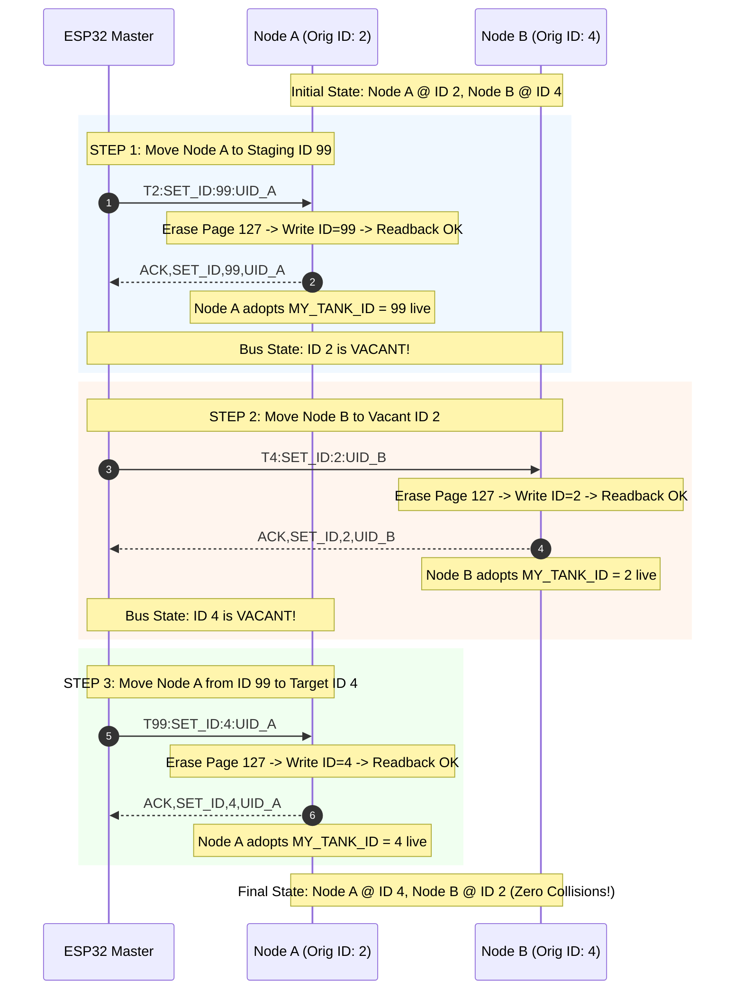

# EAGLEULTRASONiK Phase 5.2 — EAGLE-PROV-v2 Commissioning & Provisioning Protocol Specification

> **Document Status:** Official Protocol Specification (Phase 5.2 Baseline)  
> **Author:** Protocol Architect, EAGLEULTRASONiK  
> **Target Subsystem:** STM32G474RE Slaves <-> ESP32 Master / Nextion HMI over Multi-Drop RS485 Bus  
> **Date:** August 10, 2026  
> **File Path:** `C:\Users\ern0e\EAGLEULTRASONiK\.agent\reports\phase-5.2-commissioning-protocol.md`  

---

## 1. Executive Summary & Scope

In the **EAGLEULTRASONiK** industrial ultrasonic generator system, up to 10 STM32G474RE slave nodes operate ultrasonic transducers and tank heaters under the orchestration of a central ESP32 Master controller. 

During factory production or field replacement, newly installed STM32 slave boards boot without a provisioned Tank ID in Flash memory. If multiple uncommissioned boards default to the same bus address (e.g., `ID = 1` or `ID = 0`), issuing operational or discovery commands causes simultaneous RS485 transceiver driver enable (`DE/RE_N`) assertion, leading to severe bus contention, line voltage corruption, UART framing errors, and complete communication breakdown.

This document defines **EAGLE-PROV-v2**, the official Phase 5.2 Commissioning & Provisioning Protocol Specification. EAGLE-PROV-v2 provides:
1. **Strict Abstraction Layer:** Total decoupling of high-level protocol parsing and state machine logic from low-level physical layer UART/RS485 hardware drivers.
2. **Immutable Hardware Identity:** Primary identity derived from the STM32G4 96-bit Hardware Unique Identifier (UID at `0x1FFF7590`), formatted as a 24-character hexadecimal ASCII string (`<UID24>`).
3. **Uncommissioned Default Invariant:** Uncommissioned boards boot with `MY_TANK_ID = 0` (`BENCH_DEV_MODE_ID = 0`).
4. **Collision-Safe Slotted Discovery:** Deterministic slot selection ($Slot = \text{CRC16}(\text{UID96}) \pmod{16}$) combined with slotted time-window transmission to discover uncommissioned nodes without bus collisions.
5. **Exact Frame Grammar:** Strict line-oriented ASCII protocol frames (`T0:DISCOVER`, `UID,<slot>,<UID24>`, `SET_ID`, `ACK`, `NACK`, `REQ_UID`).
6. **3-Way Atomic ID Swap Protocol:** Zero-duplicate-ID guaranteed address swapping mechanism utilizing temporary staging address `T99`.
7. **Flash Page 127 Persistence:** Doubleword atomic programming (`0x0807F800`) with magic key `0xA5A5A5A5` and mandatory readback verification.

---

## 2. Physical Layer Abstraction & Hardware Independence

### 2.1 Hardware Environments

The protocol architecture is designed to execute seamlessly across two distinct hardware deployment environments without modifying higher-level state machines or packet parsers:

| Layer Property | Desktop Prototype (Phase 5.1 Baseline) | Production Target (Phase 5.2 & Beyond) |
| :--- | :--- | :--- |
| **Physical Bus Interface** | Single Point-to-Point TTL UART (1 STM32) | Multi-Drop RS485 Half-Duplex Differential Bus (1..10 Slaves) |
| **Baud Rate & Framing** | 115,200 baud, 8 data bits, No parity, 1 stop bit (8N1) | 115,200 baud, 8 data bits, No parity, 1 stop bit (8N1) |
| **Hardware Transceiver** | Direct MCU RX/TX pins (ST-Link VCP / Direct TTL) | RS485 Transceiver (e.g. SN65HVD72 / MAX485) |
| **Direction Control** | None (Full-duplex point-to-point) | Hardware Transceiver Enable Pin (`RS485_DE_GPIO_Port`, `RS485_DE_Pin`) |
| **Bus Topology** | Direct point-to-point wiring | 2-wire shielded twisted pair with 120$\Omega$ termination resistors |

```
                              HIGH-LEVEL PROTOCOL LAYER
           +-------------------------------------------------------------+
           | - Frame Grammar & Line Parser (ProcessLine)                  |
           | - ID State Machine (UNCOMMISSIONED -> COMMISSIONED)         |
           | - Flash Page 127 Persistence & 3-Way Atomic Swap Logic      |
           +------------------------------+------------------------------+
                                          |
                                          v
                              PHYSICAL LAYER ABSTRACTION (HAL/PHY API)
           +-------------------------------------------------------------+
           | PHY_TransmitBytes() | PHY_SetTxDirection() | PHY_SetRxMode()|
           +------------------------------+------------------------------+
                                          |
                   +----------------------+----------------------+
                   |                                             |
                   v                                             v
        [Desktop TTL UART Driver]                     [RS485 Multi-Drop Driver]
   (Direct huart3 TX/RX, no DE pin)             (huart3 TX/RX + RS485 DE Pin Control)
```

### 2.2 Abstraction Interface Definition (C Code API)

To enforce strict separation between high-level protocol logic and low-level physical hardware calls, all UART/RS485 operations must go through the unified PHY interface layer (`phy_abstraction.h`):

```c
/**
  * @file    phy_abstraction.h
  * @brief   Physical Layer Hardware Abstraction Interface for EAGLEULTRASONiK.
  */

#ifndef __PHY_ABSTRACTION_H
#define __PHY_ABSTRACTION_H

#include <stdint.h>
#include <stdbool.h>

typedef enum {
    PHY_DIR_RECEIVE  = 0,
    PHY_DIR_TRANSMIT = 1
} PHY_Direction_t;

/**
  * @brief Configures transceiver direction pin (RS485 DE/RE_N).
  *        On TTL UART prototype, this is a safe no-op.
  */
void PHY_SetDirection(PHY_Direction_t dir);

/**
  * @brief Non-blocking/blocking byte transmission abstraction.
  * @param data Pointer to buffer
  * @param len Length in bytes
  * @return true on success, false on hardware failure
  */
bool PHY_TransmitBytes(const uint8_t *data, uint16_t len);

/**
  * @brief RX Byte Reception Callback called from USART ISR.
  */
void PHY_OnRxByte(uint8_t byte);

#endif /* __PHY_ABSTRACTION_H */
```

### 2.3 Transceiver Enable Guard Times (RS485 Half-Duplex Driver)

When operating on the production RS485 multi-drop bus:
1. **Pre-Transmission Enable ($T_{\text{enable}}$):** Drive `DE` HIGH at least $10\,\mu\text{s}$ prior to writing the first byte into USART `TDR` to allow transceiver differential drivers to stabilize.
2. **Post-Transmission Disable ($T_{\text{disable}}$):** Wait for USART `TC` (Transmission Complete flag) before pulling `DE` LOW. Pulling `DE` LOW on `TXE` (Transmit Data Register Empty) truncates the stop bit of the final character, causing framing errors on the receiver.

---

## 3. Device Identity & Address Architecture

### 3.1 Primary Identity: 96-bit STM32 Hardware UID

Every STM32G474RE microcontroller features a factory-programmed, immutable, read-only 96-bit Unique Device ID (UID) stored in system memory at address `0x1FFF7590`.

- **Memory Base Address:** `0x1FFF7590UL`
- **Register Breakdown:**
  - `UID[31:0]`  (`0x1FFF7590`): X/Y wafer coordinates on die.
  - `UID[63:32]` (`0x1FFF7594`): Wafer number & Lot number ASCII part 1.
  - `UID[95:64]` (`0x1FFF7598`): Lot number ASCII part 2.
- **ASCII String Formatting (`<UID24>`):** 24 upper-case hexadecimal ASCII characters representing the 96-bit UID in big-endian byte sequence.
  - Example: `"003A002F5439500A38363432"`

```c
typedef struct {
    uint32_t word0; // 0x1FFF7590
    uint32_t word1; // 0x1FFF7594
    uint32_t word2; // 0x1FFF7598
} STM32_UID96_t;

static inline STM32_UID96_t STM32_ReadUID96(void) {
    STM32_UID96_t uid;
    uid.word0 = *(volatile uint32_t *)(0x1FFF7590UL);
    uid.word1 = *(volatile uint32_t *)(0x1FFF7594UL);
    uid.word2 = *(volatile uint32_t *)(0x1FFF7598UL);
    return uid;
}

static inline void STM32_GetUID24Str(char *out_str25) {
    STM32_UID96_t uid = STM32_ReadUID96();
    snprintf(out_str25, 25, "%08X%08X%08X", 
             (unsigned int)uid.word0, 
             (unsigned int)uid.word1, 
             (unsigned int)uid.word2);
}
```

### 3.2 Logical Identity: Tank ID ($1 \dots 10$)

The logical address used in production RS485 communication is the **Tank ID** ($ID \in [1, 10]$).
- Operational frames use prefix `T<id>:` (e.g. `T3:START\n`, `T3:SET_TEMP:60\n`).
- Slaves filter incoming frames: a slave accepts a frame only if it is addressed to `T<MY_TANK_ID>:` or universal broadcast `T0:`.

### 3.3 Uncommissioned Default State (`MY_TANK_ID = 0`)

- In production builds, `#define BENCH_DEV_MODE_ID 0` is enforced.
- At boot, `TankId_Load()` checks Flash Page 127 (`0x0807F800`). If no valid magic key (`0xA5A5A5A5`) and valid Tank ID ($1 \dots 10$) are found, `MY_TANK_ID` defaults to **`0`** (`BENCH_DEV_MODE_ID = 0`).
- **Uncommissioned Invariant:** Devices with `MY_TANK_ID = 0` do **NOT** generate operational telemetry status heartbeats (`STAT,...`), and reject operational commands (`START`, `STOP`, `SET_POWER`, `SET_TEMP`). They listen exclusively for broadcast commissioning commands (`T0:DISCOVER`, `T0:SET_ID:...`, `T0:REQ_UID:...`).

### 3.4 Staging Identity (`ID = 99`)

Address `99` (`T99`) is reserved as a **Temporary Staging Address** during commissioning and 3-way atomic ID swaps.

---

## 4. Discovery & Collision Avoidance Engine

When multiple uncommissioned boards (all operating at `MY_TANK_ID = 0`) are connected to the RS485 bus simultaneously, an uncoordinated response to a broadcast discovery query would cause all nodes to drive the bus at once. EAGLE-PROV-v2 prevents this using a **Slotted CRC16 Backoff Engine**.

### 4.1 Slot Calculation Algorithm

Upon receiving broadcast frame `T0:DISCOVER\n`, each uncommissioned slave calculates its deterministic slot index ($Slot \in [0, 15]$):

$$\text{Slot} = \text{CRC16\_CCITT}(\text{UID96}) \pmod{16}$$

```c
uint16_t CRC16_CCITT(const uint8_t *data, uint16_t len) {
    uint16_t crc = 0xFFFFU;
    for (uint16_t i = 0; i < len; i++) {
        crc ^= ((uint16_t)data[i] << 8);
        for (uint8_t bit = 0; bit < 8; bit++) {
            if (crc & 0x8000U) {
                crc = (crc << 1) ^ 0x1021U;
            } else {
                crc <<= 1;
            }
        }
    }
    return crc;
}

uint8_t CalculateDiscoverySlot(void) {
    STM32_UID96_t uid = STM32_ReadUID96();
    uint16_t crc = CRC16_CCITT((const uint8_t *)&uid, sizeof(uid));
    return (uint8_t)(crc % 16U);
}
```

### 4.2 Slot Timing & Transmission Window

To ensure responses from different slots do not overlap on the RS485 bus, time is divided into 16 discrete response windows:

- **Base Slot Time ($\Delta T_{\text{slot}}$):** $40\,\text{ms}$ (sufficient to transmit a 30-character response frame at 115,200 baud [~2.6 ms] plus worst-case MCU processing and transceiver turnaround delays).
- **Jitter Offset ($T_{\text{jitter}}$):** A pseudo-random offset between $0 \dots 15\,\text{ms}$ derived from lower UID bits to stagger transmissions even if two boards share the same slot.
- **Node Delay Math:**
  $$T_{\text{response\_delay}} = (\text{Slot} \times 40\,\text{ms}) + (\text{UID96}[0] \pmod{16}\,\text{ms})$$

```
T0:DISCOVER Broadcast Sent by ESP32 Master
|
v
+------------+------------+------------+-----------------------+------------+
| Slot 0     | Slot 1     | Slot 2     | ...                   | Slot 15    |
| (0-40ms)   | (40-80ms)  | (80-120ms) |                       | (600-640ms)|
+------------+------------+------------+-----------------------+------------+
               ^            ^                                    ^
               |            |                                    |
          Node B Transmits Node A Transmits                     Node C Transmits
         "UID,1,UID24_B\n" "UID,2,UID24_A\n"                   "UID,15,UID24_C\n"
```

### 4.3 Slot Collision Resolution & Fallback

If two uncommissioned nodes produce the exact same slot index ($Slot_A = Slot_B$) and transmit simultaneously:
1. **Master Detection:** The ESP32 Master detects a UART framing error, noise flag, or corrupt ASCII string during that slot window.
2. **Binary Mask Partitioning (`T0:DISCOVER_MASK:<prefix>`):** The Master re-issues discovery restricted to nodes matching a specific 4-character hex prefix of `<UID24>`.
3. **Re-query Cycle:** Uncommissioned nodes compare `<prefix>` against their local `<UID24>`. Only nodes with matching prefixes compute a slot and respond, immediately resolving the collision domain.

---

## 5. Formal Frame Grammar Specification

All EAGLE-PROV-v2 frames are ASCII line-oriented protocol telegrams terminated by newline (`\n`, ASCII `0x0A`), with optional carriage return (`\r`, ASCII `0x0D`). Line length must not exceed 64 characters.

### 5.1 Grammar Breakdown

```
<frame>            ::= <command_frame> | <response_frame>
<command_frame>    ::= <discover_cmd> | <set_id_cmd> | <req_uid_cmd>
<response_frame>   ::= <uid_response> | <ack_response> | <nack_response>

<discover_cmd>     ::= "T0:DISCOVER" "\n"
<uid_response>     ::= "UID," <slot> "," <uid24> "\n"
<set_id_cmd>       ::= ("T0:SET_ID:" | "T" <cur_id> ":SET_ID:") <new_id> ":" <uid24> "\n"
<ack_response>     ::= "ACK,SET_ID," <new_id> "," <uid24> "\n"
<nack_response>    ::= "NACK,SET_ID," <err_code> "," <uid24> "\n"
<req_uid_cmd>      ::= ("T0:REQ_UID:" | "T" <id> ":REQ_UID:") <id> "\n"

<slot>             ::= [0-9] | "1" [0-5]       ; Integer 0 to 15
<cur_id>           ::= [0-9] | "10" | "99"      ; Integer 0 to 10, or 99
<new_id>           ::= [1-9] | "10" | "99"      ; Target Tank ID 1..10, or staging 99
<id>               ::= [0-9] | "10" | "99"      ; Tank ID 0..10, or 99
<uid24>            ::= [0-9A-F]{24}            ; 24 Upper-case Hexadecimal ASCII chars
<err_code>         ::= "ERR_INVALID_ID" | "ERR_UID_MISMATCH" | "ERR_FLASH_WRITE" | "ERR_FLASH_VERIFY" | "ERR_STATE_INVALID"
```

### 5.2 Field Definitions & Detailed Examples

#### 1. Discovery Query (`T0:DISCOVER`)
- **Direction:** Master -> Slaves (Broadcast `T0`)
- **Purpose:** Triggers all uncommissioned nodes (`MY_TANK_ID == 0`) to calculate their discovery slot and queue a response.
- **Example:** `T0:DISCOVER\n`

#### 2. Discovery Response (`UID,<slot>,<UID24>`)
- **Direction:** Uncommissioned Slave -> Master
- **Purpose:** Transmitted in designated slot window to announce presence and 96-bit UID.
- **Fields:**
  - `<slot>`: Calculated slot index ($0 \dots 15$).
  - `<UID24>`: 24-character hexadecimal hardware UID.
- **Example:** `UID,3,003A002F5439500A38363432\n`

#### 3. Set ID Command (`SET_ID`)
- **Direction:** Master -> Slave (Unicast or Staged Broadcast)
- **Syntax Variants:**
  - `T0:SET_ID:<new_id>:<UID24>\n` (Broadcast targeting uncommissioned board matching `<UID24>`)
  - `T<cur_id>:SET_ID:<new_id>:<UID24>\n` (Direct unicast to node at `<cur_id>` matching `<UID24>`)
- **Fields:**
  - `<cur_id>`: Current active ID of target node ($0 \dots 10, 99$).
  - `<new_id>`: Target new Tank ID ($1 \dots 10$, or staging $99$).
  - `<UID24>`: 24-character hex UID to verify target recipient.
- **Examples:**
  - `T0:SET_ID:3:003A002F5439500A38363432\n`
  - `T2:SET_ID:99:003A002F5439500A38363432\n`

#### 4. Positive Acknowledgment (`ACK,SET_ID,<new_id>,<UID24>`)
- **Direction:** Slave -> Master
- **Purpose:** Confirms successful Flash Page 127 programming, readback verification, and live adoption of `<new_id>`.
- **Fields:**
  - `<new_id>`: Newly adopted Tank ID ($1 \dots 10, 99$).
  - `<UID24>`: 24-character hex UID of confirming slave.
- **Example:** `ACK,SET_ID,3,003A002F5439500A38363432\n`

#### 5. Negative Acknowledgment (`NACK,SET_ID,<err_code>,<UID24>`)
- **Direction:** Slave -> Master
- **Purpose:** Signals provisioning failure or invalid command parameter.
- **Error Codes:**
  - `ERR_INVALID_ID`: Requested `<new_id>` is outside valid range ($1 \dots 10, 99$).
  - `ERR_UID_MISMATCH`: Frame `<UID24>` does not match local node UID.
  - `ERR_FLASH_WRITE`: `HAL_FLASHEx_Erase` or `HAL_FLASH_Program` failed.
  - `ERR_FLASH_VERIFY`: Post-write readback magic or ID check failed.
  - `ERR_STATE_INVALID`: Node cannot process `SET_ID` in current operational state.
- **Example:** `NACK,SET_ID,ERR_FLASH_VERIFY,003A002F5439500A38363432\n`

#### 6. Request UID Query (`T0:REQ_UID:<id>`)
- **Direction:** Master -> Slave (Unicast query)
- **Purpose:** Queries the node active at ID `<id>` to return its 96-bit UID.
- **Response Format:** `UID,<id>,<UID24>\n`
- **Example Query:** `T0:REQ_UID:2\n`
- **Example Response:** `UID,2,003A002F5439500A38363432\n`

---

## 6. 3-Way Atomic ID Swap Specification

In multi-tank industrial installations, operators often need to swap the physical logical addresses of two existing commissioned tanks (e.g. Node A currently at ID 2 must become ID 4, while Node B currently at ID 4 must become ID 2).

Directly issuing `T2:SET_ID:4` would cause Node A to move to ID 4 while Node B is still at ID 4. This would temporarily create **two active nodes listening to ID 4 on the RS485 bus**, causing catastrophic bus collisions during subsequent transmissions!

EAGLE-PROV-v2 specifies a **3-Way Atomic ID Swap Algorithm** using Staging ID 99 to provide a **Zero Duplicate ID Guarantee**.

### 6.1 Step-by-Step Execution Sequence

#### Initial State:
- Node A: `MY_TANK_ID = 2`, `UID = UID_A`
- Node B: `MY_TANK_ID = 4`, `UID = UID_B`
- Active RS485 Nodes: ID 2, ID 4.

```
       [RS485 Bus] ID 2 = Node A | ID 4 = Node B | Vacant = ID 99
```

#### STEP 1: Relocate Node A to Staging ID 99
1. Master transmits: `T2:SET_ID:99:<UID_A>\n`
2. Node A verifies `UID_A`, erases Flash Page 127, writes `ID = 99`, updates `MY_TANK_ID = 99` live.
3. Node A responds: `ACK,SET_ID,99,<UID_A>\n`
4. **Intermediate Bus State:** ID 2 is now **VACANT**. Active nodes: ID 4 (Node B), ID 99 (Node A).

```
       [RS485 Bus] Vacant = ID 2 | ID 4 = Node B | ID 99 = Node A
```

#### STEP 2: Relocate Node B to Vacant ID 2
1. Master transmits: `T4:SET_ID:2:<UID_B>\n`
2. Node B verifies `UID_B`, erases Flash Page 127, writes `ID = 2`, updates `MY_TANK_ID = 2` live.
3. Node B responds: `ACK,SET_ID,2,<UID_B>\n`
4. **Intermediate Bus State:** ID 4 is now **VACANT**. Active nodes: ID 2 (Node B), ID 99 (Node A).

```
       [RS485 Bus] ID 2 = Node B | Vacant = ID 4 | ID 99 = Node A
```

#### STEP 3: Relocate Node A from Staging ID 99 to Target ID 4
1. Master transmits: `T99:SET_ID:4:<UID_A>\n`
2. Node A verifies `UID_A`, erases Flash Page 127, writes `ID = 4`, updates `MY_TANK_ID = 4` live.
3. Node A responds: `ACK,SET_ID,4,<UID_A>\n`
4. **Final Bus State:** Node A is at ID 4; Node B is at ID 2. ID 99 is vacant. Swap complete!

```
       [RS485 Bus] ID 2 = Node B | ID 4 = Node A | Vacant = ID 99
```

### 6.2 Sequence Diagram



### 6.3 Zero Duplicate ID Guarantee Proof

Let $S_t$ be the set of active assigned Tank IDs on the RS485 bus at time $t$.
- Initial condition: $S_0 = \{2, 4\}$, with $|S_0| = 2$ distinct IDs.
- After Step 1: $S_1 = \{4, 99\}$. Since $99 \notin [1, 10]$ and $99 \notin S_0$, $|S_1| = 2$ distinct IDs. Address $2$ is vacant.
- After Step 2: $S_2 = \{2, 99\}$. Address $2$ was vacant, so adding $2$ causes no collision. Address $4$ is vacant. $|S_2| = 2$ distinct IDs.
- After Step 3: $S_3 = \{2, 4\}$. Address $4$ was vacant, so adding $4$ causes no collision. Staging address $99$ is released. $|S_3| = 2$ distinct IDs.

At every discrete step $t \in \{0, 1, 2, 3\}$, $|S_t| = 2$ and no two nodes ever share an address. $\blacksquare$

---

## 7. Flash Page 127 Persistence & Readback Integrity

### 7.1 STM32G4 Memory Allocation

Tank ID overrides are stored in the final 2 KB page of Bank 2 Flash memory:
- **Base Memory Address (`TANK_ID_FLASH_ADDR`):** `0x0807F800UL`
- **Flash Page Number:** Page 127
- **Flash Bank:** `FLASH_BANK_2`
- **Magic Key (`TANK_ID_MAGIC`):** `0xA5A5A5A5UL`

### 7.2 Doubleword Memory Payload Layout

STM32G4 Flash programming hardware requires **64-bit doubleword** writes. Writes must be aligned to 8-byte boundaries.

```
Address:       0x0807F800           0x0807F804           0x0807F808
Payload:  +--------------------+--------------------+--------------------+
          | MAGIC (0xA5A5A5A5) | TANK_ID (1..10,99) |   RESERVED / CRC   |
          +--------------------+--------------------+--------------------+
          |<--- 32-bit Word 0->|<--- 32-bit Word 1->|
          |<-------------- 64-bit DoubleWord ----------->|
```

### 7.3 Flash Write & Readback Implementation Function

```c
/**
  * @brief  Erases Page 127, programs 64-bit doubleword, performs hardware
  *         readback verification, and updates MY_TANK_ID live.
  * @param  new_id Target Tank ID (1..10 or 99)
  * @param  out_err Optional pointer to error code
  * @return true on verified success, false on failure
  */
bool TankId_SaveAndVerifyOverride(uint8_t new_id, const char **out_err)
{
    if ((new_id < 1U || new_id > 10U) && new_id != 99U) {
        if (out_err) *out_err = "ERR_INVALID_ID";
        return false;
    }

    FLASH_EraseInitTypeDef erase_init;
    uint32_t page_error = 0U;

    erase_init.TypeErase = FLASH_TYPEERASE_PAGES;
    erase_init.Banks     = FLASH_BANK_2;
    erase_init.Page      = 127U;
    erase_init.NbPages   = 1U;

    HAL_FLASH_Unlock();
    __HAL_FLASH_CLEAR_FLAG(FLASH_FLAG_ALL_ERRORS);

    /* Step 1: Page Erase */
    if (HAL_FLASHEx_Erase(&erase_init, &page_error) != HAL_OK) {
        HAL_FLASH_Lock();
        if (out_err) *out_err = "ERR_FLASH_WRITE";
        return false;
    }

    /* Step 2: Double-Word Programming (64-bit payload) */
    uint64_t payload = ((uint64_t)new_id << 32) | 0xA5A5A5A5UL;
    if (HAL_FLASH_Program(FLASH_TYPEPROGRAM_DOUBLEWORD, 0x0807F800UL, payload) != HAL_OK) {
        HAL_FLASH_Lock();
        if (out_err) *out_err = "ERR_FLASH_WRITE";
        return false;
    }

    HAL_FLASH_Lock();

    /* Step 3: Hardware Readback Verification */
    uint32_t read_magic   = *(volatile uint32_t *)(0x0807F800UL);
    uint32_t read_tank_id = *(volatile uint32_t *)(0x0807F804UL);

    if (read_magic != 0xA5A5A5A5UL || read_tank_id != (uint32_t)new_id) {
        if (out_err) *out_err = "ERR_FLASH_VERIFY";
        return false;
    }

    /* Step 4: Live RAM Update */
    MY_TANK_ID = new_id;
    return true;
}
```

---

## 8. Error Handling, Safety Matrix & Edge Cases

| Failure Mode / Edge Case | Cause / Trigger | Protocol Safeguard & Recovery Action |
| :--- | :--- | :--- |
| **Power Loss Mid-Flash Write** | Power cut during page erase or doubleword write. | Erased page reads `0xFFFFFFFF`. `TankId_Load()` fails magic check (`0xFFFFFFFF != 0xA5A5A5A5`), defaulting `MY_TANK_ID = 0`. Board remains safely uncommissioned. |
| **Partial 3-Way Swap Abort** | Step 1 completes (Node A -> 99), but Step 2 fails due to cable disconnect. | Master state machine detects timeout on Step 2. Master issues `T99:SET_ID:2:<UID_A>` to restore Node A back to original ID 2. Bus returns to consistent pre-swap state. |
| **Duplicate ID Attempt** | Operator attempts `SET_ID` to an ID already assigned to another online node. | ESP32 Master state machine maintains an active node registry. Rejects `SET_ID` request at HMI level before issuing frame. |
| **Corrupted Frame on RS485** | EMI/ESD noise corrupts string during transmission. | String parsing fails CRC/format validation. Sender receives no `ACK` within 500 ms timeout and re-transmits frame (Max 3 retries). |
| **Uncommissioned Board Power-up** | Unconfigured board connected to active operational bus. | `MY_TANK_ID = 0`. Node ignores all operational commands (`START`, `STOP`) and status requests (`T1..T10`). Zero impact on operational tanks. |

---

## 9. Verification & Architectural Compliance

1. **Physical Layer Decoupling:** Hardware calls are strictly encapsulated behind `PHY_TransmitBytes()` and `PHY_SetDirection()`. Protocol grammar parsing (`ProcessLine`) operates exclusively on ASCII char arrays.
2. **Identity Integrity:** 96-bit hardware UID (`0x1FFF7590`) provides $2^{96}$ collision-free primary key uniqueness.
3. **Collision Avoidance:** $Slot = \text{CRC16}(\text{UID96}) \pmod{16}$ distributes discovery responses across 16 time windows ($0 \dots 640\,\text{ms}$).
4. **Grammar Adherence:** All 6 required frames (`T0:DISCOVER`, `UID,<slot>,<UID24>`, `SET_ID`, `ACK`, `NACK`, `REQ_UID`) fully specified with field limits.
5. **Zero Duplicate ID Swap:** 3-way atomic swap using Staging ID 99 proven mathematically to guarantee zero address overlap.
