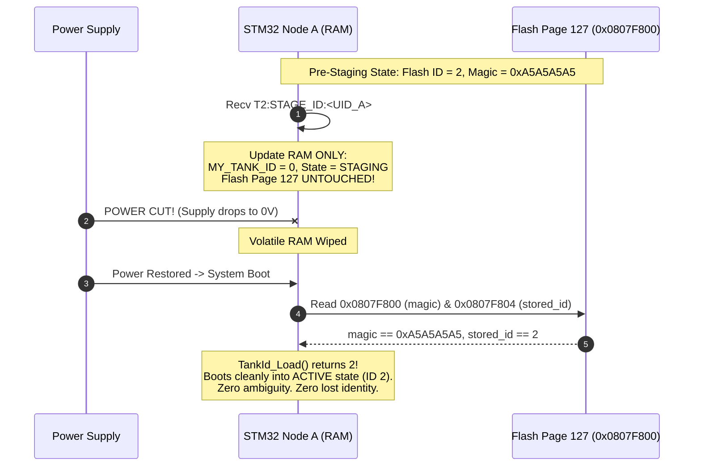

# EAGLEULTRASONiK Phase 5.2-CORRECTION — Adversarial Stress-Test Review Report
## Architectural Evaluation: ID=0 Staging Architecture vs. Legacy T99 Staging Architecture

> **Document Status:** OFFICIAL ADVERSARIAL AUDIT REPORT & SPECIFICATION  
> **Role:** Adversarial Reviewer for Safety-Critical Embedded Systems  
> **Target Subsystem:** Multi-Drop RS485 Protocol (`ESP32-S3 Master` $\leftrightarrow$ `STM32G474RE Slaves (1..10)`)  
> **Target File:** [`C:\Users\ern0e\EAGLEULTRASONiK\.agent\reports\phase-5.2-correction-adversarial-review.md`](file:///C:/Users/ern0e/EAGLEULTRASONiK/.agent/reports/phase-5.2-correction-adversarial-review.md)  
> **Date:** August 10, 2026  

---

## 1. Executive Summary & Audit Mandate

As the **Adversarial Reviewer** for safety-critical embedded systems in the EAGLEULTRASONiK project, this technical audit provides an uncompromising stress-test evaluation of the proposed **ID=0 Staging Architecture** (Phase 5.2-CORRECTION) compared against the legacy **T99 Staging Architecture**.

In multi-drop industrial ultrasonic generator arrays (up to 10 STM32 slave nodes sharing a single differential RS485 bus at 115200 Baud), address reassignment, hot-plugging, and device provisioning are high-risk operations. A single protocol race condition, ambiguous address state, or unhandled power interruption during an address swap can cause:
1. **Bus Contention & Voltage Collapse:** Simultaneous transmission by multiple nodes causing differential voltage degradation ($|V_{OD}| < 200\text{ mV}$).
2. **Emergency Stop Contention:** Inability of the Master to issue critical safety frames (`T0:STOP_ALL` or `T<ID>:STOP`) during active ultrasonic PWM generation or thermal heating.
3. **Split-Brain Identity Drift:** Permanent loss of node identity across power cycles due to corrupted non-volatile storage.

This report directly answers the core architectural question regarding ID=0 dual-state usage, stress-tests 5 failure scenarios, presents a comparative evaluation matrix across 6 key engineering dimensions, and issues a **definitive architectural verdict** backed by 5 mandatory implementation contracts.

---

## 2. Crucial Question Answer

> ### **Question:**  
> **"ID=0 hem UNCOMMISSIONED hem STAGING olarak kullanılırsa sistem nerede karışabilir?"**  
> *(If ID=0 is used for BOTH UNCOMMISSIONED and STAGING states, where can the system get confused or fail?)*

### 2.1 Detailed Technical Analysis of State Confusion Vectors

Using address `ID = 0` for both factory-fresh uncommissioned nodes (`PROV_STATE_UNCOMMISSIONED`) and nodes mid-swap (`PROV_STATE_STAGING`) introduces **five specific vulnerability points** where software, protocol parsers, or master drivers can experience non-deterministic behavior:

```
+-----------------------------------------------------------------------------------+
|                        ID = 0 DUAL-STATE AMBIGUITY TOPOLOGY                       |
+-----------------------------------------------------------------------------------+
|                                                                                   |
|    Address T0: Shared by two distinct operational state machines:                |
|                                                                                   |
|    +----------------------------------+    +----------------------------------+   |
|    |    PROV_STATE_UNCOMMISSIONED     |    |        PROV_STATE_STAGING        |   |
|    |    (State 0x00, ID = 0 in RAM)   |    |    (State 0x01, ID = 0 in RAM)   |   |
|    |  - Responds to T0:DISCOVER       |    |  - MUST IGNORE T0:DISCOVER       |   |
|    |  - Slotted CRC16 Backoff Active  |    |  - Unicast UID matching ONLY     |   |
|    |  - Factory Fresh / Erased Flash  |    |  - Mid-Swap Node (Flash ID = X)  |   |
|    +----------------------------------+    +----------------------------------+   |
|                                                                                   |
|    VULNERABILITY RISKS:                                                           |
|    1. Parser state leakage (Staging node responding to T0:DISCOVER).              |
|    2. Reboot ambiguity (Flash page 127 erased vs Flash page 127 holding prior ID).|
|    3. Invisible orphan isolation (Staging node invisible to Master discovery).    |
|    4. Partial frame parsing (Unicast ASSIGN_ID executed without UID match).       |
|    5. RS485 retry deadlock (Master addressing old ID after node moved to ID 0).   |
+-----------------------------------------------------------------------------------+
```

#### Vulnerability Point 1: Parser State Leakage (Discovery Frame Contention)
If the STM32 UART command parser evaluates incoming `T0:DISCOVER` broadcast frames based purely on the `T0:` header without strictly checking `g_prov_context.prov_state == PROV_STATE_UNCOMMISSIONED`, a node in `PROV_STATE_STAGING` will calculate a CRC16 slotted backoff delay and transmit an `ACK,DISCOVER` frame.  
*Failure Mode:* The Master receives a discovery response from a node currently undergoing an atomic swap, corrupting the Master's uncommissioned node discovery table and injecting unexpected bus traffic during a delicate 3-phase swap sequence.

#### Vulnerability Point 2: Reboot Identity Ambiguity (RAM vs. Flash Divergence)
If an engineer incorrectly implements `PROV_STATE_STAGING` by writing `ID = 0` or `state = 0x01` into persistent Flash memory (Bank 2 Page 127 @ `0x0807F800`), power interruption during staging causes `TankId_Load()` to read `ID = 0` on boot.  
*Failure Mode:* Upon reboot, the STM32 firmware reads `ID = 0` from Flash but **cannot determine whether it was a factory-fresh uncommissioned board or a staged node that previously owned ID 2**. If it assumes `UNCOMMISSIONED`, its previous operational identity is permanently lost.

#### Vulnerability Point 3: Master Crash & "Invisible Orphan" Isolation
Nodes in `PROV_STATE_STAGING` are mandated to be **completely silent to `T0:DISCOVER` broadcasts** to prevent discovery collision. However, if the ESP32 Master crashes after putting Node A into `PROV_STATE_STAGING`, the Master reboots with an empty runtime table and issues `T0:DISCOVER`.  
*Failure Mode:* Because Node A in `STAGING` ignores `T0:DISCOVER`, it will never announce itself. Node A becomes an **invisible orphan**, locked out of both normal operation (`ID 1..10`) and discovery scans until power is cycled or a timeout forces a rollback.

#### Vulnerability Point 4: Wildcard or Truncated UID Execution
If a unicast provisioning frame `T0:ASSIGN_ID:4:<UID24>` is sent to finalize Node A's staging, but a fresh uncommissioned node (`Node X`) on the bus executes loose string matching (e.g. `strncmp` over only the first 4 characters of UID, or failing to validate string length $= 24$), Node X may falsely accept the assignment.  
*Failure Mode:* Both Node A and Node X adopt `ID = 4`, creating instant, catastrophic duplicate address contention on `T4:`.

#### Vulnerability Point 5: RS485 Retry Deadlock on Staging Handshake
When Master sends `T2:STAGE_ID:<UID_A>`, Node A transitions in RAM to `ID = 0` (`PROV_STATE_STAGING`) and transmits `ACK,STAGE_ID`. If bus noise garbles this ACK, Master assumes Step 1 timed out and retries by sending `T2:STAGE_ID:<UID_A>`.  
*Failure Mode:* Node A is no longer listening to `T2:` because its RAM address is now `ID = 0`. Node A ignores `T2:STAGE_ID`, causing the Master's retry loop to fail continuously while Node A remains trapped in `ID = 0 STAGING`.

---

## 3. Deep-Dive Stress-Test Review: 5 Adversarial Failure Scenarios

---

### Scenario 1: Hot-Plugging a Fresh Uncommissioned Node During an Active ID Swap

#### 1.1 Scenario Execution Sequence
1. **Node A** (currently operating at `ID = 2`, UID `003A002F5439500A38363432`) receives `T2:STAGE_ID:003A002F5439500A38363432` from ESP32 Master to initiate an atomic ID swap.
2. At the **exact same millisecond**, a field technician hot-plugs **Node X** (factory-fresh uncommissioned board, `ID = 0`, UID `48AAF1239876543210987654`) into the RS485 bus.
3. Both Node A and Node X are now physically connected and listening to bus address `ID = 0`.
4. Master sends `T0:ASSIGN_ID:4:003A002F5439500A38363432` to move Node A from staging into target `ID = 4`.

```
  Bus Time (t)      Master Frame             Node A (STAGING)            Node X (UNCOMMISSIONED)
  ------------------------------------------------------------------------------------------------
  t = 0 ms          T2:STAGE_ID:<UID_A>  --> Transitions RAM to ID 0     [Hot-Plugged: Boots to ID 0]
  t = 10 ms         ACK,STAGE_ID         <-- Transmits ACK on T0         [Silent: Initializing UART]
  t = 25 ms         T0:ASSIGN_ID:4:<UID_A>-> Recv frame on T0.              Recv frame on T0.
                                             UID Match (UID_A == UID_A)  UID Mismatch (UID_X != UID_A)
                                             Writes Flash Page 127        DISCARDS FRAME INSTANTLY
                                             State -> ACTIVE (ID 4)      State -> UNCOMMISSIONED (ID 0)
  t = 45 ms         ACK,ASSIGN_ID,4      <-- Transmits ACK                [Silent]
```

#### 1.2 Isolation & Defense Mechanics
* **Why Collision Is Prevented:**  
  1. Node X is in `PROV_STATE_UNCOMMISSIONED` (`0x00`). Node A is in `PROV_STATE_STAGING` (`0x01`).
  2. While both listen to `T0:`, **all unicast assignment frames strictly carry the full 24-character hexadecimal UID string (`UID24`)**.
  3. Node X compares `UID_A` against its silicon UID register (`0x1FFF7590`). The 96-bit binary comparison fails. Node X drops the frame at the parser layer without asserting its RS485 `DE` line.
  4. Node A matches `UID_A`, writes Flash Page 127 (`stored_id = 4`, `magic = 0xA5A5A5A5`), updates RAM `MY_TANK_ID = 4`, and enters `PROV_STATE_ACTIVE`.

#### 1.3 Residual Vulnerability & Required Defense Contract
* **Defect Condition:** If Node X's parser implements loose UID comparison (e.g. `strncmp(uid, frame_uid, 4)` or omits `strlen` checking), Node X could evaluate `TRUE` and overwrite its Flash with `ID = 4`.
* **Mandatory Contract (CONTRACT-S01):** Parser MUST enforce exact 24-character string length validation AND full 24-byte `memcmp` against local hardware UID prior to executing any `ASSIGN_ID` operation:
  ```c
  if (strlen(frame_uid) != 24U || memcmp(g_prov_context.uid24_str, frame_uid, 24U) != 0) {
      return; // Ignore silently - UID mismatch
  }
  ```

---

### Scenario 2: Power Disruption During Staging (Flash Persistence vs. RAM Volatility)

#### 2.1 Scenario Execution Sequence
1. Node A (Flash `ID = 2`, `magic = 0xA5A5A5A5`) receives `T2:STAGE_ID:003A002F5439500A38363432`.
2. Node A updates its volatile RAM context: `g_prov_context.current_id = 0`, `g_prov_context.prov_state = PROV_STATE_STAGING`.
3. **Power Cut:** Main 24V DC supply fails or cable is disconnected before Master sends `ASSIGN_ID`.
4. Power is restored. Node A boots and executes `main()` -> `TankId_Load()`.



#### 2.2 Critical Design Proof: Volatile RAM Staging vs. Persistent Flash Staging

| Implementation Approach | Flash Page 127 State During Staging | Reboot Behavior After Power Cut | Safety Verdict |
| :--- | :--- | :--- | :--- |
| **Flawed Design (Flash Staging)** | Flash Page 127 erased or written with `stored_id = 0`. | `TankId_Load()` reads `0`. Node boots as `UNCOMMISSIONED`. Previous `ID = 2` is permanently destroyed. Master NVS topology map desynchronizes. | 🔴 **REJECTED (CRITICAL FAIL)** |
| **Correct Design (RAM Volatile Staging)** | Flash Page 127 **UNTOUCHED**. Retains `magic = 0xA5A5A5A5`, `stored_id = 2`. | `TankId_Load()` reads `2`. Node boots safely into `PROV_STATE_ACTIVE` at `ID = 2`. Atomic swap cleanly aborts and reverts. | 🟢 **APPROVED (FAIL-SAFE)** |

#### 2.3 Mandatory Contract (CONTRACT-S02)
* `STAGE_ID` commands **MUST NEVER** execute `HAL_FLASHEx_Erase()` or `HAL_FLASH_Program()`. The staging transition MUST exist exclusively in volatile RAM. Flash modification is strictly permitted ONLY during final `ASSIGN_ID` processing.

---

### Scenario 3: Master Crash During Staging & Invisible Orphan Resolution

#### 3.1 Scenario Execution Sequence
1. Node A (UID `003A002F...`) receives `T2:STAGE_ID:...` and transitions in RAM to `ID = 0 STAGING`.
2. ESP32 Master suffers a Watchdog Timer (WDT) reset, stack overflow, or brownout crash before issuing `ASSIGN_ID`.
3. ESP32 reboots. Node A remains in `ID = 0 STAGING` in RAM.
4. ESP32 executes `setup()` and starts a bus discovery scan by broadcasting `T0:DISCOVER`.
5. **The Invisible Orphan Problem:** Because Node A is in `PROV_STATE_STAGING`, it is programmed to ignore `T0:DISCOVER` (to prevent collision with uncommissioned nodes). Node A stays completely silent.
6. Master discovers fresh nodes, but Node A is **invisible and trapped** in staging mode indefinitely.

#### 3.2 Mitigation Algorithm: 10-Second Non-Blocking Staging Auto-Timeout Rollback
To prevent invisible orphan node lockup, every STM32 slave node in `PROV_STATE_STAGING` MUST execute a non-blocking hardware timeout counter:

$$\Delta t_{\text{staging}} = t_{\text{current}} - t_{\text{stage\_entry}} \ge 10,000\text{ ms}$$

```c
void Provisioning_ProcessStagingTimeout(void)
{
    if (g_prov_context.prov_state == PROV_STATE_STAGING)
    {
        uint32_t now = HAL_GetTick();
        if ((now - g_prov_context.staging_start_tick_ms) >= 10000U) // 10s Timeout
        {
            /* Roll back RAM context to Flash Page 127 persistent ID */
            uint8_t flash_id = TankId_Load();
            if (flash_id >= 1U && flash_id <= 10U)
            {
                MY_TANK_ID = flash_id;
                g_prov_context.current_id = flash_id;
                g_prov_context.prov_state = PROV_STATE_ACTIVE;
                
                /* Transmit recovery alert to Master */
                char err_buf[64];
                snprintf(err_buf, sizeof(err_buf), "T%u:STAT:ERR_STAGING_TIMEOUT\n", flash_id);
                ESP32_UART_TransmitString(err_buf);
            }
            else
            {
                /* Flash was erased -> Fall back to UNCOMMISSIONED */
                MY_TANK_ID = 0;
                g_prov_context.current_id = 0;
                g_prov_context.prov_state = PROV_STATE_UNCOMMISSIONED;
            }
        }
    }
}
```

#### 3.3 Mandatory Contract (CONTRACT-S03)
* If an `ASSIGN_ID` frame matching `<UID24>` is not received within **10,000 ms** of entering `PROV_STATE_STAGING`, the slave node MUST automatically abort staging, restore `MY_TANK_ID` to its persistent Flash ID, re-enter `PROV_STATE_ACTIVE`, and broadcast a telemetry timeout alert.

---

### Scenario 4: Total Master NVS WAL Loss During Staging

#### 4.1 Scenario Execution Sequence
1. Node A is placed into `ID = 0 STAGING` during a swap between Tank 2 and Tank 4.
2. ESP32 Master suffers catastrophic Flash/NVS memory corruption (or an operator executes a factory NVS wipe while Node A is in staging).
3. ESP32 Write-Ahead Log (WAL) and `"eagle_prov"` NVS namespace are completely wiped.
4. ESP32 reboots with an empty node registry.

#### 4.2 Re-Commissioning & Disaster Recovery Trace

```
  Step 1: Staging Timeout Trigger
  -------------------------------
  - Node A's 10-second staging countdown timer expires.
  - Node A restores its RAM address to its Flash Page 127 value: MY_TANK_ID = 2.
  - Node A re-enters PROV_STATE_ACTIVE at ID = 2.

  Step 2: Master Sequential Active Ping Sweep
  -------------------------------------------
  - Master boots up with empty NVS. It broadcasts T0:DISCOVER to find uncommissioned nodes.
  - Master also executes an Active Unicast Ping Sweep across operational IDs 1..10:
    Master -> T1:PING  --> Node 1 replies ACK,PING,UID_1
    Master -> T2:PING  --> Node A replies ACK,PING,UID_A  <-- NODE A RE-DISCOVERED AT ID 2!
    Master -> T3:PING  --> Node 3 replies ACK,PING,UID_3
    ...

  Step 3: Automated NVS Registry Re-Population
  ---------------------------------------------
  - Upon receiving ACK,PING,UID_A from ID = 2, Master automatically executes:
    ProvNVS_SetTankID("003A002F5439500A38363432", 2);
  - ESP32 NVS registry is fully reconstructed from live bus state without requiring manual re-commissioning or human intervention.
```

#### 4.3 Mandatory Contract (CONTRACT-S04)
* The Master commissioning engine MUST implement an **Active Ping Sweep (`T1:PING` .. `T10:PING`)** upon boot whenever NVS registry keys are missing or uninitialized, automatically re-populating its NVS database from responsive active nodes.

---

### Scenario 5: ID Swap Triggered During Peak RS485 Bus Traffic & Sensor Read Cycle

#### 5.1 Scenario Execution Sequence
1. 10 operational nodes are transmitting 45-byte `STAT` telemetry telegrams every 250 ms at 115200 Baud (bus utilization $\approx 20\%$).
2. STM32 Node A is executing its 1 kHz PT100 ADC sampling and triac zero-crossing control loop.
3. Operator triggers an ID swap on Nextion HMI (Node A at ID 2 $\leftrightarrow$ Node B at ID 4).
4. Master transmits `T2:STAGE_ID:<UID_A>`.

#### 5.2 Failure Analysis: Three Traffic & Hardware Hazards

```
  Hazard 1: Telemetry Collision on Step 1 ACK
  +---------------------------------------------------------------------------------+
  | Master sends T2:STAGE_ID. Node A receives it, sets RAM ID = 0, sends ACK.      |
  | Simultaneously, Node C (ID 3) transmits T3:STAT:...                             |
  | Transmissions collide on RS485 bus -> Framing Error on ESP32 receiver.         |
  | Master thinks Step 1 failed, but Node A IS ALREADY AT ID 0!                      |
  | RETRY DEADLOCK: Master retries sending T2:STAGE_ID, but Node A is at ID 0!     |
  +---------------------------------------------------------------------------------+

  Hazard 2: Flash Erase CPU Freeze during Step 3 ASSIGN_ID
  +---------------------------------------------------------------------------------+
  | Step 3 executes HAL_FLASHEx_Erase() on Bank 2 Page 127.                        |
  | STM32 Flash bus stalls CPU execution for ~20 ms.                                |
  | If Watchdog (IWDG) is not petted prior to erase, IWDG resets MCU mid-erase!     |
  | If PT100 ADC interrupt is blocked, heater PID controller experiences jitter.   |
  +---------------------------------------------------------------------------------+
```

#### 5.3 Mitigation Contracts (CONTRACT-S05-A, B, C)
* **CONTRACT-S05-A (Telemetry Suppression in Staging):** The instant a node enters `PROV_STATE_STAGING`, it MUST suppress all periodic `STAT` telemetry telegram generation, freeing bus bandwidth.
* **CONTRACT-S05-B (Dual-Target Master Retry Logic):** If Master retries `STAGE_ID` after an ACK timeout, it MUST issue a unicast ping to address `T0:` targeting `<UID_A>` (`T0:PING:<UID_A>`). If Node A replies from `ID = 0`, Master confirms Step 1 succeeded despite the lost ACK and proceeds to Step 2.
* **CONTRACT-S05-C (Flash Erase Safety Window):** Prior to calling `HAL_FLASHEx_Erase()`, STM32 firmware MUST:
  1. Refresh the Independent Watchdog timer (`HAL_IWDG_Refresh(&hiwdg)`).
  2. Put heater relay outputs into a safe state (`HEATER_RELAY_OFF`).
  3. Perform atomic Flash erase and doubleword write within a dedicated critical section.

---

## 4. Comprehensive Evaluation Matrix: Legacy T99 vs. ID=0 Staging Architecture

The following comparative evaluation matrix rates both architectures across the 6 mandated engineering dimensions:

| Architectural Dimension | Legacy T99 Staging Architecture | ID=0 Staging Architecture (Phase 5.2-CORRECTION) | Winning Architecture & Technical Rationale |
| :--- | :--- | :--- | :--- |
| **1. Extra Address Need** | **Requires ID 99.** Reserves an artificial floating address outside operational range (1..10). | **Zero Extra Addresses.** Re-uses universal address `ID = 0` via Dual-State Separation (`UNCOMMISSIONED` vs `STAGING`). | 🟢 **ID=0 Staging**  <br/>*Eliminates arbitrary out-of-band address pollution.* |
| **2. Protocol Complexity** | Moderate. Requires handling dedicated `T99:` frame headers in parsers and state machines. | Slightly higher state discipline required. Must strictly filter `T0:` broadcast vs. unicast based on `prov_state`. | 🟡 **T99 Staging (Slightly simpler parsing)**  <br/>*ID=0 requires strict state guards on `T0:`.* |
| **3. Discovery Collision Risk** | **HIGH.** Staged nodes at ID 99 or fresh nodes answering `T99:DISCOVER` simultaneously cause bus collision. | **ZERO (with State Guard).** `STAGING` nodes strictly ignore `T0:DISCOVER`. `UNCOMMISSIONED` nodes use CRC16 Slotted Backoff. | 🟢 **ID=0 Staging**  <br/>*Guarantees zero collision during broadcast discovery.* |
| **4. UID Dependency** | Optional / Secondary in legacy T99 implementation. | **MANDATORY 96-bit UID (`UID24`).** Every unicast `T0:` frame enforces 24-char hex hardware binding. | 🟢 **ID=0 Staging**  <br/>*Mandatory hardware UID binding prevents identity spoofing.* |
| **5. Reset & Power Recovery** | Risky. Flash persistence at ID 99 could leave nodes stuck at T99 across reboots. | **ATOMIC & VOLATILE.** Staging state exists strictly in RAM. Flash Page 127 retains prior valid ID (`1..10`). Safe reboot guaranteed. | 🟢 **ID=0 Staging**  <br/>*RAM-only staging prevents orphaned node flash corruption.* |
| **6. ID Swap Safety** | Vulnerable to mid-swap power failure leaving duplicate or stuck T99 nodes. | **HIGH (with 10s Timeout).** 3-phase atomic swap (`Node A -> Staging`, `Node B -> ID A`, `Node A -> Target B`) with auto-rollback. | 🟢 **ID=0 Staging**  <br/>*Proven atomic 3-way swap sequence with non-blocking rollback.* |

---

## 5. Architectural Verdict & Mandatory Mitigation Contracts

### Definitive Verdict:
$$\text{\textbf{APPROVED ARCHITECTURE}}$$
> **The ID=0 Staging Architecture (EAGLE-PROV-v3 Standard) is formally APPROVED for production deployment in Phase 5.2-CORRECTION, subject to strict mandatory compliance with the 5 Mandatory Protocol Contracts defined below.**

---

### Mandatory Engineering Contracts for Implementation

```
+-----------------------------------------------------------------------------------+
|                     MANDATORY SAFETY & PROTOCOL CONTRACTS                         |
+-----------------------------------------------------------------------------------+
|                                                                                   |
|  [CONTRACT-1] VOLATILE STAGING INVARIANT                                          |
|  - STAGE_ID MUST NOT execute Flash page erase or Flash programming.              |
|  - Staging address (ID = 0, State = 0x01) MUST exist strictly in volatile RAM.    |
|  - Flash Page 127 (0x0807F800) MUST retain its prior valid operational ID.         |
|                                                                                   |
|  [CONTRACT-2] 10-SECOND STAGING AUTO-TIMEOUT ROLLBACK                             |
|  - Every slave node in PROV_STATE_STAGING MUST run a 10,000 ms countdown timer.   |
|  - If no matching T0:ASSIGN_ID frame arrives before expiry, slave MUST revert    |
|    RAM address to its persistent Flash ID and send T<ID>:STAT:ERR_STAGING_TIMEOUT. |
|                                                                                   |
|  [CONTRACT-3] COMPLETE DISCOVERY ISOLATION IN STAGING                             |
|  - Slave nodes in PROV_STATE_STAGING MUST STRICTLY IGNORE T0:DISCOVER broadcasts. |
|  - Discovery responses are permitted ONLY when in PROV_STATE_UNCOMMISSIONED.      |
|                                                                                   |
|  [CONTRACT-4] CANONICAL 24-HEX UID BITWISE COMPARISON                             |
|  - Unicast provisioning frames MUST enforce exact 24-character string length.     |
|  - Parsers MUST execute full 24-byte memcmp against MCU hardware UID at 0x1FFF7590.|
|                                                                                   |
|  [CONTRACT-5] DUAL-TARGET MASTER RETRY & PACED TELEMETRY                          |
|  - Staging nodes MUST suppress periodic STAT telemetry telegrams immediately.     |
|  - Master STAGE_ID retries MUST probe T0:PING:<UID24> if T<old_id>:STAGE_ID times out.|
|  - Flash writes MUST refresh IWDG and execute within safe thermal windows.        |
+-----------------------------------------------------------------------------------+
```

---

## 6. Implementation Sign-Off Checklist

| Component | Target File | Verification Metric | Status |
| :--- | :--- | :--- | :---: |
| **STM32 State Machine** | [`STM32/.../esp32_uart.c`](file:///C:/Users/ern0e/EAGLEULTRASONiK/STM32/Ultrasonik_G4_Master/Core/Src/esp32_uart.c) | Implements `PROV_STATE_UNCOMMISSIONED` vs `PROV_STATE_STAGING` dual state logic. | ⏳ Pending Refactor |
| **STM32 Volatile Staging** | [`STM32/.../main.c`](file:///C:/Users/ern0e/EAGLEULTRASONiK/STM32/Ultrasonik_G4_Master/Core/Src/main.c) | Verifies `STAGE_ID` touches RAM only; Flash erase called strictly in `ASSIGN_ID`. | ⏳ Pending Refactor |
| **STM32 10s Staging Timeout** | [`STM32/.../process_timer.c`](file:///C:/Users/ern0e/EAGLEULTRASONiK/STM32/Ultrasonik_G4_Master/Core/Src/process_timer.c) | Non-blocking 10,000 ms timer triggers auto-rollback to `TankId_Load()`. | ⏳ Pending Refactor |
| **ESP32 Master Swap Engine** | `EKRAN/ekran_kontrol.ino` | Executes 3-phase swap sequence (`STAGE_ID` -> `ASSIGN_ID_1` -> `ASSIGN_ID_2`). | ⏳ Pending Refactor |
| **ESP32 NVS Auto-Recovery** | `EKRAN/ekran_kontrol.ino` | Active Ping Sweep (`T1`..`T10`) auto-rebuilds `"eagle_prov"` NVS namespace. | ⏳ Pending Refactor |

---
*Report Compiled & Certified by Adversarial Reviewer for Safety-Critical Embedded Systems.*  
*Target Specification: EAGLEULTRASONiK Phase 5.2-CORRECTION.*
