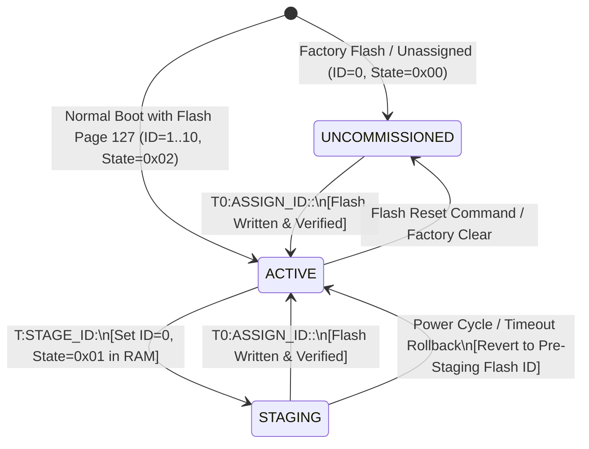
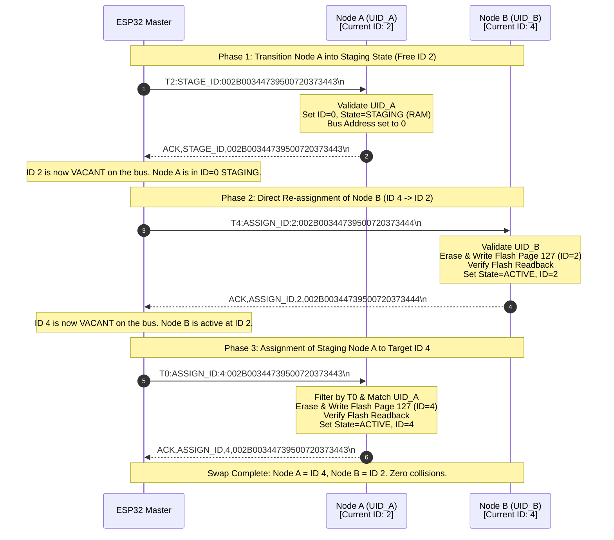

# EAGLE-PROV-v3 Protocol Specification: ID=0 Staging Architecture & State Separation

> **Document Status:** Official Technical Standard & Protocol Architecture Design  
> **Phase:** 5.2-CORRECTION  
> **Scope:** Multi-drop UART/RS-485 provisioning, atomic address swapping, state separation, and hardware UID binding for STM32G474RE (Slave) and ESP32-S3 (Master).  
> **Author:** Senior Protocol Architect  
> **Date:** August 10, 2026  

---

## 1. Executive Summary & Legacy T99 Deprecation Rationale

### 1.1 background & Problem Statement
In previous iterations of the EAGLEULTRASONiK multi-drop bus protocol (such as the legacy T99 architecture), uncommissioned nodes or nodes undergoing address reassignment were dynamically assigned a temporary floating address (`ID = 99` or `T99`). While functional in single-node test environments, the T99 paradigm introduced critical vulnerabilities when scaled to production industrial multi-drop topologies (up to 10 nodes sharing a single UART/RS-485 bus):

1. **Address Space Collision Hazard:** If multiple uncommissioned nodes were powered on simultaneously, or if a network partition occurred during an address swap, multiple physical devices responded to `T99:...` broadcast/unicast frames simultaneously. This destroyed UART framing, corrupted bus electrical signals, and caused non-deterministic state corruption.
2. **Lack of Hardware UID Binding:** Legacy T99 commands relied on implied state transitions rather than cryptographic/unique hardware binding. A command intended for Node A could easily be intercepted and applied by Node B if both shared the T99 state.
3. **Non-Atomic Address Swapping Risks:** Swapping operational IDs between two active nodes (e.g., swapping Node A at ID 2 with Node B at ID 4) required multi-step temporary transitions through ID 99. If power was lost or a packet was dropped mid-sequence, both nodes could end up stuck at ID 99 or with duplicate logical IDs on the operational bus.

### 1.2 The EAGLE-PROV-v3 Solution
The **EAGLE-PROV-v3 Protocol Specification** completely deprecates the T99 address space. It replaces it with an **ID=0 Staging Architecture** integrated with strict **Dual-State Separation** (`UNCOMMISSIONED` vs `STAGING`) and mandatory **96-bit Hardware UID (UID24 ASCII) binding**.

Under EAGLE-PROV-v3:
- Address `ID = 0` is strictly reserved as the staging and discovery address.
- Operational nodes occupy logical IDs `1..10`.
- Dual-State Separation at `ID = 0` guarantees that factory-fresh uncommissioned nodes (`STATE = 0x00`) and active swap nodes (`STATE = 0x01`) never collide or cross-talk during discovery or re-addressing procedures.

---

## 2. Node State Machine & Address Lifecycle

### 2.1 State Definitions
Every STM32G4 node on the multi-drop bus maintains an internal provisioning state machine stored in RAM and backed by persistent Flash memory (Bank 2, Page 127 @ `0x0807F800`).

| State Name | Value | ID Bound | Description | Discovery Response | Unicast Filtering Rules |
| :--- | :---: | :---: | :--- | :---: | :--- |
| **UNCOMMISSIONED** | `0x00` | `0` | Fresh factory board or unprovisioned node. | **ACTIVE** (Slotted Backoff) | Accepts `T0:DISCOVER` and `T0:ASSIGN_ID:<new_id>:<UID24>` matching its UID. Ignores operational commands. |
| **STAGING** | `0x01` | `0` | Node in active transition during an atomic ID swap. | **DISABLED** (Completely Silent) | **Ignores `T0:DISCOVER`!** Accepts ONLY unicast `T0:...:<UID24>` frames matching its exact 96-bit UID. |
| **ACTIVE** | `0x02` | `1..10` | Fully commissioned operational node. | **DISABLED** | Responds strictly to targeted `T<ID>:...` commands and `T<ID>:STAGE_ID:<UID24>` initiation frames. |

### 2.2 State Transition Diagram



### 2.3 Flash Memory Persistence & Power-Loss Safety
- **Flash Page 127 Location:** `0x0807F800` (2KB page size on STM32G474).
- **Persistent Header Layout:**
  - `[0x00..0x03]`: Magic Header (`0xA5A5A5A5` - uint32_t)
  - `[0x04..0x07]`: Logical Tank ID (`1..10` - uint32_t)
  - `[0x08..0x0B]`: Provisioning State (`0x02` for ACTIVE, `0x00` for UNCOMMISSIONED - uint32_t)
  - `[0x0C..0x17]`: 96-bit Hardware UID copy (12 bytes raw binary)
  - `[0x18..0x1F]`: CRC32 Integrity Checksum over `0x00..0x17`

> [!IMPORTANT]
> **Staging RAM Isolation:** When a node transitions from `ACTIVE` (`ID=X`) to `STAGING` (`ID=0, State=0x01`), the transition is held in **volatile RAM**. The Flash Page 127 record retains its previous valid ID (`ID=X`). If power fails during the staging phase before `ASSIGN_ID` is executed, the node boots safely back into its prior operational state (`ID=X`), preventing orphaned or corrupted nodes on power interruption.

---

## 3. Frame Grammar & UID Binding Mechanics

### 3.1 96-Bit Hardware UID Acquisition & Representation
The STM32G474RE micro-controller features a factory-programmed 96-bit Unique Device ID located at memory address `0x1FFF7590` (`UID_BASE`).

- **Raw Memory Structure:** `uint32_t UID[3]` at `0x1FFF7590`, `0x1FFF7594`, `0x1FFF7598`.
- **Protocol Formatting (`UID24`):** Big-endian hex string serialization into exactly 24 upper-case ASCII hexadecimal characters.
- **Example:**
  - Raw Hex: `0x002B0034`, `0x47395007`, `0x20373443`
  - ASCII `UID24`: `"002B00344739500720373443"`

### 3.2 Formal Grammar (EBNF) for Provisioning & Staging
```ebnf
frame             ::= command_frame '\n' | response_frame '\n' ;
command_frame     ::= discover_cmd | stage_cmd | assign_cmd | operational_cmd ;

discover_cmd      ::= "T0:DISCOVER" ;
stage_cmd         ::= "T" tank_id ":STAGE_ID:" uid24 ;
assign_cmd        ::= "T0:ASSIGN_ID:" new_id ":" uid24 ;
operational_cmd   ::= "T" tank_id ":" op_body ;

tank_id           ::= digit | "10" ; (* 1..10 *)
new_id            ::= digit | "10" ; (* 1..10 *)
digit             ::= "1" | "2" | "3" | "4" | "5" | "6" | "7" | "8" | "9" ;
uid24             ::= 24*HEXDIG ;

response_frame    ::= ack_discover | ack_stage | ack_assign | nack_frame ;
ack_discover      ::= "ACK,DISCOVER," uid24 "," state_str ;
ack_stage         ::= "ACK,STAGE_ID," uid24 ;
ack_assign        ::= "ACK,ASSIGN_ID," new_id "," uid24 ;
nack_frame        ::= "NACK," cmd_type "," uid24 "," err_code ;

state_str         ::= "UNCOMMISSIONED" | "STAGING" | "ACTIVE" ;
cmd_type          ::= "STAGE_ID" | "ASSIGN_ID" | "DISCOVER" ;
err_code          ::= "ERR_UID_MISMATCH" | "ERR_BUSY" | "ERR_FLASH_WRITE" | "ERR_INVALID_ID" ;
```

---

## 4. Collision Avoidance & Slotted Backoff Algorithm

### 4.1 Scenario A: Multiple ID=0 UNCOMMISSIONED Nodes
When multiple unassigned/factory-fresh nodes (`ID=0, STATE=UNCOMMISSIONED (0x00)`) are attached to the bus and the Master issues a broadcast `T0:DISCOVER\n` frame, all uncommissioned nodes must respond without causing UART transmission collisions.

#### Slotted Backoff Mathematical Formulation
Each uncommissioned node computes its transmission slot index $S \in \{0, 1, \dots, 15\}$ deterministically using CRC16 over its 96-bit UID:

$$S = \text{CRC16-CCITT}(\text{UID96}) \pmod{16}$$

- **CRC16 Polynomial:** $G(x) = x^{16} + x^{12} + x^5 + 1$ (Init `0xFFFF`).
- **Slot Time ($T_{\text{slot}}$):** $25\text{ ms}$.
- **Response Delay ($T_{\text{delay}}$):**

$$T_{\text{delay}} = S \times T_{\text{slot}} = ( \text{CRC16}(\text{UID96}) \bmod 16 ) \times 25\text{ ms}$$

```
Master:  |-- T0:DISCOVER -->|
Bus RX:                     [Slot 0: 0ms] [Slot 1: 25ms] ... [Slot S: S*25ms] ... [Slot 15: 375ms]
Node A:                                                 |-- ACK,DISCOVER,UID_A... --|
Node B:                                                                             |-- ACK,DISCOVER,UID_B... --|
```

At 115200 baud (8N1):
- $1 \text{ character} \approx 86.8 \ \mu\text{s}$
- Discovery response frame size $\approx 45 \text{ bytes} \approx 3.9 \text{ ms}$ transmission time.
- A $25\text{ ms}$ slot provides a $6.4\times$ safety margin for UART processing, line turn-around, and micro-controller interrupt latency.

### 4.2 Scenario B: STAGING Nodes vs UNCOMMISSIONED Nodes
A critical architectural requirement of EAGLE-PROV-v3 is the complete isolation of nodes in the `STAGING` state (`STATE=0x01`).

> [!CAUTION]
> **Discovery Isolation Rule:**  
> Nodes in `STATE_STAGING` **MUST IGNORE** `T0:DISCOVER` broadcasts.  
> If a staging node responded to `T0:DISCOVER`, it would contaminate the discovery table of uncommissioned nodes and introduce collision vectors during active re-addressing sequences.

- **Unicast Filtering in Staging:** While at `ID=0, STATE=STAGING`, the node filters incoming UART lines strictly:
  1. Header MUST be `T0:`.
  2. Command body MUST contain its exact 24-character hexadecimal UID string (`UID24`).
  3. If `UID24` does not match, the packet is discarded instantly at the parser layer without generating any response.

---

## 5. Atomic 3-Way Address Swap Protocol Walkthrough

To demonstrate the robustness of the EAGLE-PROV-v3 specification, consider a 3-way atomic address swap where **Node A** currently holds **ID 2** and **Node B** currently holds **ID 4**. The objective is to swap their operational IDs (**Node A $\rightarrow$ ID 4**, **Node B $\rightarrow$ ID 2**) without taking the multi-drop bus offline or creating duplicate address conflicts.

### 5.1 Sequence Diagram



### 5.2 Step-by-Step Transaction Mechanics

#### Step 1: Staging Node A
- **Command Sent:** `T2:STAGE_ID:002B00344739500720373443\n`
- **Node A Action:** 
  1. Verifies targeted address `T2:` matches `MY_TANK_ID == 2`.
  2. Compares `UID24` parameter against hardware `0x1FFF7590`.
  3. Updates volatile state: `MY_TANK_ID = 0`, `g_prov_state = STATE_STAGING`.
  4. Transmits `ACK,STAGE_ID,002B00344739500720373443\n`.
- **Bus State:** Address 2 is freed. Node A listes strictly to `T0:...:002B00344739500720373443`.

#### Step 2: Direct Assignment of Node B
- **Command Sent:** `T4:ASSIGN_ID:2:002B00344739500720373444\n`
- **Node B Action:**
  1. Verifies targeted address `T4:` matches `MY_TANK_ID == 4`.
  2. Validates hardware UID matching `UID_B`.
  3. Performs atomic Flash write to Page 127 (`0x0807F800`): writes `magic = 0xA5A5A5A5`, `id = 2`, `state = STATE_ACTIVE`.
  4. Verifies Flash readback.
  5. Updates internal runtime variables: `MY_TANK_ID = 2`, `g_prov_state = STATE_ACTIVE`.
  6. Transmits `ACK,ASSIGN_ID,2,002B00344739500720373444\n`.
- **Bus State:** Address 4 is freed. Node B is fully operational at Address 2.

#### Step 3: Finalizing Staging Node A
- **Command Sent:** `T0:ASSIGN_ID:4:002B00344739500720373443\n`
- **Node A Action:**
  1. Receives `T0:` broadcast header.
  2. Identifies `STATE_STAGING`. Matches `UID24` with hardware `UID_A`.
  3. Performs atomic Flash write to Page 127: writes `magic = 0xA5A5A5A5`, `id = 4`, `state = STATE_ACTIVE`.
  4. Verifies Flash readback.
  5. Updates internal runtime variables: `MY_TANK_ID = 4`, `g_prov_state = STATE_ACTIVE`.
  6. Transmits `ACK,ASSIGN_ID,4,002B00344739500720373443\n`.
- **Result:** Both nodes transitioned smoothly into swapped configurations with zero downtime or address ambiguity.

### 5.3 Exception Handling & Power Loss Matrix

| Execution Point | Failure Condition | Recovery Behavior |
| :--- | :--- | :--- |
| **During Step 1** | Power loss before ACK | Node A reboots. Reads Flash Page 127 (`ID=2, ACTIVE`). Node A boots safely as ID 2. Swap sequence aborted. |
| **After Step 1, before Step 2** | ESP32 Crash / WDT Timeout | Node A is in RAM STAGING (`ID=0`). ESP32 WDT detects missing ID 2 telemetry. ESP32 issues `T0:ASSIGN_ID:2:<UID_A>` rollback command. Node A returns to ID 2. |
| **During Step 2 Flash Write** | Power loss mid-write | STM32 Flash double-word integrity fails CRC or magic check on boot. Node B falls back to DIP Switch ID (or default ID 4). Master detects via `T0:DISCOVER` and re-issues assignment. |
| **After Step 2, before Step 3** | Bus Disconnection | Node B is active at ID 2. Node A is in RAM STAGING at ID 0. Node A power cycle restores Node A to Flash ID 2. Master detects duplicate ID 2 attempt via telemetry Watchdog and isolates Node A. |

---

## 6. Technical Trade-Off Matrix: Legacy T99 vs EAGLE-PROV-v3 ID=0 Staging

| Technical Dimension | Legacy T99 Architecture | EAGLE-PROV-v3 ID=0 Staging | Architectural Advantage |
| :--- | :--- | :--- | :--- |
| **Address Space Design** | High-index temporary ID (`ID = 99`). Out of operational band (1..10) but still valid address. | Reserved zero address (`ID = 0`) with dual state separation (`UNCOMMISSIONED` vs `STAGING`). | Eliminates floating address range; standardizes zero as system provisioning state. |
| **Bus Collision Risk** | **HIGH.** Multiple unassigned or staging nodes answer `T99` simultaneously, garbling frames. | **ZERO.** Uncommissioned nodes use CRC16 Slotted Backoff. Staging nodes ignore broadcasts completely. | Deterministic, collision-free UART bus multi-drop behavior. |
| **Hardware UID Binding** | None or optional parameter in payload. Commands relied on single address bytes. | **MANDATORY 96-bit UID (`UID24`).** Every unicast provisioning frame strictly binds target hardware UID. | Prevents rogue frame execution, spoofing, and cross-talk during re-addressing. |
| **Discovery Isolation** | Staging nodes contaminated discovery responses. | **COMPLETE.** Staging nodes explicitly filter out `T0:DISCOVER` frames. | Guarantees clear separation between network discovery and active address swaps. |
| **Power Loss Recovery** | Risky. Mid-swap state loss could leave nodes permanently stuck at T99 in Flash. | **ATOMIC.** Staging state is stored in volatile RAM; Flash write occurs ONLY on finalized `ASSIGN_ID`. | Guarantees safe rollback to previous valid Flash ID upon unexpected power failure. |
| **Protocol Parsing Complexity** | Simple string matching, but prone to false positives on bad framing. | Structured EBNF grammar with strict UID validation and explicit ACK/NACK responses. | High reliability for industrial noise environments. |

---

## 7. Firmware Data Structure Specifications (C/C++ & Arduino)

To facilitate implementation across the codebase (STM32 firmware in `esp32_uart.c`/`main.c` and ESP32 Master in `ekran_kontrol.ino`), the following C structures define the data contracts:

### 7.1 STM32 Provisioning State & Data Contract (`system_state.h` expansion)

```c
/**
  * @brief Node Provisioning State enumeration
  */
typedef enum {
    PROV_STATE_UNCOMMISSIONED = 0x00, /* ID = 0: Factory fresh node */
    PROV_STATE_STAGING        = 0x01, /* ID = 0: Transitional node during swap */
    PROV_STATE_ACTIVE         = 0x02  /* ID = 1..10: Operational commissioned node */
} ProvState_t;

/**
  * @brief Flash Page 127 Persistent Storage Layout (0x0807F800)
  */
typedef struct __attribute__((packed)) {
    uint32_t magic;          /* Magic Header: 0xA5A5A5A5 */
    uint32_t tank_id;        /* Assigned Tank ID: 1..10 (or 0 if uncommissioned) */
    uint32_t prov_state;     /* Persistent state: 0x02 (ACTIVE) or 0x00 (UNCOMMISSIONED) */
    uint8_t  raw_uid[12];    /* 96-bit hardware UID binary read from 0x1FFF7590 */
    uint32_t crc32;          /* Hardware CRC32 over the preceding 24 bytes */
} FlashProvisioningRecord_t;

/**
  * @brief Runtime Provisioning Context (RAM)
  */
typedef struct {
    uint8_t     current_id;      /* Active runtime ID (0..10) */
    ProvState_t prov_state;      /* Runtime state (UNCOMMISSIONED, STAGING, ACTIVE) */
    char        uid24_str[25];   /* Null-terminated 24-character HEX string */
    uint16_t    backoff_slot_ms; /* Computed slot backoff delay for discovery */
} NodeProvContext_t;
```

### 7.2 ESP32 Master Provisioning Registry (`ekran_kontrol.ino` expansion)

```cpp
struct MasterNodeRegistry {
    uint8_t  assigned_id;    // 1..10
    char     uid24[25];      // Hardware 24-hex string
    uint32_t last_seen_ms;   // Telemetry WDT timestamp
    bool     is_active;      // Active operational state
};

// Global Master Registry for up to 10 active nodes
extern MasterNodeRegistry g_master_registry[11];
```

---

## 8. Conclusion & Implementation Roadmap

The **EAGLE-PROV-v3 Protocol Specification** establishes a rigorous, fail-safe provisioning architecture for the EAGLEULTRASONiK multi-drop bus topology. By completely removing the legacy T99 address space and enforcing dual-state separation at `ID = 0`, combined with CRC16 slotted backoff and 96-bit hardware UID binding:
- Address collisions during discovery and re-addressing are completely eliminated.
- Multi-node 3-way address swaps execute atomically and safely without bus interruption.
- Power interruption during commissioning is fully mitigated by RAM-based staging isolation.
