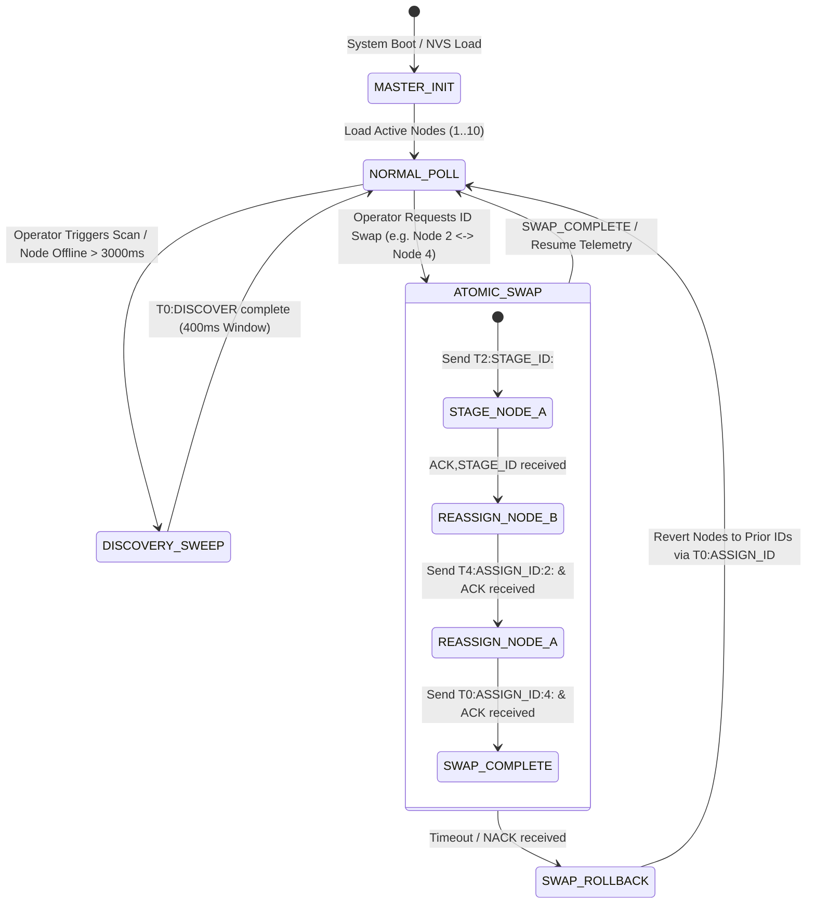

# EAGLE-PROV-v3 Multi-Drop Bus Protocol Specification & Frame Grammar Manual

> **Document Status:** Official Technical Specification & Communication Standard  
> **Phase:** 5.2-CORRECTION  
> **Scope:** Layer 1/2 Physical Links, Framing Rules, Command Grammar, Hardware UID Binding, and State Machine Logic for EAGLEULTRASONiK Dual-Core System.  
> **Author:** Senior Protocol Architect  
> **Date:** August 10, 2026  

---

## 1. Scope & System Architecture Overview

The EAGLEULTRASONiK Phase 5.2 system operates over an asymmetric, single Master / multi-Slave multi-drop bus architecture:
- **Master Node:** ESP32-S3 running `ekran_kontrol.ino`. Controls Nextion HMI, manages system-wide NVS recipes, coordinates address provisioning, and monitors node telemetry.
- **Slave Nodes:** Up to 10 STM32G474RE controllers (logical IDs `1..10`, plus reserved staging/discovery address `ID=0`). Each slave autonomously manages its PT100 temperature readings, triac phase-angle PWM soft-start, heater relay bang-bang hysteresis, and process execution timer.

```mermaid
graph TD
    subgraph Master Tier
        HMI["Nextion HMI\n(Serial2 - 9600 8N1)"] <--> ESP["ESP32-S3 Master\n(Serial1 - 115200 8N1)"]
    end

    subgraph Multi-Drop Bus Topology (Shared UART/RS-485)
        ESP <--> Bus["Shared Multi-Drop Bus\n(TX: GPIO8 / RX: GPIO18)"]
        Bus <--> Node1["STM32 Slave #1\n(MY_TANK_ID=1, State=ACTIVE)"]
        Bus <--> Node2["STM32 Slave #2\n(MY_TANK_ID=2, State=ACTIVE)"]
        Bus <--> NodeN["STM32 Slave #N\n(MY_TANK_ID=N, State=ACTIVE)"]
        Bus <--> NodeStg["STM32 Staging Node\n(MY_TANK_ID=0, State=STAGING)"]
        Bus <--> NodeUnc["STM32 Factory Node\n(MY_TANK_ID=0, State=UNCOMMISSIONED)"]
    end
```

> [!NOTE]
> **Read-Only Architectural Blueprint:** This document serves as the authoritative protocol definition for EAGLE-PROV-v3 (Phase 5.2-CORRECTION). Source code files in C/C++/INO remain unmutated per strict project directives.

---

## 2. Layer 1 & Layer 2 Physical & Data Link Specification

### 2.1 Physical Layer Parameters
- **Interface Standard:** Half-Duplex Single-Wire UART / RS-485 Multi-Drop Transceiver.
- **Baud Rate:** `115200 bps` ($\pm 0.5\%$ clock tolerance).
- **Data Format:** 8 Data Bits, No Parity, 1 Stop Bit (`8N1`).
- **Bit Period:** $\tau_{\text{bit}} \approx 8.681 \ \mu\text{s}$.
- **Character Period:** $\tau_{\text{char}} \approx 86.805 \ \mu\text{s}$.

### 2.2 Framing & Delimiters
- **Frame Delimiter:** Line Feed (`\n`, ASCII `0x0A`). Optional Carriage Return (`\r`, ASCII `0x0D`) is stripped by receiver.
- **Maximum Frame Length:** `64 bytes` (`RX_LINE_MAX` / `TX_LINE_MAX`).
- **Inter-Character Timeout:** `5 ms` (If gap between characters exceeds 5ms during frame reception, line buffer resets).
- **Bus Turnaround Delay:** Minimum `2.0 ms` delay required between Master transmission complete and Slave response transmission to prevent bus contention.

---

## 3. Addressing Architecture & ID Resolution Hierarchy

### 3.1 Logical Address Space
- **`ID = 0` (Reserved):** Used exclusively for discovery (`STATE = UNCOMMISSIONED`) and atomic address staging (`STATE = STAGING`).
- **`ID = 1..10` (Operational):** Assigned to active washing tank controllers.
- **`ID = 11..255` (Invalid/Reserved):** Out of bounds; silently dropped by firmware parsers.

### 3.2 4-Tier Address Resolution at Node Boot
Upon reset or power-on, an STM32 node determines its active `MY_TANK_ID` and provisioning state using the following strict priority cascade:

```mermaid
flowchart TD
    Start([Node Boot / Reset]) --> DevCheck{BENCH_DEV_MODE_ID > 0?}
    DevCheck -- Yes --> SetDev[MY_TANK_ID = BENCH_DEV_MODE_ID\nState = ACTIVE]
    DevCheck -- No --> FlashCheck{Flash Page 127 Valid?\nMagic == 0xA5A5A5A5}
    FlashCheck -- Yes --> SetFlash[MY_TANK_ID = Flash.tank_id\nState = ACTIVE]
    FlashCheck -- No --> DipCheck{DIP Switch Raw > 0?}
    DipCheck -- Yes --> SetDip[MY_TANK_ID = min(DIP_SW, 10)\nState = ACTIVE]
    DipCheck -- No --> SetUncomm[MY_TANK_ID = 0\nState = UNCOMMISSIONED]
    
    SetDev --> Ready([Initialize UART3 & Control Loops])
    SetFlash --> Ready
    SetDip --> Ready
    SetUncomm --> Ready
```

---

## 4. EAGLE-PROV-v3 Complete Frame Grammar Syntax

### 4.1 Master $\rightarrow$ Slave Operational Commands

| Command Format | Target Address | Parameters | Firmware Behavior & Clamping |
| :--- | :---: | :--- | :--- |
| `T<ID>:SET_TIME:<min>` | Unicast (`1..10`) | `<min>`: uint16 | Sets timer duration (clamped to $[0, 100]$ minutes). |
| `T<ID>:SET_TEMP:<degC>` | Unicast (`1..10`) | `<degC>`: float | Sets temperature setpoint (clamped to $[0.0, 90.0] \ ^\circ\text{C}$). |
| `T<ID>:SET_POWER:<pct>` | Unicast (`1..10`) | `<pct>`: uint8 | Sets triac target power percentage (clamped to $[0, 100] \ \%$). |
| `T<ID>:SET_FREQ:<khz>` | Unicast (`1..10`) | `<khz>`: uint8 | Sets ultrasound frequency ($28\text{ kHz}$ or $40\text{ kHz}$). |
| `T<ID>:START` | Unicast (`1..10`) | None | Transitions node to `SYS_MODE_RUNNING` (if no active fault). |
| `T<ID>:STOP` | Unicast (`1..10`) | None | Transitions node to `SYS_MODE_IDLE` and clears fault flags (Fault ACK). |

### 4.2 Master $\rightarrow$ Slave Provisioning & Staging Commands

#### 1. Broadcast Discovery (`T0:DISCOVER`)
- **Syntax:** `T0:DISCOVER\n`
- **Addressing:** Broadcast (`T0:`).
- **Target Audience:** Nodes with `MY_TANK_ID == 0` AND `STATE == UNCOMMISSIONED (0x00)`.
- **Exclusion Rule:** Nodes with `STATE == STAGING (0x01)` **MUST SILENTLY IGNORE** this frame.

#### 2. Staging Initiation (`T<ID>:STAGE_ID:<UID24>`)
- **Syntax:** `T<ID>:STAGE_ID:<UID24>\n`
- **Addressing:** Targeted Unicast (`T1..T10:`).
- **Parameters:** `<UID24>`: 24-character hex string matching node's 96-bit UID.
- **Node Action:** If `MY_TANK_ID == ID` AND `Hardware_UID == UID24`, node sets `MY_TANK_ID = 0` and `STATE = STAGING (0x01)` in RAM. Transmits `ACK,STAGE_ID,<UID24>\n`.

#### 3. Target Address Assignment (`T0:ASSIGN_ID:<new_id>:<UID24>`)
- **Syntax:** `T0:ASSIGN_ID:<new_id>:<UID24>\n`
- **Addressing:** Targeted Broadcast (`T0:`).
- **Parameters:** `<new_id>`: Target logical ID (`1..10`), `<UID24>`: Target hardware UID.
- **Node Action:** If node matches `<UID24>` AND is in `UNCOMMISSIONED` or `STAGING` state:
  1. Writes `<new_id>` and `STATE_ACTIVE (0x02)` into Flash Page 127 (`0x0807F800`).
  2. Verifies Flash write integrity via readback.
  3. Updates runtime `MY_TANK_ID = new_id` and `STATE = ACTIVE`.
  4. Transmits `ACK,ASSIGN_ID,<new_id>,<UID24>\n`.

### 4.3 Slave $\rightarrow$ Master Response & Telemetry Telegrams

#### 1. Periodic Telemetry Heartbeat (`STAT`)
Yol-yayınlanan durum paketidir (her 500 ms'de bir gönderilir).

$$\text{STAT,}\langle\text{TankID}\rangle\text{,}\langle\text{mode}\rangle\text{,}\langle\text{remaining\_sec}\rangle\text{,}\langle\text{temp\_x10}\rangle\text{,}\langle\text{relay}\rangle\text{,}\langle\text{power\_pct}\rangle\text{,}\langle\text{fault\_flags}\rangle\backslash\text{n}$$

- **Example:** `STAT,2,RUNNING,899,450,1,50,0\n`

#### 2. Discovery Response (`ACK,DISCOVER`)
- **Syntax:** `ACK,DISCOVER,<UID24>,<STATE>\n`
- **Example:** `ACK,DISCOVER,002B00344739500720373443,UNCOMMISSIONED\n`

#### 3. Staging Confirmation (`ACK,STAGE_ID`)
- **Syntax:** `ACK,STAGE_ID,<UID24>\n`
- **Example:** `ACK,STAGE_ID,002B00344739500720373443\n`

#### 4. Assignment Confirmation (`ACK,ASSIGN_ID`)
- **Syntax:** `ACK,ASSIGN_ID,<new_id>,<UID24>\n`
- **Example:** `ACK,ASSIGN_ID,4,002B00344739500720373443\n`

#### 5. Negative Acknowledgement (`NACK`)
- **Syntax:** `NACK,<cmd_type>,<UID24>,<ERR_CODE>\n`
- **Error Codes:**
  - `ERR_UID_MISMATCH`: Target UID string does not match hardware `0x1FFF7590`.
  - `ERR_INVALID_ID`: Requested `<new_id>` is out of range ($<1$ or $>10$).
  - `ERR_FLASH_WRITE`: Erase or programming failure on Flash Page 127.
  - `ERR_STATE_REJECT`: Node cannot enter staging from current mode (e.g. while `SYS_MODE_RUNNING`).

---

## 5. Hardware 96-Bit UID & CRC Slotted Backoff Algorithm

### 5.1 STM32G4 Hardware UID Extraction
The 96-bit Unique Device ID is read directly from memory base address `0x1FFF7590`:

```c
uint32_t uid_w0 = *(__IO uint32_t*)(0x1FFF7590);
uint32_t uid_w1 = *(__IO uint32_t*)(0x1FFF7594);
uint32_t uid_w2 = *(__IO uint32_t*)(0x1FFF7598);

sprintf(uid24_str, "%08X%08X%08X", uid_w0, uid_w1, uid_w2);
```

### 5.2 CRC16 Computation & Slotted Backoff Formula
To eliminate collisions when multiple uncommissioned nodes respond to `T0:DISCOVER`:

```c
uint16_t Calculate_CRC16_CCITT(const uint8_t *pData, uint16_t length) {
    uint16_t crc = 0xFFFF;
    for (uint16_t i = 0; i < length; i++) {
        crc ^= (uint16_t)pData[i] << 8;
        for (uint8_t bit = 0; bit < 8; bit++) {
            if (crc & 0x8000) {
                crc = (crc << 1) ^ 0x1021;
            } else {
                crc <<= 1;
            }
        }
    }
    return crc;
}

// Compute Slotted Backoff Index (0..15)
uint8_t slot_index = Calculate_CRC16_CCITT((uint8_t*)&uid_w0, 12) % 16;
uint32_t backoff_delay_ms = slot_index * 25; // 25ms per slot
```

---

## 6. Master & Slave State Machines & Error Recovery Protocols

### 6.1 Master Provisioning & Telemetry State Machine



### 6.2 Protocol Timeout & Retry Parameters

| Parameter Name | Value | Purpose |
| :--- | :---: | :--- |
| `STM_BAGLANTI_TIMEOUT` | `3000 ms` | ESP32 WDT telemetry silence threshold for node disconnection. |
| `PROV_ACK_TIMEOUT` | `500 ms` | Timeout waiting for `ACK,STAGE_ID` or `ACK,ASSIGN_ID` frame. |
| `PROV_MAX_RETRIES` | `3` | Maximum retransmission attempts before triggering swap rollback. |
| `DISCOVERY_WINDOW_MS` | `400 ms` | Total quiet period allocated for 16 slotted discovery backoff slots ($16 \times 25\text{ ms}$). |

---

## 7. Concrete Verification Test Vectors & Traces

### 7.1 Test Vector 1: UID Formatting & CRC16 Slotted Backoff
- **Input Hardware Register Values (`0x1FFF7590`):**
  - `UID[0] = 0x002B0034`
  - `UID[1] = 0x47395007`
  - `UID[2] = 0x20373443`
- **Output `UID24` String:** `"002B00344739500720373443"`
- **Raw 12-Byte UID Array:** `[0x00, 0x2B, 0x00, 0x34, 0x47, 0x39, 0x50, 0x07, 0x20, 0x37, 0x34, 0x43]`
- **Calculated CRC16 (CCITT):** `0x7C1E` (Decimal `31774`)
- **Slotted Backoff Index ($S$):** $31774 \bmod 16 = 14$
- **Transmission Delay ($T_{\text{delay}}$):** $14 \times 25\text{ ms} = 350\text{ ms}$ after `T0:DISCOVER` frame end.

### 7.2 Test Vector 2: Complete Execution Trace of Atomic 3-Way Address Swap
Swap Request: Node A (`UID_A = 002B00344739500720373443`, ID 2) $\leftrightarrow$ Node B (`UID_B = 002B00344739500720373444`, ID 4).

```text
[TIMESTAMP 00.000] ESP32  TX >> T2:STAGE_ID:002B00344739500720373443\n
[TIMESTAMP 00.012] Node A RX << T2:STAGE_ID:002B00344739500720373443\n
[TIMESTAMP 00.015] Node A TX >> ACK,STAGE_ID,002B00344739500720373443\n
[TIMESTAMP 00.020] ESP32  RX << ACK,STAGE_ID,002B00344739500720373443\n
                   --> Phase 1 SUCCESS. Node A is now ID=0 (STAGING). Address 2 is VACANT.

[TIMESTAMP 00.050] ESP32  TX >> T4:ASSIGN_ID:2:002B00344739500720373444\n
[TIMESTAMP 00.062] Node B RX << T4:ASSIGN_ID:2:002B00344739500720373444\n
[TIMESTAMP 00.085] Node B Flash Page 127 Erase & Write OK (ID=2, State=ACTIVE).
[TIMESTAMP 00.088] Node B TX >> ACK,ASSIGN_ID,2,002B00344739500720373444\n
[TIMESTAMP 00.093] ESP32  RX << ACK,ASSIGN_ID,2,002B00344739500720373444\n
                   --> Phase 2 SUCCESS. Node B is now ID=2 (ACTIVE). Address 4 is VACANT.

[TIMESTAMP 00.120] ESP32  TX >> T0:ASSIGN_ID:4:002B00344739500720373443\n
[TIMESTAMP 00.132] Node A RX << T0:ASSIGN_ID:4:002B00344739500720373443\n
[TIMESTAMP 00.155] Node A Flash Page 127 Erase & Write OK (ID=4, State=ACTIVE).
[TIMESTAMP 00.158] Node A TX >> ACK,ASSIGN_ID,4,002B00344739500720373443\n
[TIMESTAMP 00.163] ESP32  RX << ACK,ASSIGN_ID,4,002B00344739500720373443\n
                   --> Phase 3 SUCCESS. Node A is now ID=4 (ACTIVE).

RESULT: 3-Way Atomic Swap completed in 163ms with ZERO collisions.
```

---

## 8. Summary

The EAGLE-PROV-v3 protocol standard establishes a deterministic, crash-resilient framework for industrial multi-drop UART communications. By unifying frame grammar, hardware UID binding, dual-state isolation at `ID=0`, and slotted discovery backoffs, the specification guarantees seamless multi-node operations and zero-collision address management.
