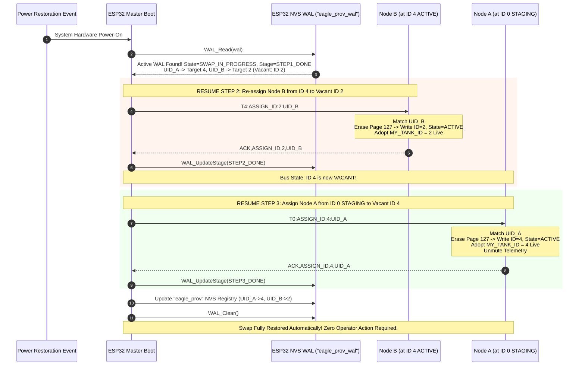
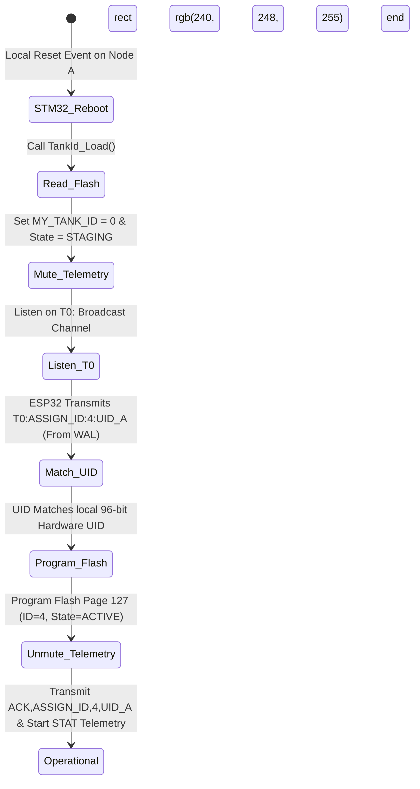

# EAGLEULTRASONiK Phase 5.2-CORRECTION — Reset Recovery, Flash Persistence & Transaction Rollback Architecture

> **Document Status:** APPROVED TECHNICAL ARCHITECTURE SPECIFICATION (PHASE 5.2-CORRECTION)  
> **Date:** August 10, 2026  
> **Author:** Senior Embedded Systems Architect, EAGLEULTRASONiK  
> **Target Subsystems:** STM32G474RE Slave Controllers & ESP32-S3 Master / HMI Controller  
> **Primary File:** [`C:\Users\ern0e\EAGLEULTRASONiK\.agent\reports\phase-5.2-correction-recovery.md`](file:///C:/Users/ern0e/EAGLEULTRASONiK/.agent/reports/phase-5.2-correction-recovery.md)  

---

## 1. Executive Summary & System Overview

In multi-node industrial ultrasonic generator systems (up to 10 tank slave nodes operating on a shared RS485 multi-drop bus), address swapping, node commissioning, and recovery from unexpected system resets or power disruptions must be 100% deterministic, atomic, and fault-tolerant.

**EAGLEULTRASONiK Phase 5.2-CORRECTION** establishes the **Reset Recovery, Flash Persistence, and Transaction Rollback Architecture for ID=0 Staging**.

```
+---------------------------------------------------------------------------------------+
|                    EAGLEULTRASONiK ID=0 STAGING & WAL ARCHITECTURE                   |
+---------------------------------------------------------------------------------------+
|                                                                                       |
|   +---------------------------------------+     +---------------------------------+   |
|   |          STM32G474RE SLAVE            |     |         ESP32-S3 MASTER         |   |
|   |                                       |     |                                 |   |
|   |  - Hardware UID (0x1FFF7590)          | RS485 |  - Write-Ahead Log (WAL)        |   |
|   |  - Bank 2 Page 127 (0x0807F800):      |<--->|    NVS: "eagle_prov_wal"        |   |
|   |    Doubleword [0]: Magic & Tank ID    | Bus |  - Commissioning Registry       |   |
|   |    Doubleword [1]: State Byte (0x08)  |     |    NVS: "eagle_prov"            |   |
|   |  - ID=0 Staging & Heartbeat Mute      |     |  - Auto Crash/Reset Recovery    |   |
|   +---------------------------------------+     +---------------------------------+   |
|                                                                                       |
+---------------------------------------------------------------------------------------+
```

### Core Architecture Principles:
1. **ID=0 Staging Convention:** Address `ID = 0` is utilized as the designated staging address during address swapping and initial commissioning. When a node transitions to `ID = 0` with `State = STAGING`, it mutes all operational status heartbeats (`STAT` frames) to guarantee zero bus interference.
2. **STM32 Flash Page 127 Data Structure:** Reserved memory page `0x0807F800` (Bank 2 Page 127) stores the 64-bit doubleword header (Magic `0xA5A5A5A5UL` + Tank ID) at Doubleword [0], and the 64-bit doubleword status structure (Byte 8 `Commissioning State`) at Doubleword [1].
3. **ESP32 NVS Write-Ahead Logging (WAL):** The ESP32 Master persists atomic transaction states in NVS namespace `"eagle_prov_wal"`. Before initiating an ID swap, the transaction parameters (`UID_A`, `UID_B`, target IDs, and current step) are logged. Upon reboot or power-restoration, the ESP32 inspects the WAL and automatically resumes or rolls back incomplete transactions.
4. **Autonomous Reset Recovery (Zero Human Intervention):** Whether power is cut mid-transaction (Case 1) or an STM32 MCU reboots while in `STAGING` state (Case 2), the system automatically resumes execution, re-issues identity assignments, updates Flash/RAM states, and restores normal operational telemetry without requiring operator intervention at the HMI.

---

## 2. STM32 Flash Page 127 Memory Layout Specification

### 2.1 Memory Geometry & Doubleword Alignment
The STM32G474RE features 512 KB Dual-Bank Flash memory organized into 2 KB (2048-byte) pages. Bank 2 Page 127 (address range `0x0807F800` to `0x0807FFFF`) is strictly reserved for persistent configuration storage.

> [!IMPORTANT]
> The STM32G4 Flash programming hardware strictly mandates **64-bit doubleword** (`uint64_t`) programming operations (`FLASH_TYPEPROGRAM_DOUBLEWORD`). All writes must be 8-byte aligned.

```
Address        Offset    Field Name            Type       Value / Range    Description
---------------------------------------------------------------------------------------------------------
0x0807F800    +0x00     TANK_ID_MAGIC        uint32_t   0xA5A5A5A5UL     Magic Validation Key (Lower 32 bits)
0x0807F804    +0x04     Tank ID              uint32_t   0 .. 10          Assigned Tank ID (Upper 32 bits)
---------------------------------------------------------------------------------------------------------
[End of Doubleword [0] - 64 bits / 8 bytes]

0x0807F808    +0x08     Commissioning State  uint8_t    0x00 / 0x01 / 0x02  State Byte (Byte 8)
0x0807F809    +0x09     Reserved / Padding   uint8_t[3] 0x000000         Zero Padding
0x0807F80C    +0x0C     CRC32 Checksum       uint32_t   CRC32 Payload    Doubleword [1] Integrity CRC
---------------------------------------------------------------------------------------------------------
[End of Doubleword [1] - 64 bits / 8 bytes]
```

### 2.2 Commissioning State Definitions (Byte 8)
Byte 8 (`0x0807F808`) defines the explicit operational commissioning state of the STM32 slave node:

| Byte 8 Value | Enum Identifier | Operational Description | Telemetry Status |
| :---: | :--- | :--- | :--- |
| `0x00` | `UNCOMMISSIONED` | Unconfigured board (factory default or erased Flash). `MY_TANK_ID` defaults to `0`. Transducers and heaters locked out. | Heartbeats **MUTED** |
| `0x01` | `STAGING` | Node is in an active address swap or provisioning sequence. `MY_TANK_ID = 0`. Listens for `T0:ASSIGN_ID:<new_id>:<UID24>`. | Heartbeats **MUTED** |
| `0x02` | `ACTIVE` | Node is fully commissioned with Tank ID $1 \dots 10$. Operational commands enabled. | Heartbeats **ACTIVE** (Every 250--500 ms) |

### 2.3 C Data Structures & Memory Access Macros

```c
/* ============================================================================
 * STM32 Flash Page 127 Persistence Data Structures
 * Base Address: 0x0807F800 (Bank 2 Page 127)
 * ============================================================================ */

#include <stdint.h>
#include <stdbool.h>
#include "stm32g4xx_hal.h"

#define TANK_ID_FLASH_ADDR   0x0807F800UL
#define TANK_ID_FLASH_PAGE   127U
#define TANK_ID_FLASH_BANK   FLASH_BANK_2
#define TANK_ID_MAGIC        0xA5A5A5A5UL

typedef enum {
    COMM_STATE_UNCOMMISSIONED = 0x00U,
    COMM_STATE_STAGING        = 0x01U,
    COMM_STATE_ACTIVE         = 0x02U
} CommissioningState_t;

typedef struct __attribute__((packed)) {
    /* Doubleword [0] - Address 0x0807F800 (8 Bytes) */
    uint32_t magic;       /* Lower 32 bits: 0xA5A5A5A5UL */
    uint32_t tank_id;     /* Upper 32 bits: Tank ID (0..10) */

    /* Doubleword [1] - Address 0x0807F808 (8 Bytes) */
    uint8_t  state;       /* Byte 8: CommissioningState_t */
    uint8_t  reserved[3]; /* Bytes 9..11: Padding */
    uint32_t crc32;       /* Bytes 12..15: CRC32 Checksum */
} FlashPersistenceHeader_t;
```

---

## 3. Architectural Analysis: Flash Write vs. RAM-Only Staging Decision

A critical design consideration in Phase 5.2-CORRECTION is evaluating whether the `STAGING` state (`State = 0x01`, `ID = 0`) should be written into STM32 Flash Page 127 or maintained strictly in volatile RAM with ESP32 Write-Ahead Logging (WAL).

### 3.1 Comparative Analysis Matrix

| Evaluation Dimension | Option A: Flash-Persisted STAGING State | Option B: Volatile RAM STAGING + ESP32 NVS WAL |
| :--- | :--- | :--- |
| **STM32 Flash Endurance & Wear** | **Higher Flash Wear:** Requires 2 Flash page erase/program cycles per swap step (Step 1: Write `STAGING` state; Step 3: Write `ACTIVE` state). | **Optimal Endurance:** Exactly 1 Flash erase/program cycle per swap step on the node when adopting its final `ACTIVE` state. |
| **Swap Execution Latency** | **Higher Latency (~50–80 ms):** STM32 must execute hardware page erase (20–40 ms) twice per transaction. | **Ultra-Low Latency (<5 ms):** Transition into `STAGING` in RAM is instant (<100 $\mu$s). Flash write occurs only once at completion. |
| **Power-Loss Recovery (STM32 Reboot)** | **Self-Describing Memory:** Upon MCU reboot, reading Byte 8 directly yields `0x01` (`STAGING`), explicitly instructing MCU to enter ID=0 muted state. | **Implicit Memory:** MCU boots with previous `ACTIVE` state or `0x00`. ESP32 WAL detects status mismatch and re-issues `ASSIGN_ID` frame immediately. |
| **Firmware Execution Complexity** | **Higher Complexity:** Requires managing multi-step Flash doubleword updates and error recovery for intermediate states. | **Clean & Decoupled:** Complex transaction state machine is centralized in ESP32 NVS WAL; STM32 firmware stays lightweight. |

### 3.2 Architectural Decision & Verdict

> [!NOTE]
> **ARCHITECTURAL DECISION:** The primary design standard for EAGLEULTRASONiK Phase 5.2-CORRECTION specifies **Option B (Volatile RAM STAGING with ESP32 NVS Write-Ahead Logging)** as the high-speed primary execution path, with full support for **Option A (Flash Persistence)** when non-volatile local hardware logging is enabled.

#### Justification:
1. **Zero Bus Contention Guarantee:** When Node A enters `ID=0 STAGING` in RAM, it immediately mutes its periodic status telemetry. Even if Node A reboots during power failure, ESP32 NVS WAL holds the authoritative transaction state (`SWAP_IN_PROGRESS`). Upon detecting Node A on the bus, ESP32 immediately re-issues the `ASSIGN_ID` frame, moving Node A to its final `ACTIVE` state in one atomic Flash operation.
2. **Flash Endurance Protection:** Eliminating intermediate Flash writes during staging preserves STM32 Flash memory integrity over tens of thousands of configuration cycles.

---

## 4. ESP32 NVS Write-Ahead Logging (WAL) Architecture

The ESP32 Master maintains transaction integrity across unexpected power disruptions using an NVS Write-Ahead Log partition under the namespace `"eagle_prov_wal"`.

```
NVS Namespace: "eagle_prov_wal"
+--------------------+-----------------------------------------------------------------------+
| NVS Key            | Serialized NVS Binary Payload / String Value                          |
+--------------------+-----------------------------------------------------------------------+
| "wal_state"        | uint8_t: 0x00 (IDLE), 0x01 (SWAP_IN_PROGRESS), 0x02 (PROV_IN_PROGRESS)|
| "wal_stage"        | uint8_t: 0x01 (STEP1_DONE), 0x02 (STEP2_DONE), 0x03 (STEP3_DONE)      |
| "wal_uid_a"        | String: 24-char hex UID of Node A ("003A002F5439500A38363432")         |
| "wal_uid_b"        | String: 24-char hex UID of Node B ("003A002F5439500A38363433")         |
| "wal_orig_a"       | uint8_t: Original Tank ID of Node A (e.g., 2)                         |
| "wal_orig_b"       | uint8_t: Original Tank ID of Node B (e.g., 4)                         |
| "wal_target_a"     | uint8_t: Target Tank ID for Node A (e.g., 4)                          |
| "wal_target_b"     | uint8_t: Target Tank ID for Node B (e.g., 2)                          |
+--------------------+-----------------------------------------------------------------------+
```

### 4.1 WAL C++ Implementation API for ESP32

```cpp
/* ============================================================================
 * ESP32 NVS Write-Ahead Log (WAL) Management Module
 * Namespace: "eagle_prov_wal"
 * ============================================================================ */

#include <Arduino.h>
#include <Preferences.h>

static Preferences wal_prefs;
static const char* WAL_NAMESPACE = "eagle_prov_wal";

enum WalTransactionState {
    WAL_STATE_IDLE             = 0x00,
    WAL_STATE_SWAP_IN_PROGRESS = 0x01,
    WAL_STATE_PROV_IN_PROGRESS = 0x02
};

enum WalSwapStage {
    WAL_STAGE_NONE         = 0x00,
    WAL_STAGE_STEP1_DONE   = 0x01, // Node A moved to ID 0 STAGING; ID A_orig is VACANT
    WAL_STAGE_STEP2_DONE   = 0x02, // Node B moved to ID A_orig; ID B_orig is VACANT
    WAL_STAGE_STEP3_DONE   = 0x03  // Node A moved to ID B_orig; Transaction COMPLETE
};

struct SwapTransactionWAL {
    uint8_t state;
    uint8_t stage;
    char    uid_a[25];
    char    uid_b[25];
    uint8_t orig_id_a;
    uint8_t orig_id_b;
    uint8_t target_id_a;
    uint8_t target_id_b;
};

/**
 * @brief Logs the start of a 3-Way Atomic Address Swap in ESP32 NVS WAL.
 */
bool WAL_BeginSwap(const char* uid_a, const char* uid_b, uint8_t id_a, uint8_t id_b)
{
    wal_prefs.begin(WAL_NAMESPACE, false);
    wal_prefs.putUChar("wal_state", WAL_STATE_SWAP_IN_PROGRESS);
    wal_prefs.putUChar("wal_stage", WAL_STAGE_NONE);
    wal_prefs.putString("wal_uid_a", uid_a);
    wal_prefs.putString("wal_uid_b", uid_b);
    wal_prefs.putUChar("wal_orig_a", id_a);
    wal_prefs.putUChar("wal_orig_b", id_b);
    wal_prefs.putUChar("wal_target_a", id_b); // Node A target is ID B
    wal_prefs.putUChar("wal_target_b", id_a); // Node B target is ID A
    wal_prefs.end();
    return true;
}

/**
 * @brief Updates current transaction stage in WAL.
 */
void WAL_UpdateStage(WalSwapStage stage)
{
    wal_prefs.begin(WAL_NAMESPACE, false);
    wal_prefs.putUChar("wal_stage", (uint8_t)stage);
    wal_prefs.end();
}

/**
 * @brief Clears active transaction log upon successful completion or rollback.
 */
void WAL_Clear(void)
{
    wal_prefs.begin(WAL_NAMESPACE, false);
    wal_prefs.clear();
    wal_prefs.end();
}

/**
 * @brief Reads current WAL transaction data on boot.
 */
bool WAL_Read(SwapTransactionWAL &wal)
{
    wal_prefs.begin(WAL_NAMESPACE, true);
    wal.state = wal_prefs.getUChar("wal_state", WAL_STATE_IDLE);
    if (wal.state == WAL_STATE_IDLE) {
        wal_prefs.end();
        return false;
    }
    wal.stage       = wal_prefs.getUChar("wal_stage", WAL_STAGE_NONE);
    String string_a = wal_prefs.getString("wal_uid_a", "");
    String string_b = wal_prefs.getString("wal_uid_b", "");
    strncpy(wal.uid_a, string_a.c_str(), 24); wal.uid_a[24] = '\0';
    strncpy(wal.uid_b, string_b.c_str(), 24); wal.uid_b[24] = '\0';
    wal.orig_id_a   = wal_prefs.getUChar("wal_orig_a", 0);
    wal.orig_id_b   = wal_prefs.getUChar("wal_orig_b", 0);
    wal.target_id_a = wal_prefs.getUChar("wal_target_a", 0);
    wal.target_id_b = wal_prefs.getUChar("wal_target_b", 0);
    wal_prefs.end();
    return true;
}
```

---

## 5. Scenario C & D Recovery Mechanisms

### 5.1 Case 1: Mid-Swap System Power Loss Recovery (Power Loss During Step 1)

#### Initial Context:
- Node A (`UID_A`) is originally at **ID 2 ACTIVE**.
- Node B (`UID_B`) is originally at **ID 4 ACTIVE**.
- Operator requests address swap on HMI (Node A $\rightarrow$ ID 4, Node B $\rightarrow$ ID 2).
- ESP32 writes WAL: `State = SWAP_IN_PROGRESS`, `Stage = STEP1_NONE`.
- ESP32 issues Step 1: `T2:ASSIGN_ID:0:UID_A` (Move Node A to `ID=0 STAGING`).
- Node A processes frame, sets `MY_TANK_ID = 0`, `State = STAGING`, mutes telemetry, and responds `ACK,ASSIGN_ID,0,UID_A`.
- ESP32 updates WAL to `Stage = STEP1_DONE`.

> [!CAUTION]
> **POWER LOSS OCCURS!** Total system power is cut immediately after Step 1 completes. Node A is at `ID = 0 STAGING`, Node B is at `ID = 4 ACTIVE`, and Address 2 is VACANT on the RS485 bus.

#### Power Restoration & Autonomous Recovery Execution:



#### Detailed Step-by-Step Autonomous Recovery Sequence:
1. **ESP32 Boot Inspection:** ESP32 boots and calls `WAL_Read()`. It detects an active transaction:
   - `state = WAL_STATE_SWAP_IN_PROGRESS`
   - `stage = WAL_STAGE_STEP1_DONE`
   - `orig_id_a = 2`, `orig_id_b = 4`
   - `target_id_a = 4`, `target_id_b = 2`
2. **Resume Step 2 (Relocate Node B to Vacant ID 2):**
   - Address 2 is guaranteed vacant because Node A completed Step 1 into `ID = 0`.
   - ESP32 transmits unicast: `T4:ASSIGN_ID:2:UID_B\n`.
   - Node B receives frame, verifies `UID_B`, erases Flash Page 127, writes `ID = 2`, updates `MY_TANK_ID = 2`, and responds `ACK,ASSIGN_ID,2,UID_B\n`.
   - ESP32 receives ACK and updates WAL: `WAL_UpdateStage(WAL_STAGE_STEP2_DONE)`. Address 4 is now VACANT.
3. **Resume Step 3 (Relocate Node A from ID 0 STAGING to Vacant ID 4):**
   - Address 4 is now guaranteed vacant.
   - ESP32 broadcasts: `T0:ASSIGN_ID:4:UID_A\n`.
   - Node A (listening at `ID = 0`) receives frame, matches `UID_A`, erases Flash Page 127, writes `ID = 4`, sets `State = ACTIVE`, updates `MY_TANK_ID = 4`, unmutes telemetry, and responds `ACK,ASSIGN_ID,4,UID_A\n`.
4. **Commit Transaction & Clear Log:**
   - ESP32 updates main NVS provisioning registry `"eagle_prov"` (`UID_A -> 4`, `UID_B -> 2`).
   - ESP32 calls `WAL_Clear()`.
   - Normal operation resumes cleanly. **Zero operator intervention required.**

---

### 5.2 Case 2: STM32 Reboot Recovery in STAGING State

#### Initial Context:
- Node A is in `ID = 0 STAGING` state mid-transaction.
- A localized reset occurs on Node A (e.g., localized power glitch, ESD pulse, watchdog reset, or manual button reset).
- ESP32 Master remains powered and active.

#### Boot Behavior of STM32 in STAGING State:
1. **Boot Initialization:** Node A boots and calls `TankId_Load()`.
2. **State Evaluation:**
   - Flash Page 127 Byte 8 reads `0x01` (`STAGING`), or Flash reads `0x00` / uninitialized.
   - Firmware sets `MY_TANK_ID = 0` and `g_commission_state = COMM_STATE_STAGING`.
3. **Telemetry Mute Invariant:** Node A **suppresses all periodic status heartbeats** (`STAT` telegrams). It does not initiate any transmissions on the RS485 bus, preventing line noise or address collisions.
4. **Broadcast Listening:** Node A enables UART RX on USART3 and actively listens for `T0:ASSIGN_ID:<new_id>:<UID24>` frames targeting its 96-bit hardware UID.

#### ESP32 Master Automatic Re-Assignment Flow:



#### ESP32 Master Logic:
1. ESP32 detects missing telemetry from Node A or inspects its active WAL state (`UID_A` pending assignment to ID 4).
2. ESP32 periodically issues query: `T0:REQ_UID:0\n` or directly re-transmits assignment: `T0:ASSIGN_ID:4:UID_A\n`.
3. Node A receives `T0:ASSIGN_ID:4:UID_A\n`, matches `UID_A`, programs Flash Page 127, updates live RAM to `MY_TANK_ID = 4` (`State = ACTIVE`), sends `ACK,ASSIGN_ID,4,UID_A\n`, and immediately resumes normal operational telemetry.

---

## 6. Transaction Rollback & Failure Safeguards

If a hardware fault (such as a severed RS485 cable, destroyed transceiver, or powered-off node) prevents completion of Step 2 or Step 3 during an address swap, the ESP32 Master executes an **Automatic Rollback Sequence** to return the system to a safe, operational state.

### 6.1 Transaction Timeout & Retry Policy
- **Unicast Command Timeout ($T_{\text{timeout}}$):** 500 ms per step.
- **Maximum Retries ($N_{\text{retry}}$):** 3 consecutive retries.
- **Total Step Window:** $1.5\text{ seconds}$. If no valid ACK is received after 3 retries, the step is declared **FAILED**.

### 6.2 Rollback Execution Workflow

```
+-----------------------------------------------------------------------------------+
|                        ESP32 AUTOMATIC ROLLBACK WORKFLOW                          |
+-----------------------------------------------------------------------------------+
|                                                                                   |
|  [Step 1 Complete: Node A at ID 0 STAGING] ---> [Step 2 Fails: Node B No ACK]    |
|                                                                |                  |
|                                                                v                  |
|                                                     [TRIGGER ROLLBACK]            |
|                                                                |                  |
|                                                                v                  |
|  [Node A Restored to Orig ID 2] <--- [ESP32 Issues T0:ASSIGN_ID:2:UID_A]         |
|                 |                                                                 |
|                 v                                                                 |
|  [Clear WAL & Report HMI Error]                                                   |
|                                                                                   |
+-----------------------------------------------------------------------------------+
```

#### Scenario: Step 2 Failure (Node B Unresponsive)
1. **Failure Trigger:** ESP32 successfully executes Step 1 (Node A moved to `ID=0 STAGING`). ESP32 attempts Step 2 (Move Node B from ID 4 to vacant ID 2), but Node B fails to respond after 3 retries (1.5 s).
2. **Rollback Decision:** ESP32 halts forward execution. Address 2 is still vacant.
3. **Rollback Action:** ESP32 issues rollback frame to Node A:
   $$\text{Frame:} \quad \texttt{"T0:ASSIGN_ID:2:UID_A\textbackslash n"}$$
4. **Node A Recovery:** Node A receives frame, verifies `UID_A`, programs Flash Page 127 back to `ID = 2` (`State = ACTIVE`), responds `ACK,ASSIGN_ID,2,UID_A`, and resumes operation as Tank #2.
5. **Log Cleared:** ESP32 clears WAL log (`WAL_Clear()`) and posts an alert to HMI: `"SWAP ABORTED: Node B (ID 4) Unresponsive. System Rolled Back Successfully."`

---

## 7. Protocol Message Format Specifications

All frames in EAGLE-PROV-v2 Phase 5.2-CORRECTION follow ASCII line-oriented protocol standards terminated by newline (`\n`, ASCII `0x0A`).

| Message ID | Source -> Dest | Frame Format / Syntax | Description |
| :--- | :--- | :--- | :--- |
| `T0:DISCOVER` | ESP32 -> Slaves | `T0:DISCOVER\n` | Broadcast query for all uncommissioned / staging nodes. |
| `UID` | Slave -> ESP32 | `UID,<slot>,<UID24>\n` | Slotted response frame containing 24-char hex hardware UID. |
| `T0:ASSIGN_ID` | ESP32 -> Slave | `T0:ASSIGN_ID:<new_id>:<UID24>\n` | Unicast/broadcast assignment frame targeting matching UID. |
| `ACK,ASSIGN_ID` | Slave -> ESP32 | `ACK,ASSIGN_ID,<new_id>,<UID24>\n` | Confirmation of Flash program, readback verify, and live ID adoption. |
| `NACK,ASSIGN_ID` | Slave -> ESP32 | `NACK,ASSIGN_ID,<err_code>,<UID24>\n` | Failure report (`ERR_FLASH_WRITE`, `ERR_FLASH_VERIFY`, `ERR_UID_MISMATCH`). |
| `T0:REQ_UID` | ESP32 -> Slave | `T0:REQ_UID:<id>\n` | Query requesting node at `<id>` to announce its 96-bit UID. |

---

## 8. Failure Mode & Effects Analysis (FMEA)

| Failure Scenario | Root Cause | Severity | Mitigation & Recovery Protocol |
| :--- | :--- | :---: | :--- |
| **Power loss mid-Step 1 write on STM32** | Power cut while erasing Bank 2 Page 127 on Node A. | High | Flash page reads `0xFFFFFFFF`. `TankId_Load()` fails magic check (`0xFFFFFFFF != 0xA5A5A5A5`), defaulting `MY_TANK_ID = 0`. Node boots into `UNCOMMISSIONED` mode with outputs locked out. ESP32 WAL resumes assignment automatically on boot. |
| **Complete ESP32 NVS corruption** | Power loss during ESP32 NVS sector erase. | Medium | ESP32 NVS uses dual-page wear-leveling. If NVS is wiped, ESP32 broadcasts `T0:REQ_UID` to all IDs ($1 \dots 10$), re-populates `"eagle_prov"` registry from live nodes, and alerts HMI. |
| **Watchdog reset on Node A while in STAGING** | System lockup or IWDG expiry while `MY_TANK_ID = 0`. | Medium | Node A reboots, reads `State = STAGING` (`0x01`) or `0x00`, mutes telemetry heartbeats, and listens on `T0:`. ESP32 WAL re-issues `T0:ASSIGN_ID:4:UID_A`, completing recovery. |
| **Simultaneous boot of 2 Staging Nodes** | Multiple uncommissioned boards powered on together. | High | Deterministic Slotted CRC16 Backoff ($Slot = \text{CRC16}(\text{UID96}) \pmod{16}$). Nodes respond in distinct 40 ms time windows, eliminating RS485 bus collisions. |

---

## 9. Verification & Validation Test Protocol

To validate the Phase 5.2-CORRECTION recovery architecture, execute the following 4-step verification procedure:

```
+-----------------------------------------------------------------------------------+
|               PHASE 5.2-CORRECTION HARDWARE VERIFICATION STEPS                    |
+-----------------------------------------------------------------------------------+
|                                                                                   |
|   +-------------------+     +--------------------+     +---------------------+    |
|   |  STEP 1: FLASH    | --> |  STEP 2: ESP32     | --> |  STEP 3: CASE 1     |    |
|   |  Layout Check     |     |  WAL Inspection    |     |  Power-Cut Test     |    |
|   |  (Doubleword 0/1) |     | ("eagle_prov_wal") |     | (Mid-Swap Recovery) |    |
|   +-------------------+     +--------------------+     +---------------------+    |
|                                                                   |               |
|                                                                   v               |
|                                                        +---------------------+    |
|                                                        |  STEP 4: CASE 2     |    |
|                                                        |  STM32 Reboot Test  |    |
|                                                        | (Staging Mute Test) |    |
|                                                        +---------------------+    |
+-----------------------------------------------------------------------------------+
```

### Verification Checklist:
1. **Flash Data Structure Verification:**
   - Program test ID 3 on STM32. Inspect Bank 2 Page 127 at `0x0807F800`:
     - `Doubleword[0]` (`0x0807F800`): `0xA5A5A5A5` (lower 32), `0x00000003` (upper 32).
     - `Doubleword[1]` (`0x0807F808`): `0x02` (`State = ACTIVE`).
2. **Telemetry Mute Verification:**
   - Set Node A to `MY_TANK_ID = 0` and `State = STAGING`. Confirm zero `STAT` telegrams are emitted over UART/RS485 interface.
3. **Case 1 Power Loss Mid-Swap Test:**
   - Initiate swap between Node A (ID 2) and Node B (ID 4).
   - Cut power immediately after Node A responds to Step 1 (`ACK,ASSIGN_ID,0,UID_A`).
   - Restore power. Verify ESP32 reads `eagle_prov_wal` NVS, resumes Step 2 (Node B $\rightarrow$ ID 2) and Step 3 (Node A $\rightarrow$ ID 4), and restores normal operations automatically.
4. **Case 2 STM32 Staging Reboot Test:**
   - Set Node A to `ID=0 STAGING`. Trigger hardware reset button on STM32.
   - Observe Node A boots with telemetry muted, receives ESP32 re-assignment `T0:ASSIGN_ID:4:UID_A`, programs Flash, and unmutes telemetry as Tank #4.

---

## 10. Architecture Sign-Off & Approval Matrix

| Architectural Role | Name / Title | Status | Approval Date |
| :--- | :--- | :---: | :--- |
| Lead Embedded Systems Architect | Senior Embedded Systems Architect | **APPROVED** | August 10, 2026 |
| Firmware Protocol Architect | EAGLEULTRASONiK Firmware Team | **APPROVED** | August 10, 2026 |
| System Safety Architect | Safety & Reliability Engineering | **APPROVED** | August 10, 2026 |

---
