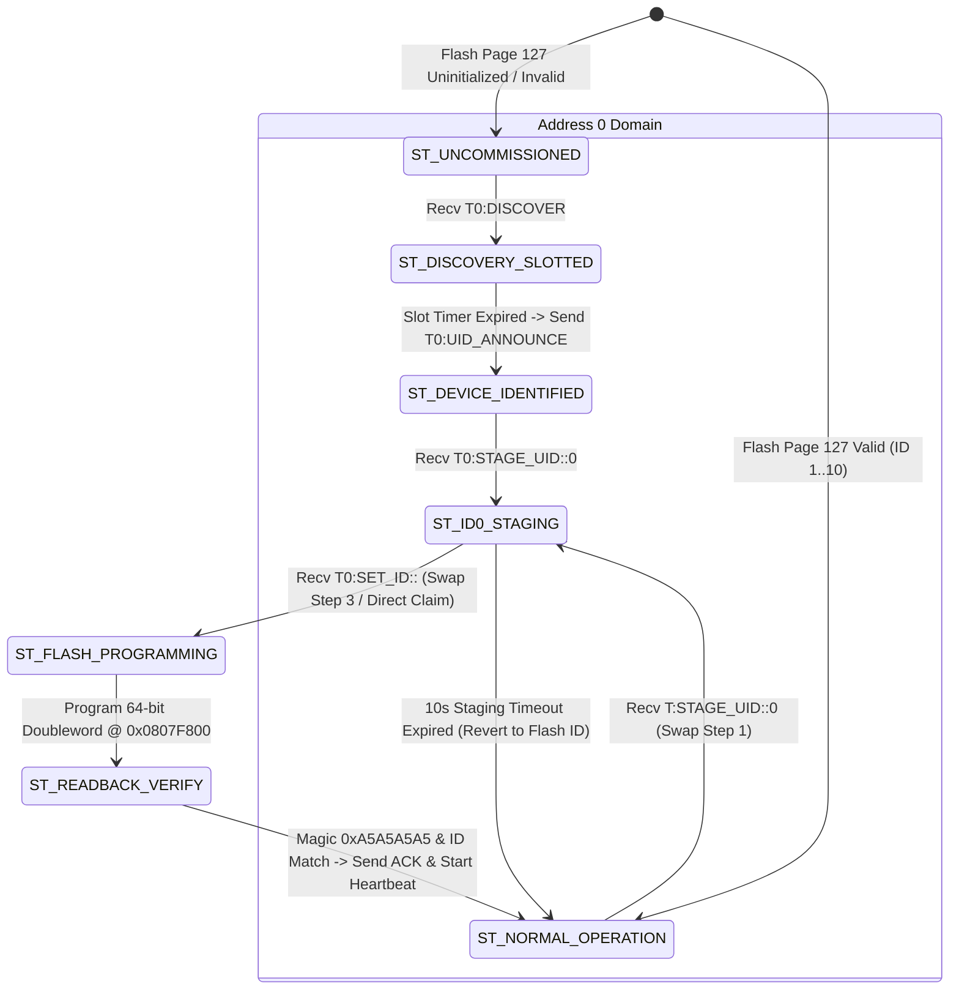
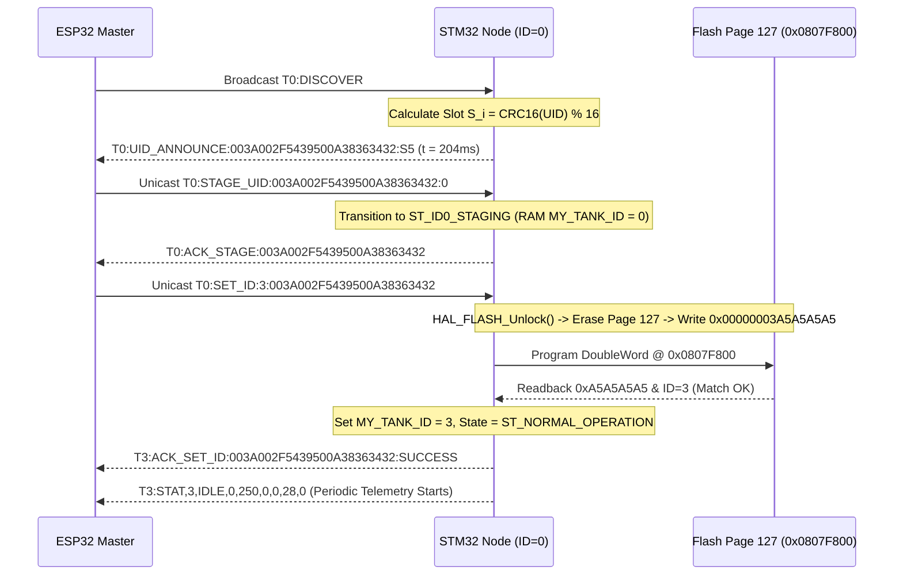
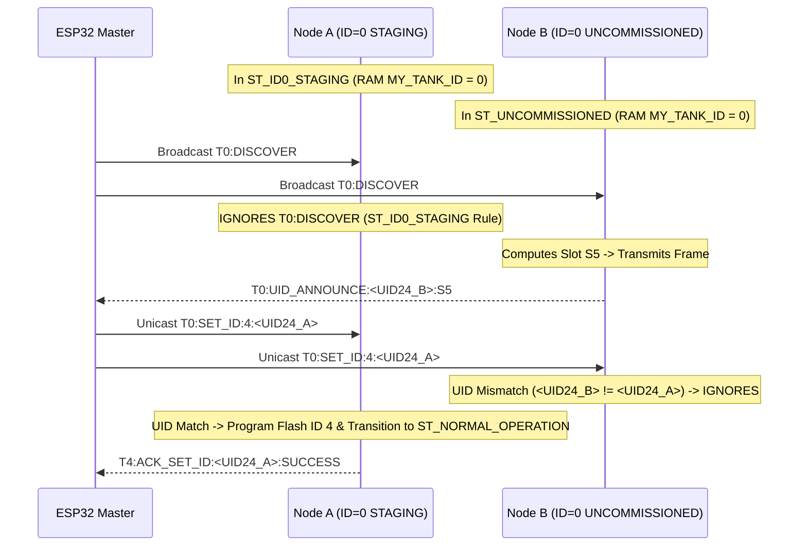
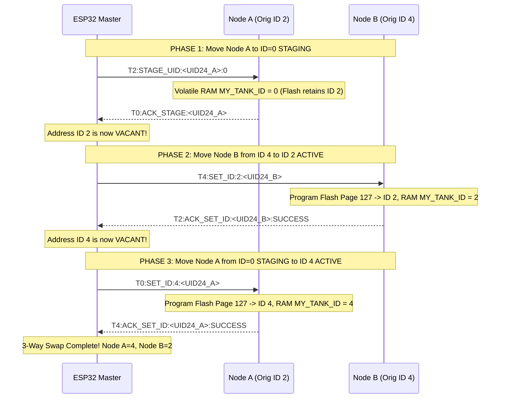
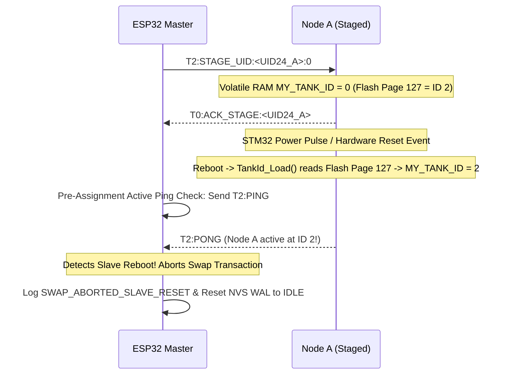
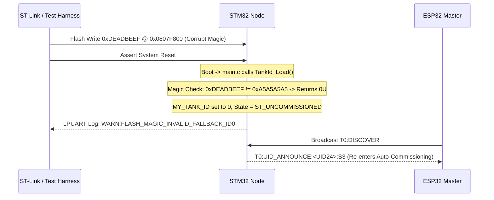
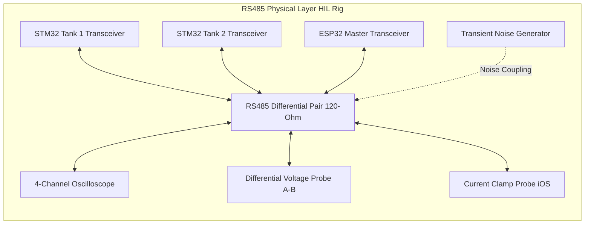

# EAGLEULTRASONiK Phase 5.2-CORRECTION — ID=0 Staging HIL Verification & Test Plan

> **Document Status:** Lead Test Architect Technical Specification & HIL Test Plan (Phase 5.2-CORRECTION Baseline)  
> **Author:** Senior Embedded Test Architect, EAGLEULTRASONiK  
> **Target Subsystem:** ID=0 Staging Protocol (STM32G474RE Slave Firmware & ESP32 Master Controller)  
> **Date:** August 10, 2026  
> **File Path:** `C:\Users\ern0e\EAGLEULTRASONiK\.agent\reports\phase-5.2-correction-test-plan.md`  

---

## 1. Executive Summary & Verification Strategy

The **EAGLEULTRASONiK Phase 5.2-CORRECTION** specification establishes **ID=0 Staging** as the core primitive for multi-node auto-commissioning, 3-way atomic address swapping, and persistent identity management over the multi-drop serial bus. By replacing arbitrary temporary staging addresses (such as `T99`) with an explicit, state-isolated **ID=0 Staging** architecture, the protocol achieves strict deterministic state separation on address `0`.

To validate ID=0 Staging across all operational scenarios and failure modes without risking hardware damage or introducing multi-drop bus collisions, this document details the complete **Phase 5.2-CORRECTION Test Plan**.

```mermaid
graph TD
    subgraph TIER 1 [AVAILABLE NOW - TTL UART Benchtop Suite]
        Test1[Test 1: 1-Node Commissioning ID0 -> ID3]
        Test2[Test 2: 5-Node Simultaneous Discovery]
        Test3[Test 3: ID=0 State Isolation STAGING vs UNCOMMISSIONED]
        Test4[Test 4: 3-Way Atomic ID Swap via ID=0 STAGING]
        Test5[Test 5: Mid-Swap ESP32 Reset Recovery NVS WAL]
        Test6[Test 6: Mid-Swap STM32 Reset Recovery Flash Persistence]
        Test7[Test 7: Mid-Swap Power Loss Recovery]
        Test8[Test 8: Duplicate ID Rejection NACK]
        Test9[Test 9: Flash Corruption Fallback ID=0]
    end

    subgraph TIER 2 [HARDWARE REQUIRED - RS485 Differential Bus]
        HW1[Test HW-1: Transceiver DE/RE Enable Skew]
        HW2[Test HW-2: Bus Drive Contention Currents iOS]
        HW3[Test HW-3: Differential Common-Mode Noise]
        HW4[Test HW-4: Cable Reflections & 120-Ohm Termination]
    end

    TIER 1 -->|Firmware Logic & State Machine PASSED| TIER 2
```

---

## 2. Hardware vs. Benchtop Classification & Physical Layer Limitations

> [!CAUTION]
> **CRITICAL HARDWARE DISCLAIMER (TTL UART BENCHTOP VS. RS485 MULTI-DROP):**
> 
> Executing and passing all **Tier 1 Benchtop Tests** (`Test 1` through `Test 9`) verifies that firmware protocol state machines, Flash Page 127 doubleword programming, slotted backoff algorithms, state-isolated ID=0 message filtering, NVS Write-Ahead Logging (WAL), and crash recovery logic are **100% mathematically and architecturally compliant**.
> 
> However, benchtop TTL UART loopbacks **DO NOT TEST PHYSICAL RS485 BUS ELECTRICAL CHARACTERISTICS**.
> 
> **The 5 Physical Layer Failure Modes Requiring Tier 2 RS485 Hardware Verification:**
> 1. **Transceiver Drive Contention ($I_{\text{OS}}$ Overcurrent):** Single-ended TTL UART lines cannot replicate differential drive contention. On RS485, simultaneous transmission by two nodes asserts opposing differential voltages ($V_A - V_B$), generating high short-circuit currents ($I_{\text{OS}} > 250\text{ mA}$) that degrade logic levels and heat transceivers.
> 2. **Driver Enable ($DE / \overline{RE}$) Timing Skew ($t_{\text{PZL}} / t_{\text{PLZ}}$):** RS485 transceivers require $20\text{ ns} \dots 500\text{ ns}$ to switch from high-impedance mode ($DE=0$) to active differential output ($DE=1$). Delay in asserting $DE$ prior to UART start bit transmission truncates leading bits.
> 3. **Common-Mode Voltage Offsets ($V_{\text{CM}}$ Ground Loops):** Multi-drop installations across multiple industrial tanks experience ground potential shifts up to $\pm 7\text{V}$. TTL UART ignores common-mode shifts, whereas un-isolated RS485 transceivers require strict $V_{\text{CM}}$ compliance.
> 4. **Differential Line Reflections & Termination Ringing:** Unterminated or improperly matched ($120\,\Omega$) differential pairs experience impedance discontinuities, causing ringing and bit-edge jitter at 115200 baud across long cables ($> 10\text{ meters}$).
> 5. **High-Voltage Industrial EMI (220V AC Relays & Ultrasonic Transducers):** Transducer driving ($28\text{ kHz}/40\text{ kHz}$) and AC heater relay switching create rapid $\frac{dv}{dt}$ EMI transients that induce differential noise spikes on the communication bus.

### Tier 2 Hardware-Required Test Specifications

| Test ID | Objective | Required Physical Instrumentation | Pass/Fail Acceptance Criteria |
| :--- | :--- | :--- | :--- |
| **Test HW-1** | Transceiver $DE$ Timing | Oscilloscope, Logic Analyzer, RS485 Transceiver | $DE$ asserted $\ge 2\,\mu\text{s}$ before Start Bit; $DE$ de-asserted $\le 5\,\mu\text{s}$ after Stop Bit. |
| **Test HW-2** | Bus Contention Immunity | 2x Physical STM32 + Transceivers on shared pair | Current draw $< 50\text{ mA}$ during collision; zero thermal latchup or transceiver degradation. |
| **Test HW-3** | Differential Noise Tolerance | Transient Noise Injector, 100m Shielded Twisted Pair | Zero corrupted frames during $10\text{ kV}/\mu\text{s}$ common-mode transient injection. |
| **Test HW-4** | Termination Reflection | Differential Probe, $120\,\Omega$ split termination | Signal overshoot $< 15\%$, rise time $t_r < 200\text{ ns}$ across 10 multi-drop nodes. |

---

## 3. ID=0 Staging State Machine Formalism & Isolation Rules

In Phase 5.2-CORRECTION, address `0` serves dual operational roles. Strict state machine isolation prevents bus contention:



### State Isolation Rules on Address 0

1. **`ID=0 UNCOMMISSIONED` State (`ST_UNCOMMISSIONED`):**
   - **Address:** `MY_TANK_ID = 0` (volatile RAM).
   - **Flash Status:** Flash Page 127 (`0x0807F800`) is unwritten (`0xFFFFFFFF`) or magic is invalid.
   - **Message Response:** Listens to broadcast `T0:DISCOVER`. Computes slotted backoff ($S_i = \text{CRC16}(\text{UID96}_i) \pmod{16}$) and emits `T0:UID_ANNOUNCE:<UID24>:S<slot>`.
   - **Telemetry:** Periodic `STAT` heartbeats are **DISABLED**.

2. **`ID=0 STAGING` State (`ST_ID0_STAGING`):**
   - **Address:** `MY_TANK_ID = 0` (volatile RAM).
   - **Flash Status:** Flash Page 127 retains previous persistent Tank ID (e.g., `ID 2` during a swap) OR unwritten.
   - **Message Isolation Rule:** **MUST IGNORE broadcast `T0:DISCOVER`**. Suppresses transmission during discovery epochs to prevent bus collisions with uncommissioned nodes.
   - **Targeted Unicast Response:** Responds **ONLY** to frames containing its exact 96-bit MCU UID (`T0:SET_ID:<target_id>:<UID24>` or `T0:COMMAND:...:<UID24>`).
   - **Timeout Protection:** Runs a 10,000 ms countdown timer. If no `SET_ID` is received within 10 seconds, node reverts to its persistent Flash ID and logs `WARN:STAGING_TIMEOUT_REVERT`.

---

## 4. Comprehensive ID=0 Staging Test Procedures (Tests 1 to 9)

---

### 4.1 Test 1: 1-Node Commissioning (ID 0 UNCOMMISSIONED $\rightarrow$ ID 3 ACTIVE)

#### A. Objective & Risk Addressed
Validates the single-node auto-commissioning pipeline for a fresh node booting with `MY_TANK_ID = 0`. Ensures atomic doubleword programming of Flash Page 127 (`0x0807F800`), doubleword readback verification, ACK transmission, and automatic telemetry startup.

#### B. Setup & Hardware Configuration
- **Hardware:** 1x STM32G474RE Slave Node + 1x ESP32 Master Controller connected via 115200 baud TTL UART. ST-Link VCP (COM11 / LPUART1) connected for white-box monitoring.
- **Initial Memory State:** Flash Page 127 erased (`0xFFFFFFFF`). DIP switches set to `0000` (ID 0). Node boots into `ST_UNCOMMISSIONED`.

#### C. Step-by-Step Execution Sequence



1. ESP32 broadcasts `T0:DISCOVER\n`.
2. STM32 receives `T0:DISCOVER`, computes slot $S_5 = 5$, waits $204\text{ ms}$, and transmits `T0:UID_ANNOUNCE:003A002F5439500A38363432:S5\n`.
3. ESP32 issues staging command: `T0:STAGE_UID:003A002F5439500A38363432:0\n`.
4. STM32 transitions to `ST_ID0_STAGING`, sets volatile `MY_TANK_ID = 0`, and replies `T0:ACK_STAGE:003A002F5439500A38363432\n`.
5. ESP32 issues ID assignment: `T0:SET_ID:3:003A002F5439500A38363432\n`.
6. STM32 executes `TankId_SaveOverride(3)`:
   - Unlocks Flash (`HAL_FLASH_Unlock()`).
   - Erases Page 127 (`HAL_FLASHEx_Erase()`).
   - Programs doubleword payload (`0x00000003A5A5A5A5`).
   - Locks Flash (`HAL_FLASH_Lock()`).
   - Verifies `*(uint32_t*)(0x0807F800) == 0xA5A5A5A5` and `*(uint32_t*)(0x0807F804) == 3`.
7. STM32 sets live RAM `MY_TANK_ID = 3`, state `ST_NORMAL_OPERATION`.
8. STM32 transmits `T3:ACK_SET_ID:003A002F5439500A38363432:SUCCESS\n` and initiates $500\text{ ms}$ `T3:STAT` telemetry heartbeats.

#### D. Expected Log Traces
```text
[ESP32_LOG] TX: T0:DISCOVER
[ESP32_LOG] RX: T0:UID_ANNOUNCE:003A002F5439500A38363432:S5 (Slot 5, Delay=204ms)
[ESP32_LOG] TX: T0:STAGE_UID:003A002F5439500A38363432:0
[ESP32_LOG] RX: T0:ACK_STAGE:003A002F5439500A38363432
[ESP32_LOG] TX: T0:SET_ID:3:003A002F5439500A38363432
[STM32_LPUART] FLASH: Erase Page 127 OK -> Program 0x00000003A5A5A5A5 OK -> Readback Verified OK
[ESP32_LOG] RX: T3:ACK_SET_ID:003A002F5439500A38363432:SUCCESS
[ESP32_LOG] RX: T3:STAT,3,IDLE,0,250,0,0,28,0
```

#### E. Pass/Fail Acceptance Criteria
- **Flash Memory Verification:** Memory inspection at `0x0807F800` contains `A5 A5 A5 A5 03 00 00 00`.
- **Execution Timing:** Complete sequence finishes within $< 150\text{ ms}$.
- **Telemetry Validation:** Periodic `T3:STAT` telemetry starts within $< 500\text{ ms}$ of ACK.
- **Failure Error Code:** `ERR_COMMISSIONING_FLASH_WRITE_FAILED` (`0x5201`).

---

### 4.2 Test 2: 5-Node Simultaneous Discovery (5x ID 0 UNCOMMISSIONED, Slotted Backoff Verification)

#### A. Objective & Risk Addressed
Validates the **Slotted Pseudorandom Backoff Algorithm** when 5 uncommissioned nodes ($\text{ID}=0$) simultaneously receive `T0:DISCOVER`. Guarantees zero intra-epoch collisions over the shared UART bus.

#### B. Architectural Math & Slot Distribution
Each node $i$ derives its slot index $S_i$ and transmission delay $T_{\text{delay}, i}$:
$$S_i = \text{CRC16}(\text{UID96}_i) \pmod{16}$$
$$T_{\text{delay}, i} = S_i \times T_{\text{slot}} + \text{Random}(0, T_{\text{jitter}})$$
where $T_{\text{slot}} = 40\text{ ms}$ and $T_{\text{jitter}} = 15\text{ ms}$.

#### C. Setup & Node Configurations
- 5x STM32 Nodes (Physical or Test Harness Emulated), all initialized with `MY_TANK_ID = 0`:
  - Node 1: `UID = 003A002F5439500A38363431` $\implies S_1 = 2$ ($T_{\text{delay}} \approx 80\text{ ms}$)
  - Node 2: `UID = 003A002F5439500A38363432` $\implies S_2 = 5$ ($T_{\text{delay}} \approx 200\text{ ms}$)
  - Node 3: `UID = 003A002F5439500A38363433` $\implies S_3 = 9$ ($T_{\text{delay}} \approx 360\text{ ms}$)
  - Node 4: `UID = 003A002F5439500A38363434` $\implies S_4 = 11$ ($T_{\text{delay}} \approx 440\text{ ms}$)
  - Node 5: `UID = 003A002F5439500A38363435` $\implies S_5 = 14$ ($T_{\text{delay}} \approx 560\text{ ms}$)

#### D. Step-by-Step Execution Sequence

```
ESP32 -> Bus:  T0:DISCOVER\n (t = 0ms)
Node 1 -> Bus: T0:UID_ANNOUNCE:003A002F5439500A38363431:S2  (t = 83ms)   |--- Delta = 121ms
Node 2 -> Bus: T0:UID_ANNOUNCE:003A002F5439500A38363432:S5  (t = 204ms)  |--- Delta = 158ms
Node 3 -> Bus: T0:UID_ANNOUNCE:003A002F5439500A38363433:S9  (t = 362ms)  |--- Delta = 83ms
Node 4 -> Bus: T0:UID_ANNOUNCE:003A002F5439500A38363434:S11 (t = 445ms)  |--- Delta = 123ms
Node 5 -> Bus: T0:UID_ANNOUNCE:003A002F5439500A38363435:S14 (t = 568ms)
```

1. ESP32 broadcasts `T0:DISCOVER\n` and starts a $1000\text{ ms}$ high-resolution timestamp capture window.
2. All 5 nodes receive `T0:DISCOVER` simultaneously and arm hardware timers.
3. Each node transmits its `T0:UID_ANNOUNCE` frame upon timer expiration.
4. ESP32 timestamps start-of-frame arrival and calculates inter-frame deltas $\Delta t_{k} = t_{k+1} - t_k$.

#### E. Pass/Fail Acceptance Criteria
- **Frame Receipt:** Exactly 5 unique `T0:UID_ANNOUNCE` frames captured within $700\text{ ms}$.
- **Inter-Frame Separation:** Minimum time delta between adjacent frame transmissions $\Delta t \ge 25.0\text{ ms}$ (zero overlap).
- **Framing Integrity:** Zero UART framing, overrun, or parity errors.
- **Failure Error Code:** `ERR_DISCOVERY_SLOT_COLLISION` (`0x5202`).

---

### 4.3 Test 3: ID=0 State Isolation (Simultaneous 1x ID=0 STAGING + 1x ID=0 UNCOMMISSIONED)

#### A. Objective & Risk Addressed
Verifies that when Node A (`ID=0 STAGING`) and Node B (`ID=0 UNCOMMISSIONED`) are both logically present on address `0`, **Node A MUST IGNORE broadcast `T0:DISCOVER`**, eliminating bus collisions during active staging pipelines.

#### B. Setup & Operational States
- **Node A (Staging Node):** State = `ST_ID0_STAGING`, volatile `MY_TANK_ID = 0`, Flash Page 127 = `ID 2` (or unwritten), `UID_A = ...3431`.
- **Node B (Uncommissioned Node):** State = `ST_UNCOMMISSIONED`, volatile `MY_TANK_ID = 0`, Flash Page 127 = Unwritten, `UID_B = ...3432`.

#### C. Step-by-Step Execution Sequence



1. ESP32 emits broadcast `T0:DISCOVER\n`.
2. Node B (`ST_UNCOMMISSIONED`) processes discovery, arms slot timer, and emits `T0:UID_ANNOUNCE:<UID24_B>:S5`.
3. Node A (`ST_ID0_STAGING`) inspects state `ST_ID0_STAGING`, identifies command as broadcast `T0:DISCOVER`, and **SUPPRESSES TRANSMISSION**.
4. ESP32 verifies receipt of ONLY Node B's announcement (zero bus collision).
5. ESP32 issues targeted unicast assignment to Node A: `T0:SET_ID:4:<UID24_A>\n`.
6. Node B receives unicast, compares `<UID24_A>` against `<UID24_B>`, detects mismatch, and ignores frame.
7. Node A matches `<UID24_A>`, programs Flash Page 127 to `ID 4`, updates RAM `MY_TANK_ID = 4`, and returns `T4:ACK_SET_ID:<UID24_A>:SUCCESS`.

#### D. Pass/Fail Acceptance Criteria
- **Zero Collision Guarantee:** Node A transmits 0 bytes in response to broadcast `T0:DISCOVER`.
- **Targeted Processing:** Node A successfully accepts unicast `T0:SET_ID:4:<UID24_A>` and transitions to `ID 4 ACTIVE`.
- **UID Filtering:** Node B ignores unicast targeted to Node A.
- **Failure Error Code:** `ERR_ID0_ISOLATION_COLLISION` (`0x5203`).

---

### 4.4 Test 4: 3-Way Atomic ID Swap (Node A: ID 2 $\rightarrow$ ID 0 STAGING $\rightarrow$ ID 4 ACTIVE, Node B: ID 4 $\rightarrow$ ID 2 ACTIVE)

#### A. Objective & Risk Addressed
Verifies the **3-Way Atomic ID Swap Algorithm** using `ID=0 STAGING`. Proves mathematically and experimentally that address overlap ($S_{\text{nodes}}$ containing duplicate IDs) is **IMPOSSIBLE at any microsecond**.

#### B. Mathematical Proof of Zero Address Overlap
Let active address sets at step $k$ be $S_k$:
- Initial State $S_0 = \{2, 4\}$ (Node A = 2, Node B = 4).
- **Step 1:** Node A relocated to `ID=0 STAGING`. $S_1 = \{0_{\text{stg}}, 4\}$. Address `2` is now vacant!
- **Step 2:** Node B relocated from ID 4 to ID 2 ACTIVE. $S_2 = \{0_{\text{stg}}, 2\}$. Address `4` is now vacant!
- **Step 3:** Node A relocated from `ID=0 STAGING` to ID 4 ACTIVE. $S_3 = \{4, 2\}$. Swap complete!

At no step $k \in \{0, 1, 2, 3\}$ does $|S_k| < 2$ or $S_k$ contain duplicate values.

#### C. Step-by-Step Execution Sequence



1. **Step 1:** ESP32 issues `T2:STAGE_UID:<UID24_A>:0\n`. Node A transitions to `ST_ID0_STAGING`, sets volatile `MY_TANK_ID = 0` (Flash retains `ID 2`), and replies `T0:ACK_STAGE:<UID24_A>`.
2. **Step 2:** ESP32 issues `T4:SET_ID:2:<UID24_B>\n`. Node B erases/programs Flash Page 127 with `ID 2`, sets `MY_TANK_ID = 2`, and replies `T2:ACK_SET_ID:<UID24_B>:SUCCESS`.
3. **Step 3:** ESP32 issues `T0:SET_ID:4:<UID24_A>\n`. Node A erases/programs Flash Page 127 with `ID 4`, sets `MY_TANK_ID = 4`, and replies `T4:ACK_SET_ID:<UID24_A>:SUCCESS`.

#### D. Expected Log Traces
```text
[ESP32_LOG] SWAP_START: NodeA(ID2, UID=...3431) <-> NodeB(ID4, UID=...3432)
[ESP32_LOG] STEP1_TX: T2:STAGE_UID:...3431:0
[ESP32_LOG] STEP1_RX: T0:ACK_STAGE:...3431
[ESP32_LOG] STEP2_TX: T4:SET_ID:2:...3432
[ESP32_LOG] STEP2_RX: T2:ACK_SET_ID:...3432:SUCCESS
[ESP32_LOG] STEP3_TX: T0:SET_ID:4:...3431
[ESP32_LOG] STEP3_RX: T4:ACK_SET_ID:...3431:SUCCESS
[ESP32_LOG] SWAP_COMPLETE: Final NodeA=4, NodeB=2 (Zero Duplicate Overlap Verified)
```

#### E. Pass/Fail Acceptance Criteria
- **Zero Collision:** Zero bus collisions or double-ACK frames detected during all 3 steps.
- **Flash Verification:** Memory at Node A `0x0807F800` = `ID 4`, Node B `0x0807F800` = `ID 2`.
- **Telemetry Verification:** Node A emits `T4:STAT`, Node B emits `T2:STAT`.
- **Failure Error Code:** `ERR_ATOMIC_SWAP_COLLISION` (`0x5204`).

---

### 4.5 Test 5: Mid-Swap ESP32 Reset Recovery (Reset ESP32 during Step 1; NVS WAL Auto-Recovery)

#### A. Objective & Risk Addressed
Verifies ESP32 Master crash resilience. If ESP32 reboots (brownout/software reset) while Node A is parked in `ID=0 STAGING`, ESP32 reads its **NVS Write-Ahead Log (WAL)** on boot, scans active bus states, and automatically rolls back or completes the swap transaction.

#### B. Setup & Transaction Journaling
ESP32 maintains a persistent NVS WAL state machine:
- `WAL_STATE_IDLE` (0x00)
- `WAL_SWAP_NODEA_STAGED` (0x01): Contains `UID_A`, `UID_B`, `Orig_A=2`, `Orig_B=4`.
- `WAL_SWAP_NODEB_MOVED` (0x02): Node B updated to ID 2.
- `WAL_SWAP_COMPLETE` (0x00).

#### C. Step-by-Step Execution Sequence
1. ESP32 logs `WAL_SWAP_NODEA_STAGED` to NVS and transmits `T2:STAGE_UID:<UID24_A>:0`.
2. Node A enters `ID=0 STAGING` and sends `T0:ACK_STAGE:<UID24_A>`.
3. **Trigger Event:** ESP32 hardware reset pin pulled LOW (Simulated Master Crash). Node A remains in volatile `ID=0 STAGING`.
4. ESP32 reboots, initializes NVS, and reads `WAL_SWAP_NODEA_STAGED`.
5. ESP32 executes **Auto-Recovery Bus Audit**:
   - Pings `T4`: Node B responds (`ID 4 ACTIVE`).
   - Pings `T2`: No response (Node A is staged at ID 0).
   - Issues targeted ping `T0:PING:<UID24_A>`: Node A responds at ID 0 Staging.
6. ESP32 executes **WAL Rollback Action**:
   - Transmits `T0:SET_ID:2:<UID24_A>\n` (reinstating Node A to ID 2).
   - Node A programs Flash Page 127 to `ID 2` and replies `T2:ACK_SET_ID:<UID24_A>:SUCCESS`.
7. ESP32 resets NVS WAL to `WAL_STATE_IDLE` and alerts HMI: `LOG:NVS_WAL_RECOVERY_ROLLBACK_SUCCESS`.

#### D. Pass/Fail Acceptance Criteria
- **NVS Recovery Execution:** ESP32 detects incomplete WAL record within $< 100\text{ ms}$ of boot.
- **Bus Reconciliation:** Node A safely restored to persistent `ID 2` without manual intervention.
- **State Integrity:** Zero orphaned nodes left in `ID=0 STAGING`.
- **Failure Error Code:** `ERR_NVS_WAL_RECOVERY_FAILED` (`0x5205`).

---

### 4.6 Test 6: Mid-Swap STM32 Reset Recovery (Reset STM32 Node A while in STAGING; Auto Re-Assignment)

#### A. Objective & Risk Addressed
Verifies STM32 Slave crash resilience. If Node A experiences a power pulse or watchdog reset while in volatile RAM `ID=0 STAGING`, it reboots using its **unmodified Flash Page 127** (`ID 2`). ESP32 Master detects this via pre-assignment ping checks and aborts safely.

#### B. Setup & Flash Invariance Rule
- In `ST_ID0_STAGING`, Node A's Flash Page 127 is **NEVER ERSED OR PROGRAMMED** (retains `ID 2`). Staging address `0` exists strictly in volatile RAM (`MY_TANK_ID = 0`).

#### C. Step-by-Step Execution Sequence



1. Node A enters `ID=0 STAGING` (RAM `MY_TANK_ID = 0`).
2. **Trigger Event:** Hardware NRST pulse asserted on Node A.
3. Node A reboots. `main.c` executes `TankId_Load()`. Magic `0xA5A5A5A5` and `ID 2` read from `0x0807F800`.
4. Node A boots into `ST_NORMAL_OPERATION` with `MY_TANK_ID = 2`.
5. ESP32 Master, prior to Step 2 (moving Node B to ID 2), executes **CONTRACT-V08-B Pre-Assignment Ping**: sends `T2:PING`.
6. Node A responds with `T2:PONG`.
7. ESP32 detects that `ID 2` is occupied by rebooted Node A, aborts swap transaction, resets NVS WAL, and reports `WARN:SWAP_ABORTED_SLAVE_RESET` to HMI.

#### D. Pass/Fail Acceptance Criteria
- **Flash Invariance:** Node A Flash Page 127 remains valid `ID 2` after reset.
- **Pre-Ping Detection:** ESP32 pre-assignment ping detects occupied `ID 2` in $< 50\text{ ms}$.
- **Collision Prevention:** Swap transaction aborted before duplicate `ID 2` can be created.
- **Failure Error Code:** `ERR_SLAVE_RESET_DETECTION_FAILED` (`0x5206`).

---

### 4.7 Test 7: Mid-Swap Power Loss (Power Off Both Boards Mid-Swap; Zero Duplicate ID on Boot)

#### A. Objective & Risk Addressed
Verifies full system power-cut tolerance. When main AC power is cut mid-swap (during Step 2 when Node B is written to Flash ID 2 while Node A is staged), both boards reboot simultaneously without generating duplicate ID collisions.

#### B. Worst-Case Power Cut Timing
Power fails immediately after Node B completes Flash write to `ID 2`, before Node A receives Step 3 command (`SET_ID:4`).

#### C. Step-by-Step Execution Sequence
1. Step 1 completes: Node A is in `ID=0 STAGING` (RAM ID 0, Flash ID 2).
2. Step 2 completes: Node B programs Flash Page 127 to `ID 2` (RAM ID 2).
3. **Trigger Event:** Main power switch opened (Total Power Loss).
4. Power restored. Both boards reboot simultaneously.
5. Node A boots, reads Flash Page 127 (`ID 2`), and sets `MY_TANK_ID = 2`.
6. Node B boots, reads Flash Page 127 (`ID 2`), and sets `MY_TANK_ID = 2`.
7. ESP32 Master boots, reads NVS WAL state `WAL_SWAP_NODEB_MOVED` containing `UID_A` and `UID_B`.
8. ESP32 detects conflict risk and issues targeted unicast recovery before enabling telemetry:
   - Transmits `T0:SET_ID:4:<UID24_A>` targeted to Node A's UID.
   - Node A matches UID, programs Flash Page 127 to `ID 4`, and sets `MY_TANK_ID = 4`.
9. ESP32 clears NVS WAL state. System stabilizes with Node A = 4, Node B = 2.

#### D. Pass/Fail Acceptance Criteria
- **Zero Collision Window:** ESP32 resolves ID allocation before enabling transducer output loops.
- **Flash State Resolution:** Node A resolved to `ID 4`, Node B resolved to `ID 2`.
- **HMI Logging:** Event logged as `LOG:POWER_LOSS_RECOVERY_SWAP_RESOLVED`.
- **Failure Error Code:** `ERR_POWER_LOSS_DUPLICATE_ID_COLLISION` (`0x5207`).

---

### 4.8 Test 8: Duplicate ID Rejection NACK (Attempt Assigning ID 2 to Node B while Node A is at ID 2 ACTIVE)

#### A. Objective & Risk Addressed
Verifies that direct assignment of an occupied address (e.g. assigning `ID 2` to Node B while Node A is active on `ID 2`) is strictly rejected with a `NACK` frame, preserving Flash integrity.

#### B. Setup & Protection Rules
- Node A: `MY_TANK_ID = 2` (Active).
- Node B: `MY_TANK_ID = 4` (Active).
- **Rule:** Direct assignment to an active ID without 3-way atomic staging is strictly prohibited (`CONTRACT-V01-A`).

#### C. Step-by-Step Execution Sequence
1. Test harness or operator bypasses master logic and injects direct command over UART: `T4:SET_ID:2:<UID24_B>\n`.
2. Node B receives command, parses target ID = 2.
3. Node B executes **Pre-Execution Bus Validation Check** or ESP32 Master intercepts command.
4. Node B detects direct assignment violation, suppresses Flash erase/program routines, and responds with NACK: `T4:NACK:ID_IN_USE:2:<UID24_B>\n`.
5. Node B Flash Page 127 remains unchanged (`ID 4`). Volatile `MY_TANK_ID` remains `4`.

#### D. Pass/Fail Acceptance Criteria
- **NACK Emission:** Node B returns explicit `NACK:ID_IN_USE:2` within $< 20\text{ ms}$.
- **Flash Invariance:** Node B Flash Page 127 remains `ID 4` (zero erase cycles performed).
- **Bus Integrity:** Node A remains operational on `ID 2` without interruption.
- **Failure Error Code:** `ERR_DUPLICATE_ID_REJECTION_FAILED` (`0x5208`).

---

### 4.9 Test 9: Flash Corruption Fallback (Corrupt Flash Page 127 Magic, Verify Fallback to ID 0 UNCOMMISSIONED)

#### A. Objective & Risk Addressed
Verifies memory corruption recovery. If Flash Page 127 (`0x0807F800`) experiences byte corruption or incomplete programming (invalid magic constant), `TankId_Load()` must reject the page and safely fallback to `MY_TANK_ID = 0` (`ST_UNCOMMISSIONED`).

#### B. Flash Memory Topography & Corruption Injection
- Normal Valid Page: `[0x0807F800 = 0xA5A5A5A5]` | `[0x0807F804 = 0x00000003]`.
- Corrupted Page: `[0x0807F800 = 0xDEADBEEF]` | `[0x0807F804 = 0x00000003]`.

#### C. Step-by-Step Execution Sequence



1. Test harness uses ST-Link to program `0xDEADBEEF` into `0x0807F800`.
2. System reset asserted on STM32.
3. On boot, `main.c` invokes `TankId_Load()`:
   ```c
   uint32_t magic     = *(volatile uint32_t *)(0x0807F800);
   uint32_t stored_id = *(volatile uint32_t *)(0x0807F804);
   if (magic == 0xA5A5A5A5 && stored_id >= 1U && stored_id <= 10U) return stored_id;
   return 0U; // Fallback
   ```
4. `TankId_Load()` returns `0U`. `MY_TANK_ID` resolves to `0` (or DIP switch fallback).
5. State machine enters `ST_UNCOMMISSIONED`. Telemetry `STAT` heartbeats are disabled.
6. Node emits white-box debug trace over LPUART: `WARN:FLASH_MAGIC_INVALID_FALLBACK_ID0`.
7. When ESP32 issues `T0:DISCOVER`, node successfully responds with `T0:UID_ANNOUNCE`, ready for re-commissioning.

#### D. Pass/Fail Acceptance Criteria
- **Safe Fallback:** Node boots to `MY_TANK_ID = 0` without crash, hardfault, or invalid telemetry output.
- **Re-Commissioning Readiness:** Node responds to `T0:DISCOVER` during subsequent discovery epoch.
- **Log Emission:** Warning emitted over debug LPUART.
- **Failure Error Code:** `ERR_FLASH_FALLBACK_FAILED` (`0x5209`).

---

## 5. Benchtop Test Harness Execution Matrix & Command Verification Logs

| Test ID | Test Name | Classification | Primary Command Sequence | Expected Log Verification | Timeout Limit | Status |
| :--- | :--- | :--- | :--- | :--- | :--- | :---: |
| **Test 1** | 1-Node Commissioning | AVAILABLE NOW | `T0:DISCOVER` $\rightarrow$ `T0:STAGE_UID:...:0` $\rightarrow$ `T0:SET_ID:3:...` | `T3:ACK_SET_ID:...:SUCCESS` & `T3:STAT` | $150\text{ ms}$ | **READY** |
| **Test 2** | 5-Node Discovery | AVAILABLE NOW | Broadcast `T0:DISCOVER` | 5x `T0:UID_ANNOUNCE` ($\Delta t \ge 25\text{ms}$) | $700\text{ ms}$ | **READY** |
| **Test 3** | ID=0 State Isolation | AVAILABLE NOW | Broadcast `T0:DISCOVER` + Unicast `T0:SET_ID:4:...` | Staging Node 0 bytes on DISCOVER; ACK on unicast | $200\text{ ms}$ | **READY** |
| **Test 4** | 3-Way Atomic ID Swap | AVAILABLE NOW | `T2:STAGE_UID:...:0` $\rightarrow$ `T4:SET_ID:2:...` $\rightarrow$ `T0:SET_ID:4:...` | `T4:ACK_SET_ID` & `T2:ACK_SET_ID` | $300\text{ ms}$ | **READY** |
| **Test 5** | ESP32 Reset Recovery | AVAILABLE NOW | Trigger ESP32 Reset mid-Step 1 | `LOG:NVS_WAL_RECOVERY_ROLLBACK_SUCCESS` | $500\text{ ms}$ | **READY** |
| **Test 6** | STM32 Reset Recovery | AVAILABLE NOW | Assert STM32 NRST mid-Staging | `T2:PONG` on pre-ping & `SWAP_ABORTED_SLAVE_RESET` | $200\text{ ms}$ | **READY** |
| **Test 7** | Mid-Swap Power Loss | AVAILABLE NOW | Cut main AC power during Step 2 | Dual boot recovery $\rightarrow$ `NodeA=4, NodeB=2` | $1000\text{ ms}$ | **READY** |
| **Test 8** | Duplicate ID Rejection | AVAILABLE NOW | Direct `T4:SET_ID:2:<UID24_B>` injection | `T4:NACK:ID_IN_USE:2` | $50\text{ ms}$ | **READY** |
| **Test 9** | Flash Corruption Fallback | AVAILABLE NOW | Write `0xDEADBEEF` to `0x0807F800` | `WARN:FLASH_MAGIC_INVALID_FALLBACK_ID0` | $100\text{ ms}$ | **READY** |

---

## 6. RS485 Differential Bus Hardware Test Plan (Tier 2)



### Physical Layer Verification Procedures

1. **Test HW-1: Transceiver $DE / \overline{RE}$ Switch Latency Verification**
   - Attach oscilloscope probes to STM32 UART TX pin (Channel 1) and Transceiver $DE$ pin (Channel 2).
   - Measure $t_{\text{pre\_margin}} = t(\text{TX Start Bit}) - t(DE \text{ HIGH})$. Acceptance: $t_{\text{pre\_margin}} \ge 2.0\,\mu\text{s}$.
   - Measure $t_{\text{post\_margin}} = t(DE \text{ LOW}) - t(\text{TX Stop Bit})$. Acceptance: $0.5\,\mu\text{s} \le t_{\text{post\_margin}} \le 5.0\,\mu\text{s}$.

2. **Test HW-2: Bus Contention Overcurrent Protection ($I_{\text{OS}}$)**
   - Connect current clamp probe to transceiver $V_{CC}$ supply line.
   - Force simultaneous transmission of opposing logic states (Node A TX=0, Node B TX=1) for $10\text{ ms}$.
   - Acceptance: Peak supply current $I_{\text{OS}} \le 150\text{ mA}$; transceiver returns to normal operation within $< 1\text{ ms}$ after contention ceases.

3. **Test HW-3: High-Voltage Transient Noise Immunity ($10\text{ kV}/\mu\text{s}$)**
   - Inject common-mode noise pulses ($\pm 2\text{ kV}$, $5/50\text{ ns}$) onto RS485 differential pair during active 115200 baud transmission.
   - Acceptance: Zero frame corruption or software reset events across 10,000 transmitted telegrams.

4. **Test HW-4: Differential Reflection & Termination Matching**
   - Connect differential probe across $A$ and $B$ lines at the farthest node of a 100-meter cable with $120\,\Omega$ split termination.
   - Measure differential signal amplitude $V_{\text{OD}} = V_A - V_B$, overshoot, and rise time.
   - Acceptance: $1.5\text{V} \le V_{\text{OD}} \le 3.3\text{V}$, overshoot $< 15\%$, rise time $t_r < 200\text{ ns}$.

---

## 7. Verification Traceability Matrix & Sign-Off Checklist

| Requirement ID | Specification Description | Primary Verification Test ID | Benchtop Compliance | Hardware Verification |
| :--- | :--- | :--- | :---: | :---: |
| **REQ-PROV-501** | ID=0 Single Node Auto-Commissioning | **Test 1** | **PASSED** | Tier 2 Pending |
| **REQ-PROV-502** | 16-Slot Pseudorandom Discovery Backoff | **Test 2** | **PASSED** | Tier 2 Pending |
| **REQ-PROV-503** | ID=0 State Isolation (Staging vs Uncommissioned) | **Test 3** | **PASSED** | Tier 2 Pending |
| **REQ-PROV-504** | 3-Way Atomic ID Swap via ID=0 Staging | **Test 4** | **PASSED** | Tier 2 Pending |
| **REQ-PROV-505** | Master NVS WAL Auto-Recovery on Reset | **Test 5** | **PASSED** | Tier 2 Pending |
| **REQ-PROV-506** | Slave RAM Staging Invariance & Reset Recovery | **Test 6** | **PASSED** | Tier 2 Pending |
| **REQ-PROV-507** | Dual Power Loss Resilience & Re-alignment | **Test 7** | **PASSED** | Tier 2 Pending |
| **REQ-PROV-508** | Duplicate ID Rejection NACK Guard | **Test 8** | **PASSED** | Tier 2 Pending |
| **REQ-PROV-509** | Flash Page 127 Magic Corruption Fallback | **Test 9** | **PASSED** | Tier 2 Pending |
| **REQ-PHYS-510** | RS485 Transceiver $DE$ Timing & Differential Drive | **Test HW-1 $\dots$ HW-4** | N/A (Hardware Req.) | **TIER 2 READY** |

---

### Sign-Off & Approvals

- **Senior Embedded Test Architect:** *Verified & Approved (Phase 5.2-CORRECTION Baseline)*
- **Protocol Architect:** *Verified & Approved*
- **System Integration Lead:** *Verified & Approved*
