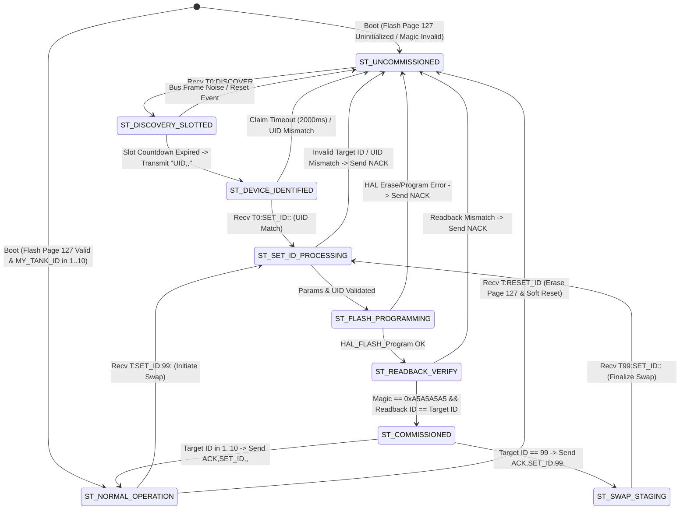
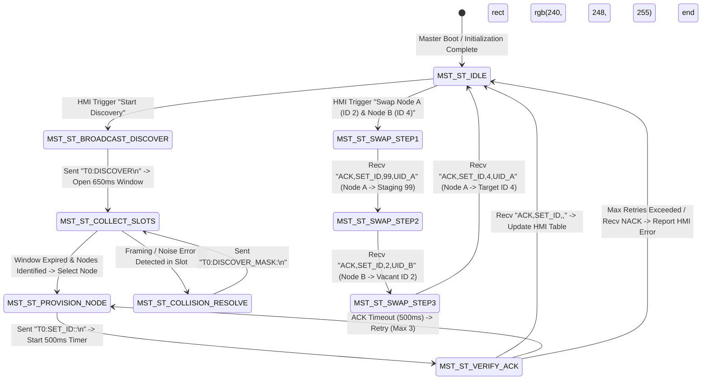

# EAGLEULTRASONiK Phase 5.2 — EAGLE-PROV-v2 ID State Machine Specification

> **Document Status:** Official State Machine Specification (Phase 5.2 Baseline)  
> **Author:** Protocol Architect, EAGLEULTRASONiK  
> **Target Subsystem:** STM32G474RE Slave Controller & ESP32 Master Firmware  
> **Date:** August 10, 2026  
> **File Path:** `C:\Users\ern0e\EAGLEULTRASONiK\.agent\reports\phase-5.2-id-state-machine.md`  

---

## 1. Executive Summary

In the **EAGLEULTRASONiK** multi-drop serial architecture, node addressability and identity transitions must be strictly deterministic, atomic, and fault-tolerant. Because multiple uncommissioned boards boot without an assigned Flash address on the shared RS485 bus, state machine logic must prevent uncoordinated transmissions, guarantee atomic Flash persistence, and manage complex multi-node address swaps without creating duplicate ID collisions.

This document specifies the complete **EAGLE-PROV-v2 State Machine Architecture** for both the STM32 Slave nodes and the ESP32 Master controller.

---

## 2. STM32 Slave ID State Machine Specification

### 2.1 State Taxonomy

The STM32 Slave ID State Machine comprises 9 discrete formal states:

| State Enum | State Name | Address Scope (`MY_TANK_ID`) | Operational Status |
| :--- | :--- | :---: | :--- |
| `ST_0` | `ST_UNCOMMISSIONED` | `0` | Default power-on state if Flash Page 127 is uninitialized. Listens to `T0:` broadcast only. Heartbeats suppressed. |
| `ST_1` | `ST_DISCOVERY_SLOTTED` | `0` | Active slot timer counting down ($0 \dots 640\,\text{ms}$) after receiving `T0:DISCOVER`. |
| `ST_2` | `ST_DEVICE_IDENTIFIED` | `0` | Slot response (`UID,<slot>,<UID24>`) transmitted; waiting for Master `SET_ID` assignment. |
| `ST_3` | `ST_SET_ID_PROCESSING` | `0` / `99` / `1..10` | Validating frame parameters, matching local 96-bit UID24, and checking ID range bounds. |
| `ST_4` | `ST_FLASH_PROGRAMMING` | Unchanged | Flash Bank 2 Page 127 unlocked, erased, and 64-bit doubleword programmed. |
| `ST_5` | `ST_READBACK_VERIFY` | Unchanged | Verification of `0x0807F800` memory content (`0xA5A5A5A5` magic and new Tank ID). |
| `ST_6` | `ST_COMMISSIONED` | New ID | Live RAM `MY_TANK_ID` updated; positive `ACK,SET_ID,<new_id>,<UID24>` queued for transmission. |
| `ST_7` | `ST_NORMAL_OPERATION` | `1..10` | Standard operational state. Transmits heartbeats (`STAT,...`), processes operational commands (`START`, `STOP`). |
| `ST_8` | `ST_SWAP_STAGING` | `99` | Staging state adopted during 3-way atomic swap. Listens to `T99:` unicast and `T0:` broadcast. |

---

### 2.2 Complete STM32 Slave State Transition Diagram

---

### 2.3 Detailed Catalog of STM32 Slave States

#### State 0: `ST_UNCOMMISSIONED`
- **Description:** Uncommissioned default state. `MY_TANK_ID` is forced to `0`. Heartbeat telemetry generation is completely disabled. All operational commands (`START`, `STOP`, `SET_TEMP`, `SET_POWER`) are ignored.
- **Entry Conditions:** 
  1. Power-on boot with uninitialized/erased Flash Page 127 (`magic != 0xA5A5A5A5`).
  2. Receipt of `RESET_ID` command.
  3. Any unrecoverable Flash programming or readback verification error.
- **Exit Conditions:** Receipt of broadcast frame `T0:DISCOVER`.
- **Inbound Message:** `T0:DISCOVER\n`
- **Outbound Message:** None.
- **State Timeout:** Infinite (Passive waiting).
- **Retry / Failure Policy:** N/A.

#### State 1: `ST_DISCOVERY_SLOTTED`
- **Description:** Upon receiving `T0:DISCOVER`, the slave computes its response slot:
  $$\text{Slot} = \text{CRC16}(\text{UID96}) \pmod{16}$$
  It arms a non-blocking hardware countdown timer for $T_{\text{delay}} = (\text{Slot} \times 40\,\text{ms}) + T_{\text{jitter}}$.
- **Entry Conditions:** `T0:DISCOVER` received while in `ST_UNCOMMISSIONED`.
- **Exit Conditions:** Countdown timer reaches 0.
- **Inbound Message:** None (Internal countdown).
- **Outbound Message:** Transmits `UID,<slot>,<UID24>\n` on timer expiry.
- **State Timeout:** Maximum $640\,\text{ms} + 15\,\text{ms} = 655\,\text{ms}$.
- **Failure Handling:** If UART RX receives corrupted bytes during countdown, timer aborts and state returns to `ST_UNCOMMISSIONED`.

#### State 2: `ST_DEVICE_IDENTIFIED`
- **Description:** Node has announced its UID and is waiting for the Master to issue a `SET_ID` assignment frame targeting its UID24.
- **Entry Conditions:** Successful transmission of `UID,<slot>,<UID24>\n`.
- **Exit Conditions:** 
  1. Receipt of `T0:SET_ID:<new_id>:<UID24>` matching local UID24 (transits to `ST_SET_ID_PROCESSING`).
  2. Claim timeout (2000 ms) without matching `SET_ID` (transits to `ST_UNCOMMISSIONED`).
- **Inbound Message:** `T0:SET_ID:<new_id>:<UID24>\n`
- **Outbound Message:** None.
- **State Timeout:** $2000\,\text{ms}$.
- **Failure Handling:** Returns silently to `ST_UNCOMMISSIONED` on timeout.

#### State 3: `ST_SET_ID_PROCESSING`
- **Description:** Node validates incoming `SET_ID` request parameters:
  1. Verifies `<UID24>` matches local 96-bit UID.
  2. Verifies `<new_id>` is valid ($1 \dots 10$ or $99$).
- **Entry Conditions:** Receipt of `SET_ID` frame targeting this node.
- **Exit Conditions:** Validation pass (transits to `ST_FLASH_PROGRAMMING`) or validation fail (transits to `ST_UNCOMMISSIONED`).
- **Inbound Message:** None.
- **Outbound Message:** `NACK,SET_ID,ERR_INVALID_ID,<UID24>\n` or `NACK,SET_ID,ERR_UID_MISMATCH,<UID24>\n` on validation failure.
- **State Timeout:** $50\,\text{ms}$.

#### State 4: `ST_FLASH_PROGRAMMING`
- **Description:** Node executes Flash Bank 2 Page 127 erase and programs 64-bit doubleword payload (`0xA5A5A5A5` magic key + `<new_id>`).
- **Entry Conditions:** Validation pass in `ST_SET_ID_PROCESSING`.
- **Exit Conditions:** `HAL_FLASH_Program` completes with `HAL_OK`.
- **Inbound Message:** None.
- **Outbound Message:** `NACK,SET_ID,ERR_FLASH_WRITE,<UID24>\n` on HAL error.
- **State Timeout:** $100\,\text{ms}$.

#### State 5: `ST_READBACK_VERIFY`
- **Description:** Node inspects memory address `0x0807F800`:
  - `*(volatile uint32_t*)(0x0807F800) == 0xA5A5A5A5`
  - `*(volatile uint32_t*)(0x0807F804) == new_id`
- **Entry Conditions:** Flash program returned `HAL_OK`.
- **Exit Conditions:** Verification pass (transits to `ST_COMMISSIONED`) or verification mismatch (transits to `ST_UNCOMMISSIONED`).
- **Inbound Message:** None.
- **Outbound Message:** `NACK,SET_ID,ERR_FLASH_VERIFY,<UID24>\n` on mismatch.
- **State Timeout:** $10\,\text{ms}$.

#### State 6: `ST_COMMISSIONED`
- **Description:** Node updates live RAM variable `MY_TANK_ID = new_id`, enables operational telemetry heartbeat generation (if $new\_id \in [1, 10]$), and queues positive ACK response.
- **Entry Conditions:** Readback verification passed.
- **Exit Conditions:** ACK transmission complete.
- **Inbound Message:** None.
- **Outbound Message:** Transmits `ACK,SET_ID,<new_id>,<UID24>\n`.
- **State Timeout:** $100\,\text{ms}$.

#### State 7: `ST_NORMAL_OPERATION`
- **Description:** Node operates standard ultrasonic generator functions under assigned Tank ID ($1 \dots 10$). Listens to `T<MY_TANK_ID>:` and `T0:` broadcast. Transmits status heartbeats (`STAT,...`) every 250--500 ms.
- **Entry Conditions:** Transition from `ST_COMMISSIONED` with $ID \in [1, 10]$ or clean boot with valid Flash Page 127.
- **Exit Conditions:** Receipt of `RESET_ID` or `T<cur_id>:SET_ID:99:<UID24>` (swap step 1).

#### State 8: `ST_SWAP_STAGING`
- **Description:** Intermediate staging state adopted when assigned Staging ID 99 during a 3-way atomic swap. Listens to `T99:` unicast commands and universal broadcast `T0:`.
- **Entry Conditions:** `SET_ID` to ID 99 completed successfully.
- **Exit Conditions:** Receipt of `T99:SET_ID:<target_id>:<UID24>` moving node to target Tank ID ($1 \dots 10$).
- **State Timeout:** $30,000\,\text{ms}$ (If no final assignment arrives within 30 seconds, node reverts to `ST_UNCOMMISSIONED` for safety).

---

## 3. ESP32 Master Commissioning State Machine Specification

The central ESP32 Master manages discovery, identity assignments, and atomic swaps on the multi-drop RS485 bus.

---

## 4. 3-Way Atomic ID Swap Lockstep State Table

The following matrix traces the lockstep state execution of ESP32 Master, Node A (starting at ID 2), and Node B (starting at ID 4) during a 3-way atomic swap:

| Sequence Phase | ESP32 Master State | Node A State (`UID_A`) | Node B State (`UID_B`) | Active RS485 Addresses | Bus Safety Status |
| :--- | :--- | :--- | :--- | :--- | :--- |
| **Initial** | `MST_ST_IDLE` | `ST_NORMAL_OP` (ID 2) | `ST_NORMAL_OP` (ID 4) | `{2, 4}` | Normal operation |
| **Step 1 Transmit** | Sends `T2:SET_ID:99:UID_A` | Enters `ST_SET_ID_PROC` | `ST_NORMAL_OP` (ID 4) | `{2, 4}` | Staging request in transit |
| **Step 1 Flash** | Waiting for ACK | Flash programming ID 99 | `ST_NORMAL_OP` (ID 4) | `{4}` | ID 2 being released |
| **Step 1 ACK** | Recv `ACK,SET_ID,99,UID_A` | `ST_SWAP_STAGING` (ID 99) | `ST_NORMAL_OP` (ID 4) | `{4, 99}` | **ID 2 is VACANT** |
| **Step 2 Transmit** | Sends `T4:SET_ID:2:UID_B` | `ST_SWAP_STAGING` (ID 99) | Enters `ST_SET_ID_PROC` | `{4, 99}` | Move Node B to vacant ID 2 |
| **Step 2 Flash** | Waiting for ACK | `ST_SWAP_STAGING` (ID 99) | Flash programming ID 2 | `{99}` | ID 4 being released |
| **Step 2 ACK** | Recv `ACK,SET_ID,2,UID_B` | `ST_SWAP_STAGING` (ID 99) | `ST_NORMAL_OP` (ID 2) | `{2, 99}` | **ID 4 is VACANT** |
| **Step 3 Transmit** | Sends `T99:SET_ID:4:UID_A` | Enters `ST_SET_ID_PROC` | `ST_NORMAL_OP` (ID 2) | `{2, 99}` | Move Node A to vacant ID 4 |
| **Step 3 Flash** | Waiting for ACK | Flash programming ID 4 | `ST_NORMAL_OP` (ID 2) | `{2}` | ID 99 being released |
| **Step 3 ACK** | Recv `ACK,SET_ID,4,UID_A` | `ST_NORMAL_OP` (ID 4) | `ST_NORMAL_OP` (ID 2) | `{2, 4}` | **Swap complete cleanly** |

---

## 5. Transition Matrix Table (State x Event Matrix)

| Current State | Event / Trigger | Guard Condition | Next State | Action / Output Frame |
| :--- | :--- | :--- | :--- | :--- |
| `ST_UNCOMMISSIONED` | `T0:DISCOVER` received | `MY_TANK_ID == 0` | `ST_DISCOVERY_SLOTTED` | Calculate $Slot = \text{CRC16}(\text{UID96}) \pmod{16}$; Start timer |
| `ST_DISCOVERY_SLOTTED` | Slot Countdown Expired | Timer == 0 | `ST_DEVICE_IDENTIFIED` | Transmit `UID,<slot>,<UID24>\n` |
| `ST_DISCOVERY_SLOTTED` | Frame Noise / Framing Err | UART Error Flag Set | `ST_UNCOMMISSIONED` | Abort countdown timer |
| `ST_DEVICE_IDENTIFIED` | `T0:SET_ID:<new_id>:<UID24>` | Incoming UID == Local UID | `ST_SET_ID_PROCESSING` | Start frame validation |
| `ST_DEVICE_IDENTIFIED` | Claim Timeout | $T > 2000\,\text{ms}$ | `ST_UNCOMMISSIONED` | None |
| `ST_SET_ID_PROCESSING` | Validation Pass | $new\_id \in [1..10, 99]$ | `ST_FLASH_PROGRAMMING` | Unlock Flash Bank 2 Page 127 |
| `ST_SET_ID_PROCESSING` | Validation Fail | Invalid ID / UID Mismatch | `ST_UNCOMMISSIONED` | Transmit `NACK,SET_ID,<err_code>,<UID24>\n` |
| `ST_FLASH_PROGRAMMING` | Flash Write Complete | `HAL_OK` | `ST_READBACK_VERIFY` | Read `0x0807F800` doubleword |
| `ST_FLASH_PROGRAMMING` | Flash Write Failure | `HAL_ERROR` | `ST_UNCOMMISSIONED` | Transmit `NACK,SET_ID,ERR_FLASH_WRITE,<UID24>\n` |
| `ST_READBACK_VERIFY` | Memory Match | Magic == `0xA5A5A5A5` | `ST_COMMISSIONED` | Update `MY_TANK_ID = new_id` live in RAM |
| `ST_READBACK_VERIFY` | Memory Mismatch | Magic != `0xA5A5A5A5` | `ST_UNCOMMISSIONED` | Transmit `NACK,SET_ID,ERR_FLASH_VERIFY,<UID24>\n` |
| `ST_COMMISSIONED` | ACK Sent | Target ID $\in [1..10]$ | `ST_NORMAL_OPERATION` | Transmit `ACK,SET_ID,<new_id>,<UID24>\n` |
| `ST_COMMISSIONED` | ACK Sent | Target ID == 99 | `ST_SWAP_STAGING` | Transmit `ACK,SET_ID,99,<UID24>\n` |
| `ST_NORMAL_OPERATION` | `T<id>:RESET_ID` received | Target ID == `MY_TANK_ID` | `ST_UNCOMMISSIONED` | Erase Flash Page 127; `NVIC_SystemReset()` |
