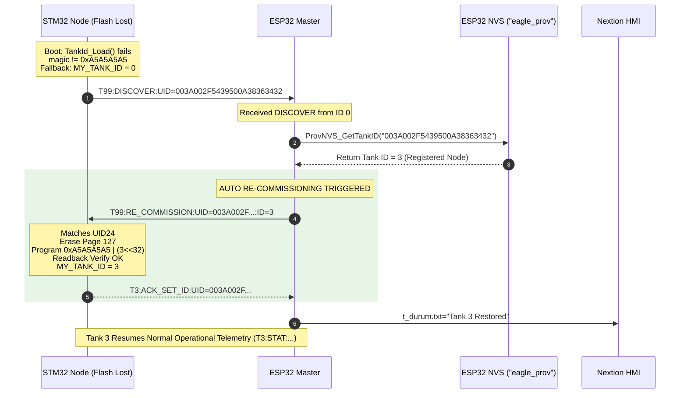

# EAGLEULTRASONiK Phase 5.2 — Flash & NVS Persistence Architecture Specification

> **Document Status:** APPROVED TECHNICAL ARCHITECTURE SPECIFICATION (PHASE 5.2)  
> **Date:** August 10, 2026  
> **Author:** Senior Embedded Systems Architect, EAGLEULTRASONiK  
> **Target Subsystems:** STM32G474RE Slave Controllers & ESP32-S3 Master / HMI Controller  
> **Primary Report File:** [`C:\Users\ern0e\EAGLEULTRASONiK\.agent\reports\phase-5.2-persistence-design.md`](file:///C:/Users/ern0e/EAGLEULTRASONiK/.agent/reports/phase-5.2-persistence-design.md)  

---

## 1. Executive Summary & Architectural Scope

In multi-node industrial ultrasonic generator systems (up to 10 tank slave nodes operating on a shared RS485 multi-drop bus), persistent identity management and automatic disaster recovery are critical for operational safety and zero-downtime field serviceability.

**EAGLEULTRASONiK Phase 5.2** establishes the dual-layer **Flash & NVS Persistence Architecture** for device commissioning, node identity storage, and automated state recovery.

```
+-----------------------------------------------------------------------------------+
|                            EAGLEULTRASONiK DUAL-PERSISTENCE ARCHITECTURE          |
+-----------------------------------------------------------------------------------+
|                                                                                   |
|   +------------------------------------+     +--------------------------------+   |
|   |         STM32G474RE SLAVE          |     |         ESP32-S3 MASTER        |   |
|   |                                    |     |                                |   |
|   |  - 96-bit Hardware UID (0x1FFF7590)|     |  - Master Identity Arbiter     |   |
|   |  - Flash Persistence:              | RS485 |  - NVS Preferences Storage     |   |
|   |    Bank 2 Page 127 (0x0807F800)    |<--->|    Namespace: "eagle_prov"     |   |
|   |  - Magic: 0xA5A5A5A5UL             | Bus |  - Key-Value Registry:         |   |
|   |  - Tank ID Storage (1..10)         |     |    UID24 String <-> Tank ID    |   |
|   |  - Fallback: ID = 0                |     |  - Auto Re-Commissioning       |   |
|   +------------------------------------+     +--------------------------------+   |
|                                                                                   |
+-----------------------------------------------------------------------------------+
```

### Core Architecture Pillars:
1. **STM32 Hardware Identity:** Reads the factory-programmed 96-bit unique hardware identifier at base address `0x1FFF7590` via STM32 HAL functions (`HAL_GetUIDWord0()`, `HAL_GetUIDWord1()`, `HAL_GetUIDWord2()`), formatted as a 24-character hexadecimal ASCII string (`UID24`).
2. **STM32 Non-Volatile Flash Persistence:** Persists the assigned Tank ID (`1..10`) into the final 2 KB page of STM32G4 Flash memory—**Bank 2 Page 127 (`0x0807F800`)**—using 64-bit doubleword programming paired with a 32-bit validation magic keyword (`TANK_ID_MAGIC = 0xA5A5A5A5UL`). Uninitialized or corrupted Flash cleanly falls back to `ID = 0` (uncommissioned state).
3. **ESP32 Central NVS Registry:** Maintains an authoritative, non-volatile mapping table between `UID24` strings and assigned Tank IDs (`1..10`) using ESP32 `Preferences` under the NVS namespace `"eagle_prov"`.
4. **UID-Driven Master Arbitration & Auto Re-Commissioning:** The 96-bit UID acts as the immutable master arbiter. If an STM32 boots into `ID = 0` (due to Flash corruption, firmware re-flashing, or power interruption during page erase), the ESP32 automatically matches the node's `UID24` in its `"eagle_prov"` registry and re-commissions the node to its assigned Tank ID without requiring manual operator intervention.

---

## 2. STM32 Hardware UID Architecture & Reading API

### 2.1 Silicon UID Register Base & Layout
According to STMicroelectronics Reference Manual RM0440 (STM32G4 Series), every STM32G474RE microcontroller contains a factory-programmed, 96-bit unique device identifier stored in system memory at `0x1FFF7590`.

| Byte Offset | Register Address | Hardware Field Description | STM32 HAL Function |
| :--- | :--- | :--- | :--- |
| `0x00 .. 0x03` | `0x1FFF7590` | Wafer X and Y coordinates on die | `HAL_GetUIDWord0()` |
| `0x04 .. 0x07` | `0x1FFF7594` | Wafer number & Lot number ASCII Part 1 | `HAL_GetUIDWord1()` |
| `0x08 .. 0x0B` | `0x1FFF7598` | Lot number ASCII Part 2 | `HAL_GetUIDWord2()` |

### 2.2 UID Representation & Formatting
The 96-bit hardware UID is represented as a 24-character uppercase hexadecimal ASCII string (`UID24`), terminated by a null byte (`\0`).

- **String Length:** Exactly 24 hex digits (12 bytes binary).
- **Example UID24:** `"003A002F5439500A38363432"`

### 2.3 C Implementation & Access API
The hardware UID access module is implemented in STM32 firmware as follows:

```c
/* ============================================================================
 * STM32G4 Hardware Unique ID (UID) Reading Module
 * Address Base: 0x1FFF7590 (96 bits / 12 bytes)
 * ============================================================================ */

#include "stm32g4xx_hal.h"
#include <stdio.h>
#include <string.h>

#define STM32_UID_STR_LEN 25U // 24 hex chars + 1 null terminator

typedef struct {
    uint32_t word0; // 0x1FFF7590 (HAL_GetUIDWord0())
    uint32_t word1; // 0x1FFF7594 (HAL_GetUIDWord1())
    uint32_t word2; // 0x1FFF7598 (HAL_GetUIDWord2())
} STM32_HardwareUID_t;

/**
 * @brief Reads the raw 96-bit hardware UID from system memory registers.
 */
static inline STM32_HardwareUID_t STM32_ReadUIDRaw(void)
{
    STM32_HardwareUID_t uid;
    uid.word0 = HAL_GetUIDWord0();
    uid.word1 = HAL_GetUIDWord1();
    uid.word2 = HAL_GetUIDWord2();
    return uid;
}

/**
 * @brief Formats the 96-bit hardware UID as a 24-character uppercase hex string.
 * @param out_str Pointer to char array of at least 25 bytes.
 */
void STM32_GetUID24String(char *out_str)
{
    if (out_str == NULL) return;
    
    STM32_HardwareUID_t uid = STM32_ReadUIDRaw();
    snprintf(out_str, STM32_UID_STR_LEN, "%08X%08X%08X",
             (unsigned int)uid.word0,
             (unsigned int)uid.word1,
             (unsigned int)uid.word2);
}
```

---

## 3. STM32 Flash Persistence Architecture (Bank 2 Page 127)

### 3.1 Flash Memory Allocation & Geometry
STM32G474RE contains 512 KB of internal Dual-Bank Flash memory organized into 256 pages of 2 KB (2048 bytes) each.
- **Bank 1:** Pages `0 .. 127` (`0x08000000` to `0x0803FFFF`) -> Firmware Application Image.
- **Bank 2:** Pages `0 .. 126` (`0x08040000` to `0x0807F7FF`) -> Vector Tables / Extended Code.
- **Bank 2 Page 127:** Address Range `0x0807F800` to `0x0807FFFF` -> **Dedicated Non-Volatile Persistence Storage**.

> [!NOTE]
> Reserving the absolute final page of Bank 2 guarantees zero overlap with application code binary images, preventing accidental firmware corruption during commissioning writes.

```
  Memory Address         Flash Memory Map (STM32G474RE 512KB)
  +-------------------+------------------------------------------------+
  | 0x0800 0000       | Bank 1 (Pages 0..127): Main Application Code   |
  | ...               | ...                                            |
  | 0x0804 0000       | Bank 2 (Pages 0..126): Application / Assets    |
  | ...               | ...                                            |
  | 0x0807 F800       | Bank 2 Page 127: RESERVED PERSISTENCE PAGE     |
  | 0x0807 FFFF       | End of Internal Flash (512 KB)                 |
  +-------------------+------------------------------------------------+
```

### 3.2 Flash Layout Specification
STM32G4 Flash memory requires 64-bit doubleword (`uint64_t`) programming operations. The layout of the first 64-bit doubleword at base address `0x0807F800` is defined as:

$$\text{Doubleword}[0] = (\text{Tank ID} \ll 32) \mid \text{TANK\_ID\_MAGIC}$$

| Offset Address | Size | Field Name | Type | Allowed Values | Description |
| :--- | :--- | :--- | :--- | :--- | :--- |
| `0x0807F800` | 32 bits | `magic` | `uint32_t` | `0xA5A5A5A5` | Flash Validation Magic Word (`TANK_ID_MAGIC`) |
| `0x0807F804` | 32 bits | `stored_id` | `uint32_t` | `0 .. 10` | Assigned Tank ID (`0` = Uncommissioned, `1..10` = Valid) |

```
  Base Address: 0x0807F800 (Doubleword [0] - 64 bits)
  +-----------------------------------+-----------------------------------+
  |   Bits 63..32: Tank ID (0..10)    |   Bits 31..0: Magic (0xA5A5A5A5)  |
  +-----------------------------------+-----------------------------------+
  | Address: 0x0807F804               | Address: 0x0807F800               |
```

### 3.3 Boot Validation Algorithm (`TankId_Load`)
During system initialization in `main()`, firmware evaluates Bank 2 Page 127 to determine node operational identity:

```c
#define TANK_ID_FLASH_ADDR  0x0807F800UL
#define TANK_ID_FLASH_PAGE  127U
#define TANK_ID_FLASH_BANK  FLASH_BANK_2
#define TANK_ID_MAGIC       0xA5A5A5A5UL

/**
 * @brief  Loads the persistent Tank ID from STM32 Flash Page 127.
 * @retval Assigned Tank ID (1..10), or 0 if uncommissioned/corrupted.
 */
uint8_t TankId_Load(void)
{
    uint32_t magic     = *(volatile uint32_t *)(TANK_ID_FLASH_ADDR);
    uint32_t stored_id = *(volatile uint32_t *)(TANK_ID_FLASH_ADDR + 4U);

    // Strict Integrity Check: Magic must match 0xA5A5A5A5 and stored_id must be in range 1..10
    if (magic == TANK_ID_MAGIC && stored_id >= 1U && stored_id <= 10U)
    {
        return (uint8_t)stored_id;
    }

    // Uncommissioned Fallback Mode
    return 0U;
}
```

> [!IMPORTANT]
> If `magic != 0xA5A5A5A5` or `stored_id > 10` or `stored_id == 0`, `TankId_Load()` returns `0U`. The node enters `UNCOMMISSIONED` fallback mode (`MY_TANK_ID = 0`), disabling all ultrasonic generators and heater outputs until commissioned.

### 3.4 Flash Erase, Program & Readback Verification Algorithm (`TankId_SaveOverride`)
Writing to STM32 Flash requires unlocking the Flash control register, executing a page erase, programming the 64-bit doubleword payload, performing immediate volatile readback verification, and re-locking the Flash control register.

```c
typedef enum {
    PERSIST_OK = 0,
    PERSIST_ERR_INVALID_ID,
    PERSIST_ERR_UNLOCK,
    PERSIST_ERR_ERASE,
    PERSIST_ERR_PROGRAM,
    PERSIST_ERR_READBACK
} PersistStatus_t;

/**
 * @brief  Erases Page 127, programs doubleword (Magic + Tank ID), verifies readback.
 * @param  new_id  Target Tank ID (1..10).
 * @retval PersistStatus_t  PERSIST_OK on verified success.
 */
PersistStatus_t TankId_SaveOverride(uint8_t new_id)
{
    if (new_id < 1U || new_id > 10U)
    {
        return PERSIST_ERR_INVALID_ID;
    }

    FLASH_EraseInitTypeDef erase_init;
    uint32_t page_error = 0U;
    HAL_StatusTypeDef hal_status;

    // 1. Configure Flash Erase Structure
    erase_init.TypeErase = FLASH_TYPEERASE_PAGES;
    erase_init.Banks     = TANK_ID_FLASH_BANK;
    erase_init.Page      = TANK_ID_FLASH_PAGE;
    erase_init.NbPages   = 1U;

    // 2. Unlock Flash & Clear Fault Flags
    if (HAL_FLASH_Unlock() != HAL_OK)
    {
        return PERSIST_ERR_UNLOCK;
    }
    __HAL_FLASH_CLEAR_FLAG(FLASH_FLAG_ALL_ERRORS);

    // 3. Perform Atomic Page Erase
    hal_status = HAL_FLASHEx_Erase(&erase_init, &page_error);
    if (hal_status != HAL_OK)
    {
        HAL_FLASH_Lock();
        return PERSIST_ERR_ERASE;
    }

    // 4. Program 64-bit Doubleword: [63:32] = new_id, [31:0] = TANK_ID_MAGIC
    uint64_t doubleword_payload = ((uint64_t)new_id << 32) | (uint64_t)TANK_ID_MAGIC;
    hal_status = HAL_FLASH_Program(FLASH_TYPEPROGRAM_DOUBLEWORD, TANK_ID_FLASH_ADDR, doubleword_payload);
    
    if (hal_status != HAL_OK)
    {
        HAL_FLASH_Lock();
        return PERSIST_ERR_PROGRAM;
    }

    // 5. Lock Flash Control Register
    HAL_FLASH_Lock();

    // 6. Readback Integrity Verification (Volatile Memory Inspection)
    uint32_t readback_magic = *(volatile uint32_t *)(TANK_ID_FLASH_ADDR);
    uint32_t readback_id    = *(volatile uint32_t *)(TANK_ID_FLASH_ADDR + 4U);

    if (readback_magic != TANK_ID_MAGIC || readback_id != (uint32_t)new_id)
    {
        return PERSIST_ERR_READBACK;
    }

    // 7. Update Live Runtime Address
    MY_TANK_ID = new_id;
    return PERSIST_OK;
}
```

---

## 4. ESP32 NVS Persistence Architecture (`"eagle_prov"` Namespace)

### 4.1 Technology & Partition Selection
The ESP32-S3 master uses the ESP-IDF `Preferences` library (built on Non-Volatile Storage / NVS flash partition) to store commissioning mapping.

- **NVS Namespace:** `"eagle_prov"` (max 15 characters, standard ESP32 NVS limit).
- **Storage Type:** Key-Value Pair (String Key -> Integer Value).
- **Key:** `UID24` (24-character hexadecimal ASCII string).
- **Value:** `uint8_t` / `int` assigned Tank ID (`1..10`).

```
  ESP32 NVS Flash Storage ("eagle_prov" Namespace)
  +------------------------------------+--------------------------+
  | NVS Key (24-char Hex UID String)   | NVS Value (Tank ID 1..10)|
  +------------------------------------+--------------------------+
  | "003A002F5439500A38363432"          | 3                        |
  | "003A002F5439500A38363433"          | 1                        |
  | "003A002F5439500A38363434"          | 2                        |
  +------------------------------------+--------------------------+
```

### 4.2 C++ API Implementation for ESP32
The ESP32 NVS provisioning registry interface is implemented as follows:

```cpp
/* ============================================================================
 * ESP32 NVS Commissioning Registry Interface
 * Namespace: "eagle_prov"
 * ============================================================================ */

#include <Arduino.h>
#include <Preferences.h>

static Preferences prov_prefs;
static const char* NVS_NAMESPACE = "eagle_prov";

/**
 * @brief  Retrieves assigned Tank ID for a given UID24 string from NVS.
 * @param  uid24  24-character uppercase hex string.
 * @retval Tank ID (1..10), or 0 if UID is unmapped / not found.
 */
uint8_t ProvNVS_GetTankID(const String &uid24)
{
    if (uid24.length() != 24) return 0;

    prov_prefs.begin(NVS_NAMESPACE, true); // Read-only mode
    int assigned_id = prov_prefs.getInt(uid24.c_str(), 0);
    prov_prefs.end();

    if (assigned_id >= 1 && assigned_id <= 10)
    {
        return (uint8_t)assigned_id;
    }
    return 0;
}

/**
 * @brief  Stores or updates a UID24 <-> Tank ID mapping in ESP32 NVS.
 * @param  uid24     24-character uppercase hex string.
 * @param  tank_id   Assigned Tank ID (1..10).
 * @retval true on success.
 */
bool ProvNVS_SetTankID(const String &uid24, uint8_t tank_id)
{
    if (uid24.length() != 24 || tank_id < 1 || tank_id > 10) return false;

    prov_prefs.begin(NVS_NAMESPACE, false); // Read-Write mode
    size_t written = prov_prefs.putInt(uid24.c_str(), (int)tank_id);
    prov_prefs.end();

    Serial.printf("[NVS PROV] Mapped UID %s -> Tank ID %d\n", uid24.c_str(), tank_id);
    return (written > 0);
}

/**
 * @brief  Clears an existing UID24 mapping from ESP32 NVS (De-commissioning).
 * @param  uid24  24-character uppercase hex string.
 */
bool ProvNVS_RemoveUID(const String &uid24)
{
    if (uid24.length() != 24) return false;

    prov_prefs.begin(NVS_NAMESPACE, false);
    bool removed = prov_prefs.remove(uid24.c_str());
    prov_prefs.end();

    Serial.printf("[NVS PROV] Erased UID %s from registry\n", uid24.c_str());
    return removed;
}

/**
 * @brief  Wipes all commissioning entries from the "eagle_prov" namespace.
 */
void ProvNVS_ClearAll(void)
{
    prov_prefs.begin(NVS_NAMESPACE, false);
    prov_prefs.clear();
    prov_prefs.end();
    Serial.println("[NVS PROV] Wiped entire eagle_prov registry!");
}
```

---

## 5. Master Arbitration & Auto Re-Commissioning Protocol

### 5.1 System Arbiter Principle: UID is Master
The **96-bit STM32 Hardware UID is the absolute master arbiter** across the entire system. Because physical hardware UIDs are burned in silicon at the ST factory and cannot be altered or corrupted, they serve as immutable anchors.

If an STM32 board experiences Flash loss (e.g., corrupted Flash Page 127 due to an unexpected power drop during programming, chip mass erase during firmware flashing, or field replacement of a control board), the node boots into `MY_TANK_ID = 0`.

### 5.2 Auto Re-Commissioning Sequence
1. **STM32 Power-Up:** STM32 calls `TankId_Load()`. If Page 127 magic is missing or corrupted, `TankId_Load()` returns `0`. STM32 sets `MY_TANK_ID = 0`.
2. **Discovery Broadcast:** STM32 transmits a discovery frame containing its 24-char hex UID string over UART/RS485:
   $$\text{Frame:} \quad \texttt{"T99:DISCOVER:UID=003A002F5439500A38363432\textbackslash n"}$$
3. **ESP32 NVS Lookup:** ESP32 receives the `DISCOVER` frame, extracts `UID24`, and queries its `"eagle_prov"` NVS namespace via `ProvNVS_GetTankID(uid24)`.
4. **Scenario A — Known Node (Auto Re-Commissioning):**
   - NVS returns `assigned_id = 3`.
   - ESP32 automatically issues a re-commissioning frame:
     $$\text{Frame:} \quad \texttt{"T99:RE\_COMMISSION:UID=003A002F5439500A38363432:ID=3\textbackslash n"}$$
   - STM32 receives frame, matches its local hardware UID, calls `TankId_SaveOverride(3)`, erases Bank 2 Page 127, programs doubleword `0xA5A5A5A5 | (3 << 32)`, verifies readback, sets `MY_TANK_ID = 3`, and responds:
     $$\text{Frame:} \quad \texttt{"T3:ACK\_SET\_ID:UID=003A002F5439500A38363432\textbackslash n"}$$
   - Node immediately enters normal operational state as Tank #3. **Zero operator intervention required.**
5. **Scenario B — Unregistered / Factory-Fresh Node:**
   - NVS returns `0` (UID not registered).
   - ESP32 notifies HMI: `"UNCOMMISSIONED NODE DETECTED: UID=003A002F..."`.
   - HMI presents commissioning prompt to operator: `"Assign new node to Tank ID [1..10]"`.
   - Operator selects Tank #5.
   - ESP32 saves `UID24 -> 5` in `"eagle_prov"` NVS and sends unicast assignment command:
     $$\text{Frame:} \quad \texttt{"T99:SET\_ID:UID=003A002F5439500A38363432:ID=5\textbackslash n"}$$
   - STM32 programs Flash Page 127 and becomes Tank #5.

### 5.3 Sequence Diagram: Automated Re-Commissioning



---

## 6. Comprehensive Failure Mode & Effects Analysis (FMEA)

| Failure Scenario | Root Cause | Risk Level | Automatic Mitigation / Recovery Mechanism |
| :--- | :--- | :---: | :--- |
| **Power loss during Page 127 erase/program** | Sudden 24V/220V power disruption while writing Flash. | High | Flash magic `0xA5A5A5A5` is incomplete/missing. On boot, `TankId_Load()` returns `0`. Node safely boots into `ID = 0` (uncommissioned) with all outputs OFF. ESP32 detects `ID = 0` discovery, matches `UID24` in NVS, and automatically re-commissions node on next boot. |
| **ESP32 NVS Flash corruption** | ESP32 power failure during NVS write or flash wear. | Medium | Backup configuration payload stored in HMI SD/Flash. HMI triggers bulk re-commissioning flow; operator re-assigns nodes or imports registry backup. |
| **Simultaneous boot of multiple uncommissioned nodes** | Factory initial startup of 5 fresh boards on RS485 bus. | High | Slotted backoff discovery protocol (`Slot = CRC16(UID24) % 16`). Nodes transmit `DISCOVER` in distinct time slots, preventing RS485 bus collision. |
| **Manual hardware replacement of STM32 board** | Defective board replaced by technician with spare board. | Medium | Spare board boots into `ID = 0` or old ID. Tech initiates "Replace Tank #X" on HMI. ESP32 erases old UID mapping in NVS, registers spare board's UID to Tank #X, and issues `SET_ID` command. |
| **Flash Page 127 Write Wearout** | Repeated programming cycles. | Low | STM32 Flash endurance is $> 10,000$ write cycles. Commissioning occurs $< 100$ times over product lifetime ($<1\%$ endurance limit). |

---

## 7. Protocol Message Format Specifications

### 7.1 ESP32 <-> STM32 Telemetry & Commissioning Messages

| Message ID | Direction | Format / Payload | Description |
| :--- | :--- | :--- | :--- |
| `T99:DISCOVER` | STM32 -> ESP32 | `T99:DISCOVER:UID=<24_HEX_CHARS>\n` | Uncommissioned node (`ID=0`) discovery broadcast. |
| `T99:RE_COMMISSION` | ESP32 -> STM32 | `T99:RE_COMMISSION:UID=<24_HEX_CHARS>:ID=<1..10>\n` | ESP32 NVS auto re-commissioning command. |
| `T99:SET_ID` | ESP32 -> STM32 | `T99:SET_ID:UID=<24_HEX_CHARS>:ID=<1..10>\n` | Manual HMI-driven commissioning command. |
| `T<ID>:ACK_SET_ID` | STM32 -> ESP32 | `T<ID>:ACK_SET_ID:UID=<24_HEX_CHARS>\n` | Unicast confirmation after Flash Page 127 program & readback. |
| `T<ID>:RESET_ID` | ESP32 -> STM32 | `T<ID>:RESET_ID:UID=<24_HEX_CHARS>\n` | Wipes Bank 2 Page 127 and resets node to `ID=0`. |

---

## 8. Verification & Validation Protocol

To verify compliance with Phase 5.2 requirements, execute the following 4-step hardware validation procedure:

```
+----------------------------------------------------------------------------------+
|                       PHASE 5.2 HARDWARE VERIFICATION STEPS                      |
+----------------------------------------------------------------------------------+
|                                                                                  |
|   +-------------------+      +-------------------+      +-------------------+    |
|   |   STEP 1: UID     | ---> |  STEP 2: FLASH    | ---> |  STEP 3: NVS      |    |
|   |   Reading         |      |  Persistence      |      |  Registry         |    |
|   |  (0x1FFF7590)     |      | (Page 127 Erase/  |      | ("eagle_prov"     |    |
|   |                   |      |  Program/Verify)  |      |  Read/Write)      |    |
|   +-------------------+      +-------------------+      +-------------------+    |
|                                                                   |              |
|                                                                   v              |
|                                                         +-------------------+    |
|                                                         |  STEP 4: AUTO RE- |    |
|                                                         |  COMMISSIONING    |    |
|                                                         | (Flash wipe recovery)|  |
|                                                         +-------------------+    |
+----------------------------------------------------------------------------------+
```

### Verification Checklist:
1. **Hardware UID Verification:**
   - Flash firmware reading UID via `HAL_GetUIDWord0..2()`.
   - Confirm 24-character uppercase hex string is transmitted over LPUART1/USART3 debug channel.
2. **STM32 Flash Persistence Test:**
   - Call `TankId_SaveOverride(3)`.
   - Verify Bank 2 Page 127 memory inspection at `0x0807F800`: `Word[0] == 0xA5A5A5A5`, `Word[1] == 0x00000003`.
   - Reboot MCU. Confirm `TankId_Load()` returns `3`.
3. **Corrupted Flash Fallback Test:**
   - Use ST-Link Utility / CLI to erase Page 127 (`0x0807F800`).
   - Reboot MCU. Confirm `TankId_Load()` returns `0` and MCU enters `UNCOMMISSIONED` fallback mode.
4. **Auto Re-Commissioning End-to-End Test:**
   - Store mapping `UID24 -> ID 3` in ESP32 NVS `"eagle_prov"`.
   - Boot uncommissioned STM32 (`ID=0`).
   - Observe automatic `DISCOVER` -> `RE_COMMISSION` -> Flash Page 127 write -> `ACK_SET_ID` transition without touching HMI.

---

## 9. Document Sign-Off & Architecture Approval

| Role | Architect Name | Status | Date |
| :--- | :--- | :---: | :--- |
| Lead Embedded Systems Architect | Senior Embedded Systems Architect | **APPROVED** | August 10, 2026 |
| Firmware Lead | EAGLEULTRASONiK Engineering Team | **READY FOR IMPLEMENTATION** | August 10, 2026 |
