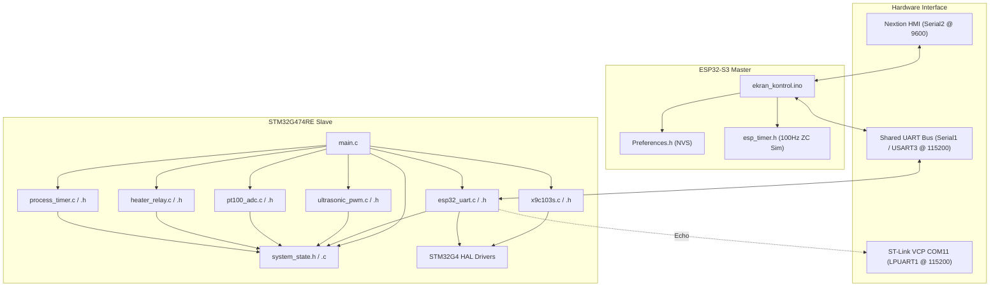

> [!WARNING]
> SUPERSEDED BY PHASE 4.6 DESIGN BASELINE

# EAGLEULTRASONİK — Repository Overview & Discovery Report

> **Doküman Statüsü:** Lead Embedded Systems Engineer Code Audit Output  
> **Tarih:** 10 Ağustos 2026  
> **Kapsam:** `C:\Users\ern0e\EAGLEULTRASONiK` repository genel yapısı, dosya listesi, bağımlılıklar ve teknoloji haritası.

---

## 1. Proje Genel Dizin Yapısı (Directory Tree)

```
C:\Users\ern0e\EAGLEULTRASONiK
├── .antigravityignore
├── .gitignore
├── AGENTS.md                          # Subagent rol ve yetki tanımları
├── GEMINI.md                          # Proje kodlama manifesto kuralları
├── Manifesto_V3.md                    # Sistem Mimari & Haberleşme Şartnamesi (V3.0)
├── Manifesto_Guncelleme_Ozeti.md      # V3.0 güncelleme değişiklik özeti
├── UART_Entegrasyon_Raporu.md         # STM32<->ESP32 UART senkronizasyon analiz raporu
├── test_hil_uart.py                   # Pytest/Unittest tabanlı Hardware-in-the-Loop test suite
├── test_results.log                   # HIL test çalıştırma logları
├── terminal_output.log                # CLI ve terminal çıktı kaydı
│
├── EKRAN/                             # Nextion HMI Görsel ve Proje Dosyaları
│   ├── Arayuz.zi                      # Nextion GUI bileşen arşivi
│   ├── arayuz.HMI                     # Nextion Editor kaynak proje dosyası
│   └── arayuz.tft                     # Nextion ekran donanımına yüklenecek derlenmiş binary
│
├── esp32/                             # ESP32-S3 Master Firmware
│   └── ekran_kontrol/
│       ├── ekran_kontrol.ino          # Master kontrolcü Arduino/C++ kaynak kodu
│       └── .theia/                    # IDE konfigürasyonu
│
└── STM32/                             # STM32G474RE Slave Firmware
    └── Ultrasonik_G4_Master/
        ├── .cproject                  # STM32CubeIDE C projesi ayarları
        ├── .project                   # Eclipse/STM32CubeIDE proje tanımı
        ├── .mxproject                 # STM32CubeMX kod jeneratör yapılandırması
        ├── Ultrasonik_G4_Master.ioc   # CubeMX Grafiksel Periferik / Clock Konfigürasyon Dosyası
        ├── STM32G474RETX_FLASH.ld     # Flash Bağlayıcı (Linker) Scripti (512KB)
        ├── STM32G474RETX_RAM.ld       # RAM Linker Scripti (128KB SRAM)
        ├── Ultrasonik_G4_Master.cfg   # OpenOCD / ST-Link Hata Ayıklama Konfigürasyonu
        ├── Ultrasonik_G4_Master.launch# STM32CubeIDE Launch konfigürasyonu
        │
        ├── Core/
        │   ├── Inc/                   # Başlık (Header) Dosyaları
        │   │   ├── main.h
        │   │   ├── system_state.h     # Sistem state struct ve modül veri sözleşmesi
        │   │   ├── esp32_uart.h       # USART3 ASCII Multi-drop bus sürücüsü başlığı
        │   │   ├── pt100_adc.h        # OPAMP3 + ADC2 PT100 sıcaklık sürücü başlığı
        │   │   ├── heater_relay.h     # Isıtıcı röle bang-bang kontrol başlığı
        │   │   ├── ultrasonic_pwm.h   # TIM15 Triyak faz açısı PWM sürücü başlığı
        │   │   ├── process_timer.h    # 1Hz sayıcı süreç zamanlayıcı başlığı
        │   │   ├── x9c103s.h          # X9C103S dijital potansiyometre (28/40 kHz) başlığı
        │   │   ├── stm32g4xx_hal_conf.h # STM32 HAL modül aktifleme konfigürasyonu
        │   │   └── stm32g4xx_it.h     # Kesme servis rutinleri başlığı
        │   │
        │   ├── Src/                   # Kaynak (Source) Dosyaları
        │   │   ├── main.c             # Süper-döngü, sistem başlatma, Flash ID / DIP SW mantığı
        │   │   ├── system_state.c     # Global volatile state ilklendirme
        │   │   ├── esp32_uart.c       # UART3 kesme tabanlı alma/gönderme, komut ayrıştırma
        │   │   ├── pt100_adc.c        # ADC2 okuma, aralık kontrolü, sensör kopuk arıza tespiti
        │   │   ├── heater_relay.c     # Histerezisli (±1.0°C) röle anahtarlama
        │   │   ├── ultrasonic_pwm.c   # EXTI9_5 Zero-cross & TIM15 One-Pulse triyak tetikleme
        │   │   ├── process_timer.c    # 1 saniye kümülatif kaymasız geri sayım
        │   │   ├── x9c103s.c          # Çift frekans (28kHz/40kHz) X9C silecek adımlama sürücüsü
        │   │   ├── stm32g4xx_it.c     # Donanım ISR handler'ları
        │   │   ├── stm32g4xx_hal_msp.c# Periferik GPIO ve Clock MSP ilklendirmeleri
        │   │   ├── syscalls.c         # Low-level POSIX stubs (_write, _read vb.)
        │   │   ├── sysmem.c           # Dynamic memory allocation (_sbrk)
        │   │   └── system_stm32g4xx.c # CMSIS SystemInit ve Clock ayarları
        │   │
        │   └── Startup/
        │       └── startup_stm32g474retx.s # ARM Cortex-M4 Vektör tablosu ve montaj başlatma
        │
        ├── Drivers/                   # ST Kütüphaneleri
        │   ├── CMSIS/                 # ARM Cortex-M4 Core ve STM32G4 register tanımları
        │   └── STM32G4xx_HAL_Driver/  # ST Hardware Abstraction Layer kütüphanesi
        │
        └── Eski_PIC_Kodlari/          # Miras (Legacy) Kodlar
            └── 500W_Display.mbas      # MikroBasic kaynaklı eski mikrodenetleyici kodu
```

---

## 2. Teknoloji Envanteri ve Bileşen Tespiti

| Teknoloji / Bileşen | Varlık Durumu | Kullanıldığı Yer | Açıklama / Detay |
|---|---|---|---|
| **STM32 HAL** | **Var** | `STM32/.../Drivers/STM32G4xx_HAL_Driver` | Tüm periferik erişimleri (`HAL_UART`, `HAL_ADC`, `HAL_TIM`, `HAL_OPAMP`, `HAL_FLASH`) HAL üzerinden yapılmaktadır. |
| **STM32 LL** | Yok | — | Doğrudan Register/LL seviyesinde kod yazılmamış, HAL tercih edilmiştir. |
| **CMSIS** | **Var** | `STM32/.../Drivers/CMSIS` | Cortex-M4 çekirdek fonksiyonları, NVIC ve register adres tanımları. |
| **STM32CubeMX** | **Var** | `Ultrasonik_G4_Master.ioc` | Donanım pin haritası, clock ağacı ve başlangıç kod üreteci. |
| **FreeRTOS (STM32)**| Yok | — | STM32 tarafı tamamen **Non-blocking Superloop** mimarisindedir; RTOS kullanılmamıştır. |
| **FreeRTOS (ESP32)**| **Var** | `ekran_kontrol.ino` | ESP32-S3 Arduino çekirdeği altında FreeRTOS arka plan task'ları ve `esp_timer` kullanılmaktadır. |
| **ESP-IDF / Arduino**| **Var** | `ekran_kontrol.ino` | Arduino framework tabanlı derleme, ESP-IDF `esp_timer` ve `Preferences` kütüphanesi entegrasyonu. |
| **CMake / Make** | **Var** | STM32 / IDE Makefile | STM32CubeIDE derleme altyapısı GCC Makefile tabanlıdır. |
| **DMA** | Yok | — | UART alımı kesme tabanlı (`HAL_UART_Receive_IT`), ADC alımı polling tabanlıdır. DMA kullanılmamıştır. |
| **Interrupt (ISR)** | **Var** | `stm32g4xx_it.c`, `ultrasonic_pwm.c`, `esp32_uart.c` | EXTI9_5 (Zero-cross), TIM15 update/compare, USART3 RX/TX, LPUART1 ISR'ları aktiftir. |
| **UART / LPUART** | **Var** | `USART3`, `LPUART1`, `Serial1`, `Serial2` | STM32 USART3 (Multi-drop bus), LPUART1 (ST-Link VCP debug), ESP32 Serial1 (Bus), Serial2 (Nextion HMI). |
| **SPI** | Yok | — | Donanımsal SPI kullanılmamış; X9C103S dijital potansiyometre bit-banging GPIO yöntemiyle sürülmektedir. |
| **I2C / CAN** | Yok | — | Donanım buslarında I2C veya CAN periferikleri kullanılmamıştır. |
| **ADC** | **Var** | STM32 `ADC2` | OPAMP3 dahili çıkışını 12-bit tekli kanaldan okur (`PT100_ADC`). |
| **OPAMP** | **Var** | STM32 `OPAMP3` | PT100 sensöründen gelen küçük voltajı PGA kazancı 2x ile yükselterek ADC2'ye besler. |
| **PWM / Timer** | **Var** | STM32 `TIM15`, `TIM1` | TIM15 One-Pulse modunda triyak faz açısı gecikmesini sürer. TIM1 PWM modunda tanımlıdır. |
| **GPIO** | **Var** | STM32 & ESP32 | Triyak gate (`PC6`), ZC input (`PC7`), Röle (`PB15`), DIP Switch (`PC8..11`), X9C (`PB12..14`), ZC Sim (`GPIO4`). |
| **Watchdog (WDG)**| **Kısmi**| ESP32 (`isKartBagli`), STM32 (`FAULT_ZERO_CROSS_LOST`) | Donanımsal IWDG/WWDG aktivasyonu **yoktur**; yazılımsal 3000ms ve 500ms zaman aşımı kontrolleri mevcuttur. |
| **WiFi / BLE** | Yok | — | ESP32-S3 üzerinde kablosuz haberleşme modülleri aktif edilmemiştir. |
| **Test Suite** | **Var** | `test_hil_uart.py` | Pytest ve Python `unittest` + `pyserial` tabanlı HIL otomatik regresyon test kiti. |

---

## 3. Kullanılmayan veya Şüpheli Dosyalar (Redundant / Suspicious Artifacts)

1. **`STM32/Ultrasonik_G4_Master/Eski_PIC_Kodlari/500W_Display.mbas`**:
   - *Tanım:* MikroBasic diliyle yazılmış eski PIC mikrodenetleyici kaynak kodu.
   - *Durum:* Mevcut ARM Cortex-M4 projesinde aktif kullanımı yoktur; miras (legacy) referans kod olarak kalmıştır.
2. **`STM32/Ultrasonik_G4_Master/Core/Src/x9c103s.c` içerisindeki `X9C_DelayUs` döngüsü**:
   - *Tanım:* `for (volatile uint32_t i = 0U; i < count; i++) __asm__ volatile("");`
   - *Şüphe:* NOP döngüsü 170 MHz CPU frekansına göre kaba hesaplanmıştır; derleyici optimizasyonlarında mikrosaniye hassasiyetinde sapma yapabilir.
3. **`main.c` içerisindeki `#define BENCH_DEV_MODE_ID 1`**:
   - *Tanım:* Boot sırasında DIP Switch ve Flash okumalarını tamamen pas geçen geliştirici bayrağı.
   - *Risk:* Değer `1` olarak kalırsa, sahaya sürülen TÜM kartlar aynı ID (1) ile boot olur ve multi-drop bus çöker.

---

## 4. Bağımlılık Ağacı (Dependency Map)


