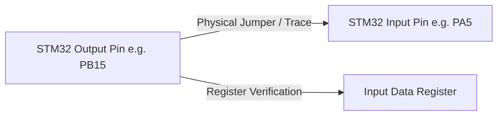

# EAGLEULTRASONİK — Self-Test ve Teşhis Mimarisi (Self-Test Architecture)

> **Doküman Statüsü:** Engineering Self-Test & Diagnostic Architecture Specification  
> **Tarih:** 10 Ağustos 2026  
> **Sistem Sürümü:** Phase 4.7 Baseline  
> **Yazar:** Senior Embedded Systems Architect  

---

## 1. Yönetici Özeti ve Donanım Kapsamı (Executive Summary & Hardware Scope)

EAGLEULTRASONİK sisteminin üretim hattı doğrulama, masaüstü prototipleme ve açılış (Power-On Self-Test - POST) teşhis süreçlerini yürütmek amacıyla bir firmware self-test mimarisi tasarlanmıştır.

> [!IMPORTANT]
> **MEVCUT MASAÜSTÜ DONANIM KAPSAMI:**
> Self-test mimarisi yalnızca elde bulunan **1x ESP32-S3, 1x STM32G474RE, 1x Nextion HMI ve 1x X9C103S Dijital Potansiyometre** birimleri kullanılarak yürütülmektedir.
> Bu aşamada **fiziksel röle, katı hal rölesi (SSR), triyak, yüksek voltaj güç kartı (Power Card), rezistans ve ultrasonik motor/dönüştürücü BULUNMAMAKTADIR**.
> Tüm yüksek voltaj ve güç bileşeni doğrulama işlemleri dahili mikrodenetleyici donanım döngüleri (hardware loopback) ve pin simülasyonları ile gerçekleştirilir.

---

## 2. Firmware Donanım Döngüleri ve Pin Simülasyon Mimarisi (Internal Hardware Loopback)

### 2.1. GPIO Çıkış Döngüsü (8.1 GPIO Output Loopback)

- **Mantık:** Sürücü sinyali üreten mikrodenetleyici komut çıkış pini (örneğin `HEATER_RELAY_Pin PB15`), fiziksel bir jumper veya dahili GPIO giriş sürücüsü üzerinden yedek bir dijital giriş pinine (`GPIO_Loopback_Pin`) bağlanır.
- **Doğrulama Metodu:** Firmware komut verdiğinde çıkış pini `HIGH` yapılır. Hemen ardından loopback giriş pini `HAL_GPIO_ReadPin` ile okunur. Benzer şekilde `LOW` konuma çekilerek voltaj seviyesinin mantıksal düzeyi ve transistör/optokuplör ön sürücü katının GPIO yazma işlemi doğrulanır.



### 2.2. Zamanlayıcı Döngüsü (8.2 Timer Loopback)

- **Mantık:** `TIM15` zamanlayıcısı tarafından üretilen darbe sinyali (`PC6 TRIAC_GATE_Pin`), STM32 üzerindeki bir Input Capture zamanlayıcı pini (`TIM2_CH1` veya `TIM3_CH1`) üzerine yönlendirilir.
- **Doğrulama Metodu:** 
  - `TIM15` Prescaler = 169 (1 MHz çözünürlük, 1 tick = 1 µs) ve `TRIAC_PULSE_WIDTH_US` = 100 µs olarak yapılandırılır.
  - Sinyal tetiklendiğinde `TIM2` Input Capture kesmesi yükselen ve düşen kenar arasındaki süreyi ölçer.
  - **Ölçülen Süre:** $100\text{ }\mu\text{s} \pm 2\text{ }\mu\text{s}$ sınırı içinde değilse `ERROR_TIM15_DRIFT` arıza kodu üretilir. Prescaler, ARR ve Kesme Çağrı (Callback) sürekliliği doğrulanır.

### 2.3. Süreç Zamanlayıcısı Hızlandırılmış Testi (8.3 Process Timer Accelerated Test)

- **Mantık:** Normal çalışma modunda `process_timer.c` her 1000 ms'de (`HAL_GetTick()`) geri sayımı 1 saniye eksiltmektedir. Üretim hattı ve self-test doğrulamasında 30 dakikalık bir yıkama sürecini test etmek 30 dakika süreceğinden zaman hızlandırma modu eklenmiştir.
- **Doğrulama Metodu:** `TEST_FLAG_ACCELERATED_TIMER` aktif edildiğinde zamanlayıcı eksiltme periyodu **100 ms (10 kat hızlandırılmış)** olarak yürütülür. 1 gerçek saniye = 10 simüle edilmiş süreç saniyesine denk gelir. Geri sayımın 0'a ulaştığında `SYS_MODE_RUNNING` modundan `SYS_MODE_IDLE` moduna geçişi 1/10 sürede doğrulanır.

### 2.4. X9C103S Dijital Potansiyometre Self-Testi (8.4 X9C103S Wiper Divider Test)

> [!NOTE]
> **PROTOTYPE DIAGNOSTIC FEATURE**  
> Bu özellik prototip kalibrasyonu ve laboratuvar teşhis aşaması için tasarlanmıştır.

- **Devre Topolojisi:** X9C103S silecek pini (VW), $V_{\text{CC}} = 3.3\text{V}$ ile beslenen ve bilinen referans direnci ($R_{\text{ref}} = 10.0\text{ k}\Omega$) içeren bir voltaj bölücü devreye bağlanır. Orta nokta STM32 `ADC2` (veya `ADC1`) analog giriş pini tarafından örneklenir.

```
       +3.3V (Vcc)
         |
        [R_ref = 10k]
         |
         +------> STM32 ADC Input (V_adc)
         |
        [X9C Wiper (R_wiper)]
         |
        GND
```

- **Hesaplama Formülü:**
  $$V_{\text{adc}} = V_{\text{cc}} \times \frac{R_{\text{wiper}}}{R_{\text{ref}} + R_{\text{wiper}}}$$

  $$R_{\text{wiper}} = R_{\text{ref}} \times \frac{V_{\text{adc}}}{V_{\text{cc}} - V_{\text{adc}}}$$

- **Doğrulama Prosedürü:**
  1. X9C103S sıfırlanır (Step 0). Ölçülen silecek direnci $R_{\text{wiper}} \le 100\text{ }\Omega$ olmalıdır.
  2. 28 kHz adımı verilir (Step 40). Beklenen direnç $R_{\text{target}} = 4.0\text{ k}\Omega$. Tolerans bandı: $\% \pm 20$ ($3.2\text{ k}\Omega \dots 4.8\text{ k}\Omega$).
  3. 40 kHz adımı verilir (Step 90). Beklenen direnç $R_{\text{target}} = 9.0\text{ k}\Omega$. Tolerans bandı: $\% \pm 20$ ($7.2\text{ k}\Omega \dots 10.8\text{ k}\Omega$).

### 2.5. ESP32 <-> STM32 Haberleşme Self-Testi (8.5 UART Ping/Ack Test)

- **Fiziksel Katman:** TTL UART (USART3 @ 115200 Baud).
- **Haberleşme Doğrulama Prosedürü:**
  1. ESP32 Master, STM32'ye `PING` paketi gönderir (Sequence No: 0x0001 - 0xFFFF, Timestamp, CRC-16-CCITT).
  2. STM32 paketi alır, CRC kontrolünü yapar, dizi numarasını artırarak `ACK` yanıtı döner.
  3. **Hata Enjeksiyon Testi (Error Injection):** ESP32 kasıtlı olarak hatalı CRC, eksik paket uzunluğu veya bozuk bayt dizisi gönderir. STM32'nin paketi redettiği ve `ERR_CRC_MISMATCH` raporladığı, haberleşmeyi kilitlemeden `STM_BAGLANTI_TIMEOUT` zaman aşımından toparlandığı doğrulanır.
  4. **Metrik Ölçümü:** Gidiş-geliş gecikmesi (Round-Trip Latency $< 15\text{ ms}$), paket kayıp oranı ($\%0$), CRC hata oranı ölçülür.

### 2.6. Triyak Testi (Fiziksel Triyak Olmadan / Zero-Cross Simülasyonlu)

- **Yöntem:** ESP32 `GPIO4 ZC_SIM_PIN` pini üzerinden 100 Hz (10 ms periyotlu) kare dalga üreterek STM32 `PC7 ZERO_CROSS_Pin` EXTI9_5 kesmesini tetikler.
- **Tetikleme Gecikmesi Doğrulaması:** STM32, ayarlanan güç yüzdesine (`setpoint_power_pct`) göre `PowerPctToDelayUs` fonksiyonunu çalıştırır ve `TIM15` zamanlayıcısını başlatır. `PC6 TRIAC_GATE_Pin` çıkış pini loopback pini üzerinden okunarak ZC yükselen kenarı ile gate darbesi arasındaki gecikmenin mikrosaniye bazında doğruluğu ($500\text{ }\mu\text{s} \dots 9500\text{ }\mu\text{s}$) teyit edilir.

### 2.7. Isıtıcı Testi (Fiziksel Röle Olmadan / PT100 Simülasyonlu)

- **Yöntem:** Gerçek PT100 sensörü yerine mikrodenetleyici firmware yazılımı üzerinden sentetik bir sıcaklık rampası (`current_temp_c` veya ADC raw verisi) enjekte edilir.
- **Doğrulama:** Sıcaklık $setpoint - 1.0^\circ\text{C}$ altına düştüğünde `PB15 HEATER_RELAY_Pin` çıkışının `HIGH` olduğu, $setpoint + 1.0^\circ\text{C}$ üzerine çıktığında `LOW` olduğu loopback pini üzerinden doğrulanır.

---

## 3. Self-Test Sonuç Veri Yapısı (Diagnostic Record Architecture)

Tüm self-test sonuçları standartlaştırılmış C struct yapısı üzerinden RAM bellekte tutulur ve UART/HMI telemetrisi üzerinden yayınlanır.

### 3.1. Diagnostic Record Struct Tanımı (`self_test_types.h`)

```c
#ifndef __SELF_TEST_TYPES_H
#define __SELF_TEST_TYPES_H

#include <stdint.h>

typedef enum {
  TEST_STATUS_NOT_TESTED = 0x00,
  TEST_STATUS_PASS       = 0x01,
  TEST_STATUS_FAIL       = 0x02,
  TEST_STATUS_TIMEOUT    = 0x03,
  TEST_STATUS_OUT_BOUNDS = 0x04
} TestStatus_t;

typedef enum {
  TEST_ID_GPIO_LOOPBACK  = 0x1001,
  TEST_ID_TIM15_GATE     = 0x1002,
  TEST_ID_TIMER_ACCEL    = 0x1003,
  TEST_ID_X9C_STEP_0     = 0x2001,
  TEST_ID_X9C_STEP_40    = 0x2002,
  TEST_ID_X9C_STEP_90    = 0x2003,
  TEST_ID_UART_PING_ACK  = 0x3001,
  TEST_ID_UART_ERR_INJ   = 0x3002,
  TEST_ID_SIM_ZC_TRIAC   = 0x4001,
  TEST_ID_SIM_PT100_RELAY= 0x5001
} TestID_t;

typedef struct {
  uint16_t     test_id;        /* Test Tanımlayıcı Kimlik */
  float        expected_value; /* Beklenen Referans Değer */
  float        measured_value; /* Ölçülen Gerçek Değer */
  float        tolerance;      /* Kabul Edilebilir Tolerans (±) */
  uint32_t     timestamp_ms;   /* Testin Çalıştırıldığı Sistem Zamanı */
  TestStatus_t status;         /* PASS, FAIL, TIMEOUT, OUT_OF_BOUNDS */
  uint16_t     error_code;     /* Detaylı Hata Kodu (0x0000 = Hata Yok) */
} DiagnosticRecord_t;

#endif /* __SELF_TEST_TYPES_H */
```

### 3.2. Raporlama ve Yayınlama Yapısı

Her test adımı tamamlandığında `DiagnosticRecord_t` yapısı doldurulur ve `ESP32` üzerinden Nextion HMI ekranına JSON/Binary paket formatında aktarılır:

$$\text{Rapor Sinyali} \implies \text{[TEST\_ID: 0x2002 | EXP: 4000.0 | MEAS: 3980.0 | TOL: 800.0 | PASS]}$$

---

## 4. Örnek Teşhis Motoru Kod Yapısı (`self_test_engine.c`)

```c
#include "self_test_types.h"
#include "x9c103s.h"
#include "main.h"
#include <math.h>

#define MAX_DIAGNOSTIC_RECORDS 16
static DiagnosticRecord_t s_diagnostic_db[MAX_DIAGNOSTIC_RECORDS];
static uint8_t s_record_count = 0;

void SelfTest_LogRecord(uint16_t id, float exp, float meas, float tol, TestStatus_t status, uint16_t err)
{
  if (s_record_count < MAX_DIAGNOSTIC_RECORDS)
  {
    s_diagnostic_db[s_record_count].test_id = id;
    s_diagnostic_db[s_record_count].expected_value = exp;
    s_diagnostic_db[s_record_count].measured_value = meas;
    s_diagnostic_db[s_record_count].tolerance = tol;
    s_diagnostic_db[s_record_count].timestamp_ms = HAL_GetTick();
    s_diagnostic_db[s_record_count].status = status;
    s_diagnostic_db[s_record_count].error_code = err;
    s_record_count++;
  }
}

TestStatus_t SelfTest_Run_X9C_Step(uint8_t step, float expected_r_ohms, uint16_t test_id)
{
  X9C103S_SetStep(step);
  HAL_Delay(10); /* Yerleşme süresi */
  
  /* ADC2 Örnekleme (Voltaj Bölücü) */
  uint32_t adc_raw = 0;
  /* HAL_ADC_Start(&hadc2); HAL_ADC_PollForConversion(&hadc2, 10); adc_raw = HAL_ADC_GetValue(&hadc2); */
  
  float v_adc = ((float)adc_raw / 4095.0f) * 3.3f;
  float r_ref = 10000.0f; /* 10k Referans Direnci */
  
  float r_measured = 0.0f;
  if (v_adc < 3.29f)
  {
    r_measured = r_ref * (v_adc / (3.3f - v_adc));
  }
  else
  {
    r_measured = 10000.0f; /* Doyum */
  }

  float tolerance = expected_r_ohms * 0.20f; /* %20 tolerans */
  TestStatus_t status = TEST_STATUS_PASS;
  uint16_t err = 0;

  if (fabsf(r_measured - expected_r_ohms) > tolerance)
  {
    status = TEST_STATUS_OUT_BOUNDS;
    err = 0xE001; /* X9C Resistance Out of Bounds */
  }

  SelfTest_LogRecord(test_id, expected_r_ohms, r_measured, tolerance, status, err);
  return status;
}
```
