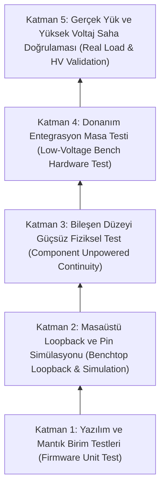
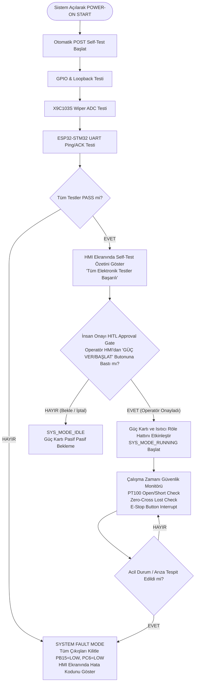

# EAGLEULTRASONİK — Self-Test Kapsam Matrisi ve Güvenlik Mimarisi (Self-Test Coverage Matrix & Safety Model)

> **Doküman Statüsü:** Comprehensive Test Matrix & Safety Architecture Specification  
> **Tarih:** 10 Ağustos 2026  
> **Sistem Sürümü:** Phase 4.7 Baseline  
> **Yazar:** Senior Embedded Systems Architect  

---

## 1. Yönetici Özeti (Executive Summary)

EAGLEULTRASONİK sisteminde firmware doğrulaması, donanım kısıtları göz önüne alınarak katmanlı bir yaklaşım ile tasarlanmıştır.

Mevcut tezgah ortamında **sadece 1x ESP32-S3, 1x STM32G474RE, 1x Nextion HMI ve 1x X9C103S dijital potansiyometre** bulunması nedeniyle, yüksek voltaj güç kartı, mekanik röle, katı hal rölesi (SSR), triyak ve ultrasonik dönüştürücüler fiziken mevcut değildir.

Bu döküman:
1. Sistem bileşenlerinin test edilebilirlik durumlarını gösteren **Kapsam Matrisini (Coverage Matrix)**,
2. Yalnızca loopback testlerine güvenmenin doğuracağı ölümcül riskleri açıklayan **"Güvenlik İllüzyonu" (Safety Illusion) Uyarısını**,
3. 5 Katmanlı Doğrulama Modelini (**5-Layer Pyramid Verification Model**),
4. İnsan Onaylı (Human-in-the-Loop - HITL) Acil Durum ve Doğrulama İş Akışını dökümante etmektedir.

---

## 2. Self-Test Kapsam Matrisi (Self-Test Coverage Matrix)

Kapsam Matrisinde sistemdeki tüm fonksiyonel alt birimler 4 farklı test edilebilirlik kategorisine ayrılmıştır:
- **`AVAILABLE NOW`:** Mevcut tezgah donanımı (ESP32, STM32, HMI, X9C) ile doğrudan test edilebilir.
- **`SIMULATED`:** Dahili GPIO loopback, timer capture, sentetik ADC verisi enjeksiyonu veya ZC simülasyonu ile test edilebilir.
- **`REQUIRES EXTERNAL HARDWARE`:** Harici röle, SSR, triyak, PT100 simülatör kutusu veya güç kartı gerektirir.
- **`NOT TESTABLE`:** Yüksek voltaj şebeke beslemesi, sulu tank daldırması veya yıkıcı test olmadan test edilemez.

| Modül / Fonksiyon | Test Edilecek Parametre / Davranış | Test Yöntemi / Mekanizması | Test Durumu | Gerekli Donanım / Bağımlılık |
| --- | --- | --- | --- | --- |
| **STM32 Core & Clocks** | 170 MHz SYSCLK, FLASH Latency, HAL Tick | `TIM15` ve `LPUART1` zamanlama doğrulaması | **`AVAILABLE NOW`** | 1x STM32G474RE |
| **ESP32 Core & Timers** | 100Hz Zero-Cross Simülasyonu, FreeRTOS | `GPIO4` square wave üretimi | **`AVAILABLE NOW`** | 1x ESP32-S3 |
| **Nextion HMI Link** | Seri Dokunmatik Ekran Komut İletimi (UART2) | Sayfa geçişleri, Setpoint güncelleme | **`AVAILABLE NOW`** | 1x Nextion HMI + ESP32 |
| **ESP32-STM32 UART** | Multi-Drop Bus PING/ACK, CRC-16, Latency | TTL UART (USART3 115200 Baud), Error Injection | **`AVAILABLE NOW`** | ESP32 + STM32 |
| **X9C103S Digipot** | Adımlama (Step 0, 40, 90), 28/40 kHz | Voltaj bölücü + STM32 ADC2 direnç hesaplama | **`AVAILABLE NOW`** | STM32 + X9C103S + 10k R_ref |
| **Process Timer** | Geri sayım mantığı, Auto-Stop | Hızlandırılmış Mod (1s = 100ms real-time) | **`SIMULATED`** | Firmware `TEST_FLAG` |
| **Heater Relay Signal** | `PB15` çıkış pini ve kontrol mantığı | GPIO Loopback pini (`PB15` $\to$ `PA5`) | **`SIMULATED`** | STM32 Jumper |
| **Triac Gate Signal** | `PC6` tetikleme pini ve `TIM15` pulse width | Loopback + `TIM2` Input Capture ($100\mu\text{s}$) | **`SIMULATED`** | STM32 Jumper |
| **Zero-Cross Signal** | EXTI9_5 yükselen kenar kesmesi, ZC lost fault | ESP32 `GPIO4` 100Hz sinyali $\to$ STM32 `PC7` | **`SIMULATED`** | ESP32-STM32 Jumper |
| **PT100 Temperature** | Sıcaklık okuma, histerezis, Open/Short fault | Sentetik ADC değer enjeksiyonu (`current_temp_c`) | **`SIMULATED`** | Firmware Enjeksiyonu |
| **Heater Relay Contact** | Fiziksel kontak kapanması, ark direnci | Kontraktör akım ölçümü / Gerilim okuma | **`REQUIRES EXTERNAL HARDWARE`** | Mekanik Röle + Yük |
| **SSR Switching** | Yarı iletken iletimi, termal soğutucu sıcaklığı | Şebeke gerilim sensörü / Akım trafosu | **`REQUIRES EXTERNAL HARDWARE`** | SSR + Isıtıcı Rezistans |
| **PT100 Sensor RTD** | Gerçek platin direnç okuması ($100\Omega \dots 138.5\Omega$) | Precision Decade Resistor Box / OPAMP3 | **`REQUIRES EXTERNAL HARDWARE`** | PT100 RTD Elemanı |
| **Triac Power Circuit** | Şebeke AC faz kıyma, dv/dt snubber | Yüksek voltaj osiloskop probu / Güç Kartı | **`REQUIRES EXTERNAL HARDWARE`** | Ultrasonik Güç Kartı |
| **Ultrasonic Transducer** | Piezo seramik rezonansı, kavitasyon, güç | Hidrofon / Akım trafosu / Su tankı kavitasyon testi | **`NOT TESTABLE`** | Yüksek Voltaj Transdüser |

---

## 3. Güvenlik İllüzyonu Uyarısı (The "Safety Illusion" Warning)

> [!CAUTION]
> **HAYATİ GÜVENLİK UYARISI: "GÜVENLİK İLLÜZYONU" (SAFETY ILLUSION)**
> 
> Firmware self-test ve loopback doğrulama sistemleri **YALNIZCA mikrodenetleyicinin dijital mantık katmanını ve GPIO pin sürücü durumlarını kanıtlar**. 
> 
> Bir loopback testinin `PASS` (BAŞARILI) sonuç vermesi, **FİZİKSEL DONANIMIN VE YÜKÜN GÜVENLİ VEYA ÇALIŞIR OLDUĞUNU GÖSTERMEZ**.
> 
> **Loopback Testlerinin Kanıtlayamadığı Kritik Durumlar:**
> 1. **Mekanik Röle Kontak Yapışması (Contact Welding):** STM32 `PB15` pinini `LOW` konumuna çekip loopback'ten `LOW` okusa bile, mekanik rölenin kontakları yüksek akımdan dolayı fiziksel olarak kaynaklanmış (yapışmış) olabilir. Rezistans kontrolsüz olarak ısınmaya devam eder ve yangın riski oluşturur!
> 2. **SSR Kısa Devre Arızası (Short-Circuit Failure):** Solid-State Röleler arızalandığında genellikle **kısa devre (iletken)** modda kalırlar. Mikrodenetleyici sinyali kesse bile SSR akım geçirmeye devam eder.
> 3. **PT100 Sensör Hat Kopukluğu / Su Temassızlığı:** Sensör devresi elektronik olarak doğru okunsa dahi, PT100 probu kılıfından çıkmış veya suya değmiyor olabilir (Hava sıcaklığı okur). Rezistans tankı yakar!
> 4. **Triyak dv/dt Kapanmama ve Yüksek Voltaj Sıçramaları:** Güç kartındaki triyak harici gürültüler nedeniyle kendiliğinden iletime geçebilir.

### 3.1. 5 Katmanlı Doğrulama Piramidi (5-Layer Pyramid Verification Model)

Bu riskleri bertaraf etmek için EAGLEULTRASONİK 5 katmanlı test modelini şart koşar:

1. **Katman 1 (Firmware Logic):** Statik kod analizi, CRC, zamanlayıcı matematik doğrulaması.
2. **Katman 2 (Loopback Simulation):** STM32-ESP32 tezgah ortamında GPIO, Timer, UART ve X9C voltaj bölücü testi.
3. **Katman 3 (Unpowered Physical):** Multimetre / LCR metre ile röle bobin direnci, kontak sürekliliği ve izolasyon testi.
4. **Katman 4 (Low-Voltage Integration):** Düşük voltajlı dummy yükler ve PT100 direnç kutusu ile kart testi.
5. **Katman 5 (Real Load Operational):** Su dolu tank, yüksek voltaj şebeke beslemesi ve gerçek ultrasonik transdüserler altında tam proses doğrulaması.

---

## 4. Otomatik Teşhis ve İnsan Onaylı Güvenlik Akışı (HITL Approval Gate)

Cihaz ilk açıldığında veya servis moduna girildiğinde otomatik teşhis süreci başlatılır. Yüksek voltajlı güç kartının ve ısıtıcının devreye alınması **İnsan Onaylı (Human-in-the-Loop - HITL)** geçit anahtarına bağlıdır.

### 4.1. Operatör Onay Geçidi (HITL Gate) Özellikleri

- **Güç Kesme Standby Durumu:** Cihaz açıldığında self-test tamamen `PASS` çıksa dahi, operatör Nextion HMI ekranındaki **"SİSTEMİ DEVREYE AL / GÜÇ VER"** butonuna fiziksel olarak basmadığı sürece ısıtıcı ve ultrasonik güç kartı röleleri mantıksal olarak kilitli (`GPIO_PIN_RESET`) kalır.
- **Donanımsal Acil Stop (E-Stop Interlock):** HMI veya pano üzerindeki mantıksal Acil Stop butonuna basıldığında, mikrodenetleyiciden bağımsız olarak ana besleme kontaktörü devreden çıkar ve STM32 `SYS_MODE_FAULT` moduna geçerek tüm sürücü pinlerini anında kapatır.
