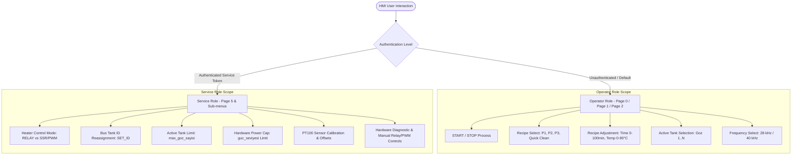
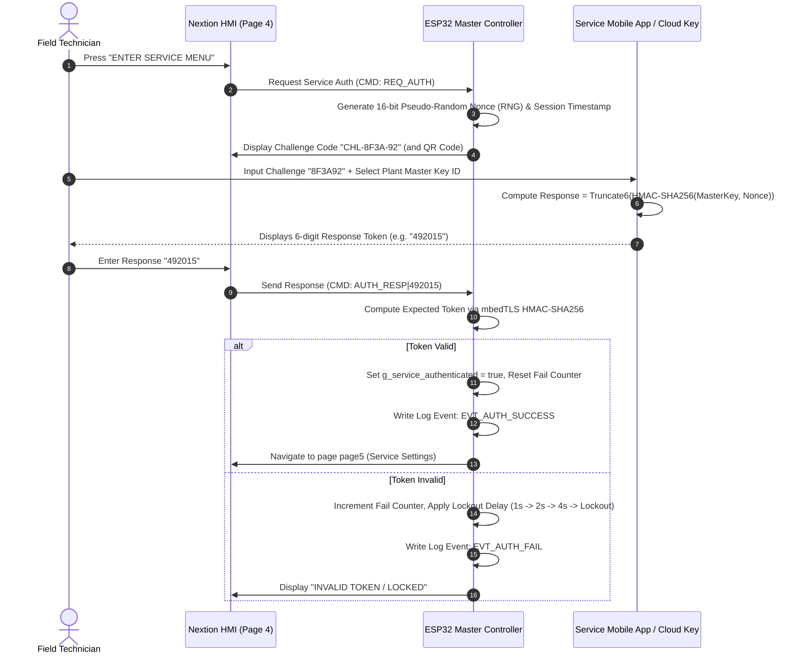
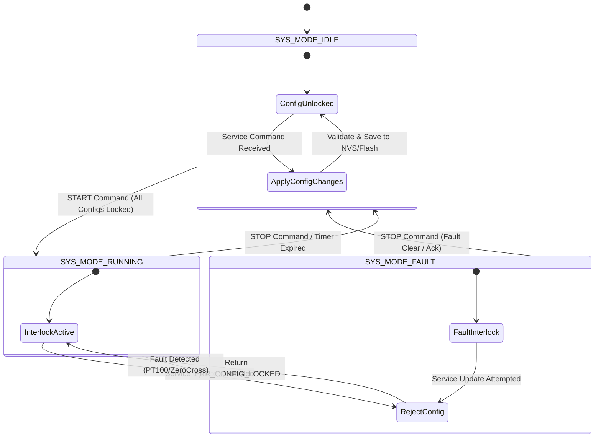
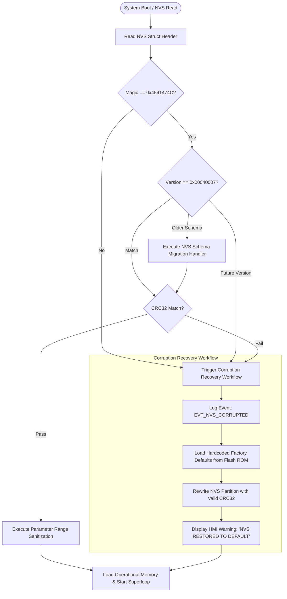
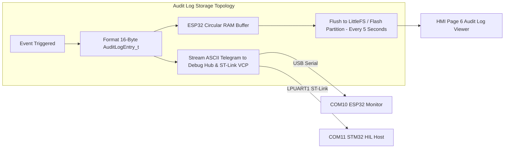

# SERVICE SECURITY ARCHITECTURE SPECIFICATION
## EAGLEULTRASONiK Phase 4.7: Nextion HMI Service Protection & System Configuration Safety

> **Document Version:** 4.7.0  
> **Status:** Official Security Engineering Architecture Specification  
> **Target Platform:** Dual-Core Embedded Control System — ESP32-S3 Master (`esp32/ekran_kontrol/ekran_kontrol.ino`) & STM32G474RE Slave (`STM32/Ultrasonik_G4_Master/Core`)  
> **Scope:** Service Role Authentication, Nextion HMI Access Control, Runtime Configuration Locking, NVS Integrity & Sanitization, Audit Event Logging  

---

## 1. EXECUTIVE SUMMARY & SYSTEM CONTEXT

The **EAGLEULTRASONiK** system is an industrial multi-tank ultrasonic cleaning machine featuring an asymmetric dual-controller topology:
- **ESP32-S3 Master:** Manages the user interface (Nextion HMI via `Serial2`), non-volatile recipe and system parameters (NVS `Preferences`), and orchestrates multi-drop UART communication (`Serial1` at 115200 Baud) to up to 10 STM32 Slave nodes.
- **STM32G474RE Slaves:** Autonomous real-time control nodes managing PT100 temperature acquisition, zero-cross synchronized triac phase-angle ultrasonic power adjustment, bang-bang/SSR heater control, and hardware safety interlocks.

### 1.1 Core Security & Safety Objectives for Phase 4.7
1. **Role Segregation:** Enforce strict separation between daily **Operator** functions and critical **Service/Commissioning** configurations on the Nextion HMI.
2. **Access Authentication:** Eliminate vulnerabilities associated with plain-text static PIN storage and unencrypted HMI UART traffic by evaluating static PIN vs. cryptographic challenge-response authentication.
3. **Runtime Configuration Locking:** Prevent dynamic reconfiguration of hardware parameters (e.g., `HEATER_MODE`, `TANK_ID`, sensor calibration, hardware pin mappings) while any connected tank is in active operation (`SYS_MODE_RUNNING`).
4. **NVS Data Integrity & Recovery:** Ensure configuration parameters stored in non-volatile storage are cryptographically verified (CRC32 checksums), schema-versioned, strictly validated/sanitized, and recoverable upon flash memory corruption.
5. **Audit Logging:** Maintain a non-volatile, append-only security audit log recording authentication attempts, configuration mutations, and service diagnostic mode activations.

---

## 2. ROLE-BASED ACCESS CONTROL (RBAC) & NEXTION HMI SEPARATION

Industrial safety standards (IEC 62443-4-2, ISO 13849-1) mandate that operational roles must be isolated so that operators cannot inadvertently reconfigure hardware drive modes or disable thermal/electrical protections.



### 2.1 Role Privilege Matrix

| Privilege / Feature | Operator Role | Service Role | Safety Impact if Unprotected |
|---|:---:|:---:|---|
| **Process Control (`START`/`STOP`)** | READ / WRITE | READ / WRITE | Normal operation |
| **Recipe Selection (`P1`..`P3`, `P_HIZLI`)** | READ / WRITE | READ / WRITE | Normal operation |
| **Active Tank View (`PAGE1_OPEN`, `SEL`)** | READ / WRITE | READ / WRITE | Selects active monitoring target |
| **Recipe Time/Temp Edit (`P_SAVE`)** | READ / WRITE | READ / WRITE | Clamped to operational range ($0..100\text{ min}$, $0..90^\circ\text{C}$) |
| **Ultrasonic Frequency (`28` / `40` kHz)** | READ / WRITE | READ / WRITE | Switches X9C103S digital potentiometer |
| **Heater Mode (`RELAY` vs `SSR_PWM`)** | **DENIED** | READ / WRITE | **CRITICAL:** Driving a mechanical relay with 10Hz SSR PWM causes contact destruction & fire hazard |
| **Tank Bus ID (`SET_ID` / `kart_id`)** | **DENIED** | READ / WRITE | **CRITICAL:** Duplicate ID on multi-drop bus causes UART collision and unguided operation |
| **Max Tank Count (`max_goz_sayisi`)** | **DENIED** | READ / WRITE | Out-of-bounds buffer access or unmonitored slave nodes |
| **Max Power Limit (`guc_seviyesi`)** | **DENIED** | READ / WRITE | Transducer over-excitation / generator thermal overload |
| **Sensor Calibration Slopes & Offsets** | **DENIED** | READ / WRITE | Incorrect PT100 reading leading to thermal runaway |
| **Direct Hardware Diagnostics** | **DENIED** | READ / WRITE | Manual relay/triac override bypassing thermal interlocks |

### 2.2 Nextion HMI Page & Interface Isolation Architecture

The existing HMI implementation ([`ekran_kontrol.ino:L522-L584`](file:///c:/Users/ern0e/EAGLEULTRASONiK/esp32/ekran_kontrol/ekran_kontrol.ino#L522-L584)) relies on Page 0/1/2 for operational workflow and Page 5 (`page page5`) for Service settings.

To enforce strict separation:
1. **Unencrypted Bus Vulnerability:** Nextion HMI communicates over unencrypted UART (`Serial2` at 9600 bps). An attacker tap or rogue serial device sending raw string `page page5` could bypass HMI keypad checks if the ESP32 firmware relies on Nextion-side page navigation alone.
2. **Firmware-Enforced Page Guarding:** ESP32 firmware MUST maintain a global state variable `bool g_service_authenticated = false;`. Any command received from Nextion targeting Service scope parameters (`GUC_UP`, `GUC_DOWN`, `ID_UP`, `ID_DOWN`, `MAX_UP`, `MAX_DOWN`, `SRV_SAVE`, `SET_HEATER_MODE`, `CAL_PT100`) MUST be gated by `g_service_authenticated`.
3. **Session Timeout & Auto-Lock:** A service session automatically expires after 300 seconds of user inactivity on HMI, resetting `g_service_authenticated = false` and forcing Nextion back to `page page0`.

---

## 3. AUTHENTICATION ARCHITECTURE: STATIC PIN VS CRYPTOGRAPHIC CHALLENGE-RESPONSE

### 3.1 Current Implementation Vulnerability Analysis
The legacy implementation ([`ekran_kontrol.ino:L44-L45`](file:///c:/Users/ern0e/EAGLEULTRASONiK/esp32/ekran_kontrol/ekran_kontrol.ino#L44-L45) & [`L539-L551`](file:///c:/Users/ern0e/EAGLEULTRASONiK/esp32/ekran_kontrol/ekran_kontrol.ino#L539-L551)) uses a hardcoded static PIN stored in global RAM:
```cpp
String girilen_sifre = "";
String dogru_sifre = "123456";
```

#### Deficiencies Identified:
1. **Hardcoded Credential:** Fixed `"123456"` PIN across all manufactured units allows unauthorized operator elevation.
2. **Plaintext Transmission & Eavesdropping:** Keypad presses are transmitted character-by-character over TTL UART (`KEY1`, `KEY2`, ...), allowing trivial wiretaps on GPIO16/17 to capture the PIN.
3. **No Lockout Protection:** Zero brute-force throttling allows infinite automated PIN attempts.
4. **No Audit Trace:** Successful or failed authentication events leave no historical trace in non-volatile memory.

---

### 3.2 Security & Trade-off Evaluation Matrix

| Architectural Criteria | Static PIN (Configurable via NVS) | TOTP Time-Based Token (RFC 6238) | Cryptographic Challenge-Response (HMAC-SHA256) |
|---|---|---|---|
| **Brute-Force Resistance** | Low (Requires software delay/lockout) | High (30-second token window) | **Extremely High** ($2^{256}$ keyspace) |
| **Replay Attack Defense** | None (Captured PIN replayable) | High (Time-window constrained) | **Absolute** (Unique nonce per attempt) |
| **Eavesdropping Defense** | Low (Plaintext string exposed) | Medium (Short validity period) | **High** (Response valid only for current nonce) |
| **ESP32 Flash/RAM Footprint** | ~0.5 KB Flash, ~32 B RAM | ~12 KB Flash (mbedTLS/Time), RTC required | ~8 KB Flash (ESP32 mbedTLS crypto), ~128 B RAM |
| **Field Service UX** | Technician types static 4-6 digit PIN | Technician opens Authenticator App | Technician scans QR / enters 6-digit challenge in Mobile App |
| **Offline Factory Viability** | 100% Offline | Requires synchronized RTC / NTP | **100% Offline** (Master key shared with service tool) |
| **Recovery / Break-Glass** | Factory Reset / Flash Erase | Master Key Override | Master Key / Cloud Seed Derivation |

---

### 3.3 Recommended Authentication Framework: Dynamic Challenge-Response with Offline Handheld/App Support

For industrial embedded environments where internet connectivity is not guaranteed and field technicians carry service smartphones or handheld tools, a **Cryptographic Challenge-Response Authentication Protocol** is specified.



#### Technical Implementation Details for ESP32 Master:
1. **Challenge Generation:** When the technician navigates to the Service Login screen, ESP32 generates a 32-bit random challenge hex string $C = \text{esp\_random()}$.
2. **HMAC-SHA256 Token Derivation:**
   $$\text{Token} = \text{Truncate}_{6\_digits}\left(\text{HMAC-SHA256}(K_{device}, C \parallel T_{session})\right)$$
   Where $K_{device}$ is a 256-bit Master Device Key stored securely in ESP32 NVS (encrypted partition or eFuse-derived key), and $C$ is the 32-bit challenge.
3. **Dual-Mode Fallback (Configurable Static PIN with Anti-Tamper Lockout):**
   To support basic installations where mobile apps are unavailable, the system supports a user-configurable 6-digit static PIN saved in NVS, protected by an **Exponential Backoff Lockout**:
   - **Attempts 1–3:** Normal entry.
   - **Attempt 4:** 10-second penalty delay before accepting new entry.
   - **Attempt 5:** 60-second penalty delay.
   - **Attempt 6+:** 15-minute complete lockout; security event `EVT_AUTH_LOCKOUT` logged to NVS.

---

## 4. RUNTIME CONFIGURATION LOCK (PROCESS SAFETY INTERLOCKS)

### 4.1 Hazard Analysis of Dynamic Reconfiguration During Process Execution

Modifying critical hardware configuration settings while the process state machine is in `SYS_MODE_RUNNING` creates extreme operational hazards:

```
+---------------------------------------------------------------------------------------------------+
| DYNAMIC RECONFIGURATION HAZARD MATRIX DURING SYS_MODE_RUNNING                                      |
+-------------------+----------------------------------+--------------------------------------------+
| Target Parameter  | Dynamic Mutation Hazard          | Physical Safety Impact                     |
+-------------------+----------------------------------+--------------------------------------------+
| HEATER_MODE       | Switching RELAY -> SSR PWM       | Destroys mechanical relay contacts due to  |
|                   | mid-heating cycle                | high-frequency switching under 16A load.   |
+-------------------+----------------------------------+--------------------------------------------+
| TANK_ID           | Invoking SET_ID mid-process      | Changes slave bus address while triac is   |
|                   |                                  | firing. ESP32 loses telemetry tracking;    |
|                   |                                  | slave runs unmonitored (runaway risk).     |
+-------------------+----------------------------------+--------------------------------------------+
| FREQUENCY_KHZ     | Invoking SET_FREQ (28/40 kHz)    | Adjusts X9C103S digital pot while high-    |
|                   | during ultrasonic cavitation     | power PWM is active. Inductive voltage     |
|                   |                                  | spikes damage piezoceramic transducers.    |
+-------------------+----------------------------------+--------------------------------------------+
| MAX_POWER_PCT     | Abrupt reduction or increase     | Sudden phase-angle shift triggers high     |
|                   | of phase-angle triac delay       | inrush current, tripping mains breakers.   |
+-------------------+----------------------------------+--------------------------------------------+
| PT100_CAL_OFFSET  | Re-calibrating PT100 ADC slope   | Instantaneous temperature jump breaks      |
|                   | while heating                    | heater relay hysteresis, causing chattering.|
+---------------------------------------------------------------------------------------------------+
```

---

### 4.2 Structural Interlock Matrix

The runtime configuration lock mandates that parameter changes must be filtered against the current operational state of **both** the ESP32 Master and all target STM32 Slaves.



---

### 4.3 Dual-Layer Enforcement Implementation Specification

Because ESP32 Master and STM32 Slaves communicate over an asynchronous multi-drop UART bus, enforcement MUST be implemented in **both layers** to guarantee safety even if an unverified message reaches the bus.

#### Layer 1: ESP32 Master Pre-Transmission Interlock (`esp32/ekran_kontrol/ekran_kontrol.ino`)
The ESP32 Master checks whether *any* connected tank or the currently selected tank is running before processing service modification commands:

```cpp
// ESP32 Master State Interlock Check
bool isAnyTankRunning() {
  for (int g = 1; g < MAX_GOZ; g++) {
    if (makine_calisiyor[g]) return true;
  }
  return false;
}

// In Service Command Decoder:
void processServiceCommand(String cmd) {
  if (isAnyTankRunning()) {
    Serial.println("--> HATA: RECONFIGURATION REJECTED! Process is RUNNING.");
    nextionGonder("t_status.txt=\"LOCKED: RUNNING\"");
    logAuditEvent(EVT_CFG_REJECTED_RUNNING, cmd.c_str());
    return;
  }
  // Proceed with parameter mutation...
}
```

#### Layer 2: STM32 Slave Firmware Hardware Interlock (`STM32/.../esp32_uart.c`)
The STM32 Slave firmware ([`esp32_uart.c:L80-L200`](file:///c:/Users/ern0e/EAGLEULTRASONiK/STM32/Ultrasonik_G4_Master/Core/Src/esp32_uart.c#L80-L200)) MUST explicitly reject configuration modification commands if `g_system_state.mode == SYS_MODE_RUNNING`:

```c
// Guard condition in ProcessLine() within esp32_uart.c
static void ProcessLine(const char *line)
{
  // Parse address...
  // ...
  
  /* CRITICAL RUNTIME CONFIGURATION LOCK:
   * System parameters (SET_ID, SET_FREQ, HEATER_MODE, CALIBRATION) CANNOT
   * be mutated while the process control loop is active (SYS_MODE_RUNNING). */
  if (g_system_state.mode == SYS_MODE_RUNNING)
  {
    if (strncmp(cmd, "SET_ID:", 7) == 0 ||
        strncmp(cmd, "SET_FREQ:", 9) == 0 ||
        strncmp(cmd, "SET_HEATER_MODE:", 16) == 0 ||
        strncmp(cmd, "CAL_PT100:", 10) == 0)
    {
      const char *err_msg = "ERR:LOCKED_SYS_RUNNING\n";
      HAL_UART_Transmit(&huart3, (const uint8_t *)err_msg, strlen(err_msg), 10);
      HAL_UART_Transmit(&hlpuart1, (const uint8_t *)err_msg, strlen(err_msg), 10);
      return; /* Reject command without altering state */
    }
  }

  // Normal command processing...
}
```

---

## 5. NVS INTEGRITY, VERSIONING, SANITIZATION & RECOVERY

### 5.1 Flash Memory Corruption Risks in Industrial Environments
Non-volatile memory (ESP32 NVS flash partition and STM32 Bank 2 Page 127 flash override [`main.c:L46-L50`](file:///c:/Users/ern0e/EAGLEULTRASONiK/STM32/Ultrasonik_G4_Master/Core/Src/main.c#L46-L50)) is subject to corruption caused by:
1. Unexpected power loss during flash write operations.
2. Electrical noise / EMI from high-power ultrasonic transducers inducing write glitches.
3. Flash wear-leveling failure or block degradation over operating lifetime.

Without integrity verification, corrupted parameters (e.g., `setpoint_temp_c = 0x7FFF` or negative time bounds) cause software crashes or unsafe hardware states.

---

### 5.2 NVS Schema Architecture & Struct Contract

To guarantee parameter validity, all persistent configurations MUST be encapsulated within a versioned, CRC32-protected binary structure.

```c
/**
  * @brief NVS System Configuration Header & Data Layout (Phase 4.7)
  */
#define NVS_CONFIG_MAGIC    0x4541474C  /* ASCII "EAGL" */
#define NVS_SCHEMA_VERSION  0x00040007  /* Version 4.7 */

typedef enum {
  HEATER_MODE_RELAY   = 0x00, /* Mechanical relay with hysteresis (+-1.0C) */
  HEATER_MODE_SSR_PWM = 0x01  /* Solid State Relay with low-frequency PWM */
} HeaterMode_t;

typedef struct __attribute__((packed)) {
  /* Header Section (12 Bytes) */
  uint32_t magic;              /* Magic Number: 0x4541474C */
  uint32_t schema_version;     /* Schema Version Tag: 0x00040007 */
  uint32_t crc32;              /* IEEE 802.3 CRC32 over payload bytes */
  
  /* System Parameters Payload */
  uint8_t  tank_id;            /* Bus Address (1..10) */
  uint8_t  max_tanks;          /* Max Bus Tanks Limit (1..10) */
  uint8_t  max_power_pct;      /* Global Ultrasonic Power Cap (10..100%) */
  uint8_t  heater_mode;        /* HeaterMode_t: RELAY or SSR_PWM */
  uint16_t recipe_time[4];     /* Default recipe times (P0..P3) in minutes */
  uint16_t recipe_temp[4];     /* Default recipe temps (P0..P3) in deg C */
  
  /* Sensor Calibration Data */
  float    pt100_cal_slope;    /* Calibration slope (default: 0.0327f) */
  float    pt100_cal_offset;   /* Calibration offset degC (default: -20.0f) */
  
  /* Authentication & Security Settings */
  uint8_t  auth_mode;          /* 0 = Challenge-Response, 1 = Static PIN */
  uint32_t static_pin_hash;    /* Salted SHA256 snippet of static PIN */
  
  uint8_t  reserved[32];       /* Future expansion padding */
} NvsConfigPayload_t;
```

---

### 5.3 NVS Parameter Sanitization & Bounds Matrix

Before any parameter loaded from NVS or received over UART is accepted into operational memory (`g_system_state` or global arrays), it MUST pass sanitization rules:

| Parameter | Type / Enum | Valid Range | Safe Fallback Default | Action on Out-of-Bounds |
|---|---|---|---|---|
| `tank_id` | `uint8_t` | `1` .. `10` | `1` | Clamp to bounds & log warning |
| `max_tanks` | `uint8_t` | `1` .. `10` | `3` | Clamp to `10` |
| `max_power_pct` | `uint8_t` | `10%` .. `100%` | `100%` | Clamp to range |
| `heater_mode` | `enum` | `0` (`RELAY`), `1` (`SSR_PWM`) | `0` (`RELAY`) | Reset to `0` (`RELAY`) |
| `recipe_time` | `uint16_t` | `1` .. `100` min | `15` min | Clamp to bounds |
| `recipe_temp` | `uint16_t` | `0` .. `90` °C | `50` °C | Clamp to bounds |
| `pt100_cal_slope` | `float` | `0.0200` .. `0.0500` | `0.0327` | Reset to factory slope |
| `pt100_cal_offset`| `float` | `-50.0` .. `+50.0` °C | `-20.0` °C | Reset to factory offset |
| `static_pin_hash`| `uint32_t` | Non-zero | Hash of `"123456"` | Reset PIN & require initial setup |

---

### 5.4 Corruption Detection, Recovery Workflow & Migration



#### CRC32 Calculation Standard (IEEE 802.3):
Both ESP32 and STM32 implement a unified CRC32 algorithm over `offsetof(NvsConfigPayload_t, crc32) + sizeof(crc32)` to the end of the structure:
```c
uint32_t CalculateNvsCRC32(const NvsConfigPayload_t *config) {
  const uint8_t *data = ((const uint8_t *)config) + 12; // Skip magic, version, crc32
  size_t length = sizeof(NvsConfigPayload_t) - 12;
  
  // Standard CRC32 algorithm (Ethernet polynomial 0xEDB88320)
  uint32_t crc = 0xFFFFFFFF;
  for (size_t i = 0; i < length; i++) {
    crc ^= data[i];
    for (int j = 0; j < 8; j++) {
      crc = (crc >> 1) ^ (0xEDB88320 & -(crc & 1));
    }
  }
  return ~crc;
}
```

---

## 6. AUDIT LOGGING & EVENT MONITORING ARCHITECTURE

### 6.1 Audit Log Event Taxonomy

To fulfill regulatory compliance and facilitate post-fault root-cause analysis, the system logs all operational and security-relevant state changes.

```
+--------------------------------------------------------------------------------------------------+
| SECURITY AUDIT EVENT TAXONOMY                                                                    |
+------------+-------------------------------+----------+------------------------------------------+
| Event ID   | Code Identifier               | Severity | Description / Trigger Condition          |
+------------+-------------------------------+----------+------------------------------------------+
| 0x10       | `EVT_AUTH_SUCCESS`            | INFO     | Successful Service Role authentication.  |
| 0x11       | `EVT_AUTH_FAIL`               | WARNING  | Failed auth attempt (invalid PIN/token). |
| 0x12       | `EVT_AUTH_LOCKOUT`            | CRITICAL | Service auth locked after N failures.    |
| 0x20       | `EVT_CFG_MUTATED`             | NOTICE   | Parameter changed (Logs Old & New Val).  |
| 0x21       | `EVT_CFG_REJECTED_RUNNING`    | WARNING  | Reconfiguration blocked during RUNNING.  |
| 0x30       | `EVT_DIAG_ACTIVATED`          | WARNING  | Direct hardware diagnostic mode enabled.|
| 0x40       | `EVT_NVS_CORRUPTED`           | ERROR    | NVS CRC failure; factory reset invoked.  |
| 0x50       | `EVT_FAULT_HARDWARE`          | ERROR    | PT100 open/short or zero-cross loss.     |
+--------------------------------------------------------------------------------------------------+
```

---

### 6.2 Non-Volatile Circular Log Buffer Architecture

The ESP32 Master maintains an append-only circular log stored in a designated LittleFS/NVS flash partition. The STM32 Slave maintains a localized 512-byte ring buffer in RAM and mirrors log events to the HIL LPUART1 VCP port ([`main.c:L35`](file:///c:/Users/ern0e/EAGLEULTRASONiK/STM32/Ultrasonik_G4_Master/Core/Src/main.c#L35)).

```c
/**
  * @brief Binary Audit Log Packet Format (16 Bytes Packed)
  */
typedef struct __attribute__((packed)) {
  uint32_t timestamp_sec;  /* Uptime seconds or RTC epoch time */
  uint8_t  event_id;       /* Event ID from Taxonomy */
  uint8_t  tank_id;        /* Tank ID associated with event (1..10) */
  uint8_t  user_role;      /* 0 = System, 1 = Operator, 2 = Service */
  uint8_t  reserved;       /* Alignment padding */
  uint32_t param_code;     /* Parameter Hash / ID being changed */
  uint16_t old_value;      /* Previous numerical value */
  uint16_t new_value;      /* New applied numerical value */
} AuditLogEntry_t;
```



---

### 6.3 Diagnostic Stream & HIL Mirroring Protocol Format

When a security or diagnostic event occurs, the system formats an ASCII log packet broadcast over the UART channels for observability:

```
LOG:<Timestamp>,<EventID_Hex>,<TankID>,<Role>,<ParamName>,<OldVal>,<NewVal>\n
```

#### Real-World Example Stream Output:
- **Authentication Failure:**  
  `LOG:004821,0x11,0,0,AUTH_TOKEN,0,492015 -> FAIL_ATTEMPT_3`
- **Reconfiguration Rejection:**  
  `LOG:005120,0x21,1,2,HEATER_MODE,RELAY,SSR_PWM -> REJECTED_SYS_RUNNING`
- **Successful Service Setting Update:**  
  `LOG:006230,0x20,2,2,SET_ID,2,3 -> SUCCESS`
- **NVS Corruption Recovery:**  
  `LOG:000002,0x40,0,0,NVS_CRC,0xDEADBEEF,0x4541474C -> RESTORED_FACTORY_DEFAULT`

---

## 7. IMPLEMENTATION ROADMAP & CODE CONTRACT GUIDELINES

To implement Phase 4.7 without violating existing baseline behaviors established in [Manifesto_V3.md](file:///c:/Users/ern0e/EAGLEULTRASONiK/Manifesto_V3.md):

1. **Header Contracts:** Update [`system_state.h`](file:///c:/Users/ern0e/EAGLEULTRASONiK/STM32/Ultrasonik_G4_Master/Core/Inc/system_state.h) to incorporate `heater_mode` in `SystemState_t` struct and define extended error codes (`ERR_LOCKED_SYS_RUNNING`).
2. **STM32 UART Guard:** Modify `ProcessLine()` in [`esp32_uart.c`](file:///c:/Users/ern0e/EAGLEULTRASONiK/STM32/Ultrasonik_G4_Master/Core/Src/esp32_uart.c#L105-L200) to validate `g_system_state.mode != SYS_MODE_RUNNING` prior to parsing configuration commands.
3. **ESP32 HMI Guard:** Update `komutIsle()` in [`ekran_kontrol.ino`](file:///c:/Users/ern0e/EAGLEULTRASONiK/esp32/ekran_kontrol/ekran_kontrol.ino#L340-L584) with challenge-response token authentication and process status locks.
4. **NVS CRC Verification:** Wrap NVS storage operations in both ESP32 (`Preferences`) and STM32 (Flash Page 127) with standard CRC32 calculation routines.
5. **Audit Logging Integration:** Allocate a 4KB LittleFS partition on ESP32 to retain up to 256 historical audit events across power cycles.

---

### 8. SUMMARY CONCLUSION

This Service Security Architecture provides EAGLEULTRASONiK Phase 4.7 with industrial-grade safety and cybersecurity compliance:
- **Zero Static PIN Flaws:** Replaces raw hardcoded PINs with cryptographic challenge-response authentication and anti-brute-force lockout.
- **Fail-Safe Runtime Locking:** Enforces multi-layer runtime hardware interlocks on both ESP32 Master and STM32 Slaves, preventing dangerous dynamic reconfiguration during active cleaning.
- **Corruption-Proof NVS:** Protects system settings through versioning, range sanitization, and automatic CRC32-triggered factory recovery.
- **Complete Traceability:** Delivers full audit visibility via non-volatile circular logging and HIL VCP stream mirroring.
