> [!WARNING]
> SUPERSEDED BY PHASE 4.6 DESIGN BASELINE

# EAGLEULTRASONİK — Sistem Seviyesi Hata Zinciri Analizi (System Failure Chain Analysis)

> **Doküman Statüsü:** Lead Embedded Systems Architect Audit Output  
> **Tarih:** 10 Ağustos 2026

---

## Sistem Seviyesi Hata Zincirleri (Cascading Failure Chains)

Kod analizinde doğrulanan bağımsız problemler, sistem çalıştığında birleşerek aşağıdaki zincirleme felaket senaryolarına yol açmaktadır:

```mermaid
graph TD
    subgraph Chain 1 [Zincir 1: Donanım Kilitlenmesi ve Yangın Risk Zinciri]
        A1["ESD Gürültüsü / Spike"] --> A2["STM32 Main Loop Kilitlenir"]
        A2 --> A3["PB15 Isıtıcı Röle HIGH Kalır"]
        A3 --> A4["IWDG Olmadığı İçin MCU Reset Atamaz"]
        A4 --> A5["Isıtıcı Rezistans Sürekli Açık Kalır (Thermal Runaway / Yangın)"]
    end

    subgraph Chain 2 [Zincir 2: Otobüs Çökmesi ve Yanlış Adresleme Zinciri]
        B1["Üretim Firmware'i BENCH_DEV_MODE_ID=1 ile Derlenir"] --> B2["Tüm SLAVE Kartları ID 1 ile Boot Eder"]
        B2 --> B3["Tüm Kartlar Aynı Anda STAT,1 Telemetrisi Yollar"]
        B3 --> B4["Multi-Drop UART Otobüsü Anında Çöker ve İletişim Kesilir"]
    end

    subgraph Chain 3 [Zincir 3: Kesme Karartması ve Triyak Düzensizliği Zinciri]
        C1["Frekans Değişimi veya Boot (X9C103S SetStep)"] --> C2["__disable_irq() 600us Kesmeleri Kapatır"]
        C2 --> C3["EXTI Zero-Cross ve TIM15 Kesmeleri Kaçırılır"]
        C3 --> C4["Triyak Yanlış Faz Açısıyla Ateşlenir (DC İnceleme / Akım Sıçraması)"]
        C2 --> C5["UART RX Karakterleri Düşürülür (Overrun Error)"]
    end

    subgraph Chain 4 [Zincir 4: Boot Anında Hayalet Çalıştırma Zinciri]
        D1["ESP32 Boot Eder (stm_son_veri_zamani = 0)"] --> D2["isKartBagli() İlk 3 Saniyede Yanlışlıkla TRUE Döner"]
        D2 --> D3["baslatmaEngelliMi() Emniyet Kilidi Bypass Olur"]
        D3 --> D4["Fiziksel Olarak Bağlı Olmayan Göze START Gönderilir ve HMI Çalışıyor Gösterir"]
    end
```

