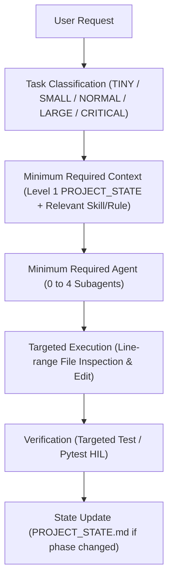

# EAGLEULTRASONİK — AGENT OS V2 OPERATING MANUAL

---

## 1. Bu Dokümanın Amacı

Bu doküman, **EAGLEULTRASONİK** gömülü sistemler projesinde aktif olan **Agent OS V2** mimarisinin operasyonel kullanım kılavuzudur.

**Amacı:**
* Yeni veya mevcut bir Antigravity sohbetinde sistemi en verimli şekilde çalıştırmak.
* Kullanıcının prompt hazırlarken Agent OS V2'den nasıl maksimum fayda sağlayacağını göstermek.
* Hangi görevde hangi uzman agent'ın çalıştığını, donanım koruma protokolünü, token optimizasyonu ve hata iyileştirme mekanizmalarını netleştirmek.

> [!NOTE]
> Bu doküman açıklayıcı bir operasyonel kılavuzdur. Sistemin bağlayıcı teknik kuralları ve beceri tanımları `.agents/rules/` ve `.agents/skills/` altında tutulmaktadır.

---

## 2. Agent OS V2 Nedir?

Agent OS V2, EAGLEULTRASONİK projesinde yazılım geliştirme, mimari analiz, HIL testleri ve donanım doğrulaması süreçlerini otomatikleştiren, **görev duyarlı (task-aware)** ve **token-verimli** bir agent işletim katmanıdır.

Sistem 5 ana yapı bloğundan oluşur:

1. **Master Agent (`Antigravity`):** Kullanıcı isteklerini karşılayan, görev karmaşıklığını sınıflandıran ve orkestrasyonu sağlayan ana agent.
2. **Specialist Agents (Uzman Subagent'lar):** Sadece kendi uzmanlık alanındaki klasörlerde çalışan 7 adet odaklanmış rol (`system-architect`, `stm32-specialist`, `esp32-hmi-specialist`, `hardware-engineer`, `communication-specialist`, `qa-test-engineer`, `code-reviewer`).
3. **Rules (Mühendislik Kuralları):** `.agents/rules/` altında modülerleştirilmiş MISRA C, FreeRTOS, donanım koruma ve kapsam sınırları.
4. **Skills (Beceriler):** `.agents/skills/` altında progressive disclosure (kademeli yükleme) mantığıyla ihtiyaç duyulduğunda okunan rehberler.
5. **PROJECT_STATE.md (Durum Hafızası):** Yeni sohbetlerde tüm repository'yi taramadan yaklaşık ~500 token seviyesinde hızlı durum yüklemesi sağlayan tek doğruluk kaynağı durum dosyası.

---

## 3. Temel Çalışma Prensibi

Agent OS V2, bir kullanıcı isteği geldiğinde aşağıdaki deterministik zinciri izler:



---

## 4. Agent Mimarisi

Master Agent (`Antigravity`) önderliğinde 7 uzman subagent rolü tanımlanmıştır.

> [!NOTE]
> **Platform ve Kural Ayrımı:** Subagent'ların klasör kısıtlamaları (scope boundaries) `.agents/rules/02-scope-control.md` ve `.agents/AGENTS.md` dosyalarında prompt ve kural tabanlı olarak tanımlanmıştır. Antigravity IDE platformu bu bildirimleri subagent context'ine enjekte ederek agent davranışını sınırlandırır.

| Specialist Agent | Kullanım Durumu | Dokunabileceği Alan (Scope) | Yapamayacağı İşlemler (Forbidden) |
| :--- | :--- | :--- | :--- |
| **`system-architect`** | Üst düzey mimari, state-machine ve cross-subsystem tasarımları | `*.md` dokümanları, `.agent/reports/` | `.c`/`.cpp` firmware kaynak kodlarını değiştirmek |
| **`stm32-specialist`** | STM32G474 HAL, TIM15 PWM, OPAMP3 PT100 ADC, ISR ve C kodları | `STM32/` dizini | `esp32/` veya `EKRAN/` dosyalarına dokunmak |
| **`esp32-hmi-specialist`** | ESP32-S3 FreeRTOS, NVS reçete deposu, Nextion HMI ve C++ | `esp32/`, `EKRAN/` dizinleri | `STM32/` dosyalarına dokunmak |
| **`hardware-engineer`** | Physical pinout, OPAMP, jumper ve Donanım Otoritesi denetimi | Read-Only (`hardware_wiring_*`) | Donanım otorite belgesini veya firmware'i değiştirmek |
| **`communication-specialist`**| RS485 multi-drop ASCII UART paket matrisi ve clamping | UART/RS485 modülleri | Pinout konfigürasyonlarını değiştirmek |
| **`qa-test-engineer`** | HIL pytest çalıştırma (`test_hil_uart.py`), mock test doğrulama | `test_*.py` | Firmware kaynak kodlarını değiştirmek |
| **`code-reviewer`** | MISRA C, FreeRTOS thread safety ve git diff güvenlik denetimi | Read-Only (Tüm repo) | Kaynak kodlarında veya testlerde değişiklik yapmak |

---

## 5. Task Router

Sistem, token ısrafını önlemek için her görevi 5 karmaşıklık seviyesinden birine yönlendirir:

| Karmaşıklık | Örnek Kullanıcı Talebi | Çalışacak Agent(lar) | Yüklenecek Context | Test / Doğrulama | Human Gate? |
| :--- | :--- | :--- | :--- | :--- | :--- |
| **TINY** | Typo düzeltme, yorum satırı güncelleme, 1 satırlık doc düzeltmesi | Master Agent (Direct Edit) | Level 0 Prompt + Hedef Satır Aralığı | Inline Diff Check | Hayır (**0 Subagent**) |
| **SMALL** | STM32 içindeki izole bir fonksiyonda bugfix, tek HMI metin değişimi | 1 Uzman Agent (`stm32` veya `esp32-hmi`) | Level 1 `PROJECT_STATE.md` + 1 Skill/Rule | İlgili Modül Kontrolü | Hayır (**1 Subagent**) |
| **NORMAL** | UART timeout değişimi, ADC filtre katsayısı, röle kontrol lojiği | Uzman Agent + `qa-test-engineer` | Level 1 + İlgili Kurallar/Skills | `pytest test_hil_uart.py` | Hayır (**2 Subagent**) |
| **LARGE** | RS485 paket formatı değişimi, STM32 ↔ ESP32 entegrasyonu, refactor | `system-architect` ➔ Uzmanlar ➔ QA ➔ Reviewer | Level 1 + Tüm İlgili Kurallar/Skills | Full Test Suite | Güvenlik riski yoksa Hayır |
| **CRITICAL** | Donanım pin değişimi, emniyet durdurma lojiği, donanım çelişkisi | Architect ➔ HW Guard ➔ Uzmanlar ➔ QA ➔ Reviewer | Level 1 + HW Authority Docs | Full Suite + Manual Gate | **EVET (ZORUNLU)** |

---

## 6. "Ben Promptumu Nasıl Yazmalıyım?"

Kullanıcının Agent OS V2 ile çalışırken gereksiz teknik detaylar yazmasına gerek yoktur. Sistem targeted context toplama yeteneğine sahiptir.

### Pratik Prompt Örnekleri:

* **TINY (Küçük Düzeltme):**
  > *"main.c içindeki line 45 yorum satırında bulunan yazım hatasını düzelt."*
* **SMALL (STM32 Bug Fix):**
  > *"STM32 tarafında PT100 ADC okumasındaki anlık sıçramayı önlemek için moving average filtresini aktif et."*
* **SMALL (ESP32 / HMI):**
  > *"ESP32 tarafında Nextion HMI sıcaklık göstergesinin yenilenme sıklığını 500 ms yap."*
* **NORMAL (RS485 / UART):**
  > *"STM32 UART reception timeout değerini 100 ms yap ve pytest HIL testlerini çalıştır."*
* **LARGE (Sistem Entegrasyonu):**
  > *"STM32 ile ESP32 arasındaki RS485 ASCII paket matrisine 'SET_PULSE' komutunu ekle ve her iki tarafta sürücülerini güncelle."*
* **CRITICAL (Donanım/Emniyet):**
  > *"STM32 PB10 olan USART3_TX pinini PA9 pinine kaydır."* *(Sistem donanım otoritesi çelişkisi tespit edip duracaktır).*

---

## 7. Küçük Bir İş Verirsem Ne Olur?

**Senaryo:** *"aga şu satırdaki timeout değerini 100 ms yap"*

1. **Routing:** Görev **SMALL** olarak sınıflandırılır.
2. **Context:** Tüm proje taranmaz. Sadece `PROJECT_STATE.md` ve `03-stm32.md` okunur.
3. **Execution:** Master Agent sadece `stm32-specialist` agent'ını çağırır. `system-architect`, `qa-test-engineer` veya `code-reviewer` çağrılmaz.
4. **Token Tasarrufu:** 74 geçmiş denetim raporu yüklenmez. İlgili C dosyasının sadece 30-70. satırları okunarak değişiklik yapılır.

---

## 8. Büyük Bir İş Verirsem Ne Olur?

**Senaryo:** *"STM32 ↔ ESP32 RS485 haberleşme protokolünü değiştir."*

1. **Routing:** Görev **LARGE** olarak sınıflandırılır.
2. **Pipeline:**
   * **`system-architect`:** Protokol paket matrisini ve haberleşme durum diyagramını tasarlar.
   * **`communication-specialist`:** Paket ayrıştırma (parsing) lojiğini belirler.
   * **`stm32-specialist` & `esp32-hmi-specialist`:** Kendi klasör kapsamlarında (`STM32/` ve `esp32/`) sürücü kodlarını günceller.
   * **`qa-test-engineer`:** `pytest test_hil_uart.py test_rs485_mock.py` testlerini koşturur.
   * **`code-reviewer`:** MISRA C ve FreeRTOS thread safety denetimi yapar.
3. **Handoff:** Her agent bir sonraki agent'a standart Handoff Payload formatında bilgi aktarır.

---

## 9. Hardware Authority Protection

[`hardware_wiring_FINAL_AUTHORITY.md`](file:///c:/Users/ern0e/EAGLEULTRASONiK/hardware_wiring_FINAL_AUTHORITY.md) dokümanı projenin **fiziksel donanım otoritesidir (Single Source of Truth)**.

Bir kod değişikliği veya kullanıcı isteği bu dokümandaki pin, timer, ADC veya jumper tanımlarıyla çelişirse Agent OS V2 şu akışı uygular:

```
[ Kod - Donanım Otoritesi Çelişkisi Tespiti ]
                     │
                     ▼
                  HALT!
                     │
                     ▼
            [ KOD EDİTİ YAPILMAZ ]
                     │
                     ▼
      [ HARDWARE CONFLICT REPORT ]
                     │
                     ▼
         [ İNSAN ONAYI GATE ]
```

> [!CAUTION]
> Agent OS V2 kesinlikle donanım pinlerini tahmin ederek otomatik düzeltmez. İnsan onayı gelene kadar kod değişikliği engellenir.

---

## 10. Context ve Token Yönetimi

Sistem token tasarrufu sağlamak için kademeli context modelini mimari bir ilke olarak uygular:

* **Level 0 (Task Prompt):** Kullanıcının yazdığı anlık istek.
* **Level 1 (PROJECT_STATE.md):** Sohbet başlangıcında yüklenen yaklaşık ~500 tokenlık anlık durum.
* **Level 2 (.agents/rules/*.md):** Görev türüne göre on-demand (gerektiğinde) yüklenen kurallar.
* **Level 3 (.agents/skills/*):** Sadece ilgili agent çalıştığında yüklenen beceriler (Progressive Disclosure).
* **Level 4 (Targeted Source Files):** `view_file` ile sadece ilgili satır aralıklarının okunduğu kaynak dosyaları.
* **Level 5 (Authoritative Docs):** Donanım çelişkisi durumunda okunan donanım otorite belgesi.
* **Level 6 Historical Reports (.agent/reports/):** 74 adet geçmiş denetim raporudur. **Rutin görevlerde KESİNLİKLE OKUNMAZ.**

---

## 11. Agent Handoff

Subagent'lar arası görev devrinde bilginin eksiksiz aktarılması için standart **Handoff Payload** kullanılır:

```text
TASK: [Alt görevin tanımı]
CONTEXT: [Teknik kısıtlar ve bulgular]
FILES TOUCHED: [Değiştirilen dosyalar]
CHANGES: [Yapılan değişikliklerin özeti]
TESTS: [Çalıştırılan testler ve sonuç]
RESULT: [SUCCESS / PARTIAL / FAILED]
RISKS: [Potansiyel regresyon riskleri]
NEXT ACTION: [Sonraki agent veya İnsan Gate]
```

---

## 12. Failure Recovery

1. **Retry Sınırı:** Bir subagent aynı değişiklikte en fazla **2 kez** tekrar deneyebilir.
2. **Escalation Yolu:** 2 başarısızlık sonrasında aynı subagent 3. kez çağrılmaz. Görev `system-architect` veya `code-reviewer` agent'ına sevk edilir.
3. **Çıkmaz Durum:** Emniyet riski veya donanım çelişkisi varsa süreç durdurularak **İnsan Gate** uyarısı verilir.

---

## 13. Yeni Sohbette Çalışma

Yeni bir Antigravity sohbeti açıldığında sistem şöyle başlatılır:

```
[ Yeni Sohbet ] ➔ Read AGENTS.md & GEMINI.md ➔ Read PROJECT_STATE.md (~500 token) ➔ Ready!
```

> [!IMPORTANT]
> Yeni sohbet açıldığında platform seviyesinde arka planda sürekli çalışan canlı subagent prosesleri yoktur. Subagent'lar kullanıcı istek verdiğinde Master Agent tarafından dinamik olarak spawn edilir.

---

## 14. Dosya Haritası

| Dosya / Dizin | Görevi | Dokunulabilir mi? |
| :--- | :--- | :--- |
| `AGENTS.md` | Root Agent OS V2 ana giriş noktası | Sadece Agent OS güncellemesinde |
| `GEMINI.md` | Root Mühendislik Kuralları giriş noktası | Sadece Agent OS güncellemesinde |
| `PROJECT_STATE.md` | Anlık durum, faz, test ve donanım özet belgesi | İş tamamlandığında güncellenir |
| `.agents/AGENTS.md` | Bildirimsel Subagent Registry (7 rol) | Sadece Agent OS güncellemesinde |
| `.agents/rules/` | Modüler mühendislik kural dosyaları (8 adet) | Sadece Agent OS güncellemesinde |
| `.agents/skills/` | Modüler beceri dosyaları (8 adet) | Sadece Agent OS güncellemesinde |
| `hardware_wiring_FINAL_AUTHORITY.md` | Donanım otoritesi (Single Source of Truth) | **KESİNLİKLE DOKUNULMAZ** |
| `STM32/`, `esp32/`, `EKRAN/` | Firmware kaynak kodları | **Sadece ilgili Uzman Agent** |
| `test_*.py` | Pytest HIL ve mock test kodları | **Sadece `qa-test-engineer`** |
| `.agent/reports/` | Tarihsel 74 denetim raporu arşivi | **KESİNLİKLE DOKUNULMAZ** |

---

## 15. Kullanıcı İçin Hızlı Başlangıç

1. **İsteğini Yaz:** İstediğin özelliği veya bugfix'i doğal dille ifade et.
2. **Router Sınıflandırır:** Agent OS V2 talebin karmaşıklığını otomatik belirler (TINY..CRITICAL).
3. **Uzman Seçilir:** İlgili subagent (örn: `stm32-specialist`) görevlendirilir.
4. **Context Yüklenir:** Sadece ilgili kural ve dosya satırları okunur.
5. **Uygulanır ve Doğrulanır:** Kod değişikliği yapılıp pytest/diff testi koşturulur.
6. **Sonuç Raporlanır:** Yapılan işlem özetlenerek kullanıcıya sunulur.

---

## 16. Örnek Senaryolar

1. **TINY Typo:** *"main.c line 12'deki typo'yu düzelt."* ➔ Master Agent direct edit (0 subagent).
2. **SMALL STM32:** *"STM32 soft-start ramp süresini 200 ms yap."* ➔ `stm32-specialist` (1 subagent).
3. **SMALL HMI:** *"Nextion ekranındaki alarm butonunun rengini değiştir."* ➔ `esp32-hmi-specialist` (1 subagent).
4. **NORMAL UART:** *"STM32 UART baudrate değerini 115200 doğrula ve HIL testlerini koştur."* ➔ `stm32-specialist` + `qa-test-engineer`.
5. **LARGE Entegrasyon:** *"STM32 ve ESP32 arasına yeni bir reçete senkronizasyon komutu ekle."* ➔ `system-architect` + `stm32-specialist` + `esp32-hmi-specialist` + `qa-test-engineer` + `code-reviewer`.
6. **CRITICAL Donanım:** *"STM32 PWM pinini PA8'den PB0'a al."* ➔ `hardware-engineer` donanım otorite kontrolü ➔ HALT & Human Gate.

---

## 17. Yapılmaması Gerekenler

* ❌ Tüm repository'yi veya 74 denetim raporunu gereksiz yere okumak.
* ❌ Küçük bir typo düzeltmesi için subagent spawn etmek.
* ❌ Donanım otorite belgesini (`hardware_wiring_FINAL_AUTHORITY.md`) tahminle değiştirmek.
* ❌ `stm32-specialist` olarak `esp32/` klasöründeki dosyaları düzenlemeye çalışmak.
* ❌ Başarısız olan bir subagent'ı 2 kereden fazla üst üste denemek.
* ❌ HIL veya mock testleri koşturmadan LARGE/CRITICAL değişiklikleri kabul etmek.
* ❌ İnsan onayı gereken CRITICAL durumlarda otomatik devam etmek.

---

## 18. Agent OS V2 Operasyonel Kontrol Listesi

Her görev tamamlandığında şu liste kontrol edilir:

- [ ] Görev karmaşıklığı doğru sınıflandırıldı mı? (TINY/SMALL/NORMAL/LARGE/CRITICAL)
- [ ] Minimum gerekli context yüklendi mi? (Gereksiz rapor okuması yapılmadı mı?)
- [ ] Doğru uzman agent(lar) seçildi mi?
- [ ] Agent yazma sınırlarına (scope) uyuldu mu?
- [ ] Donanım otoritesi (`hardware_wiring_FINAL_AUTHORITY.md`) korundu mu?
- [ ] Hedefli (targeted) kod değişikliği tamamlandı mı?
- [ ] Uygun doğrulama/test koşturuldu mu?
- [ ] Gerekliyse handoff payload aktarıldı mı?
- [ ] Faz değiştiyse `PROJECT_STATE.md` güncellendi mi?
- [ ] Korunan kaynak dosyalarında yetkisiz değişiklik yapılmadı mı?

---

## 19. Authoritative References

Bu doküman operasyonel bir kullanım kılavuzudur. Sistemin bağlayıcı teknik kuralları aşağıdaki dosyalarda tanımlanmıştır:

* Agent Rol Tanımları: [`.agents/AGENTS.md`](file:///c:/Users/ern0e/EAGLEULTRASONiK/.agents/AGENTS.md)
* Donanım Otorite Kuralı: [`.agents/rules/01-source-of-truth.md`](file:///c:/Users/ern0e/EAGLEULTRASONiK/.agents/rules/01-source-of-truth.md)
* Kapsam Sınırları Kuralı: [`.agents/rules/02-scope-control.md`](file:///c:/Users/ern0e/EAGLEULTRASONiK/.agents/rules/02-scope-control.md)
* Task Router & Handoff Kuralı: [`.agents/rules/07-agent-orchestration.md`](file:///c:/Users/ern0e/EAGLEULTRASONiK/.agents/rules/07-agent-orchestration.md)
* Donanım Otorite Dokümanı: [`hardware_wiring_FINAL_AUTHORITY.md`](file:///c:/Users/ern0e/EAGLEULTRASONiK/hardware_wiring_FINAL_AUTHORITY.md)

---

## 20. Final Operating Principle

> **"Minimum gerekli context + minimum gerekli agent + minimum gerekli değişiklik + yeterli doğrulama."**
