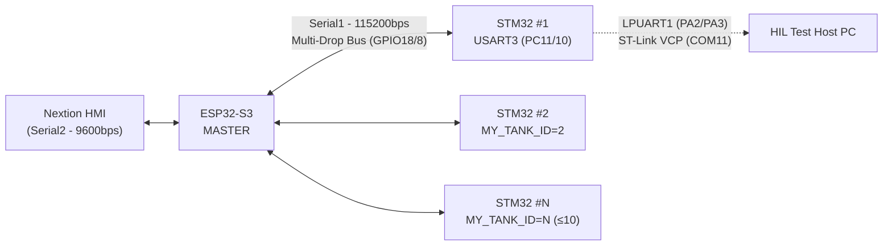

# ULTRASONİK YIKAMA MAKİNESİ ÇİFT ÇEKİRDEKLİ (ESP32+STM32) SİSTEM MANİFESTOSU V3.0

> **Doküman Statüsü:** Resmi Mühendislik Referansı  
> **Kapsam:** `esp32/ekran_kontrol/ekran_kontrol.ino` (Master) ve `STM32/Ultrasonik_G4_Master/Core` (Slave) yazılım tabanının, çok noktalı (multi-drop) 1-N mimarisine geçiş sonrası mevcut durumu.  
> **Amaç:** Yeni özellik geliştirmeye başlamadan önce, sistemin *gerçekte ne yaptığının* satır satır doğrulanmış, tartışmasız bir referansını oluşturmak.  

---

## 1. SİSTEM MİMARİSİ VE TOPOLOJİSİ (System Architecture & Topology)

Sistem, **tek bir Master** ve **N adet Slave** kartından oluşan asimetrik bir kontrol mimarisine sahiptir:

- **Master — ESP32-S3 (`ekran_kontrol.ino`):** Kullanıcı arayüzünün (Nextion HMI), reçete yönetiminin (NVS) ve tüm hat üzerindeki STM32 kartlarının telemetrisinin toplandığı tek merkezdir. Master, işlem mantığının "beynidir"; zamanlayıcı geri sayımı ve sıcaklık kontrolü gibi gerçek zamanlı kritik görevleri **üstlenmez**, bunları Slave kartlara devreder.
- **Slave — STM32G474RE (`main.c` ve modülleri):** Her biri fiziksel olarak bir yıkama gözüne (tank) bağlı, kendi PT100 sıcaklık okumasını yapan, kendi triyak faz-açı kontrolünü ve ısıtıcı röle histerezisini yöneten, **bağımsız ve otonom** bir gerçek-zamanlı kontrolcüdür. STM32, ESP32'den komut almasa dahi kendi PT100 ve zero-cross emniyetlerini bağımsız olarak işletmeye devam eder.

### 1.1. UART Çok Noktalı (Multi-Drop) Bus Mantığı VE HIL Test Portu

Fiziksel katman, ESP32'nin `Serial1` (GPIO18=RX, GPIO8=TX) portu ile STM32'nin `USART3` (PC11=RX, PC10=TX) portu üzerinden **tek bir ortak UART hattına** paralel bağlanmış, en fazla **10 adet** STM32 kartını (`MAX_GOZ = 11`, index 0 kullanılmadığından geçerli aralık 1-10) destekleyecek şekilde tasarlanmıştır:

- Tüm STM32 kartları, aynı fiziksel TX/RX hattını dinler (klasik RS-485/UART multi-drop paylaşımı).
- Adresleme, protokol seviyesinde **yazılımsal olarak** yapılır: her komut satırının başına `T<ID>:` öneki eklenir.
- Bir STM32 kartı, kendi `MY_TANK_ID` değeriyle eşleşmeyen bir adrese sahip komutu **sessizce yok sayar** (`esp32_uart.c` → `ProcessLine()`), böylece hatta aynı anda birden fazla kart olsa dahi çakışma veya yanlış tetikleme oluşmaz.
- Baud hızı her iki tarafta da sabit **115200** olarak eşleştirilmiştir (`STM_BAUD` / `huart3.Init.BaudRate`).
- **HIL Test ve Gözlemlenebilirlik Portu (LPUART1):** STM32 üzerinde `LPUART1` (PA3=RX, PA2=TX) portu ST-Link VCP (COM11) olarak yapılandırılmıştır. STM32, `huart3` üzerinden ESP32'ye gönderdiği her `STAT,...` telemetri paketini eşzamanlı olarak `hlpuart1` üzerine **aynalar (mirroring)**. Ayrıca 500ms periyotla `DEBUG_STM:` formatında dahili ADC/PWM beyaz-kutu verisini basar.



### 1.2. Donanım ve Pin Haritası (Physical Pinout Mapping)

Kod tabanındaki (`main.h`, `ekran_kontrol.ino`) gerçek pin konfigürasyonu aşağıdaki gibidir:

| Donanım İşlevi | Mikrodenetleyici | Pin Tanımı | Mod / Açıklama |
|---|---|---|---|
| **ESP32 Bus RX** | ESP32-S3 | `GPIO18` | `STM_RXD` (Serial1 RX) |
| **ESP32 Bus TX** | ESP32-S3 | `GPIO8` | `STM_TXD` (Serial1 TX) |
| **Nextion HMI RX/TX** | ESP32-S3 | `GPIO16` / `GPIO17` | `RXD2` / `TXD2` (Serial2 - 9600 Baud) |
| **Zero-Cross Simülatör** | ESP32-S3 | `GPIO4` | `ZC_SIM_PIN` (100Hz kare dalga, `esp_timer`) |
| **Triyak Gate Kontrol** | STM32G474RE | `PC6` | `TRIAC_GATE_Pin` (Push-Pull Çıkış) |
| **Zero-Cross Girişi** | STM32G474RE | `PC7` | `ZERO_CROSS_Pin` (EXTI9_5 Yükselen Kenar Kesmesi) |
| **Isıtıcı Röle Kontrol** | STM32G474RE | `PB15` | `HEATER_RELAY_Pin` (Push-Pull Çıkış) |
| **DIP Switch 1..4** | STM32G474RE | `PC8`, `PC9`, `PC10`, `PC11` | `DIP_SW1..4` (Aktif-Düşük, Dahili Pull-up) |
| **Multi-Drop Bus UART3**| STM32G474RE | `PC10` (TX), `PC11` (RX)| `USART3` (115200 Baud, 8N1) |
| **HIL Debug LPUART1** | STM32G474RE | `PA2` (TX), `PA3` (RX) | `LPUART1` (ST-Link VCP COM11, 115200 Baud) |
| **PT100 Sensör Girişi** | STM32G474RE | OPAMP3 $\rightarrow$ ADC2 | Dahili `ADC_CHANNEL_VOPAMP3_ADC2` ($PGA=2$) |

---

## 2. ADRESLEME VE KİMLİK YÖNETİMİ (Addressing & ID Management)

### 2.1. `MY_TANK_ID`: Kartın Bus Kimliği

Her STM32 kartı, `main.c` içinde tanımlı global `uint8_t MY_TANK_ID` değişkeni ile kendini hatta tanıtır. Bu değer, kartın **kendi gözünün numarasıdır** (1-10 aralığında) ve boot sırasında aşağıdaki öncelik sırasına göre belirlenir:

1. **Geliştirici Modu Aktif mi?** (`BENCH_DEV_MODE_ID > 0` ise sabitleme)
2. **Flash'ta kayıtlı bir override var mı?** (`TankId_Load()`)
3. Yoksa **DIP switch okuması** (`ReadDipSwitchId()`) devreye girer.

### 2.2. DIP Switch Fallback Mantığı

`ReadDipSwitchId()`, `DIP_SW1..DIP_SW4` GPIO pinlerini (`PC8`, `PC9`, `PC10`, `PC11` - aktif-düşük, pull-up dirençli, `GPIOC` üzerinde) okuyarak 4-bit'lik bir ham değer (`raw`) oluşturur:

- Tüm switchler açıkken (`raw == 0`) varsayılan ID **1**'dir.
- `raw > 10` olması durumunda değer **10**'a kırpılır (sistemin desteklediği maksimum tank sayısı).
- Bu mekanizma, Flash'ta hiçbir override kaydı olmayan "fabrika çıkışı" bir kartın, sadece fiziksel DIP anahtar konfigürasyonuyla doğru göze atanmasını sağlar.

### 2.3. Flash Tabanlı Kalıcı ID Override (`TankId_SaveOverride`)

STM32'nin dahili Flash belleğinin son sayfası, uygulama imajından bağımsız bir "ayarlar sayfası" olarak ayrılmıştır:

- **Adres:** `0x0807F800` (Bank 2, Sayfa 127 — 512KB Flash'ın son 2KB'ı, uygulama koduyla çakışmaz).
- **Format:** `[0]=magic (uint32_t, 0xA5A5A5A5)`, `[4]=id (uint32_t)`. Magic değeri doğrulanmadan okunan ID geçersiz sayılır (`TankId_Load()`), böylece programlanmamış/silinmiş bir Flash sayfası yanlışlıkla geçerli bir ID olarak yorumlanmaz.
- **Yazma akışı (`TankId_SaveOverride`):** İlgili sayfa `HAL_FLASHEx_Erase()` ile silinir, ardından `magic | (id << 32)` şeklinde paketlenmiş 64-bit'lik veri `HAL_FLASH_Program()` ile double-word modunda yazılır. İşlem tamamlandığında `MY_TANK_ID` **anında** (yeniden boot beklemeden) güncellenir.
- Bu mekanizma, sahada bir STM32 kartına DIP switch'e dokunmadan, sadece ESP32 üzerinden gönderilen bir komutla (`SET_ID`) kalıcı ve yeniden başlatmaya dayanıklı bir kimlik atanmasına imkan tanır.

### 2.4. Geliştirici Modu (`BENCH_DEV_MODE_ID`)

`main.c` içinde tanımlı `#define BENCH_DEV_MODE_ID 1` derleme-zamanı anahtarı, masa üstü (bench) test senaryoları için tasarlanmıştır:

- `BENCH_DEV_MODE_ID > 0` olduğunda, boot sırasında Flash ve DIP switch okumaları **tamamen atlanır**; `MY_TANK_ID` doğrudan bu sabit değere zorlanır.
- Bu, henüz DIP switch donanımı kartına lehimlenmemiş geliştirme kartlarında sabit ve öngörülebilir bir ID ile test yapılabilmesini sağlar.
- **Üretim uyarısı:** Kod içindeki yorum satırı açıkça belirtir — bu değer üretim derlemelerinde **`0`'a çekilmelidir**; aksi halde tüm kartlar aynı sabit ID ile boot olur ve multi-drop adresleme çöker. Mevcut haliyle depoda `1` olarak bırakılmış olması, bu derlemenin şu an **bench/geliştirme modunda** olduğu, üretime hazır olmadığı anlamına gelir.

### 2.5. Hedefli (`T<ID>:`) ve Yayın (`T0:`) Komutları

Protokol iki adresleme modu tanımlar:

| Mod | Söz Dizimi | Davranış |
|---|---|---|
| **Hedefli (Targeted)** | `T<ID>:KOMUT` | Sadece `MY_TANK_ID == ID` olan kart komutu işler; diğerleri sessizce yok sayar. |
| **Yayın (Broadcast)** | `T0:KOMUT` | Hattaki **her** kart, kendi mevcut `MY_TANK_ID`'sinden bağımsız olarak komutu işler. |

Bu ayrım özellikle **`SET_ID`** komutunda kritik bir rol oynar: ESP32'nin henüz bir kartın mevcut ID'sini bilmediği (örn. fabrika çıkışı, DIP switch'i bilinmeyen bir kart) senaryoda, `stmSetIdBroadcast()` fonksiyonu üzerinden `T0:SET_ID:<yeni_id>` gönderilir; hatta o an tek kart bağlıysa bu kart, kendi eski ID'sinden bağımsız olarak yeni kimliğini Flash'a yazar. Diğer tüm normal komutlar (`SET_TIME`, `SET_TEMP`, `SET_POWER`, `START`, `STOP`) ise `secili_goz` (ESP32 tarafında seçili göz) ID'siyle hedefli olarak gönderilir (`stmGonder()`).

---

## 3. ESP32 (MASTER) GÖREVLERİ VE EMNİYET (ESP32 Roles & Interlocks)

### 3.1. NVS Reçete Yönetimi (P1, P2, P3)

ESP32, `Preferences` kütüphanesi (NVS - Non-Volatile Storage) üzerinden **3 adet kalıcı reçete şablonu** saklar:

- `p_sure[1..3]` (dakika) ve `p_sicaklik[1..3]` (°C) dizileri, `nvsYukle()` ile boot sırasında flash'tan okunur, `nvsKaydet()` ile (Page 2 ekranındaki "P_SAVE" komutuyla) geri yazılır.
- Ayrıca `guc_seviyesi` (güç %), `kart_id` (servis menüsünde ayarlanan hedef ID) ve `max_goz_sayisi` (aktif göz sayısı sınırı) de aynı NVS namespace'inde (`"ultra"`) kalıcı olarak tutulur.
- Bir reçete seçildiğinde (`P1_SEL`/`P2_SEL`/`P3_SEL`), sadece **o an seçili gözün** (`secili_goz`) hedef süre/sıcaklık değerleri güncellenir ve STM32'ye anında iletilir; diğer gözlerin ayarları etkilenmez (`hedef_sure[]`/`hedef_sicaklik[]` dizileri göz-bazlı bağımsızdır).

### 3.2. Nextion HMI Senkronizasyonu

- `Serial2` (9600 baud, GPIO16/17) üzerinden Nextion ekranla çift yönlü haberleşir: ekrandan gelen komutlar `\xFF\xFF\xFF` sonlandırıcısıyla ayrıştırılır (`gelenMesaj`), ekrana giden her komut da aynı 3 byte'lık sonlandırıcı ile (`nextionGonder()`) gönderilir.
- `komutIsle()` fonksiyonu, HMI'den gelen düz-metin komutları (`P_HIZLI`, `CMD_START|...`, `CMD_STOP`, `P1_SEL`, `EDIT_P1`, `P_SAVE|...`, `PAGE1_OPEN`, `UP`/`DOWN`/`SEL`/`BACK`, şifre tuş takımı `KEY*`, servis menüsü `GUC_UP/DOWN`, `ID_UP/DOWN`, `MAX_UP/DOWN`, `SRV_SAVE`) merkezi bir karar mekanizmasıyla işler.
- Ana döngüde her 1000ms'de bir (`sonGuncellemeZamani`), **sadece o an ekranda görüntülenen `secili_goz`'ün** kalan süresi, anlık sıcaklığı ve durum metni ekrana basılır — diğer gözlerin telemetrisi arka planda toplanmaya devam etse de ekran trafiği tek göze indirgenerek gereksiz Nextion yükü önlenir.
- PT100 arıza bitleri (`FAULT_PT100_OPEN_BIT`/`FAULT_PT100_SHORT_BIT`) STM32'den gelen `fault` alanında set edilmişse, ekranda gerçek olmayan bir sıcaklık yerine `"--.-"` gösterilir.

### 3.3. 100Hz Donanım Zamanlayıcılı Zero-Cross Simülatörü

Masa üstü (HIL — Hardware-in-the-Loop) testlerinde gerçek 50Hz şebeke zero-cross sinyali olmadan STM32'nin "Zero-Cross Missing" arızasına düşmesini engellemak amacıyla:

- `GPIO4` pini, STM32'nin `PC7` (zero-cross giriş) pinine kablo ile bağlanacak şekilde ayrılmıştır.
- ESP32-S3'ün donanımsal **LEDC** periferiği, 100Hz + 8-bit çözünürlük kombinasyonu için geçerli bir clock bölücü üretemediğinden (`div_param=0` hatası), bu iş yerine bir **`esp_timer`** donanım zamanlayıcısı ile çözülmüştür.
- `zcSimBaslat()`, `esp_timer_create`/`esp_timer_start_periodic` ile `ZC_SIM_HALF_PERIOD_US` (5000µs) periyodunda periyodik bir callback (`zcSimTimerCallback`) kurar; bu callback her tetiklendiğinde `ZC_SIM_PIN`'i toggle ederek **100Hz'lik bir kare dalga** üretir (50Hz şebekenin çift zero-cross'una karşılık gelen frekans).
- Bu mekanizma tamamen **non-blocking**'tir ve LEDC'den bağımsız çalışır; `loop()` içindeki hiçbir işlemi bloklamaz.

### 3.4. `isKartBagli` — 3000ms Çevrimdışı Watchdog Emniyet Kilidi

Sistemin en kritik emniyet mekanizması, **kör başlatmayı** (blind start) engelleyen bağlantı zaman aşımı denetimidir:

- Her göz için `stm_son_veri_zamani[goz_id]` dizisi, o gözden en son ne zaman geçerli bir `STAT,...` telemetri paketi alındığını `millis()` cinsinden tutar.
- `isKartBagli(goz_id)` fonksiyonu, `(millis() - stm_son_veri_zamani[goz_id]) < STM_BAGLANTI_TIMEOUT` (3000ms) koşulunu kontrol eder.
- `baslatmaEngelliMi()` fonksiyonu, seçili göz bu pencerede telemetri göndermemişse (`isKartBagli() == false`) `true` döner; çağıran komut dalı (`P_HIZLI`, `CMD_START|...`, `P1_SEL`/`P2_SEL`/`P3_SEL`) bu durumda işlemi **derhal durdurur**, ekranda `"Kart Yok!"` uyarısı gösterir ve **STM32'ye hiçbir START komutu göndermez**.
- Bu, fiziksel olarak sökülmüş, arızalı veya hattı henüz boot etmemiş bir STM32 kartına karşı, operatörün körlemesine bir "Başlat" komutu vererek makineyi güvensiz bir duruma sokmasını (örneğin ısıtıcının hiçbir geri bildirim olmadan sınırsız çalışması riskini) önler.
- Ana döngüde ayrıca her göz için bağımsız bir zaman aşımı taraması yapılır: `stm_bagli[i]` bayrağı, ilgili göz 3000ms içinde veri göndermemişse otomatik olarak `false`'a çekilir.
- Bir göz yeniden bağlandığında (`yeniden_baglandi` bayrağı), `stmSetpointleriGonder()` otomatik olarak tetiklenir ve STM32'nin setpoint'leri (süre/sıcaklık/güç) ESP32'nin hafızasındaki güncel değerlerle **yeniden senkronize edilir** — bu, kartın resetlenmesi/yeniden takılması durumunda eski/varsayılan setpoint'lerle çalışmaya devam etmesini engeller.

---

## 4. STM32 (SLAVE) GÖREVLERİ VE KONTROL DÖNGÜLERİ (STM32 Roles & Control Loops)

STM32 ana döngüsü (`main.c`), beş bağımsız modülü kesintisiz olarak (non-blocking, superloop mimarisi) sırayla poll eder: `ESP32_UART_Process()`, `PT100_ADC_Process()`, `HeaterRelay_Process()`, `UltrasonicPWM_Process()`, `ProcessTimer_Process()`. Tüm modüller, ortak `g_system_state` (volatile struct, `system_state.h`) üzerinden veri paylaşır.

### 4.1. PT100 Açık Devre Koruması (-10°C ile 110°C Eşiği)

`pt100_adc.c`, `OPAMP3` (PGA kazanç x2) çıkışını `ADC_CHANNEL_VOPAMP3_ADC2` kanalı üzerinden `ADC2` ile okur ve doğrusal bir kalibrasyon uygular: `temp_c = adc_raw * PT100_CAL_SLOPE (0.0327) + PT100_CAL_OFFSET (-20.0)`.

Sensör bütünlüğü **çok katmanlı** olarak doğrulanır:

1. **Ham ADC rayına yapışma:** `adc_raw >= 4090` (açık devre, `ADC_RAW_OPEN_THRESHOLD`) veya `adc_raw <= 5` (kısa devre, `ADC_RAW_SHORT_THRESHOLD`).
2. **Gerçekçi sıcaklık penceresi dışı kalma:** Yukarıdaki ham eşiklere takılmasa bile, hesaplanan sıcaklığın karşılık geldiği ham değer `[ADC_RAW_VALID_MIN, ADC_RAW_VALID_MAX]` aralığının (−10°C…110°C'ye karşılık gelen ham değerler) dışına düşmesi de **aynı derecede geçersiz** sayılır — orta ölçekte "mantıklı görünen" ama gerçekte floating bir girişin yanlışlıkla geçerli kabul edilmesini engeller.

Herhangi bir ihlalde: ilgili `FAULT_PT100_OPEN` veya `FAULT_PT100_SHORT` biti `fault_flags`'e eklenir, `mode = SYS_MODE_FAULT`'a geçilir ve `current_temp_c` **0.0f'a zorlanır** (ESP32 tarafında bu, gerçek olmayan bir değer yerine `"--.-"` gösterimini tetikler). Kod yorumları, floating bir girişin gerçekten bu pencerenin dışına düşmesini garanti altına almak için donanımsal bir bias direncinin de önerildiğini not eder.

### 4.2. Triyak PWM Soft-Start ve One-Pulse Mod Mantığı

`ultrasonic_pwm.c`, 50Hz şebeke zero-cross referansına göre faz-açı (phase-angle) kontrolü uygular:

- `PC7` (`ZERO_CROSS_Pin`) üzerinde yükselen kenar EXTI9_5 kesmesi, her zero-cross'ta `TIM15`'i (1µs tick çözünürlük) `current_delay_us` gecikmesiyle yeniden tetikler (`HAL_GPIO_EXTI_Callback`).
- **Gecikme dolduğunda (`HAL_TIM_OC_DelayElapsedCallback`):** Triyak gate pini (`PC6` / `TRIAC_GATE_Pin`) tetikleme için `HIGH` yapılır.
- **Periyot bittiğinde (`HAL_TIM_PeriodElapsedCallback` / ARR Update):** `PC6` gate pini `LOW` yapılarak 100µs'lik tetikleme darbesi sonlandırılır ve TIM15 One-Pulse Mode (OPM) uyarınca bir sonraki zero-cross kenarına kadar durdurulur (`HAL_TIM_OC_Stop_IT`).
- **Güç ↔ gecikme dönüşümü:** `PowerPctToDelayUs()`/`DelayUsToPowerPct()`, %0-100 güç talebini 500µs (maksimum güç, ZC'ye en yakın tetikleme) ile 9500µs (minimum güç, yarı periyodun sonuna en yakın tetikleme) arasında bir gecikmeye eşler.
- **Soft-start:** `current_delay_us`, hedef gecikmeye (`target_delay_us`) doğru **sadece aşağı yönde** (`SOFTSTART_RAMP_STEP_US = 20µs`/zero-cross adımlarla) yaklaşır; asla ani bir sıçrama yapmaz. Bu, iletim açısının (dolayısıyla gücün) her START komutunda kademeli olarak yükselmesini sağlayarak ani akım darbelerini (inrush) önler.
- **Zero-cross kaybı emniyeti:** Son geçerli ZC kesmesinden bu yana 500ms (`ZERO_CROSS_TIMEOUT_MS`) geçmişse `FAULT_ZERO_CROSS_LOST` set edilir, `mode = SYS_MODE_FAULT`'a geçilir ve triyak zorla kapatılır (`TriacForceOff`). Bench/kuru test amaçlı bir `ZC_BENCH_TEST_MODE` derleme bayrağı mevcuttur (varsayılan `0`); `1` yapılırsa bu arızanın tetiklenmesi bastırılır, ancak triyak yine de gerçek ZC kenarları olmadan **asla ateşlenmez**.

### 4.3. Isıtıcı Röle Histerezisi (`PB15`)

`heater_relay.c`, klasik bang-bang (aç/kapa) kontrolü `PB15` (`HEATER_RELAY_Pin`) üzerinden, `HEATER_HYSTERESIS_C = ±1.0°C` deadband ile uygular:

- `SYS_MODE_RUNNING` değilken (IDLE veya FAULT dahil) röle her zaman **kapalı** (`LOW`) tutulur.
- Çalışırken: `current_temp_c <= setpoint - 1.0°C` ise röle **açılır** (`HIGH`); `current_temp_c >= setpoint + 1.0°C` ise röle **kapanır** (`LOW`); ikisi arasındaki deadband bölgesinde röle **önceki durumunu korur** — bu, setpoint etrafında gereksiz yüksek frekanslı anahtarlamayı (chattering) önler.

### 4.4. 500ms Telemetri Kalp Atışı (`STAT,...`) VE HIL Aynalama

`main.c` ana döngüsünde, `HAL_GetTick()` tabanlı **bloklamayan** bir zamanlayıcı (`last_status_tick_ms`), her 500ms'de bir `ESP32_UART_SendStatus()`'u tetikler:

- `g_system_state`'in anlık görüntüsü tek satırlık bir `STAT,...` telegramına paketlenip `huart3` (USART3) üzerinden kesme-tabanlı (`HAL_UART_Transmit_IT`) gönderilir.
- **HIL Aynalama (Mirroring):** Aynı `STAT,...` paketi, HIL test ortamında bağımsız izleme sağlamak amacıyla `hlpuart1` (LPUART1 / ST-Link VCP - COM11) üzerinden de yayınlanır.
- **HIL White-Box Stream:** Ayrıca 500ms periyotla `HIL_DeepDebug_Print()` fonksiyonu üzerinden COM11'e `DEBUG_STM: ADC=..., DELAY=..., RELAY=...` ham donanım verisi gönderilir.

### 4.5. `ProcessTimer` — 1Hz Otomatik Geri Sayım

`process_timer.c`, `mode`'un `IDLE → RUNNING` geçişini algılayarak `remaining_seconds`'ı `setpoint_time_minutes * 60`'a yükler (her START'ta geri sayım sıfırdan başlar). `remaining_seconds`, 1000ms'lik driftsiz aralıklarla (`last_tick_ms += 1000u` — kümülatif kayma önlenir) bir azaltılır; sıfıra ulaştığında `mode` otomatik olarak `SYS_MODE_IDLE`'a döner (otomatik durdurma). Sıfır dakikalık bir setpoint ile START edilirse süreç hiç başlamadan anında IDLE'a düşer.

---

## 5. HABERLEŞME PROTOKOLÜ (Communication Protocol)

Protokol, `\n` (isteğe bağlı öncesinde `\r`) ile sonlandırılan, ASCII tabanlı, satır-yönelimli bir çerçeve yapısı kullanır. Maksimum satır uzunluğu her iki yönde de 64 byte'tır (`RX_LINE_MAX`/`TX_LINE_MAX`).

### 5.1. ESP32 → STM32 (Komut Yönü)

| Komut | Söz Dizimi | Örnek | Davranış / Sınırlar |
|---|---|---|---|
| Süre ayarı | `T<ID>:SET_TIME:<dakika>` | `T1:SET_TIME:15` | 0-100 dk aralığına kırpılır (`TIME_MINUTES_MAX`). |
| Sıcaklık ayarı | `T<ID>:SET_TEMP:<°C>` | `T1:SET_TEMP:60` | 0.0-90.0°C aralığına kırpılır (float, `strtof`). |
| Güç ayarı | `T<ID>:SET_POWER:<%>` | `T1:SET_POWER:50` | 0-100% aralığına kırpılır. |
| Başlat | `T<ID>:START` | `T1:START` | `mode == FAULT` değilse `RUNNING`'e geçer. |
| Durdur | `T<ID>:STOP` | `T1:STOP` | `mode = IDLE`; **ayrıca** `fault_flags` temizlenir (arıza onayı/reset görevi görür). |
| ID ata (yayın) | `T0:SET_ID:<yeni_id>` | `T0:SET_ID:2` | 1-10 aralığında; `TankId_SaveOverride()` ile Flash'a yazılır, `MY_TANK_ID` anında güncellenir. Hedefli (`T<ID>:SET_ID:n`) biçimi de kabul edilir. |

Adresleme kuralları (bkz. §2.5): `T` ile başlamayan, sayısal bir ID + `:` içermeyen veya `MY_TANK_ID`'ye eşit olmayan bir ID'ye sahip (ve `0` da olmayan) her satır **sessizce reddedilir**. Tanınmayan komut gövdeleri de sessizce yok sayılır.

### 5.2. STM32 → ESP32 (Telemetri Yönü)

```
STAT,<TankID>,<mode>,<remaining_sec>,<temp_x10>,<relay>,<power_pct>,<fault_flags>\n
```

**Örnek:** `STAT,1,RUNNING,842,455,1,72,0`

| Alan | Tip | Açıklama |
|---|---|---|
| `TankID` | `1-10` | Gönderen kartın `MY_TANK_ID`'si — ESP32 bu paketi doğru göz dizisine (`kalan_saniye[g]`, `anlik_sicaklik[g]`, vb.) yönlendirmek için kullanır. |
| `mode` | `IDLE`\|`RUNNING`\|`FAULT` | `SystemMode_t` enum'ının string karşılığı. |
| `remaining_sec` | `uint16` | Kalan işlem süresi (saniye). |
| `temp_x10` | `int` | Anlık sıcaklık × 10 (float printf'ten kaçınmak için tam sayı olarak kodlanır); ESP32 tarafında `/10.0` ile geri çözülür. |
| `relay` | `0/1` | Isıtıcı röle durumu. |
| `power_pct` | `0-100` | Soft-start rampası sonrası **gerçek** (talep edilen değil, o an uygulanan) triyak güç yüzdesi. |
| `fault_flags` | bitmask | `0x01`=PT100 açık, `0x02`=PT100 kısa, `0x04`=Zero-cross kaybı; birden fazla arıza aynı anda OR'lanabilir. |

ESP32 tarafında bu telegram, `stmTelemetryIsle()` içinde virgülle ayrıştırılır (`indexOf(',')` zincirlemesi), geçersiz `TankID` (`<1` veya `>=MAX_GOZ`) durumunda paket tamamen atılarak dizi sınırları dışı erişim engellenir. Her paket, geldiği gözün `stm_son_veri_zamani[]` damgasını günceller (§3.4'teki 3000ms watchdog'un temel veri kaynağı) ve **sadece** `TankID == secili_goz` ise Nextion ekranına anlık olarak yansıtılır.

---

## 6. SONUÇ

Bu manifesto, V3.0 itibarıyla kod tabanında **fiilen var olan** davranışı ve donanım haritasını tam olarak belgelemektedir. Öne çıkan mimari ilkeler:

- Adresleme tamamen yazılımsal olup fiziksel bus paylaşılır; hedefli ve yayın modları net bir sorumluluk ayrımına sahiptir.
- Kimlik yönetimi üç katmanlıdır (Dev Mode override → Flash override → DIP switch) ve önceliklendirme boot sırasında netleşir.
- Emniyet, her iki uçta da **bağımsız ve katmanlı** olarak uygulanır: ESP32 tarafında bağlantı watchdog'u (kör başlatmayı engeller), STM32 tarafında PT100 pencere doğrulaması ve zero-cross kaybı izleme (gerçek donanım arızalarını engeller).
- Hiçbir kontrol döngüsü (UART TX/RX, ADC, PWM, zamanlayıcı) `HAL_Delay()` benzeri bloklayıcı bir çağrı kullanmaz; tüm modüller `HAL_GetTick()` tabanlı kesintisiz (non-blocking) polling ile çalışır.

**Bilinen üretim-öncesi durum:** `BENCH_DEV_MODE_ID` şu an `1` olarak derlenmiştir (§2.4); üretim/saha dağıtımından önce bu değerin `0`'a çekilerek Flash/DIP tabanlı kimlik atamasının etkinleştirilmesi gerekir.
