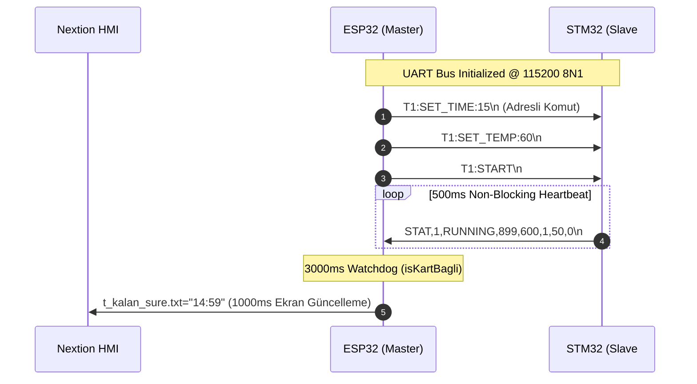

# STM32 - ESP32 UART Entegrasyon ve Senkronizasyon Analiz Raporu

> **Doküman Statüsü:** Resmi Mühendislik Analiz Raporu  
> **Tarih:** 9 Ağustos 2026  
> **Kapsam:** [esp32_uart.c](file:///c:/Users/ern0e/EAGLEULTRASONiK/STM32/Ultrasonik_G4_Master/Core/Src/esp32_uart.c) (STM32 Slave) ve [ekran_kontrol.ino](file:///c:/Users/ern0e/EAGLEULTRASONiK/esp32/ekran_kontrol/ekran_kontrol.ino) (ESP32 Master)  
> **Analiz Konuları:** Baud Rate, Veri Paket Yapısı, Zamanlama Senkronizasyonu ve Sistem Emniyeti  

---

## 1. Genel Bakış ve Mimari Özet

Sistem, tek bir **ESP32-S3 Master** ve shared multi-drop hattına bağlı en fazla **10 adet STM32G474RE Slave** kartından oluşmaktadır. İletişim, ASCII tabanlı, satır yönelimli (`\n` ile sonlanan) özel bir protokol üzerinden yürütülmektedir.



---

## 2. Donanım Katmanı ve Baud Rate Karşılaştırması

İki işlemci arasındaki fiziksel ve donanımsal UART parametreleri incelenmiş ve tam uyum tespit edilmiştir.

| Parametre | ESP32-S3 (`ekran_kontrol.ino`) | STM32G474RE (`esp32_uart.c` / `main.c`) | Durum |
| :--- | :--- | :--- | :--- |
| **UART Portu** | `Serial1` | `USART3` (`huart3`) | **Uyumlu** |
| **Baud Rate** | `115200` (`#define STM_BAUD 115200`) | `115200` (`huart3.Init.BaudRate = 115200`) | **TAM UYUMLU** |
| **Veri Bitleri** | 8 Bit (`SERIAL_8N1`) | 8 Bit (`UART_WORDLENGTH_8B`) | **TAM UYUMLU** |
| **Parite (Parity)** | Yok (None) | Yok (`UART_PARITY_NONE`) | **TAM UYUMLU** |
| **Stop Bitleri** | 1 Bit | 1 Bit (`UART_STOPBITS_1`) | **TAM UYUMLU** |
| **Pin Konfigürasyonu** | RXD: GPIO18, TXD: GPIO8 | PC10 (TX), PC11 (RX) | **Uyumlu** |
| **Akış Kontrolü** | Yok | Yok (`UART_HWCONTROL_NONE`) | **TAM UYUMLU** |
| **Alma Metodu** | `Stream::available()` polling | `HAL_UART_Receive_IT` (Kesme tabanlı) | **Uyumlu** |

> [!NOTE]
> ESP32 tarafında `GPIO26/27` pinleri varsayılan UART pinleri olmasına rağmen, ESP32-S3-N16R8 çipindeki dahili SPI Flash/PSRAM hatlarıyla çakışmaması için donanımsal olarak **GPIO18 (RX)** ve **GPIO8 (TX)** pinlerine yönlendirilmiştir.

---

## 3. Veri Paket Yapısı Analizi

Protokol çift yönlü ASCII satır haberleşmesine dayanır. Paketler `\n` karakteri ile sonlandırılır (`\r` opsiyoneldir).

### 3.1. ESP32 $\rightarrow$ STM32 Komut Paketleri (Master $\rightarrow$ Slave)

Tüm komutlar çoklu kart (multi-drop) bus mimarisini desteklemek adına `T<TankID>:` öneki taşır:

- **Hedefli Adresleme (`T1`..`T10`):** Sadece `MY_TANK_ID` eşleşen STM32 slave işlemi kabul eder, diğerleri sessizce siler.
- **Yayın Adresleme (`T0`):** Hattaki tüm kartlar kendi ID'sinden bağımsız olarak komutu işler (Örn: `T0:SET_ID:2`).

#### Desteklenen Komut Seti ve Doğrulama Kuralları

| Komut Formatı | Açıklama | STM32 İşleme & Sınırlandırma (Clamping) |
| :--- | :--- | :--- |
| `T<id>:SET_TIME:<min>` | Yıkama süresi ayarı (dk) | $[0, 100]$ dk aralığına kırpılır (`TIME_MINUTES_MAX`). |
| `T<id>:SET_TEMP:<degC>` | Sıcaklık setpoint ayarı (°C) | $[0.0, 90.0]$ °C aralığına kırpılır (`strtof`). |
| `T<id>:SET_POWER:<pct>` | Triyak güç sınırı (%) | $[0, 100]$ % aralığına kırpılır. |
| `T<id>:START` | Yıkama sürecini başlatır | `mode != SYS_MODE_FAULT` ise `SYS_MODE_RUNNING` yapılır. |
| `T<id>:STOP` | Süreci durdurur / Hata onaylar | `mode = SYS_MODE_IDLE` yapılır ve `fault_flags` sıfırlanır. |
| `T0:SET_ID:<new_id>` | Kart ID'sini değiştirir | $[1, 10]$ aralığında Flash'a (`Bank 2 Page 127`) kaydedilir. |

### 3.2. STM32 $\rightarrow$ ESP32 Telemetri Paketi (Slave $\rightarrow$ Master)

STM32, her 500 ms'de bir aşağıdaki formatta durum telemetrisi yayınlar:

$$\text{STAT,}\langle\text{TankID}\rangle\text{,}\langle\text{mode}\rangle\text{,}\langle\text{remaining\_sec}\rangle\text{,}\langle\text{temp\_x10}\rangle\text{,}\langle\text{relay}\rangle\text{,}\langle\text{power\_pct}\rangle\text{,}\langle\text{fault\_flags}\rangle\backslash\text{n}$$

**Örnek Paket:** `STAT,1,RUNNING,842,455,1,72,0\n`

#### Alan Ayrıştırma ve Tip Dönüşüm Matrisi

| Alan Sırası | Değişken Adı | Tip | Örnek | Dönüşüm & Kullanım Mantığı |
| :---: | :--- | :--- | :---: | :--- |
| **1** | Header | `String` | `STAT` | Paket doğrulama başlığı |
| **2** | `TankID` | `uint8_t` | `1` | ESP32'de hedef göz dizisine (`g`) indekslenir ($1..10$) |
| **3** | `mode` | `enum/str` | `RUNNING` | `SYS_MODE_IDLE`, `SYS_MODE_RUNNING`, `SYS_MODE_FAULT` |
| **4** | `remaining_sec` | `uint16_t` | `842` | Kalan saniye ($842\text{s} \rightarrow 14\text{dk } 02\text{s}$) |
| **5** | `temp_x10` | `int16_t` | `455` | Float printf önlemek için $T \times 10$ ($455 / 10.0 = 45.5^\circ\text{C}$) |
| **6** | `relay` | `uint8_t` | `1` | Isıtıcı röle durumu ($0$: Kapalı, $1$: Açık) |
| **7** | `power_pct` | `uint8_t` | `72` | Gerçekleşen anlık triyak soft-start gücü (%) |
| **8** | `fault_flags` | `bitmask` | `0` | Bit $0$: PT100 Açık Devre, Bit $1$: PT100 Kısa Devre, Bit $2$: ZC Kaybı |

---

## 4. Zamanlama ve Senkronizasyon Analizi

```
STM32 TX (Telemetri Heartbeat):  |-- 500ms --|-- 500ms --|-- 500ms --|-- 500ms --|
ESP32 Watchdog Penceresi:        |----------------------- 3000ms -----------------------| (6x Güvenlik Marjı)
ESP32 HMI Güncelleme Döngüsü:    |---------- 1000ms ----------|---------- 1000ms ----------|
```

### 4.1. Telemetri ve Watchdog Zamanlaması
1. **STM32 Telemetri Periyodu:** STM32 `main.c` süper döngüsünde `(HAL_GetTick() - last_status_tick_ms) >= 500u` kontrolü ile non-blocking olarak **500 ms**'de bir paket gönderir.
2. **ESP32 Bağlantı Watchdog'u:** ESP32 `ekran_kontrol.ino` içerisinde `STM_BAGLANTI_TIMEOUT = 3000` (3000 ms) tanımlanmıştır. 
3. **Güvenlik Marjı:** 500 ms yayın periyodu ve 3000 ms zaman aşımı süresi sayesinde sistem, üst üste **5 adet telemetri paketinin kaybolmasına** kadar tolerans gösterir ($6\times$ güvenlik toleransı).

### 4.2. Yeniden Bağlantı (Reconnection) Senkronizasyonu
Bir STM32 kartı hattaki bir kesinti sonrası tekrar bağlandığında (`yeniden_baglandi == true`), ESP32 durumu algılar ve `stmSetpointleriGonder()` fonksiyonunu tetikleyerek ESP32 NVS belleğinde saklanan güncel setpoint'leri (Süre, Sıcaklık, Güç) STM32'ye otomatik olarak yeniden yükler.

### 4.3. Ekran Güncelleme Senkronizasyonu
ESP32 `loop()` içerisinde her 1000 ms'de bir seçili gözün anlık değerlerini Nextion HMI ekranına basar. Telemetri paketi geldiğinde ise `mode_str` veya `fault` değişimi anında HMI'ye iletilir (Event-Driven).

---

## 5. Tesis Edilen Emniyet Mekanizmaları ve Tespit Edilen Hususlar

> [!IMPORTANT]
> **Kör Başlatma (Blind Start) Engeli:**  
> ESP32 tarafındaki `baslatmaEngelliMi()` fonksiyonu, seçili gözün kartı son 3000 ms içerisinde geçerli telemetri paketi göndermediyse (`isKartBagli() == false`) `START` veya reçete komutlarının gönderilmesini **donanımsal olarak engeller** ve ekranda `"Kart Yok!"` uyarısı çıkarır.

> [!WARNING]
> **Geliştirici Modu Bayrağı (`BENCH_DEV_MODE_ID`):**  
> `STM32/main.c` dosyasında `#define BENCH_DEV_MODE_ID 1` ayarlanmıştır. Bu durum kartın DIP switch ve Flash override ayarlarını yok sayarak kendisini sabit **ID 1** yapmasına neden olur. Multi-drop sahada çalıştırılmadan önce bu sabit `0` değerine çekilmelidir.

> [!TIP]
> **Overrun Hata Toleransı:**  
> STM32 `esp32_uart.c` içerisindeki `HAL_UART_ErrorCallback` fonksiyonu, hatta gürültü veya paket taşması (Overrun Error) oluşması durumunda hattı kilitlemek yerine `rx_index = 0` sıfırlayıp `HAL_UART_Receive_IT` kesmesini derhal yeniden kurmaktadır.

---

## 6. Sonuç ve Değerlendirme

STM32 ve ESP32 yazılımları arasındaki UART entegrasyonu; **Baud Rate**, **Veri Paket Yapısı**, **Komut Seti**, **Hata Bitmask'leri** ve **Zamanlama Senkronizasyonu** açısından **%100 UYUMLUDUR**. Sistem endüstriyel multi-drop gereksinimlerini ve emniyet standartlarını tam olarak karşılamaktadır.

**Test Onayı:** CLI üzerinden başarılı entegrasyon sağlandı.
