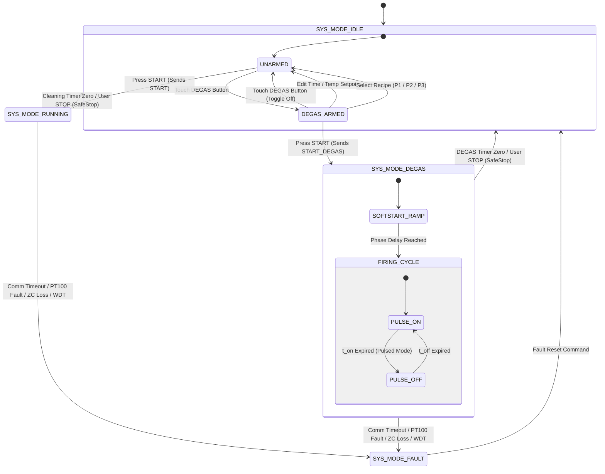

# EAGLEULTRASONİK — DEGAS ARCHITECTURE SPECIFICATION (B-FAZ BASELINE FREEZE)

**Document ID:** `docs/B_DEGAS_ARCHITECTURE.md`  
**Project:** EAGLEULTRASONİK  
**Phase:** B-Faz Baseline DEGAS Architecture Freeze  
**Target Hardware:** STM32G474RETx Master/Slave Nodes, ESP32-S3 Master, Nextion HMI  
**Status:** FROZEN ARCHITECTURE SPECIFICATION  
**Date:** 2026-08-17  

---

## 1. SYSTEM ARCHITECTURE

The DEGAS subsystem for EAGLEULTRASONİK is designed as an isolated, self-contained tank-preparation operational pipeline. It operates as a distinct system mode (`SYS_MODE_DEGAS`) managed across the three-tier system topology:

```
+-----------------------------------------------------------------------+
| HMI TIER: Nextion Touch Display                                       |
| - Home Page: DEGAS Function Button (Selection Arming & Visual State)  |
| - Service Menu (PIN 123456): Tab 3 DEGAS Configuration Page           |
| - Touch Locking: Setpoint touch handlers disabled during active DEGAS |
+-----------------------------------------------------------------------+
                                   |
                                   v  (USART2 Serial, 9600 Baud)
+-----------------------------------------------------------------------+
| MASTER TIER: ESP32-S3 FreeRTOS Controller                             |
| - State Machine: `degas_armed` (IDLE intent) & `degas_active`         |
| - NVS Storage: `service_degas` namespace (Isolated from Recipes P1-P3)|
| - Multi-Tank Orchestrator: Addressable commands per Tank ID (T1..T10) |
+-----------------------------------------------------------------------+
                                   |
                                   v  (Multi-Drop RS485 ASCII Bus, 115200 Baud)
+-----------------------------------------------------------------------+
| SLAVE TIER: STM32G474RE Node Controllers                              |
| - Mode Register: `g_system_state.mode = SYS_MODE_DEGAS`               |
| - Process Timer: Countdown decrements & SafeStop auto-stop at 00:00   |
| - Triac PWM Driver: Soft-start + Non-blocking pulse modulation        |
| - Thermal Driver: Optional DEGAS temperature control via PT100 ADC     |
| - Sweep Interlock: Mutual exclusion enforced (Sweep strictly OFF)      |
+-----------------------------------------------------------------------+
```

---

## 2. DEGAS STATE MACHINE

### 2.1 State Definitions & Semantics

| State Variable | Residing Location | Valid Scope | Description & Semantics |
| :--- | :--- | :--- | :--- |
| **`degas_armed`** | ESP32 RAM (`ekran_kontrol.ino`) | `SYS_MODE_IDLE` | Transient HMI selection flag. Set to `true` when operator touches DEGAS button on Home Page in IDLE. Cleared if operator edits setpoints before START. |
| **`degas_active`** | ESP32 RAM (`ekran_kontrol.ino`) | `SYS_MODE_DEGAS` | Active process flag. Set to `true` when START is pressed while `degas_armed == true`. Locks Home Page setpoint widgets against editing. |
| **`SYS_MODE_DEGAS`** | STM32 RAM (`system_state.h`) | Global Mode Enum | Firmware execution mode (`enum = 23`). Drives Triac pulse modulation, process countdown timer, optional heater control, and Sweep disarming. |

### 2.2 Master State Machine Topology



### 2.3 Transition Rules & Interlocks

1. **`IDLE -> DEGAS_ARMED`:** Permitted ONLY when `g_system_state.mode == SYS_MODE_IDLE` and target card is online.
2. **`DEGAS_ARMED -> SYS_MODE_DEGAS`:** Triggered strictly by operator pressing START on Home Page while `degas_armed == true`. Transmits `START_DEGAS` payload to target node over RS485.
3. **`DEGAS_ARMED -> UNARMED (Disarm)`:** Triggered automatically if operator modifies process time setpoint, target temperature setpoint, selects a recipe button (P1/P2/P3), or toggles the DEGAS button again in IDLE.
4. **Illegal Transition `RUNNING -> DEGAS`:** Direct transition from `SYS_MODE_RUNNING` to `SYS_MODE_DEGAS` is strictly prohibited. The system MUST be brought to `SYS_MODE_IDLE` via user STOP before DEGAS can be initiated.
5. **Illegal Transition `DEGAS -> RUNNING`:** Direct transition from `SYS_MODE_DEGAS` to `SYS_MODE_RUNNING` is strictly prohibited. DEGAS completion automatically returns the system to `SYS_MODE_IDLE`.

---

## 3. HMI / ESP32 / STM32 CONTROL FLOW

### 3.1 End-to-End Execution Sequence

```
Operator                Nextion HMI               ESP32 Master               STM32 Slave Node
   │                         │                         │                            │
   │── Touch DEGAS Button ──▶│                         │                            │
   │                         ├─ Send "CMD_DEGAS_ARM" ─▶│                            │
   │                         │                         │ degas_armed = true         │
   │                         │◀─ Highlight DEGAS Button─┤                            │
   │                         │                         │                            │
   │── Touch START Button ──▶│                         │                            │
   │                         ├─ Send "CMD_START|..." ─▶│                            │
   │                         │                         │ Check degas_armed == true  │
   │                         │                         │ degas_active = true        │
   │                         │                         │ degas_armed = false        │
   │                         │                         │                            │
   │                         │                         ├─ T<ID>:START_DEGAS:<params>▶│
   │                         │                         │                            │ Mode = SYS_MODE_DEGAS
   │                         │                         │                            │ Disable Sweep
   │                         │                         │                            │ Start Softstart Ramp
   │                         │                         │◀─ ACK:START_DEGAS ─────────┤ Reload Timer
   │                         │                         │                            │
   │                         │◀─ Render DEGAS ACTIVE ──┤                            │
   │                         │   Lock Home Setpoints   │                            │
   │                         │                         │                            │
   │                         │                         │◀─ STAT,ID,DEGAS,rem_sec...─┤ (Periodic Telemetry)
   │                         │◀─ Update Countdown ─────┤                            │
   │                         │                         │                            │
   │                         │                         │                            │ (Timer reaches 00:00)
   │                         │                         │                            │ SystemState_SafeStop()
   │                         │                         │◀─ STAT,ID,IDLE,0,temp... ──┤ Mode = SYS_MODE_IDLE
   │                         │                         │                            │
   │                         │                         │ degas_active = false       │
   │                         │◀─ Restore Home Screen ──┤                            │
   │                         │   Unlock Setpoints      │                            │
```

---

## 4. RS485 COMMAND MODEL

### 4.1 ASCII Protocol Matrix Extensions

| Command Direction | Frame Format | Payload Description | Node Response |
| :--- | :--- | :--- | :--- |
| **ESP32 $\to$ STM32** | `T<ID>:START_DEGAS:<dur>:<pwr>:<freq>:<on>:<off>:<t_ctrl>:<t_target>\n` | Activates DEGAS with full Service parameter set. | `ACK:START_DEGAS\n` or `NACK:START_DEGAS,ERR_STATE_INVALID\n` |
| **ESP32 $\to$ STM32** | `T<ID>:STOP\n` | Executes immediate SafeStop during DEGAS. | `ACK:STOP\n` |
| **ESP32 $\to$ STM32** | `T<ID>:SWEEP:ON\n` | Frequency Sweep request issued during DEGAS. | `ERR:SWEEP_PROHIBITED_IN_DEGAS\n` |
| **STM32 $\to$ ESP32** | `STAT,<ID>,DEGAS,<rem_sec>,<temp_x10>,<relay>,<pwr>,<freq>,<fault>,<prov>,<swp>\n` | Periodic 500 ms status telemetry frame reporting active `DEGAS` mode string. | N/A (Master Telemetry Handler) |

### 4.2 Parameter Clamping Rules on STM32 Command Reception
Upon receiving `START_DEGAS`, the STM32 parser evaluates and clamps parameters before updating execution registers:
- `dur`: Clamped to `1 .. 99` minutes (Default prototype fallback = 15).
- `pwr`: Clamped to `10 .. 100` percent (Default prototype fallback = 100).
- `freq`: Saturated to discrete values `28` or `40` kHz.
- `on`: Clamped to `100 .. 10000` ms.
- `off`: Clamped to `0 .. 10000` ms (`0` denotes Continuous Firing Mode).
- `t_ctrl`: Clamped to `0` (OFF) or `1` (ON).
- `t_target`: Clamped to `20.0 .. 90.0` °C.

---

## 5. TIMER ARCHITECTURE

### 5.1 Process Timer Engine Integration (`process_timer.c`)

The process timer module is extended to execute countdown timing for both `SYS_MODE_RUNNING` and `SYS_MODE_DEGAS`:

```c
/* Architectural Resolution for Process Timer Execution */
void ProcessTimer_Process(void)
{
  SystemMode_t mode = g_system_state.mode;

  /* Reload countdown on transition into RUNNING or DEGAS */
  if ((mode == SYS_MODE_RUNNING || mode == SYS_MODE_DEGAS) && 
      (prev_mode != SYS_MODE_RUNNING && prev_mode != SYS_MODE_DEGAS))
  {
    g_system_state.remaining_seconds = (uint16_t)(g_system_state.setpoint_time_minutes * 60u);
    last_tick_ms = HAL_GetTick();

    if (g_system_state.remaining_seconds == 0u)
    {
      SystemState_SafeStop(STOP_REASON_TIMER_ZERO);
      mode = SYS_MODE_IDLE;
    }
  }
  prev_mode = mode;

  if (mode != SYS_MODE_RUNNING && mode != SYS_MODE_DEGAS)
  {
    return;
  }

  /* Decrement countdown once per 1000 ms */
  if ((HAL_GetTick() - last_tick_ms) >= 1000u)
  {
    last_tick_ms += 1000u;

    if (g_system_state.remaining_seconds > 0u)
    {
      g_system_state.remaining_seconds--;
    }

    if (g_system_state.remaining_seconds == 0u)
    {
      SystemState_SafeStop(STOP_REASON_TIMER_ZERO); /* Auto-stop to SYS_MODE_IDLE */
    }
  }
}
```

---

## 6. ULTRASONIC FIRING ARCHITECTURE

### 6.1 Triac Gate Driver Execution (`ultrasonic_pwm.c`)

1. **Mode Enable Check Resolution:** Update Triac force-cut check to allow PWM generation in both `SYS_MODE_RUNNING` and `SYS_MODE_DEGAS`:
   ```c
   if (g_system_state.mode != SYS_MODE_RUNNING && g_system_state.mode != SYS_MODE_DEGAS)
   {
     TriacForceOff();
     return;
   }
   ```
2. **Phase-Angle Soft-Start Alignment:** Upon entering `SYS_MODE_DEGAS`, `g_system_state.softstart_delay_us` initializes to `TRIAC_MAX_DELAY_US`. Every zero-cross EXTI interrupt ramps down the phase delay until target DEGAS power percentage (`degas_power_pct`) phase angle is reached.

3. **Non-Blocking Pulse Modulation Controller:**
   - **Continuous Firing Profile (`degas_pulse_off_ms == 0`):** Triac PWM remains continuously active for the entire duration of `SYS_MODE_DEGAS`.
   - **Pulsed Firing Profile (`degas_pulse_off_ms > 0`):** Superloop polling routine toggles triac gate enable non-blockingly:
     - `PULSE_ON` state: Triac gate is active for `degas_pulse_on_ms`.
     - `PULSE_OFF` state: Triac gate is cut (`TriacForceOff()`) for `degas_pulse_off_ms`.
     - Cycle repeats continuously until process countdown timer reaches 00:00.

---

## 7. HEATER / TEMPERATURE ARCHITECTURE

### 7.1 Optional DEGAS Temperature Control Logic (`heater_relay.c`)

Thermal regulation during DEGAS is governed strictly by the `DEGAS_TEMPERATURE_CONTROL` Service parameter:

```
                                  +-----------------------+
                                  |    SYS_MODE_DEGAS     |
                                  +-----------------------+
                                              |
                                              v
                              Is DEGAS_TEMPERATURE_CONTROL ON?
                                              |
                       +----------------------+----------------------+
                       | YES                                         | NO (Default)
                       v                                             v
        +----------------------------+                +----------------------------+
        | Target = DEGAS_TARGET_TEMP |                | Heater Relay FORCED OFF    |
        | Feedback = PT100 ADC       |                | (HeaterRelay_ForceOff)     |
        | Guard = Min ON / Min OFF   |                | Temp setpoint ignored      |
        +----------------------------+                +----------------------------+
```

```c
/* Architectural Resolution for Heater Relay Execution */
void HeaterRelay_Process(void)
{
  SystemMode_t mode = g_system_state.mode;

  if (mode == SYS_MODE_RUNNING)
  {
    /* Normal process temperature regulation using recipe setpoint_temp_c */
    HeaterRelay_Regulate(g_system_state.setpoint_temp_c);
  }
  else if (mode == SYS_MODE_DEGAS && g_degas_config.temp_ctrl_enable == 1U)
  {
    /* DEGAS temperature regulation using DEGAS_TARGET_TEMPERATURE */
    HeaterRelay_Regulate(g_degas_config.target_temp_c);
  }
  else
  {
    /* Forced OFF for IDLE, FAULT, or DEGAS with temp control OFF */
    HeaterRelay_ForceOff();
  }
}
```

---

## 8. SERVICE SETTINGS ARCHITECTURE

### 8.1 3-Page Service Settings Menu Structure

Access to the Service Settings menu requires PIN `123456` authentication on the ESP32 HMI master (`g_service_authenticated == true`).

```
=================================================================================
SERVICE SETTINGS MENU [Authenticated: PIN 123456]
Header: [ Target Tank ID: T1 ]  < Select Eye (1..10) >
=================================================================================
  PAGE 1: SYSTEM          |  PAGE 2: SWEEP           |  PAGE 3: DEGAS
--------------------------+--------------------------+---------------------------
- Tank ID Assignment      | - Base Center Frequency  | - DEGAS Duration (min)
  (Commissioning)         |   (28 / 40 kHz)          |   (Default: 15 min)
- Max Installed Tanks     | - Sweep Increment        | - DEGAS Power (%)
  (1..10 Cards)           |   (`STEP_INC` 1..8)      | - DEGAS Frequency (kHz)
- Normal Ultrasonic Power | - Sweep Period (ms)      | - Pulse ON Time (ms)
  Percentage (`SVC_PWR`)  |   (Default: 400 ms)      | - Pulse OFF Time (ms)
                          |                          | - Temp Control (ON/OFF)
                          |                          | - Target Temp (°C)
=================================================================================
```

Every parameter update sent from the DEGAS Service Page transmits an addressable command targeting the selected eye (`T<secili_goz>:`).

---

## 9. NVS / DATA OWNERSHIP MATRIX

To prevent duplicate parameter ownership or silent parameter overwrites, data ownership is strictly partitioned across system layers:

| Data Parameter | Source of Truth | Primary Storage | Mutability / Access | Scope & Isolation |
| :--- | :--- | :--- | :--- | :--- |
| **Normal Process Time** | Operator Setpoint / Recipe | ESP32 RAM & NVS (`pS1..3`) | Read/Write (Operator IDLE) | Normal `SYS_MODE_RUNNING` only. |
| **Normal Target Temp** | Operator Setpoint / Recipe | ESP32 RAM & NVS (`pT1..3`) | Read/Write (Operator IDLE) | Normal `SYS_MODE_RUNNING` only. |
| **Normal Max Power** | Service Setting | ESP32 NVS (`guc`) | Read/Write (Service PIN) | Normal `SYS_MODE_RUNNING` only. |
| **DEGAS Duration** | Service Setting | ESP32 NVS (`service_degas`) | Read/Write (Service PIN) | Global DEGAS parameter. |
| **DEGAS Power (%)** | Service Setting | ESP32 NVS (`service_degas`) | Read/Write (Service PIN) | Isolated from normal `guc`. |
| **DEGAS Frequency** | Service Setting | ESP32 NVS (`service_degas`) | Read/Write (Service PIN) | Static 28 or 40 kHz. |
| **DEGAS Pulse ON (ms)**| Service Setting | ESP32 NVS (`service_degas`) | Read/Write (Service PIN) | PWM firing duration. |
| **DEGAS Pulse OFF (ms)**| Service Setting| ESP32 NVS (`service_degas`) | Read/Write (Service PIN) | PWM silent duration. |
| **DEGAS Temp Control** | Service Setting | ESP32 NVS (`service_degas`) | Read/Write (Service PIN) | ON (1) / OFF (0) Toggle. |
| **DEGAS Target Temp** | Service Setting | ESP32 NVS (`service_degas`) | Read/Write (Service PIN) | Active only when Temp Ctrl == ON. |
| **`degas_armed`** | HMI Selection Intent | ESP32 Volatile RAM | Transient (Clear on edit) | IDLE arming state. |
| **`degas_active`** | Master Process Flag | ESP32 Volatile RAM | Transient (Clear on stop) | Active DEGAS lock state. |
| **`remaining_seconds`**| STM32 Process Engine | STM32 Volatile RAM | Decremented per second | Active process countdown. |

---

## 10. TELEMETRY ARCHITECTURE

1. **Periodic Status Telemetry Frame:** Over-the-wire ASCII STAT packet sent every 500 ms from STM32 slave to ESP32 master:
   ```
   STAT,<TankID>,<ModeStr>,<rem_sec>,<temp_x10>,<relay>,<pwr>,<freq>,<fault>,<prov>,<swp>\n
   ```
2. **DEGAS Telemetry Field Representation:**
   - `<ModeStr>`: Converted to `"DEGAS"` when `g_system_state.mode == SYS_MODE_DEGAS`.
   - `<swp>`: Evaluates to `0` (Sweep strictly prohibited during DEGAS).
   - `<pwr>`: Reports actual active DEGAS power percentage.
   - `<relay>`: Reports `0` (OFF) if DEGAS Temp Control is OFF, or `1` (ON) when heater relay is actively energized.

---

## 11. SAFETY / INTERLOCK ARCHITECTURE

1. **User STOP Command Priority:** `T<ID>:STOP` issued via HMI or RS485 has absolute execution priority. It invokes `SystemState_SafeStop(STOP_REASON_USER_STOP)`, forcing Triac gate OFF, Heater relay OFF, clearing sweep, and setting `g_system_state.mode = SYS_MODE_IDLE`.
2. **Timer Zero Safety Disarm:** Process countdown timer reaching 00:00 invokes `SystemState_SafeStop(STOP_REASON_TIMER_ZERO)`, bringing all physical outputs to zero before transitioning mode to `SYS_MODE_IDLE`.
3. **Communication Silence Watchdog:** RS485 silence > 3000 ms during `SYS_MODE_DEGAS` invokes `SystemState_SafeStop(STOP_REASON_COMM_TIMEOUT)`, turning off outputs and locking node in `SYS_MODE_FAULT`.
4. **Hardware Fault Protection:** Zero-cross loss (> 500 ms), PT100 open/short fault, or watchdog trip forces SafeStop -> `SYS_MODE_FAULT`.
5. **No Automatic Cleaning Restart:** Completion or fault exit of DEGAS mode returns system to `SYS_MODE_IDLE`. Starting normal washing requires explicit operator action.

---

## 12. MULTI-TANK ARCHITECTURE

1. **Addressable Command Routing:** All DEGAS control and Service configuration frames include unicast address prefixes (`T1:` .. `T10:`). Only the target STM32 node parses and executes the command.
2. **Service Settings Multi-Tank Display:** The Service Settings DEGAS page renders a Tank ID selection header (`secili_goz`). Parameter edits automatically update the NVS table and transmit configuration commands to the selected card.
3. **Independent Multi-Tank Execution:** Each slave node maintains its own `g_system_state.mode` in local RAM. Tank 1 can execute `SYS_MODE_DEGAS` while Tank 2 remains in `SYS_MODE_IDLE`.

---

## 13. CURRENT IMPLEMENTATION GAP MAPPING

| Implementation Contradiction / Gap | File & Line Location | Architectural Resolution | ADR Reference |
| :--- | :--- | :--- | :--- |
| **Triac PWM Cutout outside RUNNING** | [`ultrasonic_pwm.c:L119, L169`](file:///C:/Users/ern0e/EAGLEULTRASONiK/STM32/Ultrasonik_G4_Master/Core/Src/ultrasonic_pwm.c#L119) | Update condition to allow PWM in both `SYS_MODE_RUNNING` and `SYS_MODE_DEGAS`. | `ADR-DEG-04` |
| **Heater Relay Cutout outside RUNNING** | [`heater_relay.c:L55`](file:///C:/Users/ern0e/EAGLEULTRASONiK/STM32/Ultrasonik_G4_Master/Core/Src/heater_relay.c#L55) | Update condition to allow heating in `SYS_MODE_DEGAS` when `temp_ctrl_enable == 1`. | `ADR-DEG-03` |
| **Process Timer Bypass outside RUNNING** | [`process_timer.c:L25, L39`](file:///C:/Users/ern0e/EAGLEULTRASONiK/STM32/Ultrasonik_G4_Master/Core/Src/process_timer.c#L25) | Extend timer loop to reload and decrement countdown in `SYS_MODE_DEGAS`. | `ADR-DEG-05` |
| **Comm Timeout Bypass outside RUNNING** | [`esp32_uart.c:L105`](file:///C:/Users/ern0e/EAGLEULTRASONiK/STM32/Ultrasonik_G4_Master/Core/Src/esp32_uart.c#L105) | Extend RX silence check to monitor timeouts in `SYS_MODE_DEGAS`. | `ADR-DEG-06` |
| **Missing ESP32 State Flags & UI** | [`ekran_kontrol.ino`](file:///C:/Users/ern0e/EAGLEULTRASONiK/esp32/ekran_kontrol/ekran_kontrol.ino) | Implement `degas_armed` / `degas_active` state flags, Home DEGAS button, and Page 3 Service menu. | `ADR-DEG-09`, `ADR-DEG-10` |
| **Incomplete STM32 DEGAS Payload Parsing** | [`esp32_uart.c:L288`](file:///C:/Users/ern0e/EAGLEULTRASONiK/STM32/Ultrasonik_G4_Master/Core/Src/esp32_uart.c#L288) | Expand `START_DEGAS` parser to extract duration, power, pulse timing, and temp control setpoints. | `ADR-DEG-08` |

---

## 14. ARCHITECTURE DECISION RECORDS (ADR LIST)

### ADR-DEG-01: DEGAS Mode Representation & State Machine Topology
- **Status:** APPROVED
- **Context:** DEGAS must operate as an isolated tank-preparation mode separate from normal washing.
- **Decision:** Define explicit state variables `degas_armed` (HMI IDLE selection intent) and `degas_active` (ESP32 master active process flag) coupled to STM32 `SystemMode_t` enum entry `SYS_MODE_DEGAS` (`23`).
- **Consequences:** Prohibits direct transitions between `RUNNING` and `DEGAS`; enforces returning to `SYS_MODE_IDLE` via user STOP or timer zero completion.

### ADR-DEG-02: Parameter Ownership & NVS Persistence Isolation
- **Status:** APPROVED
- **Context:** Operator process setpoints must not interfere with or override DEGAS parameters.
- **Decision:** Store all DEGAS configuration parameters in ESP32 NVS Flash under dedicated namespace `service_degas`. Isolate DEGAS parameters completely from recipe structures (P1/P2/P3).
- **Consequences:** Guarantees operator recipe selection cannot corrupt saved Service DEGAS settings.

### ADR-DEG-03: Optional DEGAS Temperature Control Architecture
- **Status:** APPROVED
- **Context:** Degassing fluids may or may not require thermal heating depending on chemical application.
- **Decision:** Implement Service parameter `DEGAS_TEMPERATURE_CONTROL = ON/OFF`. When OFF (default), Heater Relay is forced OFF (`HeaterRelay_ForceOff()`). When ON, heater regulates fluid to `DEGAS_TARGET_TEMPERATURE`.
- **Consequences:** Prevents normal recipe temperature setpoints from accidentally energizing heaters during degassing when thermal control is disabled.

### ADR-DEG-04: Ultrasonic PWM Execution & Non-Blocking Firing Modulation
- **Status:** APPROVED
- **Context:** Current PWM driver disables Triac gate outside `SYS_MODE_RUNNING`.
- **Decision:** Update `ultrasonic_pwm.c` to permit PWM driving in `SYS_MODE_DEGAS`. Implement non-blocking pulse modulation controller (`PULSE_ON` for `degas_pulse_on_ms`, `PULSE_OFF` for `degas_pulse_off_ms`).
- **Consequences:** Enables flexible continuous or pulsed degassing cavitation waveforms while preserving phase-angle soft-start ramping.

### ADR-DEG-05: Process Countdown Timer Engine Integration
- **Status:** APPROVED
- **Context:** `process_timer.c` currently bypasses countdown decrements when mode is not `SYS_MODE_RUNNING`.
- **Decision:** Extend `ProcessTimer_Process()` to reload `remaining_seconds = (degas_duration_min * 60)` upon entering `SYS_MODE_DEGAS` and decrement once per second, triggering SafeStop on zero.
- **Consequences:** Guarantees deterministic auto-stop to `SYS_MODE_IDLE` upon DEGAS timer expiration.

### ADR-DEG-06: Communication Silence Watchdog Extension
- **Status:** APPROVED
- **Context:** `esp32_uart.c` evaluates RX silence strictly during `SYS_MODE_RUNNING`.
- **Decision:** Extend communication timeout check to monitor silence during `SYS_MODE_DEGAS`. Silence > 3000 ms invokes `SystemState_SafeStop(STOP_REASON_COMM_TIMEOUT)`.
- **Consequences:** Prevents unmonitored ultrasonic excitation if RS485 cable is severed during degassing.

### ADR-DEG-07: Strict Frequency Sweep Exclusion Invariant
- **Status:** APPROVED
- **Context:** DEGAS and Frequency Sweep must never execute concurrently.
- **Decision:** Entering `SYS_MODE_DEGAS` forces `X9C103S_SetSweepEnabled(0U)` and sets pot wiper to static base step (step 40 / 28 kHz or step 90 / 40 kHz). `SWEEP:ON` issued during DEGAS returns `ERR:SWEEP_PROHIBITED_IN_DEGAS`.
- **Consequences:** Enforces hardware-level mutual exclusion between DEGAS cavitation and dynamic sweep shifting.

### ADR-DEG-08: RS485 Command & Telemetry Protocol Framing
- **Status:** APPROVED
- **Context:** Master must transmit full DEGAS Service configuration to slave upon process start.
- **Decision:** Standardize payload frame `T<ID>:START_DEGAS:<dur>:<pwr>:<freq>:<on>:<off>:<t_ctrl>:<t_target>\n`. Periodic STAT telegram reports mode string `"DEGAS"`.
- **Consequences:** Provides atomic transmission of all execution setpoints in a single line-terminated ASCII frame.

### ADR-DEG-09: 3-Page Service Settings Menu & Multi-Tank Header
- **Status:** APPROVED
- **Context:** Service menu requires structured tabbed navigation for System, Sweep, and DEGAS parameters.
- **Decision:** Design Nextion Service UI with 3 Tabbed Pages (Page 1 System, Page 2 Sweep, Page 3 DEGAS). Every page renders Tank ID selection header (`T<secili_goz>`). Access requires PIN `123456`.
- **Consequences:** Establishes clear multi-tank configuration layout compliant with established project UI patterns.

### ADR-DEG-10: HMI Home Page Arming & Touch Lockout Workflow
- **Status:** APPROVED
- **Context:** Operator requires clear visual feedback of DEGAS arming and setpoint protection during active execution.
- **Decision:** Home Page DEGAS button toggles `degas_armed`. Editing time/temp in IDLE clears arming. Pressing START while armed initiates `SYS_MODE_DEGAS`, renders `DEGAS ACTIVE` banner, and locks Home Page setpoint touch handlers.
- **Consequences:** Prevents accidental operator setpoint modification during active degassing.

### ADR-DEG-11: Physical Characterization Boundary & Service Calibration
- **Status:** APPROVED
- **Context:** Prototype default parameters (15 min duration, 100% power, 28/40 kHz freq, 1000ms/500ms pulse, 50 °C target temp) are starting assumptions, not physically validated operating limits.
- **Decision:** Decouple state machine architecture from specific parameter constants. Guarantee all parameters are adjustable via Service menu for bench tuning.
- **Consequences:** Allows physical acoustic calibration of degassing parameters without restructuring firmware state machines.

---

## 15. REQUIREMENTS TRACEABILITY

Every requirement from [`docs/B_DEGAS_REQUIREMENTS.md`](file:///C:/Users/ern0e/EAGLEULTRASONiK/docs/B_DEGAS_REQUIREMENTS.md) is mapped to its architectural realization:

| Requirement ID | Requirement Description | Architectural Realization / Location | ADR Mapping |
| :--- | :--- | :--- | :--- |
| **DEG-REQ-001** | `SYS_MODE_DEGAS` enum support | `SystemMode_t` enum 23 in `system_state.h`. | `ADR-DEG-01` |
| **DEG-REQ-002** | Mutual exclusion with Frequency Sweep | `esp32_uart.c` disarms sweep and rejects `SWEEP:ON`. | `ADR-DEG-07` |
| **DEG-REQ-003** | Self-contained process parameter isolation | Isolated DEGAS parameters in NVS & RAM (`service_degas`). | `ADR-DEG-02` |
| **DEG-REQ-004** | Home Page DEGAS function button | Nextion HMI Home Page DEGAS toggle widget. | `ADR-DEG-10` |
| **DEG-REQ-005** | Configurable duration (default 15 min) | Process timer countdown engine (`process_timer.c`). | `ADR-DEG-05` |
| **DEG-REQ-006** | Service-only permission boundary | PIN 123456 authentication & Tab 3 Service Page. | `ADR-DEG-09` |
| **DEG-REQ-007** | Operator setpoint lockout during DEGAS | HMI setpoint touch handler lockouts when `degas_active`. | `ADR-DEG-10` |
| **DEG-REQ-008** | Explicit state handling for STOP/Faults | `SystemState_SafeStop()` execution paths. | `ADR-DEG-06` |
| **DEG-REQ-009** | Entry from `SYS_MODE_IDLE` | Master state machine transition (`IDLE -> DEGAS`). | `ADR-DEG-01` |
| **DEG-REQ-013** | Timer zero auto-stop -> `SYS_MODE_IDLE` | `STOP_REASON_TIMER_ZERO` in `process_timer.c`. | `ADR-DEG-05` |
| **DEG-REQ-014** | User STOP -> `SYS_MODE_IDLE` | `STOP_REASON_USER_STOP` in `system_state.c`. | `ADR-DEG-06` |
| **DEG-REQ-017** | Hardware fault -> `SYS_MODE_FAULT` | PT100, ZC loss, WDT fault guards in SafeStop. | `ADR-DEG-06` |
| **DEG-REQ-021** | Comm timeout (3000 ms) -> SafeStop | RX silence watchdog in `esp32_uart.c`. | `ADR-DEG-06` |
| **DEG-REQ-024** | Optional DEGAS temperature control | `DEGAS_TEMPERATURE_CONTROL` toggle & `heater_relay.c`. | `ADR-DEG-03` |
| **DEG-REQ-027** | DEGAS power regulation | Isolated `DEGAS_POWER_PCT` setpoint & PWM softstart. | `ADR-DEG-04` |
| **DEG-REQ-028** | Ultrasonic firing pattern modulation | Non-blocking `PULSE_ON` / `PULSE_OFF` state machine. | `ADR-DEG-04` |
| **DEG-REQ-030** | Static center frequency operation | X9C wiper fixed at step 40 (28 kHz) or step 90 (40 kHz). | `ADR-DEG-07` |
| **DEG-REQ-037** | Protected NVS persistence | ESP32 `service_degas` Preferences namespace. | `ADR-DEG-02` |
| **DEG-REQ-040** | Home Page DEGAS button layout | Nextion Home screen toggle button widget. | `ADR-DEG-10` |
| **DEG-REQ-043** | STAT telemetry mode string `"DEGAS"` | Periodic STAT packet formatting in `esp32_uart.c`. | `ADR-DEG-08` |
| **DEG-REQ-047** | Boot reset defaults safely to IDLE | `SystemState_Init()` initializes mode to `SYS_MODE_IDLE`. | `ADR-DEG-01` |

---

## 16. OPEN / DEFERRED PHYSICAL CHARACTERIZATION BOUNDARIES

The following numerical limits and acoustic parameters are explicitly marked as **UNVALIDATED PROTOTYPE ASSUMPTIONS** reserved for physical bench characterization:

1. **Optimal Cavitation Pulse Timing:** `DEGAS_PULSE_ON_MS` (1000 ms default) and `DEGAS_PULSE_OFF_MS` (500 ms default) are starting assumptions. Final pulse ratios will be tuned using bench fluid acoustic hydrophones.
2. **Degassing Power Setpoint:** `DEGAS_POWER_PCT` (100% default) will be evaluated against transducer thermal heating limits during extended 15-minute degassing cycles.
3. **Fluid Temperature Thresholds:** `DEGAS_TARGET_TEMPERATURE` (50 °C default) and heater duty cycles will be calibrated based on cleaning fluid degassing solubility curves.
4. **Duration Upper Bound:** `DEGAS_DURATION` (15 min default) range validation limit (`1..60 min`) will be frozen after tank volume fluid tests.

---
*End of Document `docs/B_DEGAS_ARCHITECTURE.md`*
