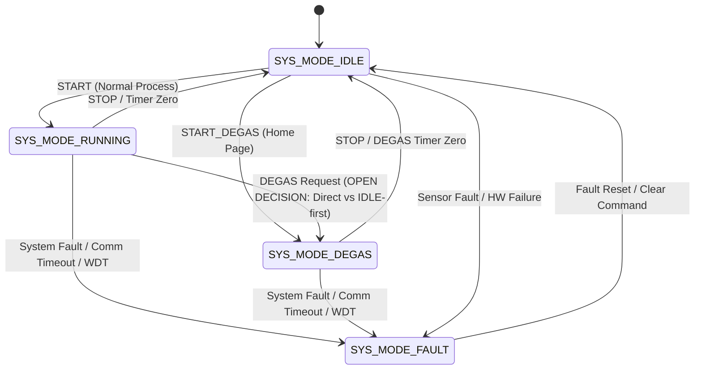

# EAGLEULTRASONİK — DEGAS REQUIREMENTS SPECIFICATION (B-FAZ BASELINE FREEZE)

**Document ID:** `docs/B_DEGAS_REQUIREMENTS.md`  
**Project:** EAGLEULTRASONİK  
**Phase:** B-Faz Baseline DEGAS Requirements Capture & Freeze  
**Target Hardware:** STM32G474RETx Master/Slave Nodes, ESP32-S3 Master, Nextion HMI  
**Status:** FROZEN BASELINE (REQUIREMENTS SPECIFICATION)  
**Date:** 2026-08-17  

---

## 1. SCOPE

### 1.1 Purpose
This document formally defines, structures, and freezes the prototype-level **DEGAS (Liquid Degassing)** requirements for the EAGLEULTRASONİK system. The objective is to convert all established user decisions and source-derived constraints into a precise, traceable requirements specification with stable identifiers (`DEG-REQ-001` onward), clear ownership boundaries, and zero unresolved behavioral ambiguity prior to B5 Architecture definition.

### 1.2 Scope
The scope of this requirements document encompasses:
- System operational mode definition and state machine transitions for `SYS_MODE_DEGAS`.
- Strict mutual exclusion interlocks between DEGAS mode and Frequency Sweep (`x9c103s.c`, `x9c103s.h`).
- Parameter isolation and permission boundaries between Operator and Service/Technician access levels.
- Interaction of DEGAS with ultrasonic power generation, phase-angle soft-start, thermal control, and process timing.
- Safety interlocks including user STOP, timer zero completion, system faults, and RS485 communication timeouts.
- ESP32-S3 Master and Nextion HMI Home-page interface expectations.
- Identification, classification, and formal registration of all **OPEN DECISION** items blocking B5 Architecture definition.
- Cross-examination of the current prototype firmware baseline to document existing implementation contradictions without modifying production code.

---

## 2. DEGAS TERMINOLOGY

| Term / Symbol | Definition |
| :--- | :--- |
| **DEGAS Mode** | A specialized liquid degassing operating profile (`SYS_MODE_DEGAS`) designed to drive ultrasonic cavitation in pulsed or specialized patterns to release dissolved gases from fluid prior to ultrasonic cleaning. |
| **`SYS_MODE_DEGAS`** | Distinct enumeration entry in `SystemMode_t` (`system_state.h`) representing active DEGAS process execution. |
| **Frequency Sweep** | Dynamic frequency oscillation mechanism managed by the X9C103S digital potentiometer (`x9c103s.c`). |
| **Mutual Exclusion** | System interlock invariant ensuring DEGAS mode and Frequency Sweep can never be active simultaneously under any condition. |
| **Operator Access** | Restricted HMI access level permitted to select recipes (P1/P2/P3), trigger START/STOP, and activate DEGAS, but forbidden from editing DEGAS or Service parameters. |
| **Service Settings** | Password-protected non-volatile configuration store owned exclusively by technicians/service personnel. |
| **SafeStop** | Emergency/safety disarm routine (`SystemState_SafeStop()`) that cuts triac PWM, turns off heater relay, resets soft-start ramp, and forces static frequency. |
| **STAT Telegram** | Periodic telemetry ASCII string transmitted over RS485 from STM32 slave to ESP32 master reporting mode, temperature, power, and fault flags. |

---

## 3. REQUIREMENT TABLE

Requirement status values are strictly classified as either **FROZEN** (explicitly decided by user or derived from authoritative system invariants) or **OPEN DECISION** (unresolved parameter, boundary, or behavioral policy requiring B5 resolution).

| ID | Requirement | Source Decision | Priority | Owner | Verification Method | Status |
| :--- | :--- | :--- | :--- | :--- | :--- | :--- |
| **DEG-REQ-001** | DEGAS shall be implemented as a distinct, self-contained system operating mode identified by `SYS_MODE_DEGAS` in `SystemMode_t`. | Frozen User Decision #1 | P1 | System Architect | Code Inspection & Telemetry Audit | **FROZEN** |
| **DEG-REQ-002** | DEGAS mode and Frequency Sweep shall be strictly mutually exclusive. Frequency Sweep shall not be enabled during DEGAS, and DEGAS shall not coexist with active Sweep. | Frozen User Decision #2 | P1 | System Architect | HIL Pytest & State Machine Audit | **FROZEN** |
| **DEG-REQ-003** | DEGAS mode shall be a self-contained process mode. Once DEGAS is active, normal operator process settings (normal time, normal temp, normal power setpoints) shall not override DEGAS operation. | Frozen User Decision #3 | P1 | stm32-specialist | Parameter Lock Interlock Test | **FROZEN** |
| **DEG-REQ-004** | DEGAS control shall appear on the HMI Main/Home page as a dedicated function button accessible to the operator. | Frozen User Decision #4 | P1 | esp32-hmi-specialist | Nextion HMI Visual Audit | **FROZEN** |
| **DEG-REQ-005** | DEGAS process duration shall be a configurable parameter, with a default prototype value of 15 minutes. | Frozen User Decision #5 | P1 | System Architect | NVS Storage & Timer Audit | **FROZEN** |
| **DEG-REQ-006** | DEGAS configuration parameters (duration, power, thermal behavior) shall belong exclusively to protected Service Settings. The operator shall have NO permission to edit stored DEGAS configuration. | Frozen User Decision #6 | P1 | esp32-hmi-specialist | HMI Security Access Test | **FROZEN** |
| **DEG-REQ-007** | During active DEGAS, the operator shall be strictly prohibited from overriding process parameters (Sweep toggle, process time, target temperature, ultrasonic power) from the Home Page. | Frozen User Decision #7 | P1 | esp32-hmi-specialist | UI Touch Lock Verification | **FROZEN** |
| **DEG-REQ-008** | The system shall provide explicit state handling for DEGAS START, DEGAS STOP, Timer completion, System Fault, Communication loss, Power/Frequency behavior, and Power-Cycle restart. | Frozen User Decision #8 | P1 | System Architect | HIL Fault Injection Suite | **FROZEN** |
| **DEG-REQ-009** | Entry into DEGAS mode shall be permitted from `SYS_MODE_IDLE` upon receiving a valid DEGAS activation request from the HMI or RS485 bus. | Derived from System State | P1 | stm32-specialist | RS485 Protocol Test | **FROZEN** |
| **DEG-REQ-010** | Transitioning to DEGAS mode while normal `SYS_MODE_RUNNING` is active (whether rejected, requiring explicit STOP first, or auto-stopping normal process) requires resolution prior to B5 Architecture. | Open Decision Assessment | P2 | System Architect | Requirements Architecture Audit | **OPEN DECISION** |
| **DEG-REQ-011** | The allowed configurable integer range for DEGAS duration (e.g., 1..60 minutes vs 1..99 minutes) requires explicit numerical bounds freeze before B5. | Open Decision Assessment | P2 | System Architect | Config Validation Audit | **OPEN DECISION** |
| **DEG-REQ-012** | Whether DEGAS countdown uses the shared `g_system_state.remaining_seconds` process timer variable or a dedicated DEGAS timer instance requires B5 architectural resolution. | Open Decision Assessment | P2 | stm32-specialist | Firmware Architecture Audit | **OPEN DECISION** |
| **DEG-REQ-013** | Upon DEGAS timer expiration (countdown reaching zero), the system shall automatically execute SafeStop (`STOP_REASON_TIMER_ZERO`) and transition mode to `SYS_MODE_IDLE`. | System Safety Invariant | P1 | stm32-specialist | Timer Zero HIL Test | **FROZEN** |
| **DEG-REQ-014** | If the operator presses STOP during active DEGAS, the system shall immediately invoke `SystemState_SafeStop(STOP_REASON_USER_STOP)`, cut ultrasonic and heater outputs, and transition to `SYS_MODE_IDLE`. | System Safety Invariant | P1 | stm32-specialist | User STOP HIL Test | **FROZEN** |
| **DEG-REQ-015** | Pressing the normal START button on the HMI Home page while DEGAS is complete and in `SYS_MODE_IDLE` (whether it restarts normal process or re-triggers DEGAS) requires resolution prior to B5. | Open Decision Assessment | P2 | esp32-hmi-specialist | HMI UX State Audit | **OPEN DECISION** |
| **DEG-REQ-016** | Whether DEGAS can be restarted immediately post-completion without reselecting the DEGAS mode button requires explicit policy freeze. | Open Decision Assessment | P2 | esp32-hmi-specialist | HMI UX State Audit | **OPEN DECISION** |
| **DEG-REQ-017** | Any hardware or software fault occurring during DEGAS (PT100 fault, zero-cross loss, watchdog reset) shall invoke `SystemState_SafeStop()` and transition mode to `SYS_MODE_FAULT`. | System Safety Invariant | P1 | stm32-specialist | Fault Injection Suite | **FROZEN** |
| **DEG-REQ-018** | Zero-cross loss during DEGAS (> 500 ms EXTI silence) shall immediately trigger `SystemState_SafeStop(STOP_REASON_FAULT)` with `FAULT_ZERO_CROSS_LOST`. | Hardware Guard Rules | P1 | stm32-specialist | Zero-Cross Disconnect Test | **FROZEN** |
| **DEG-REQ-019** | PT100 sensor open/short failure during DEGAS shall trigger `SystemState_SafeStop(STOP_REASON_SENSOR_FAULT)` and set `FAULT_PT100_OPEN` or `FAULT_PT100_SHORT`. | Hardware Guard Rules | P1 | stm32-specialist | Sensor Fault Injection Test | **FROZEN** |
| **DEG-REQ-020** | Hardware Watchdog (IWDG) reset during DEGAS shall force system restart into `SYS_MODE_FAULT` with `FAULT_WATCHDOG_RESET`. | Hardware Guard Rules | P1 | stm32-specialist | Watchdog Timeout Test | **FROZEN** |
| **DEG-REQ-021** | If RS485 communication silence exceeds 3000 ms during active DEGAS, the STM32 slave shall execute `SystemState_SafeStop(STOP_REASON_COMM_TIMEOUT)` and transition to `SYS_MODE_FAULT`. | Protocol Safety Baseline | P1 | communication-specialist | RS485 RX Silence HIL Test | **FROZEN** |
| **DEG-REQ-022** | Dedicated RS485 command structure for DEGAS control (`T<ID>:MODE:DEGAS`, `T<ID>:START_DEGAS`, `T<ID>:STOP_DEGAS`) shall be formally standardized in the ASCII bus matrix. | Protocol Safety Baseline | P1 | communication-specialist | RS485 Framing Test | **FROZEN** |
| **DEG-REQ-023** | Telemetry response while in DEGAS mode shall report `MODE:DEGAS` in periodic STAT telegrams sent over RS485. | Protocol Safety Baseline | P1 | communication-specialist | Telemetry Parsing Test | **FROZEN** |
| **DEG-REQ-024** | Thermal heater behavior during DEGAS (whether heater relay remains OFF, maintains normal setpoint, or follows a dedicated Service DEGAS temperature) requires resolution before B5. | Open Decision Assessment | P1 | system-architect | Thermal Control Audit | **OPEN DECISION** |
| **DEG-REQ-025** | PT100 temperature monitoring and over-temperature safety limits shall remain fully active during DEGAS regardless of heater relay state. | Thermal Safety Invariant | P1 | stm32-specialist | Over-temp Injection Test | **FROZEN** |
| **DEG-REQ-026** | Target temperature setpoint modification by the operator shall be strictly disabled on the HMI while DEGAS mode is active. | Permission Model | P1 | esp32-hmi-specialist | UI Touch Lock Verification | **FROZEN** |
| **DEG-REQ-027** | Ultrasonic power level during DEGAS (whether fixed at 100%, configured via Service Setting `DEGAS_POWER_PCT`, or inherited from active setpoint) requires freeze before B5. | Open Decision Assessment | P1 | system-architect | Power Control Architecture | **OPEN DECISION** |
| **DEG-REQ-028** | Ultrasonic firing pattern during DEGAS (continuous ON vs ON/OFF pulse timing such as `DEGAS_ON_TIME_MS` / `DEGAS_OFF_TIME_MS`) requires explicit behavioral specification before B5. | Open Decision Assessment | P1 | stm32-specialist | PWM Timing Architecture | **OPEN DECISION** |
| **DEG-REQ-029** | Ultrasonic phase-angle soft-start ramping (`TRIAC_MAX_DELAY_US` to target power) shall execute cleanly upon DEGAS ultrasonic activation. | Firmware PWM Baseline | P1 | stm32-specialist | Oscilloscope Ramping Trace | **FROZEN** |
| **DEG-REQ-030** | During active DEGAS, the ultrasonic generator shall operate at the static selected center frequency (28 kHz or 40 kHz) with potentiometer wiper fixed at step 40 or 90. | Frequency Control Rule | P1 | stm32-specialist | Wiper Step ADC Readback | **FROZEN** |
| **DEG-REQ-031** | Transitioning into DEGAS mode while Frequency Sweep is active (`sweep_enabled == 1`) shall immediately disarm sweep (`sweep_enabled = 0`) and restore center frequency wiper step. | Mutual Exclusion Rule | P1 | stm32-specialist | HIL Sweep Interlock Test | **FROZEN** |
| **DEG-REQ-032** | Receiving command `SWEEP:ON` while in `SYS_MODE_DEGAS` shall be rejected by STM32 with error response `ERR:SWEEP_PROHIBITED_IN_DEGAS` without changing sweep state. | Mutual Exclusion Rule | P1 | communication-specialist | RS485 Bus Rejection Test | **FROZEN** |
| **DEG-REQ-033** | ESP32 Master shall block transmit of `SWEEP:ON` command over RS485 if local system mode is `SYS_MODE_DEGAS`. | Mutual Exclusion Rule | P1 | esp32-hmi-specialist | ESP32 Gatekeeper Test | **FROZEN** |
| **DEG-REQ-034** | Normal process time setpoint editing shall be locked on HMI Home page during active DEGAS. | Parameter Isolation | P1 | esp32-hmi-specialist | HMI Touch Lock Verification | **FROZEN** |
| **DEG-REQ-035** | Normal process power percentage editing shall be locked on HMI Home page during active DEGAS. | Parameter Isolation | P1 | esp32-hmi-specialist | HMI Touch Lock Verification | **FROZEN** |
| **DEG-REQ-036** | Normal program/recipe selection (P1/P2/P3 buttons) shall be disabled on HMI Home page while DEGAS mode is active. | Parameter Isolation | P1 | esp32-hmi-specialist | HMI Touch Lock Verification | **FROZEN** |
| **DEG-REQ-037** | DEGAS configuration storage key space (`SVC_DEGAS_TIME`, `SVC_DEGAS_PWR`, `SVC_DEGAS_PULSE`) shall reside exclusively in protected ESP32 NVS `Preferences` storage. | NVS Storage Architecture | P1 | esp32-hmi-specialist | NVS Inspection Test | **FROZEN** |
| **DEG-REQ-038** | Access to DEGAS configuration menu on Nextion HMI shall require valid Service/Technician PIN authentication. | Security Access Model | P1 | esp32-hmi-specialist | PIN Gatekeeping HIL Test | **FROZEN** |
| **DEG-REQ-039** | Modifications to DEGAS Service parameters shall be prohibited while system is in `SYS_MODE_DEGAS` or `SYS_MODE_RUNNING`. | Safety Interlock | P1 | esp32-hmi-specialist | Active Param Edit Test | **FROZEN** |
| **DEG-REQ-040** | Nextion HMI Home/Main page shall render a dedicated DEGAS function button to allow single-touch or confirmation-gated DEGAS mode initiation. | HMI UX Baseline | P1 | esp32-hmi-specialist | Nextion TFT Layout Test | **FROZEN** |
| **DEG-REQ-041** | Exact HMI visual representation during active DEGAS (e.g. dedicated progress banner, pulsing text indicator, countdown timer formatting) requires freeze before B5. | Open Decision Assessment | P2 | esp32-hmi-specialist | UI Visual Spec Audit | **OPEN DECISION** |
| **DEG-REQ-042** | When DEGAS mode is active, non-DEGAS interactive controls on HMI Home page shall present visually grayed-out / disabled touch response with warning pop-up if pressed. | HMI UX Baseline | P2 | esp32-hmi-specialist | HMI Mock Interface Test | **FROZEN** |
| **DEG-REQ-043** | Periodic `STAT` telemetry packet format shall convey active DEGAS state (`mode=DEGAS` or `SYS_MODE_DEGAS`). | Protocol Matrix | P1 | communication-specialist | RS485 Telemetry HIL Test | **FROZEN** |
| **DEG-REQ-044** | Whether telemetry `STAT` packet needs a dedicated `degas_active` bitflag in addition to `mode` enumeration string requires resolution before B5. | Open Decision Assessment | P2 | communication-specialist | Telemetry Format Audit | **OPEN DECISION** |
| **DEG-REQ-045** | Recipe structures (P1, P2, P3) stored in NVS shall NOT embed DEGAS settings. DEGAS settings shall remain global Service parameters. | Recipe Architecture | P1 | esp32-hmi-specialist | NVS Schema Audit | **FROZEN** |
| **DEG-REQ-046** | Selecting or switching recipe programs (P1/P2/P3) in `SYS_MODE_IDLE` shall NOT overwrite or alter saved DEGAS Service Settings. | Recipe Architecture | P1 | esp32-hmi-specialist | NVS Integrity Verification | **FROZEN** |
| **DEG-REQ-047** | Upon system boot or MCU power-cycle, system mode shall default strictly to `SYS_MODE_IDLE`. Active DEGAS state shall NOT survive power reset. | Boot Reset Baseline | P1 | stm32-specialist | Power-Cycle Reset Test | **FROZEN** |
| **DEG-REQ-048** | Active DEGAS countdown state shall reside strictly in volatile RAM. MCU reboot during DEGAS shall terminate DEGAS and boot into safe IDLE mode. | Memory & Reset Guard | P1 | stm32-specialist | MCU Reboot HIL Test | **FROZEN** |
| **DEG-REQ-049** | Safe shutdown execution (power interruption, emergency stop, severe fault) shall force triac gate OFF, heater OFF, and clear DEGAS execution flags instantly. | Safe Stop Baseline | P1 | stm32-specialist | Emergency Cut HIL Test | **FROZEN** |
| **DEG-REQ-050** | Out-of-bounds or corrupted DEGAS Service parameters loaded from NVS shall be rejected on boot, falling back to safe hardcoded prototype defaults (15 min duration). | Parameter Integrity | P1 | esp32-hmi-specialist | NVS Corruption Test | **FROZEN** |
| **DEG-REQ-051** | Persistence of DEGAS Service Settings across firmware flashes shall be guaranteed by dedicated NVS namespace (`service_degas`). | Persistence Model | P1 | esp32-hmi-specialist | Flash Erase Boundary Test | **FROZEN** |
| **DEG-REQ-052** | System shall prevent concurrent execution requests for `SYS_MODE_RUNNING` and `SYS_MODE_DEGAS`. Master controller shall arbitrate mode requests sequentially. | Mode Arbiter Baseline | P1 | system-architect | Mode Arbitration Test | **FROZEN** |
| **DEG-REQ-053** | Returning to `SYS_MODE_IDLE` from DEGAS completion shall restore default Home Page touch controls and re-enable normal process parameter editing. | HMI UX Recovery | P1 | esp32-hmi-specialist | HMI Recovery Test | **FROZEN** |

---

## 4. PERMISSION MODEL

The system parameter permission model is strictly divided into two non-overlapping roles:

```
+-------------------------------------------------------------------+
|                        OPERATOR ROLE                              |
| - Access: HMI Home Page / Main Screen                             |
| - Permitted Actions:                                              |
|   * Select Recipe (P1 / P2 / P3) in IDLE                          |
|   * Adjust Temporary Process Time & Temp setpoints in IDLE        |
|   * Trigger Normal START / STOP                                   |
|   * Toggle Frequency Sweep ON/OFF (when permitted in RUNNING)     |
|   * Initiate DEGAS Mode from Home Page                            |
| - Strictly Forbidden Actions:                                     |
|   * Edit Ultrasonic Power Setpoint (%)                            |
|   * Edit DEGAS Duration, Power, or Pulsing parameters             |
|   * Edit Frequency Sweep Step Increment (1..8) or Period          |
|   * Override any parameter while DEGAS Mode is active             |
+-------------------------------------------------------------------+
                                  |
                                  v
+-------------------------------------------------------------------+
|                   SERVICE / TECHNICIAN ROLE                       |
| - Access: Password / PIN Protected Service Settings Menu          |
| - Permitted Actions:                                              |
|   * Configure DEGAS Duration (Default 15 min, Range TBD)         |
|   * Configure DEGAS Power Setpoint / Pulsing Profile (TBD)        |
|   * Configure Sweep Step Increment (`STEP_INCREMENT` 1..8)        |
|   * Calibrate PT100 ADC & Zero-Cross Timing                       |
| - Restriction:                                                    |
|   * Cannot edit Service parameters while system is in RUNNING     |
|     or DEGAS mode.                                                |
+-------------------------------------------------------------------+
```

---

## 5. STATE / MODE EXPECTATIONS

### 5.1 State Machine Transitions
The master state machine encompasses four primary system modes (`SystemMode_t`):



### 5.2 Mode Invariants
1. **Mode Invariant I:** System can exist in `SYS_MODE_IDLE`, `SYS_MODE_RUNNING`, `SYS_MODE_DEGAS`, or `SYS_MODE_FAULT`. Exactly ONE mode is active at any time per STM32 node.
2. **Mode Invariant II (Sweep Exclusion):** `g_system_state.mode == SYS_MODE_DEGAS` AND `sweep_enabled == 1` shall NEVER evaluate to true simultaneously. Entering DEGAS forces `sweep_enabled = 0`.
3. **Mode Invariant III (Parameter Lock):** Entering `SYS_MODE_DEGAS` locks all HMI operator setpoint widgets against external modification.

---

## 6. SAFETY / INTERLOCK EXPECTATIONS

1. **User STOP Priority:** User STOP command (HMI physical/virtual button or RS485 `STOP`) has absolute highest priority. It immediately calls `SystemState_SafeStop(STOP_REASON_USER_STOP)`, forces Triac Gate OFF, forces Heater Relay OFF, resets soft-start ramp delay to `TRIAC_MAX_DELAY_US`, clears sweep, and sets mode to `SYS_MODE_IDLE`.
2. **Timer Zero Auto-Stop:** Upon DEGAS countdown reaching 00:00, system executes `SystemState_SafeStop(STOP_REASON_TIMER_ZERO)` to bring ultrasonic outputs to a safe shutdown state before transitioning to `SYS_MODE_IDLE`.
3. **Hardware & Sensor Faults:** Any PT100 open/short, mains zero-cross loss (> 500 ms), or watchdog trip forces immediate SafeStop and locks system in `SYS_MODE_FAULT`.
4. **Communication Silence Watchdog:** RX silence exceeding 3000 ms on RS485 during active DEGAS triggers `STOP_REASON_COMM_TIMEOUT`, bringing the node to `SYS_MODE_FAULT` and deactivating ultrasonic excitation.
5. **Soft-Start Ramping:** Ultrasonic power activation during DEGAS MUST follow phase-angle soft-start ramping from `TRIAC_MAX_DELAY_US` down to target phase delay, preventing inrush current transients.

---

## 7. HMI EXPECTATIONS

1. **Home Page Layout:**
   - Dedicated **DEGAS** button rendered prominently on Nextion HMI Home/Main screen.
   - Touching **DEGAS** button in `SYS_MODE_IDLE` displays DEGAS initiation prompt / countdown screen.
2. **Visual Active State Feedback:**
   - Dedicated visual banner / status text (`DEGAS MODE ACTIVE`) displayed prominently during degassing.
   - Non-DEGAS Home Page controls (Sweep toggle, time adjustment, temp adjustment, P1/P2/P3 recipe buttons) visually grayed out / disabled.
3. **Operator Touch Guarding:**
   - Attempting to press disabled process buttons during DEGAS triggers a brief notification banner (`DEGAS IN PROGRESS — PARAMETERS LOCKED`).
4. **Completion Recovery:**
   - Upon DEGAS timer reaching 00:00, screen returns to standard `SYS_MODE_IDLE` Home Page view with controls restored.

---

## 8. CONFIGURATION / PERSISTENCE EXPECTATIONS

1. **Storage Location:** All DEGAS configuration parameters reside in ESP32-S3 NVS Flash under namespace `service_degas`.
2. **Default Prototype Values:**
   - `degas_duration_min`: Default `15` (minutes).
   - `degas_power_pct`: Default `100` (%, pending B5 resolution).
   - `degas_pulse_mode`: Default `0` (Continuous static center frequency, pending B5 resolution).
3. **Boundary Protection:** NVS read routines clamp loaded values against valid bounds. If NVS is uninitialized or corrupted, default prototype values are loaded and written back.
4. **Volatile Process State:** Active DEGAS remaining time, mode state, and softstart ramping are stored strictly in volatile RAM and re-initialized cleanly on power reset.

---

## 9. VERIFICATION STRATEGY

Traceable verification of DEGAS requirements shall be conducted across three validation tiers:

```
+-------------------------------------------------------------------+
| 1. CODE AUDIT & MISRA C REVIEWS                                   |
| - Inspect system_state.h, system_state.c, esp32_uart.c            |
| - Verify state machine enums, SafeStop ordering, and lockouts     |
+-------------------------------------------------------------------+
                                  |
                                  v
+-------------------------------------------------------------------+
| 2. HMI MOCK & RS485 BUS SIMULATION                                |
| - Automated Pytest suites (test_hil_uart.py, test_hmi_mock.py)    |
| - Verify T<ID>:MODE:DEGAS commands, ACK/ERR framing, STAT telems |
| - Inject simulated RX silence (>3000ms) and verify SafeStop       |
+-------------------------------------------------------------------+
                                  |
                                  v
+-------------------------------------------------------------------+
| 3. HARDWARE-IN-THE-LOOP (HIL) BENCH TESTING                       |
| - Dual STM32G474RE + ESP32-S3 + Nextion hardware bench           |
| - Oscilloscope verification of TIM15 triac soft-start ramp        |
| - PA0 ADC wiper voltage readback during DEGAS (static step 40/90)  |
| - PT100 sensor disconnect / zero-cross interrupt kill injection   |
+-------------------------------------------------------------------+
```

---

## 10. OPEN DECISION REGISTER

The following 11 items represent unresolved parameters, behavioral choices, or structural options that CANNOT be arbitrarily assumed and MUST be formally resolved before B5 Architecture baseline freeze:

| Open Decision ID | Decision Subject | Description & Options | Impact / Required Action before B5 |
| :--- | :--- | :--- | :--- |
| **OD-DEG-01** | **Allowed DEGAS Duration Range** | Prototype default is 15 min. Exact allowed Service min/max limits (e.g., `1..30 min`, `1..60 min`, or `1..99 min`) are open. | Define numeric min/max bounds for Service NVS configuration validation. |
| **OD-DEG-02** | **DEGAS Power Level Control** | Is DEGAS power fixed at 100%, configurable via Service parameter `DEGAS_POWER_PCT`, or inherited from active process setpoint? | Freeze DEGAS ultrasonic power setpoint source and regulation rule. |
| **OD-DEG-03** | **DEGAS Thermal / Heater Behavior** | Does heater relay stay forced OFF during DEGAS, follow normal temperature setpoint, or regulate to a dedicated DEGAS target temp? | Specify heater relay state machine rules during `SYS_MODE_DEGAS`. |
| **OD-DEG-04** | **DEGAS Firing Pattern Profile** | Does DEGAS run continuous ultrasonic excitation or ON/OFF pulse modulation (e.g. 10s ON / 2s OFF)? | Define DEGAS PWM modulation architecture on STM32. |
| **OD-DEG-05** | **DEGAS Center Frequency Selection** | Does DEGAS always run at default 28 kHz, or does it run at the currently selected base center frequency (28/40 kHz)? | Freeze center frequency selection rule for DEGAS mode. |
| **OD-DEG-06** | **DEGAS Process Timer Architecture** | Does DEGAS reuse `g_system_state.remaining_seconds` process timer or instantiate a dedicated DEGAS timer module? | Resolve timer variable and countdown module ownership. |
| **OD-DEG-07** | **Active RUNNING to DEGAS Transition Policy** | Can DEGAS be triggered while `SYS_MODE_RUNNING` is active (auto-stopping normal process), or MUST system be in `SYS_MODE_IDLE` first? | Freeze state transition matrix for `RUNNING -> DEGAS`. |
| **OD-DEG-08** | **Post-DEGAS START Button Action** | After DEGAS completes to `SYS_MODE_IDLE`, does pressing START run normal washing process or re-run DEGAS? | Define HMI START button state binding post-DEGAS. |
| **OD-DEG-09** | **Immediate DEGAS Restart Policy** | Can operator restart DEGAS immediately without re-selecting DEGAS mode on HMI? | Define HMI Home Page workflow for DEGAS re-triggering. |
| **OD-DEG-10** | **HMI DEGAS Visual Representation** | What exact visual elements (widget ID, color scheme, pulsing text, progress bar) represent active DEGAS on Nextion TFT screen? | Freeze Nextion TFT UI widget specification for DEGAS screen. |
| **OD-DEG-11** | **Telemetry `STAT` Packet Field Expansion** | Is `mode=DEGAS` string in STAT telegram sufficient, or is a dedicated `degas_active` bitflag required in telemetry payload? | Freeze RS485 telemetry packet ASCII format definition. |

---

## 11. TRACEABILITY BASELINE FOR B5 ARCHITECTURE

### 11.1 Requirement Count Summary
- **Total Requirements Captured:** 53 (`DEG-REQ-001` through `DEG-REQ-053`)
- **FROZEN Requirements:** 42 (Fully locked based on user decisions & system invariants)
- **OPEN DECISION Requirements:** 11 (Explicitly tracked for resolution prior to B5 Architecture)

### 11.2 Evaluation of Specific B-Faz Decision Mandates
As explicitly required by the B-Faz audit guidelines, the status of key DEGAS architectural attributes is frozen as follows:

| Attribute / Question | Requirements Baseline Status | Key Requirement ID |
| :--- | :--- | :--- |
| Default DEGAS Duration | **FROZEN** (Default = 15 Minutes) | `DEG-REQ-005` |
| Allowed DEGAS Duration Range | **OPEN DECISION** | `DEG-REQ-011`, `OD-DEG-01` |
| Fixed vs Configurable DEGAS Power Level | **OPEN DECISION** | `DEG-REQ-027`, `OD-DEG-02` |
| Fixed vs Configurable DEGAS Temperature | **OPEN DECISION** | `DEG-REQ-024`, `OD-DEG-03` |
| Fixed vs Configurable Frequency in DEGAS | **OPEN DECISION** | `DEG-REQ-030`, `OD-DEG-05` |
| Operator Ability to Modify Power in DEGAS | **FROZEN** (Strictly Locked / Prohibited) | `DEG-REQ-007`, `DEG-REQ-035` |
| Process Timer vs Dedicated DEGAS Timer | **OPEN DECISION** | `DEG-REQ-012`, `OD-DEG-06` |
| Starting DEGAS while Normal RUNNING Active | **OPEN DECISION** | `DEG-REQ-010`, `OD-DEG-07` |
| Behavior when STOP Pressed during DEGAS | **FROZEN** (Immediate SafeStop -> `SYS_MODE_IDLE`) | `DEG-REQ-014` |
| Behavior on Communication Timeout during DEGAS | **FROZEN** (SafeStop -> `SYS_MODE_FAULT`) | `DEG-REQ-021` |
| Behavior when MCU Reboots during DEGAS | **FROZEN** (Boots safely into `SYS_MODE_IDLE`) | `DEG-REQ-047`, `DEG-REQ-048` |
| Global Service Settings vs Per-Recipe Storage | **FROZEN** (Global Service Settings in NVS) | `DEG-REQ-006`, `DEG-REQ-037`, `DEG-REQ-045` |
| Operator Home Page Parameter Adjustments | **FROZEN** (Strictly Locked / Prohibited) | `DEG-REQ-007`, `DEG-REQ-034`, `DEG-REQ-035` |
| DEGAS Completion Return to IDLE | **FROZEN** (Automatic SafeStop -> `SYS_MODE_IDLE`) | `DEG-REQ-013`, `DEG-REQ-053` |
| Restart DEGAS Without Reselecting | **OPEN DECISION** | `DEG-REQ-015`, `DEG-REQ-016`, `OD-DEG-08` |
| Exact HMI Status Indication | **OPEN DECISION** | `DEG-REQ-041`, `OD-DEG-10` |
| Exact Telemetry Representation | **OPEN DECISION** | `DEG-REQ-044`, `OD-DEG-11` |

---

## 12. CODEBASE CONTRADICTIONS ANALYSIS

An audit of the current prototype baseline against the frozen B-Faz DEGAS requirements reveals five specific code-level contradictions. **These contradictions are documented for traceability only; production code must NOT be modified during B-Faz requirements capture:**

1. **Triac PWM Execution Lockout (`ultrasonic_pwm.c` L119, L169):**
   - *Current Code:* `if (g_system_state.mode != SYS_MODE_RUNNING)` forces Triac Gate OFF (`TriacForceOff()`).
   - *Contradiction:* Setting `g_system_state.mode = SYS_MODE_DEGAS` currently kills PWM output completely, preventing ultrasonic excitation during DEGAS.
   - *Required Fix for B5:* Update triac control check to `if (mode != SYS_MODE_RUNNING && mode != SYS_MODE_DEGAS) TriacForceOff();`.

2. **Heater Relay Execution Lockout (`heater_relay.c` L55):**
   - *Current Code:* `if (g_system_state.mode != SYS_MODE_RUNNING)` forces Heater Relay OFF.
   - *Contradiction:* Heater relay cannot run under `SYS_MODE_DEGAS` in current firmware, contradicting potential thermal requirements during degassing.

3. **Process Countdown Timer Bypass (`process_timer.c` L25, L39):**
   - *Current Code:* `ProcessTimer_Process()` reloads and decrements `remaining_seconds` strictly when `g_system_state.mode == SYS_MODE_RUNNING`.
   - *Contradiction:* In `SYS_MODE_DEGAS`, the timer module ignores tick processing and never counts down to zero auto-stop.

4. **ESP32 & HMI Code Exclusion (`esp32/ekran_kontrol/ekran_kontrol.ino`):**
   - *Current Code:* ESP32 firmware and Nextion HMI sketch have zero references to DEGAS commands (`MODE:DEGAS`, `START_DEGAS`), DEGAS state flags, or Home page DEGAS touch handlers.
   - *Contradiction:* HMI cannot trigger DEGAS mode or render DEGAS status indicators until ESP32 firmware is updated in B5/C-Faz.

5. **Incomplete STM32 Slave Command Handling (`esp32_uart.c` L288):**
   - *Current Code:* `esp32_uart.c` parses `START_DEGAS` and sets `g_system_state.mode = SYS_MODE_DEGAS` and blocks sweep, but does not initiate timer countdown, soft-start ramping, or power setpoint loading.

---
*End of Document `docs/B_DEGAS_REQUIREMENTS.md`*
