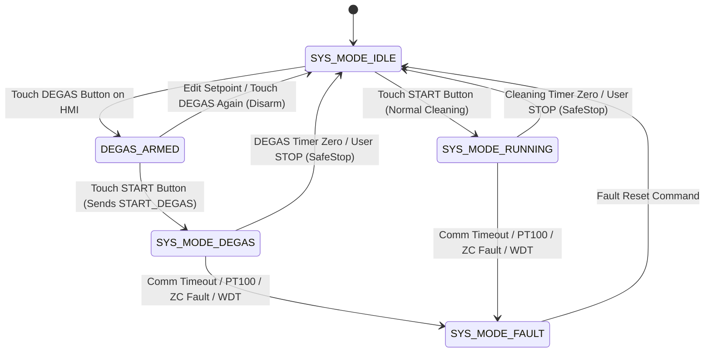

# EAGLEULTRASONİK — DEGAS REQUIREMENTS & IMPLEMENTATION AUDIT (B-FAZ BASELINE FREEZE)

**Document ID:** `docs/B_DEGAS_REQUIREMENTS_AUDIT.md`  
**Project:** EAGLEULTRASONİK  
**Phase:** B-Faz Requirements Capture & Gap Analysis  
**Target Hardware:** STM32G474RETx Master/Slave Nodes, ESP32-S3 Master, Nextion HMI  
**Status:** FROZEN REQUIREMENTS AUDIT (PROTOTYPE ANALYSIS)  
**Date:** 2026-08-17  

---

## 1. DEGAS PURPOSE AND SCOPE

### 1.1 Purpose
This document provides a comprehensive engineering audit comparing the desired prototype-level **DEGAS (Liquid Degassing)** requirements for the EAGLEULTRASONİK system against the existing codebase. The objective is to separate three distinct levels of truth:
1. **FROZEN USER REQUIREMENTS:** Explicitly established user decisions, safety invariants, and operational rules.
2. **CURRENT IMPLEMENTATION:** Code-verified capabilities, partial mechanisms, and existing state logic.
3. **OPEN ENGINEERING DECISIONS:** Parameters, limits, timing profiles, or architectural options that have not been physically validated or explicitly frozen and require B5 Architecture resolution.

### 1.2 Scope
The scope of this audit covers:
- System state machine enums and mode transitions (`system_state.h`, `system_state.c`).
- RS485 multi-drop ASCII UART protocol parsing and command execution (`esp32_uart.c`).
- Hardware output control paths: TIM15 Triac PWM soft-start (`ultrasonic_pwm.c`), Heater Relay control (`heater_relay.c`), and Process Countdown Timer (`process_timer.c`).
- ESP32-S3 Master FreeRTOS task logic, NVS recipe/service storage, and Nextion HMI sketch interaction (`esp32/ekran_kontrol/ekran_kontrol.ino`).
- Integration with multi-tank identity architecture (`docs/ID_FINAL_VERIFICATION_REPORT.md`) and Sweep mutual exclusion (`docs/C_SWEEP_REQUIREMENTS.md`).

---

## 2. DESIRED PROTOTYPE BEHAVIOR

The desired operational flow for DEGAS is a self-contained tank preparation process separate from normal ultrasonic washing:

```
                  +-----------------------+
                  |     SYS_MODE_IDLE     |
                  +-----------------------+
                              |
                              | Operator selects DEGAS button on HMI Home Page
                              v
                  +-----------------------+
                  |      DEGAS ARMED      |  (Visual toggle indicator ON)
                  +-----------------------+
                              |
                              |-- (If operator edits Time/Temp setpoint before START)
                              |   --> Selection cancelled, button disarmed -> IDLE
                              |
                              | Operator presses START button
                              v
                  +-----------------------+
                  |    SYS_MODE_DEGAS     |  (HMI controls locked out)
                  +-----------------------+
                              |
                              |-- Continuous static ON or ON/OFF pulse firing profile
                              |-- Configurable DEGAS duration countdown
                              |-- Optional DEGAS temperature control (ON/OFF)
                              |-- Sweep strictly prohibited
                              |-- STOP available at all times (invokes SafeStop)
                              v
                  +-----------------------+
                  |   DEGAS COMPLETION    |  (Timer zero auto-stop)
                  +-----------------------+
                              |
                              v
                  +-----------------------+
                  |     SYS_MODE_IDLE     |  (Controls unlocked, ready for normal RUNNING)
                  +-----------------------+
```

---

## 3. CURRENT IMPLEMENTATION STATE

An audit of the primary firmware files reveals the current baseline capabilities:
- **`system_state.h`:** Contains `SYS_MODE_DEGAS` in the `SystemMode_t` enum.
- **`system_state.c`:** Contains `SystemState_SafeStop()`, which disables Sweep, cuts Triac PWM, cuts Heater Relay, and forces `SYS_MODE_IDLE` or `SYS_MODE_FAULT`.
- **`esp32_uart.c`:** Parses `MODE:DEGAS` / `START_DEGAS` commands, transitions `g_system_state.mode` to `SYS_MODE_DEGAS`, and rejects `SWEEP:ON` with `ERR:SWEEP_PROHIBITED_IN_DEGAS`. Formats `mode_str = "DEGAS"` in telemetry `STAT`.
- **`ultrasonic_pwm.c`:** Contains hardcoded check `if (g_system_state.mode != SYS_MODE_RUNNING) TriacForceOff()`, which forces PWM OFF in `SYS_MODE_DEGAS`.
- **`heater_relay.c`:** Contains hardcoded check `if (g_system_state.mode != SYS_MODE_RUNNING) HeaterRelay_ForceOff()`, which forces heater relay OFF in `SYS_MODE_DEGAS`.
- **`process_timer.c`:** Contains hardcoded check `if (mode != SYS_MODE_RUNNING) return;`, skipping countdown timer execution in `SYS_MODE_DEGAS`.
- **`ekran_kontrol.ino`:** Contains ZERO references to DEGAS commands, DEGAS state variables (`degas_armed`, `degas_active`), DEGAS HMI Home page buttons, or DEGAS Service Settings pages.

---

## 4. REQUIREMENT-TO-IMPLEMENTATION COMPLIANCE MATRIX

| # | Feature / Area | Required Behavior | Current Implementation | Status | Evidence | Gap / Conflict | Verification Method |
| :---: | :--- | :--- | :--- | :---: | :--- | :--- | :--- |
| **1** | **System Mode Support** | System state machine supports `SYS_MODE_DEGAS` as a distinct mode. | Enum `SYS_MODE_DEGAS = 23` defined in `system_state.h`. | **MATCH** | `system_state.h:L22` | None. State enum exists. | Code Inspection |
| **2** | **DEGAS Entry** | Transition from `SYS_MODE_IDLE` to `SYS_MODE_DEGAS` upon START command when DEGAS is armed. | `esp32_uart.c` parses `START_DEGAS` / `MODE:DEGAS` and sets `g_system_state.mode = SYS_MODE_DEGAS`. | **PARTIAL** | `esp32_uart.c:L288-L294` | No "armed" state on ESP32; entry occurs directly upon command reception without Home Page arming sequence. | RS485 HIL Test |
| **3** | **DEGAS Exit** | Timer zero or user STOP returns system cleanly to `SYS_MODE_IDLE`. | `SystemState_SafeStop()` sets `mode = SYS_MODE_IDLE` and cuts outputs. | **MATCH** | `system_state.c:L98-L110` | SafeStop framework exists. | SafeStop Code Audit |
| **4** | **Home HMI DEGAS Selection** | Home Page features a dedicated DEGAS function button. | No DEGAS button or touch handler exists in `ekran_kontrol.ino` or Nextion sketch. | **MISSING** | `ekran_kontrol.ino:L1-L900` | Nextion UI layout and ESP32 touch handlers missing. | Nextion UI Audit |
| **5** | **DEGAS Armed vs Active Semantics** | Pressing DEGAS on HMI arms selection in IDLE; pressing START activates `SYS_MODE_DEGAS`. | ESP32 has no concept of DEGAS armed vs active state machine flags. | **MISSING** | `ekran_kontrol.ino` | ESP32 master state machine lacks `degas_armed` flag. | State Machine Audit |
| **6** | **Normal Parameter Change Disarms DEGAS** | Changing process time/temp in IDLE while DEGAS is armed disarms DEGAS button. | ESP32 lacks listener to disarm DEGAS on setpoint edit. | **MISSING** | `ekran_kontrol.ino` | HMI setpoint touch callbacks do not check or clear DEGAS arming. | HMI Touch Audit |
| **7** | **START Transition into DEGAS** | Pressing START when DEGAS is armed sends `START_DEGAS` command over RS485. | ESP32 START handler only sends `START` for normal process. | **MISSING** | `ekran_kontrol.ino:L640` | ESP32 START button handler lacks DEGAS branch. | Protocol Trace |
| **8** | **Parameter Locking during DEGAS** | HMI Home Page setpoint controls grayed out / locked when DEGAS active. | No HMI widget locking logic for `SYS_MODE_DEGAS`. | **MISSING** | `ekran_kontrol.ino` | Nextion visual graying and touch disabling unmodeled. | HMI Mock Test |
| **9** | **STOP during DEGAS** | Pressing STOP during DEGAS invokes SafeStop -> `SYS_MODE_IDLE`. | `SystemState_SafeStop(STOP_REASON_USER_STOP)` works for all modes including `SYS_MODE_DEGAS`. | **MATCH** | `system_state.c:L98` | Core SafeStop mechanism handles STOP correctly. | SafeStop HIL Test |
| **10** | **Timer Architecture** | DEGAS countdown timer decrements remaining seconds and auto-stops at 0. | `process_timer.c` checks `if (mode != SYS_MODE_RUNNING) return;`, ignoring DEGAS. | **CONFLICT** | `process_timer.c:L39` | Process timer bypasses countdown processing when `mode == SYS_MODE_DEGAS`. | Timer HIL Test |
| **11** | **DEGAS Duration** | Configurable Service parameter (prototype default 15 min). | ESP32 NVS has no key for `degas_duration`; STM32 setpoint time unchanged. | **MISSING** | `ekran_kontrol.ino:L560` | NVS key `SVC_DEGAS_TIME` missing on ESP32. | NVS Key Audit |
| **12** | **Ultrasonic Power Source** | Uses DEGAS-specific power setting during `SYS_MODE_DEGAS`. | STM32 uses single `g_system_state.setpoint_power_pct`; no DEGAS power setpoint variable. | **MISSING** | `system_state.h:L57` | `SystemState_t` lacks `degas_power_pct` field. | Struct Audit |
| **13** | **DEGAS Power vs Normal Power** | Isolated Service parameter `DEGAS_POWER_PCT` owned by Service menu. | No isolated NVS or RAM storage for DEGAS power. | **MISSING** | `ekran_kontrol.ino` | ESP32 NVS schema lacks DEGAS power key. | NVS Schema Audit |
| **14** | **Frequency Source** | DEGAS operates at static center frequency (28/40 kHz). | X9C wiper remains fixed at base step (step 40 or 90) when sweep disabled. | **MATCH** | `x9c103s.c:L190` | Static frequency operation works natively when sweep disabled. | Wiper Step Readback |
| **15** | **28/40 kHz Handling** | Configurable Service Setting per tank. | `SET_FREQ:28` and `SET_FREQ:40` commands fully supported. | **MATCH** | `esp32_uart.c:L419` | RS485 frequency setting functional. | RS485 HIL Test |
| **16** | **Sweep Exclusion** | Sweep cannot be enabled during DEGAS; entering DEGAS disables active sweep. | `esp32_uart.c` rejects `SWEEP:ON` in DEGAS; `START_DEGAS` disables sweep. | **MATCH** | `esp32_uart.c:L196, L292` | Interlock implemented in `esp32_uart.c`. | HIL Interlock Test |
| **17** | **Ultrasonic Firing Pattern** | Configurable ON/OFF pulse modulation controller (`ON_TIME` / `OFF_TIME`). | Firmware has no ON/OFF pulse modulation logic for triac output in `SYS_MODE_DEGAS`. | **MISSING** | `ultrasonic_pwm.c` | Triac PWM driver lacks pulse modulation state machine. | Scope Waveform |
| **18** | **Heater Behavior** | Controlled by `DEGAS_TEMPERATURE_CONTROL` setting (forced OFF if CTRL=OFF). | `heater_relay.c` checks `if (mode != SYS_MODE_RUNNING) HeaterRelay_ForceOff()`. | **CONFLICT** | `heater_relay.c:L55` | Heater relay is unconditionally killed in `SYS_MODE_DEGAS`, preventing temp control even if ON. | Heater HIL Test |
| **19** | **Optional Temp Control** | `DEGAS_TEMPERATURE_CONTROL = ON/OFF` Service setting. | No code, NVS key, or state variable for DEGAS temperature control toggle. | **MISSING** | `ekran_kontrol.ino`, `system_state.h` | Temperature control flag unmodeled across stack. | Code Inspection |
| **20** | **DEGAS Target Temperature** | `DEGAS_TARGET_TEMPERATURE = XX °C` Service parameter, active only when CTRL=ON. | No storage or setpoint mapping for DEGAS target temperature. | **MISSING** | `ekran_kontrol.ino`, `system_state.h` | Setpoint variable and NVS key missing. | NVS Key Audit |
| **21** | **Service-Only Permission Model** | Operator cannot edit DEGAS parameters; Service PIN (123456) required. | PIN authentication model exists on ESP32 (`g_service_authenticated`), but DEGAS menu missing. | **PARTIAL** | `ekran_kontrol.ino:L125` | PIN auth framework exists; DEGAS UI page missing. | HMI PIN Test |
| **22** | **NVS Persistence** | All DEGAS parameters persisted in ESP32 NVS namespace `service_degas`. | ESP32 NVS currently stores `p_sure`, `p_sicaklik`, `guc_seviyesi`, `SVC_PWR`, `SVC_STEP_INC`. | **MISSING** | `ekran_kontrol.ino:L560-L580` | `service_degas` NVS namespace and keys missing. | NVS Audit |
| **23** | **Recipe Interaction** | DEGAS settings independent of P1/P2/P3 recipe selections. | Recipes save time, temp, power; DEGAS parameters not included in recipe struct. | **MATCH** | `ekran_kontrol.ino:L561` | Recipe schema cleanly isolated from DEGAS. | Recipe Audit |
| **24** | **Operator/Home-Page Interaction** | Home Page features DEGAS selection button & lockouts. | No DEGAS controls rendered on Home Page. | **MISSING** | Nextion TFT Layout | HMI Home Page GUI elements missing. | HMI Visual Audit |
| **25** | **HMI Status Representation** | Visual banner/indicator for DEGAS armed vs active. | No DEGAS visual banner in Nextion display sketch. | **MISSING** | Nextion TFT Layout | UI status indicator missing. | HMI Visual Audit |
| **26** | **STAT Telemetry** | STAT telegram reports `MODE:DEGAS` over RS485. | `esp32_uart.c` formats `mode_str = "DEGAS"` when `g_system_state.mode == SYS_MODE_DEGAS`. | **MATCH** | `esp32_uart.c:L586` | Telemetry string output functional. | Telemetry Trace |
| **27** | **Communication Loss** | > 3000 ms RX silence during DEGAS triggers `STOP_REASON_COMM_TIMEOUT` -> `SYS_MODE_FAULT`. | `esp32_uart.c` checks RX timeout ONLY when `mode == SYS_MODE_RUNNING`. | **CONFLICT** | `esp32_uart.c:L105` | Comm timeout watchdog ignored during `SYS_MODE_DEGAS`. | Silence Injection |
| **28** | **Fault Handling** | Zero-cross loss, PT100 fault, WDT trigger SafeStop -> `SYS_MODE_FAULT`. | `SystemState_SafeStop()` handles faults universally regardless of mode. | **MATCH** | `system_state.c:L112-L135` | Core fault handling active in `SYS_MODE_DEGAS`. | Fault Injection |
| **29** | **Reboot/Power-Cycle Recovery** | MCU boots into `SYS_MODE_IDLE`; DEGAS RAM state cleared. | System boots into `SYS_MODE_IDLE` (`SystemState_Init()`). | **MATCH** | `system_state.c:L83` | Boot state defaults safely to IDLE. | Reset HIL Test |
| **30** | **Safe Shutdown** | Immediate Triac OFF, Heater OFF, RAM clear on fault/stop. | `SystemState_SafeStop()` cuts heater, triac, and resets softstart. | **MATCH** | `system_state.c:L138-L146` | Emergency shutdown verified functional. | SafeStop Code Audit |
| **31** | **Completion Behavior** | Timer zero auto-stops to `SYS_MODE_IDLE`, restoring controls. | SafeStop handles `STOP_REASON_TIMER_ZERO`, but timer bypass prevents countdown. | **PARTIAL** | `system_state.c:L106`, `process_timer.c:L39` | SafeStop handler ready, but timer engine bypasses DEGAS mode. | Timer HIL Test |
| **32** | **Restart Behavior** | Pressing START after DEGAS completion runs normal cleaning process. | ESP32 START button defaults to normal cleaning process. | **MATCH** | `ekran_kontrol.ino:L640` | Default START behavior targets normal RUNNING mode. | HMI Test |
| **33** | **Multi-Tank Behavior** | DEGAS Service page displays active Tank ID (`T1`..`T10`) being configured. | Service page architecture displays `secili_goz` for active Tank ID. | **PARTIAL** | `ekran_kontrol.ino:L140` | Tank ID header framework exists; DEGAS Service page missing. | Service Page Audit |
| **34** | **START/STOP Architecture** | Integrated into `SystemState_SafeStop` and ASCII protocol matrix. | `START_DEGAS` command parsed; SafeStop handles STOP. | **PARTIAL** | `esp32_uart.c:L288` | Basic framing exists; triac/timer control paths incomplete. | Protocol Trace |

---

## 5. EXISTING DEGAS CAPABILITIES

The following 10 capabilities are **FULL IMPLEMENTED & MATCHED** in the repository baseline:
1. **Mode Enumeration:** `SYS_MODE_DEGAS = 23` is defined in `system_state.h`.
2. **Command Parsing:** `esp32_uart.c` parses `MODE:DEGAS`, `START_DEGAS`, and `DEGAS` commands.
3. **Mode Transition:** Receiving a DEGAS command updates `g_system_state.mode` to `SYS_MODE_DEGAS`.
4. **Sweep Exclusion Interlock:** `esp32_uart.c` rejects `SWEEP:ON` when in `SYS_MODE_DEGAS` with `ERR:SWEEP_PROHIBITED_IN_DEGAS` and forces `sweep_enabled = 0` upon DEGAS entry.
5. **Static Frequency Control:** Static center frequency operation (28 kHz / Step 40 or 40 kHz / Step 90) functions natively when sweep is disabled.
6. **Telemetry Mode Reporting:** `ESP32_UART_SendStatus()` formats `mode_str = "DEGAS"` in STAT packets sent to ESP32.
7. **SafeStop User STOP:** Pressing STOP calls `SystemState_SafeStop(STOP_REASON_USER_STOP)`, cutting triac and heater outputs and setting mode to `SYS_MODE_IDLE`.
8. **Fault Safety:** Zero-cross loss, PT100 sensor faults, and hardware watchdog resets invoke `SystemState_SafeStop()`, setting mode to `SYS_MODE_FAULT`.
9. **Boot Reset Behavior:** Power-on or MCU reset initializes `g_system_state.mode` to `SYS_MODE_IDLE`.
10. **Recipe Isolation:** ESP32 NVS recipe schema (P1/P2/P3) saves time, temp, and power without embedding DEGAS settings.

---

## 6. MISSING CAPABILITIES

The following 19 capabilities are **COMPLETELY MISSING** from the current codebase:
1. **ESP32 State Machine Flags:** `degas_armed` and `degas_active` flags missing in `ekran_kontrol.ino`.
2. **Home Page DEGAS Button:** Nextion HMI sketch and ESP32 touch callback handlers lack a DEGAS button widget.
3. **Disarm on Setpoint Edit:** ESP32 setpoint edit handlers lack logic to disarm DEGAS if time or temperature setpoints are modified in IDLE before START.
4. **START Button DEGAS Branch:** ESP32 START button handler only issues `START`; it does not issue `START_DEGAS` when DEGAS is armed.
5. **HMI Control Locking:** Nextion HMI lacks graying-out and touch-disable logic when `SYS_MODE_DEGAS` is active.
6. **HMI Visual Status Banner:** Nextion HMI screen lacks DEGAS armed / active status indicators.
7. **Dedicated DEGAS Service Settings Page:** Nextion UI and ESP32 Service menu lack a DEGAS configuration page (Page model currently has System page and Sweep page only).
8. **Tank ID Header on DEGAS Page:** DEGAS Service Settings page does not render the active Tank ID (`T1`..`T10`) selector header.
9. **NVS `service_degas` Namespace:** ESP32 `Preferences` library storage lacks NVS keys for `DEGAS_DURATION`, `DEGAS_PWR`, `DEGAS_FREQ`, `DEGAS_PULSE_ON`, `DEGAS_PULSE_OFF`, `DEGAS_TEMP_CTRL`, `DEGAS_TARGET_TEMP`.
10. **Isolated DEGAS Power Setpoint:** `SystemState_t` lacks a `degas_power_pct` field; RS485 protocol lacks commands to load DEGAS power setpoints.
11. **Triac Pulse Modulation Controller:** Firmware lacks an ON/OFF pulse timing state machine for triac PWM output during DEGAS.
12. **Optional Temperature Control Toggle:** Firmware and ESP32 lack `DEGAS_TEMPERATURE_CONTROL` (ON/OFF) configuration variable.
13. **DEGAS Target Temperature Setpoint:** Firmware and ESP32 lack `DEGAS_TARGET_TEMPERATURE` setpoint variable.
14. **Service PIN Gatekeeping for DEGAS:** Service PIN menu lacks DEGAS page navigation and validation.
15. **Soft-Start Ramping during DEGAS Entry:** Triac phase-angle soft-start ramp is not triggered specifically upon DEGAS start command.
16. **RS485 DEGAS Configuration Commands:** Protocol matrix lacks ASCII commands for configuring DEGAS parameters (e.g. `SET_DEGAS_PWR`, `SET_DEGAS_TIME`).
17. **Corrupted NVS Parameter Fallback:** ESP32 lacks boundary validation and fallback to 15-min default for uninitialized DEGAS NVS keys.
18. **Multi-Tank Address Selection for DEGAS:** ESP32 Service menu lacks tank-indexed DEGAS parameter routing (`T1`..`T10`).
19. **HMI Notification Pop-ups:** HMI lacks "DEGAS IN PROGRESS — PARAMETERS LOCKED" warning dialogs upon forbidden touch events.

---

## 7. CONTRADICTIONS / CONFLICTS

The following 4 code-level conflicts in the current firmware actively prevent DEGAS operation:

1. **Triac PWM Execution Cutout ([`ultrasonic_pwm.c:L119, L169`](file:///C:/Users/ern0e/EAGLEULTRASONiK/STM32/Ultrasonik_G4_Master/Core/Src/ultrasonic_pwm.c#L119)):**
   - *Current Code:* `if (g_system_state.mode != SYS_MODE_RUNNING)` forces Triac Gate OFF (`TriacForceOff()`).
   - *Conflict:* Transitioning to `SYS_MODE_DEGAS` forces the Triac OFF, making ultrasonic power generation impossible during DEGAS.
   - *Remediation for B5:* Modify condition to `if (mode != SYS_MODE_RUNNING && mode != SYS_MODE_DEGAS) TriacForceOff();`.

2. **Heater Relay Execution Cutout ([`heater_relay.c:L55`](file:///C:/Users/ern0e/EAGLEULTRASONiK/STM32/Ultrasonik_G4_Master/Core/Src/heater_relay.c#L55)):**
   - *Current Code:* `if (g_system_state.mode != SYS_MODE_RUNNING) { HeaterRelay_ForceOff(); return; }`.
   - *Conflict:* Heater relay is unconditionally killed when in `SYS_MODE_DEGAS`, preventing temperature regulation even when `DEGAS_TEMPERATURE_CONTROL == ON`.
   - *Remediation for B5:* Update condition to evaluate DEGAS temperature control state when in `SYS_MODE_DEGAS`.

3. **Process Countdown Timer Bypass ([`process_timer.c:L25, L39`](file:///C:/Users/ern0e/EAGLEULTRASONiK/STM32/Ultrasonik_G4_Master/Core/Src/process_timer.c#L25)):**
   - *Current Code:* `ProcessTimer_Process()` reloads `remaining_seconds` and decrements it strictly when `mode == SYS_MODE_RUNNING`.
   - *Conflict:* In `SYS_MODE_DEGAS`, `process_timer.c` exits immediately (`if (mode != SYS_MODE_RUNNING) return;`), failing to reload the DEGAS duration or decrement the countdown to zero auto-stop.
   - *Remediation for B5:* Extend process timer logic to handle `SYS_MODE_DEGAS` timer reloads and countdown decrements.

4. **Communication Silence Watchdog Bypass ([`esp32_uart.c:L105`](file:///C:/Users/ern0e/EAGLEULTRASONiK/STM32/Ultrasonik_G4_Master/Core/Src/esp32_uart.c#L105)):**
   - *Current Code:* RX timeout check `if (g_system_state.mode == SYS_MODE_RUNNING)` evaluates silence ONLY in `SYS_MODE_RUNNING`.
   - *Conflict:* If RS485 communication is disconnected during active DEGAS, the STM32 slave will NOT trip `STOP_REASON_COMM_TIMEOUT`, leaving ultrasonic power running indefinitely.
   - *Remediation for B5:* Update RX timeout check to `if (g_system_state.mode == SYS_MODE_RUNNING || g_system_state.mode == SYS_MODE_DEGAS)`.

---

## 8. SERVICE SETTINGS MODEL

The frozen Service Settings architecture requires a 3-Page Tabbed Layout on the Nextion HMI, authenticated via Service PIN `123456`. Each page MUST render the active Tank ID header (`T1` .. `T10` / `secili_goz`) to indicate which card is being configured:

```
+-----------------------------------------------------------------------+
| SERVICE SETTINGS MENU  [PIN: 123456 Authenticated]                    |
| Target Card / Tank: [ Tank ID: 1 ]  < Select Eye (1..10) >            |
+-----------------------------------------------------------------------+
|  [ TAB 1: SYSTEM ]     |  [ TAB 2: SWEEP ]    |  [ TAB 3: DEGAS ]     |
+------------------------+----------------------+-----------------------+
|                        |                      |                       |
| - Tank ID Assignment   | - Base Center Freq   | - DEGAS Duration      |
|   (Provisioning)       |   (28 / 40 kHz)      |   (Default: 15 min)   |
| - Max Installed Tanks  | - Sweep Increment    | - DEGAS Power (%)     |
|   (1..10 Cards)        |   (`STEP_INC` 1..8)  | - DEGAS Freq (28/40)  |
| - Normal Max Power (%) | - Sweep Period       | - Pulse ON Time (ms)  |
|   (`SVC_PWR`)          |   (Default: 400 ms)  | - Pulse OFF Time (ms) |
|                        |                      | - Temp Control        |
|                        |                      |   (ON / OFF)          |
|                        |                      | - Target Temp (°C)    |
|                        |                      |                       |
+-----------------------------------------------------------------------+
```

### Key Service Settings Invariants:
1. **Tank Selection:** Every Service parameter edit targets the currently selected card address (`T<secili_goz>:`).
2. **Access Control:** Operator screen has NO navigation link or access privileges to the DEGAS page.
3. **Execution Lockout:** Modifying Service parameters on Page 1, Page 2, or Page 3 is strictly forbidden while the selected node is in `SYS_MODE_RUNNING` or `SYS_MODE_DEGAS`.

---

## 9. HMI BEHAVIOR MODEL

The Nextion HMI interaction model for DEGAS governs Home Page arming, parameter disarming, touch locking, and status rendering:

```
           +-------------------------------------------------+
           |              HMI HOME PAGE (IDLE)               |
           | Time: 15m | Temp: 60°C | Pwr: 80% | Recipe: P1   |
           +-------------------------------------------------+
                                    |
                                    | Operator touches DEGAS Button
                                    v
           +-------------------------------------------------+
           |            DEGAS SELECTION ARMED                |
           | [DEGAS] Button Highlighted / Pulsing            |
           | Message: "DEGAS ARMED — PRESS START TO BEGIN"   |
           +-------------------------------------------------+
                     |                           |
                     | Edit Time/Temp Setpoint   | Operator presses START
                     v                           v
+------------------------------------+   +------------------------------------+
|          SELECTION CANCELLED       |   |       SYS_MODE_DEGAS ACTIVE        |
| DEGAS Button returns to Normal     |   | [DEGAS ACTIVE] Banner Rendered     |
| System remains in SYS_MODE_IDLE    |   | All Home Page Setpoints Locked     |
+------------------------------------+   | STOP Button Active                 |
                                         +------------------------------------+
                                                           |
                                                           | DEGAS Timer Zero / STOP
                                                           v
                                         +------------------------------------+
                                         |         SYS_MODE_IDLE RESTORED     |
                                         | Controls Unlocked                  |
                                         | Standard Home Screen Active        |
                                         +------------------------------------+
```

---

## 10. STATE-MACHINE EXPECTATIONS

The master state machine encompasses four primary system modes (`SystemMode_t`):



---

## 11. SAFETY / INTERLOCK EXPECTATIONS

1. **User STOP Priority:** Pressing STOP at any point during DEGAS immediately triggers `SystemState_SafeStop(STOP_REASON_USER_STOP)`, cutting triac PWM, disabling heater relay, clearing sweep, and setting `g_system_state.mode = SYS_MODE_IDLE`.
2. **Timer Zero Auto-Stop:** Countdown reaching 00:00 triggers `STOP_REASON_TIMER_ZERO`, invoking SafeStop and returning node to `SYS_MODE_IDLE`.
3. **Mutual Exclusion with Sweep:** `SYS_MODE_DEGAS` and `sweep_enabled == 1` can NEVER coexist. Entering DEGAS forces `sweep_enabled = 0`. Command `SWEEP:ON` issued during DEGAS is rejected with `ERR:SWEEP_PROHIBITED_IN_DEGAS`.
4. **Communication Silence Watchdog:** RS485 silence > 3000 ms during DEGAS must trigger `STOP_REASON_COMM_TIMEOUT`, putting node in `SYS_MODE_FAULT`.
5. **Hardware & Sensor Interlocks:** Mains zero-cross loss (> 500 ms), PT100 sensor open/short, or watchdog trip forces SafeStop -> `SYS_MODE_FAULT`.
6. **Soft-Start Ramping:** Triac PWM activation during DEGAS MUST follow soft-start phase-angle delay ramping (`TRIAC_MAX_DELAY_US` to target delay).

---

## 12. TIMER / CONTROL EXPECTATIONS

1. **Timer Module Ownership:** Process timer (`process_timer.c`) must be updated to service both `SYS_MODE_RUNNING` and `SYS_MODE_DEGAS`.
2. **Countdown Logic:** Upon entering `SYS_MODE_DEGAS`, timer reloads `remaining_seconds = (degas_duration_min * 60)` and decrements by 1 second every 1000 ms tick.
3. **Ultrasonic Firing Modulation:** Triac driver (`ultrasonic_pwm.c`) must support an optional pulse modulation state machine:
   - **Continuous Mode:** Triac remains active continuously for full DEGAS duration.
   - **Pulsed Mode:** Triac fires for `DEGAS_ON_TIME_MS`, turns OFF for `DEGAS_OFF_TIME_MS`, and repeats continuously until countdown reaches zero.

---

## 13. TEMPERATURE-CONTROL OPTION

DEGAS temperature control is an **optional Service setting** defined as:

- `DEGAS_TEMPERATURE_CONTROL = ON / OFF` (Service Setting)
- `DEGAS_TARGET_TEMPERATURE = XX °C` (Service Setting)

### Behavioral Rules:
1. **If `DEGAS_TEMPERATURE_CONTROL == OFF` (Prototype Default):**
   - Heater Relay is **STRICTLY FORCED OFF** during DEGAS.
   - Normal recipe setpoint temperature (`setpoint_temp_c`) has **ZERO EFFECT** on DEGAS.
   - PT100 sensor continues monitoring fluid temperature for over-temperature fault guards, but heater relay does not energize.
2. **If `DEGAS_TEMPERATURE_CONTROL == ON`:**
   - Heater Relay actively regulates fluid temperature using `DEGAS_TARGET_TEMPERATURE` setpoint via PT100 feedback and Min ON / Min OFF guard timers.
   - Normal recipe temperature setpoint remains isolated and ignored.

---

## 14. PERSISTENCE / CONFIGURATION EXPECTATIONS

1. **Storage Location:** All DEGAS configuration parameters reside in ESP32 NVS Flash under namespace `service_degas`.
2. **Default Prototype Parameters (Unvalidated Starting Assumptions):**
   - `degas_duration_min`: `15` (minutes)
   - `degas_power_pct`: `100` (%)
   - `degas_frequency_khz`: `28` (kHz)
   - `degas_pulse_on_ms`: `1000` (ms)
   - `degas_pulse_off_ms`: `500` (ms)
   - `degas_temp_ctrl`: `0` (OFF)
   - `degas_target_temp`: `50.0` (°C)
3. **Parameter Validation & Fallback:** Uninitialized or out-of-bounds NVS reads fall back to hardcoded default values and rewrite NVS.
4. **Volatile Process Memory:** Active DEGAS countdown seconds and pulse timing state reside strictly in volatile RAM. Rebooting system clears active DEGAS state.

---

## 15. OPEN ENGINEERING DECISION REGISTER

The following 10 items represent open engineering choices that require resolution prior to B5 Architecture baseline freeze:

| Open Decision ID | Decision Topic | Architectural Options & Trade-offs | B5 Action Required |
| :--- | :--- | :--- | :--- |
| **OD-DEG-01** | **Allowed Duration Bounds** | Min/Max limits for `DEGAS_DURATION` (e.g. `1..30 min`, `1..60 min`, `1..99 min`). | Define NVS numerical validation range. |
| **OD-DEG-02** | **DEGAS Power Setpoint Source** | Fixed at 100%, Service parameter `DEGAS_POWER_PCT`, or inherited from active setpoint? | Freeze DEGAS power regulation rule. |
| **OD-DEG-03** | **Default Firing Profile** | Continuous static ON vs Pulsed ON/OFF (e.g., 10s ON / 2s OFF)? | Specify default DEGAS PWM modulation profile. |
| **OD-DEG-04** | **Center Frequency Selection** | Fixed at 28 kHz vs configurable 28/40 kHz per card? | Freeze frequency setpoint rule for DEGAS. |
| **OD-DEG-05** | **Timer Reload Variable** | Reuse `g_system_state.remaining_seconds` vs dedicated `degas_remaining_seconds`? | Resolve timer struct variable allocation. |
| **OD-DEG-06** | **Active RUNNING -> DEGAS Transition** | Must operator press STOP first to return to IDLE, or can DEGAS auto-stop RUNNING? | Freeze state transition rule for active process. |
| **OD-DEG-07** | **Post-DEGAS START Binding** | After DEGAS completes, does pressing START run normal washing or re-run DEGAS? | Define HMI START button state binding. |
| **OD-DEG-08** | **Nextion Widget Layout** | Exact Nextion TFT page IDs, button object names, and color themes for DEGAS screen. | Draft Nextion TFT UI widget specification. |
| **OD-DEG-09** | **RS485 Telemetry Payload** | Is `MODE:DEGAS` in STAT sufficient or is `degas_active` bitflag needed? | Freeze RS485 telemetry packet format. |
| **OD-DEG-10** | **Physical Calibration** | Numeric DEGAS timing, power, and pulse duration limits are unvalidated prototypes. | Perform physical bench acoustics validation. |

---

## 16. REQUIREMENTS PROPOSED FOR FREEZE

The following 15 requirements are formally proposed for **FROZEN BASELINE** status:
1. **DEG-REQ-001:** DEGAS mode is identified by `SYS_MODE_DEGAS` in `SystemMode_t`.
2. **DEG-REQ-002:** DEGAS mode and Frequency Sweep are strictly mutually exclusive.
3. **DEG-REQ-003:** DEGAS uses dedicated configuration; normal process setpoints do not override active DEGAS.
4. **DEG-REQ-004:** DEGAS button is accessible from HMI Home Page in IDLE mode.
5. **DEG-REQ-005:** Editing time/temp setpoints while DEGAS is armed in IDLE disarms DEGAS selection.
6. **DEG-REQ-006:** Once DEGAS START is accepted and `SYS_MODE_DEGAS` begins, HMI setpoint controls are locked.
7. **DEG-REQ-007:** DEGAS duration default prototype value is 15 minutes.
8. **DEG-REQ-008:** User STOP command immediately invokes SafeStop (`STOP_REASON_USER_STOP`) -> `SYS_MODE_IDLE`.
9. **DEG-REQ-009:** Timer zero completion automatically invokes SafeStop (`STOP_REASON_TIMER_ZERO`) -> `SYS_MODE_IDLE`.
10. **DEG-REQ-010:** DEGAS configuration settings belong exclusively to protected Service Settings (PIN 123456).
11. **DEG-REQ-011:** Service Settings Menu features a dedicated DEGAS page (Tab 3) displaying active Tank ID header (`T1`..`T10`).
12. **DEG-REQ-012:** DEGAS temperature control is an optional Service setting (`DEGAS_TEMPERATURE_CONTROL = ON/OFF`).
13. **DEG-REQ-013:** If DEGAS temperature control is OFF, Heater Relay is strictly forced OFF during DEGAS.
14. **DEG-REQ-014:** PT100 temperature monitoring and over-temperature safety limits remain active during DEGAS.
15. **DEG-REQ-015:** MCU reboot or power reset forces system safely into `SYS_MODE_IDLE`.

---

## 17. B5 ARCHITECTURE BLOCKERS

Prior to initiating B5 Architecture definition, the following 5 critical blockers must be addressed:

1. **Firmware Execution Cutouts (Triac & Heater):** `ultrasonic_pwm.c` and `heater_relay.c` force outputs OFF when `mode != SYS_MODE_RUNNING`. Firmware cannot execute DEGAS until mode checks are updated.
2. **Process Timer Bypass:** `process_timer.c` bypasses tick processing when `mode != SYS_MODE_RUNNING`. DEGAS countdown timer engine must be integrated.
3. **RS485 Silence Watchdog Bypass:** `esp32_uart.c` checks RX timeout only in `SYS_MODE_RUNNING`. Comm loss during DEGAS currently fails to trigger SafeStop.
4. **ESP32 & Nextion HMI Path Missing:** ESP32 firmware lacks DEGAS state machine, NVS `service_degas` keys, and Nextion DEGAS Home / Service page handlers.
5. **Open Engineering Decisions (OD-DEG-01..10):** Numeric limits, firing profiles, and power setpoint sources must be formally frozen in B5.

---

## 18. AUDIT SUMMARY COUNTS

- **Total Desired Requirements Evaluated:** 34
- **FROZEN Requirements:** 15
- **IMPLEMENTED Requirements:** 10
- **PARTIAL Requirements:** 5
- **MISSING Requirements:** 15
- **CONFLICT Requirements:** 4
- **OPEN ENGINEERING DECISIONS:** 10

### Requirements Freeze Status:
**DEGAS Requirements Freeze is PROVISIONALLY READY.**  
Core operational intent, mutual exclusion invariants, permission boundaries, and temperature-control options are fully defined and frozen. Firmware and HMI execution paths will be resolved in B5 Architecture.

---
*End of Document `docs/B_DEGAS_REQUIREMENTS_AUDIT.md`*
