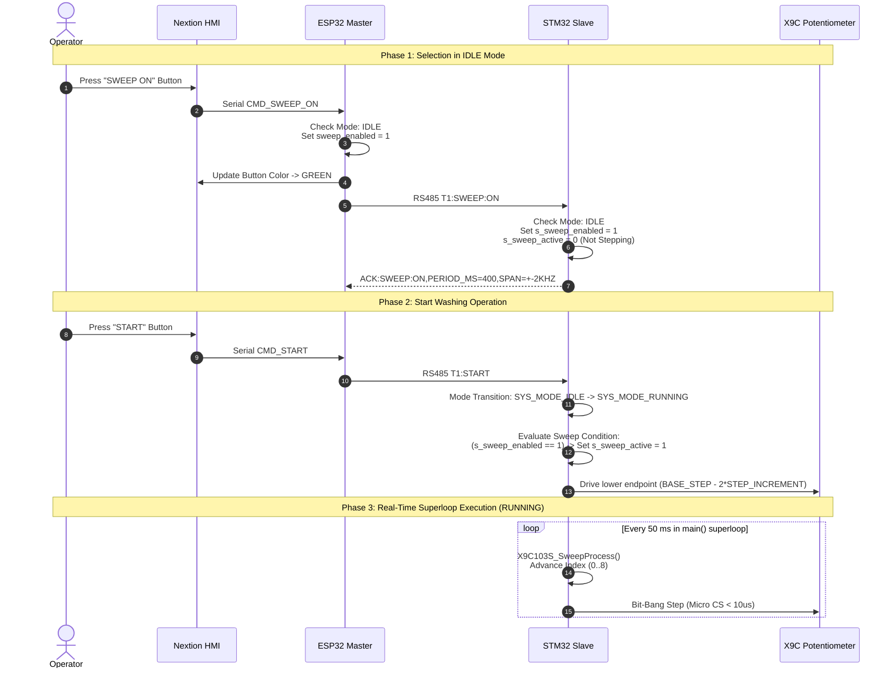

# EAGLEULTRASONİK — FREQUENCY SWEEP / SHIFTING ARCHITECTURE SPECIFICATION (C-FAZ 2)

**Document ID:** `docs/C_SWEEP_ARCHITECTURE.md`  
**Project:** EAGLEULTRASONİK  
**Phase:** C-Faz 2 Architectural Design & Baseline Freeze (Parametric Sweep Step Update)  
**Requirements Reference:** [`docs/C_SWEEP_REQUIREMENTS.md`](file:///c:/Users/ern0e/EAGLEULTRASONiK/docs/C_SWEEP_REQUIREMENTS.md)  
**Target Hardware:** STM32G474RETx Master/Slave Nodes, ESP32-S3 Master, Nextion HMI, X9C103S Digital Potentiometer  
**Status:** FROZEN ARCHITECTURE SPECIFICATION  
**Date:** 2026-08-16  

---

## 1. ARCHITECTURE OVERVIEW & PRINCIPLES

### 1.1 Architectural Vision
The Frequency Sweep (Shifting) architecture of EAGLEULTRASONİK establishes a deterministic, multi-layered frequency control model for ultrasonic cleaning tanks. The system separates high-level user interface / recipe management (ESP32-S3 / Nextion HMI) from real-time, microsecond-accurate transducer frequency synthesis and safety interlocks (STM32G474RE).

### 1.2 Core Architectural Principles
1. **Strict Hardware Authority & Driver Preservation:** The validated STM32 X9C103S digital potentiometer bit-bang driver (`x9c103s.c`/`h`) operating on GPIO pins `PB12` (CS), `PB13` (U/D), and `PB14` (INC) is preserved without hardware interface redesign.
2. **Dual-Axis Control Decoupling:** Ultrasonic Output Power control (Control Axis A: Triac phase-angle via `TIM15` / `EXTI7 ZC`) and Transducer Frequency control (Control Axis B: X9C103S wiper stepping to Hybrid Card) operate as completely independent execution chains.
3. **Parametric Sweep Step Model (`BASE_STEP_28`, `BASE_STEP_40`, `STEP_INCREMENT`):**
   - Base center frequency step constants: `BASE_STEP_28 = 40` (28 kHz) and `BASE_STEP_40 = 90` (40 kHz).
   - Sweep step increment: `STEP_INCREMENT` is a Service Settings parameter (allowed range `1..8`, default `4`).
   - Parametric wiper step formula: $\text{target\_step} = \text{BASE\_STEP} + (\text{multiplier} \times \text{STEP\_INCREMENT})$ where multipliers are $[-2, -1, 0, +1, +2, +1, 0, -1, -2]$.
   - For default `STEP_INCREMENT = 4`, discrete steps evaluate to $32 \rightarrow 36 \rightarrow 40 \rightarrow 44 \rightarrow 48$ (28 kHz) and $82 \rightarrow 86 \rightarrow 90 \rightarrow 94 \rightarrow 98$ (40 kHz).
4. **Decoupled Selection vs Execution (`sweep_enabled` vs `sweep_active`):**
   - `sweep_enabled` represents user intent / configuration (selected on HMI or armed in recipe).
   - `sweep_active` represents active real-time wiper stepping execution in STM32 hardware.
   - Sweep execution (`sweep_active = 1`) occurs **only** when `sweep_enabled == 1` AND system mode is `SYS_MODE_RUNNING`.
5. **STM32 Hardware-Enforced Safety Interlocks:** Safety restrictions (e.g., prohibiting sweep during `SYS_MODE_IDLE`, `SYS_MODE_FAULT`, or `DEGAS` mode) are strictly enforced at the STM32 firmware level, regardless of ESP32 or HMI command states.
6. **Separation of Operator vs Service Permissions:**
   - **Operator:** Can select programs (P1/P2/P3), modify temporary process time/temperature, start/stop washing, toggle sweep enable, and activate DEGAS mode. Operator **cannot** modify ultrasonic power percentage, `STEP_INCREMENT`, or sweep period parameters.
   - **Service / Technician:** Has exclusive write access to ultrasonic power percentage (`setpoint_power_pct`), `STEP_INCREMENT` (`1..8`), sweep span, sweep period, and DEGAS timing parameters stored in ESP32 NVS.
7. **Separation of Recipe Storage vs Current Process RAM:**
   - Recipe storage (NVS P1/P2/P3) holds immutable golden parameters until explicitly saved via the dedicated program-save flow.
   - Temporary edits on the HMI home page modify transient process RAM only and never pollute stored NVS recipes.

---

## 2. STATE OWNERSHIP & SYSTEM STATE MACHINE

### 2.1 State Definitions
- **`g_system_state.mode` (STM32 System Mode):**
  - `SYS_MODE_IDLE` (0): Machine standby, heater/triac OFF, sweep inactive.
  - `SYS_MODE_RUNNING` (1): High-voltage washing active, process timer running, heater/triac controlled, sweep active if `sweep_enabled == 1`.
  - `SYS_MODE_FAULT` (2): Safety fault state, output hardware cut, sweep disabled and center frequency restored.
  - `SYS_MODE_DEGAS` (3): Dedicated degassing pulse mode, locked parameter set, sweep prohibited.
- **`sweep_enabled` (Selection / Intent Flag):**
  - `0`: Sweep is disabled/unselected. Center frequency is fixed at 28 kHz (`BASE_STEP_28 = 40`) or 40 kHz (`BASE_STEP_40 = 90`).
  - `1`: Sweep is selected/armed by operator or recipe.
  - *Persistence:* Preserved in current process RAM prior to START; cleared on STOP/FAULT/SafeStop.
- **`sweep_active` (Hardware Execution Flag):**
  - `0`: Wiper state machine is paused; potentiometer is held at static center frequency step.
  - `1`: Wiper state machine is stepping through discrete parametric frequency offsets ($\text{BASE\_STEP} + \text{multiplier} \times \text{STEP\_INCREMENT}$).
  - *Constraint:* `sweep_active = sweep_enabled && (g_system_state.mode == SYS_MODE_RUNNING)`.

### 2.2 System Mode & Sweep State Transitions

```mermaid
stateDiagram-v2
    [*] --> IDLE : Power-On / MCU Reset\n(sweep_enabled=0, sweep_active=0)
    
    state IDLE {
        [*] --> Unarmed
        Unarmed --> Armed : Operator Toggles SWEEP ON\n(sweep_enabled=1, sweep_active=0)
        Armed --> Unarmed : Operator Toggles SWEEP OFF\n(sweep_enabled=0, sweep_active=0)
    }

    IDLE --> RUNNING : START Command\n(If Armed: sweep_active=1)
    IDLE --> DEGAS : DEGAS Start\n(sweep_enabled forced to 0)

    state RUNNING {
        state "Sweep Inactive (Static Center)" as RunStatic
        state "Sweep Active (Triangle Stepping)" as RunSweeping
        
        [*] --> RunStatic : Started while Unarmed
        [*] --> RunSweeping : Started while Armed
        
        RunStatic --> RunSweeping : T<ID>:SWEEP:ON\n(sweep_enabled=1, sweep_active=1)
        RunSweeping --> RunStatic : T<ID>:SWEEP:OFF\n(sweep_enabled=0, sweep_active=0)
    }

    RUNNING --> IDLE : User STOP / Timer 00:00\n(SafeStop: sweep_enabled=0, sweep_active=0, Center Restored)
    RUNNING --> FAULT : Fault / Comm Timeout / Watchdog\n(SafeStop: sweep_enabled=0, sweep_active=0, Center Restored)

    state DEGAS {
        note right of DEGAS : Sweep Strictly Prohibited\nParameters Locked
    }

    DEGAS --> IDLE : DEGAS Complete / STOP
    FAULT --> IDLE : STOP Command (Fault Clear)
```

---

## 3. STM32 FIRMWARE SUBSYSTEM ARCHITECTURE

### 3.1 Subsystem Responsibilities
The STM32G474RE acts as the real-time execution engine and safety enforcement node. Its frequency sweep responsibilities comprise:
1. **X9C103S Wiper Control Driver (`x9c103s.c`/`h`):** Bit-banging GPIOs `PB12` (CS), `PB13` (U/D), `PB14` (INC) with microsecond timing delays (`X9C_DelayUs(3U)`).
2. **Frequency-to-Wiper Mapping Engine:** Converting base frequencies to discrete 0..99 wiper steps using `BASE_STEP_28 = 40` and `BASE_STEP_40 = 90` with `X9C103S_SweepStepForFrequency()`.
3. **Parametric Non-Blocking Sweep State Machine:** Executing `X9C103S_SweepProcess()` inside the main superloop every 50 ms when `sweep_active == 1`, evaluating $\text{target\_step} = \text{BASE\_STEP} + (\text{s\_sweep\_offsets}[i] \times \text{STEP\_INCREMENT})$.
4. **Micro Critical Section Interrupt Protection:** Wrapping pulse generation in $< 10\ \mu\text{s}$ critical sections (`__disable_irq()` / `__set_PRIMASK()`) per step pulse, preventing zero-cross timing jitter and UART RX overrun errors.
5. **Center Frequency Restoration:** Instantly driving wiper back to exact center frequency step (`BASE_STEP_28 = 40` for 28 kHz, `BASE_STEP_40 = 90` for 40 kHz) whenever sweep is disabled or system enters `SystemState_SafeStop()`.
6. **PA0 Analog Diagnostic Monitoring:** Sampling silecek voltage $V_W$ via `ADC1_IN1` on `PA0` (through 1 kΩ series resistor) to verify potentiometer health.

### 3.2 Firmware Data Structures & Functions
```c
/* Parametric Step Constants */
#define BASE_STEP_28            40U
#define BASE_STEP_40            90U
#define DEFAULT_STEP_INCREMENT   4U

/* Subsystem State Variables (STM32 RAM) */
static uint8_t  s_current_step       = BASE_STEP_28; /* Active X9C step (0..99) */
static uint8_t  s_current_freq       = 28U;          /* Active center frequency (28 or 40 kHz) */
static uint8_t  s_sweep_enabled      = 0U;           /* User selection flag (0 or 1) */
static uint8_t  s_sweep_active       = 0U;           /* Hardware execution flag (0 or 1) */
static uint8_t  s_sweep_center_freq  = 28U;          /* Captured center frequency at sweep enable */
static uint8_t  s_step_increment     = DEFAULT_STEP_INCREMENT; /* Service parameter (1..8) */
static uint8_t  s_sweep_index        = 0U;           /* Triangle step index (0..8) */
static uint32_t s_sweep_last_tick    = 0U;           /* Last 50 ms tick timestamp */

/* Baseline Offset Multipliers Array (Continuous Triangle: -2, -1, 0, +1, +2, +1, 0, -1, -2) */
static const int8_t s_sweep_offsets[9] = { -2, -1, 0, 1, 2, 1, 0, -1, -2 };

/* Primary Interface Functions */
void X9C103S_Init(void);
HAL_StatusTypeDef X9C103S_SetStep(uint8_t step);
HAL_StatusTypeDef X9C103S_SetFrequency(uint8_t freq_khz);
void X9C103S_SetSweepEnabled(uint8_t enabled);
uint8_t X9C103S_IsSweepEnabled(void);
void X9C103S_SweepProcess(void);
```

---

## 4. ESP32 MASTER & HMI SUBSYSTEM ARCHITECTURE

### 4.1 Subsystem Responsibilities
The ESP32-S3 serves as the system master controller, HMI bridge, and persistent storage manager:
1. **HMI Interface & Command Parsing (`ekran_kontrol.ino`):** Receiving serial commands from Nextion HMI over `Serial2` (9600 baud), parsing user UI touches, and updating Nextion display elements.
2. **Current Process RAM Management:** Maintaining active process variables for each tank (`hedef_sure`, `hedef_sicaklik`, `secili_freq`, `sweep_enabled_ram`).
3. **NVS Recipe & Service Storage Manager:** Persisting golden recipes (P1/P2/P3) and Service Settings (`SVC_PWR`, `SVC_STEP_INC`, `SVC_SWP_PER`, DEGAS parameters) in non-volatile storage (`Preferences` library).
4. **RS485 Master Communication:** Addressing commands to STM32 slaves over `Serial1` using ASCII bus format (`T<TankID>:<Command>\n`).
5. **Permission & Mode Gatekeeping:** Enforcing operator vs service access boundaries and ensuring locked DEGAS/Service parameters cannot be overridden from operator UI.

### 4.2 Software Architecture Layers on ESP32

```
+-----------------------------------------------------------------------+
|                         NEXTION HMI DISPLAY                           |
|      (Operator Pages: P0 Main / Recipe | Service Page: Password Protected)|
+-----------------------------------+-----------------------------------+
                                    | UART (9600 Baud)
+-----------------------------------v-----------------------------------+
|                        ESP32-S3 MASTER NODE                           |
|  +-----------------------------------------------------------------+  |
|  | HMI Command Decoder & Parser (komutIsle)                        |  |
|  +--------------------------------+--------------------------------+  |
|                                   |                                   |
|  +--------------------------------v--------------------------------+  |
|  | Role & Permission Manager (Operator vs Service Gatekeeper)       |  |
|  +--------------------------------+--------------------------------+  |
|                                   |                                   |
|  +--------------------------------v--------------------------------+  |
|  | Current Process RAM (Transient) | NVS Preferences (Persistent)   |  |
|  | - hedef_sure / hedef_sicaklik   | - Golden Recipes (P1, P2, P3)  |  |
|  | - secili_freq (28/40 kHz)     | - Service Power Setpoint %     |  |
|  | - sweep_enabled_ram (0/1)      | - STEP_INCREMENT (1..8, def 4) |  |
|  | - degas_mode_active (0/1)      | - Service Sweep Period         |  |
|  +--------------------------------+--------------------------------+  |
|                                   |                                   |
|  +--------------------------------v--------------------------------+  |
|  | RS485 Master Transport Layer (stmGonder -> T<ID>:<CMD>)         |  |
|  +--------------------------------+--------------------------------+  |
+-----------------------------------+-----------------------------------+
                                    | RS485 ASCII Bus (115200 Baud)
+-----------------------------------v-----------------------------------+
|                      STM32G474RE SLAVE NODES                          |
|         (Real-time State Machine, X9C Stepping, SafeStop)             |
+-----------------------------------------------------------------------+
```

---

## 5. NEXTION HMI VISUAL & INTERACTION MODEL

### 5.1 Sweep Button Visual States
The HMI Frequency Sweep button visually reflects `sweep_enabled` (selection intent), NOT `sweep_active`:
- **State 1: OFF / Unselected (Gray Button):** `sweep_enabled == 0`. Frequency is fixed at static center (`BASE_STEP_28 = 40` or `BASE_STEP_40 = 90`).
- **State 2: ON / Selected (Green Button):** `sweep_enabled == 1`. Sweep is armed.
  - If machine is in `SYS_MODE_IDLE`: Button is **GREEN** (Selection active; awaiting START).
  - If machine is in `SYS_MODE_RUNNING`: Button is **GREEN** (Sweep execution active).
  - If machine is in `SYS_MODE_DEGAS`: Button is **DISABLED / GRAY** (Sweep prohibited).

### 5.2 UI Touch Handlers & Actions
1. **Operator Presses Sweep Button on Home Page:**
   - If `DEGAS_MODE` is active: HMI ignores touch and displays notification `"SWEEP PROHIBITED IN DEGAS MODE"`.
   - If `sweep_enabled == 0`: Sets `sweep_enabled = 1`, changes button to **GREEN**. Sends `T<ID>:SWEEP:ON` to STM32 if running, or arms RAM flag if idle.
   - If `sweep_enabled == 1`: Sets `sweep_enabled = 0`, changes button to **GRAY**. Sends `T<ID>:SWEEP:OFF` to STM32.

2. **Operator Selects Center Frequency (28 kHz / 40 kHz):**
   - Operator presses `28 kHz` or `40 kHz` toggle button.
   - ESP32 executes `SET_FREQ` flow:
     1. Disables active sweep (`sweep_enabled = 0`, button turns **GRAY**).
     2. Transmits `T<ID>:SWEEP:OFF` to STM32.
     3. Transmits `T<ID>:SET_FREQ:<freq>` to STM32.
     4. Updates `secili_freq` in current process RAM.

---

## 6. RS485 COMMUNICATION PROTOCOL ARCHITECTURE

### 6.1 ASCII Protocol Command Matrix

| Direction | Command / Frame Format | Meaning / Purpose | Response / ACK from Receiver |
| :--- | :--- | :--- | :--- |
| ESP32 → STM32 | `T<ID>:SWEEP:ON\n` | Enable frequency sweep around current center | `ACK:SWEEP:ON,PERIOD_MS=400,SPAN=+-2KHZ\n` (if RUNNING)<br>`ERR:SWEEP_REQUIRES_RUNNING\n` (if IDLE/FAULT) |
| ESP32 → STM32 | `T<ID>:SWEEP:OFF\n` | Disable frequency sweep & restore center step | `ACK:SWEEP:OFF,CENTER_RESTORED\n` |
| ESP32 → STM32 | `T<ID>:SET_FREQ:<freq>\n` | Set center frequency (28 or 40 kHz) | `LOG:FREQ_28KHZ_SET_STEP_40_4KOHM\n` or `ERR:INVALID_FREQ\n` |
| ESP32 → STM32 | `T<ID>:SET_STEP_INC:<1..8>\n` | Service setting: configure `STEP_INCREMENT` | `ACK:STEP_INC:<val>\n` (if IDLE)<br>`ERR:LOCKED_SYS_RUNNING\n` (if RUNNING) |
| ESP32 → STM32 | `T<ID>:START\n` | Start washing operation | STM32 transitions to `SYS_MODE_RUNNING`; starts sweep if `sweep_enabled == 1` |
| ESP32 → STM32 | `T<ID>:STOP\n` | Stop washing operation / Clear fault | STM32 triggers `SystemState_SafeStop()`; disables sweep and restores center step |
| STM32 → ESP32 | `STAT,<ID>,<mode>,<rem_sec>,<temp_x10>,<relay>,<pwr>,<freq>,<fault>,<prov>,<swp_st>\n` | Periodic 500 ms status telemetry frame | Consumed by ESP32 telemetry parser `stmTelemetryIsle()` |

---

## 7. RECIPE & PROGRAM DATA MODEL

### 7.1 Data Storage vs RAM Separation

```
                       +-----------------------------------+
                       |    ESP32 NVS FLASH PREFERENCES    |
                       |    (Namespace: "eagle_recipes")   |
                       +-----------------+-----------------+
                                         |
                                         | Recipe Load Action
                                         v
+-----------------------------------------------------------------------------------+
|                            CURRENT PROCESS RAM (ESP32)                            |
|  - hedef_sure[secili_goz]       (Minutes: 0..100)                                 |
|  - hedef_sicaklik[secili_goz]   (DegC: 0..90)                                     |
|  - secili_freq[secili_goz]      (kHz: 28 or 40)                                   |
|  - sweep_enabled[secili_goz]    (Boolean: 0 or 1)                                 |
|  - (Power setpoint & STEP_INCREMENT read from Service NVS - Operator cannot edit) |
+----------------------------------------+------------------------------------------+
                                         |
                                         | Explicit Operator Action: "SAVE PROGRAM"
                                         v
                       +-----------------------------------+
                       |    ESP32 NVS FLASH PREFERENCES    |
                       |    Overwrites Stored P1/P2/P3     |
                       +-----------------------------------+
```

---

## 8. SERVICE SETTINGS & PERMISSION MODEL

### 8.1 Permission Boundary Matrix

| System Parameter | Operator Access (Home Page / User UI) | Service Technician Access (Password Protected) | Storage Scope |
| :--- | :--- | :--- | :--- |
| **Washing Time (min)** | Read / Edit (Temporary Process RAM) | Read / Edit / Factory Default | Current RAM / NVS Recipe |
| **Washing Temp (°C)** | Read / Edit (Temporary Process RAM) | Read / Edit / Factory Default | Current RAM / NVS Recipe |
| **Center Freq (kHz)** | Read / Toggle (28 vs 40 kHz) | Read / Calibration / Offset | Current RAM / NVS Recipe |
| **Sweep Enable (ON/OFF)**| Read / Toggle (Arm / Unarm) | Read / Override / Default Arm | Current RAM / NVS Recipe |
| **Ultrasonic Power %** | **READ ONLY** (Operator cannot modify) | **READ / WRITE** (0 - 100%) | Service NVS (`SVC_PWR`) |
| **`STEP_INCREMENT`** | **HIDDEN / NO ACCESS** (Default = 4) | **READ / WRITE** (Allowed: `1..8`, Def: `4`) | Service NVS (`SVC_STEP_INC`) |
| **Sweep Period (ms)** | **HIDDEN / NO ACCESS** (Fixed 400 ms) | **READ ONLY / SERVICE CONFIG** | Service NVS (`SVC_SWP_PER`) |
| **DEGAS Pulse On/Off** | **HIDDEN / NO ACCESS** | **READ / WRITE** (Time parameters) | Service NVS (`SVC_DEGAS_*`) |

*Modification Constraint:* `STEP_INCREMENT` and Service parameters cannot be modified while the system is in active `SYS_MODE_RUNNING` mode.

---

## 9. OPERATING MODES & DEGAS MODE INTEGRATION

### 9.1 DEGAS Mode Architecture
DEGAS mode is a specialized liquid degassing operating profile designed to remove dissolved gases from fluid prior to ultrasonic cleaning.

### 9.2 Operating Mode Isolation Rules
1. **Mode Exclusive Execution:** System can exist in `SYS_MODE_RUNNING` OR `SYS_MODE_DEGAS`, but NEVER both simultaneously.
2. **Locked Parameter Set in DEGAS Mode:**
   - When DEGAS mode is initiated, the system operates using fixed Service DEGAS parameters (`DEGAS_ON_TIME_MS`, `DEGAS_OFF_TIME_MS`, `DEGAS_POWER_PCT`).
   - Operator controls (Time adjustment, Temp adjustment, Power adjustment, Center Freq change) are **LOCKED** and ignored by ESP32.
3. **Strict Sweep Exclusion:**
   - Frequency Sweep is **STRICTLY PROHIBITED** during DEGAS mode.
   - Enforced at ESP32 level: ESP32 rejects HMI `CMD_SWEEP_ON` when `degas_mode_active == 1`.
   - Enforced at STM32 level: STM32 command parser rejects `SWEEP:ON` if `g_system_state.mode == SYS_MODE_DEGAS` with `ERR:SWEEP_PROHIBITED_IN_DEGAS`.
   - If sweep was armed (`sweep_enabled == 1`) prior to entering DEGAS mode, entering DEGAS mode automatically clears `sweep_enabled = 0` and transmits `SWEEP:OFF` to STM32.

---

## 10. SYSTEM SEQUENCES & CONTROL FLOW DIAGRAMS

### 10.1 Control-Flow: `SWEEP ON → START → RUNNING → SWEEP`



---

## 11. DATA OWNERSHIP MATRIX

| Data Element | Primary Owner | Secondary Copy | Storage Medium | Persistence Scope | Access Control |
| :--- | :--- | :--- | :--- | :--- | :--- |
| `g_system_state.mode` | STM32 | ESP32 (Mirror) | STM32 Volatile RAM | Erased on Reset | STM32 Internal |
| `s_current_step` (0..99) | STM32 | None | STM32 Volatile RAM | Erased on Reset | STM32 Internal (`x9c103s.c`) |
| `s_sweep_enabled` | STM32 | ESP32 `sweep_enabled` | Volatile RAM | Erased on Reset / SafeStop | Operator / RS485 |
| `s_sweep_active` | STM32 | ESP32 `STAT` Telemetry | Volatile RAM | Erased on Reset / SafeStop | STM32 Hardware Engine |
| `g_system_state.frequency_khz`| STM32 | ESP32 `secili_freq` | Volatile RAM | Default 28 kHz on Reset | Operator / RS485 |
| `STEP_INCREMENT` (1..8, def 4) | ESP32 NVS | STM32 `s_step_increment` | ESP32 NVS Flash | Permanent (NVS Flash) | **Service Only** |
| `hedef_sure` / `hedef_sicaklik` | ESP32 | STM32 Setpoints | ESP32 Volatile RAM | Transient per Session | Operator (Home Page) |
| Golden Recipes (P1/P2/P3) | ESP32 | None | ESP32 NVS Flash | Permanent (NVS Flash) | Operator Save Flow |
| Ultrasonic Power % (`SVC_PWR`) | ESP32 | STM32 Power Setpoint | ESP32 NVS Flash | Permanent (NVS Flash) | **Service Only** |

---

## 12. ARCHITECTURAL DECISION RECORDS (ADR)

### ADR-01: Decoupling Sweep Intent (`sweep_enabled`) from Real-Time Execution (`sweep_active`)
- **Owner:** System Architect / STM32 Firmware
- **Input:** User SWEEP ON touch command or recipe load.
- **Output:** Flag updates in RAM (`sweep_enabled`, `sweep_active`).
- **State Affected:** `s_sweep_enabled`, `s_sweep_active`, HMI button color.
- **Persistence Scope:** Volatile RAM only (cleared on SafeStop / Power-off).
- **Safety Implication:** High. Ensures wiper stepping cannot occur while high-voltage generator is IDLE or FAULTed.

### ADR-02: Frequency Change (`SET_FREQ`) Resets Active Sweep
- **Owner:** Communication Specialist / STM32 Command Parser
- **Input:** `T<ID>:SET_FREQ:<28|40>`
- **Output:** Disables sweep, restores base center step (`BASE_STEP_28 = 40` or `BASE_STEP_40 = 90`).
- **State Affected:** `s_sweep_enabled = 0`, `s_sweep_active = 0`, `s_current_freq = new_freq`.
- **Persistence Scope:** Volatile RAM.
- **Safety Implication:** High. Prevents out-of-bounds frequency stepping.

### ADR-03: Mandatory SafeStop Sweep Deactivation Priority
- **Owner:** STM32 Specialist / Safety Engineer
- **Input:** System SafeStop trigger (`STOP_REASON_USER_STOP`, `TIMER_ZERO`, `FAULT`, `COMM_TIMEOUT`, `WATCHDOG`).
- **Output:** Immediate call to `X9C103S_SetSweepEnabled(0U)` before hardware shutoff.
- **State Affected:** `s_sweep_enabled = 0`, `s_sweep_active = 0`, wiper step forced to base center.
- **Persistence Scope:** Volatile RAM.
- **Safety Implication:** Critical. Guarantees transducer generator returns to a stable static baseline.

### ADR-04: Strict DEGAS Mode Sweep Exclusion
- **Owner:** System Architect / ESP32-HMI Specialist
- **Input:** DEGAS mode activation.
- **Output:** Automatic deactivation of sweep; rejection of sweep commands.
- **State Affected:** `degas_mode_active = 1`, `sweep_enabled = 0`.
- **Persistence Scope:** Volatile RAM.
- **Safety Implication:** High. Prevents acoustic wave interference.

### ADR-05: Power Percentage Access Boundary
- **Owner:** ESP32-HMI Specialist
- **Input:** UI interaction on Home Page vs Service Page.
- **Output:** Rejection of power edit attempts from Home Page.
- **State Affected:** `guc_seviyesi` in ESP32 RAM.
- **Persistence Scope:** Permanent in Service NVS (`SVC_PWR`).
- **Safety Implication:** Medium. Protects ultrasonic transducers.

### ADR-07: Parametric Sweep Step Increment (`STEP_INCREMENT`) Management
- **Owner:** System Architect / ESP32 Service Manager
- **Input:** Service configuration parameter `STEP_INCREMENT` (allowed integer range `1..8`, default `4`).
- **Output:** Dynamic scaling of triangle wiper step offsets ($\text{BASE\_STEP} + \text{multiplier} \times \text{STEP\_INCREMENT}$).
- **State Affected:** `s_step_increment` in STM32 RAM, `SVC_STEP_INC` in NVS.
- **Persistence Scope:** Permanent in Service NVS (`Preferences`).
- **Safety Implication:** Medium. Interlock prevents changing `STEP_INCREMENT` while running to avoid sudden wiper step jumps.

---

## 13. TRACEABILITY MATRIX

The architecture fully satisfies every requirement in [`docs/C_SWEEP_REQUIREMENTS.md`](file:///c:/Users/ern0e/EAGLEULTRASONiK/docs/C_SWEEP_REQUIREMENTS.md):

| Requirement ID Range | Category in Requirements Document | Architectural Owner / Component Mapping | Satisfied / Aligned? |
| :--- | :--- | :--- | :--- |
| `SWP-REQ-001` - `SWP-REQ-004` | Frequency Modes | Section 2 & Section 3 (Parametric Step Model) | **YES** |
| `SWP-REQ-005` - `SWP-REQ-009` | Center Frequency Requirements | Section 3 (`BASE_STEP_28`, `BASE_STEP_40`) & Section 6 | **YES** |
| `SWP-REQ-010` - `SWP-REQ-013` | Sweep Range Requirements | Section 3 & Section 8 (`STEP_INCREMENT` 1..8) | **YES** |
| `SWP-REQ-014` - `SWP-REQ-018` | Step / Frequency Mapping | Section 3 (`X9C103S_SweepStepForFrequency()`) | **YES** |
| `SWP-REQ-019` - `SWP-REQ-022` | Sweep Timing / Rate | Section 3 (`X9C103S_SweepProcess()`) & Section 8 | **YES** |
| `SWP-REQ-023` - `SWP-REQ-026` | Sweep Direction & Cycle | Section 3 (Symmetric Multipliers $[-2..+2]$) | **YES** |
| `SWP-REQ-027` - `SWP-REQ-031` | START / STOP Behavior | Section 2 (State Machine) & Section 10.1 | **YES** |
| `SWP-REQ-032` - `SWP-REQ-033` | Timer Behavior | Section 3 (`SystemState_SafeStop()`) | **YES** |
| `SWP-REQ-034` - `SWP-REQ-036` | Fault / Safe Stop Behavior | Section 3 (`SystemState_SafeStop()`) | **YES** |
| `SWP-REQ-037` - `SWP-REQ-038` | Communication Loss Behavior | Section 3 (`ESP32_UART_Process()` Watchdog) | **YES** |
| `SWP-REQ-039` - `SWP-REQ-041` | Power Interaction | Section 1.2 (Dual-Axis Control Decoupling) | **YES** |
| `SWP-REQ-042` - `SWP-REQ-043` | Recipe Interaction | Section 7 (Recipe Data Model) | **YES** |
| `SWP-REQ-044` | DEGAS Interaction | Section 9 (DEGAS Mode) | **YES** |
| `SWP-REQ-045` - `SWP-REQ-048` | ESP32 / HMI Requirements | Section 4 (ESP32 Master) & Section 5 (HMI Model) | **YES** |
| `SWP-REQ-049` - `SWP-REQ-051` | STM32 Requirements | Section 3 (STM32 Firmware Subsystem) | **YES** |
| `SWP-REQ-052` - `SWP-REQ-057` | RS485 / Command Requirements | Section 6 (RS485 Protocol Architecture) | **YES** |
| `SWP-REQ-058` - `SWP-REQ-060` | X9C103S Requirements | Section 3 (STM32 X9C Driver & Pinout) | **YES** |
| `SWP-REQ-061` - `SWP-REQ-063` | Boundary Conditions | Section 3 (Step Clamping & Initialization) | **YES** |
| `SWP-REQ-064` - `SWP-REQ-065` | Invalid Command / Error | Section 6 (RS485 Command Parser Error Handling) | **YES** |
| `SWP-REQ-066` - `SWP-REQ-069` | Acceptance Criteria | Section 14 (System Invariants) | **YES** |
| `SWP-REQ-070` - `SWP-REQ-071` | Service `STEP_INCREMENT` | Section 8 (Service Settings) & ADR-07 | **YES** |

---

## 14. SYSTEM INVARIANTS & SAFETY CONSTRAINTS

1. **Hardware Safety Invariant:** Under no circumstance shall the X9C potentiometer wiper be stepped while global interrupts are masked for $> 10\ \mu\text{s}$, protecting Zero-Cross timing and RS485 UART reception.
2. **State Invariant:** `s_sweep_active` MUST be `0` whenever `g_system_state.mode != SYS_MODE_RUNNING`.
3. **SafeStop Invariant:** `SystemState_SafeStop()` MUST disable sweep (`s_sweep_enabled = 0`) as its very first operational instruction.
4. **Mode Isolation Invariant:** `SYS_MODE_DEGAS` and `sweep_enabled == 1` are mutually exclusive.
5. **Parametric Safety Invariant:** `STEP_INCREMENT` MUST be clamped within `1..8` and MUST NOT be modified during active `SYS_MODE_RUNNING` state.
6. **NVS Protection Invariant:** Temporary user edits to process parameters on HMI Page 0 MUST NEVER write to NVS Flash unless the explicit "SAVE PROGRAM" flow is confirmed.
7. **Permission Invariant:** Operator UI MUST NOT expose ultrasonic power percentage editing or `STEP_INCREMENT` modifications.

---
*End of Document `docs/C_SWEEP_ARCHITECTURE.md`*
