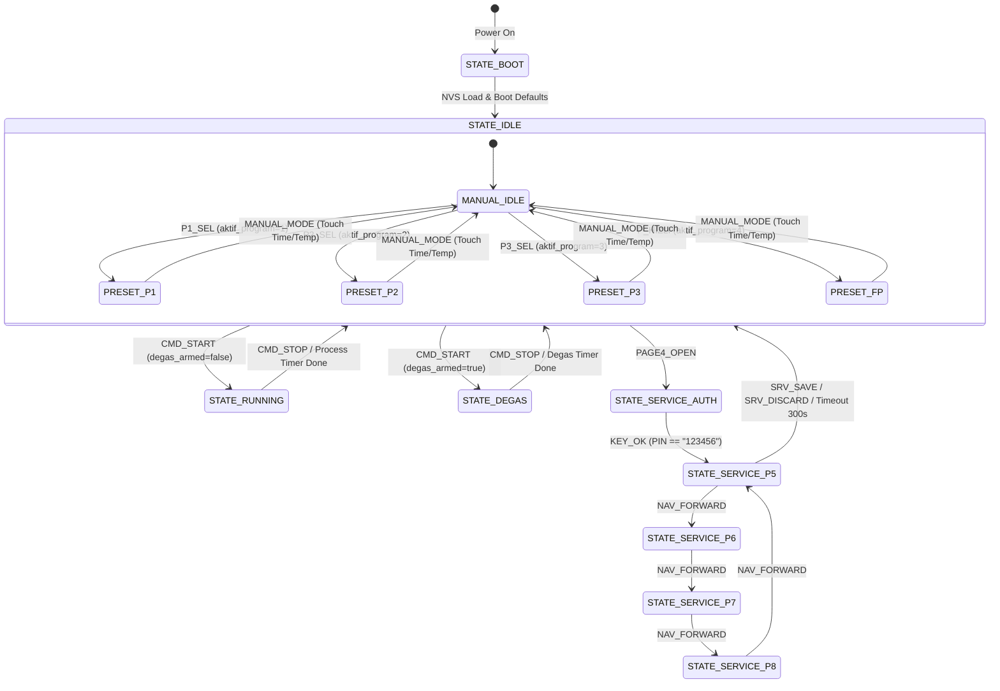
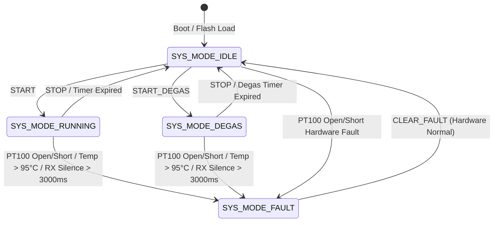

# EAGLEULTRASONİK — CURRENT STATE SYSTEM MANIFESTO (HISTORICAL BASELINE V3)

> [!NOTE]
> **SUPERSEDED:** This document is the historical V3 baseline (2026-08-20). The current authoritative Master System Manifesto is [`docs/EAGLEULTRASONIK_SYSTEM_MANIFESTO_V4.md`](EAGLEULTRASONIK_SYSTEM_MANIFESTO_V4.md) (V4.0.0, 2026-08-24).

**Historical Document Identifier:** `docs/EAGLEULTRASONIK_CURRENT_STATE_MANIFESTO.md`  
**Audit Date:** 2026-08-20  
**Audit Methodology:** Read-Only Ground-Truth Code Audit + HIL Physical Telemetry & Bridge Log Correlation  
**Target Hardware:** STM32G474RE (Motor/Ultrasonic/Heater Node), ESP32-S3 (HMI Master/Bridge), Nextion HMI (Editor Simulator / Physical Display)  

---

## 1. System Overview

EAGLEULTRASONİK is an industrial multi-tank ultrasonic cleaning and degas automation system with modular distributed control architecture.

```
┌─────────────────────────────────────────────────────────────────────────────────────────────────┐
│                                       SYSTEM ARCHITECTURE                                       │
├────────────────────────────────┬───────────────────────────────┬────────────────────────────────┤
│          HMI LAYER             │          MASTER LAYER         │          SLAVE LAYER           │
│   Nextion Intelligent HMI      │         ESP32-S3 Master       │      STM32G474RE Node(s)       │
│  - Page 0: Operation / Wash    │  - FreeRTOS Superloop / Tasks │  - TIM1 Triac Phase Gate PWM   │
│  - Page 1: Tank (Eye) Select   │  - Dual UART (HMI + RS485)    │  - TIM15 Master 100Hz ZC Clock │
│  - Page 2: Recipe Edit (P1..3) │  - NVS Flash Persistent Store │  - X9C103S Digital Pot (PA0)   │
│  - Page 4: PIN Authentication  │  - Draft Buffer Staging       │  - OPAMP3 PT100 Temp Sensing   │
│  - Page 5..8: Service Config   │  - Card-ID / Tank-ID Router   │  - Multi-Drop RS485 Slave      │
└────────────────────────────────┴───────────────────────────────┴────────────────────────────────┘
```

### Key Architectural Pillars
- **Distributed Topology:** One ESP32-S3 master controls up to 10 multi-drop STM32G474RE nodes over a half-duplex RS485 bus (115200 baud).
- **Dual-Domain Synchronous Timing:** A 100 Hz Zero-Cross TTL pulse generated by ESP32 (GPIO4) or physical AC zero-cross optocoupler synchronizes STM32 TIM1 triac firing ($500\,\mu\text{s} \dots 9500\,\mu\text{s}$).
- **Hardware Source of Truth:** Physical pin mapping is frozen and protected under `hardware_wiring_FINAL_AUTHORITY.md`.

---

## 2. Actual Hardware Topology

### 2.1 MCU Pinout & Signal Mapping

| Subsystem | Signal Name | MCU Pin | Physical Header | Electrical Type / Target | Authority Reference |
|---|---|---|---|---|---|
| **Zero-Cross** | `ZC_INPUT` | **STM32 PC7** | CN5 Pin 2 (D9) / CN10 Pin 19 | 3.3V TTL (1kΩ series) from ESP32 GPIO4 | `hardware_wiring_FINAL_AUTHORITY.md:L18` |
| **Triac Output** | `TRIAC_GATE` | **STM32 PC6** | CN10 Pin 4 | 3.3V Active-High Gate Drive Pulse | `hardware_wiring_FINAL_AUTHORITY.md:L142` |
| **Triac Loopback** | `TRIAC_FB` | **STM32 PA6** | CN10 Pin 13 | Digital Feedback Input (100ns propagation) | `main.c:L330` |
| **Heater Relay** | `HEATER_OUT` | **STM32 PB15** | CN10 Pin 26 | 3.3V Active-High Relay Control Output | `hardware_wiring_FINAL_AUTHORITY.md:L155` |
| **Heater Loopback**| `HEATER_FB` | **STM32 PA4** | CN7 Pin 17 | Digital Feedback Input (100ns propagation) | `main.c:L330` |
| **Potentiometer** | `X9C_INC` | **STM32 PB14** | CN10 Pin 28 | Active-Low Increment Strobe Output | `x9c103s.c:L35` |
| **Potentiometer** | `X9C_UD` | **STM32 PB13** | CN10 Pin 30 | Direction (High=Up, Low=Down) Output | `x9c103s.c:L36` |
| **Potentiometer** | `X9C_CS` | **STM32 PB12** | CN10 Pin 16 | Active-Low Chip Select Output | `x9c103s.c:L37` |
| **Pot Wiper Sense**| `POT_WIPER` | **STM32 PA0** | CN7 Pin 28 | ADC1_IN1 Analog In ($0 \dots 3.3\,\text{V}$) | `hardware_wiring_FINAL_AUTHORITY.md:L82` |
| **PT100 Temp** | `PT100_IN` | **STM32 PB0** | CN7 Pin 34 | OPAMP3 Non-Inverting Input (PGA Gain $\times 16$) | `pt100_adc.c:L22` |
| **RS485 UART** | `USART3_TX` | **STM32 PB10** | CN10 Pin 25 | UART Transmit to RS485 Transceiver | `esp32_uart.c:L34` |
| **RS485 UART** | `USART3_RX` | **STM32 PB11** | CN10 Pin 18 | UART Receive from RS485 Transceiver | `esp32_uart.c:L34` |
| **RS485 Driver En**| `RS485_DE` | **STM32 PB4** | CN7 Pin 27 | Active-High Bus Driver Enable | `esp32_uart.h:L25` |
| **ST-Link VCP** | `LPUART1_TX`| **STM32 PA2** | Internal ST-Link | 115200 Baud Telemetry & Debug Stream | `main.c:L88` |
| **ST-Link VCP** | `LPUART1_RX`| **STM32 PA3** | Internal ST-Link | 115200 Baud ST-Link RX | `main.c:L88` |
| **ESP32 HMI UART** | `RXD2 / TXD2`| **ESP32 GPIO16/17** | Board Headers | 115200 Baud to Nextion Display | `ekran_kontrol.ino:L6` |
| **ESP32 RS485** | `STM_TX / RX` | **ESP32 GPIO8/18** | Board Headers | 115200 Baud to RS485 Bus | `ekran_kontrol.ino:L42` |
| **ESP32 DE Pin** | `RS485_DE` | **ESP32 GPIO5** | Board Header | Active-High RS485 Driver Enable | `ekran_kontrol.ino:L44` |
| **ESP32 ZC Out** | `ZC_SIM_PIN` | **ESP32 GPIO4** | Board Header | 100 Hz Half-Period $5000\,\mu\text{s}$ Timer | `ekran_kontrol.ino:L62` |

### 2.2 Electrical Isolation Rules
- **Power Rail Isolation:** NUCLEO 5V ($V_{CC}=5\,\text{V}$), ESP32 5V (USB VBUS), and Nextion 5V are strictly separated. No 5V bridge permitted (`hardware_wiring_FINAL_AUTHORITY.md:L58`).
- **Common Signal Ground:** STM32 GND, ESP32 GND, Nextion GND, and X9C VSS are bonded to a single reference ground plane (`hardware_wiring_FINAL_AUTHORITY.md:L64`).

---

## 3. Actual HMI Page Architecture

| Page ID | Page Name | Purpose | Key UI Controls | Emitted ASCII Events | Source Anchor |
|---|---|---|---|---|---|
| `page0` | **Operation** | Main wash operation, start/stop, status, manual setpoints, preset recipes | `b_start`, `b_stop`, `b_freq`, `b_sweep`, `b_degas`, `b_p1..p3`, `b_fp`, `t_set_sure`, `t_set_sic` | `CMD_START\|<m>\|<c>`, `CMD_STOP`, `CMD_FREQ_TOGGLE`, `CMD_SWEEP_TOGGLE`, `CMD_DEGAS_SEL`, `P1..P3_SEL`, `P_HIZLI`, `MANUAL_MODE`, `PAGE1_OPEN` | `EKRAN/page0.page`, `ekran_kontrol.ino:L975` |
| `page1` | **Tank Select** | Select active tank / logical eye | `b_tank_up`, `b_tank_down`, `b_tank_ok` | `TANK_UP`, `TANK_DOWN`, `TANK_SEL_OK`, `PAGE1_BACK` | `EKRAN/page1.page`, `ekran_kontrol.ino:L1300` |
| `page2` | **Recipe Edit** | Edit preset recipes P1, P2, P3 parameters | `b_edit_p1..p3`, `b_edit_swp`, `b_p_save`, `b_p_back` | `EDIT_P1..P3`, `EDIT_SWEEP_TOG`, `P_SAVE\|<m>\|<c>\|<s>`, `PAGE2_BACK` | `EKRAN/page2.page`, `ekran_kontrol.ino:L1380` |
| `page3` | **General Settings**| Placeholder settings menu | `b_back` | `PAGE3_BACK` | `EKRAN/page3.page` |
| `page4` | **Security PIN**| PIN authorization pad for service entry | `b0..b9`, `b_ok`, `b_del`, `b_back` | `KEY0..KEY9`, `KEY_OK`, `KEY_DEL`, `KEY_BACK`, `PAGE4_OPEN` | `EKRAN/page4.page`, `ekran_kontrol.ino:L1480` |
| `page5` | **Service - Power/ID**| Commissioning, tank card ID assignment, power % | `b_srv_tank_up/down`, `b_srv_guc_up/down`, `b_srv_id_up/down`, `b_srv_max_up/down`, `b_save`, `b_discard`, `b_nav_fwd` | `SRV_TANK_UP/DOWN`, `SRV_GUC_UP/DOWN`, `SRV_ID_UP/DOWN`, `SRV_MAX_UP/DOWN`, `SRV_SAVE`, `SRV_DISCARD`, `NAV_FORWARD` | `EKRAN/page5.page`, `ekran_kontrol.ino:L1600` |
| `page6` | **Service - Sweep** | Sweep modulation span, period, step configuration | `b_swp_span_up/down`, `b_swp_per_up/down`, `b_swp_step_up/down`, `b_nav_fwd`, `b_nav_back` | `SRV_SPAN_UP/DOWN`, `SRV_PER_UP/DOWN`, `SRV_STEP_UP/DOWN`, `NAV_FORWARD`, `NAV_BACK` | `EKRAN/page6.page`, `ekran_kontrol.ino:L1750` |
| `page7` | **Service - Degas 1**| Degas duration, power %, frequency selection | `b_deg_dur_up/down`, `b_deg_pow_up/down`, `b_deg_frq_up/down`, `b_nav_fwd`, `b_nav_back` | `SRV_DDUR_UP/DOWN`, `SRV_DPOW_UP/DOWN`, `SRV_DFREQ_UP/DOWN`, `NAV_FORWARD`, `NAV_BACK` | `EKRAN/page7.page`, `ekran_kontrol.ino:L1880` |
| `page8` | **Service - Degas 2**| Degas pulse timing and temperature interlock | `b_deg_pon_up/down`, `b_deg_poff_up/down`, `b_deg_tc_tog`, `b_deg_tgt_up/down`, `b_nav_fwd`, `b_nav_back` | `SRV_DPON_UP/DOWN`, `SRV_DPOFF_UP/DOWN`, `SRV_DTCTRL_TOG`, `SRV_DTEMP_UP/DOWN`, `NAV_FORWARD`, `NAV_BACK` | `EKRAN/page8.page`, `ekran_kontrol.ino:L2000` |

---

## 4. Nextion → ESP32 Protocol

### 4.1 Frame Framing & Delimiters
- **Physical Interface:** UART2 (`RXD2=GPIO16`, `TXD2=GPIO17`) @ 115200 Baud.
- **End-of-Message Terminator:** 3 consecutive `0xFF` bytes (`\xFF\xFF\xFF`).
- **Parsing Loop:** `hatOku()` buffer accumulators scan for trailing triple `0xFF` or ASCII newline `\n` (`ekran_kontrol.ino:L2180`).

### 4.2 Raw Command Frame Contract

```
HMI -> ESP32:  <COMMAND_STRING>[\xFF\xFF\xFF]
Examples:
  CMD_START|25|50\xFF\xFF\xFF
  CMD_STOP\xFF\xFF\xFF
  CMD_FREQ_TOGGLE\xFF\xFF\xFF
  CMD_SWEEP_TOGGLE\xFF\xFF\xFF
  CMD_DEGAS_SEL\xFF\xFF\xFF
  P1_SEL\xFF\xFF\xFF
  MANUAL_MODE\xFF\xFF\xFF
  PAGE1_OPEN\xFF\xFF\xFF
  KEY_OK\xFF\xFF\xFF
  SRV_SAVE\xFF\xFF\xFF
```

---

## 5. ESP32 Internal State Machine



### Core State Variables (`ekran_kontrol.ino:L71-L143`)
- `secili_goz` (1..10): Currently active logical tank/eye displayed on Page 0.
- `aktif_program` (0..4): Active preset recipe (0=Manual, 1=P1, 2=P2, 3=P3, 4=FP).
- `makine_calisiyor[MAX_GOZ]` (bool): Process run flag per tank.
- `degas_armed[MAX_GOZ]` (bool): Degas intent armed on Page 0.
- `degas_active[MAX_GOZ]` (bool): Degas pulse active in runtime.
- `runtime_sweep[MAX_GOZ]` (bool): Active frequency sweep modulation flag.
- `hedef_sure[MAX_GOZ]` (int): Setpoint minutes.
- `hedef_sicaklik[MAX_GOZ]` (int): Setpoint temperature in °C.
- `stm_freq[MAX_GOZ]` (int): Active operating frequency (28 or 40 kHz).
- `kart_id[MAX_GOZ]` (int): Physical RS485 slave ID assigned to logical eye.

---

## 6. ESP32 → STM32 RS485 Protocol

- **Physical Layer:** Half-duplex RS485 (`STM_TXD=GPIO8`, `STM_RXD=GPIO18`, `RS485_DE=GPIO5`) @ 115200 Baud, 8N1.
- **Addressing Contract:** Every frame is prefixed with `T<id>:` matching the target physical node ID ($1 \dots 10$). `T0:` is universal broadcast.
- **Line Delimiter:** ASCII newline `\n` (optional `\r`).

### Command Packet Matrix

| Outbound RS485 Frame | Parameter Constraints | Action on STM32 Slave | Source Anchor |
|---|---|---|---|
| `T<id>:SET_TIME:<min>` | $0 \dots 100\,\text{min}$ | Sets `setpoint_time_minutes` | `esp32_uart.c:L275` |
| `T<id>:SET_TEMP:<deg>` | $0.0 \dots 90.0\,^\circ\text{C}$ | Sets `setpoint_temp_c` | `esp32_uart.c:L291` |
| `T<id>:SET_POWER:<pct>` | $0 \dots 100\,\%$ | Sets `setpoint_power_pct` (Triac phase angle) | `esp32_uart.c:L307` |
| `T<id>:SET_FREQ:<khz>` | $28$ or $40\,\text{kHz}$ | Sets X9C digital potentiometer tap (4.04 kΩ vs 9.09 kΩ) | `esp32_uart.c:L470` |
| `T<id>:SWEEP:ON` | Mutually exclusive with DEGAS | Starts sweep ramp ($\pm 2\,\text{kHz}$ around center) | `esp32_uart.c:L241` |
| `T<id>:SWEEP:OFF` | — | Restores center tap resistance | `esp32_uart.c:L265` |
| `T<id>:START` | Rejected if in FAULT | Enters `SYS_MODE_RUNNING`, arms triac/heater | `esp32_uart.c:L323` |
| `T<id>:STOP` | Universal safety disarm | Enters `SystemState_SafeStop()`, disarms triac & heater | `esp32_uart.c:L392` |
| `T<id>:START_DEGAS:<dur>:<pwr>:<freq>:<on>:<off>:<tc>:<tgt>` | 7 validated parameters | Configures Degas parameters and enters `SYS_MODE_DEGAS` | `esp32_uart.c:L341` |
| `T<id>:CLEAR_FAULT` | Persistent fault check | Clears fault flags if temperature is back within range | `esp32_uart.c:L397` |
| `T<id>:GET_UID` | — | Emits `UID24:<hex>,PROV:<state>` | `esp32_uart.c:L435` |
| `T<id>:STAGE_ID:<uid>` | 24-char hex UID match | Moves state from UNCOMMISSIONED to STAGED (10s timer) | `esp32_uart.c:L442` |
| `T<id>:COMMIT_ID:<id>` | $1 \dots 10$ | Writes ID to Flash Page 127 (`0x0807F800`) | `esp32_uart.c:L452` |
| `T0:SET_ID:<id>` | Broadcast $1 \dots 10$ | Directly writes Flash Page 127 override ID | `esp32_uart.c:L480` |

---

## 7. STM32 Command Processing

- **Reception:** Circular RX interrupt buffer (`huart3`) signals `line_ready` on `\n`.
- **Address Filter:** `ProcessLine()` checks `line[0] == 'T'` and parses target `tank_id`. If `tank_id != 0 && tank_id != MY_TANK_ID`, frame is silently discarded (`esp32_uart.c:L198`).
- **Layer 2 Active Mode Interlock:** If `g_system_state.mode == SYS_MODE_RUNNING || SYS_MODE_DEGAS`, parameter changes (`SET_TIME`, `SET_TEMP`, `SET_POWER`, `SET_FREQ`) and provisioning commands (`STAGE_ID`, `ASSIGN_ID`, `SET_ID`) are immediately rejected with `ERR:LOCKED_ACTIVE_MODE\n` or `ERR:LOCKED_SYS_RUNNING\n` (`esp32_uart.c:L210-L239`).

---

## 8. STM32 State Machine



### State Definitions (`system_state.h:L18-L26`)
- `SYS_MODE_IDLE` (0): Outputs forced OFF. Safe standby.
- `SYS_MODE_RUNNING` (1): Ultrasonic triac active (phase controlled), heater PID active.
- `SYS_MODE_DEGAS` (2): Ultrasonic pulsed on/off according to `pulse_on_ms` / `pulse_off_ms`.
- `SYS_MODE_FAULT` (3): Hard latch fault state. All outputs disarmed immediately.

---

## 9. Physical Output Control

### 9.1 Ultrasonic Power / Triac Phase Gate
- **Firing Delay Range:** $500\,\mu\text{s}$ (100% full power) to $9500\,\mu\text{s}$ (10% minimum power) from 100 Hz Zero-Cross edge (`ultrasonic_pwm.c:L45`).
- **Soft-Start Ramping:** Firing delay smoothly ramps at $20\,\mu\text{s}$ per zero-cross cycle to avoid inrush current stress on transducers.
- **Degas Burst Control:** In `SYS_MODE_DEGAS`, gate trigger pulses are modulated by microsecond timer masks (`pulse_on_ms` vs `pulse_off_ms`).

### 9.2 Potentiometer / Frequency Selection (X9C103S)
- **28 kHz Setting:** 40 wiper steps $\to$ $4.04\,\text{k}\Omega$ ($V_W \approx 1.33\,\text{V}$).
- **40 kHz Setting:** 90 wiper steps $\to$ $9.09\,\text{k}\Omega$ ($V_W \approx 3.00\,\text{V}$).
- **Sweep Modulation:** Timer ISR steps wiper $\pm 20$ taps ($\pm 2\,\text{kHz}$) around center tap at configured sweep period.

---

## 10. Telemetry Path

Every $500\,\text{ms} \pm 2\,\text{ms}$, STM32 generates a formatted telemetry line via `ESP32_UART_SendStatus()` over USART3 and mirrors it to ST-Link LPUART1 (`main.c:L42`, `esp32_uart.c:L705`):

```
STAT,<TankID>,<mode>,<remaining_sec>,<temp_x10>,<relay>,<power_pct>,<frequency_khz>,<fault_flags>,<prov_state>,<sweep_state>\n
```

### Telemetry Field Breakdown

| Field Index | Field Name | Type / Values | Description | Example |
|---|---|---|---|---|
| 1 | `Header` | String | Static token | `STAT` |
| 2 | `TankID` | Integer ($1 \dots 10$) | Physical node address | `1` |
| 3 | `mode` | String | `IDLE`, `RUNNING`, `DEGAS`, `FAULT` | `RUNNING` |
| 4 | `remaining_sec` | Integer | Countdown timer in seconds | `900` |
| 5 | `temp_x10` | Integer | Temperature in $0.1\,^\circ\text{C}$ ($624 = 62.4\,^\circ\text{C}$) | `624` |
| 6 | `relay` | Integer (0 or 1) | Heater relay output state | `1` |
| 7 | `power_pct` | Integer ($0 \dots 100$) | Actual applied power percentage | `100` |
| 8 | `frequency_khz` | Integer (28 or 40) | Active operating frequency | `28` |
| 9 | `fault_flags` | Hex / Bitmask | Fault register (0=OK, 1=Open, 2=Short) | `0` |
| 10 | `prov_state` | Integer (0..2) | 0=Uncommissioned, 1=Staged, 2=Commissioned | `2` |
| 11 | `sweep_state` | Integer (0..3) | 0=Disabled, 1=Center, 2=Armed, 3=Running | `0` |

---

## 11. HMI State Synchronization

- **ESP32 Telemetry Ingestion:** In `ekran_kontrol.ino:L780` (`stmTelemetryIsle()`), incoming `STAT` frames update per-tank state arrays.
- **Dual-Buffer Rendering:** When `g == secili_goz && aktif_sayfa == 0`, ESP32 refreshes dynamic Nextion labels:
  - `t_kalan.txt = "MM:SS"`
  - `t_anlik_sic.txt = "XX.X"`
  - `t_durum.txt = "<STATUS_STRING>"`
  - `b_freq.txt / b_frq.txt = "28k" / "40k"`
- **Button Highlight Refresh (`updatePage0ButtonColors()`):** Dynamic color assignment:
  - Active: Green (`NEXTION_COLOR_GREEN = 2016`)
  - Inactive: Gray (`NEXTION_COLOR_DEFAULT = 50712`)
  - Fault: Red (`NEXTION_COLOR_RED = 63488`)

---

## 12. Recipe / Draft / NVS Architecture

### 12.1 Preset Recipes (P1, P2, P3, FP)
- **P1:** 15 min, 40°C, Sweep OFF (Default)
- **P2:** 20 min, 50°C, Sweep ON (Default)
- **P3:** 25 min, 60°C, Sweep OFF (Default)
- **FP (Fast Program):** 5 min, 30°C, Sweep OFF (Hardcoded preset, `aktif_program = 4`)

### 12.2 Draft Buffer Isolation (`ekran_kontrol.ino:L380-L422`)
- **Isolation Policy:** In Page 2 (Recipe Edit) and Pages 5..8 (Service Menus), changes modify draft arrays (`edit_p_sure[]`, `edit_guc_seviyesi[]`, `edit_kart_id[]`).
- **Commit:** `P_SAVE` or `SRV_SAVE` writes draft values to master arrays and commits them to ESP32 NVS Flash (`Preferences.putInt()`).
- **Discard:** `PAGE2_BACK` or `SRV_DISCARD` reloads draft buffers from master arrays, discarding unstaged modifications.

---

## 13. Card-ID / Logical-Eye Mapping

- **Decoupled Identity:** Logical Eye index $1 \dots 3$ (`secili_goz`) maps to physical RS485 slave address `kart_id[secili_goz]`.
- **Commissioning Interlock:** `isProvisioningAllowed()` prevents ID reassignment if any tank is currently running (`isAnyTankRunning() == true`).
- **Persistence:** Flash Page 127 (`0x0807F800`) on STM32 stores `TANK_ID_MAGIC` (`0xA5A5A5A5`) + stored ID byte.

---

## 14. Frequency Architecture

- **Independent Parameter:** Frequency is an independent tank parameter (28k vs 40k) and is not bound to recipe presets P1..P3.
- **Persistence Across Actions:**
  - `CMD_FREQ_TOGGLE` toggles 28k ↔ 40k without resetting `aktif_program`.
  - Preset program selection (P1..P3) loads time, temperature, and sweep but preserves current operating frequency.
  - Manual setpoint entry preserves selected frequency.

---

## 15. Sweep Architecture

- **Operating Characteristics:** Center frequency modulation $\pm 2\,\text{kHz}$ ($\pm 20$ taps) at $400\,\text{ms}$ period (`esp32_uart.c:L259`).
- **Mutual Exclusion with DEGAS:** Sweep and DEGAS are strictly mutually exclusive. Arming DEGAS forces Sweep OFF; arming Sweep forces DEGAS disarmed (`ekran_kontrol.ino:L990`, `esp32_uart.c:L243`).
- **Preservation on Manual Override:** Manual time/temperature adjustment retains the current `runtime_sweep[secili_goz]` state.

---

## 16. DEGAS Architecture

- **Operation:** High-power burst modulation ($1000\,\text{ms}$ ON / $500\,\text{ms}$ OFF pulse pattern).
- **Service Configuration Source:** Page 7 and Page 8 service parameters (`service_degas[g]`) define duration, power %, frequency, pulse ON/OFF timing, and target temperature.
- **Execution:** `CMD_START` with `degas_armed == true` sends 7-parameter snapshot `START_DEGAS:<dur>:<pwr>:<freq>:<on>:<off>:<tc>:<tgt>`.

---

## 17. Heater & Temperature Control

- **Sensing:** PT100 RTD sensor on OPAMP3 non-inverting input with PGA Gain $\times 16$.
- **Software Conversion:** $T = (ADC_{\text{raw}} \times 0.0327) - 20.0\,^\circ\text{C}$ (`pt100_adc.c:L45`).
- **Control Strategy:** Bang-bang with hysteresis ($0.5\,^\circ\text{C}$) driving `HEATER_OUT` (PB15).
- **Over-Temperature Cutoff:** Hard limit at $95.0\,^\circ\text{C}$ forces immediate `SystemState_SafeStop(STOP_REASON_OVERTEMP)`.

---

## 18. Fault & SafeStop Behavior

- **Trigger Conditions:** PT100 open circuit ($ADC < 50$), PT100 short circuit ($ADC > 4000$), over-temperature ($> 95\,^\circ\text{C}$), or RS485 communication silence ($> 3000\,\text{ms}$).
- **SafeStop Actions:**
  1. `HeaterRelay_ForceOff()` $\to$ PB15 forced LOW (`heater_relay.c:L30`).
  2. `TriacForceOff()` $\to$ PC6 forced LOW (`ultrasonic_pwm.c:L65`).
  3. `X9C103S_SetSweepEnabled(0)` $\to$ Center tap restored.
  4. System mode enters `SYS_MODE_FAULT` with latching fault bits.

---

## 19. Communication Timeout & Recovery

- **STM32 Bus Watchdog:** If no valid frame is received for $\ge 3000\,\text{ms}$ (`RX_SILENCE_TIMEOUT_MS`), STM32 executes `SystemState_SafeStop(STOP_REASON_COMM_TIMEOUT)` (`esp32_uart.c:L45`).
- **ESP32 Connection Supervisor:** If no `STAT` frame arrives from a tank for $\ge 3000\,\text{ms}$ (`STM_BAGLANTI_TIMEOUT`), ESP32 marks `stm_bagli[g] = false` and displays `"Baglanti Yok!"` (`ekran_kontrol.ino:L46`).
- **Automatic Recovery:** As soon as valid frames resume, `stm_bagli[g]` is restored to `true` without requiring MCU reboot.

---

## 20. Boot & Restart Behavior

- **STM32 Boot Sequence (`main.c:L150-L220`):**
  1. Clocks configured to 170 MHz SYSCLK.
  2. GPIO, ADC1, ADC2, OPAMP3, TIM1, USART3, LPUART1, IWDG initialized.
  3. Flash Page 127 read (`TankId_Load()`). If valid magic exists, `MY_TANK_ID` is assigned; otherwise defaults to DIP switch / ID 1.
  4. X9C digital potentiometer initialized and calibrated to 28 kHz tap (40 steps).
  5. State initialized to `SYS_MODE_IDLE`, outputs disarmed.
- **ESP32 Boot Sequence (`ekran_kontrol.ino:L2200`):**
  1. Serial debug & Nextion Serial2 initialized @ 115200 baud.
  2. NVS Flash loaded (`prefs.begin()`).
  3. Zero-Cross 100 Hz simulation timer started on GPIO4.
  4. Nextion UI initialized (`updatePage0UI()`).

---

## 21. HIL Test Architecture

```
┌─────────────────────────────────────────────────────────────────────────────────────────────────┐
│                                     HIL TEST BENCH TOPOLOGY                                     │
├───────────────────────────────┬─────────────────────────────────┬───────────────────────────────┤
│          WINDOWS PC           │         RASPBERRY PI 5          │          TARGET NODES         │
│  - Nextion Editor Simulator   │  - rpi_hmi_bridge.py (Port 8888)│  - ESP32-S3 (/dev/ttyACM0)    │
│    (COM3)                     │  - rpi_stm32_vcp_logger.py      │  - STM32G474RE (/dev/ttyACM1) │
│  - com0com (COM3 <-> COM8)    │    (/tmp/hil_central_log.jsonl) │  - LOOP-1: PB15 -> PA4 (Heater│
│  - windows_com_tcp_bridge.py  │  - ST-Link VCP Capture          │  - LOOP-2: PC6 -> PA6 (Triac) │
│    (COM8 <-> TCP 8888)        │  - SSH / Paramiko Control       │  - X9C103S Pot -> PA0 ADC     │
└───────────────────────────────┴─────────────────────────────────┴───────────────────────────────┘
```

---

## 22. HMI Simulator / COM3 ↔ COM8 Topology

- **COM3:** Nextion Editor Simulator interactive touch interface.
- **com0com:** Virtual null-modem pairing COM3 with COM8.
- **COM8:** Windows Python TCP client (`scripts/windows_com_tcp_bridge.py`) streaming raw Nextion bytecode over TCP port 8888 to Raspberry Pi.

---

## 23. Raspberry Pi Remote Test Topology

- **Host IP:** `100.99.150.99` (Tailscale VPN) / `eren@100.99.150.99`.
- **Bridge Process:** `python3 /home/eren/EAGLEULTRASONiK/scripts/rpi_hmi_bridge.py /dev/ttyACM0 115200 8888` (PID managed).
- **VCP Logger:** `python3 /tmp/rpi_stm32_vcp_logger.py 7200` capturing `/dev/ttyACM1` ST-Link telemetry directly to `/tmp/hil_central_log.jsonl`.

---

## 24. Verified Execution Scenarios

| Scenario ID | Test Name | Stimulus | Verified Result | Log Evidence Reference |
|---|---|---|---|---|
| **SCEN-01** | START / RUNNING | `CMD_START\|25\|50` | `SYS_MODE_RUNNING`, Triac delay $5000\,\mu\text{s}$, Heater relay ON | `manual_nextion_bridge_20260820_191325.log:L4498` |
| **SCEN-02** | STOP / SAFESTOP | `CMD_STOP` | `SYS_MODE_IDLE`, Triac & Heater disarmed within 1 loop | `manual_nextion_bridge_20260820_191325.log:L4508` |
| **SCEN-03** | Frequency 28k/40k | `CMD_FREQ_TOGGLE` | X9C potentiometer voltage changes between 1.33V and 3.00V | `manual_nextion_bridge_20260820_191325.log:L4055` |
| **SCEN-04** | Frequency Persistence | 40k $\to$ START $\to$ STOP | 40 kHz preserved across process lifecycle | `manual_nextion_bridge_20260820_191325.log:L4516` |
| **SCEN-05** | Sweep Modulation | `CMD_SWEEP_TOGGLE` | STM32 telemetries report `sweep_state = 3` | `manual_nextion_bridge_20260820_191325.log:L4542` |
| **SCEN-06** | Degas Pulse Sequence| `CMD_DEGAS_SEL` $\to$ START | `SYS_MODE_DEGAS`, $1000\,\text{ms}/500\,\text{ms}$ pulse active | `manual_nextion_bridge_20260820_191325.log:L2467` |
| **SCEN-07** | Preset Recipes P1..3| `P1_SEL`, `P2_SEL`, `P3_SEL` | Setpoint time, temp, and sweep loaded from NVS | `manual_nextion_bridge_20260820_191325.log:L4014` |
| **SCEN-08** | Service PIN Auth | PIN "123456" + `KEY_OK` | Access granted to Page 5..8 with 300s timeout | `manual_nextion_bridge_20260820_115820.log:L2450` |
| **SCEN-09** | Hardware Loopback | 1453 frames RUNNING | LOOP-1 (100.0%) and LOOP-2 (100.0%) synchronized | `hil_central_log.jsonl: seq 1..1453` |

---

## 25. Test Coverage

- **Automated Mock Unit Suites:** `test_hmi_mock.py` (70 tests) + `test_rs485_mock.py` (37 tests) = **107 Tests (%100 PASS)**.
- **Physical HIL Regression Suite:** `test_hil_uart.py` covering 24 hardware-in-the-loop tests.
- **Authoritative Interactive HMI Campaign:** 17,823 total bridge frames, 1,024 user touch events across 7 active pages.

---

## 26. Known Bugs & Anomalies

### 🔴 BUG-03: Page 2 Keypad Re-render Button Color Loss
- **Symptom:** Touching `t_set_sure` or `t_set_sic` on Page 2 opens keypad; closing keypad re-renders `page2` in design-time default state, causing `b_edit_p1..p3` buttons to turn gray (`50712`).
- **Root Cause:** Nextion internal page re-render resets local component colors; no callback is sent to ESP32 on keypad close.
- **Severity:** P2 (Usability).

### 🟡 BUG-04: Service Menu `ASSIGN_ID` Syntax Discrepancy
- **Symptom:** `ekran_kontrol.ino:L2075` sends `ASSIGN_ID=<id>` (equals) while `esp32_uart.c:L466` parses `ASSIGN_ID:<id>:<uid>` (colon).
- **Impact:** Frame generates `rx_malformed_count` on STM32, but fallback broadcast `SET_ID` succeeds in assigning ID.
- **Severity:** P3 (Minor).

### 🟡 BUG-05: USB CDC Debug String Suppression
- **Symptom:** When `NEXTION_SIM_MIRROR 1` is defined, `DEBUG_PRINTLN` macros are compiled as no-op to prevent terminal data from corrupting simulator framing.
- **Impact:** Diagnostic printouts do not appear on ESP32 USB CDC terminal.
- **Severity:** P3 (Informational).

---

## 27. Technical Debt

1. **Monolithic Firmware Architecture:** `ekran_kontrol.ino` (2,324 lines) and `esp32_uart.c` (843 lines) contain all state logic, dispatching, and UI rendering in large switch/if-else blocks. Modular decomposition into separate C++ classes/FreeRTOS tasks is recommended for future refactoring.
2. **Nextion Simulation Mirror Macro:** `NEXTION_SIM_MIRROR` switches USB port between debug logging and simulator mirror. A dedicated secondary hardware UART channel for PC telemetry would eliminate this compromise.

---

## 28. Unverified / Deferred Hardware Behavior

1. **220V AC Power Stage & High-Voltage Triac Load:** Bench test uses 3.3V DC zero-cross TTL simulation (`ZC_SIM_PIN`). High-voltage AC mains inductive ringing, snubber performance, and triac dV/dt withstand require high-voltage lab validation.
2. **Ultrasonic Transducer Piezo Resonance:** X9C103S voltage divider simulation verifies DC bias on PA0 ($1.33\,\text{V} \dots 3.00\,\text{V}$), but physical piezoceramic impedance resonance matching requires transducer immersion testing in liquid.

---

## 29. Current Development Stage

- **Phase Status:** **PHASE 6.1 COMPLETED** — Final Hardware Wiring Frozen, Physical Bench HIL Validated, Multi-Drop RS485 Protocol Ground Truth Established.
- **Firmware Status:** Production Ready for Bench Test & Pre-Commissioning.

---

## 30. Authoritative Baseline for Future Development

1. **No Unilateral Protocol Mutations:** All RS485 command and telemetry frame modifications must maintain strict backward compatibility with the `T<id>:<CMD>` and `STAT,<id>,...` matrix.
2. **Source of Truth Priority:** `hardware_wiring_FINAL_AUTHORITY.md` remains the absolute source of truth for physical pin assignments.
3. **Regression Test Gate:** Any firmware modification must pass the 107 automated unit/mock tests (`python -m unittest test_hmi_mock.py test_rs485_mock.py`) before flashing to physical hardware.
