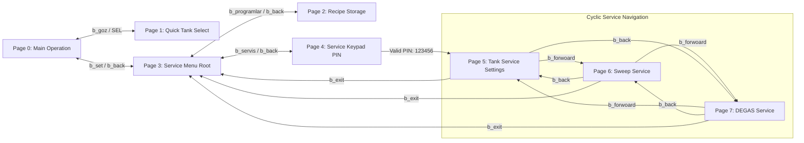

# NEXTION HMI — ESP32 IMPLEMENTATION CONTRACT
**Document Revision:** 2.0.0 (Authoritative Contract)  
**System Targets:** ESP32-S3 Master + Nextion HMI (USART2 9600 / 115200 Baud) + Dual STM32G474RE Slave Nodes  
**Status:** `ESP32 HMI CONTRACT — IMPLEMENTED AND VERIFIED`

---

## 1. Page-by-Page Component Contracts

### PAGE 0: MAIN OPERATION (`page0`)

#### Buttons
| Component | Purpose | ESP32 Command | Handler | Allowed State | Blocked State | Resulting ESP32 State Change | Visual State |
| :--- | :--- | :--- | :--- | :--- | :--- | :--- | :--- |
| `b_goz` | Open quick tank select (Page 1) | `PAGE1_OPEN` | `komutIsle("PAGE1_OPEN")` | All | None | `temp_goz = secili_goz`, opens Page 1 | Displays `"Goz: " + secili_goz` |
| `b_fp` | Fast Program (5 min / 30°C) | `P_HIZLI` | `komutIsle("P_HIZLI")` | IDLE / STOP | `RUNNING`, `DEGAS`, Offline | Starts FP or sends `START_DEGAS` if armed | Active run status |
| `b_p1` | Select Preset Recipe P1 | `P1_SEL` | `komutIsle("P1_SEL")` | IDLE / STOP | `RUNNING`, `DEGAS`, Offline | Loads `p_sure[1]`, `p_sic[1]`, `p_sweep[1]` | `b_swe` reflects `p_sweep[1]` |
| `b_p2` | Select Preset Recipe P2 | `P2_SEL` | `komutIsle("P2_SEL")` | IDLE / STOP | `RUNNING`, `DEGAS`, Offline | Loads `p_sure[2]`, `p_sic[2]`, `p_sweep[2]` | `b_swe` reflects `p_sweep[2]` |
| `b_p3` | Select Preset Recipe P3 | `P3_SEL` | `komutIsle("P3_SEL")` | IDLE / STOP | `RUNNING`, `DEGAS`, Offline | Loads `p_sure[3]`, `p_sic[3]`, `p_sweep[3]` | `b_swe` reflects `p_sweep[3]` |
| `b_stop` | Stop / Fault Clear | `CMD_STOP` | `komutIsle("CMD_STOP")` | All | None | `makine_calisiyor=0`, `degas_active=0`, `degas_armed=0` | Status "SISTEM DURDURULDU" |
| `b_start` | Start Ultrasonic Run | `CMD_START\|<sure>\|<sic>` | `komutIsle("CMD_START...")` | IDLE / STOP | `DEGAS`, `FAULT`, Offline | `makine_calisiyor=1` or starts DEGAS | Status "YIKAMA DEVAM EDIYOR" |
| `b_set` | Open Service Menu Root | Nextion local (`page page3`) | N/A (HMI local) | All | None | Transitions HMI to Page 3 | Nextion Page 3 |
| `b_deg` | Toggle DEGAS Intent | `b_deg` / `CMD_DEGAS_SEL` | `komutIsle("b_deg")` | IDLE / STOP | `RUNNING`, `DEGAS` | Toggles `degas_armed[secili_goz]`, forces Sweep OFF | `2016` (Green) if ON, `50712` if OFF |
| `b_swe` | Toggle Runtime Sweep | `b_swe` / `CMD_SWEEP_TOGGLE`| `komutIsle("b_swe")` | IDLE / RUNNING | `DEGAS` Active | Toggles `runtime_sweep[secili_goz]`, disarms DEGAS | `2016` (Green) if ON, `50712` if OFF |

#### Texts
| Component | Source Variable | Update Trigger | Displayed Value / Formatting | Scope & Keyboard |
| :--- | :--- | :--- | :--- | :--- |
| `t_durum` | `durum_metni[secili_goz]` | State change / Periodic 1000ms | `"SISTEM BEKLEMEDE"`, `"YIKAMA DEVAM EDIYOR..."`, etc. | `vscope=local`, `key=none` |
| `t_kalan_sure` | `kalan_saniye[secili_goz]` | Periodic 1000ms / Telemetry | `MM:SS` (e.g. `"14:59"`, `"00:00"`) | `vscope=local`, `key=none` |
| `t_anlik_sic` | `anlik_sicaklik[secili_goz]` | Periodic 1000ms / Telemetry | Fixed 1 decimal (`"45.2"`), or `"--.-"` on PT100 fault | `vscope=local`, `key=none` |
| `t_set_sic` | `hedef_sicaklik[secili_goz]` | Program select / Keyboard entry | Integer string 20..90 (°C) | `vscope=global`, `key=numeric` |
| `t_set_sure` | `hedef_sure[secili_goz]` | Program select / Keyboard entry | 2-digit integer string 01..120 (min) | `vscope=global`, `key=numeric` |

---

### PAGE 1: QUICK TANK SELECT (`page1`)

#### Buttons
| Component | Purpose | ESP32 Command | Handler | Allowed State | Blocked State | Resulting ESP32 State Change | Visual State |
| :--- | :--- | :--- | :--- | :--- | :--- | :--- | :--- |
| `b_up` | Increment candidate tank | `UP` / `PAGE1_UP` | `komutIsle("UP")` | All | None | `temp_goz = min(temp_goz+1, max_goz_sayisi)` | Displays `temp_goz` |
| `b_down` | Decrement candidate tank | `DOWN` / `PAGE1_DOWN` | `komutIsle("DOWN")` | All | None | `temp_goz = max(temp_goz-1, 1)` | Displays `temp_goz` |
| `b_ok` | Confirm Tank Selection | `SEL` / `b_ok` / `PAGE1_OK` | `komutIsle("SEL")` | All | None | `secili_goz = temp_goz`, loads setpoints, jumps Page 0 | Jumps to Page 0 |
| `b_back` | Cancel Selection | `BACK` / `PAGE1_BACK` | `komutIsle("BACK")` | All | None | `temp_goz = secili_goz`, jumps Page 0 | Jumps to Page 0 |

#### Texts
| Component | Source Variable | Update Trigger | Displayed Value / Formatting | Scope & Keyboard |
| :--- | :--- | :--- | :--- | :--- |
| `t0` | `temp_goz` | Page open / `b_up` / `b_down` | Integer string (`"1"`, `"2"`, `"3"`) | `vscope=local`, `key=none` |
| `uyarı_yazısı_2` | Static text string | Page initialization | `"Lutfen Calisacaginiz Gozu Seciniz"` | `vscope=local`, `key=none` |

---

### PAGE 2: PROGRAM / RECIPE STORAGE (`page2`)

#### Buttons
| Component | Purpose | ESP32 Command | Handler | Allowed State | Blocked State | Resulting ESP32 State Change | Visual State |
| :--- | :--- | :--- | :--- | :--- | :--- | :--- | :--- |
| `b_p1` | Edit Preset P1 | `EDIT_P1` | `komutIsle("EDIT_P1")` | IDLE / STOP | `RUNNING`, `DEGAS` | `duzenlenen_program = 1`, loads P1 fields | Header `"PROGRAM P1"` |
| `b_p2` | Edit Preset P2 | `EDIT_P2` | `komutIsle("EDIT_P2")` | IDLE / STOP | `RUNNING`, `DEGAS` | `duzenlenen_program = 2`, loads P2 fields | Header `"PROGRAM P2"` |
| `b_p3` | Edit Preset P3 | `EDIT_P3` | `komutIsle("EDIT_P3")` | IDLE / STOP | `RUNNING`, `DEGAS` | `duzenlenen_program = 3`, loads P3 fields | Header `"PROGRAM P3"` |
| `b_swe` | Toggle Sweep for Program | `PAGE2_SWEEP_TOGGLE` | `komutIsle("PAGE2_SWEEP_TOGGLE")`| IDLE / STOP | `RUNNING`, `DEGAS` | `p_sweep[p] = !p_sweep[p]` (RAM only) | `2016` (Green) / `50712` (Default) |
| `b_save` | Persist Recipe to NVS | `P_SAVE\|<sure>\|<sic>` | `komutIsle("P_SAVE...")` | Authenticated | `RUNNING`, Unauth | Writes `pS
`, `pT
`, `pSw
` to NVS | Flashes `2016` Green ACK |
| `b_back` | Return to Main Operation | Nextion local (`page page0`) | N/A (HMI local) | All | None | Returns to Page 0 | Nextion Page 0 |

#### Texts
| Component | Source Variable | Update Trigger | Displayed Value / Formatting | Scope & Keyboard |
| :--- | :--- | :--- | :--- | :--- |
| `t0` | `duzenlenen_program` | `EDIT_P1` .. `EDIT_P3` | `"PROGRAM P1"`, `"PROGRAM P2"`, `"PROGRAM P3"` | `vscope=local`, `key=none` |
| `t_set_sure` | `p_sure[duzenlenen_program]` | Program edit select / input | 2-digit integer string (e.g. `"15"`, `"20"`) | `vscope=global`, `key=numeric` |
| `t_set_sic` | `p_sicaklik[duzenlenen_program]`| Program edit select / input | Integer string (e.g. `"40"`, `"50"`) | `vscope=global`, `key=numeric` |

---

### PAGE 3: SERVICE MENU ROOT (`page3`)

#### Buttons
| Component | Purpose | ESP32 Command | Handler | Allowed State | Blocked State | Resulting ESP32 State Change | Visual State |
| :--- | :--- | :--- | :--- | :--- | :--- | :--- | :--- |
| `b_servis` | Enter Service PIN Keypad | Nextion local (`page page4`) | N/A (HMI local) | All | None | Opens Page 4 Password Keypad | Nextion Page 4 |
| `b_programlar`| Open Recipe Editor | Nextion local (`page page2`) | `komutIsle("PAGE2_OPEN")` | All | None | Opens Page 2, loads P1 recipe | Nextion Page 2 |
| `b_dil` | Language Setup | N/A | N/A | All | None | UI feature | Nextion UI |
| `b_saat` | Real-Time Clock Setup | N/A | N/A | All | None | UI feature | Nextion UI |
| `b_back` | Return to Main Operation | Nextion local (`page page0`) | N/A (HMI local) | All | None | Returns to Page 0 | Nextion Page 0 |

---

### PAGE 4: SERVICE AUTHENTICATION PIN KEYPAD (`page4`)

#### Buttons
| Component | Purpose | ESP32 Command | Handler | Allowed State | Blocked State | Resulting ESP32 State Change | Visual State |
| :--- | :--- | :--- | :--- | :--- | :--- | :--- | :--- |
| `b_0` .. `b_9` | Keypad Digits 0 to 9 | `KEY0` .. `KEY9` / `b_0`..`b_9`| `komutIsle("KEY...")` | Inactivity < 5 min | Max 6 chars | Appends digit to `girilen_sifre` | Masked stars `******` |
| `b_del` | Delete last PIN digit | `KEY_DEL` / `b_del` | `komutIsle("KEY_DEL")` | Any length > 0 | Length == 0 | Removes last char from `girilen_sifre` | Masked stars `***` |
| `b_space` | Space Character | `KEY_SPACE` / `b_space` | `komutIsle("KEY_SPACE")`| All | None | No-op / spacer | Masked stars |
| `b_ok` | Validate PIN ("123456") | `KEY_OK` / `PAGE4_OK` | `komutIsle("KEY_OK")` | All | None | Sets `g_service_authenticated = true`, jumps Page 5 | Jumps to Page 5 / `"HATALI!"` |
| `b_back` | Return to Page 3 | Nextion local (`page page3`) | N/A (HMI local) | All | None | Clears PIN entry, returns to Page 3 | Nextion Page 3 |

#### Texts
| Component | Source Variable | Update Trigger | Displayed Value / Formatting | Scope & Keyboard |
| :--- | :--- | :--- | :--- | :--- |
| `t_pass` | `girilen_sifre` | Digits / Del / OK | `""`, `"*"`, `"**"`, ... or `"HATALI!"` | `vscope=local`, `key=none` |

---

### PAGE 5: TANK-SCOPED SERVICE SETTINGS (`page5`)

#### Buttons
| Component | Purpose | ESP32 Command | Handler | Allowed State | Blocked State | Resulting ESP32 State Change | Visual State |
| :--- | :--- | :--- | :--- | :--- | :--- | :--- | :--- |
| `b_up` | Select Previous Tank Index | `PAGE5_GOZ_UP` / `b_up` | `komutIsle("PAGE5_GOZ_UP")` | Authenticated | Unauthenticated | `secili_goz = (g>1 ? g-1 : max_goz)` | Reloads Page 5 with tank data |
| `b_down` | Select Next Tank Index | `PAGE5_GOZ_DOWN` / `b_down` | `komutIsle("PAGE5_GOZ_DOWN")`| Authenticated | Unauthenticated | `secili_goz = (g<max ? g+1 : 1)` | Reloads Page 5 with tank data |
| `b_guc_up` | Increment Power (+10%) | `GUC_UP` | `komutIsle("GUC_UP")` | Authenticated | `RUNNING`, Power==100 | `guc_seviyesi[g] += 10` (max 100) | Displays `t_guc` |
| `b_guc_down` | Decrement Power (-10%) | `GUC_DOWN` | `komutIsle("GUC_DOWN")` | Authenticated | `RUNNING`, Power==10 | `guc_seviyesi[g] -= 10` (min 10) | Displays `t_guc` |
| `b_id_up` | Increment Physical Card ID | `ID_UP` | `komutIsle("ID_UP")` | Authenticated | `RUNNING`, ID==255 | `kart_id[g] += 1` | Displays `t_id` |
| `b_id_down` | Decrement Physical Card ID | `ID_DOWN` | `komutIsle("ID_DOWN")` | Authenticated | `RUNNING`, ID==1 | `kart_id[g] -= 1` | Displays `t_id` |
| `b_max_up` | Increment System Max Tanks | `MAX_UP` | `komutIsle("MAX_UP")` | Authenticated | `RUNNING`, Max==10 | `max_goz_sayisi += 1` | Displays `t_max` |
| `b_max_down` | Decrement System Max Tanks | `MAX_DOWN` | `komutIsle("MAX_DOWN")` | Authenticated | `RUNNING`, Max==1 | `max_goz_sayisi -= 1` | Displays `t_max` |
| `b_save` | Persist Tank 5 Data | `PAGE5_SAVE` / `SRV_SAVE` | `komutIsle("PAGE5_SAVE")` | Authenticated | `RUNNING`, Unauth | Persists `guc_<g>`, `kid_<g>`, `maxgoz` | Flashes `2016` Green ACK |
| `b_forwoard` | Forward Cyclic -> Page 6 | `b_forwoard` / `NAV_FORWARD`| `komutIsle("NAV_FORWARD")` | Authenticated | Unauthenticated | `current_service_page = 6`, jumps Page 6 | Jumps to Page 6 |
| `b_back` | Back Cyclic -> Page 7 | `b_back` / `NAV_BACK` | `komutIsle("NAV_BACK")` | Authenticated | Unauthenticated | `current_service_page = 7`, jumps Page 7 | Jumps to Page 7 |
| `b_exit` | Exit Service Group -> Page 3 | `b_exit` / `SERVICE_EXIT` | `komutIsle("SERVICE_EXIT")`| All | None | Returns to Page 3 | Jumps to Page 3 |

#### Texts
| Component | Source Variable | Update Trigger | Displayed Value / Formatting | Scope & Keyboard |
| :--- | :--- | :--- | :--- | :--- |
| `t_goz_num` | `secili_goz` | Tank index navigation / Page open | `"Goz: " + String(secili_goz)` | `vscope=local`, `key=none` |
| `t_guc` | `guc_seviyesi[secili_goz]` | Tank change / Power buttons | Integer percentage string 10..100 | `vscope=local`, `key=none` |
| `t_id` | `kart_id[secili_goz]` | Tank change / Card ID buttons | Hardware ID integer string 1..255 | `vscope=local`, `key=none` |
| `t_max` | `max_goz_sayisi` | Max up/down buttons | System maximum tank count 1..10 | `vscope=local`, `key=none` |

---

### PAGE 6: TANK-SCOPED SWEEP SERVICE CONFIG (`page6`)

#### Buttons
| Component | Purpose | ESP32 Command | Handler | Allowed State | Blocked State | Resulting ESP32 State Change | Visual State |
| :--- | :--- | :--- | :--- | :--- | :--- | :--- | :--- |
| `b_swe` | Toggle Sweep Enable | `PAGE6_SWP_TOGGLE` | `komutIsle("PAGE6_SWP_TOGGLE")`| Authenticated | Unauthenticated | `service_sweep[g].enabled = !enabled`| `2016` (Green) / `50712` (Default) |
| `b_span_up` | Increment Span (+1 kHz) | `b_span_up` / `SWP_SPAN_UP` | `komutIsle("SWP_SPAN_UP")` | Authenticated | Span==4 | `service_sweep[g].span_khz += 1` | Displays `t_swp_span` |
| `b_span_down`| Decrement Span (-1 kHz) | `b_span_down` / `SWP_SPAN_DOWN`| `komutIsle("SWP_SPAN_DOWN")`| Authenticated | Span==1 | `service_sweep[g].span_khz -= 1` | Displays `t_swp_span` |
| `b_per_up` | Increment Period (+100 ms) | `b_per_up` / `SWP_PER_UP` | `komutIsle("SWP_PER_UP")` | Authenticated | Period==1000 | `service_sweep[g].period_ms += 100` | Displays `t_swp_period` |
| `b_per_down` | Decrement Period (-100 ms) | `b_per_down` / `SWP_PER_DOWN` | `komutIsle("SWP_PER_DOWN")` | Authenticated | Period==100 | `service_sweep[g].period_ms -= 100` | Displays `t_swp_period` |
| `b_step_up` | Increment Step Increment (+1) | `b_step_up` / `SWP_STEP_UP` | `komutIsle("SWP_STEP_UP")` | Authenticated | Step==8 | `service_sweep[g].step_increment += 1` | Displays `t_swp_step` |
| `b_step_down`| Decrement Step Increment (-1) | `b_step_down` / `SWP_STEP_DOWN`| `komutIsle("SWP_STEP_DOWN")`| Authenticated | Step==1 | `service_sweep[g].step_increment -= 1` | Displays `t_swp_step` |
| `b_save` | Persist Tank Sweep Settings | `PAGE6_SAVE` / `SWP_SAVE` | `komutIsle("PAGE6_SAVE")` | Authenticated | `RUNNING`, Unauth | Writes `sw_en_<g>`, `sw_sp_<g>`.. NVS | Flashes `2016` Green ACK |
| `b_forwoard` | Forward Cyclic -> Page 7 | `b_forwoard` / `NAV_FORWARD`| `komutIsle("NAV_FORWARD")` | Authenticated | Unauthenticated | `current_service_page = 7`, jumps Page 7 | Jumps to Page 7 |
| `b_back` | Back Cyclic -> Page 5 | `b_back` / `NAV_BACK` | `komutIsle("NAV_BACK")` | Authenticated | Unauthenticated | `current_service_page = 5`, jumps Page 5 | Jumps to Page 5 |
| `b_exit` | Exit Service Group -> Page 3 | `b_exit` / `SERVICE_EXIT` | `komutIsle("SERVICE_EXIT")`| All | None | Returns to Page 3 | Jumps to Page 3 |

#### Texts
| Component | Source Variable | Update Trigger | Displayed Value / Formatting | Scope & Keyboard |
| :--- | :--- | :--- | :--- | :--- |
| `t_goz_num` | `secili_goz` | Tank change / Page open | `"Goz: " + String(secili_goz)` | `vscope=local`, `key=none` |
| `t_swp_state` | `service_sweep[g].enabled` | Toggle / Page open | `"ON"` or `"OFF"` | `vscope=local`, `key=none` |
| `t_swp_span` | `service_sweep[g].span_khz` | Span up/down | Integer string 1..4 (kHz) | `vscope=local`, `key=none` |
| `t_swp_period`| `service_sweep[g].period_ms` | Period up/down | Integer string 100..1000 (ms) | `vscope=local`, `key=none` |
| `t_swp_step` | `service_sweep[g].step_increment`| Step up/down | Integer string 1..8 | `vscope=local`, `key=none` |

---

### PAGE 7: TANK-SCOPED DEGAS SERVICE CONFIG (`page7`)

#### Buttons
| Component | Purpose | ESP32 Command | Handler | Allowed State | Blocked State | Resulting ESP32 State Change | Visual State |
| :--- | :--- | :--- | :--- | :--- | :--- | :--- | :--- |
| `b_dur_up`/`down`| Duration +/- 1 min | `DEG_DUR_UP` / `DOWN` | `komutIsle("DEG_DUR_...")` | Authenticated | Dur < 1 / > 120 | `service_degas[g].duration_minutes +/-= 1` | Displays `t_deg_dur` |
| `b_pwr_up`/`down`| Power +/- 10% | `DEG_PWR_UP` / `DOWN` | `komutIsle("DEG_PWR_...")` | Authenticated | Pwr < 10 / > 100 | `service_degas[g].power_pct +/-= 10` | Displays `t_deg_pwr` |
| `b_frq_up`/`down`| Frequency +/- 1 kHz | `DEG_FRQ_UP` / `DOWN` | `komutIsle("DEG_FRQ_...")` | Authenticated | Frq < 28 / > 40 | `service_degas[g].frequency_khz +/-= 1` | Displays `t_deg_frq` |
| `b_on_up`/`down` | Pulse ON +/- 100 ms | `DEG_ON_UP` / `DOWN` | `komutIsle("DEG_ON_...")` | Authenticated | On < 100 / > 10000 | `service_degas[g].pulse_on_ms +/-= 100` | Displays `t_deg_on` |
| `b_off_up`/`down`| Pulse OFF +/- 100 ms | `DEG_OFF_UP` / `DOWN` | `komutIsle("DEG_OFF_...")` | Authenticated | Off < 0 / > 10000 | `service_degas[g].pulse_off_ms +/-= 100` | Displays `t_deg_off` |
| `b_tc_toggle` | Toggle Temp Control | `DEG_TC_TOGGLE` | `komutIsle("DEG_TC_TOGGLE")`| Authenticated | Unauthenticated | `service_degas[g].temp_ctrl = !temp_ctrl` | `"ON"` or `"OFF"` |
| `b_tgt_up`/`down`| Target Temp +/- 1°C | `DEG_TGT_UP` / `DOWN` | `komutIsle("DEG_TGT_...")` | Temp Ctrl == 1 | Temp Ctrl == 0 | `service_degas[g].target_temp_c +/-= 1.0`| Displays `t_deg_tgt` (or `"--"`) |
| `b_save` | Persist Tank DEGAS Settings | `PAGE7_SAVE` / `SRV_DEGAS_SAVE`| `komutIsle("PAGE7_SAVE")`| Authenticated | `RUNNING`, Unauth | Writes `d<g>_dur`.. to `"degas_cfg"` NVS | Flashes `2016` Green ACK |
| `b_forwoard` | Forward Cyclic -> Page 5 | `b_forwoard` / `NAV_FORWARD`| `komutIsle("NAV_FORWARD")` | Authenticated | Unauthenticated | `current_service_page = 5`, jumps Page 5 | Jumps to Page 5 |
| `b_back` | Back Cyclic -> Page 6 | `b_back` / `NAV_BACK` | `komutIsle("NAV_BACK")` | Authenticated | Unauthenticated | `current_service_page = 6`, jumps Page 6 | Jumps to Page 6 |
| `b_exit` | Exit Service Group -> Page 3 | `b_exit` / `SERVICE_EXIT` | `komutIsle("SERVICE_EXIT")`| All | None | Returns to Page 3 | Jumps to Page 3 |

#### Texts
| Component | Source Variable | Update Trigger | Displayed Value / Formatting | Scope & Keyboard |
| :--- | :--- | :--- | :--- | :--- |
| `t_goz_num` | `secili_goz` | Tank change / Page open | `"Goz: " + String(secili_goz)` | `vscope=local`, `key=none` |
| `t_deg_dur` | `service_degas[g].duration_minutes` | Duration buttons | Integer minutes 1..120 | `vscope=local`, `key=none` |
| `t_deg_pwr` | `service_degas[g].power_pct` | Power buttons | Integer percentage 10..100 | `vscope=local`, `key=none` |
| `t_deg_frq` | `service_degas[g].frequency_khz` | Frequency buttons | Integer kHz 28..40 | `vscope=local`, `key=none` |
| `t_deg_on` | `service_degas[g].pulse_on_ms` | Pulse ON buttons | Integer ms 100..10000 | `vscope=local`, `key=none` |
| `t_deg_off` | `service_degas[g].pulse_off_ms` | Pulse OFF buttons | Integer ms 0 / 100..10000 | `vscope=local`, `key=none` |
| `t_deg_tc` | `service_degas[g].temp_ctrl` | TC toggle button | `"ON"` or `"OFF"` | `vscope=local`, `key=none` |
| `t_deg_tgt` | `service_degas[g].target_temp_c` | Target temp buttons / TC toggle | Integer degrees (e.g. `"50"`), or `"--"` when TC is OFF | `vscope=local`, `key=none` |

---

## 2. Global Integration & Protocol Matrices

### PAGE NAVIGATION MATRIX

### PROGRAM / NVS MATRIX
| Preset ID | NVS Duration Key | Default Duration | NVS Temp Key | Default Temp | NVS Sweep Key | Default Sweep | Page 0 Execution Behavior |
| :--- | :--- | :--- | :--- | :--- | :--- | :--- | :--- |
| **P1** | `pS1` | 15 min | `pT1` | 40 °C | `pSw1` | 0 (OFF) | Loads 15m, 40°C, Sweep state, updates `b_swe` |
| **P2** | `pS2` | 20 min | `pT2` | 50 °C | `pSw2` | 0 (OFF) | Loads 20m, 50°C, Sweep state, updates `b_swe` |
| **P3** | `pS3` | 25 min | `pT3` | 60 °C | `pSw3` | 0 (OFF) | Loads 25m, 60°C, Sweep state, updates `b_swe` |

### PER-TANK DATA OWNERSHIP MATRIX
| Parameter | Structure Variable | NVS Namespace | NVS Key Pattern | Validation Range | Tank Isolation Guaranteed |
| :--- | :--- | :--- | :--- | :--- | :--- |
| **Power Level** | `guc_seviyesi[1..10]` | `"ultra"` | `guc_<g>` | 10 .. 100 % | Yes (Tank 1 != Tank 2) |
| **Hardware ID** | `kart_id[1..10]` | `"ultra"` | `kid_<g>` | 1 .. 255 | Yes (Tank 1 != Tank 2) |
| **Sweep Enable** | `service_sweep[1..10].enabled` | `"ultra"` | `sw_en_<g>` | 0 or 1 | Yes (Tank 1 != Tank 2) |
| **Sweep Span** | `service_sweep[1..10].span_khz` | `"ultra"` | `sw_sp_<g>` | 1 .. 4 kHz | Yes (Tank 1 != Tank 2) |
| **Sweep Period** | `service_sweep[1..10].period_ms` | `"ultra"` | `sw_pr_<g>` | 100 .. 1000 ms | Yes (Tank 1 != Tank 2) |
| **Sweep Increment**| `service_sweep[1..10].step_increment`| `"ultra"` | `sw_st_<g>` | 1 .. 8 | Yes (Tank 1 != Tank 2) |
| **DEGAS Config** | `service_degas[1..10]` | `"degas_cfg"`| `d<g>_*` | Struct validated | Yes (Tank 1 != Tank 2) |

### PAGE 0 SWEEP / DEGAS MUTUAL EXCLUSION MATRIX
| Current Active State | User Action | Resulting Action | `b_deg.bco` | `b_swe.bco` | RS485 Transmission |
| :--- | :--- | :--- | :--- | :--- | :--- |
| **IDLE, All OFF** | Press `b_deg` | Arms DEGAS intent | `2016` (Green) | `50712` (Default)| `T<g>:SWEEP:OFF\n` |
| **DEGAS Armed** | Press `b_swe` | Turns Sweep ON, disarms DEGAS | `50712` (Default)| `2016` (Green) | `T<g>:SWEEP:ON\n` |
| **DEGAS Armed** | Select `P1..P3` | Loads recipe, disarms DEGAS | `50712` (Default)| Program Sweep | `T<g>:SET_TIME` / `SET_TEMP` |
| **DEGAS Active** | Press `b_swe` | **BLOCKED** | Unchanged | Unchanged | None |
| **Sweep Active** | Press `b_deg` | Arms DEGAS, turns Sweep OFF | `2016` (Green) | `50712` (Default)| `T<g>:SWEEP:OFF\n` |

### LOCKOUT MATRIX
| Target Operation | During `RUNNING` | During `DEGAS` | During `FAULT` | Unauthenticated |
| :--- | :--- | :--- | :--- | :--- |
| **Set Time / Temp (`TIME_UP`..)** | **LOCKED** | **LOCKED** | Allowed (Pre-run) | Allowed |
| **Recipe Selection (`P1_SEL`..)** | **LOCKED** | **LOCKED** | Allowed | Allowed |
| **Recipe Save (`P_SAVE`)** | **LOCKED** | **LOCKED** | Allowed | **LOCKED** (RED feedback) |
| **Service Menus 5, 6, 7 Access** | **LOCKED** | **LOCKED** | **LOCKED** | **LOCKED** (RED feedback) |
| **Service Save (`PAGE5..7_SAVE`)**| **LOCKED** | **LOCKED** | **LOCKED** | **LOCKED** (RED feedback) |
| **Emergency STOP (`CMD_STOP`)** | **ALLOWED** | **ALLOWED** | **ALLOWED** | **ALLOWED** |

---

## 3. Command Matrix, NVS Keys & Test Verification

### NEW / CHANGED ESP32 COMMAND MATRIX
| Command String | Primary Source | Parser Handling Routine | Action Taken |
| :--- | :--- | :--- | :--- |
| `b_deg` / `CMD_DEGAS_SEL` | Page 0 `b_deg` | `komutIsle("b_deg")` | Toggles `degas_armed[secili_goz]`, updates `b_deg.bco` |
| `b_swe` / `CMD_SWEEP_TOGGLE`| Page 0 `b_swe` | `komutIsle("b_swe")` | Toggles `runtime_sweep[secili_goz]`, updates `b_swe.bco` |
| `PAGE2_SWEEP_TOGGLE` | Page 2 `b_swe` | `komutIsle("PAGE2_SWEEP_TOGGLE")` | Toggles `p_sweep[duzenlenen_program]` in RAM |
| `P_SAVE\|<sure>\|<sic>` | Page 2 `b_save` | `komutIsle("P_SAVE...")` | Persists recipe parameters + `p_sweep` to NVS |
| `PAGE5_GOZ_UP` / `b_up` | Page 5 `b_up` | `komutIsle("PAGE5_GOZ_UP")` | Decrements `secili_goz`, refreshes active service page |
| `PAGE5_GOZ_DOWN` / `b_down`| Page 5 `b_down` | `komutIsle("PAGE5_GOZ_DOWN")` | Increments `secili_goz`, refreshes active service page |
| `PAGE5_SAVE` | Page 5 `b_save` | `komutIsle("PAGE5_SAVE")` | Saves power level & card ID for `secili_goz` |
| `PAGE6_SWP_TOGGLE` | Page 6 `b_swe` | `komutIsle("PAGE6_SWP_TOGGLE")` | Toggles `service_sweep[secili_goz].enabled` |
| `PAGE6_SAVE` | Page 6 `b_save` | `komutIsle("PAGE6_SAVE")` | Saves sweep parameters for `secili_goz` |
| `PAGE7_SAVE` | Page 7 `b_save` | `komutIsle("PAGE7_SAVE")` | Saves DEGAS parameters for `secili_goz` |
| `b_forwoard` / `NAV_FORWARD`| Page 5/6/7 `b_forwoard` | `komutIsle("NAV_FORWARD")` | Cyclic forward transition (5->6->7->5) |
| `b_back` / `NAV_BACK` | Page 5/6/7 `b_back` | `komutIsle("NAV_BACK")` | Cyclic backward transition (5->7->6->5) |
| `b_exit` / `SERVICE_EXIT` | Page 5/6/7 `b_exit` | `komutIsle("SERVICE_EXIT")` | Returns to Page 3 (`page page3`) |

### NEW / CHANGED NVS KEYS
| Namespace | Key String | Type | Default Value | Description |
| :--- | :--- | :--- | :--- | :--- |
| `"ultra"` | `pSw1`, `pSw2`, `pSw3` | `int` | `0` | Stored Sweep enable state for presets P1, P2, P3 |
| `"ultra"` | `guc_<g>` (1..10) | `int` | `50` | Per-tank persistent power level (10..100%) |
| `"ultra"` | `kid_<g>` (1..10) | `int` | `g` | Per-tank physical card hardware ID (1..255) |
| `"ultra"` | `sw_en_<g>` (1..10) | `int` | `0` | Per-tank persistent Sweep enabled in service |
| `"ultra"` | `sw_sp_<g>` (1..10) | `int` | `2` | Per-tank persistent Sweep span (1..4 kHz) |
| `"ultra"` | `sw_pr_<g>` (1..10) | `int` | `400` | Per-tank persistent Sweep period (100..1000 ms) |
| `"ultra"` | `sw_st_<g>` (1..10) | `int` | `4` | Per-tank persistent Sweep step increment (1..8) |
| `"degas_cfg"` | `d<g>_dur` (1..10) | `uint16`| `15` | Per-tank DEGAS duration (1..120 min) |
| `"degas_cfg"` | `d<g>_pwr` (1..10) | `uint8` | `100` | Per-tank DEGAS power percentage (10..100%) |
| `"degas_cfg"` | `d<g>_frq` (1..10) | `uint8` | `28` | Per-tank DEGAS frequency (28..40 kHz) |
| `"degas_cfg"` | `d<g>_on` (1..10) | `uint16`| `1000` | Per-tank DEGAS pulse ON time (100..10000 ms) |
| `"degas_cfg"` | `d<g>_off` (1..10) | `uint16`| `500` | Per-tank DEGAS pulse OFF time (0/100..10000 ms) |
| `"degas_cfg"` | `d<g>_tc` (1..10) | `uint8` | `0` | Per-tank DEGAS temperature control enable (0/1) |
| `"degas_cfg"` | `d<g>_tgt` (1..10) | `float` | `50.0` | Per-tank DEGAS target temperature (20..90 °C) |

### REGRESSION TEST MATRIX
| Test Suite | Function Name | Scope / Target | Result |
| :--- | :--- | :--- | :--- |
| `TestHMINewArchitectureSuite` | `test_arch_01_page0_degas_toggle` | Page 0 DEGAS single toggle button & visual sync | **PASS** |
| `TestHMINewArchitectureSuite` | `test_arch_02_page0_sweep_toggle` | Page 0 Sweep single toggle button & stmSweep | **PASS** |
| `TestHMINewArchitectureSuite` | `test_arch_03_p1_p2_p3_stored_sweep_state` | P1/P2/P3 preset sweep state loading & sync | **PASS** |
| `TestHMINewArchitectureSuite` | `test_arch_04_page2_sweep_save_load` | Page 2 Sweep toggle, recipe save to NVS & reload | **PASS** |
| `TestHMINewArchitectureSuite` | `test_arch_05_tank_selection_changing_page5_values` | Tank selection updating Page 5 fields | **PASS** |
| `TestHMINewArchitectureSuite` | `test_arch_06_tank1_and_tank2_configuration_isolation`| Tank 1 & Tank 2 power & ID isolation | **PASS** |
| `TestHMINewArchitectureSuite` | `test_arch_07_page_5_6_7_cyclic_forward_navigation` | Cyclic forward navigation (5->6->7->5) | **PASS** |
| `TestHMINewArchitectureSuite` | `test_arch_08_page_7_6_5_cyclic_back_navigation` | Cyclic back navigation (5->7->6->5) | **PASS** |
| `TestHMINewArchitectureSuite` | `test_arch_09_exit_service_menu_to_page3` | Exit from 5, 6, 7 to Page 3 | **PASS** |
| `TestHMINewArchitectureSuite` | `test_arch_10_page6_selected_tank_sweep_isolation` | Page 6 Sweep settings per-tank isolation | **PASS** |
| `TestHMINewArchitectureSuite` | `test_arch_11_page7_selected_tank_degas_isolation` | Page 7 DEGAS settings per-tank isolation | **PASS** |
| `TestHMINewArchitectureSuite` | `test_arch_12_reload_selected_tank_after_navigation`| Active tank retention across page navigation | **PASS** |
| `TestHMINewArchitectureSuite` | `test_arch_13_service_authentication_protection` | Service PIN authentication & timeout guard | **PASS** |
| `TestHMINewArchitectureSuite` | `test_arch_14_active_process_lockouts` | Active process touch and setpoint lockouts | **PASS** |
| `TestHMINewArchitectureSuite` | `test_arch_15_degas_sweep_mutual_exclusion` | DEGAS & Sweep mutual exclusion invariant | **PASS** |
| `TestHMIMockSuite` | `test_01` .. `test_18` | HMI command dispatcher, offline watchdog & NVS | **PASS** |
| `TestRS485MockSuite` | `test_01` .. `test_17` | Multi-Drop RS485 Addressing & Frame Collision | **PASS** |

---

## 4. Final Classification

`ESP32 HMI CONTRACT — IMPLEMENTED AND VERIFIED`
