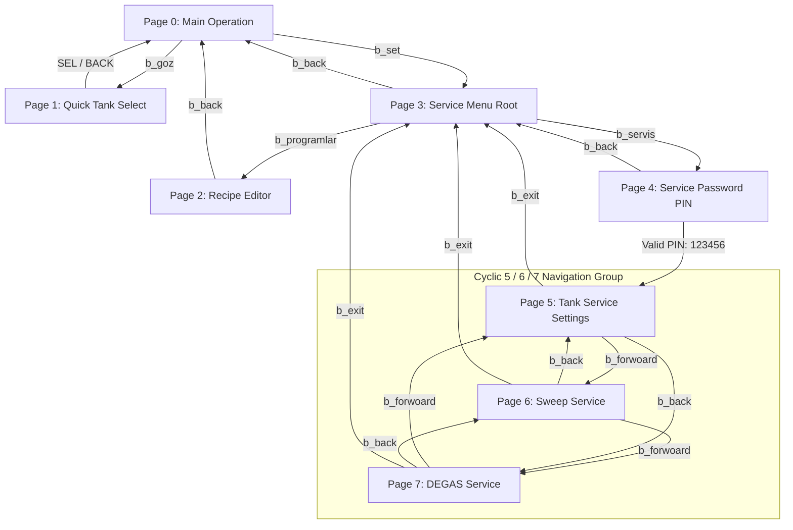

# NEXTION HMI FINAL IMPLEMENTATION MATRIX
**Document Version:** 2.0.0 (Authoritative Redesign)  
**System Target:** ESP32-S3 Master + Nextion HMI + Multi-Drop RS485 STM32G474 Slaves  
**Status:** `NEXTION REDESIGN — IMPLEMENTED AND VERIFIED`

---

## 1. Authoritative Page Component Tables

### PAGE 0: MAIN OPERATION (`page0`)
| Component | Type | Purpose | Nextion Touch Code | ESP32 Handler | State Ownership |
| :--- | :--- | :--- | :--- | :--- | :--- |
| `b_goz` | Button / Text | Displays active tank / Opens quick tank select | `printh A5 5A 02 01 00` or `print "PAGE1_OPEN\n"` | `PAGE1_OPEN` | ESP32 (`secili_goz`) |
| `b_fp` | Button | Fast Program (5 min, 30°C) Trigger | `print "P_HIZLI\n"` | `P_HIZLI` | ESP32 runtime state |
| `b_p1` | Button | Select Preset Program P1 | `print "P1_SEL\n"` | `P1_SEL` | ESP32 (`p_sure[1]`, `p_sicaklik[1]`, `p_sweep[1]`) |
| `b_p2` | Button | Select Preset Program P2 | `print "P2_SEL\n"` | `P2_SEL` | ESP32 (`p_sure[2]`, `p_sicaklik[2]`, `p_sweep[2]`) |
| `b_p3` | Button | Select Preset Program P3 | `print "P3_SEL\n"` | `P3_SEL` | ESP32 (`p_sure[3]`, `p_sicaklik[3]`, `p_sweep[3]`) |
| `b_stop` | Button | Emergency / Normal Stop & Fault Clear | `print "CMD_STOP\n"` | `CMD_STOP` | ESP32 + STM32 (`STOP`) |
| `b_start` | Button | Start Ultrasonic Process | `print "CMD_START\|"; print t_set_sure.txt; print "\|"; print t_set_sic.txt; print "\n"` | `CMD_START\|<sure>\|<sicaklik>` | ESP32 (`makine_calisiyor`) |
| `b_set` | Button | Opens Service Root / Setup Menu | `page page3` | Nextion local jump (Page 3) | Local navigation |
| `b_deg` | Button (Toggle) | DEGAS Armed/Disarmed Selection Toggle | `print "b_deg\n"` or `print "CMD_DEGAS_SEL\n"` | `CMD_DEGAS_SEL` / `b_deg` | ESP32 (`degas_armed[secili_goz]`) |
| `b_swe` | Button (Toggle) | Runtime Frequency Sweep Toggle | `print "b_swe\n"` or `print "CMD_SWEEP_TOGGLE\n"` | `CMD_SWEEP_TOGGLE` / `b_swe` | ESP32 (`runtime_sweep[secili_goz]`) |
| `t_durum` | Text | Operational State Text | (Read-only) | Updated via `t_durum.txt="..."` | ESP32 (`durum_metni[secili_goz]`) |
| `t_kalan_sure` | Text | Remaining Process Time (MM:SS) | (Read-only) | Updated via `t_kalan_sure.txt="..."` | STM32 Telemetry (`kalan_saniye`) |
| `t_anlik_sic` | Text | Actual Measured Temperature (°C) | (Read-only) | Updated via `t_anlik_sic.txt="..."` | STM32 Telemetry (`anlik_sicaklik`) |
| `t_set_sic` | Text / Input | Setpoint Temperature (°C) | Keypad input or Touch event | `SET_TEMP:<deg>` / `CMD_START` | ESP32 (`hedef_sicaklik[secili_goz]`) |
| `t_set_sure` | Text / Input | Setpoint Duration (Minutes) | Keypad input or Touch event | `SET_TIME:<dk>` / `CMD_START` | ESP32 (`hedef_sure[secili_goz]`) |

---

### PAGE 2: PROGRAM / RECIPE STORAGE (`page2`)
| Component | Type | Purpose | Nextion Touch Code | ESP32 Handler | State Ownership |
| :--- | :--- | :--- | :--- | :--- | :--- |
| `t0` | Text | Program Header Title (`PROGRAM P1..P3`) | (Read-only) | Updated via `t0.txt="..."` | ESP32 (`duzenlenen_program`) |
| `t_set_sure` | Text / Input | Edited Program Duration (Minutes) | Keypad input (`vscope=global`, `key=numeric`) | `P_SAVE` payload | ESP32 (`p_sure[p]`) |
| `t_set_sic` | Text / Input | Edited Program Temperature (°C) | Keypad input (`vscope=global`, `key=numeric`) | `P_SAVE` payload | ESP32 (`p_sicaklik[p]`) |
| `b_p1` | Button | Select P1 Recipe for Editing | `print "EDIT_P1\n"` | `EDIT_P1` | ESP32 (`duzenlenen_program = 1`) |
| `b_p2` | Button | Select P2 Recipe for Editing | `print "EDIT_P2\n"` | `EDIT_P2` | ESP32 (`duzenlenen_program = 2`) |
| `b_p3` | Button | Select P3 Recipe for Editing | `print "EDIT_P3\n"` | `EDIT_P3` | ESP32 (`duzenlenen_program = 3`) |
| `b_swe` | Button (Toggle) | Toggle Sweep Association for Selected Program | `print "PAGE2_SWEEP_TOGGLE\n"` | `PAGE2_SWEEP_TOGGLE` | ESP32 (`p_sweep[duzenlenen_program]`) |
| `b_save` | Button | Persist Duration, Temp & Sweep to NVS | `print "P_SAVE\|"; print t_set_sure.txt; print "\|"; print t_set_sic.txt; print "\n"` | `P_SAVE\|<sure>\|<sic>` | ESP32 NVS (`pS
`, `pT
`, `pSw
`) |
| `b_back` | Button | Return to Main Operation Page | `page page0` | Nextion local jump / `updatePage0UI` | Local navigation |

---

### PAGE 3: SERVICE MENU ROOT (`page3`)
| Component | Type | Purpose | Nextion Touch Code | ESP32 Handler | State Ownership |
| :--- | :--- | :--- | :--- | :--- | :--- |
| `b_servis` | Button | Enter Password-Protected Service Area | `page page4` | Nextion jump to PIN keypad | Local navigation |
| `b_programlar`| Button | Enter Recipe Editor | `page page2` | `PAGE2_OPEN` | ESP32 (`duzenlenen_program = 1`) |
| `b_dil` | Button | Language Setup | (Reserved UI setup) | N/A | Local UI |
| `b_saat` | Button | Real-time Clock Setup | (Reserved UI setup) | N/A | Local UI |
| `b_back` | Button | Return to Main Operation Page | `page page0` | Nextion local jump | Local navigation |

---

### PAGE 4: SERVICE AUTHENTICATION KEYPAD (`page4`)
| Component | Type | Purpose | Nextion Touch Code | ESP32 Handler | State Ownership |
| :--- | :--- | :--- | :--- | :--- | :--- |
| `t_pass` | Text | Masked Password Field (`******`) | (Read-only) | Updated via `t_pass.txt="..."` | ESP32 (`girilen_sifre`) |
| `b0` .. `b9` | Button | Numeric Digits 0 to 9 | `print "KEY0\n"` .. `print "KEY9\n"` | `KEY0` .. `KEY9` | ESP32 (`girilen_sifre`) |
| `b_del` | Button | Backspace / Delete last digit | `print "KEY_DEL\n"` | `KEY_DEL` | ESP32 (`girilen_sifre`) |
| `b_ok` | Button | Validate Password & Authenticate | `print "KEY_OK\n"` | `KEY_OK` | ESP32 (`g_service_authenticated`) |
| `b_back` | Button | Cancel and Return to Page 3 | `page page3` | Nextion local jump | Local navigation |

---

### PAGE 5: SERVICE SETTINGS / SELECTED TANK (`page5`)
| Component | Type | Purpose | Nextion Touch Code | ESP32 Handler | State Ownership |
| :--- | :--- | :--- | :--- | :--- | :--- |
| `t_goz_num` | Text | Active Tank Selection Index (`Goz: 1..10`) | (Read-only) | Updated via `t_goz_num.txt="..."` | ESP32 (`secili_goz`) |
| `t_guc` | Text | Power Level % (10..100%) | (Read-only) | Updated via `t_guc.txt="..."` | ESP32 (`guc_seviyesi[secili_goz]`) |
| `t_id` | Text | Physical Hardware Card ID (1..255) | (Read-only) | Updated via `t_id.txt="..."` | ESP32 (`kart_id[secili_goz]`) |
| `t_max` | Text | Maximum Active Tanks in System (1..10) | (Read-only) | Updated via `t_max.txt="..."` | ESP32 (`max_goz_sayisi`) |
| `b_up` | Button | Select Previous Tank (Decrements Tank Index) | `print "PAGE5_GOZ_UP\n"` or `print "b_up\n"` | `PAGE5_GOZ_UP` / `b_up` | ESP32 (`secili_goz`) |
| `b_down` | Button | Select Next Tank (Increments Tank Index) | `print "PAGE5_GOZ_DOWN\n"` or `print "b_down\n"` | `PAGE5_GOZ_DOWN` / `b_down` | ESP32 (`secili_goz`) |
| `b_guc_up` | Button | Increment Selected Tank Power (+10%) | `print "GUC_UP\n"` | `GUC_UP` | ESP32 (`guc_seviyesi[secili_goz]`) |
| `b_guc_down` | Button | Decrement Selected Tank Power (-10%) | `print "GUC_DOWN\n"` | `GUC_DOWN` | ESP32 (`guc_seviyesi[secili_goz]`) |
| `b_id_up` | Button | Increment Physical Card ID (+1) | `print "ID_UP\n"` | `ID_UP` | ESP32 (`kart_id[secili_goz]`) |
| `b_id_down` | Button | Decrement Physical Card ID (-1) | `print "ID_DOWN\n"` | `ID_DOWN` | ESP32 (`kart_id[secili_goz]`) |
| `b_max_up` | Button | Increment System Max Tanks (+1) | `print "MAX_UP\n"` | `MAX_UP` | ESP32 (`max_goz_sayisi`) |
| `b_max_down`| Button | Decrement System Max Tanks (-1) | `print "MAX_DOWN\n"` | `MAX_DOWN` | ESP32 (`max_goz_sayisi`) |
| `b_save` | Button | Persist Tank 5 Service Settings to NVS | `print "PAGE5_SAVE\n"` or `print "SRV_SAVE\n"` | `PAGE5_SAVE` / `SRV_SAVE` | ESP32 NVS (`guc_<g>`, `kid_<g>`) |
| `b_forwoard`| Button | Cyclic Navigation Forward -> Page 6 | `print "b_forwoard\n"` or `print "NAV_FORWARD\n"` | `NAV_FORWARD` | ESP32 (`current_service_page = 6`) |
| `b_back` | Button | Cyclic Navigation Back -> Page 7 | `print "b_back\n"` or `print "NAV_BACK\n"` | `NAV_BACK` | ESP32 (`current_service_page = 7`) |
| `b_exit` | Button | Exit Service Area -> Page 3 | `print "b_exit\n"` or `print "SERVICE_EXIT\n"` | `SERVICE_EXIT` | ESP32 jump to Page 3 |

---

### PAGE 6: SWEEP SERVICE SETTINGS (`page6`)
| Component | Type | Purpose | Nextion Touch Code | ESP32 Handler | State Ownership |
| :--- | :--- | :--- | :--- | :--- | :--- |
| `t_goz_num` | Text | Active Tank Header Index (`Goz: 1..10`) | (Read-only) | Updated via `t_goz_num.txt="..."` | ESP32 (`secili_goz`) |
| `t_swp_state`| Text | Sweep Configuration State (`ON` / `OFF`) | (Read-only) | Updated via `t_swp_state.txt="..."` | ESP32 (`service_sweep[g].enabled`) |
| `t_swp_span` | Text | Sweep Frequency Span (1..4 kHz) | (Read-only) | Updated via `t_swp_span.txt="..."` | ESP32 (`service_sweep[g].span_khz`) |
| `t_swp_period`| Text | Sweep Period (100..1000 ms) | (Read-only) | Updated via `t_swp_period.txt="..."` | ESP32 (`service_sweep[g].period_ms`) |
| `t_swp_step` | Text | Sweep Step Increment (1..8) | (Read-only) | Updated via `t_swp_step.txt="..."` | ESP32 (`service_sweep[g].step_increment`)|
| `b_swe` | Button (Toggle) | Toggle Selected Tank Sweep Feature | `print "PAGE6_SWP_TOGGLE\n"` | `PAGE6_SWP_TOGGLE` | ESP32 (`service_sweep[g].enabled`) |
| `b_span_up` | Button | Increment Sweep Span (+1 kHz) | `print "b_span_up\n"` or `print "SWP_SPAN_UP\n"` | `SWP_SPAN_UP` | ESP32 (`service_sweep[g].span_khz`) |
| `b_span_down`| Button | Decrement Sweep Span (-1 kHz) | `print "b_span_down\n"` or `print "SWP_SPAN_DOWN\n"`| `SWP_SPAN_DOWN` | ESP32 (`service_sweep[g].span_khz`) |
| `b_per_up` | Button | Increment Sweep Period (+100 ms) | `print "b_per_up\n"` or `print "SWP_PER_UP\n"` | `SWP_PER_UP` | ESP32 (`service_sweep[g].period_ms`) |
| `b_per_down` | Button | Decrement Sweep Period (-100 ms) | `print "b_per_down\n"` or `print "SWP_PER_DOWN\n"` | `SWP_PER_DOWN` | ESP32 (`service_sweep[g].period_ms`) |
| `b_step_up` | Button | Increment Step Increment (+1) | `print "b_step_up\n"` or `print "SWP_STEP_UP\n"` | `SWP_STEP_UP` | ESP32 (`service_sweep[g].step_increment`)|
| `b_step_down`| Button | Decrement Step Increment (-1) | `print "b_step_down\n"` or `print "SWP_STEP_DOWN\n"`| `SWP_STEP_DOWN` | ESP32 (`service_sweep[g].step_increment`)|
| `b_save` | Button | Persist Tank Sweep Settings to NVS | `print "PAGE6_SAVE\n"` or `print "SWP_SAVE\n"` | `PAGE6_SAVE` / `SWP_SAVE` | ESP32 NVS (`sw_en_<g>`, `sw_sp_<g>`..)|
| `b_forwoard`| Button | Cyclic Navigation Forward -> Page 7 | `print "b_forwoard\n"` or `print "NAV_FORWARD\n"` | `NAV_FORWARD` | ESP32 (`current_service_page = 7`) |
| `b_back` | Button | Cyclic Navigation Back -> Page 5 | `print "b_back\n"` or `print "NAV_BACK\n"` | `NAV_BACK` | ESP32 (`current_service_page = 5`) |
| `b_exit` | Button | Exit Service Area -> Page 3 | `print "b_exit\n"` or `print "SERVICE_EXIT\n"` | `SERVICE_EXIT` | ESP32 jump to Page 3 |

---

### PAGE 7: DEGAS SERVICE SETTINGS (`page7`)
| Component | Type | Purpose | Nextion Touch Code | ESP32 Handler | State Ownership |
| :--- | :--- | :--- | :--- | :--- | :--- |
| `t_goz_num` | Text | Active Tank Header Index (`Goz: 1..10`) | (Read-only) | Updated via `t_goz_num.txt="..."` | ESP32 (`secili_goz`) |
| `t_deg_dur` | Text | DEGAS Duration (1..120 min) | (Read-only) | Updated via `t_deg_dur.txt="..."` | ESP32 (`service_degas[g].duration_minutes`)|
| `t_deg_pwr` | Text | DEGAS Power % (10..100%) | (Read-only) | Updated via `t_deg_pwr.txt="..."` | ESP32 (`service_degas[g].power_pct`) |
| `t_deg_frq` | Text | DEGAS Frequency (28..40 kHz) | (Read-only) | Updated via `t_deg_frq.txt="..."` | ESP32 (`service_degas[g].frequency_khz`) |
| `t_deg_on` | Text | Pulse ON Time (100..10000 ms) | (Read-only) | Updated via `t_deg_on.txt="..."` | ESP32 (`service_degas[g].pulse_on_ms`) |
| `t_deg_off` | Text | Pulse OFF Time (0/100..10000 ms) | (Read-only) | Updated via `t_deg_off.txt="..."` | ESP32 (`service_degas[g].pulse_off_ms`) |
| `t_deg_tc` | Text | Temperature Control (`ON` / `OFF`)| (Read-only) | Updated via `t_deg_tc.txt="..."` | ESP32 (`service_degas[g].temp_ctrl`) |
| `t_deg_tgt` | Text | Target Temperature (°C / `--`) | (Read-only) | Updated via `t_deg_tgt.txt="..."` | ESP32 (`service_degas[g].target_temp_c`) |
| `b_dur_up` | Button | Increment Duration (+1 min) | `print "DEG_DUR_UP\n"` | `DEG_DUR_UP` | ESP32 (`duration_minutes`) |
| `b_dur_down` | Button | Decrement Duration (-1 min) | `print "DEG_DUR_DOWN\n"` | `DEG_DUR_DOWN` | ESP32 (`duration_minutes`) |
| `b_pwr_up` | Button | Increment Power (+10%) | `print "DEG_PWR_UP\n"` | `DEG_PWR_UP` | ESP32 (`power_pct`) |
| `b_pwr_down` | Button | Decrement Power (-10%) | `print "DEG_PWR_DOWN\n"` | `DEG_PWR_DOWN` | ESP32 (`power_pct`) |
| `b_frq_up` | Button | Increment Frequency (+1 kHz) | `print "DEG_FRQ_UP\n"` | `DEG_FRQ_UP` | ESP32 (`frequency_khz`) |
| `b_frq_down` | Button | Decrement Frequency (-1 kHz) | `print "DEG_FRQ_DOWN\n"` | `DEG_FRQ_DOWN` | ESP32 (`frequency_khz`) |
| `b_on_up` | Button | Increment Pulse ON (+100 ms) | `print "DEG_ON_UP\n"` | `DEG_ON_UP` | ESP32 (`pulse_on_ms`) |
| `b_on_down` | Button | Decrement Pulse ON (-100 ms) | `print "DEG_ON_DOWN\n"` | `DEG_ON_DOWN` | ESP32 (`pulse_on_ms`) |
| `b_off_up` | Button | Increment Pulse OFF (+100 ms) | `print "DEG_OFF_UP\n"` | `DEG_OFF_UP` | ESP32 (`pulse_off_ms`) |
| `b_off_down` | Button | Decrement Pulse OFF (-100 ms) | `print "DEG_OFF_DOWN\n"` | `DEG_OFF_DOWN` | ESP32 (`pulse_off_ms`) |
| `b_tc_toggle`| Button (Toggle) | Toggle DEGAS Temp Control | `print "DEG_TC_TOGGLE\n"` | `DEG_TC_TOGGLE` | ESP32 (`temp_ctrl`) |
| `b_tgt_up` | Button | Increment Target Temp (+1°C) | `print "DEG_TGT_UP\n"` | `DEG_TGT_UP` | ESP32 (`target_temp_c`) |
| `b_tgt_down` | Button | Decrement Target Temp (-1°C) | `print "DEG_TGT_DOWN\n"` | `DEG_TGT_DOWN` | ESP32 (`target_temp_c`) |
| `b_save` | Button | Persist Tank DEGAS Settings to NVS | `print "PAGE7_SAVE\n"` or `print "SRV_DEGAS_SAVE\n"`| `PAGE7_SAVE` / `SRV_DEGAS_SAVE` | ESP32 NVS (`d<g>_dur`..)|
| `b_forwoard`| Button | Cyclic Navigation Forward -> Page 5 | `print "b_forwoard\n"` or `print "NAV_FORWARD\n"` | `NAV_FORWARD` | ESP32 (`current_service_page = 5`) |
| `b_back` | Button | Cyclic Navigation Back -> Page 6 | `print "b_back\n"` or `print "NAV_BACK\n"` | `NAV_BACK` | ESP32 (`current_service_page = 6`) |
| `b_exit` | Button | Exit Service Area -> Page 3 | `print "b_exit\n"` or `print "SERVICE_EXIT\n"` | `SERVICE_EXIT` | ESP32 jump to Page 3 |

---

## 2. Architectural Matrices

### A. Page Navigation Matrix

### B. Tank-Scoped Data Ownership Matrix
| Parameter Scope | Storage Struct | Memory Location | NVS Key Pattern | Validation Bounds | Cross-Tank Behavior |
| :--- | :--- | :--- | :--- | :--- | :--- |
| **Power Level (%)** | `guc_seviyesi[g]` | RAM / NVS | `guc_<g>` | 10 .. 100 % | Isolated per tank |
| **Physical Card ID** | `kart_id[g]` | RAM / NVS | `kid_<g>` | 1 .. 255 | Isolated per tank |
| **Sweep Enabled** | `service_sweep[g].enabled` | RAM / NVS | `sw_en_<g>` | 0 or 1 | Isolated per tank |
| **Sweep Span (kHz)**| `service_sweep[g].span_khz` | RAM / NVS | `sw_sp_<g>` | 1 .. 4 kHz | Isolated per tank |
| **Sweep Period (ms)**| `service_sweep[g].period_ms` | RAM / NVS | `sw_pr_<g>` | 100 .. 1000 ms | Isolated per tank |
| **Sweep Step Increment**| `service_sweep[g].step_increment` | RAM / NVS | `sw_st_<g>` | 1 .. 8 | Isolated per tank |
| **DEGAS Duration (min)**| `service_degas[g].duration_minutes` | RAM / NVS | `d<g>_dur` | 1 .. 120 min | Isolated per tank |
| **DEGAS Power (%)** | `service_degas[g].power_pct` | RAM / NVS | `d<g>_pwr` | 10 .. 100 % | Isolated per tank |
| **DEGAS Frequency (kHz)**| `service_degas[g].frequency_khz` | RAM / NVS | `d<g>_frq` | 28 .. 40 kHz | Isolated per tank |
| **DEGAS Pulse ON (ms)**| `service_degas[g].pulse_on_ms` | RAM / NVS | `d<g>_on` | 100 .. 10000 ms | Isolated per tank |
| **DEGAS Pulse OFF (ms)**| `service_degas[g].pulse_off_ms` | RAM / NVS | `d<g>_off` | 0, 100..10000 ms | Isolated per tank |
| **DEGAS Temp Ctrl** | `service_degas[g].temp_ctrl` | RAM / NVS | `d<g>_tc` | 0 or 1 | Isolated per tank |
| **DEGAS Target Temp**| `service_degas[g].target_temp_c` | RAM / NVS | `d<g>_tgt` | 20.0 .. 90.0 °C | Isolated per tank |
| **System Max Tanks**| `max_goz_sayisi` | RAM / NVS | `maxgoz` | 1 .. 10 | Global system limit |

### C. Program / NVS Matrix
| Preset Program | Duration Key | Default Duration | Temp Key | Default Temp | Sweep Key | Default Sweep | Page 0 Sync Trigger |
| :--- | :--- | :--- | :--- | :--- | :--- | :--- | :--- |
| **P1** | `pS1` | 15 min | `pT1` | 40 °C | `pSw1` | 0 (OFF) | `P1_SEL` -> loads time, temp, sweep to `b_swe` |
| **P2** | `pS2` | 20 min | `pT2` | 50 °C | `pSw2` | 0 (OFF) | `P2_SEL` -> loads time, temp, sweep to `b_swe` |
| **P3** | `pS3` | 25 min | `pT3` | 60 °C | `pSw3` | 0 (OFF) | `P3_SEL` -> loads time, temp, sweep to `b_swe` |

### D. Sweep Toggle Matrix
| Context | Button | Trigger Command | ESP32 Action | Visual Nextion Response | Invariant Enforced |
| :--- | :--- | :--- | :--- | :--- | :--- |
| **Page 0 Runtime** | `b_swe` | `b_swe` / `CMD_SWEEP_TOGGLE` | Toggles `runtime_sweep[g]`, transmits `T<g>:SWEEP:ON/OFF` | `b_swe.bco=2016` (ON) / `50712` (OFF) | Disarms DEGAS if armed; blocked if DEGAS active |
| **Page 0 Program Sel**| `b_p1..p3` | `P1_SEL` .. `P3_SEL` | Loads `p_sweep[prog]` into `runtime_sweep[g]`, transmits `SWEEP:ON/OFF` | `b_swe.bco` updated to match program's stored state | Program sweep state takes immediate effect |
| **Page 2 Recipe Edit**| `b_swe` | `PAGE2_SWEEP_TOGGLE` | Toggles `p_sweep[duzenlenen_program]` in RAM | `b_swe.bco=2016` (ON) / `50712` (OFF) | Persisted only upon pressing `b_save` (`P_SAVE`) |
| **Page 6 Service Config**| `b_swe`| `PAGE6_SWP_TOGGLE` | Toggles `service_sweep[g].enabled` in RAM | `b_swe.bco=2016` (ON) / `50712` (OFF) | Persisted only upon pressing `b_save` (`PAGE6_SAVE`) |

### E. DEGAS Toggle Matrix
| Trigger Source | ESP32 Current State | Action Taken | Resulting `degas_armed` | Resulting `b_deg.bco` | RS485 STM32 Transmission |
| :--- | :--- | :--- | :--- | :--- | :--- |
| `b_deg` (Press 1) | IDLE, Disarmed | Arms DEGAS intent | `true` | `2016` (Green) | `T<g>:SWEEP:OFF\n` (mutual exclusion) |
| `b_deg` (Press 2) | IDLE, Armed | Disarms DEGAS intent | `false` | `50712` (Default) | None |
| `b_swe` toggled ON | Armed | Disarms DEGAS intent | `false` | `50712` (Default) | `T<g>:SWEEP:ON\n` |
| `P1_SEL`..`P3_SEL` | Armed | Disarms DEGAS intent | `false` | `50712` (Default) | `T<g>:SET_TIME` / `SET_TEMP` |
| `TIME_UP` / `TEMP_UP`| Armed | Disarms DEGAS intent | `false` | `50712` (Default) | `T<g>:SET_TIME` / `SET_TEMP` |
| `CMD_START` | Armed | Initiates DEGAS mode | `true` (active) | `2016` (Green) | `T<g>:START_DEGAS:<dur>:<pwr>:<frq>...` |
| `CMD_STOP` | Active or Armed | Clears active and armed | `false` | `50712` (Default) | `T<g>:STOP\n` |

### F. Lockout Matrix
| Trigger Action | In State: `RUNNING` | In State: `DEGAS` | In State: `FAULT` | In State: `UNAUTHENTICATED` |
| :--- | :--- | :--- | :--- | :--- |
| **Set Time / Temp (`TIME_UP`..)** | **LOCKED** (Ignored) | **LOCKED** (Ignored) | Allowed (Pre-set) | Allowed |
| **Select Recipe (`P1_SEL`..)** | **LOCKED** (Ignored) | **LOCKED** (Ignored) | Allowed | Allowed |
| **Edit Recipe (`EDIT_P1`..)** | **LOCKED** (Ignored) | **LOCKED** (Ignored) | Allowed | Allowed |
| **Save Recipe (`P_SAVE`)** | **LOCKED** (Ignored) | **LOCKED** (Ignored) | Allowed | **LOCKED** (Rejected, RED feedback) |
| **Power Adjust (`GUC_UP`..)** | **LOCKED** (Ignored) | **LOCKED** (Ignored) | Allowed | Allowed |
| **Frequency Adjust (`CMD_FREQ`)** | **LOCKED** (Ignored) | **LOCKED** (Ignored) | Allowed | Allowed |
| **Toggle Sweep (`b_swe`)** | Allowed (Runtime update) | **LOCKED** (Ignored) | Allowed | Allowed |
| **Toggle DEGAS (`b_deg`)** | **LOCKED** (Ignored) | **LOCKED** (Ignored) | Allowed | Allowed |
| **Service Save (`PAGE5..7_SAVE`)**| **LOCKED** (Ignored) | **LOCKED** (Ignored) | **LOCKED** (Provisioning locked) | **LOCKED** (Rejected, RED feedback) |
| **Stop Machine (`CMD_STOP`)** | **ALLOWED** (Immediate STOP) | **ALLOWED** (Immediate STOP) | **ALLOWED** (Clears Fault/ACK) | **ALLOWED** |

---

## 3. Component Details & Nextion Editor Parameters

For all Nextion components, numeric component IDs are determined during Nextion compilation. Where not fixed by source reference:
`NUMERIC ID — VERIFY IN NEXTION EDITOR`

### Modified & New Components Reference Table
| Page | Component Name | Type | `vscope` | `key` | Default `txt` / `val` | Colors (`bco` / `pco`) | Touch Release Event Code |
| :--- | :--- | :--- | :--- | :--- | :--- | :--- | :--- |
| **0** | `b_deg` | Button | `local` | `none` | `"DEGAS"` | Def: 50712, On: 2016 | `print "b_deg\n"` |
| **0** | `b_swe` | Button | `local` | `none` | `"SWEEP"` | Def: 50712, On: 2016 | `print "b_swe\n"` |
| **0** | `t_set_sure` | Text | `global` | `numeric` | `"15"` | Def: 65535, pco: 0 | Keypad numeric touch |
| **0** | `t_set_sic` | Text | `global` | `numeric` | `"40"` | Def: 65535, pco: 0 | Keypad numeric touch |
| **2** | `b_swe` | Button | `local` | `none` | `"SWEEP"` | Def: 50712, On: 2016 | `print "PAGE2_SWEEP_TOGGLE\n"` |
| **2** | `t0` | Text | `local` | `none` | `"PROGRAM P1"` | pco: 65535 | None (Header display) |
| **5** | `t_goz_num` | Text | `local` | `none` | `"Goz: 1"` | pco: 65535 | None (Tank Index Header) |
| **5** | `b_up` | Button | `local` | `none` | `"<"` | Def: 50712 | `print "b_up\n"` |
| **5** | `b_down` | Button | `local` | `none` | `">"` | Def: 50712 | `print "b_down\n"` |
| **5** | `b_forwoard` | Button | `local` | `none` | `"FORWARD"` | Def: 50712 | `print "b_forwoard\n"` |
| **5** | `b_back` | Button | `local` | `none` | `"BACK"` | Def: 50712 | `print "b_back\n"` |
| **5** | `b_exit` | Button | `local` | `none` | `"EXIT"` | Def: 50712 | `print "b_exit\n"` |
| **5** | `b_save` | Button | `local` | `none` | `"SAVE"` | Def: 50712, ACK: 2016, NACK: 63488 | `print "PAGE5_SAVE\n"` |
| **6** | `t_goz_num` | Text | `local` | `none` | `"Goz: 1"` | pco: 65535 | None (Shared Tank Header) |
| **6** | `t_swp_state` | Text | `local` | `none` | `"OFF"` | pco: 65535 | None |
| **6** | `t_swp_span` | Text | `local` | `none` | `"2"` | pco: 65535 | None |
| **6** | `t_swp_period`| Text | `local` | `none` | `"400"` | pco: 65535 | None |
| **6** | `t_swp_step` | Text | `local` | `none` | `"4"` | pco: 65535 | None |
| **6** | `b_swe` | Button | `local` | `none` | `"SWEEP"` | Def: 50712, On: 2016 | `print "PAGE6_SWP_TOGGLE\n"` |
| **6** | `b_span_up` | Button | `local` | `none` | `"+"` | Def: 50712 | `print "b_span_up\n"` |
| **6** | `b_span_down` | Button | `local` | `none` | `"-"` | Def: 50712 | `print "b_span_down\n"` |
| **6** | `b_per_up` | Button | `local` | `none` | `"+"` | Def: 50712 | `print "b_per_up\n"` |
| **6** | `b_per_down` | Button | `local` | `none` | `"-"` | Def: 50712 | `print "b_per_down\n"` |
| **6** | `b_step_up` | Button | `local` | `none` | `"+"` | Def: 50712 | `print "b_step_up\n"` |
| **6** | `b_step_down` | Button | `local` | `none` | `"-"` | Def: 50712 | `print "b_step_down\n"` |
| **6** | `b_forwoard` | Button | `local` | `none` | `"FORWARD"` | Def: 50712 | `print "b_forwoard\n"` |
| **6** | `b_back` | Button | `local` | `none` | `"BACK"` | Def: 50712 | `print "b_back\n"` |
| **6** | `b_exit` | Button | `local` | `none` | `"EXIT"` | Def: 50712 | `print "b_exit\n"` |
| **6** | `b_save` | Button | `local` | `none` | `"SAVE"` | Def: 50712, ACK: 2016, NACK: 63488 | `print "PAGE6_SAVE\n"` |
| **7** | `t_goz_num` | Text | `local` | `none` | `"Goz: 1"` | pco: 65535 | None (Shared Tank Header) |
| **7** | `t_deg_dur` | Text | `local` | `none` | `"15"` | pco: 65535 | None |
| **7** | `t_deg_pwr` | Text | `local` | `none` | `"100"` | pco: 65535 | None |
| **7** | `t_deg_frq` | Text | `local` | `none` | `"28"` | pco: 65535 | None |
| **7** | `t_deg_on` | Text | `local` | `none` | `"1000"` | pco: 65535 | None |
| **7** | `t_deg_off` | Text | `local` | `none` | `"500"` | pco: 65535 | None |
| **7** | `t_deg_tc` | Text | `local` | `none` | `"OFF"` | pco: 65535 | None |
| **7** | `t_deg_tgt` | Text | `local` | `none` | `"--"` | pco: 65535 | None |
| **7** | `b_dur_up`/`down`| Button | `local` | `none` | `"+"`/`"-"`| Def: 50712 | `print "DEG_DUR_UP\n"` / `DOWN` |
| **7** | `b_pwr_up`/`down`| Button | `local` | `none` | `"+"`/`"-"`| Def: 50712 | `print "DEG_PWR_UP\n"` / `DOWN` |
| **7** | `b_frq_up`/`down`| Button | `local` | `none` | `"+"`/`"-"`| Def: 50712 | `print "DEG_FRQ_UP\n"` / `DOWN` |
| **7** | `b_on_up`/`down` | Button | `local` | `none` | `"+"`/`"-"`| Def: 50712 | `print "DEG_ON_UP\n"` / `DOWN` |
| **7** | `b_off_up`/`down`| Button | `local` | `none` | `"+"`/`"-"`| Def: 50712 | `print "DEG_OFF_UP\n"` / `DOWN` |
| **7** | `b_tc_toggle`| Button | `local` | `none` | `"TEMP TC"` | Def: 50712 | `print "DEG_TC_TOGGLE\n"` |
| **7** | `b_tgt_up`/`down`| Button | `local` | `none` | `"+"`/`"-"`| Def: 50712 | `print "DEG_TGT_UP\n"` / `DOWN` |
| **7** | `b_forwoard` | Button | `local` | `none` | `"FORWARD"` | Def: 50712 | `print "b_forwoard\n"` |
| **7** | `b_back` | Button | `local` | `none` | `"BACK"` | Def: 50712 | `print "b_back\n"` |
| **7** | `b_exit` | Button | `local` | `none` | `"EXIT"` | Def: 50712 | `print "b_exit\n"` |
| **7** | `b_save` | Button | `local` | `none` | `"SAVE"` | Def: 50712, ACK: 2016, NACK: 63488 | `print "PAGE7_SAVE\n"` |

---

## 4. ESP32 Implementation Architecture

### H. ESP32 Command Dispatcher Matrix
| Command String | Parameters / Syntax | Supported Aliases | Handler Routine |
| :--- | :--- | :--- | :--- |
| `b_deg` | None | `CMD_DEGAS_SEL`, `CMD_DEGAS_SELECT`, `DEGAS_SEL`, `CMD_DEGAS_TOGGLE` | Toggles `degas_armed[secili_goz]` & updates `b_deg.bco` |
| `b_swe` | None | `CMD_SWEEP_TOGGLE`, `SWP_TOGGLE`, `PAGE0_SWP_TOGGLE` | Toggles `runtime_sweep[secili_goz]`, sends `T<g>:SWEEP:ON/OFF` |
| `P1_SEL`..`P3_SEL` | None | None | Loads recipe `p_sure`, `p_sicaklik`, and `p_sweep` to Page 0 |
| `EDIT_P1`..`EDIT_P3`| None | None | Switches Page 2 recipe editor to specified preset |
| `PAGE2_SWEEP_TOGGLE`| None | `P_SWEEP_TOGGLE`, `EDIT_SWEEP_TOGGLE` | Toggles stored sweep flag `p_sweep[duzenlenen_program]` |
| `P_SAVE` | `P_SAVE\|<sure>\|<sic>` | `P_SAVE\|<sure>\|<sic>\|<swp>` | Persists preset recipe to NVS namespace `"ultra"` |
| `b_forwoard` | None | `NAV_FORWARD`, `PAGE_FORWARD` | Cyclic navigation (5->6->7->5) |
| `b_back` | None | `NAV_BACK`, `PAGE_BACK` | Cyclic navigation (5->7->6->5) |
| `b_exit` | None | `SERVICE_EXIT`, `SRV_EXIT`, `EXIT_SERVICE` | Exits service group to Page 3 (`page page3`) |
| `b_up` | None | `PAGE5_GOZ_UP`, `GOZ_UP`, `SRV_GOZ_DEC` | Decrements selected tank index (with clamp/wrap 1..max) |
| `b_down` | None | `PAGE5_GOZ_DOWN`, `GOZ_DOWN`, `SRV_GOZ_INC` | Increments selected tank index (with clamp/wrap 1..max) |
| `PAGE5_SAVE` | None | `SRV_SAVE`, `SRV_PAGE5_SAVE` | Persists `guc_seviyesi[g]` and `kart_id[g]` for active tank |
| `PAGE6_SWP_TOGGLE` | None | `SWP_CFG_TOGGLE`, `SWEEP_CFG_TOGGLE` | Toggles `service_sweep[g].enabled` for active tank |
| `SWP_SPAN_UP`/`DOWN`| None or `SET_SWP_SPAN:<val>` | `b_span_up`/`down`, `CMD_SET_SWP_SPAN:` | Adjusts `service_sweep[g].span_khz` (1..4) |
| `SWP_PER_UP`/`DOWN` | None or `SET_SWP_PER:<val>` | `b_per_up`/`down`, `CMD_SET_SWP_PER:` | Adjusts `service_sweep[g].period_ms` (100..1000) |
| `SWP_STEP_UP`/`DOWN`| None or `SET_STEP_INC:<val>` | `b_step_up`/`down`, `CMD_SET_STEP_INC:`| Adjusts `service_sweep[g].step_increment` (1..8) |
| `PAGE6_SAVE` | None | `SWP_SAVE`, `SRV_SWEEP_SAVE` | Persists `service_sweep[g]` to NVS namespace `"ultra"` |
| `PAGE7_SAVE` | None | `SRV_DEGAS_SAVE`, `SRV_SAVE_DEGAS` | Persists `service_degas[g]` to NVS namespace `"degas_cfg"` |

### I. New / Changed ESP32 Functions
- `void updatePage0UI()`: Refreshes Page 0 setpoints, duration, temperature, active tank number, and both `b_deg` and `b_swe` button colors.
- `void updatePage2UI(int prog)`: Synchronizes Page 2 recipe editor header (`t0.txt`), time, temperature, and `b_swe` toggle state.
- `void updatePage5UI(int g)`: Refreshes Page 5 with tank header `t_goz_num`, power `t_guc`, card ID `t_id`, and system max `t_max`.
- `void updatePage6UI(int g)`: Refreshes Page 6 with tank header `t_goz_num`, sweep status `t_swp_state`, span `t_swp_span`, period `t_swp_period`, step increment `t_swp_step`, and `b_swe.bco`.
- `void updatePage7UI(int g)`: Refreshes Page 7 with tank header `t_goz_num`, duration, power, frequency, pulses, temperature control state, and target temperature (`"--"` if TC is OFF).
- `void nvsKaydetGoz(int g)`: Dedicated per-tank NVS persistence routine for power and physical card ID.
- `void sweepNvsKaydet(int g)`: Dedicated per-tank NVS persistence routine for Sweep parameters.

### J. New / Changed NVS Keys
| Namespace | Key Name | Data Type | Default | Purpose |
| :--- | :--- | :--- | :--- | :--- |
| `"ultra"` | `pSw1`, `pSw2`, `pSw3` | `int` (0/1) | `0` | Stored Sweep enable state for presets P1, P2, P3 |
| `"ultra"` | `guc_1` .. `guc_10` | `int` (10..100) | `50` | Per-tank persistent power level |
| `"ultra"` | `kid_1` .. `kid_10` | `int` (1..255) | `1..10` | Per-tank physical card hardware ID |
| `"ultra"` | `sw_en_1` .. `sw_en_10`| `int` (0/1) | `0` | Per-tank persistent Sweep enabled in service |
| `"ultra"` | `sw_sp_1` .. `sw_sp_10`| `int` (1..4) | `2` | Per-tank persistent Sweep span (kHz) |
| `"ultra"` | `sw_pr_1` .. `sw_pr_10`| `int` (100..1000)| `400` | Per-tank persistent Sweep period (ms) |
| `"ultra"` | `sw_st_1` .. `sw_st_10`| `int` (1..8) | `4` | Per-tank persistent Sweep step increment |
| `"degas_cfg"` | `d<g>_dur` | `uint16` (1..120)| `15` | Per-tank DEGAS duration (minutes) |
| `"degas_cfg"` | `d<g>_pwr` | `uint8` (10..100)| `100` | Per-tank DEGAS power (%) |
| `"degas_cfg"` | `d<g>_frq` | `uint8` (28..40) | `28` | Per-tank DEGAS frequency (kHz) |
| `"degas_cfg"` | `d<g>_on` | `uint16` (100..10k)| `1000` | Per-tank DEGAS pulse ON time (ms) |
| `"degas_cfg"` | `d<g>_off` | `uint16` (0..10k)| `500` | Per-tank DEGAS pulse OFF time (ms) |
| `"degas_cfg"` | `d<g>_tc` | `uint8` (0/1) | `0` | Per-tank DEGAS temperature control enable |
| `"degas_cfg"` | `d<g>_tgt` | `float` (20..90) | `50.0` | Per-tank DEGAS target temperature (°C) |

---

## 5. Verification & Regression Testing Matrix

### K. Regression Test Matrix
| Test Suite | Test Function | Target Architecture Domain | Status |
| :--- | :--- | :--- | :--- |
| `TestHMINewArchitectureSuite` | `test_arch_01_page0_degas_toggle` | Page 0 DEGAS Toggle Single Button State | **PASS** |
| `TestHMINewArchitectureSuite` | `test_arch_02_page0_sweep_toggle` | Page 0 Sweep Toggle Single Button State | **PASS** |
| `TestHMINewArchitectureSuite` | `test_arch_03_p1_p2_p3_stored_sweep_state` | P1/P2/P3 Stored Sweep State Loading | **PASS** |
| `TestHMINewArchitectureSuite` | `test_arch_04_page2_sweep_save_load` | Page 2 Sweep Save & NVS Reload | **PASS** |
| `TestHMINewArchitectureSuite` | `test_arch_05_tank_selection_changing_page5_values` | Page 5 Tank Selection Value Update | **PASS** |
| `TestHMINewArchitectureSuite` | `test_arch_06_tank1_and_tank2_configuration_isolation` | Tank 1 & Tank 2 Service Configuration Isolation | **PASS** |
| `TestHMINewArchitectureSuite` | `test_arch_07_page_5_6_7_cyclic_forward_navigation` | Cyclic Forward Navigation (5->6->7->5) | **PASS** |
| `TestHMINewArchitectureSuite` | `test_arch_08_page_7_6_5_cyclic_back_navigation` | Cyclic Back Navigation (5->7->6->5) | **PASS** |
| `TestHMINewArchitectureSuite` | `test_arch_09_exit_service_menu_to_page3` | Exit from 5, 6, 7 to Page 3 | **PASS** |
| `TestHMINewArchitectureSuite` | `test_arch_10_page6_selected_tank_sweep_isolation` | Page 6 Sweep Settings Tank Isolation | **PASS** |
| `TestHMINewArchitectureSuite` | `test_arch_11_page7_selected_tank_degas_isolation` | Page 7 DEGAS Settings Tank Isolation | **PASS** |
| `TestHMINewArchitectureSuite` | `test_arch_12_reload_selected_tank_after_navigation` | Active Tank Retention across Page Navigation | **PASS** |
| `TestHMINewArchitectureSuite` | `test_arch_13_service_authentication_protection` | Service Authentication & Session Protection | **PASS** |
| `TestHMINewArchitectureSuite` | `test_arch_14_active_process_lockouts` | RUNNING / DEGAS Process Lockouts | **PASS** |
| `TestHMINewArchitectureSuite` | `test_arch_15_degas_sweep_mutual_exclusion` | DEGAS & Sweep Mutual Exclusion Invariant | **PASS** |
| `TestHMIMockSuite` | `test_01` .. `test_18` | Core HMI Command Dispatching & Watchdog | **PASS** |
| `TestRS485MockSuite` | `test_01` .. `test_17` | Multi-Drop RS485 Addressing & Frame Collision | **PASS** |

---

## 6. Final Classification

`NEXTION REDESIGN — IMPLEMENTED AND VERIFIED`
