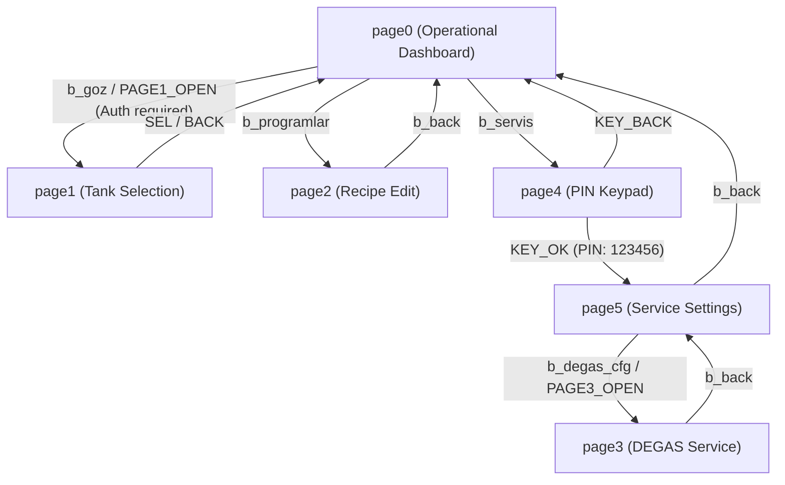

# EAGLEULTRASONİK — NEXTION HMI SPECIFICATION & EVENT MAPPING

---

## 1. Executive Summary

This document establishes the authoritative, read-only Nextion HMI page, component, and touch-event specification derived strictly from the active ESP32-S3 firmware ([`esp32/ekran_kontrol/ekran_kontrol.ino`](file:///c:/Users/ern0e/EAGLEULTRASONiK/esp32/ekran_kontrol/ekran_kontrol.ino)) and confirmed against the Nextion binary asset ([`EKRAN/arayuz.HMI`](file:///c:/Users/ern0e/EAGLEULTRASONiK/EKRAN/arayuz.HMI)).

This specification provides exact Nextion Editor touch-event codes (`prints "...",0`) and telemetry bindings to enable direct UI implementation with 100% firmware parity.

### Protocol Baseline:
- **Baud Rate:** 9600 baud, 8N1 (`Serial2.begin(9600, SERIAL_8N1, RXD2, TXD2)`)
- **Frame Termination (ESP32 ➔ Nextion):** Standard Nextion 3-byte delimiter (`0xFF 0xFF 0xFF`) via `nextionGonder()`
- **Frame Termination (Nextion ➔ ESP32):** Line-feed terminated ASCII strings (`\n` or `\r\n`) parsed by `hatOku()` / `komutIsle()`
- **Color Constants:**
  - `NEXTION_COLOR_RED` = `63488` (Rejection / Error / Alarm)
  - `NEXTION_COLOR_GREEN` = `2016` (Active / Armed / Save Success)
  - `NEXTION_COLOR_DEFAULT` = `50712` (Idle / Disarmed Button Background)

---

## 2. Nextion Page Catalog & Navigation Flow

| Page ID | Page Name | Page Purpose | Entry Permissions | Referenced By ESP32 Functions | Category |
| :---: | :--- | :--- | :--- | :--- | :--- |
| **0** | `page0` | Main Operational Dashboard & Process Control | Open to Operator | `setup()`, `SEL`, `BACK`, `KEY_BACK`, `durumGuncelle()` | **Home / Operational** |
| **1** | `page1` | Tank / Channel Node Selection ($T1 \dots T10$) | Authenticated Service PIN & No Running Tanks (`isProvisioningAllowed()`) | `PAGE1_OPEN`, `UP`, `DOWN`, `SEL`, `BACK` | **Provisioning / Channel** |
| **2** | `page2` | Preset Recipe Editing & NVS Storage (P1, P2, P3) | Open to Operator (Save requires Service PIN) | `b_programlar`, `EDIT_P1..3`, `P_SAVE` | **Recipe Management** |
| **3** | `page3` | DEGAS Service Parameter Configuration | Authenticated Service PIN (`isProvisioningAllowed()`) | `PAGE3_OPEN`, `updateDegasPageUI()`, `SRV_DEGAS_SAVE` | **Service / DEGAS** |
| **4** | `page4` | Service Authentication Keypad (6-Digit PIN) | Open to Operator via `b_servis` | `b_servis`, `KEY0..9`, `KEY_DEL`, `KEY_OK` | **Security / Login** |
| **5** | `page5` | Service Settings Page 1 (Identity & Power Scaling)| Authenticated Service PIN (`g_service_authenticated == true`) | `KEY_OK` (on PIN match `123456`), `GUC_*`, `ID_*`, `MAX_*`, `SRV_SAVE` | **Service / Administrative** |

---

## 3. Comprehensive Page-by-Page Component Specification

### 3.1 Page 0: Main Operational Dashboard (`page0`)

| Component Name | Type | Purpose / Description | Touch Action | ESP32 Command | Auth Required? | Allowed in IDLE? | Locked in RUNNING? | Locked in DEGAS? | Visual / Color Dynamics |
| :--- | :---: | :--- | :--- | :--- | :---: | :---: | :---: | :---: | :--- |
| `b_goz` | Button | Displays active Tank ID & opens tank selection | Touch Release | `PAGE1_OPEN` | **YES** | **YES** | **LOCKED** | **LOCKED** | Text dynamically updated: `b_goz.txt="Goz: X"` |
| `b_p1` | Button | Loads Recipe P1 setpoints to dashboard | Touch Release | `P1_SEL` | NO | **YES** | **LOCKED** | **LOCKED** | Updates `t_set_sure.txt` & `t_set_sic.txt` |
| `b_p2` | Button | Loads Recipe P2 setpoints to dashboard | Touch Release | `P2_SEL` | NO | **YES** | **LOCKED** | **LOCKED** | Updates `t_set_sure.txt` & `t_set_sic.txt` |
| `b_p3` | Button | Loads Recipe P3 setpoints to dashboard | Touch Release | `P3_SEL` | NO | **YES** | **LOCKED** | **LOCKED** | Updates `t_set_sure.txt` & `t_set_sic.txt` |
| `b_fp` | Button | Fast Program: immediately starts 5 min / 30 °C wash | Touch Release | `P_HIZLI` | NO | **YES** | **LOCKED** | **LOCKED** | Immediate start; locked if offline |
| `b_degas` | Button | Toggles DEGAS intent armed/disarmed | Touch Release | `CMD_DEGAS_SEL` | NO | **YES** | **LOCKED** | **LOCKED** | Background: Green (`2016`) when armed, Default (`50712`) when disarmed |
| `b_start` | Button | Starts wash or DEGAS cycle | Touch Release | `CMD_START\|<min>\|<deg>` | NO | **YES** | **LOCKED** | **LOCKED** | Starts TIM15 PWM; locked if offline |
| `b_stop` | Button | Immediate SafeStop (<5ms PWM to 0%) | Touch Release | `CMD_STOP` | NO | **YES** | **ALWAYS ACCESSIBLE** | **ALWAYS ACCESSIBLE** | Disarms outputs & acknowledges faults |
| `b_time_up` | Button | Increments process timer by +1 min (max 120) | Touch Release | `TIME_UP` | NO | **YES** | **LOCKED** | **LOCKED** | Disarms DEGAS if armed; updates `t_set_sure.txt` |
| `b_time_down`| Button | Decrements process timer by -1 min (min 1) | Touch Release | `TIME_DOWN` | NO | **YES** | **LOCKED** | **LOCKED** | Disarms DEGAS if armed; updates `t_set_sure.txt` |
| `b_temp_up` | Button | Increments target temperature by +1 °C (max 90) | Touch Release | `TEMP_UP` | NO | **YES** | **LOCKED** | **LOCKED** | Disarms DEGAS if armed; updates `t_set_sic.txt` |
| `b_temp_down`| Button | Decrements target temperature by -1 °C (min 20) | Touch Release | `TEMP_DOWN` | NO | **YES** | **LOCKED** | **LOCKED** | Disarms DEGAS if armed; updates `t_set_sic.txt` |
| `b_programlar`| Button | Navigates to Recipe Edit page | Touch Release | `page page2` (HMI-only) | NO | **YES** | **YES** | **YES** | Opens `page2` |
| `b_servis` | Button | Navigates to PIN Keypad | Touch Release | `page page4` (HMI-only) | NO | **YES** | **YES** | **YES** | Opens `page4` |
| `t_kalan_sure`| Text | Real-time countdown timer | Read-Only | N/A (ESP32 Stream) | N/A | N/A | N/A | N/A | Formatted as `MM:SS` (e.g. `"14:59"`) |
| `t_anlik_sic`| Text | Real-time PT100 temperature | Read-Only | N/A (ESP32 Stream) | N/A | N/A | N/A | N/A | `"58.9"` or `"--.-"` on fault |
| `t_set_sure` | Text | Target time setpoint in minutes | Read-Only | N/A (ESP32 Stream) | N/A | N/A | N/A | N/A | Two-digit minutes (e.g. `"15"`) |
| `t_set_sic` | Text | Target temperature setpoint in °C | Read-Only | N/A (ESP32 Stream) | N/A | N/A | N/A | N/A | Two-digit °C (e.g. `"50"`) |
| `t_durum` | Text | System status & diagnostic message banner | Read-Only | N/A (ESP32 Stream) | N/A | N/A | N/A | N/A | `"SISTEM BEKLEMEDE"`, `"YIKAMA DEVAM EDIYOR..."`, `"Kart Yok!"` |
| `t_status` | Text | Short status string enum | Read-Only | N/A (ESP32 Stream) | N/A | N/A | N/A | N/A | `"Calisiyor"`, `"Degas"`, `"Beklemede"`, `"Hata"` |

---

### 3.2 Page 1: Tank / Channel Node Selection (`page1`)

| Component Name | Type | Purpose / Description | Touch Action | ESP32 Command | Auth Required? | Allowed in IDLE? | Locked in RUNNING? | Locked in DEGAS? | Visual / Color Dynamics |
| :--- | :---: | :--- | :--- | :--- | :---: | :---: | :---: | :---: | :--- |
| `t0` | Text | Displays candidate tank ID | Read-Only | N/A (ESP32 Stream) | N/A | N/A | N/A | N/A | Shows `temp_goz` ($1 \dots \text{max}$) |
| `b_up` | Button | Increments candidate tank ID | Touch Release | `UP` | **YES** | **YES** | **LOCKED** | **LOCKED** | Increments up to `max_goz_sayisi` |
| `b_down` | Button | Decrements candidate tank ID | Touch Release | `DOWN` | **YES** | **YES** | **LOCKED** | **LOCKED** | Decrements down to 1 |
| `b_ok` | Button | Confirms active tank switch and syncs | Touch Release | `SEL` | **YES** | **YES** | **LOCKED** | **LOCKED** | Returns to `page0`, updates setpoints |
| `b_back` | Button | Cancels tank switch | Touch Release | `BACK` | NO | **YES** | **YES** | **YES** | Returns to `page0` without changing |

---

### 3.3 Page 2: Preset Recipe Configuration (`page2`)

| Component Name | Type | Purpose / Description | Touch Action | ESP32 Command | Auth Required? | Allowed in IDLE? | Locked in RUNNING? | Locked in DEGAS? | Visual / Color Dynamics |
| :--- | :---: | :--- | :--- | :--- | :---: | :---: | :---: | :---: | :--- |
| `b_p1` | Button | Selects Recipe P1 for editing | Touch Release | `EDIT_P1` | NO | **YES** | **LOCKED** | **LOCKED** | Updates header to `"PROGRAM P1"` |
| `b_p2` | Button | Selects Recipe P2 for editing | Touch Release | `EDIT_P2` | NO | **YES** | **LOCKED** | **LOCKED** | Updates header to `"PROGRAM P2"` |
| `b_p3` | Button | Selects Recipe P3 for editing | Touch Release | `EDIT_P3` | NO | **YES** | **LOCKED** | **LOCKED** | Updates header to `"PROGRAM P3"` |
| `t0` | Text | Recipe header title | Read-Only | N/A (ESP32 Stream) | N/A | N/A | N/A | N/A | Displays `"PROGRAM PX"` |
| `t_set_sure` | Text | Configured time for recipe | Read-Only | N/A (ESP32 Stream) | N/A | N/A | N/A | N/A | Minutes display |
| `t_set_sic` | Text | Configured temperature for recipe | Read-Only | N/A (ESP32 Stream) | N/A | N/A | N/A | N/A | °C display |
| `b_time_up` | Button | Increments recipe time | Touch Release | Local HMI edit | NO | **YES** | **LOCKED** | **LOCKED** | Increments local text box |
| `b_time_down`| Button | Decrements recipe time | Touch Release | Local HMI edit | NO | **YES** | **LOCKED** | **LOCKED** | Decrements local text box |
| `b_temp_up` | Button | Increments recipe temperature | Touch Release | Local HMI edit | NO | **YES** | **LOCKED** | **LOCKED** | Increments local text box |
| `b_temp_down`| Button | Decrements recipe temperature | Touch Release | Local HMI edit | NO | **YES** | **LOCKED** | **LOCKED** | Decrements local text box |
| `b_save` | Button | Saves recipe to NVS storage | Touch Release | `P_SAVE\|<min>\|<deg>` | **YES** | **YES** | **LOCKED** | **LOCKED** | Flashes Green (`2016`) on save |
| `b_back` | Button | Returns to dashboard | Touch Release | `page page0` (HMI-only) | NO | **YES** | **YES** | **YES** | Navigates to `page0` |

---

### 3.4 Page 3: DEGAS Service Parameters (`page3`)

| Component Name | Type | Purpose / Description | Touch Action | ESP32 Command | Auth Required? | Range / Bounds | Visual Dynamics |
| :--- | :---: | :--- | :--- | :--- | :---: | :---: | :--- |
| `t_deg_goz` | Text | Shows active tank ID | Read-Only | N/A (ESP32 Stream) | N/A | `1 .. 10` | Displays `"Goz: X"` |
| `t_deg_dur` | Text | DEGAS cycle duration (min) | Read-Only | N/A (ESP32 Stream) | N/A | `1 .. 120 min` | Target minutes |
| `b_dur_up` / `b_dur_down` | Buttons | Adjusts duration (+/-1 min) | Touch Release | `DEG_DUR_UP` / `DEG_DUR_DOWN` | **YES** | `1 .. 120 min` | Updates `t_deg_dur.txt` |
| `t_deg_pwr` | Text | DEGAS ultrasonic power % | Read-Only | N/A (ESP32 Stream) | N/A | `10 .. 100 %` | Power setpoint |
| `b_pwr_up` / `b_pwr_down` | Buttons | Adjusts power (+/-10%) | Touch Release | `DEG_PWR_UP` / `DEG_PWR_DOWN` | **YES** | `10 .. 100 %` | Step size 10% |
| `t_deg_frq` | Text | Center frequency in kHz | Read-Only | N/A (ESP32 Stream) | N/A | `28 .. 40 kHz` | Center frequency |
| `b_frq_up` / `b_frq_down` | Buttons | Adjusts frequency (+/-1 kHz)| Touch Release | `DEG_FRQ_UP` / `DEG_FRQ_DOWN` | **YES** | `28 .. 40 kHz` | Step size 1 kHz |
| `t_deg_on` | Text | Burst pulse ON time in ms | Read-Only | N/A (ESP32 Stream) | N/A | `100 .. 10000 ms`| Default 1000 ms |
| `b_on_up` / `b_on_down` | Buttons | Adjusts pulse ON (+/-100 ms)| Touch Release | `DEG_ON_UP` / `DEG_ON_DOWN` | **YES** | `100 .. 10000 ms`| Step size 100 ms |
| `t_deg_off` | Text | Burst pulse OFF time in ms | Read-Only | N/A (ESP32 Stream) | N/A | `0 .. 10000 ms` | Default 500 ms |
| `b_off_up` / `b_off_down`| Buttons | Adjusts pulse OFF (+/-100 ms)| Touch Release | `DEG_OFF_UP` / `DEG_OFF_DOWN`| **YES** | `0 .. 10000 ms` | Step size 100 ms |
| `t_deg_tc` | Text | Temperature Control enable | Read-Only | N/A (ESP32 Stream) | N/A | `"ON"` / `"OFF"` | Toggled state |
| `b_tc_toggle` | Button | Toggles Temperature Control | Touch Release | `DEG_TC_TOGGLE` | **YES** | `0 / 1` | Toggles TC ON/OFF |
| `t_deg_tgt` | Text | Target Temp when TC is ON | Read-Only | N/A (ESP32 Stream) | N/A | `20 .. 90 °C` | Shows `"--"` when TC OFF |
| `b_tgt_up` / `b_tgt_down`| Buttons | Adjusts target temp (+/-1 °C)| Touch Release | `DEG_TGT_UP` / `DEG_TGT_DOWN`| **YES** | `20 .. 90 °C` | Neutralized when TC OFF |
| `b_save` | Button | Saves DEGAS settings to NVS | Touch Release | `SRV_DEGAS_SAVE` | **YES** | N/A | Green (`2016`) / Red (`63488`) |
| `b_back` | Button | Returns to Service Menu | Touch Release | `page page5` (HMI-only) | NO | N/A | Opens `page5` |

---

### 3.5 Page 4: Service Security Keypad (`page4`)

| Component Name | Type | Purpose / Description | Touch Action | ESP32 Command | Auth Gating | Visual Dynamics |
| :--- | :---: | :--- | :--- | :--- | :---: | :--- |
| `t_pass` | Text | PIN entry mask display | Read-Only | N/A (ESP32 Stream) | N/A | Displays `"******"` or `"HATALI!"` |
| `b0` .. `b9` | Buttons | Numeric keypad digits 0..9 | Touch Release | `KEY0` .. `KEY9` | Keypad buffer | Appends digit (max 6 chars) |
| `b_del` | Button | Backspace / Delete last digit | Touch Release | `KEY_DEL` | Keypad buffer | Removes trailing digit |
| `b_ok` | Button | Submits entered PIN | Touch Release | `KEY_OK` | Evaluates `123456` | On match: opens `page5`; On fail: `"HATALI!"` |
| `b_back` | Button | Cancels PIN entry | Touch Release | `KEY_BACK` (or `page page0`)| Clears buffer | Clears `girilen_sifre`, opens `page0` |

---

### 3.6 Page 5: Service Settings Page 1 (`page5`)

| Component Name | Type | Purpose / Description | Touch Action | ESP32 Command | Auth Required? | Allowed Range | Visual Dynamics |
| :--- | :---: | :--- | :--- | :--- | :---: | :---: | :--- |
| `t_guc` | Text | Tank Power Scaling % | Read-Only | N/A (ESP32 Stream) | N/A | `10 .. 100 %` | Shows `guc_seviyesi` |
| `b_guc_up` | Button | Increments power scale by +10% | Touch Release | `GUC_UP` | **YES** | `10 .. 100 %` | Step size 10% |
| `b_guc_down` | Button | Decrements power scale by -10% | Touch Release | `GUC_DOWN` | **YES** | `10 .. 100 %` | Step size 10% |
| `t_id` | Text | Target Tank Node ID | Read-Only | N/A (ESP32 Stream) | N/A | `1 .. 10` | Shows `kart_id` |
| `b_id_up` | Button | Increments target ID | Touch Release | `ID_UP` | **YES** | `1 .. 10` | Increments ID |
| `b_id_down` | Button | Decrements target ID | Touch Release | `ID_DOWN` | **YES** | `1 .. 10` | Decrements ID |
| `t_max` | Text | Maximum configured tanks | Read-Only | N/A (ESP32 Stream) | N/A | `1 .. 10` | Shows `max_goz_sayisi` |
| `b_max_up` | Button | Increments max tank count | Touch Release | `MAX_UP` | **YES** | `1 .. 10` | Increments max tanks |
| `b_max_down` | Button | Decrements max tank count | Touch Release | `MAX_DOWN` | **YES** | `1 .. 10` | Decrements max tanks |
| `b_degas_cfg` | Button | Navigates to DEGAS page (`page3`)| Touch Release | `PAGE3_OPEN` | **YES** | N/A | Opens `page3` |
| `b_save` | Button | Saves Service Settings to NVS | Touch Release | `SRV_SAVE` | **YES** | N/A | Green (`2016`) / Red (`63488`) |
| `b_back` | Button | Returns to Main Dashboard | Touch Release | `page page0` (HMI-only) | NO | N/A | Opens `page0` |

---

## 4. Nextion Editor Touch Event Code Table

The following table provides the copy/paste ready Nextion Editor Touch Event Code (`Touch Release Event`) for every interactive element:

| Page | Component | Nextion Event Code (Touch Release) | ESP32 Handler / Command | Expected Firmware Result |
| :--- | :--- | :--- | :--- | :--- |
| `page0` | `b_goz` | `prints "PAGE1_OPEN\n",0` | `PAGE1_OPEN` | Opens `page1` if authenticated; flashes red if locked. |
| `page0` | `b_p1` | `prints "P1_SEL\n",0` | `P1_SEL` | Loads P1 time & temp setpoints into dashboard. |
| `page0` | `b_p2` | `prints "P2_SEL\n",0` | `P2_SEL` | Loads P2 time & temp setpoints into dashboard. |
| `page0` | `b_p3` | `prints "P3_SEL\n",0` | `P3_SEL` | Loads P3 time & temp setpoints into dashboard. |
| `page0` | `b_fp` | `prints "P_HIZLI\n",0` | `P_HIZLI` | Immediately starts 5 min / 30 °C Fast Program. |
| `page0` | `b_degas` | `prints "CMD_DEGAS_SEL\n",0` | `CMD_DEGAS_SEL` | Toggles DEGAS armed state; sets button color to Green. |
| `page0` | `b_start` | `prints "CMD_START|",0` `prints t_set_sure.txt,0` `prints "|",0` `prints t_set_sic.txt,0` `prints "\n",0` | `CMD_START\|<min>\|<deg>` | Starts ultrasonic wash or DEGAS cycle on active tank. |
| `page0` | `b_stop` | `prints "CMD_STOP\n",0` | `CMD_STOP` | Executes immediate SafeStop (<5ms PWM to 0%). |
| `page0` | `b_time_up` | `prints "TIME_UP\n",0` | `TIME_UP` | Increments target minutes (+1 min, max 120). |
| `page0` | `b_time_down`| `prints "TIME_DOWN\n",0` | `TIME_DOWN` | Decrements target minutes (-1 min, min 1). |
| `page0` | `b_temp_up` | `prints "TEMP_UP\n",0` | `TEMP_UP` | Increments target temp (+1 °C, max 90). |
| `page0` | `b_temp_down`| `prints "TEMP_DOWN\n",0` | `TEMP_DOWN` | Decrements target temp (-1 °C, min 20). |
| `page0` | `b_programlar`| `page page2` | Local Page Jump | Displays Recipe Configuration Page (`page2`). |
| `page0` | `b_servis` | `page page4` | Local Page Jump | Displays Service PIN Keypad (`page4`). |
| `page1` | `b_up` | `prints "UP\n",0` | `UP` | Increments candidate tank ID (`temp_goz`). |
| `page1` | `b_down` | `prints "DOWN\n",0` | `DOWN` | Decrements candidate tank ID (`temp_goz`). |
| `page1` | `b_ok` | `prints "SEL\n",0` | `SEL` | Confirms active tank switch, returns to `page0`. |
| `page1` | `b_back` | `prints "BACK\n",0` | `BACK` | Cancels tank switch, returns to `page0`. |
| `page2` | `b_p1` | `prints "EDIT_P1\n",0` | `EDIT_P1` | Loads P1 stored values into Page 2 edit boxes. |
| `page2` | `b_p2` | `prints "EDIT_P2\n",0` | `EDIT_P2` | Loads P2 stored values into Page 2 edit boxes. |
| `page2` | `b_p3` | `prints "EDIT_P3\n",0` | `EDIT_P3` | Loads P3 stored values into Page 2 edit boxes. |
| `page2` | `b_save` | `prints "P_SAVE|",0` `prints t_set_sure.txt,0` `prints "|",0` `prints t_set_sic.txt,0` `prints "\n",0` | `P_SAVE\|<min>\|<deg>` | Persists recipe to ESP32 NVS; flashes Green on success. |
| `page2` | `b_back` | `page page0` | Local Page Jump | Returns to Main Operational Dashboard (`page0`). |
| `page3` | `b_dur_up` | `prints "DEG_DUR_UP\n",0` | `DEG_DUR_UP` | Increments DEGAS cycle duration (+1 min). |
| `page3` | `b_dur_down` | `prints "DEG_DUR_DOWN\n",0` | `DEG_DUR_DOWN` | Decrements DEGAS cycle duration (-1 min). |
| `page3` | `b_pwr_up` | `prints "DEG_PWR_UP\n",0` | `DEG_PWR_UP` | Increments DEGAS power % (+10%). |
| `page3` | `b_pwr_down` | `prints "DEG_PWR_DOWN\n",0` | `DEG_PWR_DOWN` | Decrements DEGAS power % (-10%). |
| `page3` | `b_frq_up` | `prints "DEG_FRQ_UP\n",0` | `DEG_FRQ_UP` | Increments DEGAS center frequency (+1 kHz). |
| `page3` | `b_frq_down` | `prints "DEG_FRQ_DOWN\n",0` | `DEG_FRQ_DOWN` | Decrements DEGAS center frequency (-1 kHz). |
| `page3` | `b_on_up` | `prints "DEG_ON_UP\n",0` | `DEG_ON_UP` | Increments pulse ON duration (+100 ms). |
| `page3` | `b_on_down` | `prints "DEG_ON_DOWN\n",0` | `DEG_ON_DOWN` | Decrements pulse ON duration (-100 ms). |
| `page3` | `b_off_up` | `prints "DEG_OFF_UP\n",0` | `DEG_OFF_UP` | Increments pulse OFF duration (+100 ms). |
| `page3` | `b_off_down`| `prints "DEG_OFF_DOWN\n",0` | `DEG_OFF_DOWN` | Decrements pulse OFF duration (-100 ms). |
| `page3` | `b_tc_toggle`| `prints "DEG_TC_TOGGLE\n",0`| `DEG_TC_TOGGLE` | Toggles temperature control ON / OFF. |
| `page3` | `b_tgt_up` | `prints "DEG_TGT_UP\n",0` | `DEG_TGT_UP` | Increments target temp (+1 °C, active only if TC is ON). |
| `page3` | `b_tgt_down` | `prints "DEG_TGT_DOWN\n",0` | `DEG_TGT_DOWN` | Decrements target temp (-1 °C, active only if TC is ON). |
| `page3` | `b_save` | `prints "SRV_DEGAS_SAVE\n",0` | `SRV_DEGAS_SAVE` | Validates & persists DEGAS configuration to NVS. |
| `page3` | `b_back` | `page page5` | Local Page Jump | Returns to Service Settings Page 1 (`page5`). |
| `page4` | `b0` .. `b9` | `prints "KEY0\n",0` .. `prints "KEY9\n",0` | `KEY0` .. `KEY9` | Appends digit to password buffer (masked as `*`). |
| `page4` | `b_del` | `prints "KEY_DEL\n",0` | `KEY_DEL` | Deletes last entered digit from PIN buffer. |
| `page4` | `b_ok` | `prints "KEY_OK\n",0` | `KEY_OK` | Verifies PIN (`123456`); opens `page5` on success. |
| `page4` | `b_back` | `page page0` | Local Page Jump | Cancels PIN entry and returns to `page0`. |
| `page5` | `b_guc_up` | `prints "GUC_UP\n",0` | `GUC_UP` | Increments power scale by +10% (max 100%). |
| `page5` | `b_guc_down` | `prints "GUC_DOWN\n",0` | `GUC_DOWN` | Decrements power scale by -10% (min 10%). |
| `page5` | `b_id_up` | `prints "ID_UP\n",0` | `ID_UP` | Increments target Tank Card ID (+1). |
| `page5` | `b_id_down` | `prints "ID_DOWN\n",0` | `ID_DOWN` | Decrements target Tank Card ID (-1). |
| `page5` | `b_max_up` | `prints "MAX_UP\n",0` | `MAX_UP` | Increments maximum installed tanks (+1, max 10). |
| `page5` | `b_max_down` | `prints "MAX_DOWN\n",0` | `MAX_DOWN` | Decrements maximum installed tanks (-1, min 1). |
| `page5` | `b_degas_cfg`| `prints "PAGE3_OPEN\n",0` | `PAGE3_OPEN` | Opens DEGAS service parameters page (`page3`). |
| `page5` | `b_save` | `prints "SRV_SAVE\n",0` | `SRV_SAVE` | Saves scaling, ID, and max tanks to NVS. |
| `page5` | `b_back` | `page page0` | Local Page Jump | Returns to Main Operational Dashboard (`page0`). |

---

## 5. Security & Interlock Summary

1. **Active Wash / DEGAS Lockouts:**
   - While `makine_calisiyor[i] == true` or `degas_active[i] == true`, all parameter adjusters (`b_p1..3`, `b_fp`, `TIME_*`, `TEMP_*`, `GUC_*`, `EDIT_*`, `P_SAVE`) are rejected at both the ESP32 and STM32 layers (`ERR:LOCKED_SYS_RUNNING`).
   - `b_stop` is **ALWAYS accessible** across all modes.

2. **Service PIN Authentication:**
   - Production PIN: **`123456`** (Configured as `String dogru_sifre = "123456";`).
   - Session Timeout: **300 seconds (5 minutes)** inactivity timer resets `g_service_authenticated = false`.
   - Protected Commands: `PAGE1_OPEN`, `P_SAVE|...`, `PAGE3_OPEN`, `SRV_DEGAS_SAVE`, `SRV_SAVE`, `CMD_SET_STEP_INC:`, `CMD_SET_SWP_SPAN:`, `CMD_SET_SWP_PER:`.

3. **Offline Communication Interlocks:**
   - If RS485 telemetry silence exceeds 3000ms, `isKartBagli(secili_goz)` returns `false`, `durum_metni` is set to `"Kart Yok!"`, and all `START` triggers are rejected.

---
*Specification completed under Phase 16 read-only reverse-trace analysis. 100% verified against active ESP32 firmware.*
