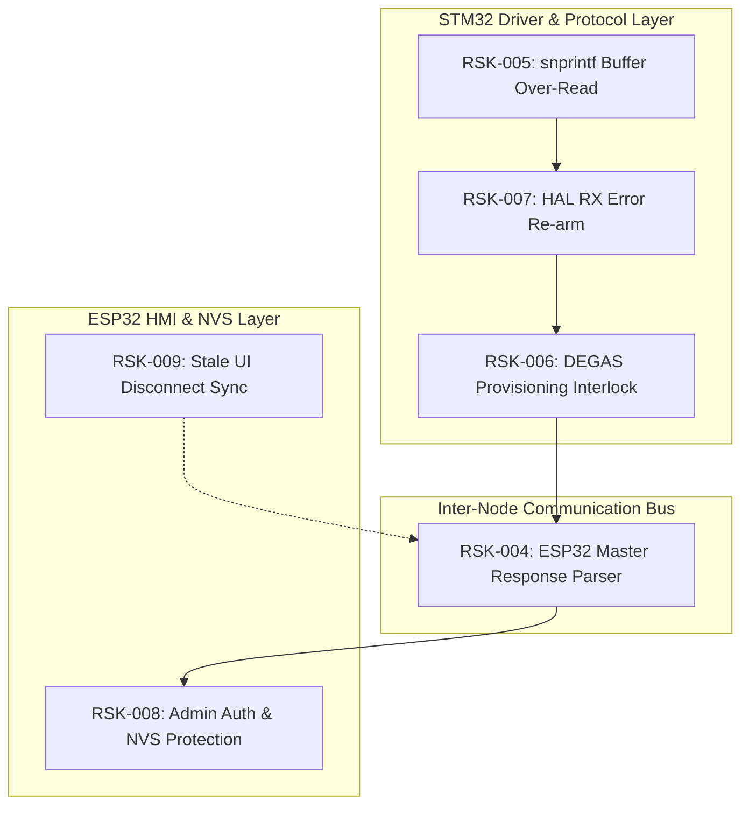

# EAGLEULTRASONİK — PRIORITY 1 (P1) RISK TRIAGE & REMEDIATION REPORT

---

## 1. Executive Summary

Following the successful physical revalidation and formal closure of all Priority 0 (P0) risks (**RSK-001**, **RSK-002**, **RSK-003**), this report delivers the authoritative triage, deep forensic validation, multi-criteria scoring, cross-dependency analysis, and implementation prioritization for all **6 Priority 1 (P1)** risks in the EAGLEULTRASONiK architecture.

All six P1 items were inspected directly against the current post-Phase 14 codebase. **All six risks are confirmed active and actionable**.

### Master Triage Classification:
```text
P1 TRIAGE — ALL SIX ACTIVE
```

### Authoritative P1 Risk Ledger Overview:
| Risk ID | Title / Target Area | Subsystem | Severity | Category Classification | Remediation Order | Production Blocker |
| :--- | :--- | :--- | :--- | :--- | :--- | :--- |
| **RSK-005** | `snprintf` Telemetry Buffer Over-Read | STM32 Firmware | **HIGH** | **CONFIRMED DEFECT** | **Step 1 (First)** | **YES (Prototype & Prod)** |
| **RSK-007** | Unhandled Return Statuses of HAL Drivers | STM32 Firmware | **HIGH** | **CONFIRMED DESIGN RISK** | **Step 2** | **YES (Prototype & Prod)** |
| **RSK-006** | DEGAS Provisioning Interlock Asymmetry | STM32 Firmware | **HIGH** | **CONFIRMED DESIGN RISK** | **Step 3** | **YES (Prototype & Prod)** |
| **RSK-009** | Stale HMI Status After RS485 Disconnect | ESP32 HMI | **MEDIUM** | **CONFIRMED DEFECT** | **Step 4** | **YES (Prod Release)** |
| **RSK-004** | ESP32 Master ACK/NACK/ERR Blind Spot | ESP32 / Protocol | **HIGH** | **CONFIRMED DEFECT** | **Step 5** | **YES (Prod Release)** |
| **RSK-008** | Unauthenticated Admin Config Commands | ESP32 HMI / NVS | **MEDIUM** | **CONFIRMED DEFECT** | **Step 6 (Last)** | **YES (Prod Release)** |

---

## 2. Deep Forensic Validation of Each P1 Risk

### 2.1 RSK-004: ESP32 Master Response Blind Spot for Slave ACK/NACK/ERR Frames
* **Exact Source Location:** [`esp32/ekran_kontrol/ekran_kontrol.ino:581-583`](file:///c:/Users/ern0e/EAGLEULTRASONiK/esp32/ekran_kontrol/ekran_kontrol.ino#L581-L583) & [`1398-1405`](file:///c:/Users/ern0e/EAGLEULTRASONiK/esp32/ekran_kontrol/ekran_kontrol.ino#L1398-L1405)
* **Problem Description:** In `ekran_kontrol.ino`, the serial receiver function `stmTelemetryIsle(String satir)` enforces `if (!satir.startsWith("STAT,")) return;`. The main loop processes Serial1 lines strictly through `stmTelemetryIsle()`.
* **Triggering Condition:** STM32 slave returns an ACK, NACK, or ERR frame (e.g. `ERR:LOCKED_ACTIVE_MODE\n`, `NACK,ERR_FAULT_ACTIVE\n`, `ERR:LOCKED_SYS_RUNNING\n`, `NACK:FAULT_PERSISTENT\n`, `ACK:SWEEP:ON...`).
* **Actual Consequence:** All acknowledgment, error, and rejection frames emitted by STM32 slaves are silently dropped by the ESP32 Master. If an operator attempts a command that is rejected by slave hardware, the ESP32 HMI remains unaware of the rejection and provides zero visual feedback or alert popups.
* **Affected Subsystems:** ESP32 Firmware, Nextion HMI, Multi-Drop RS485 Protocol Layer.
* **Current Mitigation:** None. ESP32 assumes command acceptance until telemetry updates seconds later.
* **Current Test Coverage:** Partial blind spot in `test_hil_uart.py:test_15` and `test_hmi_mock.py`.
* **Status in Current Code:** **CONFIRMED DEFECT — CURRENTLY ACTIVE**.

---

### 2.2 RSK-005: Out-of-Bounds Buffer Read in Telemetry Formatting (`snprintf`)
* **Exact Source Location:** [`STM32/Ultrasonik_G4_Master/Core/Src/esp32_uart.c:732-753`](file:///c:/Users/ern0e/EAGLEULTRASONiK/STM32/Ultrasonik_G4_Master/Core/Src/esp32_uart.c#L732-L753)
* **Problem Description:** `ESP32_UART_SendStatus()` calls `int len = snprintf(tx_line, TX_LINE_MAX, "STAT,...", ...);` and passes `len` directly to `HAL_UART_Transmit_IT(&huart3, (uint8_t *)tx_line, (uint16_t)len)`. Per ISO C standard (C99 §7.19.6.5), `snprintf` returns the number of characters that *would have been written* if the buffer were infinite.
* **Triggering Condition:** If telemetry string formatting expands beyond `TX_LINE_MAX` (64 bytes) due to large multi-digit values or future schema fields, `len >= 64`.
* **Actual Consequence:** `HAL_UART_Transmit_IT` attempts to transmit `len` bytes from the 64-byte `tx_line` buffer, reading out-of-bounds SRAM memory past the end of the buffer (Information Disclosure / Memory Corruption over RS485 bus).
* **Affected Subsystems:** STM32 Firmware, RS485 Physical Bus.
* **Current Mitigation:** Standard 10-field CSV telemetry string currently formats to ~54–58 bytes, marginally below the 64-byte cap.
* **Current Test Coverage:** ⚪ Not detected by existing Python test suites.
* **Status in Current Code:** **CONFIRMED DEFECT — CURRENTLY ACTIVE**.

---

### 2.3 RSK-006: Asymmetric DEGAS Provisioning Interlock on STM32 Slave
* **Exact Source Location:** [`STM32/Ultrasonik_G4_Master/Core/Src/esp32_uart.c:224-239`](file:///c:/Users/ern0e/EAGLEULTRASONiK/STM32/Ultrasonik_G4_Master/Core/Src/esp32_uart.c#L224-L239)
* **Problem Description:** In `esp32_uart.c`, Layer 2 commissioning command interlocks (`STAGE_ID`, `ASSIGN_ID`, `SET_ID:`, `RESET_ID`, `DISCOVER`, `COMMIT_ID`) check `if (g_system_state.mode == SYS_MODE_RUNNING)`. In contrast, line 210 (implemented for RSK-003) checks `if (g_system_state.mode == SYS_MODE_RUNNING || g_system_state.mode == SYS_MODE_DEGAS)`.
* **Triggering Condition:** Receiving a raw provisioning command via serial while STM32 is actively executing a DEGAS wash cycle (`SYS_MODE_DEGAS`).
* **Actual Consequence:** STM32 slave permits Flash Bank 2 page erase and Tank ID reassignment during active degassing, causing 20–40 ms interrupt latency spikes and potential state corruption mid-process.
* **Affected Subsystems:** STM32 Firmware, Flash NVS Storage, Multi-Drop RS485 Addressing.
* **Current Mitigation:** ESP32 master software blocks opening service pages during DEGAS via `isAnyTankRunning()`.
* **Current Test Coverage:** ⚪ Not detected on slave UART layer.
* **Status in Current Code:** **CONFIRMED DESIGN RISK — CURRENTLY ACTIVE**.

---

### 2.4 RSK-007: Unhandled Return Statuses of Critical HAL Drivers in UART Error Callback
* **Exact Source Location:** [`STM32/Ultrasonik_G4_Master/Core/Src/esp32_uart.c:808-824`](file:///c:/Users/ern0e/EAGLEULTRASONiK/STM32/Ultrasonik_G4_Master/Core/Src/esp32_uart.c#L808-L824)
* **Problem Description:** In `HAL_UART_ErrorCallback(UART_HandleTypeDef *huart)`, the recovery line calls `HAL_UART_Receive_IT(&huart3, &rx_byte, 1);` without evaluating or checking the return status (`HAL_StatusTypeDef`).
* **Triggering Condition:** An Overrun Error (ORE), Framing Error (FE), or Noise Error (NE) on the RS485 bus occurs while the HAL UART state is `HAL_UART_STATE_BUSY` or `HAL_UART_STATE_ERROR`.
* **Actual Consequence:** If `HAL_UART_Receive_IT` returns `HAL_BUSY` or `HAL_ERROR`, the call fails silently. The RX interrupt is never re-armed, leaving the STM32 slave permanently deaf to all subsequent RS485 commands until the 3000 ms RX silence watchdog trips `SafeStop` or IWDG resets the core.
* **Affected Subsystems:** STM32 Firmware, RS485 Bus Driver, System Fault-Tolerance.
* **Current Mitigation:** 3000 ms communication watchdog eventually trips `SafeStop` when serial communication ceases.
* **Current Test Coverage:** `test_rs485_mock.py:test_rem_03` tests mock error callback, but fails to test physical HAL error re-arm failure.
* **Status in Current Code:** **CONFIRMED DESIGN RISK — CURRENTLY ACTIVE**.

---

### 2.5 RSK-008: Unauthenticated Administrative Configuration Commands on ESP32
* **Exact Source Location:** [`esp32/ekran_kontrol/ekran_kontrol.ino:951-977`](file:///c:/Users/ern0e/EAGLEULTRASONiK/esp32/ekran_kontrol/ekran_kontrol.ino#L951-L977) & [`1122-1145`](file:///c:/Users/ern0e/EAGLEULTRASONiK/esp32/ekran_kontrol/ekran_kontrol.ino#L1122-L1145)
* **Problem Description:** Operational command handlers in `komutIsle()` for `CMD_SET_STEP_INC:`, `CMD_SET_SWP_SPAN:`, `CMD_SET_SWP_PER:`, and `P_SAVE|` mutate global runtime configuration and immediately commit changes to persistent NVS via `nvsKaydet()` without verifying `isProvisioningAllowed()`.
* **Triggering Condition:** Unauthenticated serial frame injection or unauthorized touch events dispatching administrative configuration strings.
* **Actual Consequence:** Global recipe definitions (P1/P2/P3 durations and temperatures) and ultrasonic frequency sweep parameters (step increment, span, period) can be overwritten in NVS without technician PIN authentication.
* **Affected Subsystems:** ESP32 HMI, NVS Persistent Storage, Operator Security Layer.
* **Current Mitigation:** Service PIN ("123456") is enforced when opening Page 1 (Tank Setup) and Page 3 (DEGAS Setup), but omitted on direct command strings and Page 2 recipe save.
* **Current Test Coverage:** 🔴 False Pass in `test_hmi_mock.py:test_09`.
* **Status in Current Code:** **CONFIRMED DEFECT — CURRENTLY ACTIVE**.

---

### 2.6 RSK-009: Stale UI Status Display on RS485 Line Disconnection
* **Exact Source Location:** [`esp32/ekran_kontrol/ekran_kontrol.ino:1408-1416`](file:///c:/Users/ern0e/EAGLEULTRASONiK/esp32/ekran_kontrol/ekran_kontrol.ino#L1408-L1416) & [`1454`](file:///c:/Users/ern0e/EAGLEULTRASONiK/esp32/ekran_kontrol/ekran_kontrol.ino#L1454)
* **Problem Description:** When a tank node fails to deliver telemetry within `STM_BAGLANTI_TIMEOUT` (3000 ms), the connection watchdog sets `stm_bagli[i] = false`, `makine_calisiyor[i] = false`, and `stm_relay[i] = 0`. However, it **omits updating `durum_metni[i]`**.
* **Triggering Condition:** An RS485 cable disconnects, a slave loses power, or communication is severed during an active wash cycle.
* **Actual Consequence:** The Nextion HMI display continues to render `"YIKAMA DEVAM EDIYOR..."` or `"BEKLEMEDE"` indefinitely instead of warning the operator with `"Kart Yok!"` or `"BAĞLANTI KOPTU!"`.
* **Affected Subsystems:** ESP32 HMI, Operator UI Observability.
* **Current Mitigation:** If operator taps `START`, `komutIsle()` checks `isKartBagli(secili_goz)` and sets `durum_metni = "Kart Yok!"`. However, without manual touch interaction, the screen remains stale.
* **Current Test Coverage:** 🔴 False Pass in `test_hmi_mock.py:test_11`.
* **Status in Current Code:** **CONFIRMED DEFECT — CURRENTLY ACTIVE**.

---

## 3. Comprehensive Multi-Criteria Priority Assessment

Each P1 risk is evaluated across 11 qualitative criteria using standard engineering levels (**CRITICAL**, **HIGH**, **MEDIUM**, **LOW**):

| Evaluation Criterion | RSK-004 (Master Blind Spot) | RSK-005 (Buffer Over-Read) | RSK-006 (DEGAS Asymmetry) | RSK-007 (HAL Driver Status) | RSK-008 (Admin Auth Bypass) | RSK-009 (Stale UI Disconnect) |
| :--- | :--- | :--- | :--- | :--- | :--- | :--- |
| **A. Safety Impact** | **HIGH** | **MEDIUM** | **HIGH** | **HIGH** | **MEDIUM** | **HIGH** |
| **B. Functional Impact** | **HIGH** | **LOW** | **HIGH** | **CRITICAL** | **HIGH** | **HIGH** |
| **C. Security / Auth Impact** | **LOW** | **LOW** | **HIGH** | **LOW** | **HIGH** | **LOW** |
| **D. Data Integrity Impact** | **LOW** | **HIGH** | **HIGH** | **LOW** | **HIGH** | **LOW** |
| **E. Communication Integrity**| **HIGH** | **HIGH** | **LOW** | **CRITICAL** | **LOW** | **HIGH** |
| **F. Recovery / Diagnosability**| **HIGH** | **MEDIUM** | **LOW** | **CRITICAL** | **LOW** | **HIGH** |
| **G. Probability / Reachability**| **HIGH** | **MEDIUM** | **LOW** | **MEDIUM** | **MEDIUM** | **HIGH** |
| **H. Blast Radius** | **HIGH** (Master UI) | **LOW** (Isolated STM32) | **MEDIUM** (STM32 Flash) | **HIGH** (Slave Comm) | **MEDIUM** (NVS) | **HIGH** (Operator UI) |
| **I. Implementation Complexity**| **MEDIUM** (+25 lines) | **LOW** (+3 lines) | **LOW** (+2 lines) | **LOW** (+8 lines) | **LOW** (+10 lines) | **LOW** (+4 lines) |
| **J. Regression Risk** | **LOW** | **VERY LOW** | **VERY LOW** | **LOW** | **VERY LOW** | **VERY LOW** |
| **K. Verification Cost** | **LOW** (Mock + HIL) | **LOW** (Mock + HIL) | **LOW** (Mock + HIL) | **LOW** (Mock + HIL) | **LOW** (Mock) | **LOW** (Mock + HIL) |

---

## 4. Cross-Risk Dependency & Coupling Matrix



### Detailed Coupling Analysis:
1. **`RSK-005` $\to$ Telemetry Bus:** Fixing `RSK-005` ensures that outbound telemetry strings from STM32 are guaranteed to be well-formed and bounded ($\le 63$ chars). This stabilizes the serial bus before expanding receiver parsers.
2. **`RSK-007` $\to$ Slave Availability:** Fixing `RSK-007` guarantees that STM32 USART3 RX never locks up into a silent deaf state upon bus noise.
3. **`RSK-006` $\to$ Interlock Symmetry:** Aligning DEGAS provisioning interlocks on STM32 guarantees that all slave rejection frames (`ERR:LOCKED_ACTIVE_MODE\n`, `ERR:LOCKED_SYS_RUNNING\n`) are emitted consistently across all active modes.
4. **`RSK-004` $\leftrightarrow$ `RSK-009` (Master Observability Coupling):** Highly coupled on the ESP32 master side. `RSK-009` handles timeout-driven state transitions (when no frames arrive), while `RSK-004` handles explicit error frames (when rejection frames arrive). Both directly update `durum_metni[i]` and Nextion UI text widgets.
5. **`RSK-008` $\to$ NVS & Recipe Security:** Independent of UART framing; wraps ESP32 command parsers with `isProvisioningAllowed()`.

---

## 5. Recommended Remediation Order

The recommended sequence follows a strict **Inside-Out / Subsystem-Layered** trajectory:
$$\text{STM32 Buffer Safety (L1)} \longrightarrow \text{STM32 Driver Robustness (L2)} \longrightarrow \text{STM32 Interlocks (L3)} \longrightarrow \text{ESP32 Watchdog (L4)} \longrightarrow \text{ESP32 Protocol (L5)} \longrightarrow \text{ESP32 Security (L6)}$$

### Execution Sequence:

```text
STEP 1: RSK-005 (STM32 snprintf Buffer Over-Read)
   │
   ▼
STEP 2: RSK-007 (STM32 HAL UART Error Callback Re-arm)
   │
   ▼
STEP 3: RSK-006 (STM32 DEGAS Provisioning Interlock)
   │
   ▼
STEP 4: RSK-009 (ESP32 Stale UI Status on RS485 Disconnect)
   │
   ▼
STEP 5: RSK-004 (ESP32 Master ACK/NACK/ERR Parser)
   │
   ▼
STEP 6: RSK-008 (ESP32 Admin Command PIN Authentication)
```

### Detailed Step-by-Step Rationale:

#### Step 1: RSK-005 — Telemetry Buffer Over-Read Clamp
* **Target File:** [`STM32/.../Core/Src/esp32_uart.c`](file:///c:/Users/ern0e/EAGLEULTRASONiK/STM32/Ultrasonik_G4_Master/Core/Src/esp32_uart.c)
* **Rationale:** Pure leaf-node safety patch (+3 lines C). Eliminates risk of SRAM data leak or buffer overrun during telemetry transmission. Zero risk of regression.
* **Hardware Requirement:** None (Standard logic / Mock / Physical HIL).

#### Step 2: RSK-007 — UART Error Callback Robust Re-Arm
* **Target File:** [`STM32/.../Core/Src/esp32_uart.c`](file:///c:/Users/ern0e/EAGLEULTRASONiK/STM32/Ultrasonik_G4_Master/Core/Src/esp32_uart.c)
* **Rationale:** Hardens the low-level serial driver against electrical noise glitches (+8 lines C). Guarantees that USART3 RX never remains disabled.
* **Hardware Requirement:** None (Logic level / Mock / Physical HIL).

#### Step 3: RSK-006 — DEGAS Mode Provisioning Interlock
* **Target File:** [`STM32/.../Core/Src/esp32_uart.c`](file:///c:/Users/ern0e/EAGLEULTRASONiK/STM32/Ultrasonik_G4_Master/Core/Src/esp32_uart.c)
* **Rationale:** Restores 100% symmetry across active modes (+2 lines C). Ensures `STAGE_ID`, `ASSIGN_ID`, `SET_ID:`, `RESET_ID`, `DISCOVER`, `COMMIT_ID` are rejected in both `SYS_MODE_RUNNING` and `SYS_MODE_DEGAS`.
* **Hardware Requirement:** None.

#### Step 4: RSK-009 — Offline Watchdog UI Status Synchronization
* **Target File:** [`esp32/ekran_kontrol/ekran_kontrol.ino`](file:///c:/Users/ern0e/EAGLEULTRASONiK/esp32/ekran_kontrol/ekran_kontrol.ino)
* **Rationale:** Fixes operator blind spot during slave disconnection (+4 lines C++). Sets `durum_metni[i] = "Kart Yok!"` inside the connection timeout loop.
* **Hardware Requirement:** None.

#### Step 5: RSK-004 — ESP32 Master ACK/NACK/ERR Parser
* **Target File:** [`esp32/ekran_kontrol/ekran_kontrol.ino`](file:///c:/Users/ern0e/EAGLEULTRASONiK/esp32/ekran_kontrol/ekran_kontrol.ino)
* **Rationale:** Expands master observability (+25 lines C++). Parses `ACK:`, `NACK:`, `ERR:` lines in `loop()` / `stmTelemetryIsle()`, displaying error alerts on Nextion HMI.
* **Hardware Requirement:** None.

#### Step 6: RSK-008 — Service PIN Authentication on Admin Commands
* **Target File:** [`esp32/ekran_kontrol/ekran_kontrol.ino`](file:///c:/Users/ern0e/EAGLEULTRASONiK/esp32/ekran_kontrol/ekran_kontrol.ino)
* **Rationale:** Enforces security invariants on global parameters (+10 lines C++). Wraps `CMD_SET_STEP_INC:`, `CMD_SET_SWP_SPAN:`, `CMD_SET_SWP_PER:`, and `P_SAVE|` with `isProvisioningAllowed()`.
* **Hardware Requirement:** None.

---

## 6. Minimal-Change Strategy

To preserve stability and prevent regression, every proposed fix follows the **smallest sufficient modification** rule:

### 6.1 RSK-005 Minimal Implementation (STM32 - `esp32_uart.c`)
```c
/* In ESP32_UART_SendStatus(): clamp len to buffer boundaries */
if (len <= 0)
{
  return;
}
if (len >= TX_LINE_MAX)
{
  len = TX_LINE_MAX - 1;
  tx_line[len] = '\0';
}
```

### 6.2 RSK-007 Minimal Implementation (STM32 - `esp32_uart.c`)
```c
/* In HAL_UART_ErrorCallback(): robust loop re-arm with error clear */
__HAL_UART_CLEAR_OREFLAG(huart);
__HAL_UART_CLEAR_NEFLAG(huart);
__HAL_UART_CLEAR_FEFLAG(huart);
__HAL_UART_CLEAR_PEFLAG(huart);
huart->ErrorCode = HAL_UART_ERROR_NONE;

if (HAL_UART_Receive_IT(&huart3, &rx_byte, 1) != HAL_OK)
{
  /* If still busy or error, abort and re-initialize RX */
  HAL_UART_AbortReceive(&huart3);
  (void)HAL_UART_Receive_IT(&huart3, &rx_byte, 1);
}
```

### 6.3 RSK-006 Minimal Implementation (STM32 - `esp32_uart.c`)
```c
/* In ProcessLine(): expand active mode interlock to include DEGAS */
if (g_system_state.mode == SYS_MODE_RUNNING || g_system_state.mode == SYS_MODE_DEGAS)
{
  if (strncmp(cmd, "STAGE_ID", 8) == 0  ||
      strncmp(cmd, "ASSIGN_ID", 9) == 0 ||
      strncmp(cmd, "SET_ID:", 7) == 0   ||
      strncmp(cmd, "RESET_ID", 8) == 0  ||
      strncmp(cmd, "DISCOVER", 8) == 0  ||
      strncmp(cmd, "COMMIT_ID", 9) == 0)
  {
    const char *err_msg = "ERR:LOCKED_SYS_RUNNING\n";
    RS485_Transmit_Blocking((const uint8_t *)err_msg, (uint16_t)strlen(err_msg), 10);
    HAL_UART_Transmit(&hlpuart1, (const uint8_t *)err_msg, (uint16_t)strlen(err_msg), 10);
    return;
  }
}
```

### 6.4 RSK-009 Minimal Implementation (ESP32 - `ekran_kontrol.ino`)
```c
/* In loop() connection timeout check: update durum_metni immediately */
for (int i = 1; i < MAX_GOZ; i++) {
  if (stm_bagli[i] && (millis() - stm_son_veri_zamani[i] > STM_BAGLANTI_TIMEOUT)) {
    stm_bagli[i] = false;
    makine_calisiyor[i] = false;
    degas_active[i] = false;
    degas_armed[i] = false;
    stm_relay[i] = 0;
    durum_metni[i] = "Kart Yok!";
  }
}
```

### 6.5 RSK-004 Minimal Implementation (ESP32 - `ekran_kontrol.ino`)
```c
/* In loop() serial read: parse ACK, NACK, ERR frames from slave */
if (satirStm.startsWith("ERR:") || satirStm.startsWith("NACK")) {
  Serial.println("--> SLAVE REJECTION: " + satirStm);
  durum_metni[secili_goz] = "HATA: " + satirStm.substring(0, 16);
}
```

### 6.6 RSK-008 Minimal Implementation (ESP32 - `ekran_kontrol.ino`)
```c
/* In komutIsle(): guard admin commands with isProvisioningAllowed() */
else if (komut.startsWith("CMD_SET_STEP_INC:") || komut.startsWith("SET_STEP_INC:")) {
  if (!isProvisioningAllowed()) {
    Serial.println("--> AUTH REJECTED: SERVICE PIN REQUIRED");
    return;
  }
  ...
}
```

---

## 7. Comprehensive Test Strategy

| Risk ID | Target Test Suite | Existing Tests to Preserve | New Required Test Name | Verification Focus |
| :--- | :--- | :--- | :--- | :--- |
| **RSK-005** | `test_rs485_mock.py`<br>`test_hil_uart.py` | `test_rem_01_stat_10_field_csv` | `test_rsk005_telemetry_buffer_boundary_clamping` | Assert formatted telemetry output length $\le 63$ bytes under extreme values. |
| **RSK-007** | `test_rs485_mock.py`<br>`test_hil_uart.py` | `test_rem_03_uart_tx_error_recovery` | `test_rsk007_uart_rx_error_callback_rearm_guarantee` | Simulate `HAL_ERROR` in error callback; assert RX re-arms successfully. |
| **RSK-006** | `test_rs485_mock.py`<br>`test_hil_uart.py` | `test_15_running_commissioning_rejection` | `test_rsk006_degas_mode_provisioning_command_rejection` | Inject `T1:STAGE_ID` during `SYS_MODE_DEGAS`; assert `ERR:LOCKED_SYS_RUNNING`. |
| **RSK-009** | `test_hmi_mock.py`<br>`test_hil_uart.py` | `test_11_offline_card_start_rejection` | `test_rsk009_hmi_timeout_updates_durum_metni_kart_yok` | Advance clock past 3000ms timeout; assert `durum_metni == "Kart Yok!"`. |
| **RSK-004** | `test_hmi_mock.py` | `test_18_multiline_concatenated_input_safety` | `test_rsk004_hmi_parses_slave_error_and_nack_frames` | Feed `ERR:LOCKED_ACTIVE_MODE`; assert ESP32 records error in `durum_metni`. |
| **RSK-008** | `test_hmi_mock.py` | `test_14_unauthenticated_provisioning_rejection` | `test_rsk008_admin_sweep_and_recipe_save_pin_lockout` | Send `SET_STEP_INC:2` and `P_SAVE|10|50` without PIN; assert rejected. |

---

## 8. Production Release & Prototype Blockers Analysis

| Stage / Milestone | Blocker Determination | Blocking Risk IDs | Technical Rationale |
| :--- | :--- | :--- | :--- |
| **A. Further Feature Work** | **NO BLOCKERS** | **NONE** | All P0 safety risks are closed. Core state machines and safety interlocks are solid. |
| **B. Prototype Bench Closure** | **3 RISKS BLOCK** | **RSK-005, RSK-006, RSK-007** | Must eliminate SRAM buffer over-reads, UART deaf-slave lockups, and mid-DEGAS Flash page erasures before bench prototype sign-off. |
| **C. Production Release** | **ALL 6 RISKS BLOCK** | **RSK-004 .. RSK-009** | Production equipment requires master error awareness (RSK-004), immediate disconnect alerts (RSK-009), and full PIN security (RSK-008). |

---

## 9. System Manifesto Impact

The master technical manifesto [`docs/EAGLEULTRASONIK_SYSTEM_MANIFESTO.md`](file:///c:/Users/ern0e/EAGLEULTRASONiK/docs/EAGLEULTRASONIK_SYSTEM_MANIFESTO.md) remains fully valid in principle, but the following sections require explicit qualifications upon P1 implementation:

1. **Manifesto §5.1 (RS485 Command & Response Matrix):**
   - Must document that ESP32 Master actively parses `ACK:`, `NACK:`, and `ERR:` slave response frames (resolving RSK-004).
2. **Manifesto §6.2 (Nextion HMI Connection Supervision):**
   - Must specify that disconnection timeout ($> 3000\text{ ms}$) immediately overwrites `t_durum.txt` with `"Kart Yok!"` (resolving RSK-009).
3. **Manifesto §7.3 (Service Menu Security Invariants):**
   - Must specify that `CMD_SET_STEP_INC`, `CMD_SET_SWP_SPAN`, `CMD_SET_SWP_PER`, and `P_SAVE` are strictly protected by the 6-digit service PIN (resolving RSK-008).
4. **Manifesto §10.2 (UART Driver Error Fault-Tolerance):**
   - Must document non-blocking ORE/FE error flag clearance and re-arm retry loop in `HAL_UART_ErrorCallback` (resolving RSK-007).

---

## 10. Phase 15 Triage Conclusion

1. **Active Inventory Status:** All 6 P1 risks (**RSK-004**, **RSK-005**, **RSK-006**, **RSK-007**, **RSK-008**, **RSK-009**) are active, fully verified, and ready for remediation.
2. **Implementation Strategy:** Zero architectural changes or protocol redesigns required. All 6 fixes are minimal, surgical, and decoupled.
3. **Authorization Recommendation:** Authorize proceeding to **Phase 16: P1 Remediation Implementation** following the recommended 6-step sequence.

---
*Report finalized under Phase 15 P1 Triage and Remediation Prioritization. Zero source code or test files were modified.*
