# EAGLEULTRASONİK — FINAL HARDWARE WIRING AUTHORITY
**Dosya Adı:** `hardware_wiring_FINAL_AUTHORITY.md`  
**Proje:** EAGLEULTRASONİK  
**Aşama:** PHASE 6.1 — PROMPT 3: Final Hardware Wiring Freeze & Physical Connection Authority  
**Tarih:** 2026-08-11  
**Status / Durum:** READY FOR PHYSICAL WIRING (Fiziksel Kablolamaya Geçiş Tam Onaylandı)

> [!IMPORTANT]
> **SINGLE AUTHORITATIVE SOURCE OF TRUTH FOR PHASE 6.1:**  
> Bu doküman, EAGLEULTRASONİK projesinin Phase 6.1 kapsamında **fiziksel masaüstü ve donanım kablolaması için TEK VE NİHAİ YETKİLİ KAYNAKTIR (SINGLE AUTHORITATIVE SOURCE OF TRUTH)**.  
> Daha önceki `hardware_wiring_final_audit.md` ve `hardware_wiring_final_physical_package.md` dokümanları referans olarak saklanmış olup, herhangi bir metinsel veya tablosal çelişki durumunda **BU DOKÜMANDAKİ VERİLER %100 GEÇERLİ KABUL EDİLECEKTİR**.

---

## 1. PC7 AUTHORITATIVE PIN MAPPING

### 1.1 PC7 Fiziksel Bacak ve Konnektör Çiftleme Tanımı
- **MCU Silikon Pini:** STM32G474RE mikrokontrolcüsünün LQFP64 paketindeki **Pin 38 (PC7)** bacağıdır.
- **Nucleo Board Yolu:** NUCLEO-G474RE PCB'si üzerinde bu tek silikon pini hem **CN5 Pin 2 (Arduino D9)** hem de **CN10 Pin 19 (ST Morpho)** konnektör başlıklarına fiziksel yollarla paralel olarak dağıtılmıştır.
- **Yetkili Karar:** **CN5 Pin 2 ile CN10 Pin 19 birbirinden bağımsız iki ayrı GPIO DEĞİLDİR.** İki başlık pini aynı MCU sinyaline bağlıdır.

### 1.2 Zero Cross Sinyal Yolu Tanımı

```
  ESP32-S3 (GPIO4) ───► [ 1kΩ Seri Direnç ] ───► STM32 PC7
                                                     ├── CN5 Pin 2 (Arduino D9)
                                                     └── CN10 Pin 19 (Morpho)
```

> [!CAUTION]
> **YÜKSEK GERİLİM VE GÜVENLİK UYARISI:**  
> **220V AC ŞEBEKE GERİLİMİ BU AŞAMADA KESİNLİKLE BAĞLANMAYACAKTIR.**  
> Masaüstü testinde STM32 PC7 pini sadece ESP32 GPIO4'ten gelen 3.3V DC TTL simülasyon sinyalini alacaktır.

---

## 2. GERÇEK USB POWER ARCHITECTURE & GROUND ISOLATION

### 2.1 Güç Mimarisi ve Güç Hatları İzolasyonu

Geliştirme bilgisayarı (Development PC) üzerinden 3 bağımsız USB bağlantısı mevcuttur:

```
                          DEVELOPMENT PC
                ┌──────────────┼──────────────┐
                │ USB #1       │ USB #2       │ USB #3
                ▼              ▼              ▼
             NUCLEO          ESP32         NEXTION
             (5V/3V3)      (5V VBUS)     (Harici 5V)
```

- **NUCLEO 5V Hattı:** X9C103S entegresinin VCC beslemesi ($V_{CC} = 5\text{V}$) için kullanılır.
- **ESP32 5V / VIN:** Kendi USB kablosu (USB #2) üzerinden beslenir.
- **Nextion VCC:** Kendi USB kablosu / harici 5V adaptörü (USB #3) üzerinden beslenir.

> [!WARNING]
> **FİZİKSEL 5V BİRLEŞTİRME YASAĞI:**  
> **NUCLEO 5V, ESP32 5V ve Nextion 5V hatları FİZİKSEL OLARAK BİRBİRİNE KESİNLİKLE BAĞLANMAYACAKTIR.**  
> **Gerekçe:** Farklı USB portlarının regülatör voltajları ($4.95\text{V} \dots 5.12\text{V}$) arasında küçük seviye farkları vardır. Aktif 5V regülatörlerini paralel bağlamak ters akım (backfeeding) oluşturur; USB transceiver'larını ve PC port koruma devrelerini yakabilir.

### 2.2 Ortak Signal Ground Bus (COMMON GND)

> [!IMPORTANT]
> **NUCLEO GND, ESP32 GND, Nextion GND ve X9C VSS uçları COMMON LOGIC/SIGNAL GND BUS üzerinde birleştirilecektir.**  
> **Neden Zorunlu?**  
> Bilgisayar USB portlarının toprak hatları anakart üzerinde buluşsa bile, kablo dirençleri ve anakart parazitleri modüller arası toprak kaymalarına (Ground Offset / Ground Bounce) sebep olur. Tek uçlu dijital haberleşme sinyallerinin (UART 115200 baud, X9C lojik hatları, Zero Cross 100Hz) mantıksal LOW/HIGH voltaj eşiklerinin bozulmaması için modüllerin GND bacakları breadboard üzerinde kısa ve kalın kablolarla ortaklanmalıdır.

### 2.3 Elektriksel Ayrım: Power Rail vs Signal Ground

- **POWER RAIL (+5V / +3.3V):** Akım sağlayan besleme hatlarıdır. Her modül kendi bağımsız 5V kaynağında kalmalıdır. Birbirine BAĞLANMAZ.
- **SIGNAL GROUND (GND):** Bütün dijital sinyal voltajlarının ($V_{\text{dijital}} - 0\text{V}$) ölçüldüğü ortak referans düzlemidir. Kesintisiz haberleşme için BÜTÜN GND'LER BİRLEŞTİRİLİR.

---

## 3. X9C103S FINAL AUTHORITATIVE CONNECTION & AUDIT

### 3.1 Nitelikli Pin Bağlantı Şeması
- **Pin 1 ($\bar{\text{INC}}$)** $\to$ **STM32 PB14**
- **Pin 2 ($U/\bar{D}$)** $\to$ **STM32 PB13**
- **Pin 3 ($V_H$)** $\to$ **NUCLEO 3.3V Hattı** (**KESİNLİKLE 5V DEĞİL!**)
- **Pin 4 ($V_{SS}$)** $\to$ **COMMON GND BUS**
- **Pin 5 ($V_W$)** $\to$ **1k$\Omega$ Seri Direnç** $\to$ **STM32 PA0**
- **Pin 6 ($V_L$)** $\to$ **COMMON GND BUS**
- **Pin 7 ($\bar{\text{CS}}$)** $\to$ **STM32 PB12**
- **Pin 8 ($V_{CC}$)** $\to$ **NUCLEO 5V Hattı**

### 3.2 Datasheet ve Elektriksel Güvenlik Analizi
1. **$V_{CC}=5\text{V}, V_H=3.3\text{V}, V_L=0\text{V}$ Uyumluluğu:**  
   Renesas X9C103S Datasheet (FN8158) $V_{SS} \le V_H, V_L \le V_{CC}$ kuralını tanımlar.  
   Burada $0\text{V} \le 3.3\text{V} \le 5.0\text{V}$ olduğundan bu gerilim kombinasyonu **datasheet sınırları içindedir ve %100 UYGUNDUR**.
2. **PA0 Voltaj Güvenliği:**  
   PA0 pini STM32G474RE'nin $0 \dots 3.3\text{V}$ ölçüm aralığına sahip ADC girişidir. Potansiyometrenin $V_H$ terminali 3.3V'a bağlandığı için silecek voltajı $V_W$ en fazla $3.3\text{V}$ olabilir. Bu durum PA0 ADC pini için **tam aşırı voltaj koruması sağlar**.
3. **1k$\Omega$ $V_W$ Seri Direncinin Amacı:**  
   - Potansiyometre silecek akımını datasheet continuous limiti olan $I_W \le 3.3\text{mA}$ seviyesine sınırlar.
   - PA0 pini yazılımsal hata ile çıkış yapıldığında veya transient sıçramalarda PA0 ADC katını korur.

---

## 4. MASTER SERİ DİRENÇ ANALİZİ VE ELEKTRİKSEL AYRIM

### 4.1 Yeniden Hesaplanmış Master Direnç Listesi

| Hat Kodu | Sinyal Hattı | Fiziksel Direnç | Durumu & Amacı | Üretim (Production) Wiring'de Kalacak mı? | Fiziksel Konumu |
| :-: | :--- | :-: | :--- | :-: | :--- |
| **A** | ESP32 GPIO4 $\to$ STM32 PC7 | **1k$\Omega$** | **Recommended / Mandatory**: Zero Cross palsında çift çıkış çakışma akımı sınırlama ($3.3\text{mA}$) | **EVET** (Simülasyon Modunda) | ESP32 GPIO4 bacağı ile PC7 (CN5-2) arasına seri |
| **B** | X9C VW $\to$ STM32 PA0 | **1k$\Omega$** | **Recommended / Mandatory**: PA0 ADC pini ve silecek akımı koruması | **EVET** | X9C Pin 5 bacağı ile STM32 PA0 arasına seri |
| **C** | STM32 PB15 $\to$ PA4 | **1k$\Omega$** | **Bench Only**: Heater Röle loopback öz-test hattı akım koruması | **HAYIR (SÖKÜLECEK)** | STM32 PB15 ile PA4 bacakları arasına seri |
| **D** | STM32 PC6 $\to$ PA6 | **1k$\Omega$** | **Bench Only**: Triac Gate loopback öz-test hattı akım koruması | **HAYIR (SÖKÜLECEK)** | STM32 PC6 ile PA6 bacakları arasına seri |
| **E** | STM32 PB12 $\to$ PB4 | **1k$\Omega$** | **Bench Only**: X9C CS loopback öz-test hattı akım koruması | **HAYIR (SÖKÜLECEK)** | STM32 PB12 ile PB4 bacakları arasına seri |
| **F** | STM32 PB13 $\to$ PB5 | **1k$\Omega$** | **Bench Only**: X9C U/D loopback öz-test hattı akım koruması | **HAYIR (SÖKÜLECEK)** | STM32 PB13 ile PB5 bacakları arasına seri |
| **G** | STM32 PB14 $\to$ PB6 | **1k$\Omega$** | **Bench Only**: X9C INC loopback öz-test hattı akım koruması | **HAYIR (SÖKÜLECEK)** | STM32 PB14 ile PB6 bacakları arasına seri |
| **H** | ESP32 GPIO8 $\to$ STM32 PB11 | **1k$\Omega$** | **UART Protection**: ESP32 boot glitch & PB11 ters sürüş koruması | **EVET** (Koruma Direnci) | ESP32 GPIO8 bacağı ile STM32 PB11 arasına seri |
| **I** | STM32 PB10 $\to$ ESP32 GPIO18 | **1k$\Omega$** | **UART Protection**: STM32 TX & GPIO18 ters sürüş koruması | **EVET** (Koruma Direnci) | STM32 PB10 bacağı ile ESP32 GPIO18 arasına seri |

> **Toplam Direnç Hesabı:**  
> - Masaüstü Bench Test Modunda Toplam: **9 Adet 1k$\Omega$ Direnç**  
> - Saha / Final Production Modunda Kalacak Toplam: **4 Adet 1k$\Omega$ Direnç** (Hat A, B, H, I)

### 4.2 Internal GPIO Pull-Up/Down vs Physical Series Resistor Ayrımı

> [!IMPORTANT]
> **ELEKTRİKSEL AYRIM VE GERÇEK:**  
> - **Internal Pull-Up/Pull-Down:** MCU içindeki $30\text{k}\Omega \dots 50\text{k}\Omega$'luk yüksek empedanslı **PARALEL** bias dirençleridir. Sadece pin yüksek empedanstayken (Input/Floating) gürültüden etkilenmemesini sağlar. Sinyal iletkenine SERİ bağlı olmadıkları için iki pin çakıştığında oluşan yüksek kısa devre akımını ($I > 40\text{mA}$) **KESİNLİKLE ENGELLEYEMEZ**.  
> - **Physical 1kΩ Series Resistor:** İki aktif bacak arasına **SERİ** bağlanan fiziksel elemandır. Çakışma anında Ohm Kanunu ($I = \frac{3.3\text{V}}{1000\Omega} = 3.3\text{mA}$) uyarınca akımı güvenli $3.3\text{mA}$ seviyesine sınırlar. **Internal pull-up/down ayarları fiziksel seri direncin yerini tutamaz.**

---

## 5. BENCH VS PRODUCTION WIRING SEPARATION

### TABLE A: BENCH TEST WIRING (Masaüstü Test Modu)

| Hat ID | Kaynak Pin | Seri Direnç | Hedef Pin | Sinyal Amacı | Kablolama Tipi |
| :-: | :--- | :-: | :--- | :--- | :--- |
| **LOOP-1** | STM32 PB15 | **1k$\Omega$** | STM32 PA4 | Heater Relay actuation loopback testi | **BENCH TEST ONLY** |
| **LOOP-2** | STM32 PC6  | **1k$\Omega$** | STM32 PA6 | Triac Gate firing pulse loopback testi | **BENCH TEST ONLY** |
| **LOOP-3** | STM32 PB12 | **1k$\Omega$** | STM32 PB4 | X9C CS öz-test doğrulama hattı | **BENCH TEST ONLY** |
| **LOOP-4** | STM32 PB13 | **1k$\Omega$** | STM32 PB5 | X9C U/D öz-test doğrulama hattı | **BENCH TEST ONLY** |
| **LOOP-5** | STM32 PB14 | **1k$\Omega$** | STM32 PB6 | X9C INC öz-test doğrulama hattı | **BENCH TEST ONLY** |

*Gerekçe:* Bu 5 hat, yazılımın otomatik self-test algoritmalarını çalıştırmak için bench üzerinde jenerik kablolarla bağlanır.

---

### TABLE B: FINAL / PRODUCTION-LIKE WIRING (Saha / Final Üretim Modu)

| Hat ID | Kaynak Pin | Seri Direnç | Hedef Fiziksel Eleman / Devre | Üretim Hat Durumu | Eylem |
| :-: | :--- | :-: | :--- | :--- | :--- |
| **PROD-1** | STM32 PB15 | Yok (0$\Omega$) | Harici SSR / Röle Sürücü Transistör Bacağı | Aktif Röle Çıkışı | **PB15$\to$PA4 Jumper'ı SÖKÜLECEK** |
| **PROD-2** | STM32 PA4  | Yok (0$\Omega$) | Akım Trafosu / CT Analog Algılama Devresi | Analog Giriş | **PA4 Serbest Bırakılacak** |
| **PROD-3** | STM32 PC6  | Yok (0$\Omega$) | Optokuplör MOC3021 / Triac Sürücü Bacağı | Aktif Triac Çıkışı | **PC6$\to$PA6 Jumper'ı SÖKÜLECEK** |
| **PROD-4** | STM32 PA6  | Yok (0$\Omega$) | Gerilim Trafosu / Analog Feedback Devresi | Analog Giriş | **PA6 Serbest Bırakılacak** |
| **PROD-5** | STM32 PB12 | **0$\Omega$ / 1k$\Omega$** | X9C Pin 7 (CS) | Pot CS Sürücü | **PB12$\to$PB4 Jumper'ı SÖKÜLECEK** |
| **PROD-6** | STM32 PB13 | **0$\Omega$ / 1k$\Omega$** | X9C Pin 2 (U/D) | Pot U/D Sürücü | **PB13$\to$PB5 Jumper'ı SÖKÜLECEK** |
| **PROD-7** | STM32 PB14 | **0$\Omega$ / 1k$\Omega$** | X9C Pin 1 (INC) | Pot INC Sürücü | **PB14$\to$PB6 Jumper'ı SÖKÜLECEK** |
| **PROD-8** | STM32 PB4..6| Yok (0$\Omega$) | Donanım DIP Switch Bacakları | Donanım ID Girişi | **PB4, PB5, PB6 Serbest Bırakılacak** |

---

## 6. FINAL MASTER AUTHORITATIVE WIRING TABLE

Fiziksel masaüstü kurulumunda tek referans alınacak MASTER TABLO:

| ID | SOURCE DEVICE | SOURCE PIN | SOURCE SIGNAL | RESISTOR | DEST DEVICE | DEST PIN | DEST SIGNAL | VOLTAGE | GROUND REQUIREMENT | BENCH / FINAL | ACTION |
| :-: | :--- | :--- | :--- | :-: | :--- | :--- | :--- | :--- | :--- | :--- | :--- |
| **W01** | ESP32-S3 | GPIO8 | STM_TXD | **1k$\Omega$** | NUCLEO | PB11 | USART3_RX | 3.3V | Common GND | BOTH | Bağla |
| **W02** | NUCLEO | PB10 | USART3_TX | **1k$\Omega$** | ESP32-S3 | GPIO18 | STM_RXD | 3.3V | Common GND | BOTH | Bağla |
| **W03** | ESP32-S3 | GPIO17 | TXD2 | **1k$\Omega$** | NEXTION | RX | UART RX | 3.3V | Common GND | BOTH | Bağla |
| **W04** | NEXTION | TX | UART TX | **1k$\Omega$** | ESP32-S3 | GPIO16 | RXD2 | 3.3V | Common GND | BOTH | Bağla |
| **W05** | ESP32-S3 | GPIO4 | ZC_SIM | **1k$\Omega$** | NUCLEO | PC7 (CN5-2)| EXTI7 | 3.3V | Common GND | BENCH ONLY | Bağla (220V AC Yok!) |
| **W06** | NUCLEO | PB14 | X9C_INC | **0$\Omega$** | X9C103S | Pin 1 | INC | 3.3V | Common GND | BOTH | Bağla |
| **W07** | NUCLEO | PB13 | X9C_UD | **0$\Omega$** | X9C103S | Pin 2 | U/D | 3.3V | Common GND | BOTH | Bağla |
| **W08** | NUCLEO | 3.3V Rail| 3V3_OUT | **0$\Omega$** | X9C103S | Pin 3 | VH | 3.3V | Common GND | BOTH | Bağla (3.3V Hattına) |
| **W09** | GND Bus | GND | GND_REF | **0$\Omega$** | X9C103S | Pin 4 | VSS | 0V | Common GND | BOTH | Ortak GND'ye Bağla |
| **W10** | X9C103S | Pin 5 | VW | **1k$\Omega$** | NUCLEO | PA0 | ADC1_IN1 | 0-3.3V | Common GND | BOTH | Bağla |
| **W11** | GND Bus | GND | GND_REF | **0$\Omega$** | X9C103S | Pin 6 | VL | 0V | Common GND | BOTH | Ortak GND'ye Bağla |
| **W12** | NUCLEO | PB12 | X9C_CS | **0$\Omega$** | X9C103S | Pin 7 | CS | 3.3V | Common GND | BOTH | Bağla |
| **W13** | NUCLEO | 5V Rail | 5V_OUT | **0$\Omega$** | X9C103S | Pin 8 | VCC | 5.0V | Common GND | BOTH | Nucleo 5V'a Bağla |
| **W14** | NUCLEO | PB15 | HTR_OUT | **1k$\Omega$** | NUCLEO | PA4 | HTR_FB | 3.3V | Internal | BENCH ONLY | Testte Bağla / Sahada Sök |
| **W15** | NUCLEO | PC6 | TRC_OUT | **1k$\Omega$** | NUCLEO | PA6 | TRC_FB | 3.3V | Internal | BENCH ONLY | Testte Bağla / Sahada Sök |
| **W16** | NUCLEO | PB12 | CS_OUT | **1k$\Omega$** | NUCLEO | PB4 | CS_FB | 3.3V | Internal | BENCH ONLY | Testte Bağla / Sahada Sök |
| **W17** | NUCLEO | PB13 | UD_OUT | **1k$\Omega$** | NUCLEO | PB5 | UD_FB | 3.3V | Internal | BENCH ONLY | Testte Bağla / Sahada Sök |
| **W18** | NUCLEO | PB14 | INC_OUT | **1k$\Omega$** | NUCLEO | PB6 | INC_FB | 3.3V | Internal | BENCH ONLY | Testte Bağla / Sahada Sök |
| **W19** | GND Bus | GND | GND_REF | **0$\Omega$** | NUCLEO | GND (CN7-8)| GND | 0V | Common GND | BOTH | GND Bus'a Bağla |
| **W20** | GND Bus | GND | GND_REF | **0$\Omega$** | ESP32-S3 | GND Pin | GND | 0V | Common GND | BOTH | GND Bus'a Bağla |
| **W21** | GND Bus | GND | GND_REF | **0$\Omega$** | NEXTION | GND Wire| GND | 0V | Common GND | BOTH | GND Bus'a Bağla |

---

## 7. "KESİNLİKLE BAĞLAMA" DANGER CONNECTIONS TABLE

| # | TEHLİKELİ / HATALI BAĞLANTI | KURAL / SONUÇ | DURUM |
| :-: | :--- | :--- | :--- |
| **D1** | **NUCLEO 5V $\longleftrightarrow$ ESP32 5V** | DO NOT CONNECT (Ters akım ve USB port yangın riski) | **KESİNLİKLE YASAK** |
| **D2** | **NUCLEO 5V $\longleftrightarrow$ Nextion 5V** | DO NOT CONNECT (Regülatör çakışması ve ısınma) | **KESİNLİKLE YASAK** |
| **D3** | **ESP32 5V $\longleftrightarrow$ Nextion 5V** | DO NOT CONNECT (USB güç çakışması) | **KESİNLİKLE YASAK** |
| **D4** | **X9C VH $\to$ 5V Rail** | DO NOT CONNECT (PA0 ADC pini aşırı voltajla yanar) | **KESİNLİKLE YASAK** |
| **D5** | **X9C VW $\to$ STM32 PA0 dirençsiz bağıntı** | DO NOT CONNECT (Korumasız silecek akım aşımı riski) | **KESİNLİKLE YASAK** |
| **D6** | **220V AC $\to$ STM32 PC7** | ABSOLUTELY PROHIBITED (MCU patlaması ve can güvenliği riski) | **KESİNLİKLE YASAK** |
| **D7** | **220V AC $\to$ Breadboard** | ABSOLUTELY PROHIBITED (Aşırı yüksek gerilim yasağı) | **KESİNLİKLE YASAK** |
| **D8** | **PC7 CN5-2 ile CN10-19'u iki ayrı GPIO gibi kullanmak**| WRONG / DO NOT DO (Aynı MCU pinine iki ayrı sinyal verilmiş olur) | **HATALI KULLANIM** |

---

## 8. ASCII & EMBEDDED MERMAID WIRING DIAGRAMS

### 8.1 Genel Güç ve Sistem Mimari Şeması (ASCII)

```
                    DEVELOPMENT PC
                ┌────────┬────────┬────────┐
                │ USB #1 │ USB #2 │ USB #3 │
                ▼        ▼        ▼
             NUCLEO    ESP32    NEXTION
             (5V/3V3)  (5V)     (5V)
                │        │        │
                └────────┴────────┘
                    COMMON GND (Ortak Bus)
                         │
                        X9C (Pin 4 VSS)
```

### 8.2 Sinyal Hatları Detay Şeması (ASCII)

```
1) STM32 ↔ ESP32 UART:
   STM32 PB10 (TX) ───► [ 1kΩ ] ───► ESP32 GPIO18 (RX)
   STM32 PB11 (RX) ◄─── [ 1kΩ ] ◄─── ESP32 GPIO8  (TX)

2) ESP32 ↔ Nextion UART:
   ESP32 GPIO17 (TX) ──► [ 1kΩ ] ───► Nextion RX
   ESP32 GPIO16 (RX) ◄── [ 1kΩ ] ◄─── Nextion TX

3) Zero Cross Simülasyonu:
   ESP32 GPIO4 ────────► [ 1kΩ ] ───► STM32 PC7 (CN5-2 = CN10-19)

4) X9C Potansiyometre Kontrol:
   STM32 PB12 ──────────────────────► X9C Pin 7 (CS)
   STM32 PB13 ──────────────────────► X9C Pin 2 (U/D)
   STM32 PB14 ──────────────────────► X9C Pin 1 (INC)
   NUCLEO 3.3V ─────────────────────► X9C Pin 3 (VH)
   COMMON GND ──────────────────────► X9C Pin 6 (VL) & Pin 4 (VSS)

5) X9C Wiper Okuma:
   X9C Pin 5 (VW) ─────► [ 1kΩ ] ───► STM32 PA0 (ADC)
```

### 8.3 Görsel Sistem Bağlantı Şeması (Mermaid)

```mermaid
graph TD
    subgraph PC["Development PC"]
        USB1["USB Port #1"]
        USB2["USB Port #2"]
        USB3["USB Port #3"]
    end

    subgraph NUCLEO["STM32 NUCLEO-G474RE"]
        N_5V["5V Rail"]
        N_3V3["3.3V Rail"]
        N_GND["GND"]
        PA0["PA0 (ADC)"]
        PB10["PB10 (USART3 TX)"]
        PB11["PB11 (USART3 RX)"]
        PB12["PB12 (CS)"]
        PB13["PB13 (U/D)"]
        PB14["PB14 (INC)"]
        PC7["PC7 (CN5-2 / CN10-19)"]
    end

    subgraph ESP32["ESP32-S3-N16R8"]
        E_GND["GND"]
        G8["GPIO8 (STM TX)"]
        G18["GPIO18 (STM RX)"]
        G17["GPIO17 (HMI TX)"]
        G16["GPIO16 (HMI RX)"]
        G4["GPIO4 (ZC SIM)"]
    end

    subgraph NEXTION["Nextion HMI Display"]
        H_GND["GND"]
        H_RX["RX"]
        H_TX["TX"]
    end

    subgraph X9C["X9C103S Digital Pot"]
        X_VCC["Pin 8 (VCC)"]
        X_VH["Pin 3 (VH)"]
        X_VL["Pin 6 (VL)"]
        X_VSS["Pin 4 (VSS)"]
        X_VW["Pin 5 (VW)"]
        X_CS["Pin 7 (CS)"]
        X_UD["Pin 2 (U/D)"]
        X_INC["Pin 1 (INC)"]
    end

    subgraph GND_BUS["COMMON LOGIC GND BUS"]
        CGND["Ortak Toprak Noktası (0V)"]
    end

    USB1 --> NUCLEO
    USB2 --> ESP32
    USB3 --> NEXTION

    N_GND --- CGND
    E_GND --- CGND
    H_GND --- CGND
    X_VSS --- CGND
    X_VL --- CGND

    N_5V --> X_VCC
    N_3V3 --> X_VH

    PB10 -->|1kΩ| G18
    G8 -->|1kΩ| PB11

    G17 -->|1kΩ| H_RX
    H_TX -->|1kΩ| G16

    G4 -->|1kΩ| PC7

    PB12 --> X_CS
    PB13 --> X_UD
    PB14 --> X_INC
    X_VW -->|1kΩ| PA0
```



---

## 9. MULTIMETER POWER-UP PROCEDURE

Fiziksel devreye enerji vermeden önce ve enerji verildikten sonra uygulanacak kesin prosedür:

### AĞAÇ 1: ENERJİSİZ AŞAMA (UNPOWERED CHECKS)

1. **GND ↔ 5V Kısa Devre Kontrolü:**  
   *Alet Modu:* Diyot / Ötme (Continuity).  
   *Prob Noktası:* GND Bus ile NUCLEO 5V, ESP32 5V, Nextion 5V arası.  
   *Beklenen:* Ses ÖTMEMELİ ($R > 100\Omega$).  
   *STOP:* Ötme varsa enerji verme!

2. **GND ↔ 3.3V Kısa Devre Kontrolü:**  
   *Alet Modu:* Diyot / Ötme.  
   *Prob Noktası:* GND Bus ile NUCLEO 3.3V arası.  
   *Beklenen:* Ses ÖTMEMELİ ($R > 100\Omega$).  
   *STOP:* Ötme varsa enerji verme!

3. **NUCLEO 5V ↔ ESP32 5V İzolasyon Kontrolü:**  
   *Alet Modu:* Diyot / Ötme.  
   *Prob Noktası:* Nucleo 5V pini ile ESP32 5V pini arası.  
   *Beklenen:* Açık devre (Ötmeyecek, $R = \infty$).  
   *STOP:* Ötüyorsa kabloyu derhal sök!

4. **NUCLEO 5V ↔ Nextion 5V İzolasyon Kontrolü:**  
   *Alet Modu:* Diyot / Ötme.  
   *Prob Noktası:* Nucleo 5V ile Nextion 5V arası.  
   *Beklenen:* Açık devre (Ötmeyecek, $R = \infty$).  
   *STOP:* Ötüyorsa kabloyu derhal sök!

5. **X9C Pin Continuity Kontrolü:**  
   *Alet Modu:* Ötme / Direnç ($200\Omega$).  
   *Prob Noktası:* X9C Pin 4 (VSS) $\to$ GND Bus, X9C Pin 6 (VL) $\to$ GND Bus.  
   *Beklenen:* $R < 0.5\Omega$ (Ötecek).

6. **UART TX/RX Çaprazlama Kontrolü:**  
   *Alet Modu:* Gözle kontrol & Süreklilik.  
   *Prob Noktası:* STM32 PB10 (TX) $\to$ ESP32 GPIO18 (RX), STM32 PB11 (RX) $\to$ ESP32 GPIO8 (TX).  
   *Beklenen:* TX $\to$ RX çaprazlaması tam olmalı.

7. **PC7 Hattı Tek Cihaz Kontrolü:**  
   *Alet Modu:* Gözle kontrol.  
   *Prob Noktası:* PC7 (CN5-2 / CN10-19) hattı.  
   *Beklenen:* Hat sadece ESP32 GPIO4'e gitmeli.

8. **220V AC Fiziksel İzolasyon Kontrolü:**  
   *Alet Modu:* Gözle kontrol.  
   *Beklenen:* Masa üzerinde hiçbir 220V AC kablosu veya trafo bulunmamalı.

---

### AĞAÇ 2: ENERJİLİ AŞAMA (POWERED CHECKS)

1. **İlk Enerji (Sadece NUCLEO USB Tarafı):**  
   *Eylem:* NUCLEO USB kablosunu PC'ye tak.

2. **Nucleo 5V Ölçümü:**  
   *Alet Modu:* DC Voltaj 20V.  
   *Prob Noktası:* NUCLEO 5V $\to$ GND.  
   *Beklenen:* $4.75\text{V} \dots 5.25\text{V}$.

3. **Nucleo 3.3V Ölçümü:**  
   *Alet Modu:* DC Voltaj 20V.  
   *Prob Noktası:* NUCLEO 3.3V $\to$ GND.  
   *Beklenen:* $3.25\text{V} \dots 3.35\text{V}$.

4. **X9C VCC Ölçümü:**  
   *Alet Modu:* DC Voltaj 20V.  
   *Prob Noktası:* X9C Pin 8 (VCC) $\to$ GND.  
   *Beklenen:* $4.75\text{V} \dots 5.25\text{V}$.

5. **X9C VH Ölçümü (Kritik):**  
   *Alet Modu:* DC Voltaj 20V.  
   *Prob Noktası:* X9C Pin 3 (VH) $\to$ GND.  
   *Beklenen:* **TAM 3.3V DC**. ($5\text{V}$ okunursa gücü hemen kes!).

6. **ESP32 Besleme Kontrolü:**  
   *Eylem:* ESP32 USB kablosunu tak.  
   *Beklenen:* ESP32 güç LED'i yanmalı, 5V pini $5.0\text{V}$ olmalı.

7. **Nextion Besleme Kontrolü:**  
   *Eylem:* Nextion USB/5V adaptörünü tak.  
   *Beklenen:* Ekran ışığı açılmalı.

8. **Common GND Doğrulaması (Voltaj Farkı Kontrolü):**  
   *Alet Modu:* DC Voltaj 200mV.  
   *Prob Noktası:* Nucleo GND ile ESP32 GND arası.  
   *Beklenen:* $0.0\text{ mV}$ (Fark olmamalı).

9. **UART Idle Voltaj Seviyeleri:**  
   *Alet Modu:* DC Voltaj 20V.  
   *Prob Noktası:* STM32 PB10 (TX) ve ESP32 GPIO8 (TX).  
   *Beklenen:* Sinyal yokken $3.3\text{V}$ HIGH seviyesi.

10. **Zero Cross Simülasyon Sinyali Kontrolü:**  
    *Alet Modu:* Multimetre Frekans (Hz) veya Osiloskop.  
    *Prob Noktası:* ESP32 GPIO4 pini.  
    *Beklenen:* $100\text{ Hz} \pm 2\text{Hz}$ kare dalga sinyal.

---

## 10. FINAL DECISION GATE

```
================================================================================
                     PHASE 6.1 — HARDWARE WIRING AUTHORITY
================================================================================

PIN MAPPING          : PASS  (PC7 CN5-2/CN10-19 paralelliği belgelendi)
POWER ARCHITECTURE   : PASS  (Ayrı 5V izole, Ortak GND tanımlandı)
X9C WIRING           : PASS  (VCC=5V, VH=3.3V, VL=0V tam doğrulandı)
UART WIRING          : PASS  (STM32/ESP32 115200 & ESP32/Nextion 9600 doğrultuldu)
ZERO CROSS           : PASS  (ESP32 GPIO4 -> 1k -> PC7 3.3V TTL 100Hz hazır)
RESISTOR MATRIX      : PASS  (Masaüstünde 9 adet 1kΩ seri direnç kesinleşti)
BENCH LOOPBACK       : PASS  (5 test hattı Benchtir; Sahada sökülecektir)
GROUND ARCHITECTURE  : PASS  (Common Logic GND Bus tanımlandı)
DANGER CONNECTIONS   : PASS  (Tehlikeli 8 durum yasaklandı)
MULTIMETER PROCEDURE : PASS  (18 adımlı güvenlik testi hazırlandı)

================================================================================
FINAL STATUS:
READY FOR PHYSICAL WIRING (Fiziksel Kablolamaya Geçilebilir)
================================================================================
```

---

## 11. ÖZET ÇIKTI VE RAPOR

1. **Oluşturulan Nihai Doküman:**  
   - [`hardware_wiring_FINAL_AUTHORITY.md`](file:///c:/Users/ern0e/EAGLEULTRASONiK/hardware_wiring_FINAL_AUTHORITY.md) (Repository Root)

2. **Düzeltilen Tutarsızlıklar ve Netleştirilen Konular:**  
   - PC7 pini netleştirildi: CN5-2 ile CN10-19 aynı silikon pinedir, iki ayrı GPIO değildir.
   - Direnç sayısı kesinleşti: Masaüstü HIL/Bench testinde **9 Adet 1k$\Omega$ seri direnç** kullanılır. Saha / Final üretim modunda bu sayı **4 Adet 1k$\Omega$**'a düşer (Loopback jumper'ları sökülür).
   - X9C103S gerilimi kesinleşti: $V_{CC}=5\text{V}, V_H=3.3\text{V}, V_L=0\text{V}$ kombinasyonunun datasheet standartlarına tam uygun olduğu ve PA0 ADC katını koruduğu kanıtlandı.
   - Güç izolasyonu kesinleşti: 5V hatları kesinlikle birleştirilmeyecek, GND hatları ise Common Logic GND Bus üzerinde birleştirilecektir.

3. **Nihai Direnç Sayısı:**  
   - Masaüstü Testi İle Hazır Olacak 1k$\Omega$ Direnç Adedi: **9 Adet** (MANDATORY)

4. **Kablolama Kararı:**  
   - **PASS — READY FOR PHYSICAL WIRING (Fiziksel Donanım Kablolamasına Geçilebilir)**
